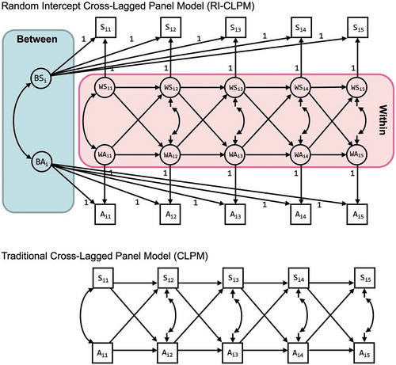

# (PART) Part I DYADS {-} 


# Theory

<!---we need to include this somewhere as general r script---> 

```{r colorize, echo=FALSE}
colorize <- function(x, color) {
  if (knitr::is_latex_output()) {
    sprintf("\\textcolor{%s}{%s}", color, x)
  } else if (knitr::is_html_output()) {
    sprintf("<span style='color: %s;'>%s</span>", color,
      x)
  } else x
}
```


```{r globalsettings, echo=FALSE, warning=FALSE}
library(knitr)
opts_chunk$set(tidy.opts=list(width.cutoff=100),tidy=TRUE, warning = FALSE, message = FALSE,comment = "#>", cache=TRUE)
options(width = 100)

```


The smallest possible social network is a network between two persons (or, more precisely, between two social agents). A network between two persons is also called a dyad. In the clip below I will introduce you to the the main concepts involved in a dyad. Naturally, the same concepts also play a role in larger social networks. 


<iframe src="https://player.vimeo.com/video/452233600" width="640" height="360" frameborder="0" allow="autoplay; fullscreen; picture-in-picture" allowfullscreen></iframe>

For slides, see [here](dyads.pdf).
  
>
After having watched the video you should be able to:  
>
>- give a definition of a dyad.\
- explain what is meant by time-varying and time-constant actor attributes and dyad attributes.\
- explain that relations between ego and alter can be classified  based on whether relations are directed or undirected and on the level of measurement of the relation (i.e. nominal, ordinal, interval, ratio).\
- be familiar with al the synonyms for networks, agents and relations.\
- provide examples of dyads, and the relations between ego and alter.\

    
## Causes of dyads

An important research topic within sociology is assortative mating (or intermarriage) (see: [@kalmijn1998; @schwartz2013; @blossfeld2009]). Scholars in this field try to explain why two people in an exclusive relationship like marriage (or cohabition or best friends) are more similar to one another with respect to defining characteristics (e.g. social class, ethnicity) than two random persons. Assortative mating is a special case of **homophily**. Assortative mating is an important topic within sociology because it is, next to social mobility, an important indicator of the **openness of society**.\  

**Selection** and **influence** processes are important reasons why partners (ego and alter) within a dyad are more similar than two random persons. We may prefer to marry someone who is similar to us on key social dimensions, share our attitudes and opinions and show similar behavior. Once married we may influence each other and assimilate to one another. A third reason why we observe homophily within couples is that partners are likely to have shared and will share the **same social context**. With shared social context we mean the shared social and physical environment and shared life experiences. The environment pre-marriage may in part determine characteristics of the pool of potential marriage partners (i.e. the choice set). For example when neighbourhoods and schools are segregated along ethnic and educational division lines, the potential marriage partners we meet are likely to be more similar to us than a random person in society at large. The shared social environment post-marriage may exert a similar influence on both partners, consider for example economic recession's effects on different geographic regions. This may impact the job opportunities for both partners similarly (assuming they live in the same house). An example of shared life experiences, would be having children. 

> Please note that causes and consequences of homophily are closely related. A shared social context and partner preferences may predict (or cause) homophily within dyads. But once a dyad is formed, a consequence of this relationship may be that partnes become more similar over time, as a result of a shared environment, influence and (de)selection processes. If you want to disentangle these processes, it is necessarry to have information on the degree of homophily between potential marriage partners would they be randomly assigned to one another, the degree of homophily at the beginning of the union, the degree of homophily within couples after a specific time period.  

<!---fill in the blanks--->


> **homophily**
>
> :   Homophily is the principle that a contact between similar people occurs at a
higher rate than among dissimilar people [@mcpherson2001].
You will also come across the terms:
- baseline or structural homophily: this is the degree of homophily we observe simply as a result of the composition of the total choice set, the people with whom we can, in principle, form a relationship.    
- inbreeding homophily: this is the degree of homophily we observe over and above the level of baseline homophily. This may be caused by taste homophily and differences in resources and restrictions (other than set by the total choice set).  
- taste or choice homophily: the extent of homophily induced by personal preferences.\ 

> **openness of society**
>
> :   The openness of society refers to the level of inequality of opportunities within society. The social problem of inequality consists of two sub-problems. The first refers to inequality in outcomes: the unequal distribution of resources (e.g. economic, cultural, social, knowledge, power). The second refers to inquality in opportunities, the association between specific individual or group charactersitics and the likelihood to obtain these resources. Here the opennes of society is clearly linked to the second sub-problem. Where in questions of (inter-generational) social mobility the association between social position of parents and the social position of children is assessed, within the literature on intermarriage the association between the social positions of the two spouses is assessed. Both questions or associations will tell you something about the strenght of class/social position boundaries.  


<!--- do we want to move the GTF to the intro? ---> 

### General Theoretical Framework

In this section, I would like to introduce a General Theoretical Framework (or micro-macro model) which can be used to explain more or less any social phenomena you are interested in. The GTF can thus also be used to explain the emergence of social networks, and thus also to explain the emergence of dyads, and thus also to explain educational intermarriage. 

<iframe src="https://player.vimeo.com/video/453716704" width="640" height="360" frameborder="0" allow="autoplay; fullscreen; picture-in-picture" allowfullscreen></iframe>

For slides, see [here](multilevel-framework.pdf).

>
After having watched the video and after heaving read this page, you should be able to:  
>
- Understand and summarize the building blocks of the multi-level framework which can be used to explain the emergence of social networks.  
  - macro-level (independent) variable(s)  
    - social conditions  
    - restrictions  
  - bridge assumptions (also called social context effects)  
  - Theory of Action  
    - preferences  
    - resources  
    - choice-set  
    - choice-input  
    - choice-output  
  - Transformation rules (also called aggregation mechanism)  
    - social interdependencies  
    - unintended/unforeseen consequences of micro-level behavior  
  - macro-level (dependent) variable
- Provide examples of all building blocks in the context of explaining the emergence of dyads 

For more background reading on the multi-level framework (aka "Coleman-boat", "Coleman-bathtub", "micro-macro models") see [@coleman1994] and [@raub2011, especially paragraph 4.4]. 

`r colorize("**The GTF is a framework, not a theory from which you can deduce hypotheses.**", "red")` Before we can do that, we need to fill in the blanks. That is, we need to make the social contexts (bridge assumptions) explicit. We need a Theory of Action. We need to think of the interdependencies and how they impact the aggregation mechanism.
   
So, let's get started...
  
#### Social context effects {-}  

**Characteristics of the social context** in which people are embedded (the marco- and meso-level) may impact people's preferences and resources.  
Example 1: The level of economic inequality impacts how financial resources are unequally distributed across educational groups within society.  
Hypo1: In countries with more wealth inequality, the difference between educational groups in economic resources is larger.  
Example 2: Societal norms may impact your own views and opinions and thus preferences.  
Hypo2: In countries with more equal gender norms, men's (women's) preferences for a partner with a higher education are stronger (weaker).

#### The special role of restrictions  {-} 
**Restrictions** or constraints also refer to macro-level characteristics but restrictions do not directly impact preferences and resources (i.e. choice input) but instead influence, or *constrain* how these preferences and resources lead to choice-output; we have a constrained choice model. Restrictions - in studies on the emergence of social networks - impact the *choice-set*, the relevant choice-options that a person has.  
If I would like to marry a grizzly bear but if there are no grizzly bears around which I can marry, I cannot act upon my preferences (commonly the example is about Eskimos but that may be considered more politically incorrect). This is called a *structural restriction*. A more realistic example would be the distribution of educational degrees within society, which depend on educational expansion and inequality of educational opportunities.  
Next, to structural restrictions we may also have *normative restrictions*, the formal and informal rules of institutions. A formal normative restriction would be a *law* that forbids me to marry a grizzly bear. An informal normative restriction would be a *social norm*, e.g. my parents who disapprove of my preference to marry a grizzly bear.  
Please note that social norms may thus impact my preferences directly (a social context effect) and indirectly (act as a restriction). 
Example1: Preferences for a partner with a similar educational level are more likely to lead to educational homogamy, if educational degrees are more evenly distributed across men and women. 


`r colorize("In the literature on resources you will see that restrictions are also commonly understood as the absence of resources. I am a stubborn scientists and DO NOT FOLLOW THIS TERMINOLOGY and neither should you.", "red")` 


#### Theory of Action  {-} 

Persons have **preferences** for a partner with a specific educational-level. Commonly, people prefer higher-educated partners (because of instrumental motives) and people have homomphilic preferences. Preferences may differ between persons with different educational levels and between men and women.  
Persons also have **resources** (i.e. economic, cultural, cognitive, social resources) that may affect the search behavior of persons.\ 
Example1: persons with more economic resources have more options to meet different people and may thus select a partner from a larger choice-set.
Hypo1: persons with more economic resources are more likely to marry a partner that meet their preferences, i.e. a more similar partner.  

We would like to apply the GTF to explain the emergence of social networks. The networks we observe are the result of people making and breaking social relations. Consequently, a theory of action to explain decision about social relations should explain not only decisions about making new relations (i.e. **selection**) but also about decision whether or not to maintain or break existing relations (i.e. **deselection**). When we talk about selection processess, we implicitly mean both selection and deselection.\   
Concretely, if we want to explain the degree of intermarriage within society, we need to take into account both who is marrying whom *and* who is divorcing whom! Consider the following example. For some people the saying 'opposite attracts' may hold true and they may be unaware of or ignore the social norm not to intermarry. But once married the couple may face unanticipated sanctions of violating the social norm, they may be ostracized. Being faced with this unanticipated consequence of their marriage decision, the couple may subsequently decide to divorce. In this example, the social norm thus not influences the selection process (more precisely, does not moderate the impact of preferences on marriage decisions) but it does influence the deselection process.\  

>Our Theory of Action assumes a cost benefit evaluation of some sort, in line with Rational Action Theory. However, social scientists' view on human's rationality is different than the view of classical economists. Social scientists speak of restricted or bounded rationality (i.e. a weak rationality assumption); people are not always able to have or process all relevant information to make accurate and correct cost-benefit evaluations. We make questimates about the costs involved in our decision and about the likelihood that our behavior will yield the desired goal. Within sociology, actor's goals are not only economic, monatory goals. Actor's goals can be physical and social goals (i.e. health, happiness, avoidance of downwards mobility). For a nice paper on Rational Action Theory for Sociologists, see [@goldthorpe1998].     

#### Transformation rules {-}  

We now almost have all ingredients to explain (or predict) the degree of intermarriage in society. We 'only' need the aggregation mechanisms: the micro-to-macro link. We thereby need to know the macro-level (intended and unintended) consequences of individual actions. That is, we need to know how the marriage market functions.\   

Let us assume the following: 

- Someone takes the initiative. This is determined by chance. 
- The initial choice-set is formed by 5 random partners of the opposite sex (no assumptions about search behavior). Possible partners who are already married are removed from the initial choice-set. The possible partners that remain constitute the (final) choice set.  
- Persons may prefer a partner with a higher education. These preferences may differ between educational levels and between the sexes.
- Persons choose a partner from their choice set (not marrying is not an option). Possible partners with a higher education have a larger chance to be chosen. How important a partner's education is, depends on the preference of the one taking the initiative. 
- The persons who is being proposed to always accepts. 
- We observe no divorces. 
- Resources do not play any role (e.g the higher educated do not have a larger choice set)
- Educational degrees are either 'high' or 'low'. 

With the above marriage-market model we have a limited number of ingredients that impact the observed degree of educational intermarriage within society:  

- gender composition within society  
- the distribution of educational degrees in  society  
- preferences  
- the number of marriage proposals

I hope you see that marriage choices are interdependent. If I marry person A, you no longer can marry person A. 
These interdependencies make it difficult to predict the macro-level dependent variable, degree of educational homogamy.\ 

Given the market model above, can you predict who will marry whom?  

Well, I can not. You may be a mathematical wizard and able to find a closed solution by some algebra. Another option could be to to make a simplified model and try to simulate the macro-level outcome based purely on our micro-level theory of action and the rules of the marriage market. We call this Agent-Based-Modelling (see <!---and some nice refs--->). I programmed a simply ABM based on the above. There are some parameters in the model which you can change. 

Suppose...   

1. **%_men=50**:  We have an equal gender distribution in society (50% men, 50% women; range: 1-99).    
2. **_men_EducHigh=50**: 50% of our male population is higher educated and 50% is lower educated (range: 1-99).  
3. **_women_EducHigh=50**: 50% of our female population is higher educated and 50% is lower educated (range: 1-99).  
4. **pref_men_EH=0**: Higher educated men do not have any preference with respect to the educational level of their partner. (range: 0-10)
4. **pref_men_EL=0**: Lower educated men do not have any preference with respect to the educational level of their partner. (range: 0-10)
4. **pref_women_EH=0**: Higher educated women do not have any preference with respect to the educational level of their partner. (range: 0-10)
4. **pref_women_EL=0**: Lower educated women do not have any preference with respect to the educational level of their partner. (range: 0-10)

Can you make a guess about the resulting degree of eductional homogamy?? Press update to see if you were correct. 
Play around with (agent-based simulation) model below.  

<iframe src="https://jtolsma.shinyapps.io/marriagemarket/" style="width:100%; height: 50vw;"> </iframe>

Go to app [here](https://jtolsma.shinyapps.io/marriagemarket/)


### Causes of dyads (methods)

When testing hypotheses on assortative mating two methodological approaches can be used. We may predict the **frequency of specific dyads** in our population with loglinear models and the data we use is commonly structured in a table like the one below. 

**Table.** Dyad frequencies 

|  | Wife educ-high| Wife educ-low 
| ----------- | ----------- | ----------- |
| **Husband educ-high** | 350 | 150 |
| **Husband educ-low** | 200 | 400 |

Another approach is to take the **characteristics of the dyad** (e.g. endogamy versus mixed) as the dependent variable. This dependent variable can than be explained by applying (conditional) (multinomial) logistic regression techniques. In this case, the data is commonly structured in long format and looks something like the table below. 

**Table.** Dyad characteristics 

|Dyad_id  | Wife educ| Husband educ | dyad_educ   
| ----------- | ----------- | ----------- | ----------- | 
| 1 | high | low | high-low |  
| 2 | high | low | high-low |  
| 3 | low | low | low-low |  
| 4 | low | high | low-high |  
| 5 | high | low | high-low |  
| ... | ... | ... | ... |  


Which methodology is preferred should depend on your hypotheses and on the data you have to your availability. Since I assume most readers are raised within the regression tradition, in [this section] we will practice with estimating conditional multinomial logistic regression models. 

> Please be aware that in both approaches we normally do not have information on (the frequency or characteristics of) dyads in which there is no relation between ego and alter. Thus, you may have information on characteristics of me and my wife but you do not have information on all other women (or men) I could have married but didn't. I fished my wife out of the sea but we don't know what the other fish looked like. (Luckily my wife is no scientist and won't read this clarification.)


## Consequences of dyads (theory)

Assortative mating, or more generally mating, has consequences for both partners. Just to mention a few: relationship quality; time spend together on culture consumption; divorce rates; number of children; household income; working hours. I hope you see that these concepts all refer to the dyad-level but that you may group these concepts by how they are measured, namely at the dyad-level itself (yes/no divorce, number of children) or at the ego/alter-level and aggregated to the dyad-level (e.g. total working hours of the couple is the sum of the working hours of both individual partners, culture consumption is the consumed culture of both partners (alone and together)). But with both type of concepts, it should be clear that they are the consequence of interdependent actions of both partners (e.g. commonly both partners decide on whether to have and make children). 

Thus, once again, homophily within couples may be the result of: 

- **selection**  
- **shared context** 
- **(dyadic) influence**  

But what do we mean with 'influence'? Let's read the following quote. 

<p class= "quote"> 
People influence one another, and as the importance and immediacy of a group or individual increases, this influence becomes stronger (Latané, 1981). Forces of influence are especially strong within romantic relationships because these relationships are important, are predicated on mutual acceptance, and involve frequent exposure to the habits of one's partner." @bartel2017romantic  
</p> 

It would say this a quite naive conceptualisation of **influence**. It is implicitly assumed that partners will match their opinions/behaviors. Thus influence here is convergence. But why should partners' characteristics converge over time, why would homophily increase? And, it still does not become clear what the 'forces of influence' are. 

Let us make a distinction between:  

  - positive influence: alters become more similar to each other over time  
  - negative influence: alters become more distinct to each other over time 
  - positive feedback influence: characteristics develop in same direction over time  
  
Now suppose these influence processes are the only reasons why alters change (i.e. the *ceteris paribus* condition). How could dyad similarity develop over time. See below: 

```{r, echo=FALSE, fig.cap="Positive influence"}
library(ggplot2)
time <- rep(c(1:10),2)

couple <- rep(c("man", "woman"), each=10)

opinion1 <- 4 + .3*c(1:10)
opinion2 <- 14 + -.3*c(1:10)
opinion <- c(opinion1, opinion2)

df <- data.frame(time,opinion, couple)

ggplot(df, aes(x = time, y = opinion, colour = couple)) +
  geom_line(size=1.5) + 
  geom_point(size=4) + 
  ylim(0,30) 


```

```{r, echo=FALSE, fig.cap="Negative influence"}
library(ggplot2)
time <- rep(c(1:10),2)

couple <- rep(c("man", "woman"), each=10)

opinion1 <- 8 + -.8*c(1:10)
opinion2 <- 14 + .8*c(1:10)
opinion <- c(opinion1, opinion2)

df <- data.frame(time,opinion, couple)

ggplot(df, aes(x = time, y = opinion, colour = couple)) +
  geom_line(size=1.5) + 
  geom_point(size=4) + 
  ylim(0,30) 


```

```{r, echo=FALSE, fig.cap="Positive feedback influence"}
library(ggplot2)
time <- rep(c(1:10),2)
couple <- rep(c("man", "woman"), each=10)
opinion1 <- 4 + .5*c(1:10)
opinion2 <- 14 + .5*c(1:10)
opinion <- c(opinion1, opinion2)
df <- data.frame(time,opinion, couple)

ggplot(df, aes(x = time, y = opinion, colour = couple)) +
  geom_line(size=1.5) + 
  geom_point(size=4) + 
  ylim(0,30) 


```


There are several 'forces of positive influence mechanisms': 

  - information: We may exchange new effective information and arguments with our alters.
  - persuasion (and dissuasion): we may convince, force or pressure our alters to become similar to us.  
  - contagion: this can be taken quite literally, like how the flu spreads but also more metaphorically like how (health) behaviors like drinking, smoking, sporting spread (because our alters increase the opportunities for these behaviors).   
  - assimilation: we may mimic our alters because of a psychological need for similarity, because we think this will be good for our identity / social status, etc.    

`r colorize("The literature is not very clear and consistent about different type of incluence processes and which influence mechanisms are at play. You will thus also see that authors use socialisation when talking about (positive) influence processes. ", "red")` 

There are several 'forces of negative influence mechanisms': 

  - information: We may exchange new counter-effective information and arguments with our alters. This would especially become relevant whey we don't like or belief the source of information and arguments.  
  - persuasion (and dissuasion): we may convince, force or pressure our alters to become dissimilar to us. 
  - polarisation: we may distance ourselves from our alters because of a psychological need for distinctiveness. This would especially become relevant when we are already distinct on key social dimensions.  

There are several 'forces of positive feedback influence mechanisms': 

  - confirmation: information and arguments are repeated and existing opinions and behaviors of both alters reinforced.  
  - competition: we may have a psychological need to be better/higher/more than our alter. 
  

The crucial difference between the positive feedback mechanisms and the positive influence mechanisms are that as a result of the former homophily between the alters does not necessarily change. Note that positive feedback could entail increasing and decreasing the opinion or behavior.    

  
## Consequences of dyads (methods)
The method used to explain consequences of dyads depends on our Unit of Analysis. If it is the dyad itself (e.g. mean relationship quality) methods are relatively straightforward, because we may assume that the observations at the dyad-level are independent. If, on the other hand, the unit of analysis are the partners themselves that make up the dyad, we need to acknowledge that the observations between the partners of the same couple are not independent. In part exactly because partners select and influence each other and share a social context. One solution could be to simply randomly select one partner of each couple or, if partners can be clearly distinguished - for example men and women in heterosexual couples - the different partners could be analyzed separately. A disadvantage of the latter two approaches is, however, that the covariance between the partners cannot be explained anymore, although this may exactly be the focus of our research questions.  A more elegant solution, is to take the interdependencies into account and model these explicitly. This can be done within a multi-level framework and within a structural-equation modelling framework. 

When we discussed the methods to analyze causes of homogamy, we were interested in homophily within couples at one point in time and focus on selection as explanans. Now, when we discuss the consequences of dyads, we are interested in explaining trends in homophily within couples and focus on shared context and influence processes as explanans. 


<!--
**Part 2: Consequences**  

Cook, W. L., & Kenny, D. A. (2005). The actor–partner interdependence model: A model of bidirectional effects in developmental studies. *International Journal of Behavioral Development*, 29(2), 101-109.  

Popp, D., Laursen, B., Kerr, M., Stattin, H., & Burk, W. K. (2008). Modeling homophily over time with an actor-partner interdependence model. *Developmental psychology*, 44(4), 1028.  

Recommended:  


Verbakel, E., & De Graaf, P. M. (2009). Partner effects on labour market participation and job level: opposing mechanisms. *Work, Employment & Society*, 23(4), 635-654.  

Keizer, R., Schenk, N., 2012. Becoming a parent and relationship satisfaction: A longitudinal dyadic perspective. *Journal of Marriage and Family*, 74, 759-773.  

-->  


---  


# Methods  


## Causes  

### Odds Ratio  

### Loglinear Model  

### Conditional multinomial logit model  

## Consequences  {.tabset .tabset-fade}  


```{r packages, echo=FALSE}
#install if necessary 
if (!require("dplyr", character.only = TRUE)) {install.packages("dplyr", dependencies=TRUE)}
if (!require("haven", character.only = TRUE)) {install.packages("haven", dependencies=TRUE)}
#if (!require("purr", character.only = TRUE)) {install.packages("purr", dependencies=TRUE)}
if (!require("lavaan", character.only = TRUE)) {install.packages("lavaan", dependencies=TRUE)}
if (!require("ggplot2", character.only = TRUE)) {install.packages("ggplot2", dependencies=TRUE)}
if (!require("hrbrthemes", character.only = TRUE)) {install.packages("hrbrthemes", dependencies=TRUE)}
if (!require("patchwork", character.only = TRUE)) {install.packages("patchwork", dependencies=TRUE)}
if (!require("mvtnorm", character.only = TRUE)) {install.packages("mvtnorm", dependencies=TRUE)}
if (!require("plotly", character.only = TRUE)) {install.packages("plotyly", dependencies=TRUE)}
if (!require("plotly", character.only = TRUE)) {install.packages("plotyly", dependencies=TRUE)}
if (!require("future.apply", character.only = TRUE)) {install.packages("future.apply", dependencies=TRUE)}

#load packages.
library(dplyr)
library(haven)
library(purrr)
library(tidyr)
library(lavaan)
library(ggplot2)
library(plotly)
library(ggplot2)
library(hrbrthemes)
hrbrthemes::import_roboto_condensed() 
#loadfonts(device = "win", quiet = TRUE) 
library(patchwork)
library(mvtnorm)
library(future.apply)


```

------------------------------------------------------------------------


**PARTNERS AND POLITICS - When do we listen to our partner**'s political opinion? 

<html>
<body>
</iframe>
<a id='LuHtIfAxRu5Ma_5cwLSW1g' class='gie-single' href='http://www.gettyimages.nl/detail/153360657' target='_blank' style='color:#a7a7a7;text-decoration:none;font-weight:normal !important;border:none;display:inline-block;'>Embed from Getty Images</a><script>window.gie=window.gie||function(c){(gie.q=gie.q||[]).push(c)};gie(function(){gie.widgets.load({id:'LuHtIfAxRu5Ma_5cwLSW1g',sig:'1lfLuUoX5Pth1-d8wRyeRSQhCC9Ov2SK_l9qlSdR5X8=',w:'507px',h:'338px',items:'153360657',caption: true ,tld:'nl',is360: false })});</script><script src='//embed-cdn.gettyimages.com/widgets.js' charset='utf-8' async></script>
</body>
</html>

In this part of the book, we will demonstrate the Cross-Lagged Panel Model (CLPM) and how to apply it to assess whether partners influence each other opinions. 

---   

**Relevance**

Why would influence processes between couples be relevant. Well, for many reasons. But influence processes that take place within couples may explain (in part):  

1. Political polarization within society. 
2. Opinion homophily within couples. 

Political polarization between groups (e.g. couples) may be the result of: 

- **selection**  
- **common context** 
- **influence**  


Homophily within couples may be the result of: 

- **selection**  
- **common context** 
- **dyadic influence**  

Let us briefly discuss these three common causes and demonstrate how the resulting homophily within couples could contribute to polarization at the society level. 


```{r, echo=FALSE}


set.seed(98712)
data2 <- rmvnorm(n = 1000, mean=c(2,3), sigma=matrix(c(4,3,3,3.5),ncol=2))
var1 <- c(data2[,1],data2[,2])
data <- data.frame(var1)
data2 <-  data.frame(data2)
data2$mean <- rowMeans(data2)

# Chart
#individuals
p1 <- ggplot(data, aes(x=x) ) +
  # Top
  geom_density( aes(x = var1, y = ..density..), fill="#69b3a2" , alpha=.4) +
  geom_label( aes(x=1, y=-0.05, label="individuals"), color="#69b3a2") +
  theme_ipsum() +
  xlab("some political opinion") + 
  xlim(-6,8) + 
  ylim(-0.05,.3)
#p1
p1 <- p1 + labs(title=bquote(bold("Figure 1.")~"Distribution of opinions within population"))

#selective marriage: couples
p2 <- ggplot(data2, aes(x=x) ) +
  # Top
  geom_density( aes(x = mean, y = ..density..), fill="#404080" , alpha=.4) +
  geom_label( aes(x=2, y=-0.05, label="couples"), color="#404080") +
  theme_ipsum() +
  xlab("some political opinion") + 
  xlim(-6,8) + 
  ylim(-0.05,.3)
# p1 + p2 

p2 <- p2 + labs(title=bquote(bold("Figure 2.")~"Distribution of opinions within couples"), subtitle = "After selective marriage")  

#common influence
data2$mean2 <- ifelse(data2$mean > mean(data2$mean), data2$mean + abs(rnorm(1,0,.2)), data2$mean - abs(rnorm(1,0,.2)))

#data2$mean2 <- (data2$mean2 / sd(data2$mean2)) * sd(data2$mean)

p3 <- ggplot(data2, aes(x=x) ) +
  # Top
  geom_density( aes(x = mean2, y = ..density..), fill="#404080" , alpha=.4) +
  geom_label( aes(x=2, y=-0.05, label="couples"), color="#404080") +
  theme_ipsum() +
  xlab("some political opinion") + 
  xlim(-6,8)  + 
  ylim(-0.05,.3)
# p2 + p3


p3 <- p3 + labs(title=bquote(bold("Figure 3.")~"Distribution of opinions within couples"), subtitle = "After selective marriage and shared life events")  


#within couple influence
data2$X1b <- data2$X1 + (data2$mean2 - data2$mean)
data2$X2b <- data2$X2 + (data2$mean2 - data2$mean)

var1 <- c(data2$X1b,data2$X2b)
data <- data.frame(var1)

p4 <- ggplot(data, aes(x=x) ) +
  # Top
  geom_density( aes(x = var1, y = ..density..), fill="#69b3a2" , alpha=.4) +
  geom_label( aes(x=1, y=-0.05, label="individuals"), color="#69b3a2") +
  theme_ipsum() +
  xlab("some political opinion") + 
  xlim(-6,8) + 
  ylim(-0.05,.3)
# p3 + p4

p4 <- p4 + labs(title=bquote(bold("Figure 4.")~"Distribution of opinions within population"), subtitle = "After selective marriage and shared life events")  


var1 <- c(data2$mean2,data2$mean2)
data <- data.frame(var1)

p5 <- ggplot(data, aes(x=x) ) +
  # Top
  geom_density( aes(x = var1, y = ..density..), fill="#69b3a2" , alpha=.4) +
  geom_label( aes(x=1, y=-0.05, label="individuals"), color="#69b3a2") +
  theme_ipsum() +
  xlab("some political opinion") + 
  xlim(-6,8) + 
  ylim(-0.05,.3)
 #p4 + p5
 
p5 <- p5 + labs(title=bquote(bold("Figure 5.")~"Distribution of opinions within population"), subtitle = "After selective marriage, shared life events and dyadic influence")  


```


---  

### Selection  

We will start with a fictive population of unmarried persons. Some political opinion is distributed as follows within society. 

```{r, echo=FALSE}
p1
```
But these individuals want to get married. Who do they pick. Well, we discussed the marriage market here. 
<!--- insert link to marriage market ---> 

Marriage Market: Constrained Decisions with whom to marry (or cohabit). 

Let us assume that the opinion did not yet change but that bachelors prefer, to some extent, a partner with a similar political opinion. What does the political opinion distribution look like for the mean political opinion of the couples. 

```{r , echo=FALSE}
p2
```

Well, the preference for a partner with similar political opinions was definitely not strong enough to substantially change the opinion distribution.[^sim]

[^sim]: naturally this will depend on how strong we simulate this preference to be. 

Please go to the common context tab. 

<!---insert link here--->

---  

### Common context  

What is a 'common context'?  

Some examples:  

- Shared life experiences:  
  - having kids  
  - poverty  
- Shared environment:
  - pollution
  - housing
  - poverty 

Suppose these life events are more likely for some couples than others. More specifically, assume that the occurrence of life events is associated with the mean political opinion of the couple (at time T). The life event consequently influences the mean political opinion of the couple (at time T+1). 

```{r, echo=FALSE }
p3
```

We now clearly observe polarization between couples. 
However, if we go back to the individual-level again, we do not (clearly) observe polarization between individuals. 

```{r, echo=FALSE}
p4
```

In order to also observe (pronounced) polarization between individuals, there needs to be some influence between partners


---  

### Dyadic Influence  

Why would partners influence each other? Well, we discussed influence here. <!---insert link---> 

- Dyadic (positive) influence:  
  - information  
  - persuasion  
  - need for similarity  


```{r , echo=FALSE}
p5
```

---   

## Dyadic Influence: Mechanisms

What happens within the couple? 
Or phrased otherwise, what could dyadic influence look like? 

- No change (no influence)  
- Common trend (commen context and/or dyadic influence)  
- Convergence (assimilation)   
- Mimic change after 'shocks' 

```{r, echo=FALSE }
library(ggplot2)
time <- rep(c(1:10),2)

couple <- rep(c("man", "woman"), each=10)

opinion1 <- rep(4, 10) 
opinion2 <- rep(14, 10) 
opinion <- c(opinion1, opinion2)

df <- data.frame(time,opinion, couple)

ggplot(df, aes(x = time, y = opinion, colour = couple)) +
  geom_line(size=1.5) + 
  geom_point(size=4) + 
  ylim(0,30) + 
  labs(title=bquote(bold("Figure 6.")~"Opinion development over time: no change."))  


```

```{r, echo=FALSE}
library(ggplot2)
time <- rep(c(1:10),2)
couple <- rep(c("man", "woman"), each=10)
opinion1 <- 4 + .5*c(1:10)
opinion2 <- 14 + .5*c(1:10)
opinion <- c(opinion1, opinion2)
df <- data.frame(time,opinion, couple)

ggplot(df, aes(x = time, y = opinion, colour = couple)) +
  geom_line(size=1.5) + 
  geom_point(size=4) + 
  ylim(0,30) + 
  labs(title=bquote(bold("Figure 7.")~"Opinion development over time: parallel trend."))  


```

```{r, echo=FALSE}
library(ggplot2)
time <- rep(c(1:10),2)

couple <- rep(c("man", "woman"), each=10)

opinion1 <- 4 + .3*c(1:10)
opinion2 <- 14 + -.3*c(1:10)
opinion <- c(opinion1, opinion2)

df <- data.frame(time,opinion, couple)

ggplot(df, aes(x = time, y = opinion, colour = couple)) +
  geom_line(size=1.5) + 
  geom_point(size=4) + 
  ylim(0,30) + 
  labs(title=bquote(bold("Figure 8.")~"Opinion development over time: convergence."))  


```

```{r, echo=FALSE}
library(ggplot2)
time <- rep(c(1:10),2)

couple <- rep(c("man", "woman"), each=10)

opinion1 <- rep(4,10)
opinion2 <- rep(14,10)
opinion1b <- 2*c(0,0,1,1,1,1,1,2,1,1)
opinion2b <- 2*c(0,0,0,1,1,1,2,2,2,1)
opinion1 <- opinion1 + opinion1b
opinion2 <- opinion2 + opinion2b

opinion <- c(opinion1, opinion2)

df <- data.frame(time,opinion, couple)

ggplot(df, aes(x = time, y = opinion, colour = couple)) +
  geom_line(size=1.5) + 
  geom_point(size=4) + 
  ylim(0,30) + 
  geom_segment(x = 2.5, y = 7, xend = 3.5, yend = 13, colour="black", arrow = arrow(length = unit(0.03, "npc"))) + 
  geom_segment(x = 6.5, y = 15, xend = 7.5, yend = 9, colour="black", arrow = arrow(length = unit(0.03, "npc"))) +
  geom_segment(x = 8.5, y = 9, xend = 9.5, yend = 15, colour="black", arrow = arrow(length = unit(0.03, "npc"))) + 
  labs(title=bquote(bold("Figure 9.")~"Opinion development over time: shocks."))  


```

```{r, echo=FALSE}
library(ggplot2)
time <- rep(c(1:10),2)
couple <- rep(c("man", "woman"), each=10)
opinion1 <- 4 + .5*c(1:10)
opinion2 <- 14 + .5*c(1:10)
opinion1b <- 2*c(0,0,1,1,1,1,1,2,1,1)
opinion2b <- 2*c(0,0,0,1,1,1,2,2,2,1)
opinion1 <- opinion1 + opinion1b
opinion2 <- opinion2 + opinion2b

opinion <- c(opinion1, opinion2)
df <- data.frame(time,opinion, couple)

ggplot(df, aes(x = time, y = opinion, colour = couple)) +
  geom_line(size=1.5) + 
  geom_point(size=4) + 
  ylim(0,30) + 
  labs(title=bquote(bold("Figure 10.")~"Opinion development over time: parallel trend with shocks."))  


```

```{r, echo=FALSE}
library(ggplot2)
time <- rep(c(1:10),2)

couple <- rep(c("man", "woman"), each=10)

opinion1 <- 4 + .3*c(1:10)
opinion2 <- 14 + -.3*c(1:10)
opinion1b <- 2*c(0,0,1,1,1,1,1,2,1,1)
opinion2b <- 2*c(0,0,0,1,1,1,2,2,2,1)
opinion1 <- opinion1 + opinion1b
opinion2 <- opinion2 + opinion2b

opinion <- c(opinion1, opinion2)

df <- data.frame(time,opinion, couple)

ggplot(df, aes(x = time, y = opinion, colour = couple)) +
  geom_line(size=1.5) + 
  geom_point(size=4) + 
  ylim(0,30) + 
  labs(title=bquote(bold("Figure 11.")~"Opinion development over time: convergence with shocks."))  


```


---  

## Expectations 

Now, let us try to formulate several hypotheses on influence processes taking place within couples. Naturally, these hypotheses should be derived from existing (and established) theories. But the aim here is not to teach you how to derive hypotheses but to test hypotheses on dyadic influence.  

<p class= "quote">
"People influence one another, and as the importance and immediacy of a group or individual increases, this influence becomes stronger (Latané, 1981). Forces of influence are especially strong within romantic relationships because these relationships are important, are predicated on mutual acceptance, and involve frequent exposure to the habits of one's partner." @bartel2017romantic  
</p>

Naive conceptualisation of **influence**. It is assumed that partners will match their opinions/behaviors. Thus influence here is convergence and reaction to shocks. 

**Hypothesis 1 Partner influence hypothesis**: Partners opinions will become more similar to one another over time.   
We will introduce the CLPM below. Once you are familiar with this model, you see that we can and should formulate a more precise hypothesis 1.  

**Hypo1 RI-CLPM:** When your partner's opinion is relatively high (compared to your partners average opinion over time) at time T, your own opinion will be relatively high (compared to your own average opinion over time) at time T+1. 

<!---
Hypo1 SC-RI-CLPM: Even if we control for structural time trends in political opinions, when your partner's opinion is relatively high (compared to your partners average opinion over time) at time T, your own opinion will be relatively high (compared to your own average opinion over time) at time T+1. 

Hypo1 LT-RI-CLPM: Even if we take into account that...: 
  - the general time trend of men and women will be (positively) associated (i.e. positive covariance of the random slopes);  
  - the mean opinion of your spouse will influence your general time trend (i.e. negative covariance of random intercept of men with random slop of women (and vice versa));
  ...when your partner's opinion is relatively high (compared to your partners average opinion over time) at time T, your own opinion will be relatively high (compared to your own average opinion over time) at time T+1. 
--->

**Hypothesis 2 Male dominance hypothesis**: Women are more influenced by their (male) spouse than men are influenced by their (female) spouse.** 

**Hypothesis 3 Educational dominance hypothesis:** The spouse with the lowest education is more influenced by their partner than the spouse with the highest education.** 


---  


## Data {.tabset .tabset-fade}


<a href="https://www.lissdata.nl/">
  
  </a>

We will use:  

- 11 waves (2008-2014, 2016-2020)  
- More than 3000 heterosexual couples (cohabiting and married)
- Older than 25

We have already constructed a dataset for you guys and gals to work with. 

Please download this data file to your working directory.

[partner_dataprepped.Rdata](addfiles\partner_dataprepped.Rdata)\

### Variables  


Variables of interest and value labels:

-   Education: = highest completed education in years (4-16.5)
-   sex: = 0 = male / 1 = female
-   eu_integration: 0 = eu integration has gone too far / 4 = eu integration should go further
-   immigrants: 0 = immigrants should adjust / 4 immigrants can retain their own culture.
-   euthanasia: 1 = euthanasia should be forbidden / 5 euthanasia should be permitted
-   income: 1 differences in income should increase / 5 differences in income should decrease

<p class= "quote"> **opleiding**  

> Hoogste opleiding met diploma  
> 1 basisonderwijs  
> 2 vmbo  
> 3 havo/vwo  
> 4 mbo  
> 5 hbo  
> 6 wo  
> 7 anders  
> 8 (Nog) geen onderwijs afgerond  
> 9 Volgt nog geen onderwijs  
> Hierbij hebben wij opleiding gecategoriseerd in drie groepen:  
> 1. Laag: basisonderwijs en vmbo  
> 2. Midden: havo/vwo en mbo  
> 3. Hoog: hbo en wo  
> We nemen enkel mensen van 25 jaar en ouder mee. Van hen verwachten we dat ze klaar zijn met hun onderwijscarriere. 

</p>

<p class= "quote"> 
**EU integratie** 

> De Europese integratie is te ver gegaan.  
>  
>  1 Helemaal oneens  
>  2 Oneens   
>  3 Niet eens, niet oneens  
>  4 Eens  
>  5 Helemaal eens  

</p>

<p class= "quote"> 
**Migratie/integratie**

> In Nederland vinden sommigen dat mensen met een migratie achtergrond hier moeten kunnen leven met behoud van de eigen cultuur. Anderen vinden dat zij zich geheel moeten aanpassen aan de Nederlandse cultuur. Waar zou u uzelf plaatsen op een schaal van 1 t/m 5, waarbij 1 behoud van eigen cultuur voor mensen met een migratie achtergrond betekent en 5 dat zij zich geheel moeten aanpassen?  
>  
> 1	behoud van eigen cultuur voor mensen met een migratie achtergrond  
> 2  
> 3	  
> 4	  
> 5	mensen met een migratie achtergrond moeten zich geheel aanpassen  

</p>
---  

### Descriptives

**TO DO**

---  

## Analysis 

As always, make sure to start properly. See here. <!---insert link---> 

We need to do some additional dataprep. Have a look at the dataset. It is in long format but we will need a wide format. 

```{r, echo=FALSE}
#clean the environment. 
rm(list=ls())
load('addfiles/partner_dataprepped.Rdata')

partner_df_wide <- reshape(partner_df_long,
                           direction = 'wide',
                           v.names = names(partner_df_long[2,4:22]),
                           idvar = 'nohouse_encr',
                           timevar = 'time')


```

I know it is a bit cumbersome, but we will make a datafile for each dependent variable separately and will use some shorter names. The data files are stored in a list called `datalist_ori`. 

```{r, echo=TRUE, results='hide'}
datalist_ori <- list()

# dep1: eu_integration

dat <- data.frame(x1=partner_df_wide$eu_integration.m.1)
dat$x2 <- partner_df_wide$eu_integration.m.2
dat$x3 <- partner_df_wide$eu_integration.m.3
dat$x4 <- partner_df_wide$eu_integration.m.4
dat$x5 <- partner_df_wide$eu_integration.m.5
dat$x6 <- partner_df_wide$eu_integration.m.6
dat$x7 <- partner_df_wide$eu_integration.m.7
dat$x8 <- partner_df_wide$eu_integration.m.8
dat$x9 <- partner_df_wide$eu_integration.m.9
dat$x10 <- partner_df_wide$eu_integration.m.10
dat$x11 <- partner_df_wide$eu_integration.m.11

dat$y1 <- partner_df_wide$eu_integration.f.1
dat$y2 <- partner_df_wide$eu_integration.f.2
dat$y3 <- partner_df_wide$eu_integration.f.3
dat$y4 <- partner_df_wide$eu_integration.f.4
dat$y5 <- partner_df_wide$eu_integration.f.5
dat$y6 <- partner_df_wide$eu_integration.f.6
dat$y7 <- partner_df_wide$eu_integration.f.7
dat$y8 <- partner_df_wide$eu_integration.f.8
dat$y9 <- partner_df_wide$eu_integration.f.9
dat$y10 <- partner_df_wide$eu_integration.f.10
dat$y11 <- partner_df_wide$eu_integration.f.11

#treat education as a time stable. And use all available data. 
dat$oplx <- rowMeans(partner_df_wide[,c("oplmet.m.1", "oplmet.m.2",  "oplmet.m.3", "oplmet.m.4", "oplmet.m.5", "oplmet.m.6", "oplmet.m.7",  "oplmet.m.8", "oplmet.m.9", "oplmet.m.10", "oplmet.m.11")], na.rm=T)
dat$oply <- rowMeans(partner_df_wide[,c("oplmet.f.1", "oplmet.f.2",  "oplmet.f.3", "oplmet.f.4", "oplmet.f.5", "oplmet.f.6", "oplmet.f.7",  "oplmet.f.8", "oplmet.f.9", "oplmet.f.10", "oplmet.f.11")], na.rm=T)

#calculate diff in education between men and women
dat$oplxy <- dat$oplx - dat$oply
#table(dat$oplx, dat$oply, useNA = "always")
#hist(dat$oplxy)

#define three groups for multigroup analyses
dat$oplgroup <- ifelse(dat$oplxy > 1, "menhigher", NA)
dat$oplgroup <- ifelse(dat$oplxy < -1, "womenhigher", dat$oplgroup)
dat$oplgroup <- ifelse(dat$oplxy <= 1 & dat$oplxy >= -1, "equal", dat$oplgroup)
#table(dat$oplgroup, useNA = "always")

dat_ori <- dat
datalist_ori[[1]] <- dat_ori


# dep2: immigrants

dat <- data.frame(x1=partner_df_wide$immigrants.m.1)
dat$x2 <- partner_df_wide$immigrants.m.2
dat$x3 <- partner_df_wide$immigrants.m.3
dat$x4 <- partner_df_wide$immigrants.m.4
dat$x5 <- partner_df_wide$immigrants.m.5
dat$x6 <- partner_df_wide$immigrants.m.6
dat$x7 <- partner_df_wide$immigrants.m.7
dat$x8 <- partner_df_wide$immigrants.m.8
dat$x9 <- partner_df_wide$immigrants.m.9
dat$x10 <- partner_df_wide$immigrants.m.10
dat$x11 <- partner_df_wide$immigrants.m.11

dat$y1 <- partner_df_wide$immigrants.f.1
dat$y2 <- partner_df_wide$immigrants.f.2
dat$y3 <- partner_df_wide$immigrants.f.3
dat$y4 <- partner_df_wide$immigrants.f.4
dat$y5 <- partner_df_wide$immigrants.f.5
dat$y6 <- partner_df_wide$immigrants.f.6
dat$y7 <- partner_df_wide$immigrants.f.7
dat$y8 <- partner_df_wide$immigrants.f.8
dat$y9 <- partner_df_wide$immigrants.f.9
dat$y10 <- partner_df_wide$immigrants.f.10
dat$y11 <- partner_df_wide$immigrants.f.11

#treat education as a time stable. And use all available data. 
dat$oplx <- rowMeans(partner_df_wide[,c("oplmet.m.1", "oplmet.m.2",  "oplmet.m.3", "oplmet.m.4", "oplmet.m.5", "oplmet.m.6", "oplmet.m.7",  "oplmet.m.8", "oplmet.m.9", "oplmet.m.10", "oplmet.m.11")], na.rm=T)
dat$oply <- rowMeans(partner_df_wide[,c("oplmet.f.1", "oplmet.f.2",  "oplmet.f.3", "oplmet.f.4", "oplmet.f.5", "oplmet.f.6", "oplmet.f.7",  "oplmet.f.8", "oplmet.f.9", "oplmet.f.10", "oplmet.f.11")], na.rm=T)

#calculate diff in education between men and women
dat$oplxy <- dat$oplx - dat$oply
#table(dat$oplx, dat$oply, useNA = "always")
#hist(dat$oplxy)

#define three groups for multigroup analyses
dat$oplgroup <- ifelse(dat$oplxy > 1, "menhigher", NA)
dat$oplgroup <- ifelse(dat$oplxy < -1, "womenhigher", dat$oplgroup)
dat$oplgroup <- ifelse(dat$oplxy <= 1 & dat$oplxy >= -1, "equal", dat$oplgroup)
#table(dat$oplgroup, useNA = "always")

dat_ori <- dat
datalist_ori[[2]] <- dat_ori

# dep3: euthanasia

dat <- data.frame(x1=partner_df_wide$euthanasia.m.1)
dat$x2 <- partner_df_wide$euthanasia.m.2
dat$x3 <- partner_df_wide$euthanasia.m.3
dat$x4 <- partner_df_wide$euthanasia.m.4
dat$x5 <- partner_df_wide$euthanasia.m.5
dat$x6 <- partner_df_wide$euthanasia.m.6
dat$x7 <- partner_df_wide$euthanasia.m.7
dat$x8 <- partner_df_wide$euthanasia.m.8
dat$x9 <- partner_df_wide$euthanasia.m.9
dat$x10 <- partner_df_wide$euthanasia.m.10
dat$x11 <- partner_df_wide$euthanasia.m.11

dat$y1 <- partner_df_wide$euthanasia.f.1
dat$y2 <- partner_df_wide$euthanasia.f.2
dat$y3 <- partner_df_wide$euthanasia.f.3
dat$y4 <- partner_df_wide$euthanasia.f.4
dat$y5 <- partner_df_wide$euthanasia.f.5
dat$y6 <- partner_df_wide$euthanasia.f.6
dat$y7 <- partner_df_wide$euthanasia.f.7
dat$y8 <- partner_df_wide$euthanasia.f.8
dat$y9 <- partner_df_wide$euthanasia.f.9
dat$y10 <- partner_df_wide$euthanasia.f.10
dat$y11 <- partner_df_wide$euthanasia.f.11

#treat education as a time stable. And use all available data. 
dat$oplx <- rowMeans(partner_df_wide[,c("oplmet.m.1", "oplmet.m.2",  "oplmet.m.3", "oplmet.m.4", "oplmet.m.5", "oplmet.m.6", "oplmet.m.7",  "oplmet.m.8", "oplmet.m.9", "oplmet.m.10", "oplmet.m.11")], na.rm=T)
dat$oply <- rowMeans(partner_df_wide[,c("oplmet.f.1", "oplmet.f.2",  "oplmet.f.3", "oplmet.f.4", "oplmet.f.5", "oplmet.f.6", "oplmet.f.7",  "oplmet.f.8", "oplmet.f.9", "oplmet.f.10", "oplmet.f.11")], na.rm=T)

#calculate diff in education between men and women
dat$oplxy <- dat$oplx - dat$oply
#table(dat$oplx, dat$oply, useNA = "always")
#hist(dat$oplxy)

#define three groups for multigroup analyses
dat$oplgroup <- ifelse(dat$oplxy > 1, "menhigher", NA)
dat$oplgroup <- ifelse(dat$oplxy < -1, "womenhigher", dat$oplgroup)
dat$oplgroup <- ifelse(dat$oplxy <= 1 & dat$oplxy >= -1, "equal", dat$oplgroup)
#table(dat$oplgroup, useNA = "always")

dat_ori <- dat
datalist_ori[[3]] <- dat_ori

# dep4: income_diff

dat <- data.frame(x1=partner_df_wide$income_diff.m.1)
dat$x2 <- partner_df_wide$income_diff.m.2
dat$x3 <- partner_df_wide$income_diff.m.3
dat$x4 <- partner_df_wide$income_diff.m.4
dat$x5 <- partner_df_wide$income_diff.m.5
dat$x6 <- partner_df_wide$income_diff.m.6
dat$x7 <- partner_df_wide$income_diff.m.7
dat$x8 <- partner_df_wide$income_diff.m.8
dat$x9 <- partner_df_wide$income_diff.m.9
dat$x10 <- partner_df_wide$income_diff.m.10
dat$x11 <- partner_df_wide$income_diff.m.11

dat$y1 <- partner_df_wide$income_diff.f.1
dat$y2 <- partner_df_wide$income_diff.f.2
dat$y3 <- partner_df_wide$income_diff.f.3
dat$y4 <- partner_df_wide$income_diff.f.4
dat$y5 <- partner_df_wide$income_diff.f.5
dat$y6 <- partner_df_wide$income_diff.f.6
dat$y7 <- partner_df_wide$income_diff.f.7
dat$y8 <- partner_df_wide$income_diff.f.8
dat$y9 <- partner_df_wide$income_diff.f.9
dat$y10 <- partner_df_wide$income_diff.f.10
dat$y11 <- partner_df_wide$income_diff.f.11

#treat education as a time stable. And use all available data. 
dat$oplx <- rowMeans(partner_df_wide[,c("oplmet.m.1", "oplmet.m.2",  "oplmet.m.3", "oplmet.m.4", "oplmet.m.5", "oplmet.m.6", "oplmet.m.7",  "oplmet.m.8", "oplmet.m.9", "oplmet.m.10", "oplmet.m.11")], na.rm=T)
dat$oply <- rowMeans(partner_df_wide[,c("oplmet.f.1", "oplmet.f.2",  "oplmet.f.3", "oplmet.f.4", "oplmet.f.5", "oplmet.f.6", "oplmet.f.7",  "oplmet.f.8", "oplmet.f.9", "oplmet.f.10", "oplmet.f.11")], na.rm=T)

#calculate diff in education between men and women
dat$oplxy <- dat$oplx - dat$oply
#table(dat$oplx, dat$oply, useNA = "always")
#hist(dat$oplxy)

#define three groups for multigroup analyses
dat$oplgroup <- ifelse(dat$oplxy > 1, "menhigher", NA)
dat$oplgroup <- ifelse(dat$oplxy < -1, "womenhigher", dat$oplgroup)
dat$oplgroup <- ifelse(dat$oplxy <= 1 & dat$oplxy >= -1, "equal", dat$oplgroup)
#table(dat$oplgroup, useNA = "always")

dat_ori <- dat
datalist_ori[[4]] <- dat_ori


```

------------------------------------------------------------------------

## Modelling strategy {.tabset .tabset-fade}

- Actor effects: stability effects  
- Partner effects: influence effects  


Controlling for education.  


```{r, echo=FALSE, out.width="100%", fig.cap="RI-CLPM"}

```
  

Source: [@mulder2020three](https://www.tandfonline.com/doi/full/10.1080/10705511.2020.1784738)


-   We will compare the results across four different modeling strategies:
    -   Cross-lagged Panel Model (CLPM) (11 waves)\
    -   **RI-CLPM (11 waves)**\
    -   RI-CLPM + structural time trends (11 waves)
    -   RI/RS-CLPM (11 waves)


### Robustness

-   We will test our hypotheses for four different dependent variables:

    -   eu-integration\
    -   immigration\
    -   euthanasia\
    -   income differences\

Feel free to re-estimate all models yourself. But it will be way quicker to download all results. 


[results.Rdata](addfiles\results.Rdata)\

------------------------------------------------------------------------

## Results Hypo1 {.tabset .tabset-fade}

**Hypo1 RI-CLPM: When your partner's opinion is relatively high (compared to your partners average opinion over time) at time T, your own opinion will be relatively high (compared to your own average opinion over time) at time T+1.** 


### CLPM  

```{r, eval=FALSE, echo=TRUE}
results <- list()

myModel <- "
  ### control for education
  x1 + x2 + x3 +x4 + x5 + x6 + x7 + x8 + x9 + x10 + x11 ~ e*oplx
  y1 + y2 + y3 +y4 + y5 + y6 + y7 + y8 + y9 + y10 + y11 ~ e*oply
  
  ### Estimate the lagged effects
  x2 ~ a*x1 + b*y1
  x3 ~ a*x2 + b*y2
  x4 ~ a*x3 + b*y3
  x5 ~ a*x4 + b*y4
  x6 ~ a*x5 + b*y5
  x7 ~ a*x6 + b*y6
  x8 ~ a*x7 + b*y7
  x9 ~ a*x8 + b*y8
  x10 ~ a*x9 + b*y9
  x11 ~ a*x10 + b*y10
  
  y2 ~ b*x1 + a*y1
  y3 ~ b*x2 + a*y2
  y4 ~ b*x3 + a*y3
  y5 ~ b*x4 + a*y4
  y6 ~ b*x5 + a*y5
  y7 ~ b*x6 + a*y6
  y8 ~ b*x7 + a*y7
  y9 ~ b*x8 + a*y8
  y10 ~ b*x9 + a*y9
  y11 ~ b*x10 + a*y10

  # Estimate the (residual) covariance between the variables
  x1 ~~ y1 # Covariance
  x2 ~~ y2
  x3 ~~ y3
  x4 ~~ y4
  x5 ~~ y5
  x6 ~~ y6
  x7 ~~ y7
  x8 ~~ y8
  x9 ~~ y9
  x10 ~~ y10
  x11 ~~ y11
  
  # Estimate the (residual) variance of the variables.
  x1 ~~ x1 # Variances
  y1 ~~ y1 
  x2 ~~ x2 # Residual variances
  y2 ~~ y2 
  x3 ~~ x3 
  y3 ~~ y3 
  x4 ~~ x4 
  y4 ~~ y4 
  x5 ~~ x5
  y5 ~~ y5
  x6 ~~ x6
  y6 ~~ y6
  x7 ~~ x7
  y7 ~~ y7 
  x8 ~~ x8 
  y8 ~~ y8 
  x9 ~~ x9 
  y9 ~~ y9 
  x10 ~~ x10
  y10 ~~ y10
  x11 ~~ x11
  y11 ~~ y11
  
  #intercepts
  x1 ~ 1
  y1 ~ 1
  x2 ~ 1
  y2 ~ 1
  x3 ~ 1
  y3 ~ 1
  x4 ~ 1
  y4 ~ 1
  x5 ~ 1
  y5 ~ 1
  x6 ~ 1
  y6 ~ 1
  x7 ~ 1
  y7 ~ 1
  x8 ~ 1
  y8 ~ 1
  x9 ~ 1
  y9 ~ 1
  x10 ~ 1
  y10 ~ 1
  x11 ~ 1
  y11 ~ 1
  
  
"

#Estimate models a bit faster:

estimate <- function(x) lavaan(myModel, data=x, missing = "fiml.x", meanstructure = T )
library(future.apply)
plan(multisession)

results_temp <- future_lapply(datalist_ori, estimate)

results[[1]] <- results_temp[[1]]
results[[2]] <- results_temp[[2]]
results[[3]] <- results_temp[[3]]
results[[4]] <- results_temp[[4]]

names(results)[1:4] <-  c("fitm1h1y1", "fitm1h1y2","fitm1h1y3","fitm1h1y4")

save(results, file="results.RData")
```

```{r, results="hold"}

load("addfiles/results.Rdata")

summary(results[[1]])
summary(results[[2]])
summary(results[[3]])
summary(results[[4]])

```

------------------------------------------------------------------------

### RI-CLPM

```{r, eval=FALSE, echo=TRUE}
RICLPM <- '
  # Create between components (random intercepts)
  RIx =~ 1*x1 + 1*x2 + 1*x3 + 1*x4 + 1*x5 + 1*x6 + 1*x7 + 1*x8 + 1*x9 + 1*x10 + 1*x11
  RIy =~ 1*y1 + 1*y2 + 1*y3 + 1*y4 + 1*y5 + 1*y6 + 1*y7 + 1*y8 + 1*y9 + 1*y10 + 1*y11  
  
  RIx ~ e*oplx
  RIy ~ e*oply
  
  # Create within-person centered variables
  wx1 =~ 1*x1
  wx2 =~ 1*x2
  wx3 =~ 1*x3 
  wx4 =~ 1*x4
  wx5 =~ 1*x5
  wx6 =~ 1*x6
  wx7 =~ 1*x7
  wx8 =~ 1*x8 
  wx9 =~ 1*x9
  wx10 =~ 1*x10
  wx11 =~ 1*x11
 
  wy1 =~ 1*y1
  wy2 =~ 1*y2
  wy3 =~ 1*y3
  wy4 =~ 1*y4
  wy5 =~ 1*y5
  wy6 =~ 1*y6
  wy7 =~ 1*y7
  wy8 =~ 1*y8
  wy9 =~ 1*y9
  wy10 =~ 1*y10
  wy11 =~ 1*y11

  # Estimate the lagged effects between the within-person centered variables.
  wx2 ~ a*wx1 + b*wy1
  wx3 ~ a*wx2 + b*wy2
  wx4 ~ a*wx3 + b*wy3
  wx5 ~ a*wx4 + b*wy4
  wx6 ~ a*wx5 + b*wy5
  wx7 ~ a*wx6 + b*wy6
  wx8 ~ a*wx7 + b*wy7
  wx9 ~ a*wx8 + b*wy8
  wx10 ~ a*wx9 + b*wy9
  wx11 ~ a*wx10 + b*wy10
  
  wy2 ~ b*wx1 + a*wy1
  wy3 ~ b*wx2 + a*wy2
  wy4 ~ b*wx3 + a*wy3
  wy5 ~ b*wx4 + a*wy4
  wy6 ~ b*wx5 + a*wy5
  wy7 ~ b*wx6 + a*wy6
  wy8 ~ b*wx7 + a*wy7
  wy9 ~ b*wx8 + a*wy8
  wy10 ~ b*wx9 + a*wy9
  wy11 ~ b*wx10 + a*wy10

  # Estimate the (residual) covariance between the within-person centered variables
  wx1 ~~ wy1 # Covariance
  wx2 ~~ wy2
  wx3 ~~ wy3
  wx4 ~~ wy4
  wx5 ~~ wy5
  wx6 ~~ wy6
  wx7 ~~ wy7
  wx8 ~~ wy8
  wx9 ~~ wy9
  wx10 ~~ wy10
  wx11 ~~ wy11
  
  # Estimate the variance and covariance of the random intercepts. 
  RIx ~~ RIx
  RIy ~~ RIy
  RIx ~~ RIy

  # Estimate the (residual) variance of the within-person centered variables.
  wx1 ~~ wx1 # Variances
  wy1 ~~ wy1 
  wx2 ~~ wx2 # Residual variances
  wy2 ~~ wy2 
  wx3 ~~ wx3 
  wy3 ~~ wy3 
  wx4 ~~ wx4 
  wy4 ~~ wy4 
  wx5 ~~ wx5
  wy5 ~~ wy5
  wx6 ~~ wx6
  wy6 ~~ wy6
  wx7 ~~ wx7
  wy7 ~~ wy7 
  wx8 ~~ wx8 
  wy8 ~~ wy8 
  wx9 ~~ wx9 
  wy9 ~~ wy9 
  wx10 ~~ wx10
  wy10 ~~ wy10
  wx11 ~~ wx11
  wy11 ~~ wy11
'

#Estimate models a bit faster:

estimate <- function(x) lavaan(RICLPM, data=x, missing = "fiml.x", meanstructure = T )
library(future.apply)
plan(multisession)

results_temp <- future_lapply(datalist_ori, estimate)

results[[5]] <- results_temp[[1]]
results[[6]] <- results_temp[[2]]
results[[7]] <- results_temp[[3]]
results[[8]] <- results_temp[[4]]

names(results)[5:8] <- c("fitm2h1y1", "fitm2h1y2","fitm2h1y3","fitm2h1y4")

```

```{r, results="hold"}

load("addfiles/results.Rdata")
summary(results[[5]])
summary(results[[6]])
summary(results[[7]])
summary(results[[8]])


```

------------------------------------------------------------------------

### SC-RI-CLPM

```{r, eval=FALSE, echo=TRUE}
SCCLPM <- '
  # Create between components 
  RIx =~ 1*x1 + x2 + x3 + x4 + x5 + x6 + x7 + x8 + x9 + x10 + x11
  RIy =~ 1*y1 + y2 + y3 + y4 + y5 + y6 + y7 + y8 + y9 + y10 + y11  
  
  RIx ~ e*oplx
  RIy ~ e*oply
  
  # Create within-person centered variables
  wx1 =~ 1*x1
  wx2 =~ 1*x2
  wx3 =~ 1*x3 
  wx4 =~ 1*x4
  wx5 =~ 1*x5
  wx6 =~ 1*x6
  wx7 =~ 1*x7
  wx8 =~ 1*x8 
  wx9 =~ 1*x9
  wx10 =~ 1*x10
  wx11 =~ 1*x11
 
  wy1 =~ 1*y1
  wy2 =~ 1*y2
  wy3 =~ 1*y3
  wy4 =~ 1*y4
  wy5 =~ 1*y5
  wy6 =~ 1*y6
  wy7 =~ 1*y7
  wy8 =~ 1*y8
  wy9 =~ 1*y9
  wy10 =~ 1*y10
  wy11 =~ 1*y11

  # Estimate the lagged effects between the within-person centered variables.
  wx2 ~ a*wx1 + b*wy1
  wx3 ~ a*wx2 + b*wy2
  wx4 ~ a*wx3 + b*wy3
  wx5 ~ a*wx4 + b*wy4
  wx6 ~ a*wx5 + b*wy5
  wx7 ~ a*wx6 + b*wy6
  wx8 ~ a*wx7 + b*wy7
  wx9 ~ a*wx8 + b*wy8
  wx10 ~ a*wx9 + b*wy9
  wx11 ~ a*wx10 + b*wy10
  
  wy2 ~ b*wx1 + a*wy1
  wy3 ~ b*wx2 + a*wy2
  wy4 ~ b*wx3 + a*wy3
  wy5 ~ b*wx4 + a*wy4
  wy6 ~ b*wx5 + a*wy5
  wy7 ~ b*wx6 + a*wy6
  wy8 ~ b*wx7 + a*wy7
  wy9 ~ b*wx8 + a*wy8
  wy10 ~ b*wx9 + a*wy9
  wy11 ~ b*wx10 + a*wy10

  # Estimate the (residual) covariance between the within-person centered variables
  wx1 ~~ wy1 # Covariance
  wx2 ~~ wy2
  wx3 ~~ wy3
  wx4 ~~ wy4
  wx5 ~~ wy5
  wx6 ~~ wy6
  wx7 ~~ wy7
  wx8 ~~ wy8
  wx9 ~~ wy9
  wx10 ~~ wy10
  wx11 ~~ wy11
  
  # Estimate the variance and covariance of the random intercepts. 
  RIx ~~ RIx
  RIy ~~ RIy
  RIx ~~ RIy

  # Estimate the (residual) variance of the within-person centered variables.
  wx1 ~~ wx1 # Variances
  wy1 ~~ wy1 
  wx2 ~~ wx2 # Residual variances
  wy2 ~~ wy2 
  wx3 ~~ wx3 
  wy3 ~~ wy3 
  wx4 ~~ wx4 
  wy4 ~~ wy4 
  wx5 ~~ wx5
  wy5 ~~ wy5
  wx6 ~~ wx6
  wy6 ~~ wy6
  wx7 ~~ wx7
  wy7 ~~ wy7 
  wx8 ~~ wx8 
  wy8 ~~ wy8 
  wx9 ~~ wx9 
  wy9 ~~ wy9 
  wx10 ~~ wx10
  wy10 ~~ wy10
  wx11 ~~ wx11
  wy11 ~~ wy11
'

#Estimate models a bit faster:

estimate <- function(x) lavaan(SCCLPM, data=x, missing = "fiml.x", meanstructure = T )
library(future.apply)
plan(multisession)

results_temp <- future_lapply(datalist_ori, estimate)

results[[9]] <- results_temp[[1]]
results[[10]] <- results_temp[[2]]
results[[11]] <- results_temp[[3]]
results[[12]] <- results_temp[[4]]

names(results)[9:12] <- c("fitm3h1y1", "fitm3h1y2","fitm3h1y3","fitm3h1y4")
```

```{r, results="hold"}

load("addfiles/results.Rdata")
summary(results[[9]])
summary(results[[10]])
summary(results[[11]])
summary(results[[12]])


```

------------------------------------------------------------------------

### LT-RI-CLPM

```{r , eval=FALSE, echo=TRUE}

LTRICLPM <- '
  # Create between components (random intercepts)
  RIx =~ 1*x1 + 1*x2 + 1*x3 + 1*x4 + 1*x5 + 1*x6 + 1*x7 + 1*x8 + 1*x9 + 1*x10 + 1*x11
  RIy =~ 1*y1 + 1*y2 + 1*y3 + 1*y4 + 1*y5 + 1*y6 + 1*y7 + 1*y8 + 1*y9 + 1*y10 + 1*y11
  
  RIx ~ e*oplx
  RIy ~ e*oply
  
  #Random slopes
  RIsx =~ 1*x1 + 2*x2 + 3*x3 + 4*x4 + 5*x5 + 6*x6 + 7*x7 + 8*x8 + 9*x9 + 10*x10 + 11*x11
  RIsy =~ 1*y1 + 2*y2 + 3*y3 + 4*y4 + 5*y5 + 6*y6 + 7*y7 + 8*y8 + 9*y9 + 10*y10 + 11*y11
  
  RIsx ~ f*oplx
  RIsy ~ f*oply
  
  # Create within-person centered variables
  wx1 =~ 1*x1
  wx2 =~ 1*x2
  wx3 =~ 1*x3 
  wx4 =~ 1*x4
  wx5 =~ 1*x5
  wx6 =~ 1*x6
  wx7 =~ 1*x7
  wx8 =~ 1*x8 
  wx9 =~ 1*x9
  wx10 =~ 1*x10
  wx11 =~ 1*x11
 
  wy1 =~ 1*y1
  wy2 =~ 1*y2
  wy3 =~ 1*y3
  wy4 =~ 1*y4
  wy5 =~ 1*y5
  wy6 =~ 1*y6
  wy7 =~ 1*y7
  wy8 =~ 1*y8
  wy9 =~ 1*y9
  wy10 =~ 1*y10
  wy11 =~ 1*y11

  # Estimate the lagged effects between the within-person centered variables.
  wx2 ~ a*wx1 + b*wy1
  wx3 ~ a*wx2 + b*wy2
  wx4 ~ a*wx3 + b*wy3
  wx5 ~ a*wx4 + b*wy4
  wx6 ~ a*wx5 + b*wy5
  wx7 ~ a*wx6 + b*wy6
  wx8 ~ a*wx7 + b*wy7
  wx9 ~ a*wx8 + b*wy8
  wx10 ~ a*wx9 + b*wy9
  wx11 ~ a*wx10 + b*wy10
  
  wy2 ~ b*wx1 + a*wy1
  wy3 ~ b*wx2 + a*wy2
  wy4 ~ b*wx3 + a*wy3
  wy5 ~ b*wx4 + a*wy4
  wy6 ~ b*wx5 + a*wy5
  wy7 ~ b*wx6 + a*wy6
  wy8 ~ b*wx7 + a*wy7
  wy9 ~ b*wx8 + a*wy8
  wy10 ~ b*wx9 + a*wy9
  wy11 ~ b*wx10 + a*wy10

  # Estimate the (residual) covariance between the within-person centered variables
  wx1 ~~ wy1 # Covariance
  wx2 ~~ wy2
  wx3 ~~ wy3
  wx4 ~~ wy4
  wx5 ~~ wy5
  wx6 ~~ wy6
  wx7 ~~ wy7
  wx8 ~~ wy8
  wx9 ~~ wy9
  wx10 ~~ wy10
  wx11 ~~ wy11
  
  # Estimate the variance and covariance of the random intercepts and random slopes. 
  RIx ~~ RIx
  RIy ~~ RIy
  RIx ~~ RIy #covariance intercepts: interpretation SELECTION
  RIsx ~~ RIsx
  RIsy ~~ RIsy
  RIsx ~~ RIsy #covariance slopes: interpretation COMMON CONTEXT
  RIx ~~ RIsx #covariance intercept/slope: interpretation regression to the mean
  RIy ~~ RIsy
  RIx ~~ RIsy #cross-covariance: interpretation  INFLUENCE? 
  RIy ~~ RIsx

  # Estimate the (residual) variance of the within-person centered variables.
  wx1 ~~ wx1 # Variances
  wy1 ~~ wy1 
  wx2 ~~ wx2 # Residual variances
  wy2 ~~ wy2 
  wx3 ~~ wx3 
  wy3 ~~ wy3 
  wx4 ~~ wx4 
  wy4 ~~ wy4 
  wx5 ~~ wx5
  wy5 ~~ wy5
  wx6 ~~ wx6
  wy6 ~~ wy6
  wx7 ~~ wx7
  wy7 ~~ wy7 
  wx8 ~~ wx8 
  wy8 ~~ wy8 
  wx9 ~~ wx9 
  wy9 ~~ wy9 
  wx10 ~~ wx10
  wy10 ~~ wy10
  wx11 ~~ wx11
  wy11 ~~ wy11
'


#Estimate models a bit faster:

estimate <- function(x) lavaan(LTRICLPM, data=x, missing = "fiml.x", meanstructure = T )
library(future.apply)
plan(multisession)

results_temp <- future_lapply(datalist_ori, estimate)

results[[13]] <- results_temp[[1]]
results[[14]] <- results_temp[[2]]
results[[15]] <- results_temp[[3]]
results[[16]] <- results_temp[[4]]

names(results)[9:12] <- c("fitm4h1y1", "fitm4h1y2","fitm4h1y3","fitm4h1y4")

save(results, file="results.RData")

```

```{r, results="hold"}

load("addfiles/results.Rdata")

summary(results[[13]])
summary(results[[14]])
summary(results[[15]])
summary(results[[16]])

```

------------------------------------------------------------------------

### Summary results hypo1

```{r, results='asis'}

load("addfiles/results.Rdata")

library(knitr) #for kable/kables
library(kableExtra)


#retrieving data to show
#model 1
a <- parameterEstimates(results[[1]])[parameterEstimates(results[[1]])$label=="a",][1,c(5,6,8)]
b <- parameterEstimates(results[[1]])[parameterEstimates(results[[1]])$label=="b",][1,c(5,6,8)]
m1h1y1 <- rbind(a,b)


a <- parameterEstimates(results[[2]])[parameterEstimates(results[[2]])$label=="a",][1,c(5,6,8)]
b <- parameterEstimates(results[[2]])[parameterEstimates(results[[2]])$label=="b",][1,c(5,6,8)]
m1h1y2 <- rbind(a,b)

a <- parameterEstimates(results[[3]])[parameterEstimates(results[[3]])$label=="a",][1,c(5,6,8)]
b <- parameterEstimates(results[[3]])[parameterEstimates(results[[3]])$label=="b",][1,c(5,6,8)]
m1h1y3 <- rbind(a,b)

a <- parameterEstimates(results[[4]])[parameterEstimates(results[[4]])$label=="a",][1,c(5,6,8)]
b <- parameterEstimates(results[[4]])[parameterEstimates(results[[4]])$label=="b",][1,c(5,6,8)]
m1h1y4 <- rbind(a,b)

#model 2
a <- parameterEstimates(results[[5]])[parameterEstimates(results[[5]])$label=="a",][1,c(5,6,8)]
b <- parameterEstimates(results[[5]])[parameterEstimates(results[[5]])$label=="b",][1,c(5,6,8)]
m2h1y1 <- rbind(a,b)

a <- parameterEstimates(results[[6]])[parameterEstimates(results[[6]])$label=="a",][1,c(5,6,8)]
b <- parameterEstimates(results[[6]])[parameterEstimates(results[[6]])$label=="b",][1,c(5,6,8)]
m2h1y2 <- rbind(a,b)

a <- parameterEstimates(results[[7]])[parameterEstimates(results[[7]])$label=="a",][1,c(5,6,8)]
b <- parameterEstimates(results[[7]])[parameterEstimates(results[[7]])$label=="b",][1,c(5,6,8)]
m2h1y3 <- rbind(a,b)

a <- parameterEstimates(results[[8]])[parameterEstimates(results[[8]])$label=="a",][1,c(5,6,8)]
b <- parameterEstimates(results[[8]])[parameterEstimates(results[[8]])$label=="b",][1,c(5,6,8)]
m2h1y4 <- rbind(a,b)
#model 3
a <- parameterEstimates(results[[9]])[parameterEstimates(results[[9]])$label=="a",][1,c(5,6,8)]
b <- parameterEstimates(results[[9]])[parameterEstimates(results[[9]])$label=="b",][1,c(5,6,8)]
m3h1y1 <- rbind(a,b)

a <- parameterEstimates(results[[10]])[parameterEstimates(results[[10]])$label=="a",][1,c(5,6,8)]
b <- parameterEstimates(results[[10]])[parameterEstimates(results[[10]])$label=="b",][1,c(5,6,8)]
m3h1y2 <- rbind(a,b)

a <- parameterEstimates(results[[11]])[parameterEstimates(results[[11]])$label=="a",][1,c(5,6,8)]
b <- parameterEstimates(results[[11]])[parameterEstimates(results[[11]])$label=="b",][1,c(5,6,8)]
m3h1y3 <- rbind(a,b)

a <- parameterEstimates(results[[12]])[parameterEstimates(results[[12]])$label=="a",][1,c(5,6,8)]
b <- parameterEstimates(results[[12]])[parameterEstimates(results[[12]])$label=="b",][1,c(5,6,8)]
m3h1y4 <- rbind(a,b)

#model 4
a <- parameterEstimates(results[[13]])[parameterEstimates(results[[13]])$label=="a",][1,c(5,6,8)]
b <- parameterEstimates(results[[13]])[parameterEstimates(results[[13]])$label=="b",][1,c(5,6,8)]
m4h1y1 <- rbind(a,b)

a <- parameterEstimates(results[[14]])[parameterEstimates(results[[14]])$label=="a",][1,c(5,6,8)]
b <- parameterEstimates(results[[14]])[parameterEstimates(results[[14]])$label=="b",][1,c(5,6,8)]
m4h1y2 <- rbind(a,b)

a <- parameterEstimates(results[[15]])[parameterEstimates(results[[15]])$label=="a",][1,c(5,6,8)]
b <- parameterEstimates(results[[15]])[parameterEstimates(results[[15]])$label=="b",][1,c(5,6,8)]
m4h1y3 <- rbind(a,b)

a <- parameterEstimates(results[[16]])[parameterEstimates(results[[16]])$label=="a",][1,c(5,6,8)]
b <- parameterEstimates(results[[16]])[parameterEstimates(results[[16]])$label=="b",][1,c(5,6,8)]
m4h1y4 <- rbind(a,b)


#combine
#put deps under each other
m1deps <- rbind(m1h1y1, m1h1y2, m1h1y3, m1h1y4)
m2deps <- rbind(m2h1y1, m2h1y2, m2h1y3, m2h1y4)
m3deps <- rbind(m3h1y1, m3h1y2, m3h1y3, m3h1y4)
m4deps <- rbind(m4h1y1, m4h1y2, m4h1y3, m4h1y4)


#put methods next to each other
h1 <- cbind(m1deps, m2deps, m3deps, m4deps)

row.names(h1) <- NULL

paths <- rep(c("stability", "partner-effect"),2)
h1 <- cbind(paths,h1)


hypo1 <- kbl(h1, booktabs=TRUE, digits=2, caption="Results Hypo1", align = "lcccccccccccc") %>%
  add_header_above(c(" ", "CLPM" = 3, "RI-CLPM" = 3, "SC-RI-CLPM" = 3, "LT-RI-CLPM" = 3)) %>%
  pack_rows(index=c("eu-integration"=2, "immigrants"=2, "euthanasia"=2, "income_diff"=2)) %>%
  kable_classic(full_width = F, html_font = "Cambria") %>%
  kable_styling(bootstrap_options = c("striped", "hover", "condensed", "responsive")) %>%
  column_spec(5:7, color = "white", background = "green")

hypo1

```

------------------------------------------------------------------------


### Conclusion hypo1

------------------------------------------------------------------------

## Results Hypo2 {.tabset .tabset-fade}

**Hypo2 RI-CLPM: Women are more influenced by their (male) spouse than men are influenced by their (female) spouse.** 

### CLPM

```{r, eval=FALSE, echo=TRUE}
myModel <- "
  ### control for education
  x1 + x2 + x3 +x4 + x5 + x6 + x7 + x8 + x9 + x10 + x11 ~ ex*oplx
  y1 + y2 + y3 +y4 + y5 + y6 + y7 + y8 + y9 + y10 + y11 ~ ey*oply
  
  ### Estimate the lagged effects
  x2 ~ ax*x1 + bx*y1
  x3 ~ ax*x2 + bx*y2
  x4 ~ ax*x3 + bx*y3
  x5 ~ ax*x4 + bx*y4
  x6 ~ ax*x5 + bx*y5
  x7 ~ ax*x6 + bx*y6
  x8 ~ ax*x7 + bx*y7
  x9 ~ ax*x8 + bx*y8
  x10 ~ ax*x9 + bx*y9
  x11 ~ ax*x10 + bx*y10
  
  y2 ~ by*x1 + ay*y1
  y3 ~ by*x2 + ay*y2
  y4 ~ by*x3 + ay*y3
  y5 ~ by*x4 + ay*y4
  y6 ~ by*x5 + ay*y5
  y7 ~ by*x6 + ay*y6
  y8 ~ by*x7 + ay*y7
  y9 ~ by*x8 + ay*y8
  y10 ~ by*x9 + ay*y9
  y11 ~ by*x10 + ay*y10

  # Estimate the (residual) covariance between the variables
  x1 ~~ y1 # Covariance
  x2 ~~ y2
  x3 ~~ y3
  x4 ~~ y4
  x5 ~~ y5
  x6 ~~ y6
  x7 ~~ y7
  x8 ~~ y8
  x9 ~~ y9
  x10 ~~ y10
  x11 ~~ y11
  
  # Estimate the (residual) variance of the variables.
  x1 ~~ x1 # Variances
  y1 ~~ y1 
  x2 ~~ x2 # Residual variances
  y2 ~~ y2 
  x3 ~~ x3 
  y3 ~~ y3 
  x4 ~~ x4 
  y4 ~~ y4 
  x5 ~~ x5
  y5 ~~ y5
  x6 ~~ x6
  y6 ~~ y6
  x7 ~~ x7
  y7 ~~ y7 
  x8 ~~ x8 
  y8 ~~ y8 
  x9 ~~ x9 
  y9 ~~ y9 
  x10 ~~ x10
  y10 ~~ y10
  x11 ~~ x11
  y11 ~~ y11
  
  #intercepts
  x1 ~ 1
  y1 ~ 1
  x2 ~ 1
  y2 ~ 1
  x3 ~ 1
  y3 ~ 1
  x4 ~ 1
  y4 ~ 1
  x5 ~ 1
  y5 ~ 1
  x6 ~ 1
  y6 ~ 1
  x7 ~ 1
  y7 ~ 1
  x8 ~ 1
  y8 ~ 1
  x9 ~ 1
  y9 ~ 1
  x10 ~ 1
  y10 ~ 1
  x11 ~ 1
  y11 ~ 1
  
  dif1 := ax - ay
  dif2 := bx - by
  dif3 := ex - ey
  
  
"


#Estimate models a bit faster:

estimate <- function(x) lavaan(myModel, data=x, missing = "fiml.x", meanstructure = T )
library(future.apply)
plan(multisession)

results_temp <- future_lapply(datalist_ori, estimate)
summary(results_temp[[1]])
results[[17]] <- results_temp[[1]]
results[[18]] <- results_temp[[2]]
results[[19]] <- results_temp[[3]]
results[[20]] <- results_temp[[4]]

names(results)[17:20] <- c("fitm1h2y1", "fitm1h2y2","fitm1h2y3","fitm1h2y4")


```

```{r, results="hold"}

load("addfiles/results.Rdata")
summary(results[[17]])
summary(results[[18]])
summary(results[[19]])
summary(results[[20]])
```

------------------------------------------------------------------------

### RI-CLPM

```{r, eval=FALSE, echo=TRUE}
RICLPM <- '
  # Create between components (random intercepts)
  RIx =~ 1*x1 + 1*x2 + 1*x3 + 1*x4 + 1*x5 + 1*x6 + 1*x7 + 1*x8 + 1*x9 + 1*x10 + 1*x11
  RIy =~ 1*y1 + 1*y2 + 1*y3 + 1*y4 + 1*y5 + 1*y6 + 1*y7 + 1*y8 + 1*y9 + 1*y10 + 1*y11  
  
  RIx ~ ex*oplx
  RIy ~ ey*oply
  
  # Create within-person centered variables
  wx1 =~ 1*x1
  wx2 =~ 1*x2
  wx3 =~ 1*x3 
  wx4 =~ 1*x4
  wx5 =~ 1*x5
  wx6 =~ 1*x6
  wx7 =~ 1*x7
  wx8 =~ 1*x8 
  wx9 =~ 1*x9
  wx10 =~ 1*x10
  wx11 =~ 1*x11
 
  wy1 =~ 1*y1
  wy2 =~ 1*y2
  wy3 =~ 1*y3
  wy4 =~ 1*y4
  wy5 =~ 1*y5
  wy6 =~ 1*y6
  wy7 =~ 1*y7
  wy8 =~ 1*y8
  wy9 =~ 1*y9
  wy10 =~ 1*y10
  wy11 =~ 1*y11

  # Estimate the lagged effects between the within-person centered variables.
  x2 ~ ax*x1 + bx*y1
  x3 ~ ax*x2 + bx*y2
  x4 ~ ax*x3 + bx*y3
  x5 ~ ax*x4 + bx*y4
  x6 ~ ax*x5 + bx*y5
  x7 ~ ax*x6 + bx*y6
  x8 ~ ax*x7 + bx*y7
  x9 ~ ax*x8 + bx*y8
  x10 ~ ax*x9 + bx*y9
  x11 ~ ax*x10 + bx*y10
  
  y2 ~ by*x1 + ay*y1
  y3 ~ by*x2 + ay*y2
  y4 ~ by*x3 + ay*y3
  y5 ~ by*x4 + ay*y4
  y6 ~ by*x5 + ay*y5
  y7 ~ by*x6 + ay*y6
  y8 ~ by*x7 + ay*y7
  y9 ~ by*x8 + ay*y8
  y10 ~ by*x9 + ay*y9
  y11 ~ by*x10 + ay*y10

  dif1 := ax - ay
  dif2 := bx - by
  dif3 := ex - ey

  # Estimate the (residual) covariance between the within-person centered variables
  wx1 ~~ wy1 # Covariance
  wx2 ~~ wy2
  wx3 ~~ wy3
  wx4 ~~ wy4
  wx5 ~~ wy5
  wx6 ~~ wy6
  wx7 ~~ wy7
  wx8 ~~ wy8
  wx9 ~~ wy9
  wx10 ~~ wy10
  wx11 ~~ wy11
  
  # Estimate the variance and covariance of the random intercepts. 
  RIx ~~ RIx
  RIy ~~ RIy
  RIx ~~ RIy

  # Estimate the (residual) variance of the within-person centered variables.
  wx1 ~~ wx1 # Variances
  wy1 ~~ wy1 
  wx2 ~~ wx2 # Residual variances
  wy2 ~~ wy2 
  wx3 ~~ wx3 
  wy3 ~~ wy3 
  wx4 ~~ wx4 
  wy4 ~~ wy4 
  wx5 ~~ wx5
  wy5 ~~ wy5
  wx6 ~~ wx6
  wy6 ~~ wy6
  wx7 ~~ wx7
  wy7 ~~ wy7 
  wx8 ~~ wx8 
  wy8 ~~ wy8 
  wx9 ~~ wx9 
  wy9 ~~ wy9 
  wx10 ~~ wx10
  wy10 ~~ wy10
  wx11 ~~ wx11
  wy11 ~~ wy11
'


#Estimate models a bit faster:

estimate <- function(x) lavaan(RICLPM, data=x, missing = "fiml.x", meanstructure = T )
library(future.apply)
plan(multisession)

results_temp <- future_lapply(datalist_ori, estimate)
summary(results_temp[[4]])

results[[21]] <- results_temp[[1]]
results[[22]] <- results_temp[[2]]
results[[23]] <- results_temp[[3]]
results[[24]] <- results_temp[[4]]

names(results)[21:24] <- c("fitm2h2y1", "fitm2h2y2","fitm2h2y3","fitm2h2y4")

save(results, file="results.RData")

```

```{r, results="hold"}

load("addfiles/results.Rdata")
summary(results[[21]])
summary(results[[22]])
summary(results[[23]])
summary(results[[24]])

```

------------------------------------------------------------------------

### SC-RI-CLPM

```{r, eval=FALSE, echo=TRUE}

SCCLPM <- '
  # Create between components (random intercepts)
  RIx =~ 1*x1 + x2 + x3 + x4 + x5 + x6 + x7 + x8 + x9 + x10 + x11
  RIy =~ 1*y1 + y2 + y3 + y4 + y5 + y6 + y7 + y8 + y9 + y10 + y11  
  
  RIx ~ ex*oplx
  RIy ~ ey*oply
  
  # Create within-person centered variables
  wx1 =~ 1*x1
  wx2 =~ 1*x2
  wx3 =~ 1*x3 
  wx4 =~ 1*x4
  wx5 =~ 1*x5
  wx6 =~ 1*x6
  wx7 =~ 1*x7
  wx8 =~ 1*x8 
  wx9 =~ 1*x9
  wx10 =~ 1*x10
  wx11 =~ 1*x11
 
  wy1 =~ 1*y1
  wy2 =~ 1*y2
  wy3 =~ 1*y3
  wy4 =~ 1*y4
  wy5 =~ 1*y5
  wy6 =~ 1*y6
  wy7 =~ 1*y7
  wy8 =~ 1*y8
  wy9 =~ 1*y9
  wy10 =~ 1*y10
  wy11 =~ 1*y11

  # Estimate the lagged effects between the within-person centered variables.
  x2 ~ ax*x1 + bx*y1
  x3 ~ ax*x2 + bx*y2
  x4 ~ ax*x3 + bx*y3
  x5 ~ ax*x4 + bx*y4
  x6 ~ ax*x5 + bx*y5
  x7 ~ ax*x6 + bx*y6
  x8 ~ ax*x7 + bx*y7
  x9 ~ ax*x8 + bx*y8
  x10 ~ ax*x9 + bx*y9
  x11 ~ ax*x10 + bx*y10
  
  y2 ~ by*x1 + ay*y1
  y3 ~ by*x2 + ay*y2
  y4 ~ by*x3 + ay*y3
  y5 ~ by*x4 + ay*y4
  y6 ~ by*x5 + ay*y5
  y7 ~ by*x6 + ay*y6
  y8 ~ by*x7 + ay*y7
  y9 ~ by*x8 + ay*y8
  y10 ~ by*x9 + ay*y9
  y11 ~ by*x10 + ay*y10

  dif1 := ax - ay
  dif2 := bx - by
  dif3 := ex - ey

  # Estimate the (residual) covariance between the within-person centered variables
  wx1 ~~ wy1 # Covariance
  wx2 ~~ wy2
  wx3 ~~ wy3
  wx4 ~~ wy4
  wx5 ~~ wy5
  wx6 ~~ wy6
  wx7 ~~ wy7
  wx8 ~~ wy8
  wx9 ~~ wy9
  wx10 ~~ wy10
  wx11 ~~ wy11
  
  # Estimate the variance and covariance of the random intercepts. 
  RIx ~~ RIx
  RIy ~~ RIy
  RIx ~~ RIy

  # Estimate the (residual) variance of the within-person centered variables.
  wx1 ~~ wx1 # Variances
  wy1 ~~ wy1 
  wx2 ~~ wx2 # Residual variances
  wy2 ~~ wy2 
  wx3 ~~ wx3 
  wy3 ~~ wy3 
  wx4 ~~ wx4 
  wy4 ~~ wy4 
  wx5 ~~ wx5
  wy5 ~~ wy5
  wx6 ~~ wx6
  wy6 ~~ wy6
  wx7 ~~ wx7
  wy7 ~~ wy7 
  wx8 ~~ wx8 
  wy8 ~~ wy8 
  wx9 ~~ wx9 
  wy9 ~~ wy9 
  wx10 ~~ wx10
  wy10 ~~ wy10
  wx11 ~~ wx11
  wy11 ~~ wy11
'


#Estimate models a bit faster:

estimate <- function(x) lavaan(SCCLPM, data=x, missing = "fiml.x", meanstructure = T )
library(future.apply)
plan(multisession)

results_temp <- future_lapply(datalist_ori, estimate)
summary(results_temp[[4]])

results[[25]] <- results_temp[[1]]
results[[26]] <- results_temp[[2]]
results[[27]] <- results_temp[[3]]
results[[28]] <- results_temp[[4]]

names(results)[25:28] <- c("fitm3h2y1", "fitm3h2y2","fitm3h2y3","fitm3h2y4")

save(results, file="results.RData")

```

```{r, results="hold"}

load("addfiles/results.Rdata")
summary(results[[25]])
summary(results[[26]])
summary(results[[27]])
summary(results[[28]])

```

------------------------------------------------------------------------

### LT-RI-CLPM

```{r, eval=FALSE, echo=TRUE}

LTRICLPM <- '
  # Create between components (random intercepts)
  RIx =~ 1*x1 + 1*x2 + 1*x3 + 1*x4 + 1*x5 + 1*x6 + 1*x7 + 1*x8 + 1*x9 + 1*x10 + 1*x11
  RIy =~ 1*y1 + 1*y2 + 1*y3 + 1*y4 + 1*y5 + 1*y6 + 1*y7 + 1*y8 + 1*y9 + 1*y10 + 1*y11
  
  RIx ~ ex*oplx
  RIy ~ ey*oply
  
  #Random slopes
  RIsx =~ 1*x1 + 2*x2 + 3*x3 + 4*x4 + 5*x5 + 6*x6 + 7*x7 + 8*x8 + 9*x9 + 10*x10 + 11*x11
  RIsy =~ 1*y1 + 2*y2 + 3*y3 + 4*y4 + 5*y5 + 6*y6 + 7*y7 + 8*y8 + 9*y9 + 10*y10 + 11*y11
  
  RIsx ~ fx*oplx
  RIsy ~ fy*oply
  
  # Create within-person centered variables
  wx1 =~ 1*x1
  wx2 =~ 1*x2
  wx3 =~ 1*x3 
  wx4 =~ 1*x4
  wx5 =~ 1*x5
  wx6 =~ 1*x6
  wx7 =~ 1*x7
  wx8 =~ 1*x8 
  wx9 =~ 1*x9
  wx10 =~ 1*x10
  wx11 =~ 1*x11
 
  wy1 =~ 1*y1
  wy2 =~ 1*y2
  wy3 =~ 1*y3
  wy4 =~ 1*y4
  wy5 =~ 1*y5
  wy6 =~ 1*y6
  wy7 =~ 1*y7
  wy8 =~ 1*y8
  wy9 =~ 1*y9
  wy10 =~ 1*y10
  wy11 =~ 1*y11

 # Estimate the lagged effects between the within-person centered variables.
  x2 ~ ax*x1 + bx*y1
  x3 ~ ax*x2 + bx*y2
  x4 ~ ax*x3 + bx*y3
  x5 ~ ax*x4 + bx*y4
  x6 ~ ax*x5 + bx*y5
  x7 ~ ax*x6 + bx*y6
  x8 ~ ax*x7 + bx*y7
  x9 ~ ax*x8 + bx*y8
  x10 ~ ax*x9 + bx*y9
  x11 ~ ax*x10 + bx*y10
  
  y2 ~ by*x1 + ay*y1
  y3 ~ by*x2 + ay*y2
  y4 ~ by*x3 + ay*y3
  y5 ~ by*x4 + ay*y4
  y6 ~ by*x5 + ay*y5
  y7 ~ by*x6 + ay*y6
  y8 ~ by*x7 + ay*y7
  y9 ~ by*x8 + ay*y8
  y10 ~ by*x9 + ay*y9
  y11 ~ by*x10 + ay*y10

  dif1 := ax - ay
  dif2 := bx - by
  dif3 := ex - ey
  dif4 := fx - fy

  # Estimate the (residual) covariance between the within-person centered variables
  wx1 ~~ wy1 # Covariance
  wx2 ~~ wy2
  wx3 ~~ wy3
  wx4 ~~ wy4
  wx5 ~~ wy5
  wx6 ~~ wy6
  wx7 ~~ wy7
  wx8 ~~ wy8
  wx9 ~~ wy9
  wx10 ~~ wy10
  wx11 ~~ wy11
  
  # Estimate the variance and covariance of the random intercepts and random slopes. 
  RIx ~~ RIx
  RIy ~~ RIy
  RIx ~~ RIy #covariance intercepts: interpretation SELECTION
  RIsx ~~ RIsx
  RIsy ~~ RIsy
  RIsx ~~ RIsy #covariance slopes: interpretation COMMON CONTEXT
  RIx ~~ RIsx #covariance intercept/slope: interpretation regression to the mean
  RIy ~~ RIsy
  RIx ~~ RIsy #cross-covariance: interpretation  INFLUENCE? 
  RIy ~~ RIsx

  # Estimate the (residual) variance of the within-person centered variables.
  wx1 ~~ wx1 # Variances
  wy1 ~~ wy1 
  wx2 ~~ wx2 # Residual variances
  wy2 ~~ wy2 
  wx3 ~~ wx3 
  wy3 ~~ wy3 
  wx4 ~~ wx4 
  wy4 ~~ wy4 
  wx5 ~~ wx5
  wy5 ~~ wy5
  wx6 ~~ wx6
  wy6 ~~ wy6
  wx7 ~~ wx7
  wy7 ~~ wy7 
  wx8 ~~ wx8 
  wy8 ~~ wy8 
  wx9 ~~ wx9 
  wy9 ~~ wy9 
  wx10 ~~ wx10
  wy10 ~~ wy10
  wx11 ~~ wx11
  wy11 ~~ wy11
'
#Estimate models a bit faster:

estimate <- function(x) lavaan(LTRICLPM, data=x, missing = "fiml.x", meanstructure = T )
library(future.apply)
plan(multisession)

results_temp <- future_lapply(datalist_ori, estimate)
summary(results_temp[[4]])

results[[29]] <- results_temp[[1]]
results[[30]] <- results_temp[[2]]
results[[31]] <- results_temp[[3]]
results[[32]] <- results_temp[[4]]

names(results)[29:32] <- c("fitm4h2y1", "fitm4h2y2","fitm4h2y3","fitm4h2y4")

save(results, file="results.RData")

```

```{r, results="hold"}

load("addfiles/results.Rdata")
summary(results[[29]])
summary(results[[30]])
summary(results[[31]])
summary(results[[32]])

```

------------------------------------------------------------------------

### Summary results Hypo2

```{r, results='asis'}

load("addfiles/results.Rdata")


library(knitr) #for kable/kables
library(kableExtra)


#retrieving data to show
#model 1
ax <- parameterEstimates(results[[17]])[parameterEstimates(results[[17]])$label=="ax",][1,c(5,6,8)]
bx <- parameterEstimates(results[[17]])[parameterEstimates(results[[17]])$label=="bx",][1,c(5,6,8)]
ay <- parameterEstimates(results[[17]])[parameterEstimates(results[[17]])$label=="ay",][1,c(5,6,8)]
by <- parameterEstimates(results[[17]])[parameterEstimates(results[[17]])$label=="by",][1,c(5,6,8)]
m1h2y1 <- rbind(ax,ay,bx,by)

ax <- parameterEstimates(results[[18]])[parameterEstimates(results[[18]])$label=="ax",][1,c(5,6,8)]
bx <- parameterEstimates(results[[18]])[parameterEstimates(results[[18]])$label=="bx",][1,c(5,6,8)]
ay <- parameterEstimates(results[[18]])[parameterEstimates(results[[18]])$label=="ay",][1,c(5,6,8)]
by <- parameterEstimates(results[[18]])[parameterEstimates(results[[18]])$label=="by",][1,c(5,6,8)]
m1h2y2 <- rbind(ax,ay,bx,by)

ax <- parameterEstimates(results[[19]])[parameterEstimates(results[[19]])$label=="ax",][1,c(5,6,8)]
bx <- parameterEstimates(results[[19]])[parameterEstimates(results[[19]])$label=="bx",][1,c(5,6,8)]
ay <- parameterEstimates(results[[19]])[parameterEstimates(results[[19]])$label=="ay",][1,c(5,6,8)]
by <- parameterEstimates(results[[19]])[parameterEstimates(results[[19]])$label=="by",][1,c(5,6,8)]
m1h2y3 <- rbind(ax,ay,bx,by)

ax <- parameterEstimates(results[[20]])[parameterEstimates(results[[20]])$label=="ax",][1,c(5,6,8)]
bx <- parameterEstimates(results[[20]])[parameterEstimates(results[[20]])$label=="bx",][1,c(5,6,8)]
ay <- parameterEstimates(results[[20]])[parameterEstimates(results[[20]])$label=="ay",][1,c(5,6,8)]
by <- parameterEstimates(results[[20]])[parameterEstimates(results[[20]])$label=="by",][1,c(5,6,8)]
m1h2y4 <- rbind(ax,ay,bx,by)

#model 2
ax <- parameterEstimates(results[[21]])[parameterEstimates(results[[21]])$label=="ax",][1,c(5,6,8)]
bx <- parameterEstimates(results[[21]])[parameterEstimates(results[[21]])$label=="bx",][1,c(5,6,8)]
ay <- parameterEstimates(results[[21]])[parameterEstimates(results[[21]])$label=="ay",][1,c(5,6,8)]
by <- parameterEstimates(results[[21]])[parameterEstimates(results[[21]])$label=="by",][1,c(5,6,8)]
m2h2y1 <- rbind(ax,ay,bx,by)

ax <- parameterEstimates(results[[22]])[parameterEstimates(results[[22]])$label=="ax",][1,c(5,6,8)]
bx <- parameterEstimates(results[[22]])[parameterEstimates(results[[22]])$label=="bx",][1,c(5,6,8)]
ay <- parameterEstimates(results[[22]])[parameterEstimates(results[[22]])$label=="ay",][1,c(5,6,8)]
by <- parameterEstimates(results[[22]])[parameterEstimates(results[[22]])$label=="by",][1,c(5,6,8)]
m2h2y2 <- rbind(ax,ay,bx,by)

ax <- parameterEstimates(results[[23]])[parameterEstimates(results[[23]])$label=="ax",][1,c(5,6,8)]
bx <- parameterEstimates(results[[23]])[parameterEstimates(results[[23]])$label=="bx",][1,c(5,6,8)]
ay <- parameterEstimates(results[[23]])[parameterEstimates(results[[23]])$label=="ay",][1,c(5,6,8)]
by <- parameterEstimates(results[[23]])[parameterEstimates(results[[23]])$label=="by",][1,c(5,6,8)]
m2h2y3 <- rbind(ax,ay,bx,by)

ax <- parameterEstimates(results[[24]])[parameterEstimates(results[[24]])$label=="ax",][1,c(5,6,8)]
bx <- parameterEstimates(results[[24]])[parameterEstimates(results[[24]])$label=="bx",][1,c(5,6,8)]
ay <- parameterEstimates(results[[24]])[parameterEstimates(results[[24]])$label=="ay",][1,c(5,6,8)]
by <- parameterEstimates(results[[24]])[parameterEstimates(results[[24]])$label=="by",][1,c(5,6,8)]
m2h2y4 <- rbind(ax,ay,bx,by)

#model 3
ax <- parameterEstimates(results[[25]])[parameterEstimates(results[[25]])$label=="ax",][1,c(5,6,8)]
bx <- parameterEstimates(results[[25]])[parameterEstimates(results[[25]])$label=="bx",][1,c(5,6,8)]
ay <- parameterEstimates(results[[25]])[parameterEstimates(results[[25]])$label=="ay",][1,c(5,6,8)]
by <- parameterEstimates(results[[25]])[parameterEstimates(results[[25]])$label=="by",][1,c(5,6,8)]
m3h2y1 <- rbind(ax,ay,bx,by)

ax <- parameterEstimates(results[[26]])[parameterEstimates(results[[26]])$label=="ax",][1,c(5,6,8)]
bx <- parameterEstimates(results[[26]])[parameterEstimates(results[[26]])$label=="bx",][1,c(5,6,8)]
ay <- parameterEstimates(results[[26]])[parameterEstimates(results[[26]])$label=="ay",][1,c(5,6,8)]
by <- parameterEstimates(results[[26]])[parameterEstimates(results[[26]])$label=="by",][1,c(5,6,8)]
m3h2y2 <- rbind(ax,ay,bx,by)

ax <- parameterEstimates(results[[27]])[parameterEstimates(results[[27]])$label=="ax",][1,c(5,6,8)]
bx <- parameterEstimates(results[[27]])[parameterEstimates(results[[27]])$label=="bx",][1,c(5,6,8)]
ay <- parameterEstimates(results[[27]])[parameterEstimates(results[[27]])$label=="ay",][1,c(5,6,8)]
by <- parameterEstimates(results[[27]])[parameterEstimates(results[[27]])$label=="by",][1,c(5,6,8)]
m3h2y3 <- rbind(ax,ay,bx,by)

ax <- parameterEstimates(results[[28]])[parameterEstimates(results[[28]])$label=="ax",][1,c(5,6,8)]
bx <- parameterEstimates(results[[28]])[parameterEstimates(results[[28]])$label=="bx",][1,c(5,6,8)]
ay <- parameterEstimates(results[[28]])[parameterEstimates(results[[28]])$label=="ay",][1,c(5,6,8)]
by <- parameterEstimates(results[[28]])[parameterEstimates(results[[28]])$label=="by",][1,c(5,6,8)]
m3h2y4 <- rbind(ax,ay,bx,by)

#model 4
ax <- parameterEstimates(results[[29]])[parameterEstimates(results[[29]])$label=="ax",][1,c(5,6,8)]
bx <- parameterEstimates(results[[29]])[parameterEstimates(results[[29]])$label=="bx",][1,c(5,6,8)]
ay <- parameterEstimates(results[[29]])[parameterEstimates(results[[29]])$label=="ay",][1,c(5,6,8)]
by <- parameterEstimates(results[[29]])[parameterEstimates(results[[29]])$label=="by",][1,c(5,6,8)]
m4h2y1 <- rbind(ax,ay,bx,by)

ax <- parameterEstimates(results[[30]])[parameterEstimates(results[[30]])$label=="ax",][1,c(5,6,8)]
bx <- parameterEstimates(results[[30]])[parameterEstimates(results[[30]])$label=="bx",][1,c(5,6,8)]
ay <- parameterEstimates(results[[30]])[parameterEstimates(results[[30]])$label=="ay",][1,c(5,6,8)]
by <- parameterEstimates(results[[30]])[parameterEstimates(results[[30]])$label=="by",][1,c(5,6,8)]
m4h2y2 <- rbind(ax,ay,bx,by)

ax <- parameterEstimates(results[[31]])[parameterEstimates(results[[31]])$label=="ax",][1,c(5,6,8)]
bx <- parameterEstimates(results[[31]])[parameterEstimates(results[[31]])$label=="bx",][1,c(5,6,8)]
ay <- parameterEstimates(results[[31]])[parameterEstimates(results[[31]])$label=="ay",][1,c(5,6,8)]
by <- parameterEstimates(results[[31]])[parameterEstimates(results[[31]])$label=="by",][1,c(5,6,8)]
m4h2y3 <- rbind(ax,ay,bx,by)

ax <- parameterEstimates(results[[32]])[parameterEstimates(results[[32]])$label=="ax",][1,c(5,6,8)]
bx <- parameterEstimates(results[[32]])[parameterEstimates(results[[32]])$label=="bx",][1,c(5,6,8)]
ay <- parameterEstimates(results[[32]])[parameterEstimates(results[[32]])$label=="ay",][1,c(5,6,8)]
by <- parameterEstimates(results[[32]])[parameterEstimates(results[[32]])$label=="by",][1,c(5,6,8)]
m4h2y4 <- rbind(ax,ay,bx,by)

#combine
#put deps under each other
m1deps <- rbind(m1h2y1, m1h2y2, m1h2y3, m1h2y4)
m2deps <- rbind(m2h2y1, m2h2y2, m2h2y3, m2h2y4)
m3deps <- rbind(m3h2y1, m3h2y2, m3h2y3, m3h2y4)
m4deps <- rbind(m4h2y1, m4h2y2, m4h2y3, m4h2y4)

#put methods next to each other
h2 <- cbind(m1deps, m2deps, m3deps, m4deps)
row.names(h2) <- NULL

paths <- rep(c("Men:stability", "Women:stability", "Men:partner-effect", "Women:partner-effect"),2)
h2 <- cbind(paths,h2)


hypo2 <- kbl(h2, booktabs=TRUE, digits=2, caption="Results Hypo2", align = "lcccccccccccc") %>%
  add_header_above(c(" ", "CLPM" = 3, "RI-CLPM" = 3, "SC-RI-CLPM" = 3, "LT-RI-CLPM" = 3)) %>%
  pack_rows(index=c("eu-integration"=4, "immigrants"=4, "euthanasia"=4, "income_diff"=4)) %>%
  kable_classic(full_width = F, html_font = "Cambria") %>%
  kable_styling(bootstrap_options = c("striped", "hover", "condensed", "responsive")) %>%
  column_spec(5:7, color = "white", background = "green")

hypo2


```

------------------------------------------------------------------------

### Conclusion Hypo2

------------------------------------------------------------------------


---  

# Data  

## Sampling  

## Ethical considerations  

## Measurement  

---  


