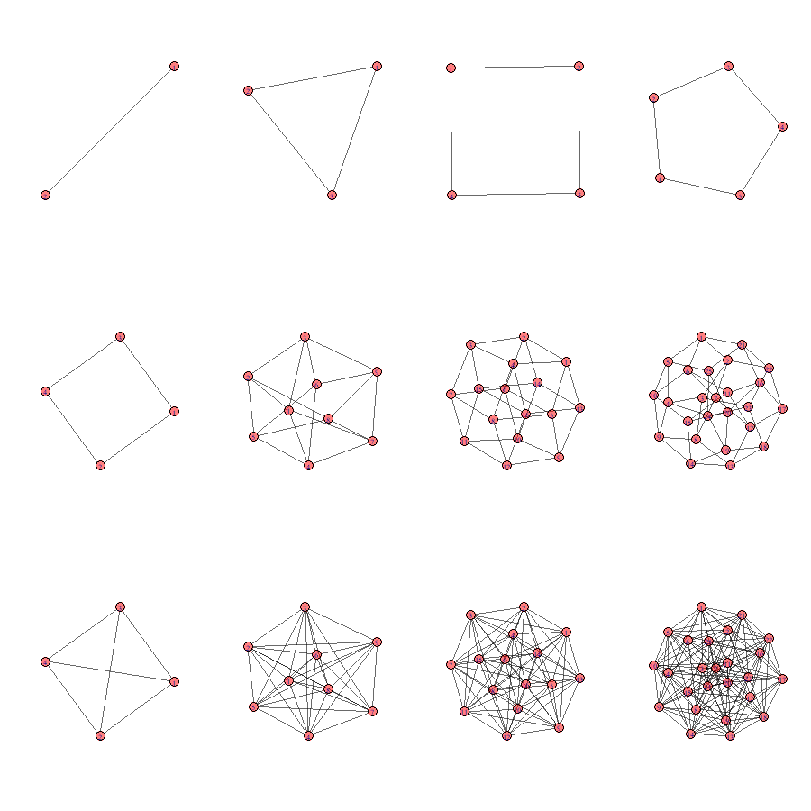

# (PART) EGONETS {-} 

# Theory  


```{r colorize, echo=FALSE}
colorize <- function(x, color) {
  if (knitr::is_latex_output()) {
    sprintf("\\textcolor{%s}{%s}", color, x)
  } else if (knitr::is_html_output()) {
    sprintf("<span style='color: %s;'>%s</span>", color,
      x)
  } else x
}
```

```{r emotions, echo=FALSE, message=FALSE}
# install.packages("devtools")
#devtools::install_github("hadley/emo")
require(emo)
#emo::ji_find("affection")
#emo::ji("beaming face with smiling eyes")
#jis
```

We already introduced egonets in section \@ref(types). We defined an egonet as the **set of ties surrounding sampled individual units.** [cf. @marsden1990]. Thus we have an ego with ties to one or more alters. Suppose that after we have identified the alters of ego, we asked ego the following follow-up question: 


<p class= "quote">
How close are these people to each other?  
1.very close  
2.not close, but not total strangers to each other either   
3.total strangers to each other  
4.I don’t know
</p> 

In this situation we also have information on ties between ego's alters and, subsequently, we may observe triads between our alters. In the figure below I have made the `r colorize("triad green", rgb(0, 1, 0))`.   


```{r triads, echo=FALSE, fig.cap="A Triad within an egonet", message=FALSE}
require(igraph)
set.seed(34676)
degs <- sample(1:5, 100, replace=TRUE)
if (sum(degs) %% 2 != 0) { degs[1] <- degs[1] + 1 }
g4 <- sample_degseq(degs, method="vl")
g4 <- simplify(g4)
edges <- get.adjacency(g4)
edges_mat <- matrix(as.numeric(edges), nrow=nrow(edges))
edges_mat[4,24] <- 1

set.seed(37676)
l4 <- layout.kamada.kawai(g4)
g4 <- graph_from_adjacency_matrix(edges_mat, mode = "undirected")
#changing V
V(g4)$label=""
V(g4)$color <- "blue"
#changing E
E(g4)$arrow.size=.4
E(g4)$curved=.3
E(g4)$color="black"
#plot(g4, layout=l4, margin=0,)

V(g4)$color[96]="red"
V(g4)$shape="circle"
V(g4)$shape[96]="square"
#plot(g4, layout=l4)

l5 <- l4
l5[,1] <- l5[,1] - 1.5
l5[,2] <- l5[,2] - .25
l5 <- l5 / 1.6
#plot(g4, layout=l5, rescale=F)


edges_mat[c(1:100)[-96], c(1:100)[-96]] <- 0
noisolates <- rowSums(edges_mat, na.rm=T)>0

#same appearance
g5 <- graph_from_adjacency_matrix(edges_mat[noisolates,noisolates], mode = "undirected")
V(g5)$label=""
V(g5)$color <- V(g4)$color[noisolates]
E(g5)$arrow.size=.4
E(g5)$curved=.3
E(g5)$color="black"
V(g5)$shape <- V(g4)$shape[noisolates]
#plot(g5, layout=l5[noisolates,], rescale=F)

edges <- get.adjacency(g4)
edges_mat <- matrix(as.numeric(edges), nrow=nrow(edges))
edges_mat[4,24] <- 1
connected <- adjacent_vertices(g4, 96)
subnet <- c(96, as.numeric(unlist(connected)))

g6 <- graph_from_adjacency_matrix(edges_mat[subnet,subnet], mode = "undirected")

#same appearance
V(g6)$label=""
V(g6)$color <- V(g4)$color[subnet]
E(g6)$arrow.size=c(.4, 1.6,1.6,0.4,1.6)
E(g6)$width <- c(.4, 6,6,0.4,6)
E(g6)$curved=0.3
E(g6)$color=c("black",rgb(0, 1, 0),"green","black",rgb(0, 1, 0))
V(g6)$shape <- V(g4)$shape[subnet]
plot(g6,layout=l5[subnet,], rescale=F)
```
Let us discuss TRIADS in some more detail first, before we move on with our discussion on Egonets. 

## Network Structures (TRIAD) {#triad}

Let us start with all possible triad configurations if we have a (binary) undirected tie. See Figure \@ref(fig:ut).


```{r ut, echo=FALSE, , eval=TRUE, fig.cap="undirected triad configurations", out.width = '30%'}
knitr::include_graphics("slide7.png")
```


We observe an *unconnected* triad, a triad with a *connected pair*, an *open triad* and a *closed triad*. The open triad is also called a 'forbidden triad' and actor *i* in such a triad is said to hold a 'brokerage position'.

>How many isomorphs can you think of for a triad with one *connected pair*?  

We only have three nodes but network structures become complex quite quickly. See Figure \@ref(fig:mut) for the many possible configurations for triads when we consider two different type of undirected ties (i.e. multiplexity). 

```{r mut, echo=FALSE, , eval=TRUE, fig.cap="Multiplex, undirected triad configurations", out.width = '100%'}
knitr::include_graphics("slide8.png")
```


By now, I am a bit tired of drawing all these nodes and relations. Luckily, the net is full of pictures of the possible directed triad configurations. I stole this one from an online workshop on Social Network Analysis for Anthropologists [here](https://eehh-stanford.github.io/SNA-workshop/).

```{r dt, echo=FALSE, , eval=TRUE, fig.cap="Directed triad configurations", out.width = '100%'}
knitr::include_graphics("new-triad-census.png")
```

These triads all have unique names: 

* last digit: number of dyads without ties  
* second digit: number of dyads with one tie  
* first digit: number of dyads with two ties (mutual dyads)  
* specific subtype:  
  - C: cyclic
  - D: downward  
  - U: upward  
  - T: transitive

This triad census has been developed by @davis1967 and their original picture in the paper is too cool not to show here:

```{r triadold, echo=FALSE, , eval=TRUE, fig.cap="Original Triad census by Davis and Leinhard (1967)", out.width = '100%'}
knitr::include_graphics("Capture.png")
```

Suppose we are trying to come up with an explanation for why we observe transitive triads (030T) in our network. We must realize that a transitive dyad may be the outcome of different evolution processes. See Figure \@ref(fig:evo).

```{r evo, echo=FALSE, eval=TRUE, fig.cap="Different pathways to a transitive triad.", out.width = '100%'}
knitr::include_graphics("slide9.png")
```
That is, if we assume that each tie is made subsequently, thus not two tie are created at the same time.^[Otherwise there would be a third pathway directly from the situation on the left to the end state, the transitive triad, on the right.] The reason why *i* closes the triad, may be very different from the reason why *k* closes the triad. It all depends on the social relation under consideration. The take home message is that we need longitudinal data if we would like to disentangle specific explanations.   

> See Figure \@ref(fig:evo). Do you think both pathways are just as likely for (a) 'friendship relations', (b) 'who kicks whom relations' and (c) 'who explains social network analysis to whom? relations'? 

I could not find a nice picture of all possible directed triad configurations for two relations simultaneously. If you have time on your hands, please make one for me! `r emo::ji("grinning")` 

So, let us go back to egonets. 

## Type of explanations

If social scientists seek explanations for why we observe specific social networks the explanations generally refer to four aspects, or 'theoretical dimensions', of social networks, namely:

1.  **size**: the number of nodes in the network
2.  **structure**: the relations in the network
3.  **composition**: characteristics of the nodes in the network
4.  **evolution**: change in size, structure and/or composition
    i.  network growth
    ii. tie evolution: structure --\> structure
    iii. node evolution: node attributes --\> node attributes
    iv. influence: structure --\> node attributes
    v.  selection: node attributes --\> structure
  
Where 1, 2 and 3 belong to the *causes* of social networks, evolution processes belong the the *consequences* of social networks.

## Causes  

### Size  

A dyad is by definition constituted by just two nodes. The size of an egonet may vary.  

In section \@ref(types) we introduced the egonet formed by our 'Best Friend Forevers' (BFF). Naturally, we don't have many BFFs. Perhaps it is even a bad example because don't you have at most only one BFF by definition? That said, my daughter (6 years old) claims that all her classmates are BFFs. Anyways. It turns out that if we ask a random sample of adults the following question... 

<p class= "quote"> 
From time to time, most people discuss important matters with other people. Looking back over the last six months—who are the people with whom you discussed matters important to you? 
</p>

...that there are not many people naming more than five persons.^[In many surveys respondents are not even given the opportunity to give more than five persons.] For example, have a look at the table below. Data is from a dataset called CrimeNL [@crimenl]. 

```{r, echo=FALSE, message=FALSE}
#install.packages("kableExtra", repos='http://cran.us.r-project.org')
require(kableExtra)

v1 <- c(17.71, 31.48,23.71,14.45,6.65,6.00,1.79 ,1.39)
v2 <- c(39.91,31.53,15.26, 7.69,  3.50,  2.11, 1.10,  1.23)

df <- data.frame(rbind(t(v1),t(v2)))

colnames(df)<- c("Zero" ,"One","Two","Three","Four","Five","Mean","SD")
rownames(df) <- c("All confidants", "Higher educated confidants")

kbl(df, booktabs=TRUE, digits=2, align = "c", caption="Number of confidants in CDN (row %)", escape=F) %>%
  kable_classic(full_width = F, html_font = "Cambria") %>%
  kable_styling(bootstrap_options = c("striped", "hover", "condensed", "responsive")) 

  #footnote(general = c("Source: CrimeNL", "N=3.834 (own calculations)")) it shows right in rstudio but not in ebook. 
  
```
*Source: CrimeNL*  
N=3.834 (own calculations)  
  
  
The network of our so-called confidants is called the Core-Discussion-Network (CDN). 

Our CDN network thus commonly consists of maximum 5 confidants. The same holds true if we would ask about our loved ones. 

#### Dunbar's number {#cc}

How would we get to know people with whom you form meaningful relations. That is, the people with whom you form stable social relations with and of whom you know how everyone is connected to one another. Perhaps we could use the following question:   

<p class= "quote"> 
Who would you not feel embarrassed about joining uninvited for a drink if you happened to bump into them in a bar? 
</p>

My answer would definitely depend on whether it was asked to me before or after corona. `r emo::ji("wink")`  

Let try a different question: 

<p class= "quote">
Who do you send a Christmas card? 
</p>

Mind you, this question to tap into your meaningful relations was constructed before e-cards existed. 

According to Robin Dunbar most people are able to maintain stable social relations with approximately 100-200 people, with 150 being a typical number and it is hence known as Dunbar's number [@dunbar2010many; @dunbar2015structure]. 

According to Dunbar each *layer* of our social network has a typical size, where the size of each layer increasing as emotional closeness decreases: 

- loved ones: 5  
- good friends: 15
- friends: 50
- meaningful contacts: 150
- acquaintances: 500
- people you can recognize: 1500

#### online 'friends' 

Many people are active on online social networks like FaceBook, Instagram, Strava or what have you. According to this [site](www.statista.com), approximately 40% of U.S Facebook users in the United States (in 2016) had between 0-200 friends, 38% 200-500 friends and 21% 500+ friends. 
There are several crucial differences between the connections we have online versus offline. First of all, it does not cost many resources to make and maintain an online friendship. It may require some social media skills though, which I found out the hard way. After having joined FB at a time when youngster were already moving on to other online communities, it annoyed me to see all kind of uninteresting stories of distant relatives about their cats. I consequently decided to unfriend these persons. This was not appreciated by some other relatives. It turned out I should simply have hidden their content from my timeline. There apparently is a social norm not to unfriend people on FB.   
We already discussed that selection processes should be seen as distinct from deselection processes. I would argue that especially with respect to online social relations within the selection part we need to distinguish processes explaining sending friendship invitations and accepting/declining friendship invitations. 
But notwithstanding these differences, online social networks consist of a series of embedded layers just as offline personal social networks. 

#### weak ties

Social network analysts have struggled how to measure weaker social network relationships, and, by extension, extended social network size for quite a while. We discuss the scaling-up method in more detail here \@ref(su).  


### Composition  

**to do**

- Homophily  
- relation to social capital literature

### Structure   

In this section we will discuss several network measures. In this chapter we focus on egonets but many measures are also relevant for complete networks!  

To illustrate some different ways how we could describe egonets we will use egonets based on co-authorships. We start with randomly sampling two social scientists from the total pool of all social scientists. Currently rolling a dice...and who did we sample...: 

- Bas Hofstra  
- Jochem Tolsma  

From these two sampled social scientists we will use the webscraping techniques described in Chapter \@ref(webintro) to collect 1.5 degree co-author egonetwork.^[To be a bit more precise, we only collect the first 20 co-authors listed on the google scholar page of each ego. I assume these are the 'most important'.] 

See the figures \@ref(fig:jt) and \@ref(fig:bh ) below for a graphical summary of the networks.  

```{r, echo=FALSE, eval=FALSE}
require(scholar)
require(igraph)
require(tidyverse)
source("addfiles/function_fix.R") # Put the function_fix.R in your working directory, we need this first line.

JTid <- get_scholar_id_fix(last_name="tolsma", first_name="jochem", affiliation="radboud university")
BHid <- get_scholar_id_fix(last_name="hofstra", first_name="bas", affiliation="radboud university")

#note only 20 most important coauthors are listed on page of scholar. So not all my coauthors are listed
JTaut <- get_coauthors(JTid, n_coauthors = 100, n_deep = 1)
BHaut <- get_coauthors(BHid, n_coauthors = 100, n_deep = 1)
save(JTaut, file="JTaut.Rdata")
save(BHaut, file="BHaut.Rdata")
```


```{r jt, echo=FALSE, fig.cap="1.5 degree co-author egonetwork of JOCHEM TOLSMA"}
load(file="JTaut.Rdata")
load(file="BHaut.Rdata")

#make igraph object
G1 <- igraph::graph_from_edgelist(as.matrix(JTaut), directed=FALSE)
test <- distances(G1)
selection <- rownames(test)[test[1,]<2] #I only want to plot my direct coauthors. 
G1b <- induced_subgraph(G1,vids=selection)
V(G1b)$label.cex = .71
#plot(G1b) #still uggly of course
G1c <- simplify(G1b)
plot(G1c) #still uggly of course
```

```{r bh, echo=FALSE, fig.cap="1.5 degree co-author egonetwork of BAS HOFSTRA"}
#make igraph object
G2 <- igraph::graph_from_edgelist(as.matrix(BHaut), directed=FALSE)
test2 <- distances(G2)
selection2 <- rownames(test2)[test2[1,]<2] #I only want to plot my direct coauthors. 
G2b <- induced_subgraph(G2,vids=selection2)
V(G2b)$label.cex = .71
#V(G2b)$color[1] <- "red"
#plot(G2b) #still uggly of course
G2c <- simplify(G2b) #remove multiples
plot(G2c) #still uggly of course

```


```{r, eval=FALSE}
require(rvest)
page <- read_html("https://scholar.google.com/citations?view_op=list_colleagues&hl=en&user=K51iiIAAAAAJ")

Coauthors <-  page %>% html_nodes(css="a") %>% html_text()
affiliation <-  page %>% html_nodes(css=".gs_ai_aff") %>% html_text()


get_scholar_id_fix(last_name="van%der%Brug", first_name="Wouter")
get_scholar_id(last_name="van der Brug", first_name="Wouter")

%>% html_attr("id")

id <-  page %>% html_nodes(css="div.gsc_ucoar.gs_scl") %>% html_attr("id")

affiliation <- gsub(pattern="gsc_ucoar-", replacement="", x=affiliation )

https://scholar.google.com/citations?view_op=list_colleagues&hl=en&user=gHuTzXcAAAAAJ"


%>% html_text()
affiliation <-  page %>% html_nodes(css="div") %>% html_text()

Coauthors <-  as.data.frame(Coauthors)
Coauthors
```


#### Density {-}


Density is defined as all observed relations divided by all possible relations. Look at the examples below. Are you able to calculate the density of the networks yourself? 

```{r, echo=FALSE, eval=FALSE}
require(igraph)

par(mar = c(0, 0, 0, 0))

g1 <- sample_smallworld(dim=1, size=2, nei=1, p=0)
g2 <- sample_smallworld(dim=1, size=3, nei=1, p=0)
g3 <- sample_smallworld(dim=1, size=4, nei=1, p=0)
g4 <- sample_smallworld(dim=1, size=5, nei=1, p=0)

g5 <- sample_smallworld(dim=2, size=2, nei=1, p=0)
g6 <- sample_smallworld(dim=2, size=3, nei=1, p=0)
g7 <- sample_smallworld(dim=2, size=4, nei=1, p=0)
g8 <- sample_smallworld(dim=2, size=5, nei=1, p=0)

l5 <- layout_nicely(g5)
l6 <- layout_nicely(g6)
l7 <- layout_nicely(g7)
l8 <- layout_nicely(g8)

g9 <- sample_smallworld(dim=2, size=2, nei=2, p=0)
g10 <- sample_smallworld(dim=2, size=3, nei=2, p=0)
g11 <- sample_smallworld(dim=2, size=4, nei=2, p=0)
g12 <- sample_smallworld(dim=2, size=5, nei=2, p=0)

png("test.png",width = 900, height= 900)
par(mfrow=c(3,4))
plot(g1, vertex.color = adjustcolor("red", alpha.f = .5), edge.color=adjustcolor("grey2", alpha.f = .6))
plot(g2, vertex.color = adjustcolor("red", alpha.f = .5), edge.color=adjustcolor("grey2", alpha.f = .6))
plot(g3, vertex.color = adjustcolor("red", alpha.f = .5), edge.color=adjustcolor("grey2", alpha.f = .6))
plot(g4, vertex.color = adjustcolor("red", alpha.f = .5), edge.color=adjustcolor("grey2", alpha.f = .6))
plot(g5, layout=l5, vertex.color = adjustcolor("red", alpha.f = .5), edge.color=adjustcolor("grey2", alpha.f = .6))
plot(g6, layout=l6, vertex.color = adjustcolor("red", alpha.f = .5), edge.color=adjustcolor("grey2", alpha.f = .6))
plot(g7, layout=l7, vertex.color = adjustcolor("red", alpha.f = .5), edge.color=adjustcolor("grey2", alpha.f = .6))
plot(g8, layout=l8, vertex.color = adjustcolor("red", alpha.f = .5), edge.color=adjustcolor("grey2", alpha.f = .6))
plot(g9, layout=l5, vertex.color = adjustcolor("red", alpha.f = .5), edge.color=adjustcolor("grey2", alpha.f = .6))
plot(g10, layout=l6, vertex.color = adjustcolor("red", alpha.f = .5), edge.color=adjustcolor("grey2", alpha.f = .6))
plot(g11, layout=l7, vertex.color = adjustcolor("red", alpha.f = .5), edge.color=adjustcolor("grey2", alpha.f = .6))
plot(g12, layout=l8, vertex.color = adjustcolor("red", alpha.f = .5), edge.color=adjustcolor("grey2", alpha.f = .6))
dev.off()


```

```{r densities, echo=FALSE, , eval=TRUE, fig.cap="Different densities?", out.width = '100%'}

``` 

The density in Bas' network turns out to be: `r round(igraph::graph.density(G2c),2)`. 

The density in Jochem's network turns out to be: `r round(igraph::graph.density(G1c),2)`.   

For comparison, if we look at friendship networks among pupils in classrooms, we generally observe a density within the range of .2 and .4.

#### Degree centrality {-}

Closely related to density is the concept of degree. The number of ingoing (indegree), outgoing (outdegree) or undirected (degree) relations from each node. In real social networks, we generally observe a right-skewed degree distribution (most people have some friends, few people have many friends). 

> Centrality measures, like degree, can be measured at the **node-level**. For the graph as a whole, we may calculate the **average centrality score** but every node-level centrality measure also has its specific **graph-level** analogue. In what follows we focus on node-level centrality scores.  
At the node-level we may calculate the **raw measure** but to facilitate interpretation we will use **normalized measures**. There may be more than one way by which the raw scores can be normalized. If you use an R package to calculate normalized centrality scores (e.g. `igraph`), please be aware of the applied normalization. 
  
People in a network with relatively many degree are called more central and (normalized) degree centrality is formally defined as:  

$$ C_D(v_i) = \frac{deg(v_i) - min(deg(v))}  {max(deg(v)) - min(deg(v))}, $$  

where $C_D(v_i)$ is degree centrality of $v_i$, vertex *i*, and 'deg' stands for 'degree'. $max(deg(v))$ is the maximal observed degree. $min(deg(v))$ is the minimal observed degree. A different normalization approach would be to divide the node degree by the maximum degree (either the theoretical maximum, or the maximal observed degree).

> Suppose you want to compare the degree centrality of all co-authors in Bas' network. Which normalization approach would you take?  
> Suppose you want to compare the degree centrality of Bas in Bas's network with the degree centrality of Jochem in Jochem's network. Which normalization approach would you take.  

```{r, echo=FALSE, eval=FALSE}
degree_BH <- degree(G2c, loops = FALSE, normalized = FALSE)
degreecentrality_BH <- (degree_BH[1] - min(degree_BH)) / (max(degree_BH) - min(degree_BH))

centr_degree(G2c, loops = FALSE, normalized = TRUE)
```

#### Closeness centrality {-}

Closely related to degree centrality is (normalized) 'closeness centrality':  

$$ C_C(v_i) = \frac{N}{\sum_{j}d(v_j, v_i)}, $$   

with N the number of nodes and *d* stands for distance.

#### Betweenness centrality {-}  

A final important measure of centrality I would like to discuss is called betweenness. It is defined as:  

$$ C_B(v_i) = \frac{\sigma_{v_j,v_k}(v_i)}{\sum_{j\neq k\neq i}\sigma(v_j,v_k)}, $$ 


where $\sigma(v_j,v_k)$ is the number of shortest paths between vertices *j* and *k*, $\sigma_{v_j,v_k}(v_i)$, are the number of these shortest paths that pass through vertex $v_i$ . One way to normalize this measure is as follows:  

$$ C_{B_{normalized}}(v_i) =  \frac{C_B(v_i) - min(C_B(v))}{max(C_B(v))-min(C_B(v))} $$  

#### Clustering {-}  

Clustering is an interesting concept. We have immediately an intuitive understanding of it, people lump together in separate groups. But how should we go about defining it more formally? 
The **clustering coefficient** for $v_i$ is defined as the observed ties between all direct neighbors of $v_i$ divided by all possible ties between all direct neighbors of $v_i$. Direct neighbours are connected to $v_i$ via an ingoing and/or outgoing relation. For undirected networks, the clustering coefficient is the same as the **transitivity index**: the number of transitive triads divided by all possible transitive triads. For directed graphs not so.  


Bas' transitivity network in his network turns out to be: `r round(transitivity(G2c, type = c("localundirected"), vids = "Bas Hofstra", weights = NULL, isolates = c("NaN", "zero")),2)`. 

Jochem's transitivity in his network turns out to be: `r round(transitivity(G1c, type = c("localundirected"), vids = "Jochem Tolsma",  weights = NULL, isolates = c("NaN", "zero")) ,2)`.   

```{r, echo=FALSE, eval=FALSE}
transitivity(G2c, type = c("localundirected"), vids = "Bas Hofstra",
  weights = NULL, isolates = c("NaN", "zero"))

transitivity(G1c, type = c("localundirected"), vids = "Jochem Tolsma",
  weights = NULL, isolates = c("NaN", "zero"))

```
### Stability  

**TO DO: upload lecture**

## Consequences  

Please brush off your knowledge on dyadic influence processes (see section \@ref(influence)). 
What is the added complexity of egonets? Phrased otherwise, why would some egonets exert more influence than other egonets?   

1. The size of egonets may differ (i.e. node set).   
2. The structure of egonets may differ (i.e. tie set).  
3. The composition of egonetes may differ (i.e. attribute set).  
4. The evolution (stability) of egonets may differ. 

Surprisingly, there is relatively little literature on influence processes going on in egonets. The literature is mainly concerned with dyadic influence process or on influence processes going on in socionets. We also need to be aware that the debate on the consequences of egonets is dominated by researchers interest in the topic of social capital. 

My definition of social capital is...: 

<p class= "quote">
**Social capital** is the extent to which our egocentric networks gives us access to different forms of 'capital' or resources which we may use to our own benefit. 
</p>

Please compare my definition with Nan Lin's definition: 

<p class= "quote">
The resources embedded in a social structure that are accessed and/or mobilized in purposive actions. [@lin2002social].
</p>

Social capital is one of the most heavily disputed concepts in the social sciences. For more definitions see [socialcapitalresearch.com](https://www.socialcapitalresearch.com/literature/definition/). 

The literature on how egonets may influence our opinions and attitudes is sparse. We will discuss egonet influence processes during class and I will upload a lecture with my take on this asap.  

**TO DO: upload lecture**

 <!---  [nice paper](https://www.sciencedirect.com/science/article/pii/S2095809917308056#s0070) with good refs. --->

## Assignment  

Please prepare a short (5-10 min.) presentation on recent developments in the literature that deals with causes for egonets. More specifically pick one topic:  

a. egonets and size (i.e. node set). Start with @paik2013social.   
b. egonets and structure (i.e. tie set). Start with @adamic2003friends.    
c. egonets and composition (i.e. attribute set)  Start with @hofstra2017sources.  
d. egonets and evolution / stability. Start with @small2015stable.     


---  


# Methods  

<style>

.button1 {
  background-color: #f44336; /* Red */ 
  border: none;
  color: white;
  padding: 15px 32px;
  text-align: center;
  text-decoration: none;
  display: inline-block;
  font-size: 16px;
  margin: 4px 2px;
  cursor: pointer;
}

.button1:hover {
  box-shadow: 0 12px 16px 0 rgba(0,0,0,0.24), 0 17px 50px 0 rgba(0,0,0,0.19);
}

.button1 {border-radius: 12px;}

.button1 {width: 100%;}
</style>


<script>
function myFunction() {

            var btn = document.getElementById("myButton");
            //to make it fancier
            if (btn.value == "Click to hide code") {
                btn.value = "Click to show code";
                btn.innerHTML = "Click to show code";
            }
            else {
                btn.value = "Click to hide code";
                btn.innerHTML = "Click to hide code";
            }
            //this is what you're looking for
            var x = document.getElementById("myDIV");
            if (x.style.display === "none") {
                x.style.display = "block";
            } else {
                x.style.display = "none";
            }
        }

</script>


## Causes  

<!---
see @duijn1999multilevel
---> 

## Consequences  

In this part we we start with estimating a micro-macro model. See Figure \@ref(fig:mm) which I adapted from @bennink2016micro for the basic idea. We have to realize that our data has a hierarchical structure: observations (confidants/ties) at the lowest-level (level-one, micro-level, tie-level or confidant-level) are nested in a higher level (level-two, macro-level, network-level or ego-level) and that these observations at the confidant-level are interdependent. `r colorize("We need to take these interdependencies into account.", "red")`  
Moreover, if we wish to relate characteristics of our CDN to characteristics of our egos - and yes that is our wish in this section -, our dependent variable is at the macro-level and we 'have to' estimate a micro-macro model. Please read @croon2007predicting and @bennink2016micro.^[If in contrast we would wish to explain ego-characteristics to characteristics of the ties/confidants we could estimate a more traditional macro-micro multi-level model [@duijn1999multilevel]]       

```{r mm, echo=FALSE, eval=TRUE, fig.cap="Basic micro-macro model"}
knitr::include_graphics("micro-macro1.PNG")
```
*note:* Adapted from @bennink2016micro


In chapter \@ref(methods) we investigated how spouses influence each others political opinion. In this chapter we continue our discussion but now with respect to our confidants. Suppose we want to investigate how our confidants influence our political opinions. Unfortunately, not many surveys that map the Core Discussion Network include name interpreter questions on the political opinions of the named confidants. However, one of the most important determinant for someone's political opinion is his/her educational attainment.  
There are several theoretical reasons why the educational attainment of our confidants would impact our own opinions. To mention just a few:  

- Education of alter is 'a proxy' of alter's opinions and alter's opinions may influence our opinions.  
- Alters with different educational levels have different life experiences and the life experiences of our alters may influence our opinions.  
- Alters with different educational levels have different knowledge on topics, sharing knowledge on these topics may influence our opinions.  

## Research questions {#rq}

This leads to the following research question:  

1. To what extent does the educational level of our confidants influence our political opinions?  
2. To what extent does the impact of the educational level of our confidants on our political opinion depend on:  
  a. ego characteristics (e.g. educational level)?  
  b. characteristics of our Core Discussion Network as a whole (e.g size)?  
  c. other characteristics of our confidants (e.g age or gender)?  

For each ego (at each time point) we may have information on one to five confidants. As already stated above, these observations are interdependent and we need to take this into account.   Naturally, we also need to be aware that our own educational-level (and political opinion) will influence with whom we discuss important matters. Thus, `r colorize("we need to take into account selection effects", "red")`.  

## Data 

We will use the data from the LISS panel.  

<a href="https://www.lissdata.nl/">
  
  </a>

More concretely, we will use:  

- 11 waves (2008-2014, 2016-2019)  
- Filter on respondents older than 25. 

We have already constructed a dataset for you guys and gals to work with which contains information on more than 13000 respondents. Don't forget it is a panel data set. This means we have more observations for the same respondent (and his/her CDN) over time. 

Please download this data file to your working directory.

```{r, echo=FALSE, eval=FALSE}
load("C:/Users/Jochem/surfdrive/rmarkdown/thijmen/lisscd_mlsem_panel_data_v7.Rdata")
load("C:/Users/Administrator/Documents/rmarkdown/thijmen/lisscd_mlsem_panel_data_v7.Rdata")

require(tidyverse)
data_long <- lisscdn_long
table(data_long$oplmet)
data_clean <- data_long %>% 
  mutate(educ = recode(oplmet, '1' = 6, '2' = 10, '3'= 11.5, '4' = 11 , '5' = 15 ,'6' = 15.6 , '7'= -9 , '8' = -9 , '9' = -9),
         educ = na_if(educ, -9)) %>%
  select(c("nomem_encr", "survey_wave", "euthanasia", "income_diff","immigrants", "eu_integration", "educ",
           "geslacht", "leeftijd", "oplmet",
           "educ_alter1", "gender_alter1", "age_alter1",
           "educ_alter2", "gender_alter2", "age_alter2",
           "educ_alter3", "gender_alter3", "age_alter3",
           "educ_alter4", "gender_alter4", "age_alter4",
           "educ_alter5", "gender_alter5", "age_alter5")) %>% 
  filter(leeftijd>24) %>%
  rename(ego_id = "nomem_encr", 
         gender = "geslacht", 
         age = "leeftijd") %>%
  arrange(survey_wave, ego_id)

data_clean_wide <- reshape(data_clean, direction = "wide", idvar = "ego_id", timevar = "survey_wave")
liss_cdn_long <- data_clean
liss_cdn_wide <- data_clean_wide

liss_cdn <- list(liss_cdn_long, liss_cdn_wide)
save(liss_cdn, file="addfiles/liss_cdn.Rdata")                        
```


[liss_cdn](addfiles\liss_cdn.Rdata)\

### Variables  

Variables of interest and value labels:

**Ego-level**:  

-   ego_id
-   educ  
-   gender  
-   age
-   eu: opinion of ego on eu_integration: 0 = eu integration has gone too far / 4 = eu 
-   eu_integration: 0 = eu integration has gone too far / 4 = eu integration should go further
-   immigrants: 0 = immigrants should adjust / 4 immigrants can retain their own culture.
-   euthanasia: 1 = euthanasia should be forbidden / 5 euthanasia should be permitted
-   income_diff: 1 differences in income should increase / 5 differences in income should decrease

**confidant-level**:  

- educ_alter**x** 
- gender_alter**x**  
- age_alter**x** 

The **x** refers to the x-mentioned confidant (1-5). 

In the wide dataset each variable ends with "**.y**" where **.y** refers to the survey wave. Thus `educ_alter4.9` refers to the educational level in years of the fourth mentioned confidant in survey_wave 9 (i.e. 2017). 


For the original variables in Dutch see below: 

<p class= "quote"> 
**EU integratie** 

> De Europese integratie is te ver gegaan.  
>  
>  1 Helemaal oneens  
>  2 Oneens   
>  3 Niet eens, niet oneens  
>  4 Eens  
>  5 Helemaal eens  

</p>


<p class= "quote"> **opleiding**  

> Hoogste opleiding met diploma  
> 1 basisonderwijs  
> 2 vmbo  
> 3 havo/vwo  
> 4 mbo  
> 5 hbo  
> 6 wo  
> 7 anders  
> 8 (Nog) geen onderwijs afgerond  
> 9 Volgt nog geen onderwijs  
> Hierbij hebben wij opleiding gecategoriseerd in drie groepen:  
> 1. Laag: basisonderwijs en vmbo  
> 2. Midden: havo/vwo en mbo  
> 3. Hoog: hbo en wo  
> We nemen enkel mensen van 25 jaar en ouder mee. Van hen verwachten we dat ze klaar zijn met hun onderwijscarriere. 

</p>


### Preperation 

```{r, echo=TRUE, results='hold', message=FALSE, warning=FALSE}
#### clean the environment ####.
rm(list=ls())

#### packages ####.
require(tidyverse)
require(lavaan)

##### Data input ###.
load('addfiles/liss_cdn.Rdata')

liss_l <- liss_cdn[[1]]
liss_w <- liss_cdn[[2]]

```

Let us for now focus on the last wave. Thus wave 2019 (wave 11). 

In the literature two approaches are discussed to estimate a micro-macro model, a persons as variables approach and a multi-level approach. The persons as variables approach is - I hope - easiest to implement and for that we need the data in wide format (one row for each respondent). The idea is that the alter scores load on a latent variable at the ego-level. This latent variable has a random component at the ego-level (cf. random intercept in multi-level models). In a basic model with continous manifest variables at the micro-level, the latent variable at the macro-level is the (biased corrected) mean.

## Disaggregation method

But first let us estimate the wrong models. We will start with a disaggregation approach. We need to disaggregate our data so that each row refers to a specific combination of ego, survey_wave and alter. 

```{r}
#we need to disaggregate our data. thus each ego, wave, alter per row. 
liss_ll <- rbind(liss_l,liss_l,liss_l,liss_l,liss_l)
liss_ll$index_alter <- rep(1:5, each=length(liss_l[,1]))
liss_ll$educ_alter <- NA

liss_ll$educ_alter <- ifelse(liss_ll$index_alter == 1, liss_ll$educ_alter1, liss_ll$educ_alter)
liss_ll$educ_alter <- ifelse(liss_ll$index_alter == 2, liss_ll$educ_alter2, liss_ll$educ_alter)
liss_ll$educ_alter <- ifelse(liss_ll$index_alter == 3, liss_ll$educ_alter3, liss_ll$educ_alter)
liss_ll$educ_alter <- ifelse(liss_ll$index_alter == 4, liss_ll$educ_alter4, liss_ll$educ_alter)
liss_ll$educ_alter <- ifelse(liss_ll$index_alter == 5, liss_ll$educ_alter5, liss_ll$educ_alter)

liss_ll_sel <- liss_ll %>% filter(survey_wave==11)

model1 <- '
  euthanasia ~ educ_alter
  euthanasia ~ 1
  euthanasia ~~ euthanasia
  '


fit1 <- lavaan(model1, data = liss_ll_sel)
summary(fit1)

```

## Aggregation method

We could also try to aggregate our confidant data. This means we calculate the mean educational level of our confidants solely based on the available data in the observed scores. 

```{r, results='hold', message=FALSE, warning=FALSE}
liss_l <- liss_l %>% mutate(educ_alter_mean = rowMeans(cbind(educ_alter1, educ_alter2, educ_alter3, educ_alter4,educ_alter5), na.rm = TRUE)) #calculate the mean educational level of the alters. 

liss_l_sel <- liss_l %>% filter(survey_wave==11)

model1 <- '
  euthanasia ~ educ_alter_mean
  euthanasia ~ 1
  euthanasia ~~ euthanasia
  '

fit2 <- lavaan(model1, data = liss_l_sel, missing = "fiml")
summary(fit2)


```

## Micro-macro model  

Finally, let us estimate a better model. We will not use the observed mean value of the educational levels of the confidants for each ego but will calculate a bias corrected mean. 

```{r, results='hold', message=FALSE, warning=FALSE}
liss_l_sel <- liss_l %>% filter(survey_wave==11)

model <- "
  #latent variable
  FX =~ 1*educ_alter1
  FX =~ 1*educ_alter2
  FX =~ 1*educ_alter3
  FX =~ 1*educ_alter4
  FX =~ 1*educ_alter5
  
  #variances
  educ_alter1 ~~ b*educ_alter1
  educ_alter2 ~~ b*educ_alter2
  educ_alter3 ~~ b*educ_alter3
  educ_alter4 ~~ b*educ_alter4
  educ_alter5 ~~ b*educ_alter5
  
  
  FX ~~ FX
  euthanasia ~~ euthanasia
  
  #regression model
  euthanasia ~ FX
  euthanasia ~ 1
  
  #intercepts/means
  educ_alter1 ~ e*1
  educ_alter2 ~ e*1
  educ_alter3 ~ e*1
  educ_alter4 ~ e*1
  educ_alter5 ~ e*1
"


fit3 <- lavaan(model, data = liss_l_sel, missing = "fiml", fixed.x = FALSE)
summary(fit3)
```


## Random Intercept Cross-Lagged Micro-Macro Model RI-CLP-MM  

Of course we want to take into account selection effects. That is, ego's opinion may also affect the educational level of his/her confidants. Luckily, you are very familiar by now with the RI-CLPM (if not, see section \@ref(modelling-strategy). Let us try to combine the micro-macro model with a RI-CLPM (let's call it an RI-CLP-MM). 

To illustrate I only use four waves: 6-9. 

### Measurement model 

We need to calculate the bias corrected means for each wave. I prefer to do that in a two-step procedure. 

```{r, warning=FALSE, results='hold', message=FALSE}
myModel <- '

FX6 =~ 1*educ_alter1.6 + 1*educ_alter2.6 + 1*educ_alter3.6 + 1*educ_alter4.6 + 1*educ_alter5.6   
FX7 =~ 1*educ_alter1.7 + 1*educ_alter2.7 + 1*educ_alter3.7 + 1*educ_alter4.7 + 1*educ_alter5.7   
FX8 =~ 1*educ_alter1.8 + 1*educ_alter2.8 + 1*educ_alter3.8 + 1*educ_alter4.8 + 1*educ_alter5.8   
FX9 =~ 1*educ_alter1.9 + 1*educ_alter2.9 + 1*educ_alter3.9 + 1*educ_alter4.9 + 1*educ_alter5.9   

#variances of latent variables
FX6 ~~ FX6
FX7 ~~ FX7
FX8 ~~ FX8
FX9 ~~ FX9

#constrained variances of manifest variables
educ_alter1.6 ~~ a*educ_alter1.6
educ_alter2.6 ~~ a*educ_alter2.6
educ_alter3.6 ~~ a*educ_alter3.6
educ_alter4.6 ~~ a*educ_alter4.6
educ_alter5.6 ~~ a*educ_alter5.6

educ_alter1.7 ~~ b*educ_alter1.7
educ_alter2.7 ~~ b*educ_alter2.7
educ_alter3.7 ~~ b*educ_alter3.7
educ_alter4.7 ~~ b*educ_alter4.7
educ_alter5.7 ~~ b*educ_alter5.7

educ_alter1.8 ~~ c*educ_alter1.8
educ_alter2.8 ~~ c*educ_alter2.8
educ_alter3.8 ~~ c*educ_alter3.8
educ_alter4.8 ~~ c*educ_alter4.8
educ_alter5.8 ~~ c*educ_alter5.8

educ_alter1.9 ~~ d*educ_alter1.9
educ_alter2.9 ~~ d*educ_alter2.9
educ_alter3.9 ~~ d*educ_alter3.9
educ_alter4.9 ~~ d*educ_alter4.9
educ_alter5.9 ~~ d*educ_alter5.9


#contrained intercepts of the manifest variables (structural changes are picked up by the latent variables)
educ_alter1.6 ~ e*1
educ_alter2.6 ~ e*1
educ_alter3.6 ~ e*1
educ_alter4.6 ~ e*1
educ_alter5.6 ~ e*1

educ_alter1.7 ~ e*1
educ_alter2.7 ~ e*1
educ_alter3.7 ~ e*1
educ_alter4.7 ~ e*1
educ_alter5.7 ~ e*1

educ_alter1.8 ~ e*1
educ_alter2.8 ~ e*1
educ_alter3.8 ~ e*1
educ_alter4.8 ~ e*1
educ_alter5.8 ~ e*1

educ_alter1.9 ~ e*1
educ_alter2.9 ~ e*1
educ_alter3.9 ~ e*1
educ_alter4.9 ~ e*1
educ_alter5.9 ~ e*1


#free the means of the latent variables

FX7 ~ 1
FX8 ~ 1
FX9 ~ 1
'

fit <- lavaan(myModel, data = liss_w, missing = 'ML', fixed.x=FALSE, meanstructure = T)
summary(fit, standardized = T)

```
We will extract the predicted values of the CFA and add them to our dataset `liss_w`. 
Let's have a look at the constructed variables. 

```{r, warning=FALSE, results='hold', message=FALSE}

liss_w <- data.frame(liss_w, predict(fit))
summary(liss_w$FX6)
summary(liss_w$FX7)
summary(liss_w$FX8)
summary(liss_w$FX9)
var(liss_w$FX6, na.rm=T)
var(liss_w$FX7, na.rm=T)
var(liss_w$FX8, na.rm=T)
var(liss_w$FX9, na.rm=T)

```

We thus observe an upward trend in the educational-level of the confidants of ego in subsequent waves. This could either be due to egos replacing lower educated confidants with higher educated confidants, due to the same confidants obtaining higher educational degrees over time or due to sample selection and that in subsequent waves more egos participate who happen to have higher educated confidants.^[The trends in the reported mean values are between-ego trends not within-ego trends!]  

### The structural model 

```{r, results='hold', message=FALSE, warning=FALSE}
RICLPM <- '
  # Create between components (random intercepts)
  RIx =~ 1*FX6 + 1*FX7 + 1*FX8 + 1*FX9 
  RIy =~ 1*euthanasia.6 + 1*euthanasia.7 + 1*euthanasia.8 + 1*euthanasia.9
  
  # Create within-person centered variables
  wx6 =~ 1*FX6
  wx7 =~ 1*FX7
  wx8 =~ 1*FX8 
  wx9 =~ 1*FX9
  
  wy6 =~ 1*euthanasia.6
  wy7 =~ 1*euthanasia.7
  wy8 =~ 1*euthanasia.8
  wy9 =~ 1*euthanasia.9
  
  # Estimate the lagged effects between the within-person centered variables.
  wx7 ~ a*wx6 + b*wy6
  wx8 ~ a*wx7 + b*wy7
  wx9 ~ a*wx8 + b*wy8
  
  wy7 ~ c*wx6 + d*wy6
  wy8 ~ c*wx7 + d*wy7
  wy9 ~ c*wx8 + d*wy8
  
  # Estimate the (residual) covariance between the within-person centered variables
  wx6 ~~ wy6
  wx7 ~~ wy7
  wx8 ~~ wy8
  wx9 ~~ wy9
  
  # Estimate the variance and covariance of the random intercepts. 
  RIx ~~ RIx
  RIy ~~ RIy
  RIx ~~ RIy

  # Estimate the (residual) variance of the within-person centered variables.
  wx6 ~~ wx6
  wy6 ~~ wy6
  wx7 ~~ wx7
  wy7 ~~ wy7 
  wx8 ~~ wx8 
  wy8 ~~ wy8 
  wx9 ~~ wx9 
  wy9 ~~ wy9 

  #include intercepts 
  FX6 ~ 1
  FX7 ~ 1
  FX8 ~ 1
  FX9 ~ 1
  
  euthanasia.6 ~ 1
  euthanasia.7 ~ 1
  euthanasia.8 ~ 1
  euthanasia.9 ~ 1
  
'  

fit5 <- lavaan(RICLPM, data=liss_w, missing = "fiml.x", meanstructure = T )
summary(fit5, standardized = T)
```

### Include ego's educational level

First construct a variable educ for ego. We take the educational level in years at wave 6, if missing we will take the score of wave 7, etc. We thus consider the educational level of ego as a time invariant variable.
We want to:  

-  include the educational level of ego as predictor for the random intercept referring to ego's opinion towards euthanasia  
-  include the educational level of ego as predictor for the random intercept referring to ego's educational level of the CDN  

Before looking at the 'hidden code' please try to:  
- construct the educational variable for ego  
- estimate the RI-CLPM  
- think of how and why parameter estimates will change  

<button class=button1 onclick="myFunction()" id="myButton" value="Click To Open Instructions">Only click button after 5 minutes!</button>

<div style="display:none;" id="myDIV">

```{r, results='hold', message=FALSE, warning=FALSE}
liss_w <- liss_w %>%
  mutate(educ = educ.6, 
         educ = ifelse(is.na(educ), educ.7, educ),
         educ = ifelse(is.na(educ), educ.8, educ),
         educ = ifelse(is.na(educ), educ.9, educ),
         )
```


```{r, results='hold', message=FALSE, warning=FALSE}
RICLPM <- '
  # Create between components (random intercepts)
  RIx =~ 1*FX6 + 1*FX7 + 1*FX8 + 1*FX9 
  RIy =~ 1*euthanasia.6 + 1*euthanasia.7 + 1*euthanasia.8 + 1*euthanasia.9
  
  RIx ~ educ
  RIy ~ educ
  
  # Create within-person centered variables
  wx6 =~ 1*FX6
  wx7 =~ 1*FX7
  wx8 =~ 1*FX8 
  wx9 =~ 1*FX9
  
  wy6 =~ 1*euthanasia.6
  wy7 =~ 1*euthanasia.7
  wy8 =~ 1*euthanasia.8
  wy9 =~ 1*euthanasia.9
  
  # Estimate the lagged effects between the within-person centered variables.
  wx7 ~ a*wx6 + b*wy6
  wx8 ~ a*wx7 + b*wy7
  wx9 ~ a*wx8 + b*wy8
  
  wy7 ~ c*wx6 + d*wy6
  wy8 ~ c*wx7 + d*wy7
  wy9 ~ c*wx8 + d*wy8
  
  # Estimate the (residual) covariance between the within-person centered variables
  wx6 ~~ wy6
  wx7 ~~ wy7
  wx8 ~~ wy8
  wx9 ~~ wy9
  
  # Estimate the variance and covariance of the random intercepts. 
  RIx ~~ RIx
  RIy ~~ RIy
  RIx ~~ RIy

  # Estimate the (residual) variance of the within-person centered variables.
  wx6 ~~ wx6
  wy6 ~~ wy6
  wx7 ~~ wx7
  wy7 ~~ wy7 
  wx8 ~~ wx8 
  wy8 ~~ wy8 
  wx9 ~~ wx9 
  wy9 ~~ wy9 

  #include intercepts 
  FX6 ~ 1
  FX7 ~ 1
  FX8 ~ 1
  FX9 ~ 1
  
  euthanasia.6 ~ 1
  euthanasia.7 ~ 1
  euthanasia.8 ~ 1
  euthanasia.9 ~ 1
  
'  

fit6 <- lavaan(RICLPM, data=liss_w, missing = "fiml.x", meanstructure = T )
summary(fit6, standardized = T)
```

</div>

## Assignment  

1. Please give an interpretation of the most important parameter estimates of the micro-macro models (including the RI-CLP-MM).  
    a. Does the educational level of our confidants influence our opinion towards euthanasia?  
    b. Do you observe selection effects and how can they be explained?  
2. Try to answer the formulated research questions \@ref(rq)
    - you could try to combine the different opinions of ego in one latent variable to increase power.  
    - try to see if the influence of the educational level of the CDN depends on the size of the CDN (I would recommend taking a multi-group perspective) or on ego's educational level in years (I would recommend introducing an interaction effect)  
    - to check whether influence processes depend on other characteristics of the alters is definitely not easy. The method is described in @bennink2016micro but this is too difficult and not feasible in lavaan (perhaps in a two-step approach). You have to try to be creative. 


---  

# Data  

## Sampling  

## Ethical considerations  

## Measurement

### Scaling up {#su}
Let us go back on the Dunbar's number. What social relationships are beyond the 150 “active” relationships in Dunbar’s number? This is something that is often defined as the extended social network [@hofstra2021beyond] or the acquaintanceship network [@diprete2011segregation]. This layer encapsulates all former social ties — from the core to the active social ties — and it includes even the weakest social relationships. It is surprisingly difficult to measure those weaker ties. Imagine that you would have to recall all of your weaker social relationships. How many weaker ties would you be able to recall? Ten, 50, 100, or perhaps even 500? And in the unlikely case that you would be able to recall 500 social relationships, would you have time to write down in a questionnaire who these persons are? Social network analysts have struggled how to measure weaker social network relationships, and, by extension, extended social network size for quite a while. Scientists have used wildly varied approaches to measure extended network size: by asking respondents who they know from random phonebook pages, by counting the number of Christmas cards people send out see \@ref(cc), or by summing up different network roles (e.g., how many accountants do you now?). More recently, scientists have started to gather data unobtrusively from social media where people themselves curated hundreds of their social ties in a list (Twitter followers, instagram follows, and so forth, see Part IV). The sizes of extended social networks obviously vary by the chosen methods to measure those networks. There are estimates up until network sizes of 5,520 [@freeman1989estimating]].

Yet, for ego networks there have been methodological advances how to measure extended network size with surveys in a relatively standardised way: the network scale-up method (hereafter NSUM) [@killworth1998social; @killworth1998estimation; @mccormick2010many]. How does the NSUM work? Consider that there is a population of size N. You could ask respondents how many randomly drawn others n they know in that population. As N increases, however, the likelihood that two random person know one another becomes lower, and with a population N in the millions (like in many countries), that likelihood becomes extremely small. This problem can be tackled, however, by asking respondents how many others they know with a given characteristic. For instance, the NSUM asks “How many people do you know named Bas?” This is more informative than asking which of the ~18.7K Bas’s a respondent knows in the Netherlands. Now we know the fraction of Bas’s a respondent knows in a population. Say I know one Bas. This implies that I know 1/18700 of all Bas’s! If we assume that this fraction applies similarly to all other friend-categories in my network we can extrapolate the fraction the Dutch population:

$$\frac{1}{18,700}\cdot17 million\approx909$$

According to this logic, I know 909 people. When you average this for a set of categories the estimated network size increases in accuracy — e.g., people named Bas, people attending university, and so forth. If we put this in an equation [see @bernard2010counting; @mccormick2010many], it looks like:

$$Basic\;scale-up\;estimator_i = \frac{\Sigma_{k=1}^Ky_{ik}}{\Sigma_{k=1}^KN_{k}}$$

where $y_{ik}$ is the total number of people an individual $i$ claims to know in category $k$, $N_k$ is the size of the category $k$, and $N$ is the size of the entire population. Note that for each category k, you do need to know the population size. The NSUM often starts with relatively similar definitions on what constitutes a relationship. This is important to set a substantive network boundary (what are substantively meaningful connections to consider?) and a methodological boundary. One such network tie definition that scholars have used is, “contacts whom individuals know on a first name basis, such they would have a friendly chat if they were to meet randomly” [cf. @mccarty2001comparing: 29; @diprete2011segregation: 1242; @hofstra2021beyond: 1277]. Note, however, that one may choose another boundary that then influences how small (if asking for more “know” conditions) or large (if releasing “know” conditions) network size estimates will be. Practically, in surveys you could ask respondents how may people they know in a given context in a given year (say, the Netherlands in 2020) on a first name basis such that they would chat with if they were to meet randomly and ask for a battery of items how many people like that they know...

* named Bas  
* named Jochem  
* currently attending university  
* owning a Tesla  
* and so forth…  

You could ask these questions open where respondents fill in a number or with interval censoring where you help respondents answer (e.g., 0, 1-2, 3-5, 6-10, etc.). If you then apply the logic above you have estimated the extended network size with the basic scale-up estimator. The NSUM was originally developed to estimate sizes of hard-to-reach populations — populations for which it is hard to estimate how many there are in a population — such as, for instance, persons who inject drugs. You can use the same logic: if you have calculated an extended social network size of a respondent, you can divide the number of people one reports to know of the unknown population (e.g., how many people do you know who inject drugs?) by the extended network size. If you average that over many respondents and multiply it by the total population size, you know the size of the unknown population. Let’s say I report to know 2 people who inject drugs, have an extended network size of 700 (estimated by the basic scale-up estimator above) in a population of 17 million. This may mean that there are (2/700)*17million=48.5K persons in the total population who inject drugs. Important to remember, therefore, is that there are subpopulations of known size (e.g., people named Bas) and subpopulations of unknown size (e.g., persons who inject drugs) and this can be utilised in the NSUM. The interdependence between social agents in populations can thus be utilised to address many problems.

The basic scale-up estimator above has three issues (it’s called “basic” for a reason): recall errors, transmission biases, and barrier effects. Recall errors are when respondents err in providing estimate for how many people they know in a category; transmission biases are when people are unaware that they know persons in a category (e.g., unaware that someone is attending university); and barrier effects occur when the categories relate to characteristics of respondents (e.g., a Dutch majority respondent may know more Bas’s than a first-generation migrant). There are statistical techniques to account for those issues, though we do not detail those in this chapter. [For an in-depth overview of those techniques, see @mccormick2010many and @maltiel2015estimating.]


---  
