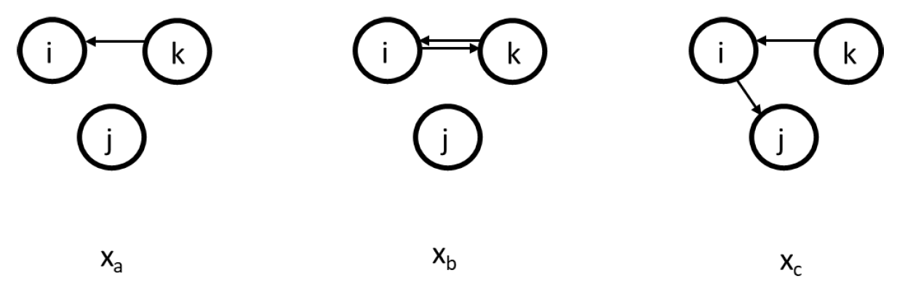

# Methods  {#socionetsm}


```{r, echo=FALSE}
library(knitr)
opts_chunk$set(tidy.opts=list(width.cutoff=100),tidy=TRUE, warning = FALSE, message = FALSE,comment = "#>" , attr.source = ".numberLines", cache=TRUE) 
options(width = 100)

```

```{r colorize, echo=FALSE}
colorize <- function(x, color) {
  if (knitr::is_latex_output()) {
    sprintf("\\textcolor{%s}{%s}", color, x)
  } else if (knitr::is_html_output()) {
    sprintf("<span style='color: %s;'>%s</span>", color,
      x)
  } else x
}
```


There are many methods for analyzing the four theoretical dimensions of social networks (i.e., size, composition, structure, evolution). 

If we focus on the explanation of the micro-mechanisms that bring about the structure of a social network, I would say there are two main flavors within the social sciences:  

- Exponential-family Random Graph Models: estimated for example with `ergm` see the [statnet](https://statnet.org/) website.  
- Stochastic Actor Orientated Models: estimated for example with `RSiena` see the [Siena](https://www.stats.ox.ac.uk/~snijders/siena/siena.html) main page.  

For a comparison of the two approaches and some advice on which method to choose see [@Block2019]. 

Ideally, you should try to test your hypotheses with both methods. And if results differ across models, ...well try to understand why they do. 

In what follows I will focus on RSiena and I have several reasons for this:  

1. We can use the micro-mechanism not only to explain the evolution of network structure but also of network; composition. Phrased otherwise, with this method (and the right type of data) it is possible to distinguish between; selection and influence processes  
2. I have way more expertise with RSiena than with ergm;^[naturally this does not mean I have a lot of expertise in RSiena]  
3. I think this book has something to add to the current Tutorials for and introductions to RSiena. 


## Goal

The goal of this chapter is that after reading it you understand the very basics of RSiena and are able to read *and understand* the [manual](https://www.stats.ox.ac.uk/~snijders/siena/RSiena_Manual.pdf) and that you can follow the RSiena tutorials on the [RSiena website](https://www.stats.ox.ac.uk/~snijders/siena/siena.html) (for .rmd style scripts see [here](https://jochemtolsma.github.io/RSiena-scripts/)).  

## Getting started 

Start with clean workspace

```{r}
rm(list = ls())
```

### Custom functions

- `fpackage.check`: Check if packages are installed (and install if not) in R  
- `fsave`: Save to processed data in repository  
- `fload`: To load the files back after an `fsave`  
- `fshowdf`: To print objects (tibbles / data.frame) nicely on screen in .rmd  

```{r customfunctions2, results='hide'}
fpackage.check <- function(packages) {
  lapply(packages, FUN = function(x) {
    if (!require(x, character.only = TRUE)) {
      install.packages(x, dependencies = TRUE)
      library(x, character.only = TRUE)
    }
  })
}

fsave <- function(x, file=NULL, location="./data/processed/") {
  ifelse(!dir.exists("data"), dir.create("data"), FALSE)
  ifelse(!dir.exists("data/processed"), dir.create("data/processed"), FALSE)
  if (is.null(file)) file= deparse(substitute(x))
  datename <- substr(gsub("[:-]", "", Sys.time()), 1,8)  
  totalname <- paste(location, datename, file, ".rda", sep="")
  save(x, file = totalname)  #need to fix if file is reloaded as input name, not as x. 
}

fload <- function(filename) {
  load(filename)
  get(ls()[ls() != "filename"])
}

fshowdf <-  function(x, ...) {
  knitr::kable(x, digits=2, "html", ...) %>%
  kableExtra::kable_styling(bootstrap_options = c("striped", "hover")) %>%
  kableExtra::scroll_box(width="100%", height= "300px")
} 

```

### packages

- `RSiena`: what do you think?
- `RsienaTwoStep`: this packages assesses the ministep assumption of RSiena but is useful for this tutorial  
- `devtools`: to load from github  
- `igraph`: plotting tools. For a tutorial on plotting networks, see \@ref(webintro)


```{r, results='hide'}
packages = c("RSiena", "devtools", "igraph")
fpackage.check(packages)
#devtools::install_github("JochemTolsma/RsienaTwoStep", build_vignettes=TRUE)
packages = c("RsienaTwoStep")
fpackage.check(packages)
```

---  

## The logic of SAOMs

See [@ripley2022manual] paragraph 2.1.

## RSiena as ABM 

RSiena models *the evolution* of network structures and/or the behavior of the social agents. 
It takes the situation of the network observed at $T_1$ as starting point. It estimates the 'rules' for the agents how to change their ties and/or behavior. If the model is specified correctly, these rules (or micro mechanisms) have led the situation at wave $T_1$ to evolve into the situation observed at wave $T_2$. 

I would say these 'rules' are our ***micro theory of action***.  
Please note that our behavior may depend on the situation we are in. Similarly, the 'rules' we discover with RSiena are thus conditional on the situation at wave $T_1$. 

If we know the 'rules' of the social agents, we can also *simulate* future networks. And I think this aspect will help us to understand what the 'rules' of the social agents are and to understand what is estimated by `RSiena`. 

### RSiena's ministep

Before we can start to simulate or understand RSiena we need to know what is meant by the ministep assumption. 

Let us quote the manual 

<p class= "quote"> 
The Stochastic Actor-Oriented Model can be regarded as an agent-based (‘actorbased’) simulation model of the network evolution; where all network changes are decomposed into very small steps, so-called ministeps, in which one actor creates or terminates one outgoing tie. 
...
…it does not necessarily reflect a commitment to or belief in any particular theory of action elaborated in the scientific disciplines.
...
It is assumed that actors change their scores on the dependent variable (tie or behavior) such that they improve their total satisfaction […] with her/his local network neighborhood configuration.
...
Actors only evaluate all possible results in the local network neighborhood configurations that result from one ministep.
</p>

Thus, what does the SAOM of RSiena not do??:  

- No re-activity^[`r colorize("The no-reactivity assumption has been relaxed in the latest version of RSiena", "red")`]: The act of re-affirming, making or breaking an outgoing tie does not trigger a response by the involved alter  
- No simultaneity: Changes occur one by one.  
  - Hence also no cooperation;  
  - no coordination;  
  - no negotiation  
- No maximization of total utility:  
    - No altruistic behavior: Individual utility is maximized, not total utility  
- No strategic behavior:  
    - Very finite time horizon. Agent does not predict how his/her future local network neighborhood may change after:  
        - Making another ministep him/herself  
        - A ministep of other agents
    - Hence also no investments

This does not mean that RSiena cannot estimate (or better: 'fit') the evolution of networks/behavior that are the consequences of these more complex 'rules' or micro theories but it does so by assuming actors only make ministeps.^[The goal of the package [`RsienaTwoStep`](https://jochemtolsma.github.io/RsienaTwoStep/index.html) is to provide a method to asses the extent to which results obtained by `RSiena::siena07()` depend on the validity of the ministep assumption.]


## Simulation Logic

1. Sample ego  
2. Construct possible alternative future networks based on all possible ministeps of ego    
3. Calculate how sampled ego evaluates these possible networks  
4. Let the ego pick a network, that is, let agent decide on a tie-change  
5. GOTO 1 (STOPPING RULE: until you think we have made enough ministeps)

### Sample an ego  

Let us first start with a network. We will use the build in network of `RsienaTwoStep`, namely `ts_net1`. 

This is what the adjacency matrix looks like:

```{r, echo=FALSE, eval=TRUE}
ts_net1 <- ts_net1
```


```{r }
ts_net1
```

Naturally, we can also plot `ts_net1`. 

```{r, message=FALSE, warning=FALSE, fig.width=7, fig.height=5, fig.cap="ts_net1"}
net1g <- graph_from_adjacency_matrix(ts_net1, mode="directed")
coords <- layout_(net1g, nicely()) #let us keep the layout
par(mar=c(.1, .1, .1, .1))
{plot.igraph(net1g, layout=coords)
graphics::box()
}
```


So only one actor is allowed to make one ministep. But who? This is determined by the rate function and it may depend on ego-characteristics of our social agents (e.g. male/female) and/or on structural-characteristics of our social agents (e.g. indegree, outdegree). And all this can be estimated within RSiena. More often than note, we simply assume that all actors have an equal chance of being selected to make a ministep.  

For more information on the rate function see \@ref(rp).

Okay, we can thus randomly select/sample an agent. 

```{r}
set.seed(24553253)
ego <- ts_select(net=ts_net1, steps=1) #in rsienatwostep two actors may make a change together but here not
ego
```


### Possible networks after ministep  

Let us suppose we want to know what the possible networks are after all possible ministeps of `ego` who is part of `ts_net1`. That is, let us assume that it is ego's turn (ego#: `r ego`) to decide on tie-change. What are the possible networks? 

The function `ts_alternatives_ministep()` returns a list of all possible networks after all possible tie-changes available to an ego given the current network.

```{r, results='hide'}
options <- ts_alternatives_ministep(net=ts_net1, ego=ego)
#options
plots <- lapply(options, graph_from_adjacency_matrix, mode="directed")
par(mar=c(0,0,0,0)+.1)
par(mfrow=c(1,2))

fplot <- function(x) {
  plot.igraph(x, layout=coords, margin=0)
  graphics::box()
}

#lapply(plots, fplot) 
```


```{r, echo=FALSE, results='hide',}
par(mfrow=c(1,2))
lapply(plots[1:8], fplot) 
```

```{r, echo=FALSE, results='hide', fig.cap="Network alternatives after all possible ministeps of ego #4"}
par(mfrow=c(1,2))
lapply(plots[9:10], fplot) 
```


### Network statistics 

Which option will ego choose? Naturally this will depend on which network characteristics (or statistics), $s_i$ ego finds relevant. Let us suppose that ego bases its decision solely on the number of ties it sends to others and the number of reciprocated ties it has with others. 

Let us count the number of ties ego sends to alters. 

```{r, results='hold'}
ts_degree(net=options[[1]], ego=ego)
#or for all options
lapply(options, ts_degree, ego=ego)
```

And let us count the number of reciprocated ties

```{r}
lapply(options, ts_recip, ego=ego)
```


In the package `RsienaTwoStep` there are functions for the following network statistics $s$: 

  - degree: `ts_degree()` 
  - reciprocity: `ts_recip()`  
  - outdegree activity: `ts_outAct()` 
  - indegree activity: `ts_inAct()` 
  - outdegree popularity: `ts_outPop()` 
  - indegree popularity: `ts_inPop()`  
  - transitivity: `ts_transTrip()` 
  - mediated transitivity: `ts_transMedTrip()`  
  - transitive reciprocated triplets: `ts_transRecTrip()` 
  - number of three-cycles: `ts_cycle3()`  

`r colorize("Update: there are quite a lot more. But not very relevant for us at this time.", "red")`  

See @ripley2022manual (Chapter 12) for the mathematical formulation. Naturally, you are free to define your own network statistics. 

### Evaluation function 

But what evaluation value does ego attach to these network statistics and consequently to the network (in its vicinity) as a whole? Well these are the parameters, $\beta_i$, you will normally estimate with `RSiena::siena07()`. 
Let us suppose the importance for:  

- the statistic 'degree', $\beta_1$, is -1  
- for the statistic 'reciprocity', $\beta_2$, is 1.5. 

So you could calculate the evaluation of the network saved in `options[[4]]` by hand: 

$$f_{i}(x) = \Sigma_k\beta_ks_{ik}(x)  ,$$


with $f_{i}$ the evaluation function for agent $i$. $s_{ik}(x)$ are the network statistics $k$ for network $x$ and actor $i$ and $\beta_k$ the corresponding parameters (or importance).

```{r}
option <- 4
ts_degree(options[[option]], ego=ego)*-1 + ts_recip(options[[option]], ego=ego)*1.5
```

Or you could use the `ts_eval()`. 

```{r}
eval <- ts_eval(net=options[[option]], ego=ego, statistics=list(ts_degree, ts_recip), parameters=c(-1,1.5))
eval
```
Now, let us calculate the evaluation of all possible networks: 
```{r t1, results='hold'}
eval <- sapply(options, FUN=ts_eval, ego=ego, statistics=list(ts_degree, ts_recip), parameters=c(-1,1.5))
eval
print("network with maximum evaluation score:")
which.max(eval)
```

### Choice function 

So which option will ego choose? Naturally this will be a stochastic process. But we see that option `r which.max(eval)` has the highest evaluation. 
We use McFadden's choice function (for more information see [wiki](https://en.wikipedia.org/wiki/Discrete_choice)), that is let $P_{i,a=2}$ be the probability that ego $i$ chooses network/alternative 2 ($x_{a=2}$). The choice function is then given by:  


$$P_{i,a=2} = \frac{exp(f_i(x_{2}))}{\Sigma_{a=1}^A exp(f_i(x_a))},$$  
<!---
with $s_i$ a vector of the value of each network statistics for network $i$ and $\beta$ is the vector of parameter values. Hence, $\mathbf{s_i}^\mathsf{T}\mathbf{\beta}$ is the value of the evaluation for network $i$.
---> 

Let us force ego to make a decision. 

```{r, results='hold'}
choice <- sample(1:length(eval), size=1, prob=exp(eval)/sum(exp(eval)))
print("choice:") 
choice
#print("network:")
#options[[choice]]
```


If we repeat this process, that is...: 

1. sample agent  
2. construct possible alternative networks  
3. calculate how sampled agent evaluates the possible networks  
4. Let the agent pick a network, that is, let agent decide on a tie-change  
5. GO BACK TO 1 (STOPPING RULE: until you think we have made enough ministeps)

...we have an agent based model.   

### Stopping rule  

But how many ministeps do we allow? Well, normally this is estimated by `siena07` by the `rate` parameter.^[Naturally, it is a bit more complicated than that. In RSiena we have a choice between unconditional and conditional estimation. My description of the stopping rule refers to the unconditional estimation.] If we do not make this rate parameter conditional on actor covariates or on network characteristics, the rate parameter can be interpreted as the average number of ministeps each actor in the network is allowed to make before time is up. Let us suppose the `rate` parameter is 2 `r rate <- 2`. Thus in total the number of possible ministeps will be `nrow(ts_net1) * rate`: `r nrow(ts_net1)*rate`. For a more detailed - **and more correct** -  interpretation of the rate parameter in `siena07` see \@ref(rf). 

## Simulation example  

Let us now simulate how the network **could** evolve given:^[It is also possible to simulate networks within the `RSiena` package itself. But let us stick with functions from `RsienaTwoStep` for now.]  

- starting point at $T_1$ is `ts_net1` 
- rate is set to 2  
- we as scientists think only network statistics degree and reciprocity are important  
- `RSiena::siena07` has determined the parameters for these statistics are -1 and 1.5 respectively  
- We adhere to the ministep assumption and hence set `p2step` to `c(1,0,0)`

```{r test, echo=FALSE, eval=TRUE, results='hide'}
data(ts_net1)
ts_net1
```

```{r}
rate <- 2
degree <- -1
recip <- 1.5
ts_sims(nsims=1, net=ts_net1, startvalues = c(rate, degree, recip), statistics=list(ts_degree, ts_recip), p2step=c(1,0,0), chain = FALSE) #not that rate parameter is automatically included. 
```

## Estimation logic  

So now you have some grasp of the logic of RSiena. But how does the estimation work?  

Well, that is quite complicated. But it goes something like this:^['it' refers to estimation via the 'Method of Moments'] 

1. Define model: researcher includes effects  
2. initial parameter values of effects (commonly '0')  
3. simulate an outcome network based on these parameter values  
4. compare the network statistics of the simulated outcome network with the observed outcome network at (i.e. the *target values*)  
    - based on the included effects. Thus the simulated network may contain 10 ties, but the observed network may contain 20 ties. Apparently, with the current parameter values we underestimate the density of the outcome network.  
5. tweak/update parameter values in some smart way  
6. GOTO 3 (BREAK RULE: until parameter values cannot be improved anymore / or reached good fit)  
7. simulate a bunch of outcome networks with the obtained parameter values and compare the *expected values* of statistics of the simulated outcome networks with the *target values* of the actual observed outcome network.  
    - we can assess the fit  
    - estimate SE of the parameters
    
Let us suppose network `s501` developed into `s502`. For more information on these networks see `?s501`. 

To estimate this network with `ts_estim`^[I recommend you to estimate networks following the ministep assumption with the package `RSiena`.], we can do the following: 

```{r, eval=FALSE}
#we do not calculate SE for now.
ans <- ts_estim(net1 = s501, net2 = s502, statistics=list(ts_degree, ts_recip), p2step=c(1,0,0), conv=0.01, phase3 = TRUE, itef3 = 50, verbose=TRUE)
```

```{r, eval=FALSE, echo=FALSE}
fsave(ans, "ansestim")
```

```{r, echo=FALSE}
ans <- fload("./data/processed/20231005ansestim.rda")
```

Let us have a look at the final results: 

```{r}
ans
```
How to interpret these numbers??


## Interpretation of parameters {#rp}  

### Rate parameter 

The estimated rate parameter has a nice interpretation: **the estimated rate parameter refers to the expected number of opportunities for change per actor in a time period**. 

Let me try to explain. 

The rate function of actor *i* is denoted:  

$$ \lambda_i(x) $$ 

Suppose we have three actors: *i*, *j* and *k*. And suppose that the rate function is a constant, thus the rate function does not depend on the network structure or attributes of the actors. Thus suppose for example:  

* $\lambda_i=5$   
* $\lambda_j=10$  
* $\lambda_k=15$  

The waiting times of actors *i*, *j* and *k* are exponentially distributed with rate parameter $\lambda$. 
What do these exponential distribution look like?  


```{r dists, cache=FALSE, fig.cap="Rate parameters and waiting times"}
par(mfrow=c(1,3))

dist_5 <- rexp(10000, rate = 5)
hist(dist_5, main="rate = lambda_i = 5", freq=FALSE, xlab="waiting times", xlim=c(0,2), ylim=c(0,9))
abline(v=1/5, col="red")

dist_10 <- rexp(10000, rate = 10)
hist(dist_10, main="rate= lambda_j = 10", freq=FALSE, xlab="waiting times", xlim=c(0,2), ylim=c(0,9))
abline(v=1/10, col="red")

dist_15 <- rexp(10000, rate = 15)
hist(dist_10, main="rate = lambda_k = 15", freq=FALSE, xlab="waiting times", xlim=c(0,2), ylim=c(0,9))
abline(v=1/15, col="red")

```

We now want to determine who will be allowed to take the next ministep. We thus need to sample a waiting time for each actor. Thus each actor gets a waiting time sampled from the exponential distribution with the specified rate parameter: 

```{r}
set.seed(34641)
waitingtimes<-NA
waitingtimes[1] <-  rexp(1, rate = 5)
waitingtimes[2] <-  rexp(1, rate = 10)
waitingtimes[3] <-  rexp(1, rate = 15)
print(paste("waitingtime_", c("i: ", "j: ", "k: "), round(waitingtimes,3), sep=""))
```

Actor *k* has the shortest waiting time and is allowed to take a ministep. 
In the example above we only took one draw out of each exponential distribution. If we would take many draws the expected value of the waiting time is $\frac{1}{\lambda}$ and these values are added as vertical lines in the figure above. Thus with a higher rate parameter $\lambda$ the shorter the expected waiting time. 


Now let us repeat this process of determining who is allowed to take a ministep a couple of times and keep track of who will make the ministep and the time that has passed: 

```{r}
set.seed(245651)
sam_waitingtimes <- NA
time <- 0 
for (ministeps in 1:50) {
waitingtimes<-NA
waitingtimes[1] <-  rexp(1, rate = 5)
waitingtimes[2] <-  rexp(1, rate = 10)
waitingtimes[3] <-  rexp(1, rate = 15)
actor <- which(waitingtimes==min(waitingtimes))
time <- time + waitingtimes[actor]
sam_waitingtimes[ministeps] <- waitingtimes[actor]
print(paste("ministep nr.: ", ministeps, sep=""))
print(paste("waitingtime_", c("i: ", "j: ", "k: ")[actor], round(waitingtimes,3)[actor], sep=""))
print(paste("time past: ", round(time,3), sep=""))
}

```
I know you are wondering what the distribution of sampled waiting times look like, don't you? 
Well let's sample some more and plot them. 

```{r dists2, fig.cap="Distribution of waiting times"}
set.seed(245651)
sam_waitingtimes <- NA
for (ministeps in 1:5000) {
  waitingtimes <- NA
  waitingtimes[1] <- rexp(1, rate = 5)
  waitingtimes[2] <- rexp(1, rate = 10)
  waitingtimes[3] <- rexp(1, rate = 15)
  actor <- which(waitingtimes == min(waitingtimes))
  sam_waitingtimes[ministeps] <- waitingtimes[actor]
}

par(mfrow = c(1, 2))
hist(sam_waitingtimes, freq = FALSE, xlab = "waiting times", main = "sampled waiting times")
abline(v = mean(sam_waitingtimes), col = "red")

hist(rexp(5000, rate = 30), freq = FALSE, xlab = "waiting times", main = "rate=30")
abline(v = 1 / 30, col = "red")

```
The distribution of the sampled waiting times is plotted in the figure above on the left. As you see this distribution is 'identical' to the exponential distribution with a rate parameter $\lambda$ of 30 (5 + 10 + 15 = 30; which is plotted on the right). And the expected waiting time, plotted in red, is 1/30. This leads us to the explanation of the rate parameter within the RSiena manual: 

<p class= "quote"> 
The time duration until the next opportunity of change is exponentially distributed with parameter:  
$$ \lambda_+(x^0)=\Sigma_i \lambda_i (x^0) $$  
</p>

Remember, the waiting times for each actor *i* are exponentially distributed with parameter $\lambda_i$. The observed time duration until the next ministeps are exponentially distributed with parameter $\lambda_+$. 
  
If an actor has a higher rate parameter, the expected sampled waiting time is shorter. And since the actor with the shortest waiting time will make the ministep, actors with the highest rate parameter have the highest probability to have an opportunity for change. Thus **the larger the rate parameter the more opportunities for change there are within a given time period**.

So how many opportunities for change do we have before the total time exceeds 1? Please have a look above with the example of actors *i*, *j* and *k* with rate parameters of 5, 10 and 15 respectively. We see that after ministep 38 time exceeds 1. Of course this was only one run. We could repeat the simulation a couple of times and keep track of the total ministeps and the ministeps for each actor. Let us plot the number of ministeps for actors *i*, *j* and *k* for 1000 simulations. 

```{r dists3, fig.cap="Relation between rate parameters and numuber of ministeps"}

set.seed(245651)

results <- list()
for (nsim in 1:1000) {
  time <- 0
  steps_tot <- 0
  steps_i <- 0
  steps_j <- 0
  steps_k <- 0
  actors <- NA
  while (time < 1) {
    steps_tot <- steps_tot + 1
    waitingtimes <- NA
    waitingtimes[1] <- rexp(1, rate = 5)
    waitingtimes[2] <- rexp(1, rate = 10)
    waitingtimes[3] <- rexp(1, rate = 15)
    actor <- which(waitingtimes == min(waitingtimes))
    time <- time + waitingtimes[actor]
    actors[steps_tot] <- actor
  }
  results[[nsim]] <- actors
}

#sum(results[[1]]==1)
#hist(sapply(results, length))

par(mfrow=c(1,3))
{
hist(sapply(results, function(x){sum(x==1)}), xlab="nsteps", main="actor i: lambda=5")
abline(v=mean(sapply(results, function(x){sum(x==1)})), col="red")
}

{
hist(sapply(results, function(x){sum(x==2)}), xlab="nsteps", main="actor j: lambda=10")
abline(v=mean(sapply(results, function(x){sum(x==2)})), col="red")
}

{
hist(sapply(results, function(x){sum(x==3)}), xlab="nsteps", main="actor k: lambda=15")
abline(v=mean(sapply(results, function(x){sum(x==3)})), col="red")
}


```


Thus **the larger the rate parameter the more opportunities for change per actor there are within a given time period**. And in RSiena the optimal value for the rate parameter $\lambda_i$ is estimated. And from the figure above we see that the estimated parameter has a nice interpretation: **the estimated rate parameter refers to the expected number of opportunities for change in a time period**. 

### Network statistics 

The evaluation function is defined as: 

$$ f^{net}_i(x) = \Sigma_k \beta^{net}_ks_{ik}^{net}(x) $$
Thus $f^{net}$ is the evaluation function. And it attaches a value/number to the *attractiveness* of the network, $x$. The subscript *i* refers to the agent, thus each agent will get its own value of the evaluation function. $\beta^{net}_k$ refers to our estimated parameters. These are what the results will spit out. And for each network effect *k*, $s^{net}_{ik}$, we will obtain a separate estimate. Each agent evaluates the attractiveness of its local network environment. This is why $s_i$ has a subscript *i*. We as scientists have ideas about which network effects $s^{net}_{ik}$ may play a role in the evaluation of the local networks. Based on the mathematical definition of $s^{net}_{ik}$ the value of statistic *k* will be determined for each of the possible networks that may result after a ministep of agent *i*. Agent *i* is most likely to take a ministep that will result in the network with the highest attractiveness value. The RSiena software will then estimate the parameters $\beta^{net}_k$ for which it is most likely to obtain the network observed at T2 given the network observed at T1. More precisely, to observe a network at T2 with similar network structures as the actual network observed at T2.       

Now, let us suppose that actor *i* has an opportunity for change at that after a ministep three possible networks could occur. Or stated otherwise, the choice set consists of three networks for actor *i*. See below. 


```{r choiceset, echo=FALSE, fig.cap = "Choice set for actor *i*."}



```

How actor *i* evaluates these networks depends on the $s^{net}_{ik}$ in the evaluation function. Let us suppose only the outdegree effect is part of the evaluation function. Thus: 

$f^{net}_i(x) = \beta^{net}_1s_{i1}^{net}(x)$  

where,   

$s_{i1}^{net}(x) = \Sigma_jx_{ij}$  

and given the networks above:  

- $s_{i1}^{net}(x_a) = 0$  
- $s_{i1}^{net}(x_b) = 1$  
- $s_{i1}^{net}(x_c) = 1$  
  
and hence:  

- $f^{net}_i(x_a) = 0$
- $f^{net}_i(x_b) = \beta^{net}_1$  
- $f^{net}_i(x_c) = \beta^{net}_1$  

The probability that $x_b$ will be chosen is given by:

$$ P(X= x_b) = \frac{exp(f^{net}_i(x_b))}{exp(f^{net}_i(x_a))+exp(f^{net}_i(x_b))+exp(f^{net}_i(x_c))} $$  

For the interpretation is much easier to interpret the ratio of two probabilities: 

$$ \frac{P(X= x_b)}{P(X= x_a)} = \frac{exp(f^{net}_i(x_b))}{exp(f^{net}_i(x_a))} = exp(f^{net}_i(x_b) - f^{net}_i(x_a) ) = exp(\beta^{net}_1)$$

Let us assume that $\beta^{net}_1 = -2$ Thus the probability to observe a tie between *i* and *j* (network $x_b$) is $exp(-2)= 13.5\%$ the probability to observe no tie between *i* and *j* (network $x_a$).  


>Is it possible to deduce the density of the network from this formula? Well let suppose actor *i* would only have options $x_a$ and $x_b$ then the probabilities would need to sum to 1. And thus:  
$$ P(X= x_b) = exp(-2) * P(X= x_a) = 
exp(-2) * (1 - P(X= x_b)) = exp(-2) / (1 + exp(-2)) \approx 0.12 $$  
The density is estimated to be 0.12.  

The interpretation of the parameters thus resembles the interpretation of a logistic regression: if one covariate $c_k$ increases only with one step and the parameter estimate of this covariate is $\beta_k$, the odds $\frac{P_{c_k=1}}{1-P_{c_k=1}} = exp(\beta_k)*\frac{P_{c_k=0}}{1-P_{c_k=0}}$^[ $$P(Y=1) = \frac{exp(\beta_kx_k)}{1+exp(\beta_kx_k)}$$ ]

## RSiena Example  


### Getting started

Start with clean workspace 

```{r}
rm(list=ls())
```


### Goal

We have two goals:  

1. How to make an RSiena object ready to analyze.  
2. Analyze a (very very) simple network evolution model  


### Custom functions  

- `fpackage.check`: Check if packages are installed (and install if not) in R ([source](https://vbaliga.github.io/verify-that-r-packages-are-installed-and-loaded/)).  
- `fsave`: Save to processed data in repository  
- `fload`: To load the files back after an `fsave`  
- `fshowdf`: To print objects (tibbles / data.frame) nicely on screen in .rmd   
- `f_pubnets`: select scholars and construct directed publication network. 

```{r customfunctions, results='hide'}
fpackage.check <- function(packages) {
  lapply(packages, FUN = function(x) {
    if (!require(x, character.only = TRUE)) {
      install.packages(x, dependencies = TRUE)
      library(x, character.only = TRUE)
    }
  })
}

fsave <- function(x, file=NULL, location="./data/processed/") {
  ifelse(!dir.exists("data"), dir.create("data"), FALSE)
  ifelse(!dir.exists("data/processed"), dir.create("data/processed"), FALSE)
  if (is.null(file)) file= deparse(substitute(x))
  datename <- substr(gsub("[:-]", "", Sys.time()), 1,8)  
  totalname <- paste(location, datename, file, ".rda", sep="")
  save(x, file = totalname)  #need to fix if file is reloaded as input name, not as x. 
}

fload <- function(filename) {
  load(filename)
  get(ls()[ls() != "filename"])
}

fshowdf <-  function(x, ...) {
  knitr::kable(x, digits=2, "html", ...) %>%
  kableExtra::kable_styling(bootstrap_options = c("striped", "hover")) %>%
  kableExtra::scroll_box(width="100%", height= "300px")
} 


#this is the most important one. We created it in the previous script

f_pubnets <- function(df_scholars=df, list_publications=publications, discip="sociology", affiliation="RU", waves=list(wave1=c(2018,2019,2020), wave2=c(2021,2022,2023))) {
  
  publications <- list_publications %>% 
  bind_rows() %>%
  distinct(title, .keep_all = TRUE) 
  
  df_scholars %>% 
  filter(affil1==affiliation | affil2==affiliation) %>%
  filter(discipline==discip) -> df_sel
  
  networklist <- list()
  for (wave in 1:length(waves)) {
    networklist[[wave]] <- matrix(0, nrow=nrow(df_sel), ncol=nrow(df_sel))
  }
  
  publicationlist <- list()
  for (wave in 1:length(waves)) {
    publicationlist[[wave]] <- publications %>%
    filter(gs_id %in% df_sel$gs_id) %>% 
    filter (year %in% waves[[wave]]) %>%
    select(author) %>% 
    lapply(str_split, pattern=",") 
  }  
    
  publicationlist2 <- list()
  for (wave in 1:length(waves)) {
    publicationlist2[[wave]] <- publicationlist[[wave]]$author %>%
    #lowercase
    lapply(tolower) %>% 
    # Removing diacritics
    lapply(stri_trans_general, id = "latin-ascii") %>%
    # only last name
    lapply(word, start=-1, sep=" ") %>%
    # only last last name
    lapply(word, start=-1, sep="-")
  }
  
  for (wave in 1:length(waves)) {
    #let us remove all publications with only one author
    remove <- which(sapply(publicationlist2[[wave]], FUN = function(x) length(x)==1 )==TRUE)
    publicationlist2[[wave]] <- publicationlist2[[wave]][-remove]
  }

  for (wave in 1:length(waves)) {
    pubs <- publicationlist2[[wave]]
    for (ego in 1: nrow(df_sel)) {
      #which ego? 
      lastname_ego <- df_sel$lastname[ego]
      #for all publications
      for (pub in 1:length(pubs)) {
        #only continue if ego is author of pub
        if (lastname_ego %in% pubs[[pub]]) {
          aut_pot <- which.max(pubs[[pub]] %in% lastname_ego)
          #only continue if ego is first author of pub
          if (aut_pot==1) {
            #check all alters/co-authors
            for (alter in 1: nrow(df_sel)) {
              #which alter
              lastname_alter <- df_sel$lastname[alter]
              if (lastname_alter %in% pubs[[pub]]) {
                networklist[[wave]][ego,alter] <- networklist[[wave]][ego,alter] + 1
              }
            }
          }
        }
      }
    }
  }
  return(list(df=df_sel, network=networklist))
}
```


### packages

- `RSiena`: what do you think? :-)


```{r, results='hide'}
packages = c("RSiena", "tidyverse", "stringdist", "stringi")

fpackage.check(packages)
```

### input 

We base the example on the co-author networks of sociologists and political scientists in the Netherlands. You will scrape this data yourself in later chapters. You can download the end products below: 


`r xfun::embed_file("./data/processed/20230621df_complete.rda")`. 

`r xfun::embed_file("./data/processed/20230621list_publications_jt.rda")`. 

Save file in correct directory: './data/processed'. 

```{r}
df <- fload("./data/processed/20230621df_complete.rda")
publications <- fload("./data/processed/20230621list_publications_jt.rda")
```


### RU - sociology 

Let us for now focus only on the sociologists of the Radboud University

```{r}
output <- f_pubnets(df_scholars=df, list_publications=publications, discip="sociology", affiliation="RU", waves=list(wave1=c(2018,2019,2020), wave2=c(2021,2022,2023)))
                                                                                                                     
df_soc <- output[[1]]
df_network <- output[[2]]
```

## Step 1: define data

### dependent variable  

```{r}
#let us check the number of waves
length(df_network)
wave1 <- df_network[[1]]
wave2 <- df_network[[2]]
#let us put the diagonal to zero
diag(wave1) <- 0
diag(wave2) <- 0
#we want a binary tie (not a weighted tie) 
wave1[wave1>1] <- 1
wave2[wave2>1] <- 1
#put the nets in an array
net_soc_array <- array(data = c(wave1, wave2), dim=c(dim(wave1),2))
#dependent
net <- sienaDependent(net_soc_array)
```

### independent variables

```{r}
#gender
gender <- as.numeric(df_soc$gender=="female")
gender <- coCovar(gender)
```

Note that you can and must define a lot more relevant independent variables to build a theoretical plausible model.  

### combine variables into RSiena data object
```{r}
mydata <- sienaDataCreate(net, gender)
```

## Step 2: create effects structure

```{r}
myeff <- getEffects(mydata)
#effectsDocumentation(myeff)
```


## Step 3: get initial description

```{r}
ifelse(!dir.exists("results"), dir.create("results"), FALSE)
print01Report(mydata, modelname = "./results/soc_init")
```

**And have a look at it!!**

{#id .class width=100% height=200px}

What do we learn from this file?  

## Step 4: specify model  

This should be both empirically and theoretically motivated. 
Most importantly, hopefully you have already thought about this step when you formulated your hypotheses.  

```{r, eval=TRUE}
myeff <- includeEffects(myeff, isolateNet, inPop, outAct) #we know that quite a lot of staff has not published with someone else
myeff <- includeEffects(myeff, sameX, egoX, altX, interaction1 = "gender")
```
What structural effects would we normally want to include? 

## Step5 estimate

```{r, eval=FALSE}
myAlgorithm <- sienaAlgorithmCreate(projname = "soc_init")
ansM1 <- siena07(myAlgorithm, data = mydata, effects = myeff, returnDeps = TRUE) 
# if necessary estimate again! 
#ansM1 <- siena07(myAlgorithm, data = mydata, effects = myeff, prevAns = ansM1, returnDeps=TRUE)
ansM1
```

```{r, echo=FALSE, eval=FALSE}
fsave(ansM1)
```

```{r, echo=FALSE}
ansM1 <- fload("./data/processed/20231005ansM1.rda")
ansM1
```


## Step 6: GOF

Here, scripts are shown that can be used to present violin plots representing how well the simulations of our SIENA models capture the distribution of features of the dependent variable(s) (i.e., networks and 'behavior') that were not directly modeled, but for which a good fit between model and data is desirable. 

Background reading: Lospinoso & Snijders [-@Lospinoso2019].

### Background


The goal of GOF-testing is to ensure that our estimated SIENA model accurately represents the observed data of the dependent variable, based on so-called *auxiliary* statistics, such as the distribution of outdegrees, indegrees, reciprocity, triadic configurations, geodesic distances, behavior traits, edgewise similarity, etc. This list is not exhaustive and should be tailored to the specific research question.

The assessment of fit involves comparing observed network features to their expected values in the estimated distribution of networks, derived from a large number of simulations (saved when `returnDeps=TRUE` in the `siena07`-call). If the assessment reveals a poor fit, it becomes necessary to propose model elaborations to improve the fit between the model and data.

Although one might possess theoretical notions about remediation, the complex nature of networks introduces a vast array of potential effects to consider (as shown by the large list of effects in the RSiena manual). In many instances, relying solely on theory and experience is insufficient to confidently propose the effects that ought to be incorporated for better model fit. Also, experimenting with various model specifications can be time-consuming.

`RSiena` provides a computationally efficient predictor for assessing the fit if the model were to be extended by specific additional effects. This estimator can be evaluated using only ingredients calculated already for the method-of-moments estimation of the restricted model (thus, testing an effect without estimating it, by setting `test=TRUE` and `fix=TRUE` in the `includeEffects`-call). 


The results can be plotted which then produce violin plots, which present the distribution of the statistic as a combination of a box plot and a smooth approximation to the density (by a kernel density estimate), with the observed values superimposed.

The *p*-values for `sienaGOF` compare, in the space of outcomes of the auxiliary statistic, the position of the observed data to the cloud of points formed by the simulated data sets that correspond to the estimated model. This comparison is with respect to the ‘distance’ from the center of
the cloud of points, where ‘distance’ is between quotation marks because it is the Mahalanobis distance, which takes into account the correlations and different variances of the components of the auxiliary statistic.

A very small value of *p* indicates poor fit. The customary value of *p* = 0.05 may be used as a threshold determining whether the
fit is adequate, but this threshold is of even less importance here than it is in the case of regular hypothesis testing.  Concluding, if p = 0, then with respect to the auxiliary statistic the fit is poor; it might be rather poor or extremely poor, and you do not know how extreme it is.

For more info, we refer to the article by Lospinoso & Snijders [-@Lospinoso2019] and the RSiena manual section 5.14.  

### Define GOF-auilliary  

Now we define some functions from `sienaGOF-auxiliary`.

```{r}
#see here:
#?'sienaGOF-auxiliary'

# The geodesic distribution is not available from within RSiena,
# and therefore is copied from the help page of sienaGOF-auxiliary:

# GeodesicDistribution calculates the distribution of non-directed
   # geodesic distances; see ?sna::geodist
   # The default for \code{levls} reflects the usual phenomenon
   # that geodesic distances larger than 5
   # do not differ appreciably with respect to interpretation.
   # Note that the levels of the result are named;
   # these names are used in the \code{plot} method.
GeodesicDistribution <- function (i, data, sims, period, groupName,
   varName, levls=c(1:5,Inf), cumulative=TRUE, ...) {
     x <- networkExtraction(i, data, sims, period, groupName, varName)
     require(sna)
     a <- sna::geodist(symmetrize(x))$gdist
     if (cumulative)
     {
       gdi <- sapply(levls, function(i){ sum(a<=i) })
     }
     else
     {
       gdi <- sapply(levls, function(i){ sum(a==i) })
     }
     names(gdi) <- as.character(levls)
     gdi
}

# The following function is taken from the help page for sienaTest

testall <- function(ans){
    for (i in which(ans$test)){
    sct <- score.Test(ans,i)
    cat(ans$requestedEffects$effectName[i], '\n')
    print(sct)}
    invisible(score.Test(ans))
}
```


### apply sienaGOF  

Now, we can go to applying `sienaGOF` to our data. 
Goodness-of-fit tests based on various auxiliary statistics:

```{r, eval=FALSE}
gofi0 <- sienaGOF(ansM1, IndegreeDistribution, verbose=FALSE, join=TRUE,
     varName="net")
gofo0 <- sienaGOF(ansM1, OutdegreeDistribution, verbose=FALSE, join=TRUE,
     levls=c(0:10,15,20),varName="net")
gof0.gd <- sienaGOF(ansM1, GeodesicDistribution, cumulative=FALSE,
     verbose=FALSE, join=TRUE, varName="net")
```


```{r, echo=FALSE, eval=FALSE}
fsave(gofi0)
fsave(gofo0)
fsave(gof0.gd)
```

```{r, echo=FALSE}
gofi0 <- fload("./data/processed/20231005gofi0.rda")
gofo0 <- fload("./data/processed/20231005gofo0.rda")
gof0.gd <- fload("./data/processed/20231005gof0.gd.rda")
```


#### indegree distribution

```{r}
#to check the indegree distribution of the outcome network ourselves:
table(colSums(wave2))
```


```{r, fig.cap="Goodness of Fit of Indegree Distribution"}
plot(gofi0, main="")
```

The redline are the values of the outcome network `wave2`. We thus see that in our outcome network `wave2` 26 scholars do not have an indegree. An additional 8 scholars (34-26) have 1 indegree, etc.. Our simulated networks thus underestimate the number of scholars with 0 indegree but overestimates the number of scholars with 3,4,5 and 6 indegrees. However, according to the statistic the probability observe the actual observed network given the population of simulated networks is not smaller than p<0.05. We conclude our model is able to 'predict' the actual distribution of the observed netwerk. 

#### outdegree distribution

```{r, results= "hide", fig.cap="Goodness of Fit of Outdegree Distribution"}
plot(gofo0, main="")
```

The outdegree is an almost perfect fit. Together with the above, we however must be able to include statistics or covariates that take into account that these outdegree are apparantly send to specific others.  

#### geodesic distances

```{r, fig.cap="Goodness of Fit of Geodesic Distribution"}
plot(gof0.gd, main="")
```

### Step 7: Relative Influence

Background reading: Indlekofer & Brander [(-@indlekofer2013)].


Until now, the interpretation of estimated effects in our SIENA models has been limited to testing their statistical significance, which determines whether an effect plays a role in the evolution of the network (using t-statistics). But we do not yet know how these effects fare against each other with respect to how important they are for actor decision probabilities

There are four issues when extrapolating the size of estimated parameters to their relative importance in SIENA models:

1. *Explanatory statistics have different scales* (e.g., one micro-step may increase the number of reciprocated ties by at most 1 but may result in up to 2(*N*-2) new transitive triplets).

2. *Explanatory variables are often correlated*, making it difficult to establish causality (e.g., a tie bridging a two-path may yield a new transitive triplet, while at the same time, a reciprocated tie).

3. *Multiple and complex choice sets exist*, where network effects influence the probabilities of several alternative choices, and these effects are themselves influenced by a combination of several effects. This interdependence makes it challenging to assess the individual contribution of each effect to actor decisions.

4. *The data undergoes substantial unobserved changes over time*, and the size of parameter estimates is strongly dependent on the structure of the evolving network data. The absence of certain network configurations can render specific effects irrelevant in decision-making processes at certain points in time (e.g., if an ego has no incoming ties, he has no opportunity to reciprocate a tie, making that the `reciprocity` effect cannot influence his decision).

To compare the relative importance of effects within a model, among different models, or across different datasets, we require a measure that specifically focuses on the extent to which effects influence actor decision probabilities.

This is where the concept of 'Relative Importance' (RI) measures comes into play. This measure reflects the extent that estimated model parameters affect change probabilities in network decision probabilities. They should be interpreted as the influence of effects on network changes relative to one another. The importance of an effect is estimated based on the extent to which network micro-steps would have differed if this effect were to be omitted. Probabilities for tie changes from the perspective of each actor are calculated using the fitted model parameters. Subsequently, each parameter is fixed to 0 and the change probabilities are recalculated. The influence of an effect on network (or: behavior) micro-steps is evaluated based on the magnitude of the difference in the distribution of change probabilities with the particular effect present versus absent. These differences are normalized so that their sum is 1 for each actor, and subsequently averaged across actors. 


For more info, we refer to the article by Indlekofer & Brandes [-@indlekofer2013] and the RSiena manual section 13.5.1. 


Let us applying `sienaRI` to our data.

```{r, eval=TRUE}
RI <- sienaRI(data = mydata, ans=ansM1)
```

And plot the results.

```{r, fig.cap="Relative Influence Plots"}
plot(RI, addPieChart = TRUE, legendColumns = 3 )
```
The top row refers to the relative influence of effects at $T_1$, wave1, tho bottom row at $T_2$, wave 2. 
The bar charts display the relative influence of effects for individual actors. The last bar chart in each row, as well as the pie chart, display the relative influenced aggregated to all actors.   
What do we conclude. We can compare the relative influence at the two time points. At wave1 the relative importance of network-isolate played a role for most actors, but no longer at wave2. The indegree-popularity is more important at wave2.  
We can also compare the relative influence between actors. We observe that for many actors reciprocity does not play a role in their decisions. This make sense as many actors do not have a tie to reciprocate. 


YES, you made it until the end!. 

Congrats. Time for drinks. 

----

