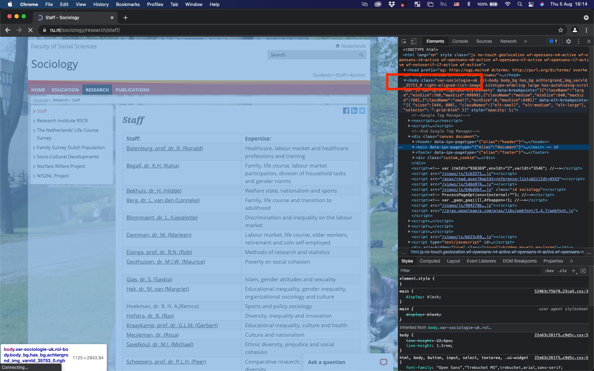
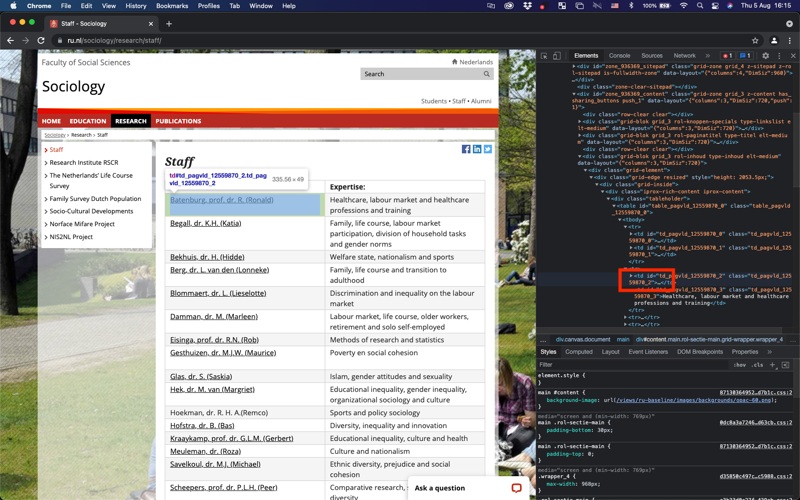

# (PART) Part 4 Webscraping  {-} 

<!--- put the dataframes in a kable and then use a scrollbox. you can also have captions. works best. see last part of script ---> 

# Webscraping for Sociologists {#webintro}

Latest Version: `r format(Sys.Date(), "%d-%m-%Y")`

Please email any comments to: bas.hofstra@ru.nl	

<!---I think I have run into the rate limit. to be able to build the book, I have set eval=FALSE globally--->

```{r, globalsettings, eval = TRUE, echo = FALSE, warning = FALSE, message = FALSE, results = 'hide'}
library(knitr)
library(tidyverse)
require(httr)
require(xml2)
require(rvest)
require(devtools)
#devtools::install_github("jkeirstead/scholar")
require(scholar)


library(knitr)
opts_chunk$set(tidy.opts=list(width.cutoff=100),tidy=TRUE, warning = FALSE, message = FALSE,comment = "#>", cache=TRUE, eval=FALSE)
options(width = 100)

#install.packages("kableExtra", repos='http://cran.us.r-project.org')
require(kableExtra)
source("util.r")


```


## Chapter overview
<p class= "quote">
"[The] technological revolution in mobile, Web, and Internet communications has the potential to revolutionize our understanding of ourselves and how we interact. Merton was right: Social science has still not found its Kepler. But three hundred years after Alexander Pope argued that the proper study of mankind should lie not in the heavens but in ourselves, we have finally found our telescope. Let the revolution begin..." [@watts2011everything: 266]
</p>

Watts' already-famous quote predicts a revolution in the social sciences. He and others [see also @lazer2009social] essentially argue that social science will be revolutionized by the unprecedented use of of the social internet. Given that people overwhelmingly adopted internet technologies and given that many of the platforms that offer these technologies automatically archive all kinds of behavior [@spiro2016research] such as clicks, messages, social media relationships, and so forth, there may be a treasure trove of data on the internet that social scientists can use for their research on social processes. In this chapter, we discuss some of the promises and pitfalls of webscraping so-called "digital trace" data [@golder2014digital] on the internet for social network analysis. We are then going to discuss some different techniques that are often used for webscraping. Note that the fast-pace nature of the internet inherently means that by the time you read this text, some of the things we discuss will be outdated. (Which can be argued to be one of the pitfalls of social science research with webscraping!) We are also getting our hands dirty with a hands-on example of digital trace data that we are going to collect ourselves. So by the end of this chapter, you will be familiar with some of the unique opportunities and difficulties of webscraped (social network) data, have a birds-eye perspective on the different techniques for scraping the web for your own research, have knowledge on the ethics surrounding webscraping, and have more in-depth experience on one specific package for webscraping bibliometric data in `R`. In short, you will have firsthand knowledge on the current state-of-the-art in sociological data collection. There are really good, exhaustive resources for webscraping and computational sociology. See, for instance, the book by Robert Ackland [@ackland2013web]. Yet, to get up to speed for this chapter, you need to read the first chapter of Bas Hofstra's dissertation [@hofstra2017online], Golder and Macy's Annual Review of Sociology article [@golder2014digital], and Lazer and colleagues' Science article [@lazer2009social]. 

(TODO: referenties in blue box zetten)

### Definitions

> **Webscraping**
>
> :   The process by which you collect data from the internet. This can entail different routes: manual data collection, automated data collection via code, use of application programming interfaces, and so forth.

> **Digital footprints**
>
> :   Automatically logged behavioral signals that actors -- broadly construed: individuals, companies, organizations, groups, etc. -- leave on the internet. This may imply many things, including the messages one leaves on Instagram posts, back-and-forth conversations on Whatsapp, companies' job advertisements, university course texts, and so forth. All of these signals can capture some social process: networking on social media, signalling specific job requirements, or university course prerequisites. This also means that digital footprints can contain a lot of different and sometimes unstructured data types. Social network data is obvious: who is friends with whom on Facebook, who Tweets to whom, and so forth. Network data (not social) is also obvious. For instance, which website links to what other websites. (Sidenote: Google's page-rank algorithm made them succesful, and this page-rank algorithm is based on network centrality that essentially filters out "influential" websites quickly. In other words, Google became such an influential company because of network analyses.) It can also contain (unstructured) text data, which in itself signals a lot of interesting social processes that one may consider. 

> **Computational sociology**
>
> :   Problem-driven, empirical sociology, but with the empirical part specifically containing some form of digital footprint data and/or some new methodological technique. Sociologists are usually (necessarily?) interested in digital footprints concerning some social process. Because digital footprints are often related to social *network* processes (e.g., befriending on Facebook, messaging on Twitter, etc.), a lot of computational sociology includes some form of social network analysis. Because this is  often, though not always, the case, discussing webscraping in the context of this book on social network analyses makes perfect sense. Some claim Agent-Based Modelling to be part of computational sociology too, others not. Again others claim performing RSiena analyses is part of computational sociology, others not. Note that this definition-issue is somewhat of a useless moving target. Computational sociology's definition will be different next week depending on who you ask. In this book, we use a pragmatic definition. This means that you are a computational sociologists if you use digital footprint data and/or use relatively new methodological techniques in your research. Also note that there is a certain cause-effect sequence in the three definions above: using webscraping techniques to gather digital footprint data to study social problems makes you a computational sociologist.

## Promises and pitfalls

Like every data source in the social sciences and beyond, there are unique features as well as difficult challenges to webscraped data. In this subsection, we will discuss some of these advantages and challenges of webscraping and, by extension, digital footprint data. Like we discussed before, most of the research using webscraped digital footprint data concerns social networks and so we situate these promises and pitfalls in the context of social network analysis. Note, however, that some of the promises and pitfalls generalize to other types of digital footprint data too.

### Promises

##### **(Social) networks** {-}  

One of the crucial advantages of scraping data from the internet is that it is relatively easy to collect sociologically interesting network data. This may sound like a surprising thing to note in a book on social network analyses. But imagine a world without the internet, and then imagine that you are a social scientist interested in *weak ties*. What toolset do you have available to collect data on and then study those weak ties? You would probably think about qualitative interviews or collecting survey data. For the purpose of studying weak ties, however, both of these methods of data collection suffer from some some weaknesses. For instance, it is incredibly hard for respondents to recall those social ties that are weakly related. So asking about weak ties will likely not yield very reliable and valid results. That is, respondents will mostly acquiesce to naming those ties that they met recently or which are relatively stronger. (There are some techniques to circumvent some of these issues, but those have their own drawbacks too [see @hofstra2021beyond].) Most surveys are also restricted, in that respondents can only name five social ties. It is possible to collect sociometric data of entire contexts in surveys, for instance by presenting respondents with a class-roster or department-roster and asking them who their trustees, friends, etc. This book even devotes an entire section to such data. Yet, such a design is pretty expensive to set up and quite taxing for respondents.

In contrast, an inherent feature of many places on the social internet, respondents curate themselves who their connections are over a long time-span (e.g., friendships on Facebook) or leave many traces of interactions (e.g., mentioning someone on Twitter). Sometimes networks online are even pushed towards network closure by recommendation systems on platforms like Facebook or Instagram. These data are relatively easy and cheap to collect with some creativity on the scientist's part. This will often lead to large and complete networks are not restricted by relationship type (e.g., strong or weak), social context (e.g., family or school friends), respondent recall (acquiesce to strong ties), or social desirability bias (e.g., only nominating the popular kid in town). As an examplary paper who circumvents some of the "regular" biases of social network research mentioned above, see @hofstra2017sources who analyze segregation among weak ties by means of Facebook data. The benefits mentioned here are also prime reasons as to why much research using digital traces incorporates some type of social network analysis.

##### **Dynamics** {-}  

A second advantage of webscraped data is that these data are often *time-stamped*. This means that the the researcher knows exactly when the digital trace -- e.g., the social interaction on Twitter -- occurred. So the researcher can potentially perform some sort of longitudinal analyses so as to come closer to causal estimates in inferential statistical models. In the context of webscraped social networks this is particularly useful so as to separate selection from influence in larger social networks. Gathering such longitudinal sociometric data for many social foci (e.g., school classes) is difficult (yet, definitely not impossible!), whereas collecting time-stamped social interactions on the internet may be somewhat easier. Note also that whereas network data collected in, for instance, school classes often contain the same time-stamp and that longitudinal sociometric data is often collected using the same timestamp 

##### **Signals** {-}  

A third advantage of webscraped data is that it can potentially capture behavioral signals that are otherwise hard to come by. In controlled lab environments some xyz, it's hard. In survey data it's hard to xyz. Yet, online xyz, makes that we can xyz. Similar to online social network data, digital footprints can be unobtrusively collected, such that social desirability biases or xyz . One should, however, be aware that the way one behaves online may not necessarily be representative for "offline" behavior. Yet, to study sensitive topics such as political polarization, x, or y, digital trace data may offer an alternative route (one that is less prone to social desirability biases) to xxx.

##### **Size** {-}  

Finally, and we discuss why this is both a blessing and a curse, webscraping can lead to collected data that may contain a lot of observations. See this study of xyz, or this study by xyz of abc. More data is not always better data, yet the sheer size of data -- under appropriate sampling! -- may make it easier to observe some intervention xyz. See xyz.

### Pitfalls

##### **Sampling** {-}

- Often non representative (convenience sampling)

##### **Size** {-}

- Data size may be a pitfall; hard to analyze, sampling necessary, and sampling from social networks is especially hard

##### **Thin** {-}

- Many rows, yet not much information about those rows

##### **Data structure** {-}

- Unstructured data, hard to work with, requires some skill/imagination

## Best of both worlds?

The most-impactful computational sociology papers leverage the strengths of digital trace data but simultaneously account for (or at least acknowledge) its weaknesses. Some examples here

## Where does this lead us?

1- New tests of old sociological hypotheses made possible by the availability of digital footprint data;
2- Tests of newly derived sociological hypotheses made possible by the availability of digital footprint data;
3- Tests of new theories about "the internet" as social phenomenon by itself.

(TO DO: Small worlds nieuwe test oude vraag: mooi voorbeeld om te integreren.)

## Ethics

In webscraping digital footprins, one has to always consider ethics. In an ideal situation, a researcher has informed consent to study research subjects. In practice, however, the nature of webscraping digital footprints makes it very difficult to obtain such consent. Ethic review boards

## Webscraping techniques

### Manual

Army of research assistants looking up information, saving that

### APIs

Utilizing structures in place

### Crawling

Designing own crawlers

---

## Hands-on webscraping

<!---I think you should make clear in the beginning, what you want to scrape and why!! --> 
<!---I think you should also introduce the packge, manual, vignette a bit. So students see how you came up with the used functions. --->

Now that we learned about webscraping and some of its techniques, it is time to get our hands dirty ourselves. In what follows is a short tutorial on webscraping where we will be collecting data from webpages on the internet. We will use the specific case of sociology staff at Radboud University. What do they publish? Where? And with whom do they collaborate? We assume you followed the R tutorial in this book, or that you otherwise have at least some experience with coding in R. In the rest of this tutorial, we will switch between base R and Tidyverse (just a bit), whatever is most convenient. (Note that this will happen often if you become an applied computational sociologist.)

### Staging your script

* Open a new R-script (via file --\> new --\> RScript (or simply hit *Ctrl+Shift+N* or *Cmd+Shift+N* if you work on Mac)
* Before you start scraping and analyzing, take all the precautionary steps noted in \@ref(tutorial)

So for this tutorial, your starting script will look something like this:

```{r, eval=FALSE}
#########################################
# Title:    Webscraping in R
# Author:   Bas Hofstra
# Version:  29-07-2021
#########################################

#start with clean workspace 
rm(list=ls())

library(tidyverse) # I assume you already installed this one!
install.packages("httr")
require(httr)
install.packages("xml2")
require(xml2)
install.packages("rvest")
require(rvest)
install.packages("devtools")
require(devtools)
# Note we're doing something different here. We're installing a *latest* version directly from GitHub
# This is because the released version of this packages contains some errors!
devtools::install_github("jkeirstead/scholar") 

require(scholar)

#define workdirectory, note the double backslashes setwd("/yourpathhere)"
```

### Getting "anchor" data

What do we mean by anchor data? Our goal is to get to know (i) who the Radboud University Department of Sociology staff is, (ii) what they publish with respect to scientific work, and (iii) who they collaborate with. So that means at least three data sources we need to collect from somewhere. What would be a nice starting (read: anchor) point be? First, we have to know who is on the sociology staff. Let's check out [the Radboud sociology website](https://www.ru.nl/sociology/). There is lots of intruiging information, but not on who is who. There is, however, a specific link to the [research staff](https://www.ru.nl/sociology/research/staff/). Here we do see a nice list on who is on the sociology staff. How do we get that data? It is actually quite simple, the package `xml2` has a very nice function `html_read()` which simply derives the source html of a webpage:


```{r , eval=TRUE}
# Let's first get the staff page
# read_html is a function that simply extracts html webpages and puts them in xml format
soc_staff <- read_html("https://www.ru.nl/sociology/research/staff/")
```

```{r , eval=TRUE}
head(soc_staff)
```

That looks kinda weird. What type of object did we store it by putting the html into `soc_staff`?
```{r , eval=TRUE}
class(soc_staff)
```

So it is is stored in something that's called an xml object. Not important for now what that is. But it is important to extract the relevant table that we saw on the sociology staff website. How do we do that? Go to the [https://www.ru.nl/sociology/research/staff/]("googlechromes://www.ru.nl/sociology/research/staff/") in Google Chrome and then press "Inspect" on the webpage (right click--\>Inspect).

```{r inspect, echo=FALSE, , eval=TRUE, fig.cap="Inspect element", out.width = '100%'}

```

Look at the screenshot below, you should be able to see something like this. In the html code we extracted from the Radboud website, we need to go to one of the nodes first. If you move your cursor over "body" in the html code on the right-hand side of your screen, the entire "body" of the page should become some shade of blue. This means that the elements encapsulated in the "body" node captures everything that turned blue.

```{r inspectbody, echo=FALSE, eval=TRUE, fig.cap="Website 'body' node", out.width = '100%'}

```

Next, we need to look at the specific elements on the page that we need to extract. Somewhat by informed trial and error, looking for the correct code, we can select the elements we want. In the screenshot below, you see that the "td" elements actually are the ones we need. So we need code that looks for the node "body" and the "td" elements in the xml object and then extract those elements in it. Note that you can click on the arrows once you are in the "Inspect" mode in the web browser to trial-and-error to get at the correct elements.

```{r inspecttd, echo=FALSE, , eval=TRUE, fig.cap="Element 'td' on website", out.width = '100%'}

```

Something like the code below should do just that:

```{r}
# so we need to find WHERE the table is located in the html
# "inspect element" in mozilla firefox
# or "view page source" 
# and you see that everything AFTER /td in the 'body' of the page seems to be the table we do need
soc_staff <- soc_staff %>% 
  rvest::html_nodes('body') %>%
  xml2::xml_find_all("//td") %>%
  rvest::html_text()
```

```{r, echo=FALSE, eval=FALSE}
save(soc_staff, file="soc_staff.RData")
```

> Question: What happens in the code above? Why do we specify 'body' and '//td'? 

Let us check out what happened to the soc_staff object now:

```{r, echo=FALSE, eval=TRUE}
load("soc_staff.RData")
```

```{r, eval=TRUE}
soc_staff # looks much better!
```

So it looks much nicer but does not seem to be in the entirely correct order. We have odd rows and even rows: odd rows are names, even rows have the expertise of staff. We need to get a bit creative to put the data in a nicer format. The `%%` operator gives a "remainder" of integers (whole numbers). So 10/2=5 with no remainder, but 11/2=5 with a remainder of 1. 
```{r, eval=TRUE}
odd <- function(x) x%%2 != 0
even <- function(x) x%%2 == 0
```

> Question: Can you find out what the following function does?

How long are the data?

```{r, eval=TRUE}
nstaf <- length(soc_staff) 
nstaf
```

Alright, can we get the odd rows out of there?

```{r, eval=TRUE}
soc_names <- soc_staff[odd(1:nstaf)] # in the 1 until 94st number, get the odd elements
soc_names
```

And how about people's expertise?
```{r, eval=TRUE}
soc_experts <- soc_staff[even(1:nstaf)] # in the 1 until 94st number, get the even elements
soc_experts
```

Finally, can we merge those two vectors?
```{r , eval=TRUE}
soc_df <- data.frame(cbind(soc_names, soc_experts)) # columnbind those and we have a DF for soc staff!
knitr::kable(soc_df, booktabs = TRUE) #add scrollbox
```

That looks much better! Now we only need to remove the redundant rows that state "expertise", "staff," and so forth.

```{r, results='hold' , eval=TRUE}
# inspect again, and remove the rows we don't need (check for yourself to be certain!)


delrows <- which(soc_df$soc_names=="Staff:" | soc_df$soc_names=="PhD:" | soc_df$soc_names=="External PhD:" | soc_df$soc_names=="Guest researchers:")

soc_df <- soc_df[-delrows, ]

knitr::kable(soc_df, booktabs = TRUE) #add scrollbox
```

Now we have a nice relatively clean dataset with all sociology staff and their expterise. But there is yet some work to do before we can move on. We need to do some data cleaning. Ideally, we have staff their first and last names in clean columns. So the last name seems easy, everything before the comma. Do you understand the code below? `gsub` is a function that remove something and replaces it with something else. In the code below it replaces everything that's behind a comma with nothing in the column `soc_names` in the data frame `soc_df`.  

The first name is trickier, we need some more difficult *expressions* to extract first names from this string. It's not necessary for now to exactly know how the expressions below work, but if you want to get into it, here's [a nice resource](https://r4ds.had.co.nz/strings.html). The important part of the code below is that it extracts everything that's in between the brackets.

```{r, eval=TRUE}
# Last name seems to be everything before the comma
soc_df$last_name <- gsub(",.*$", "", soc_df$soc_names)

# first name is everything between brackets
soc_df$first_name <- str_extract_all(soc_df$soc_names, "(?<=\\().+?(?=\\))", simplify = TRUE)

knitr::kable(soc_df, booktabs = TRUE) 
```

So we need yet to do some manual cleaning, one name seemed to be inconsistent with how the other names were listed on the webpage. As data get bigger, this becomes impossible to do manually and we simply have to accept this as noise. 

```{r, eval=TRUE}
soc_df$last_name <- gsub(" J. \\(Jansje\\) van MSc", "", soc_df$last_name)
```

Not quite there yet. To be sure, we'll trim some white space in the variables we know created. This means we remove spaces before and after strings.

<!---
Dont we want to have everything in lower case? 
Dont you want to run a script to remove all common special characters?
---> 


```{r, eval=TRUE}
# trimws looses all spacing before and after (if you specify "both") a character string
soc_df$last_name <- trimws(soc_df$last_name, which = c("both"), whitespace = "[ \t\r\n]")
soc_df$first_name <- trimws(soc_df$first_name, which = c("both"), whitespace = "[ \t\r\n]")
soc_df$soc_experts <- trimws(soc_df$soc_experts, which = c("both"), whitespace = "[ \t\r\n]")
soc_df$soc_names <- trimws(soc_df$soc_names, which = c("both"), whitespace = "[ \t\r\n]")
```

Finally, because we're quite sure that all these staff belong to Radboud University, we simply create a variable that contains a character string.

```{r, eval=TRUE}
# set affiliation to radboud, comes in handy for querying google scholar
soc_df$affiliation <- "radboud university"
```

How do the data look?
```{r, eval=TRUE}
knitr::kable(soc_df, booktabs = TRUE) 
```
<!---do you see it goes wrong for Ellen! ---> 

```{r, echo=FALSE, eval=FALSE}
save(soc_df, file="soc_dfv1.RData")
```

```{r, echo=FALSE, eval=TRUE}
load("soc_dfv1.RData")
```


Pretty good, so I think we can move on to the next section.

### Google Scholar Profiles and Publications

What we now have is a data frame of sociology staff members. So we succesfully gathered the anchor data set we can move on with. Next, we need to find out whether these staff have a Google Scholar profile. I imagine you have accessed [Google Scholar](www.scholar.google.com) many times during your studies for finding scientists or publications. The nice thing about Google Scholar is that it lists collaborators, publications, and citations on profiles. So what we first need to do is look for Google Scholar profiles among sociology staff. Luckily, we cleaned first and last names and have their affiliation. That makes looking them up much easier. So we need to do this for every person in our data frame. Before we query Google Scholar, we first need to learn a neat trick: *for loops*. Can you follow the code below? We can do all kinds of things automatically in a for loop.


```{r, eval=TRUE}
# The "for loop": for every i in a vector (can be numbers, strings, etc.), say 1 to 10, you can do 'something'
for (i in 1:10) {
  print(i) # So for every i from 1 to 10, we print i, see what happens!
}
# 
# # or do something more complicated
# p <- rnorm(10, 0, 1) # draw 10 normally distributed numbers with mean 0 and SD 1 (so z-scores, essentially)
# plot(density(p)) # relatively, normal, right?
# u <- 0 # make an element we can fill up in the loop below
# for (i in 1:10) {
#   u[i] <- p[i]*p[i] # get p-squared for every i-th element in vector p
#   print(u[i]) # and print that squared element
# }

```

Now that we know how to implement for loops in our workflow, we can utilize them to do slightly more complicated stuff. We want to know the identifying *link* on Google Scholar for each sociology staff member. We first set an empty identifier in our data frame so that we can "fill up" that data column later.
```{r, eval=TRUE}
soc_df$gs_id <- "" # we set an empty identifier
```

So let's move on with attempting to find Google Scholar profiles. The package `scholar` has a very nice function `get_scholar_id`. It needs a last name, first name, and affiliation. Luckily, we already found those on the Radboud University website! So we can fill in those. Let's try it for one staff member first.

```{r, eval=TRUE}
source("addfiles/function_fix.R") # Put the function_fix.R in your working directory, we need this first line.
get_scholar_id_fix(last_name="tolsma", first_name="jochem", affiliation="radboud university")
```

We now know that Jochem's Scholar ID is "Iu23-90AAAAJ". That's very convenient, because now we can use the package `scholar` to extract a range of useful information from his Google Scholar profile. Let's try it out on his profile first. Notice the nice function `get_profiles`. We simply have to input his Google Scholar ID and it shows everything on the profile

```{r, eval=TRUE}
get_profile("Iu23-90AAAAJ") # Jochem's profile
```

Next up, Jochem's publications. Notice how not everything is in a nice data frame format yet, we'll get to that later.

```{r, eval=TRUE}
get_publications("Iu23-90AAAAJ")  # Jochem's pubs
```

When and how often was Jochem cited? Seems like an increasing trend line!

```{r, eval=TRUE}
get_citation_history("Iu23-90AAAAJ") # Jochem's citation history
```

Get jochem's collaborators, and the collaborators of those collaborators. So essentially a "one-step-further-than-Jochem" network. 

```{r, eval=TRUE}
get_coauthors("Iu23-90AAAAJ", n_coauthors = 50, n_deep = 1) # Jochem's collaborators and their co-authors!

```

Notice, however, that we could easily plot Jochem's collaboration network already! (Though we leave the specifics for the sister-tutorial on viz.)

<!---this one bugs. have set eval=FALSE---> 

```{r, eval=FALSE}
plot_coauthors(get_coauthors("Iu23-90AAAAJ", n_coauthors = 50, n_deep = 1), size_labels = 2) # Doesn't look like much yet, but we'll make it prettier later.
```

So let's gather these data, but now for *all* sociology staff simultaneously! For this, we use the for loop again. The for loop I make below is a bit more complicated, but follows the same logic as before. For each row (i) in `soc_df`, we attempt to query Google Scholar on the basis of the first name, last name, and affiliation listed in that row in the data frame. We use some handy subsetting, e.g., `soc_df[i, 3]` means we input `last_name=` with the last name (which is the third column) found in the i-th row in the data frame. The same goes for first name and affiliation. We fill up `gs_id` in the data frame with the Google Scholar IDs we'll hopefully find. The `for (i in nrow(soc_df))` simply means we let i run for however many rows the data frame has. Finally, the `tryCatch({})` function makes that we can continue the loop even though we may encounter errors for a given row. Here, that probably means that not every row (i.e., sociology staff member) can be found on Google Scholar. We print the error, but continue the for loop with the `tryCatch({})` function. In the final rows of the code below. We simply drop those rows that we cannot identify on Google Scholar.

<!--- i dont think it is good practice to use column numbers. peharps your code will change. best to use column names ---> 
<!---why did you set eval=FALSE? does not take too long. Don't forget we cache everything---> 
<!---if you use eval=FALSE. Don't forget to save the objects and load them in next script (with echo=FALSE)--->

```{r}
# Look throught get_scholar_id_fix(last_name, first_name, affiliation) 
# if we can find google scholar profiles of sociology staff!
for (i in 1:nrow(soc_df)) {
  
  tryCatch({
     soc_df[i,c("gs_id")] <- get_scholar_id_fix(last_name = soc_df[i, 3], # so search on last_name of staff (third column)
                                             first_name = soc_df[i,4],  # search on first_name of staff (fourth column)
                                             affiliation = soc_df[i,5]) # search on affiliation of each staff (fifth column)

    }, error=function(e){cat("ERROR :",conditionMessage(e), "\n")}) # continue on error, but print the error
  }

# remove those without pubs from the df
# seems we're left with about 34 sociology staff members!
soc_df <- soc_df[!soc_df$gs_id == "", ]
```

```{r, echo=FALSE, eval=FALSE}
save(soc_df, file="soc_dfv2.RData")
```

```{r, echo=FALSE, eval=TRUE}
load("soc_dfv2.RData")
```

```{r, eval=TRUE}
knitr::kable(soc_df, booktabs = TRUE) 
```

It works! So what is left to do is simply to get the data we already extracted for Jochem, but for all sociology staff. For that, we need a bunch of for loops. Let's first gather the profiles and publications. We store those in a `list()` which is an object in which you can store multiple data frames, vectors, matrices, and so forth. This is particularly good for for loops because you can store information that is -- at first sight -- not necessarily compatible. For instance, matrices of different length. Note that bind a Google Scholar ID to the publications too. 

```{r}
soc_list_profiles <- list() # first we create an empty list that we then fill up with the for loop
soc_list_publications <- list()

for (i in 1:nrow(soc_df)) {
  
  # note how you call different elements in a list "[[]]", fill in the i-th element
  soc_list_profiles[[i]] <- get_profile(soc_df[i, c("gs_id")]) # Note how we call row i (remember how to call rows in a DF/Matrix) and then the associated scholar id
  soc_list_publications[[i]] <- get_publications(soc_df[i, c("gs_id")]) 
  soc_list_publications[[i]][, c("gs_id")] <- soc_df[i, c("gs_id")] # note that we again attach an id
  # so both functions here call the entire profile and pubs for an author, based on google scholar ids
  
}
# Notice how fast the data blow up! 34 scholars publish ~3000 papers
soc_df_publications <- bind_rows(soc_list_publications)
```

```{r, echo=FALSE}
save(soc_df_publications, file="soc_df_publications.RData")
save(soc_list_profiles, file="soc_list_profiles.RData")
```

```{r, echo=FALSE, eval=TRUE}
load("soc_df_publications.RData")
load("soc_list_profiles.RData")

```


<!---this really goes too fast for students---> 

We need to do some relatively involved data handling to attach the Google Scholar profiles in `soc_list_profiles` to the `soc_df`. That is mostly because profile elements can contain more than one row. For instance, co-authors are stored in long format per profile that do not easily merge to a data frame where each staff member is a row. So we need to get only the profile elements that have a single element per profile element (e.g., total cites). Seems these are the first 8 elements. So we need to get those out of the lists and store those in a new list. We use a couple of functions to first `unlist` the 1 tot 8-th elements in that list, make it a data frame, and *transpose* the data such that each row contains 8 columns. We then use the function `bind_rows()` to simply make a data frame from the list elements. We then merge it to `soc_df`. So what we end up with is a sociology staff data frame with much more information than before: citations, indices, expertise listed on Google Scholar, and so forth.

```{r}
# get the profiles too, just to be sure
soc_profiles_df <- list()
for (i in 1:length(soc_list_profiles)) {
  soc_profiles_df[[i]] <- data.frame(t(unlist(soc_list_profiles[[i]][1:8]))) #some annyoing data handling
}
soc_profiles_df <- bind_rows(soc_profiles_df)
soc_df <- left_join(soc_df, soc_profiles_df, by = c("gs_id" = "id")) # merge data with soc_df
```

```{r, echo=FALSE, eval=FALSE}
save(soc_df, file="soc_dfv3.RData")
```

```{r, echo=FALSE, eval=TRUE}
load("soc_dfv3.RData")
```

```{r, eval=TRUE}
knitr::kable(soc_df, booktabs = TRUE) 
```


So we have papers and profile. Remember how we got Jochem's citation history? We want that for each staff member too. Yet again, we use a for loop. We first store the citation history in a list. But notice the `if` statement! We only continue the for loop for that i-th element if some statement is `TRUE`. Here, we attempt to find out if the i-th element, the citation history of the staff member, has a length than is larger than 0. Some staff members are never cited (which happens all the time if papers are only just published), and so for these staff members that is no list element that contains information. We only attach a Google Scholar ID for those staff members that are cited at least once. We bind the rows again and end up with a data frame in *long format*: three columns with years, cites, and Google Scholar ID. Therefore, there is more than one row per staff member.

```{r}
# get citation history of a scholar
soc_staff_cit <- list()
for (i in 1:nrow(soc_df)) {
  
  soc_staff_cit[[i]] <- get_citation_history(soc_df[i, c("gs_id")])
  
 if (nrow(soc_staff_cit[[i]]) > 0) 
 {
   soc_staff_cit[[i]][,c("gs_id")] <- soc_df[i, c("gs_id")] # again attach the gs_id as third column
 }
}
soc_staff_cit <- bind_rows(soc_staff_cit)
colnames(soc_staff_cit)[3] <- "gs_id"
```
```{r, echo=FALSE, eval=FALSE}
save(soc_staff_cit, file="soc_staff_cit.RData")
```

```{r, echo=FALSE, eval=TRUE}
load("soc_staff_cit.RData")
```

```{r, eval=TRUE}

knitr::kable(soc_staff_cit, booktabs = TRUE) 
```


<!---should you not explain somewhere that in google scholar you have to add you coauthors manually---> 
<!---why only 10? And which 10. should you not ... --->
<!---I think this goes wrong, you end up looking for some coauthors multiple times. A clumsy way to clean would be to select only first 10 appearences of name in first column. But much better to check during collection. see if authors are already in a unique author vector and if so skip. ---> 

Next, we get the collaborators. For loop should be clear by now. We get collaborators for a given Google Scholar ID, 50 of them, with a distance of at most 1. We then bind_rows again, and remove those staff members that did not list any collaborator.

```{r}
# the first 10 at most! n_deep means the co-authors of my co-authors, 
# which can blow up fairly quickly, so keep that number low.
soc_collabs <- list()
for (i in 1:nrow(soc_df)) {
  
  # one deep
  soc_collabs[[i]] <- get_coauthors(soc_df[i, c("gs_id")], n_coauthors = 10, n_deep = 1) # note again the gs_id that I use
  soc_collabs[[i]][,c("gs_id")] <- soc_df[i, c("gs_id")]
  
}

soc_df_collabs <- data.frame(bind_rows(soc_collabs))

soc_df_collabs <- soc_df_collabs[!is.na(soc_df_collabs$author),]
```

```{r, echo=FALSE, eval=FALSE}
save(soc_df_collabs, file="soc_df_collabs.RData")
```

```{r, echo=FALSE, eval=TRUE}
load("soc_df_collabs.RData")
```

```{r, eval=TRUE}

scroll_box(knitr::kable(soc_df_collabs, booktabs = TRUE) , height="300px")

           
```

<!---
Finally, we want to get the *article* citation history! Notice how we got like ~3K articles? For all of those articles we need in each year how often they were cited. That means a lot of queries to Google Scholar. We need to prevent that we hit the so-called *rate-limit*. This means that our IP will be blocked for requesting access to a webpage because we did it too often too quickly. Luckily, we can randomize our calls by time in a for loop! Do you understand the code below? (Hint: the code annotation kinda gives it away.)

```{r}
# because we don't wanna "Rate limit" google scholar, they throw you out
# if you make to many requests, we randomize request time 
# do you understand the code below? 
for (i in 1:10) {
  time <- runif(1, 0, 5)
  Sys.sleep(time)
  print(paste(i, ": R slept for", round(time,1), "seconds"))
}


# for every number from 1 to 10
# we draw  one number from 0 to 5 from a uniform distribution
# we put the wrapper sys.sleep around it that we put R to sleep for the drawn number
```

So we time-randomize our calls to Google. In this final for loop, we again put the citation history in a list and only put a Google Scholar ID next to it if there is any citation ever on that paper. Notice how we now call columns and rows from `soc_df_publications`. This is because those contain both the publications of staff members *and* the publication ids which we need to gather the citation history of papers. Finally, we `bind_rows()` again to have data frame in long format with year, citation, publication id, and Google Scholar ID. Notice how this will take way too long for this tutorial to finish. For instance, let's say the mean waiting time is 2 seconds per query. That means at 2*3000 papers=6000 seconds, which is longer than 90 minutes. So we already gathered the data for you to continue with. 


there is a bug in get_article_cite_history function if in one year there is no citation. And this happens quit often. 

```{r, eval=FALSE, echo=FALSE}

id <- soc_df_publications[i, c("gs_id")]  
article <- soc_df_publications[i, c("pubid")]


function (id, article) 
{
    site <- getOption("scholar_site")
    id <- tidy_id(id)
    url_base <- paste0(site, "/citations?", "view_op=view_citation&hl=en&citation_for_view=")
    url_tail <- paste(id, article, sep = ":")
    url <- paste0(url_base, url_tail)
    res <- get_scholar_resp(url)
    if (is.null(res)) 
        return(NA)
    httr::stop_for_status(res, "get user id / article information")
    doc <- read_html(res)
    
    years <- doc %>% html_nodes(".gsc_oci_g_t") %>% html_text() %>% 
        as.numeric()
   
    #the bug is here. 
     vals <- doc %>% html_nodes(".gsc_oci_g_al") 
    
    %>% html_text()
    
    
    %>% 
        as.numeric()
    df <- data.frame(year = years, cites = vals)
    if (nrow(df) > 0) {
        df <- merge(data.frame(year = min(years):max(years)), 
            df, all.x = TRUE)
        df[is.na(df)] <- 0
        df$pubid <- article
    }
    else {
        df$pubid <- vector(mode = mode(article))
    }
    return(df)
}
```


```{r, eval = FALSE}
# get citation history of a scholar-paper
soc_art_cit <- list()
for (i in 1:nrow(soc_df_publications)) {
  Sys.sleep(runif(1, 0, 4))
  tryCatch({
    soc_art_cit[[i]] <- get_article_cite_history(
                        soc_df_publications[i, c("gs_id")],  
                        soc_df_publications[i, c("pubid")])
  }, error=function(e){cat("ERROR :",conditionMessage(e), "\n")}) # continue on error, but print the error 
  tryCatch({
    if (nrow(soc_art_cit[[i]]) > 0) {
      soc_art_cit[[i]][ , c("gs_id")] <- soc_df_publications[i, c("gs_id")]
    }
  }, error=function(e){cat("ERROR :",conditionMessage(e), "\n")}) # continue on error, but print the error 
}


soc_art_cit <- bind_rows(soc_art_cit)
```

---> 

Let's save the data we need in for the next tutorial.

<!---I don't see the data in the addfiles folder yet---> 

```{r}
# save the DFs thus far
save(soc_df_publications, "addfiles/soc_df_publications.rda"))
save(soc_df, "addfiles/soc_df.rda"))
save(soc_df_collabs, "addfiles/soc_df_collabs.rda"))
#save(soc_art_cit, "addfiles/soc_art_cit.rda")) Notice how we did this one for you.
save(soc_staff_cit, "addfiles/soc_staff_cit.rda"))
```

<!---if students did not succeed, give the links to the data in our repository --->


Nicely done, this was the webscraping tutorial for bibliometric data. We gathered useful information about sociology staff: \
- 1.1 who actually is the staff on the RU website? \
- 1.2 staff google scholar profiles (we merged 1.1 and 1.2) \
- 2 publications and total cites per publication \
- 3 collaborators plus their collaborators ("friends-of-friends") \
- 4 publication citation history (cites per year) \
- 5 citation history of scholars themselves (cites per year) \

**Next, we can move on to some cool network visualization.**

---


