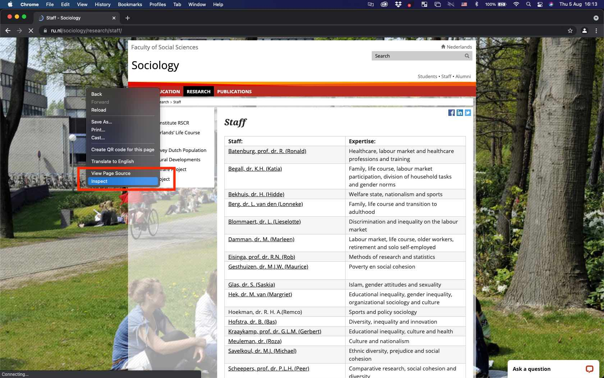
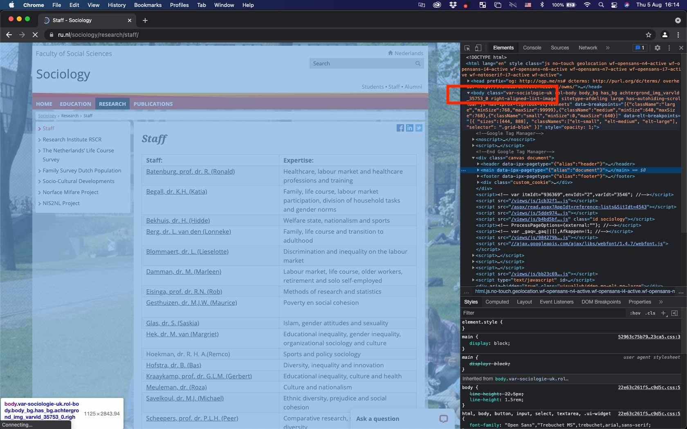
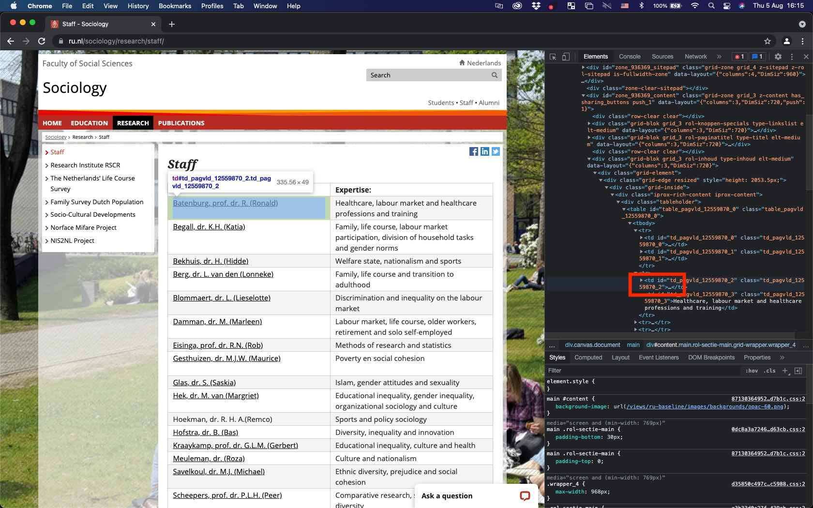

# (PART) Webscraping  {-} 

<!--- put the dataframes in a kable and then use a scrollbox. you can also have captions. works best. see last part of script ---> 

# Webscraping for Social Scientists {#webintro}

<!---I think I have run into the rate limit. to be able to build the book, I have set eval=FALSE globally--->

```{r, globalsettings, eval = TRUE, echo = FALSE, warning = FALSE, message = FALSE, results = 'hide'}
library(knitr)
library(tidyverse)
# require(httr)
require(xml2)
require(rvest)
require(devtools)
#devtools::install_github("jkeirstead/scholar")
require(scholar)
library(data.table)

library(knitr)
opts_chunk$set(tidy.opts=list(width.cutoff=100),tidy=TRUE, warning = FALSE, message = FALSE,comment = "#>", cache=FALSE, eval=FALSE)
options(width = 100)

#install.packages("kableExtra", repos='http://cran.us.r-project.org')
require(kableExtra)
source("util.r")


```


## Chapter overview
<p class= "quote">
"[The] technological revolution in mobile, Web, and Internet communications has the potential to revolutionize our understanding of ourselves and how we interact. Merton was right: Social science has still not found its Kepler. But three hundred years after Alexander Pope argued that the proper study of mankind should lie not in the heavens but in ourselves, we have finally found our telescope. Let the revolution begin..." [@watts2011everything: 266]
</p>

Watts' already-famous quote predicts a revolution in the social sciences. He and others [see also @lazer2009social] essentially argue that social science will be revolutionized by the unprecedented use of of the social internet. Given that people overwhelmingly adopted internet technologies and given that many of the platforms that offer these technologies automatically archive all kinds of behavior [@spiro2016research] such as clicks, messages, social media relationships, and so forth, there may be a treasure trove of data on the internet that social scientists can use for their research on social processes. In this chapter, we discuss some of the promises and pitfalls of webscraping so-called "digital trace" data [@golder2014digital] on the internet for social network analysis. We are then going to discuss some different techniques that are often used for webscraping. Note that the fast-pace nature of the internet inherently means that by the time you read this text, some of the things we discuss will be outdated. (Which can be argued to be one of the pitfalls of social science research with webscraping!) We are also getting our hands dirty with a hands-on example of digital trace data that we are going to collect ourselves. So by the end of this chapter, you will be familiar with some of the unique opportunities and difficulties of webscraped (social network) data, have a birds-eye perspective on the different techniques for scraping the web for your own research, have knowledge on the ethics surrounding webscraping, and have more in-depth experience on one specific package for webscraping bibliometric data in `R`. In short, you will have firsthand knowledge on the current state-of-the-art in sociological data collection. There are really good, exhaustive resources for webscraping and computational sociology. See, for instance, the book by Robert Ackland [@ackland2013web]. Yet, to get up to speed for this chapter, you can read the first chapter of Bas Hofstra's dissertation [@hofstra2017online], Golder and Macy's Annual Review of Sociology article [@golder2014digital], and Lazer and colleagues' Science article [@lazer2009social]. A very nice introduction to the field of computational social science can be found in Salganik's text book [@salganik2019bit]. An overview with recent applications is written by Edelman and colleagues [@edelmann2020computational].

### Definitions

> **Webscraping**
>
> :   The process by which you collect data from the internet. This can entail different routes: manual data collection, automated data collection via code, use of application programming interfaces, and so forth.

> **Digital footprints**
>
> :   Automatically logged behavioral signals that actors -- broadly construed: individuals, companies, organizations, groups, etc. -- leave on the internet. This may imply many things, including the messages one leaves on Instagram posts, back-and-forth conversations on Whatsapp, companies' job advertisements, university course texts, and so forth. All of these signals can capture some social process: networking on social media, signalling specific job requirements, or university course prerequisites. This also means that digital footprints can contain a lot of different and sometimes unstructured data types. Social network data is obvious: who is friends with whom on Facebook, who Tweets to whom, and so forth. Network data (not social) is also obvious. For instance, which website links to what other websites. (Sidenote: Google's page-rank algorithm made them succesful, and this page-rank algorithm is based on network centrality that essentially filters out "influential" websites quickly. In other words, Google became such an influential company because of network analyses.) It can also contain (unstructured) text data, which in itself signals a lot of interesting social processes that one may consider. 

> **Computational sociology**
>
> :   Problem-driven, empirical sociology, but with the empirical part specifically containing some form of digital footprint data and/or some new methodological technique. Sociologists are usually (necessarily?) interested in digital footprints concerning some social process. Because digital footprints are often related to social *network* processes (e.g., befriending on Facebook, messaging on Twitter, etc.), a lot of computational sociology includes some form of social network analysis. Because this is  often, though not always, the case, discussing webscraping in the context of this book on social network analyses makes perfect sense. Some claim Agent-Based Modelling to be part of computational sociology too, others not. Again others claim performing RSiena analyses is part of computational sociology, others not. Note that this definition-issue is somewhat of a useless moving target. Computational sociology's definition will be different next week depending on who you ask. In this book, we use a pragmatic definition. This means that you are a computational sociologists if you use digital footprint data and/or use relatively new methodological techniques in your research. Also note that there is a certain cause-effect sequence in the three definions above: using webscraping techniques to gather digital footprint data to study social problems makes you a computational sociologist.

## Promises and pitfalls

Like every data source in the social sciences and beyond, there are unique features as well as difficult challenges to webscraped data. In this subsection, we will discuss some of these advantages and challenges of webscraping and, by extension, digital footprint data. Like we discussed before, most of the research using webscraped digital footprint data concerns social networks and so we situate these promises and pitfalls in the context of social network analysis. Note, however, that some of the promises and pitfalls generalize to other types of digital footprint data too.

### Promises

##### **(Social) networks** {-}  

One of the key advantages of scraping data from the internet is that it is relatively easy to collect sociologically interesting network data. This may sound like a surprising thing to note in a book on social network analyses. But imagine a world without the internet, and then imagine that you are a social scientist interested in *weak tie* dynamics. What toolset do you have available to collect data on and then study those weak ties? You would probably think about qualitative interviews or collecting survey data. For the purpose of studying weak ties, however, both of these methods of data collection suffer from some some weaknesses. For instance, it is incredibly hard for respondents to recall those social ties that are weakly related. So asking about weak ties will likely not yield very reliable and valid results if you not somehow account for that. That is, respondents will mostly acquiesce to naming those ties that they met recently or which are relatively stronger. (There are some techniques to circumvent some of these issues, but those have their own drawbacks too [see @hofstra2021beyond]. And those techniques are suited mostly to ego networks and not full social networks.) Many surveys are also restricted, in that respondents can only name five social ties. It is possible to collect sociometric data of entire contexts in surveys, for instance by presenting respondents with a class-roster or department-roster and asking them who their trustees, friends, etc. This book even devotes an entire section to such data. Yet, such a design is pretty expensive to set up -- i.e., you may be limited to a fixed set of network contexts -- and may be quite taxing to respondents.

In contrast, an inherent feature of many places on the social internet is that individuals curate themselves who their connections are over a long time-span (e.g., friendships on Facebook) or leave many traces of interactions (e.g., mentioning someone on Twitter). Sometimes networks online are even pushed towards (triadic) network closure by recommendation systems on platforms like Facebook or Instagram. With some creativity on the scientists' part, such data are relatively easy and cheap to collect. This may often lead to large and complete networks that are not restricted by relationship type (e.g., strong or weak), social context (e.g., family or school friends), respondent recall (acquiesce to strong ties), or social desirability bias (e.g., only nominating the popular kid in a class). An exemplary paper that circumvents some of the "regular" biases of social network research mentioned above is @hofstra2017sources or @wimmer2010beyond who analyze segregation among weak ties by means of Facebook data. The benefits mentioned here for the analyses of social networks are also prime reasons as to why much research using digital traces incorporates some type of social network analysis.

##### **Dynamics** {-}  

A second advantage of digital trace data is that these data are often *time-stamped* (and sometimes geo-stamped). This means that the the researcher knows exactly when (and where) the digital trace -- e.g., the social interaction on Twitter -- occurred. So the researcher can potentially perform some sort of longitudinal analyses so as to come closer to causal estimates in inferential statistical models. In the context of webscraped social networks this is particularly useful so as to separate selection from influence in larger social networks. Gathering such longitudinal sociometric data for many social foci (e.g., school classes) is difficult (yet, definitely not impossible!), whereas collecting time-stamped social interactions on the internet may be somewhat easier. Note also that social network data collected in, for instance, school classes often puts the same time-stamp on a given network (e.g., the time that class was surveyed), whereas networks online may contain more-detailed time-stamps. These time-stamped (network) data can in some cases be considered relational events [@butts2008relational].

##### **Signals** {-}  

A third advantage of webscraped data is that it can potentially capture behavioral and/or attitudinal signals that are otherwise hard to come by. Say you want to know about social network dynamics among drug traders. Those drug traders probably won't indicate in a survey that they are engaged in such illicit activities. Scraping data from the so-called "dark web" may be one of the only ways to study networks among drug traders [see @norbutas2018offline who does just that] apart from stitching together police reports which are likely to be confidential. Furthermore, survey respondents may be a bit hesitant to write about their own attitudes that are perceived to be socially undesirable (like severe ethnic prejudice). In that case, one may collect digital trace data on Twitter, where you can observe and then operationalize ethnic prejudice happening in real time. Not all online behaviors and/or attitudes are accurate proxies for offline attitudes/behavior of interest and are very particular to online settings. Therefore, the researcher must be aware, theorize, and ideally empirically show where and how their online data proxies their behavior-of-interest offline.

##### **Size** {-}  

Finally, and we discuss why this is both a blessing and a curse (see below), webscraping can lead to data that can contain a lot of observations (into the many millions!) or variables. Note that this is in and of itself not an advantage. More data are not always better data if they are biased. Yet, the sheer size of webscraped data -- under appropriate sampling! -- may make it easier to observe relationships between the variables of interest when they are small in magnitude. Such small effects may in smaller samples be swamped by random variability [cf. @golder2014digital: 132] This does not mean one can go look into their big dataset for random relationships between variables, these relationships should be problematized and theorized first (just like any other problem-driven, hypothesis-testing social science study). 

### Pitfalls

##### **Sampling** {-}

Scientists using digital trace data should think carefully about their target population vis-a-vis their sampling frame and realized sample. This is something that is not unique to digital trace data. Yet, it is easy to be so impressed by the sheer data size in studies using digital trace data that questions about generalizability of results sometimes tend to get overshadowed. That is not to say that it doesn't tell us anything informative, just that we do not necessarily know to what target population such results generalize. All types of selectivity can crawl into the data. For instance, if you want to study Facebook/Instagram/TikTok, you should be aware that such platforms tend to get disproportionately populated by certain demographics. If among 5 million Twitter users those in geographical region *a* display some behavior *y* more so than those in region *b*, it does not necessarily mean that regions *a* and *b* differ in *y*. It may be that Twitter is perceived to be a particularly good platform in *a* to display *y*, whereas in *b* people are indifferent to display *y* on Twitter or elsewhere. Selection into Twitter thus plays an important role in this example. This may happen for many digital trace data sources: biased selection into certain platforms, biased selection into privacy settings which can obscure what you can observe, biased selection into what people display online, and so forth. Ideally, you would have some anchor data set from which you know that it generalizes to a given target population and link that to some source of digital trace data. On the other end, one could attempt to study an entire *population* such that you are pretty certain that you can generalize your results to that population. 

##### **Size** {-}

Like we described above, data size is an advantage of digital trace data, yet simultaneously it is also a pitfall. Huge numbers of observations (again, into the many if not hundreds of millions) may be pretty difficult to manipulate and analyze. In some cases, the data become so large that it is necessary to move to computing clusters because your laptop's memory cannot handle it anymore. Dependent on what type of data you analyze you thus might need to adjust your data workflow. Not many educational programs prepare students for storing, manipulating, and analyzing large data sets, and this requires slightly different programming/statistical skills than what we're used to. It may be a solution to sample from these huge data sets, such that you, say, only analyze a random sample of 5%. Yet, sampling from social networks is especially hard because of the interdependent nature of networks; some of the inherently clustered structure of networks is lost when you only draw a subset of agents from the network.
<!--- do I say this last thing right? --->

##### **Data structure** {-}

This point relates to the point above. Webscraped digital trace data is usually structured very differently compared to the "flat" data files social scientists are used to working with. Usually, we open a dataset with columns (variables) and rows (observations). Webscraped data is usually stored in nested structured such as XML or JSON or contains text data. Therefore, additional manipulation is needed before we arrive at the data formats that standard statistical packages can read/analyze. Sometimes the networks-of-interest are stored in text data, for instance if you're interested in letter-writing relationships. Hence, if you want to manipulate and analyze these data at scale, some form of programming becomes nearly unavoidable. (Luckily, we provide hands-on tools and examples in this book!)

##### **Unobserved variables** {-}

Finally, webscraped digital trace data often do not contain the detailed demographic information that surveys (often) do provide. And this information often contains the key (control) variables in social science analyses. Imagine you scraped all customer reviews on the Etsy website because you want study how women and men reviewers judge the products of women and men creators differently. That is an important research question because it may show how gender dynamics in reviewing may (re)produce inequality between women and men creators. Yet, how do we know which reviewers are women or men? These labels do not come with the scraped data and some additional manipulation is needed. You could, for instance, attempt to predict whether a reviewer is a women or men by their first name. This is because first names are signals that relate strongly to gender. Yet, not every reviewer provides their first name but only a rather uninformative screenname. Furthermore, naming habits also vary between countries and the data do not inform you from which countries these reviewers originate. And what about age? What about income? Hence, there could be many factors related to the outcome you intend to study that are not readily available in digital trace data. This again requires some creativity on the researchers side, for instance by matching survey data with digital trace data, enrich data with other data sources, and so forth.

## Where does this lead us?

So if we sum up what we have learned thus far, what are the overarching benefits of webscraped digital trace data compared to more-traditional data sources? We can think of at least three of those:  
\
1. New tests of old social science hypotheses made possible by the availability of digital footprint data.  
2. Tests of newly derived social science hypotheses made possible by the availability of digital footprint data.  
3. Tests of new theories about "the internet" as social phenomenon by itself.  


Note that these three points are not mutually exclusive: a newly derived social science hypothesis might just as well be about the internet as social phenomenon by itself. Yet, for analytic purposes it is convenient to list these three as separate. An interesting example related to point (1) is the question whether social networks are "small-worlds" -- i.e., highly clustered yet having a short average path length. A popular adage derives from this feature of social networks: individuals are all separated by approximately six degrees. This was traditionally studied by considering letter chains. Now one could study this with the entire Facebook network, and so one could actually test this hypothesis at much larger and complete scale than before. With respect to point (2): you could derive new hypotheses about the conversational nature of massive collaborative projects by scraping and then studying all Wikipedia edits (something that was hard to study before). More recently, a lot of studies emerged on the role of fake news and echo chambers with respect to individual attitudes and polarization, which relates to point (3): how the internet as social phenomenon by itself can influence behavior/attitudes. The strongest computational social science papers leverage the strengths of digital trace data but simultaneously account for (or at the very least acknowledge) some of its weaknesses as we list above.


## Ethics

In webscraping digital footprints, it is essential to consider ethics. In an ideal situation, a researcher has informed consent from the research subjects they intend to study In practice, the nature of webscraping digital footprints makes it very difficult to obtaining such consent. In many cases the researchers only have a pseudonym of the research subjects which makes it hard to contact them. In other cases the scale of the data collection makes it hard to build logistics for informed consent. Imagine asking ten million website forum users for their consent when they don't list their name on the website. This is arguably a very difficult task. Ethical review boards, a collection of persons who apply research ethics to the research designs that scholars propose, are only now beginning to think about how to review research designs with unconventional data sources such as digital footprints. I found the overview found in the paper by [@ferretti2021ethics] very useful.

## Webscraping techniques

[This section is heavily under construction, but important to remember that there are several ways to gather digital footprints]

### Manual

- Army of research assistants looking up information on the web, saving that systematically.

### APIs

- Application Programming Interface: Utilizing existing structures in place, usually a connection between a computer/program to another computer/program that makes use of an interface to provide some service. For instance, through Twitter's API you can scrape a limited amount of data via a dedicated connection for that.

### Crawling

- You can also design your own webscraping crawlers. That is how we proceed in the tutorial of this chapter.

### Industry-Science Collaboration

- You can also collaborate with companies like Facebook or Twitter such that they provide data for researchers (which has been done in the past).

---

## Hands-on webscraping

Now that we learned about computational social science, webscraped digital trace data, and some of its techniques, it is time to get our hands dirty ourselves. In what follows is a short tutorial on webscraping where we will be collecting data from webpages on the internet. We will use the specific use-case of sociology staff at Radboud University. What do they publish? Where? And with whom do they collaborate? We assume you followed the R tutorial in this book, or that you otherwise have at least some experience with coding in R. In the rest of this tutorial, we will switch between base R and Tidyverse (just a bit), whatever is most convenient. (Note that this will happen sometimes if you become an applied computational sociologist.)

What are we are going to scrape specifically? This is a social network book so we're obviously going to scrape social networks. Specifically, the social network of co-authors on the scientific papers of Radboud University's Department of Sociology Staff. Co-authors on a paper are the set of scholars who publish a scientific paper together in a journal. Who do sociology staff publish with? And are those co-authors connected with one another too? Are these social networks clustered in some way? To get at such data we need several things: a list of RU's sociology staff, a repository with their publication,s and the meta-information (titles, authors, etc.) of those publications. Substantively, this is key to look at things like how often scholars are cited or how social network dynamics in science work. (Not there is a whole body of research on the so-called "Sociology of Science" or the "Science of Science". Because scientists are particularly good at documenting things, sociology/science of science type-of-work is some of the earliest work that you can label computational social science.)

In the remainder of this chapter, we thus provide a tutorial in which we explain the packages needed to do what we write above. We will shortly describe the `scholar` and other packages in R, the data sources, and the (network) data structures you encounter and how to deal with them. Yet, there are many ways code-wise or data-wise with which you can do very similar things like we do in this tutorial.

### Staging your script

* Open a new R-script (via file --\> new --\> RScript (or simply hit *Ctrl+Shift+N* or *Cmd+Shift+N* if you work on Mac)
* Before you start scraping and analyzing, take all the precautionary steps noted in Appendix \@ref(tutorial).

So for this tutorial, your starting script will look something like this:

```{r, eval=FALSE}
#########################################
# Title:    Webscraping in R
# Author:   Bas Hofstra
# Version:  29-07-2021
#########################################

#start with clean workspace 
rm(list=ls())

# install.packages("data.table") 
library(data.table) # mainly for faster data handling
library(tidyverse) # I assume you already installed this one!
# install.packages("httr") # we don't need this for now
# require(httr)
install.packages("xml2")
require(xml2)
install.packages("rvest")
require(rvest)
install.packages("devtools")
require(devtools)
# Note we're doing something different here. We're installing a *latest* version directly from GitHub
# This is because the released version of this packages contains some errors!
devtools::install_github("jkeirstead/scholar") 

require(scholar)

#define workdirectory, note the double *backslashes* if you're on windows
# setwd("/yourpathhere)"
```

So what are these different packages? You already know the `tidyverse` from Appendix \@ref(tutorial). The packages `xml2`, `rvest`, `devtools`, and `scholar` are probably new to you. We introduce the `scholar` package later, and `devtools` is shortly explained in the annotated code above. What do the two other packages we use do?

* `rvest`: This is the explanation the writers of the package give: "`rvest` is new package that makes it easy to scrape (or harvest) data from html web pages." Seems like something we need, a package that stores information from webpages into relatively structured data that we can then query/manipulate.
* `xml2`: This is what the writers of the package say about it: "Work with XML files using a simple, consistent interface." So we can manipulate the data scraped with `rvest`, using the `xml2` package functions. 

### Getting "anchor" data

A first step is to get the "anchor" data. The anchor data are the first data we scrape with which we then link to further data sources. Our goal is to get to know (i) who the Radboud University Department of Sociology staff is, (ii) what they publish with respect to scientific work, and (iii) who they collaborate with. So that means at least three data sources we need to collect from somewhere. What would be a nice starting (read: anchor) point be? First, we have to know who is on the sociology staff. Let's check out [the Radboud sociology website](https://www.ru.nl/sociology/). There is lots of intriguing information, but not on who is who. There is, however, a specific link to the [research staff](https://www.ru.nl/sociology/research/staff/). Here we do see a nice list on who is on the sociology staff! How do we get that data? It is actually quite simple, the package `xml2` has a very nice function `html_read()` which simply extracts the source html of a webpage:


```{r anchorlist, eval=TRUE}
# Let's first get the staff page
# read_html is a function that simply extracts html webpages and puts them in xml format
soc_staff <- read_html("https://www.ru.nl/sociology/research/staff/")
```

```{r whatisthis, eval=TRUE}
head(soc_staff)
```

That looks kinda weird. What type of object did we store it by putting the html into `soc_staff`?
```{r itsxml, eval=TRUE}
class(soc_staff)
```

So it is is stored in something that R calls an XML object. Remember when we talked about that in the text above? Extensible Markup Language, XML, is a nested data structure where in each next sublayer of that structure new information is stored. Not important for now what that means specifically. But it is important to extract the relevant table that we saw on the sociology staff website. How do we do that? Go to the [https://www.ru.nl/sociology/research/staff/]("https://www.ru.nl/sociology/research/staff/") in Google Chrome and then press "Inspect" on the webpage (right click--\>Inspect). You should see something like the screenshot below (Figure \@ref(fig:inspect)), right?

```{r inspect, echo=FALSE, , eval=TRUE, fig.cap="Inspect element", out.width = '100%'}

```

Look at the screenshot below (Figure \@ref(fig:inspectbody)), you should be able to see something like this. In the html code we extracted from the Radboud website, we need to go to one of the nodes first. If you move your cursor over "body" in the html code on the right-hand side of your screen, the entire "body" of the page should become some shade of blue. This means that the elements encapsulated in the "body" node captures everything that turned blue. This is essentially the nested data structure we mentioned above.

```{r inspectbody, echo=FALSE, eval=TRUE, fig.cap="Website 'body' node", out.width = '100%'}

```

Next, we need to look at the specific elements on the page that we need to extract. Somewhat by informed trial and error, looking for the correct code, we can select the elements we want. In the screenshot below (Figure \@ref(fig:inspecttd)), you see that the "td" elements actually are the ones we need. So we need code that looks for the node "body" and the "td" elements in the xml object and then extract those elements in it. Note that you can click on the arrows once you are in the "Inspect" mode in the web browser to trial-and-error to get at the correct elements. 

> Note that you can identify elements visually with extensions for browsers like [selectorgadget](https://selectorgadget.com/) for Google Chrome: if you activate the extension you can move your cursor over the webpage elements and see the "div" path.)  

\

```{r inspecttd, echo=FALSE, , eval=TRUE, fig.cap="Element 'td' on website", out.width = '100%'}

```

Something like the code below should do just that:

```{r}
# so we need to find WHERE the table is located in the html
# "inspect element" in mozilla firefox
# or "view page source" 
# and you see that everything AFTER /td in the 'body' of the page seems to be the table we do need
soc_staff <- soc_staff %>% 
  rvest::html_nodes('body') %>%
  xml2::xml_find_all("//td") %>%
  rvest::html_text()
```

```{r, echo=FALSE, eval=FALSE}
save(soc_staff, file="addfiles/soc_staff.RData")
```

> Question: What happens in the code above? Why do we specify search for 'body' and '//td'? 

Let us check out what happened to the soc_staff object now:

```{r, echo=FALSE, eval=TRUE}
load("addfiles/soc_staff.RData")
```

```{r, eval=FALSE}
soc_staff # looks much better!!
```

```{r, echo = FALSE, eval=TRUE}
scroll_box(knitr::kable(soc_staff, booktabs = TRUE, caption="Sociology staff") , height="300px")
# knitr::kable(soc_staff, booktabs=TRUE, digits=2, caption="Sociology staff", align = "c") %>%
#   kable_classic(full_width = F, html_font = "Cambria") %>%
#   kable_styling(bootstrap_options = c("striped", "hover", "condensed", "responsive")) %>%
#   column_spec(1, bold=T) %>%
#   row_spec(0, bold=TRUE)
```

\
So it looks much nicer but does not seem to be in the entirely correct order. We have odd rows and even rows: odd rows are names, even rows have the expertise of staff. We need to get a bit creative to put the data in a nicer format. The `%%` operator gives a "remainder" of integers (whole numbers). So 10/2=5 with no remainder, but 11/2=5 with a remainder of 1. This means that we can derive odd or even with a function with that operator. Remember functions from Appendix \@ref(functions)?
```{r, eval=TRUE}
fodd <- function(x) x%%2 != 0
feven <- function(x) x%%2 == 0
```

> Question: Do you understand what this function does?

How long are the data?

```{r, eval=TRUE}
nstaf <- length(soc_staff) 
nstaf
```

Alright, can we get the odd rows out of there?

```{r, eval=TRUE}
# Do you understand why we need the nstaf? What it does?
soc_names <- soc_staff[fodd(1:nstaf)] # in the 1 until 94st number, get the odd elements
head(soc_names)
```

And how about people's expertise?
```{r, eval=TRUE}
soc_experts <- soc_staff[feven(1:nstaf)] # in the 1 until 94st number, get the even elements
head(soc_experts)
```

Finally, can we merge those two vectors?
```{r , eval=TRUE}
soc_df <- data.frame(cbind(soc_names, soc_experts)) # columnbind those and we have a DF for soc staff!
```

How does that look?
```{r , eval=FALSE}
soc_df # pretty nice!
```

```{r , echo=FALSE, eval=TRUE}
scroll_box(knitr::kable(soc_df, booktabs = TRUE, caption="Sociology staff cleaner") , height="300px")
# knitr::kable(soc_df, booktabs=TRUE, digits=2, caption="Sociology staff even cleaner", align = "c") %>%
#   kable_classic(full_width = F, html_font = "Cambria") %>%
#   kable_styling(bootstrap_options = c("striped", "hover", "condensed", "responsive")) %>%
#   column_spec(1, bold=T) %>%
#   row_spec(0, bold=TRUE)
```

\
That looks much better! Now we only need to remove the redundant rows that state "expertise", "staff," and so forth.

```{r, eval=TRUE}
# inspect again, and remove the rows we don't need (check for yourself to be certain!)

delrows <- which(soc_df$soc_names=="Staff:" | soc_df$soc_names=="PhD:" | soc_df$soc_names=="External PhD:" | soc_df$soc_names=="Guest researchers:" | soc_df$soc_names=="Other researchers:")

soc_df <- soc_df[-delrows, ]

```

Let's check it out
```{r, eval=FALSE}
soc_df # even better
```

```{r, echo=FALSE, eval=TRUE}
scroll_box(knitr::kable(soc_df, booktabs = TRUE, caption="Sociology staff even cleaner") , height="300px")
# knitr::kable(soc_df, booktabs=TRUE, digits=2, caption="Sociology staff even cleaner", align = "c") %>%
#   kable_classic(full_width = F, html_font = "Cambria") %>%
#   kable_styling(bootstrap_options = c("striped", "hover", "condensed", "responsive")) %>%
#   column_spec(1, bold=T) %>%
#   row_spec(0, bold=TRUE)
```
\

Now we have a nice relatively clean dataset with all sociology staff and their expterise. But there is yet some work to do before we can move on. We need to do some data cleaning. Ideally, we have staff their first and last names in clean columns. So the last name seems easy, everything before the comma. Do you understand the code below? `gsub` is a function that remove something and replaces it with something else. In the code below it replaces everything that's behind a comma with nothing in the column `soc_names` in the data frame `soc_df`.  

The first name is trickier, we need some more difficult *expressions* to extract first names from this string. It's not necessary for now to exactly know how the expressions below work, but if you want to get into it, here's [a nice resource](https://r4ds.had.co.nz/strings.html). The important part of the code below is that it extracts everything that's in between the brackets.

```{r, eval=TRUE}
# Last name seems to be everything before the comma
soc_df$last_name <- gsub(",.*$", "", soc_df$soc_names)

# first name is everything between brackets
soc_df$first_name <- str_extract_all(soc_df$soc_names, "(?<=\\().+?(?=\\))", simplify = TRUE)
```

```{r, echo=FALSE, eval=TRUE}
scroll_box(knitr::kable(soc_df, booktabs = TRUE, caption="Sociology staff cleaner yet") , height="300px")
# knitr::kable(soc_df, booktabs=TRUE, digits=2, caption="Sociology staff even cleaner", align = "c") %>%
#   kable_classic(full_width = F, html_font = "Cambria") %>%
#   kable_styling(bootstrap_options = c("striped", "hover", "condensed", "responsive")) %>%
#   column_spec(1, bold=T) %>%
#   row_spec(0, bold=TRUE)
```
\
So we need yet to do some manual cleaning, one name seemed to be inconsistent with how the other names were listed on the webpage. As data get bigger, this becomes impossible to do manually and we simply have to accept this as noise. 

```{r, eval=TRUE}
soc_df$last_name <- gsub(" J. \\(Jansje\\) van MSc", "", soc_df$last_name)
soc_df$first_name <- tolower(soc_df$first_name) # everything to lower!
soc_df$last_name <- tolower(soc_df$last_name)
```

Not quite there yet. To be sure, we'll trim some white space in the variables we know created. This means we remove spaces before and after strings. Usually, with a much larger dataset which you cannot immediately observe, you can further clean the data by removing weird characters.

```{r, eval=TRUE}
# trimws looses all spacing before and after (if you specify "both") a character string
soc_df$last_name <- trimws(soc_df$last_name, which = c("both"), whitespace = "[ \t\r\n]")
soc_df$first_name <- trimws(soc_df$first_name, which = c("both"), whitespace = "[ \t\r\n]")
soc_df$soc_experts <- trimws(soc_df$soc_experts, which = c("both"), whitespace = "[ \t\r\n]")
soc_df$soc_names <- trimws(soc_df$soc_names, which = c("both"), whitespace = "[ \t\r\n]")
```

Finally, because we're quite sure that all these staff are in some way affiliated with Radboud University (why would they otherwise be on the Radboud website?), we simply create a variable that contains a character string "radboud university" for all.

```{r, eval=TRUE}
# set affiliation to radboud, comes in handy for querying google scholar
soc_df$affiliation <- "radboud university"
```

How do the data look?
```{r, eval=FALSE}
soc_df
```

```{r, echo=FALSE, eval=TRUE}
scroll_box(knitr::kable(soc_df, booktabs = TRUE, caption="Sociology staff cleanest?") , height="300px")
# knitr::kable(soc_df, booktabs=TRUE, digits=2, caption="Sociology staff even cleaner", align = "c") %>%
#   kable_classic(full_width = F, html_font = "Cambria") %>%
#   kable_styling(bootstrap_options = c("striped", "hover", "condensed", "responsive")) %>%
#   column_spec(1, bold=T) %>%
#   row_spec(0, bold=TRUE)
```

<!---do you see it goes wrong for Ellen! ---> 
<!--- bh: no?  ---> 

```{r, echo=FALSE, eval=FALSE}
save(soc_df, file="soc_dfv1.RData")
```

```{r, echo=FALSE, eval=TRUE}
load("addfiles/soc_dfv1.RData")
```
\

Pretty good, so I think we can move on to the next section.

### Google Scholar Profiles and Publications

What we now have is a data frame of sociology staff members. So we successfully gathered the anchor data set we can move on with. Next, we need to find out whether these staff have a Google Scholar profile. I imagine you have accessed [Google Scholar](www.scholar.google.com) many times during your studies for finding scientists or publications. The nice thing about Google Scholar is that it lists collaborators, publications, and citations on profiles. So what we first need to do is look for Google Scholar profiles among sociology staff. Luckily, we cleaned first and last names and have their affiliation. That makes looking them up much easier. So we need to do this for every person in our data frame. Before we query Google Scholar, we first need to go back to the neat trick of *for loops* (remember them from Appendix \@ref(loops)?). Can you follow the code below? We can thus do all kinds of things automatically in a for loop.


```{r, eval=TRUE}
# The "for loop": for every i in a vector (can be numbers, strings, etc.), say 1 to 10, you can do 'something'
for (i in 1:10) {
  print(i) # So for every i from 1 to 10, we print i, see what happens!
}
# 
# # or do something more complicated
# p <- rnorm(10, 0, 1) # draw 10 normally distributed numbers with mean 0 and SD 1 (so z-scores, essentially)
# plot(density(p)) # relatively, normal, right?
# u <- 0 # make an element we can fill up in the loop below
# for (i in 1:10) {
#   u[i] <- p[i]*p[i] # get p-squared for every i-th element in vector p
#   print(u[i]) # and print that squared element
# }

```

Now that we know how to implement for loops in our workflow, we can utilize them to do slightly more complicated stuff. We want to know the identifying *link* on Google Scholar for each sociology staff member. We first set an empty identifier in our data frame so that we can "fill up" that data column later.

<!---why not use NA ---> 

```{r, eval=TRUE}
soc_df$gs_id <- "" # we set an empty identifier
```

So let's move on with attempting to find Google Scholar profiles. The package `scholar` has a range of very nice functions! What type of functions does `scholar` have? Take a look by `?scholar` or `??scholar`. It includes all kinds of interesting functions like comparing scholars' careers, getting scholar citations, getting profiles, and so forth. Using `get_scholar_id` seems appropriate to find out what the profile ID is of Jochem's Google Scholar page. If you write `get_scholar_id` and then click `ctrl` or `cmd` together with your right mouse button, you can actually see precisely what the function does (it's quite complicated!). Note that this package does not use an API, but simple wrote code to extract Google Scholar pages from the internet. They then wrapped the code in much simpler functions for you to use.  The function `get_scholar_id` needs a last name, first name, and affiliation. Luckily, we already found those on the Radboud University website! So we can fill in those. Let's try it for one staff member first.

<!---I get an error running the chunk below if I have not yet loaded scholar---> 

Please download function here: [get_scholar_id_fix](addfiles/function_fix.R). 

```{r, eval=TRUE}
source("addfiles/function_fix.R") # Put the function_fix.R in your working directory, we need this first line.
get_scholar_id_fix(last_name="tolsma", first_name="jochem", affiliation="radboud university")
```

We now know that Jochem's Scholar ID is "Iu23-90AAAAJ". That's very convenient, because now we can use the package `scholar` again to extract a range of useful other information from his Google Scholar profile. Let's try it out on his profile first. Notice the nice function `get_profiles`. We simply have to input his Google Scholar ID and it shows everything on the profile.

```{r, eval=TRUE}
get_profile("Iu23-90AAAAJ") # Jochem's profile
```

A lot of useful information! Next up, Jochem's publications. Notice how not everything is in a nice data frame format yet, we'll get to that later.

```{r, eval=TRUE}
get_publications("Iu23-90AAAAJ")  # Jochem's pubs
```

When and how often was Jochem cited? Seems like an increasing trend line!

```{r, eval=TRUE}
get_citation_history("Iu23-90AAAAJ") # Jochem's citation history
```

And now most importantly, Jochem's collaborators, and the collaborators of those collaborators (note the `n_deep = 1`, can you find out what that does?). So essentially a "one-step-further-than-Jochem" network. 

```{r, eval=TRUE}
jochem_coauthors <- get_coauthors("Iu23-90AAAAJ", n_coauthors = 50, n_deep = 1) # Jochem's collaborators and their co-authors!
```

```{r, eval=FALSE}
jochem_coauthors
```

``` {r, echo=FALSE, eval=TRUE}
scroll_box(knitr::kable(jochem_coauthors, booktabs = TRUE, caption="Sociology staff cleanest?") , height="300px")
```
\
Notice, however, that we could easily plot Jochem's collaboration network already! This is thus a one-deeper network where we plot the co-authors of Jochem and who they collaborate with, there is some overlap, but not always.

<!---this one bugs. have set eval=FALSE---> 
<!---works for me!---> 

```{r, eval=TRUE}
plot_coauthors(get_coauthors("Iu23-90AAAAJ", n_coauthors = 20, n_deep = 1), size_labels = 2) # Doesn't look like much yet, but we'll make it prettier later.
```

So let's gather these data, but now for *all* sociology staff simultaneously! For this, we use the for loop again. The for loop I make below is a bit more complicated, but follows the same logic as before. For each row (i) in `soc_df`, we attempt to query Google Scholar on the basis of the first name, last name, and affiliation listed in that row in the data frame. We use some handy subsetting, e.g., `soc_df[i, 3]` means we input `last_name=` with the last name (which is the third column) found in the i-th row in the data frame. The same goes for first name and affiliation. We fill up `gs_id` in the data frame with the Google Scholar IDs we'll hopefully find. The `for (i in nrow(soc_df))` simply means we let i run for however many rows the data frame has. Finally, the `tryCatch({})` function makes that we can continue the loop even though we may encounter errors for a given row. Here, that probably means that not every row (i.e., sociology staff member) can be found on Google Scholar. We print the error, but continue the for loop with the `tryCatch({})` function. In the final rows of the code below. We simply drop those rows that we cannot identify on Google Scholar.

<!---why did you set eval=FALSE? does not take too long. Don't forget we cache everything---> 
<!---if you use eval=FALSE. Don't forget to save the objects and load them in next script (with echo=FALSE)--->

```{r}
# because we don't wanna "Rate limit" google scholar, they throw you out
# if you make to many requests, we randomize request time 
# do you understand the code below? 
for (i in 1:10) {
  time <- runif(1, 0, 5)
  Sys.sleep(time)
  print(paste(i, ": R slept for", round(time,1), "seconds"))
}
# for every number from 1 to 10
# we draw  one number from 0 to 5 from a uniform distribution
# we put the wrapper sys.sleep around it that we put R to sleep for the drawn number
```

```{r, eval = FALSE}
# Look throught get_scholar_id_fix(last_name, first_name, affiliation) 
# if we can find google scholar profiles of sociology staff!
for (i in 1:nrow(soc_df)) {
  
  time <- runif(1, 0, 5)
  Sys.sleep(time)
  
  tryCatch({
     soc_df[i,c("gs_id")] <- get_scholar_id_fix(last_name = soc_df[i, c("last_name")], # so search on last_name of staff (third column)
                                             first_name = soc_df[i, c("first_name")],  # search on first_name of staff (fourth column)
                                             affiliation = soc_df[i,c("affiliation")]) # search on affiliation of each staff (fifth column)

    }, error=function(e){cat("ERROR :", conditionMessage(e), "\n")}) # continue on error, but print the error
  }

# remove those without pubs from the df
# seems we're left with about 34 sociology staff members!
soc_df <- soc_df[!soc_df$gs_id == "", ]
soc_df
```

```{r, echo=FALSE, eval=FALSE}
save(soc_df, file="addfiles/soc_dfv2.RData")
```

```{r, echo=FALSE, eval=TRUE}
load("addfiles/soc_dfv2.RData")
```

```{r, echo=FALSE, eval=TRUE}
scroll_box(knitr::kable(soc_df, booktabs = TRUE, caption="Sociology staff with Scholar IDs") , height="300px")
# knitr::kable(soc_df, booktabs=TRUE, digits=2, caption="Sociology staff even cleaner", align = "c") %>%
#   kable_classic(full_width = F, html_font = "Cambria") %>%
#   kable_styling(bootstrap_options = c("striped", "hover", "condensed", "responsive")) %>%
#   column_spec(1, bold=T) %>%
#   row_spec(0, bold=TRUE)
```
\

It works! So what is left to do is to get the data we already extracted for Jochem (citation, publications, and so forth), but now for all sociology staff. For that, we need a bunch of for loops. Let's first gather the profiles and publications. We store those in a `list()` which is an object in which you can store multiple data frames, vectors, matrices, and so forth. This is particularly good for for loops because you can store information that is -- at first sight -- not necessarily compatible. For instance, matrices of different length. Note that we bind a Google Scholar ID to the publications too which is important to be able match to the `soc_df` later on. 

```{r, eval = FALSE}
soc_list_profiles <- list() # first we create an empty list that we then fill up with the for loop
soc_list_publications <- list()

for (i in 1:nrow(soc_df)) {
  
  time <- runif(1, 0, 5)
  Sys.sleep(time)
  
  # note how you call different elements in a list "[[]]", fill in the i-th element
  soc_list_profiles[[i]] <- get_profile(soc_df[i, c("gs_id")]) # Note how we call row i (remember how to call rows in a DF/Matrix) and then the associated scholar id
  soc_list_publications[[i]] <- get_publications(soc_df[i, c("gs_id")]) 
  soc_list_publications[[i]][, c("gs_id")] <- soc_df[i, c("gs_id")] # note that we again attach an id
  # so both functions here call the entire profile and pubs for an author, based on google scholar ids
  
}
# Notice how fast the data blow up! The 34 RU sociology scholars publish ~3000 papers
soc_df_publications <- bind_rows(soc_list_publications)
```

```{r, echo=FALSE, eval=FALSE}
save(soc_df_publications, file="addfiles/soc_df_publications.RData")
save(soc_list_profiles, file="addfiles/soc_list_profiles.RData")
```

```{r, echo=FALSE, eval=TRUE}
load("addfiles/soc_df_publications.RData")
load("addfiles/soc_list_profiles.RData")

```

<!---this really goes too fast for students---> 
<!--- this better? -->

Note how `soc_list_profiles` contains all Google Scholar profile information in a list of 34 elements. We need to do some relatively involved data handling to attach the Google Scholar profiles in `soc_list_profiles` to the `soc_df`. That is, we want some information from `soc_list_profiles` to be attached to `soc_df`. Specifically, we want several things we want from the profiles: `id`, `name` (as reported on Scholar), `affiliation`, `tot_cites`, `h_index`, `i10index`, `fields`, and `homepage`.

Some profile elements can contain more than one row. For instance, co-authors are stored in long format per profile that do not easily merge to a data frame where each staff member is a row. For instance, say Bas has two co-authors; one needs to first concatonate those co-authors before you can merge them in one row for Bas. So we need to get only the profile elements that have a single element per profile element (e.g., `total_cites`). Seems these are the first 8 elements in a list element. So we need to get those out of the lists and store those in a new dataframe. This involves several steps:  

- We first `unlist` the 1 tot 8-th elements in a list element.  
- We then make it a data frame.  
- Then *transpose* the data such that each row contains 8 columns.  
- We then use the function `bind_rows()` to simply make a data frame from the list elements.  
- We then merge it to `soc_df`. So what we end up with is a sociology staff data frame with much more information than before: citations, indices, expertise listed on Google Scholar, and so forth.  

Note how we can do this at once, or all separately (I commented out the code that does the same as the next three rows). Which has your preference?

```{r}
soc_profiles_df <- list()
for (i in 1:length(soc_list_profiles)) {
  #soc_profiles_df[[i]] <- data.frame(t(unlist(soc_list_profiles[[i]][1:8]))) #some annyoing data handling
  soc_profiles_df[[i]] <- unlist(soc_list_profiles[[i]][1:8]) 
  soc_profiles_df[[i]] <- data.frame(soc_profiles_df[[i]]) 
  soc_profiles_df[[i]] <- t(soc_profiles_df[[i]])

}
soc_profiles_df <- bind_rows(soc_profiles_df)
soc_df <- left_join(soc_df, soc_profiles_df, by = c("gs_id" = "id")) # merge data with soc_df
soc_df # notice all the new information we were able to get from the scholar profiles!
```

```{r, echo=FALSE, eval=FALSE}
save(soc_df, file="addfiles/soc_dfv3.RData")
```

```{r, echo=FALSE, eval=TRUE}
load("addfiles/soc_dfv3.RData")
```


```{r, echo=FALSE, eval=TRUE}
scroll_box(knitr::kable(soc_df, booktabs = TRUE, caption="Sociology staff with Scholar info") , height="300px")
# knitr::kable(soc_df, booktabs=TRUE, digits=2, caption="Sociology staff with more info", align = "c") %>%
#   kable_classic(full_width = F, html_font = "Cambria") %>%
#   kable_styling(bootstrap_options = c("striped", "hover", "condensed", "responsive")) %>%
#   column_spec(1, bold=T) %>%
#   row_spec(0, bold=TRUE)
```
\

So we have papers and profiles. Remember how we got Jochem's citation history? We want that for each staff member too. Yet again, we use a for loop. We first store the citation history in a list. But notice the `if` statement! We only continue the for loop for that i-th element if some statement is `TRUE`. Here, we attempt to find out if the i-th element, the citation history of the staff member, has a length than is larger than 0. Some staff members are never cited (which happens all the time if papers are only just published), and so for these staff members that is no list element that contains information. We only attach a Google Scholar ID for those staff members that are cited at least once. We bind the rows again and end up with a data frame in *long format*: three columns with years, cites, and Google Scholar ID. Therefore, there is more than one row per staff member.

```{r, eval=FALSE}
# get citation history of a scholar
soc_staff_cit <- list()
for (i in 1:nrow(soc_df)) {
  
  soc_staff_cit[[i]] <- get_citation_history(soc_df[i, c("gs_id")])
  
 if (nrow(soc_staff_cit[[i]]) > 0) 
 {
   soc_staff_cit[[i]][,c("gs_id")] <- soc_df[i, c("gs_id")] # again attach the gs_id as third column
 }
}
soc_staff_cit <- bind_rows(soc_staff_cit)
colnames(soc_staff_cit)[3] <- "gs_id"
```

```{r, echo=FALSE, eval=FALSE}
save(soc_staff_cit, file="addfiles/soc_staff_cit.RData")
```

```{r, echo=FALSE, eval=TRUE}
load("addfiles/soc_staff_cit.RData")
```

```{r, echo=FALSE, eval=TRUE}
# Note how we use some complicated code to make a nice table you can scroll through in this book, you could just write "soc_staff_cit" in your own code
# Also, no names yet! You could merge the names of scholars to gs_id here. 
scroll_box(knitr::kable(soc_staff_cit, booktabs = TRUE, caption="Sociology staff citation by year") , height="300px")
```
\

### Getting collaborators

Next, we get the collaborators. Note that on Google Scholar, people add co-authors manually. Unfortunately, the Scholar package only scrapes the first *twenty*. Some scholars have more co-authors listed, but for that you would need to "click" on "VIEW ALL" on Google Scholar. The `scholar` package does not do that for us. However, we wrote the code for you to get more than twenty co-authors! You could take a look at the underlying code of `fcollabs.R` and attempt understand what is happening there. Because scholars add their own co-authors, it is a directed tie. For instance, I could list Albert Einstein as my co-author, but Albert probably doesn't reciprocate that tie. The for loop should be clear by now. We get collaborators for a given Google Scholar ID in `soc_df`. We then `bind_rows` again, and remove those staff members that did not list any collaborator.

Please download function here: [fcollabs](addfiles/fcollabs.R). 

```{r, eval=TRUE}
source("addfiles/fcollabs.R") # Change path if necessary. 
```

```{r}
# first the soc collaborators
# note how we already build a function (fcollabs()) for you
# you need to input a google scholar id and a 1 (if you want to find collabs) or 0 (only extracting names)
# fcollabs --> you can check it out if you're interested
soc_collabs <- list()
for (i in 1:nrow(soc_df)) {

  time <- runif(1, 0, 5)
  Sys.sleep(time)

  soc_collabs[[i]] <- fcollabs(soc_df[i, c("gs_id")], 1)

}
soc_collabs <- bind_rows(soc_collabs) # bind rows, get the unique ones!
soc_collabs_unique <- unique(soc_collabs[, 3]) # so 229 unique collaborators for RU staff?
soc_collabs_unique <- soc_collabs_unique[!is.na(soc_collabs_unique)]
save(soc_collabs, file="addfiles/soc_df_collabs1.RData") # you notice this takes a while, so we save the data here.
```

```{r, echo = FALSE, eval = TRUE}
load("addfiles/soc_collabs1.RData")
```

```{r, echo=FALSE, eval=TRUE}
scroll_box(knitr::kable(soc_collabs, booktabs = TRUE, caption="Sociology staff collaborators") , height="300px")
# knitr::kable(soc_df, booktabs=TRUE, digits=2, caption="Sociology staff with more info", align = "c") %>%
#   kable_classic(full_width = F, html_font = "Cambria") %>%
#   kable_styling(bootstrap_options = c("striped", "hover", "condensed", "responsive")) %>%
#   column_spec(1, bold=T) %>%
#   row_spec(0, bold=TRUE)
```
\

Pretty nice! We now have a dataframe with the `gs_id` ID of the focal author and their name plus their co-authors' names (if they have chosen to list any) and their Google Scholar ID. In turn, we can use these Google Scholar IDs to go even one layer deeper. In other words, to get the co-authors' co-authors. Note that we can also render this to be a 1.5 network if we drop all those nodes that are not immediately connected to the focal sociology staff members. Therefore, we need the *unique* co-author IDs from `soc_collabs` above, otherwise we would search for the same persons multiple times on Google Scholar. Therefore, we selected the unique authors above. We then loop again to find *their* co-authors. We also include and `if` statement: if we already know the collaboration network of a given author (if they are in the `soc_collabs` dataframe already), we don't include those in the loop to spare some time scraping these data.


```{r}
# then the names of those collaborators plus THEIR collaborators
# understand that we don't have names of them yet from the code above?
collabs_1deep <- list()
for (i in 1:length(soc_collabs_unique)) {

  time <- runif(1, 0, 3)
  Sys.sleep(time)

  if(!soc_collabs_unique[i] %in% soc_df$gs_id) {
    collabs_1deep[[i]] <- fcollabs(soc_collabs_unique[i], 1)

  }
}
collabs_1deep <- bind_rows(collabs_1deep)
collabs_1deep_unique <- unique(collabs_1deep[,2])
collabs_1deep_unique <- collabs_1deep_unique[!is.na(collabs_1deep_unique)]
save(collabs_1deep, file="addfiles/soc_collabs2.RData") # you notice this takes a while, so we save the data here.
```

```{r, echo=FALSE, eval=TRUE}
load("addfiles/soc_collabs2.RData")
```

```{r, echo=FALSE, eval=TRUE}
scroll_box(knitr::kable(collabs_1deep, booktabs = TRUE, caption="Sociology staff collaborators of collaborators") , height="300px")
# knitr::kable(soc_df, booktabs=TRUE, digits=2, caption="Sociology staff with more info", align = "c") %>%
#   kable_classic(full_width = F, html_font = "Cambria") %>%
#   kable_styling(bootstrap_options = c("striped", "hover", "condensed", "responsive")) %>%
#   column_spec(1, bold=T) %>%
#   row_spec(0, bold=TRUE)
```

<!---
Finally, we want to get the *article* citation history! Notice how we got like ~3K articles? For all of those articles we need in each year how often they were cited. That means a lot of queries to Google Scholar. We need to prevent that we hit the so-called *rate-limit*. This means that our IP will be blocked for requesting access to a webpage because we did it too often too quickly. Luckily, we can randomize our calls by time in a for loop! Do you understand the code below? (Hint: the code annotation kinda gives it away.)
 
So we time-randomize our calls to Google. In this final for loop, we again put the citation history in a list and only put a Google Scholar ID next to it if there is any citation ever on that paper. Notice how we now call columns and rows from `soc_df_publications`. This is because those contain both the publications of staff members *and* the publication ids which we need to gather the citation history of papers. Finally, we `bind_rows()` again to have data frame in long format with year, citation, publication id, and Google Scholar ID. Notice how this will take way too long for this tutorial to finish. For instance, let's say the mean waiting time is 2 seconds per query. That means at 2*3000 papers=6000 seconds, which is longer than 90 minutes. So we already gathered the data for you to continue with. 

there is a bug in get_article_cite_history function if in one year there is no citation. And this happens quit often. 

```{r, eval=FALSE, echo=FALSE}

id <- soc_df_publications[i, c("gs_id")]  
article <- soc_df_publications[i, c("pubid")]


function (id, article) 
{
    site <- getOption("scholar_site")
    id <- tidy_id(id)
    url_base <- paste0(site, "/citations?", "view_op=view_citation&hl=en&citation_for_view=")
    url_tail <- paste(id, article, sep = ":")
    url <- paste0(url_base, url_tail)
    res <- get_scholar_resp(url)
    if (is.null(res)) 
        return(NA)
    httr::stop_for_status(res, "get user id / article information")
    doc <- read_html(res)
    
    years <- doc %>% html_nodes(".gsc_oci_g_t") %>% html_text() %>% 
        as.numeric()
   
    #the bug is here. 
     vals <- doc %>% html_nodes(".gsc_oci_g_al") 
    
    %>% html_text()
    
    
    %>% 
        as.numeric()
    df <- data.frame(year = years, cites = vals)
    if (nrow(df) > 0) {
        df <- merge(data.frame(year = min(years):max(years)), 
            df, all.x = TRUE)
        df[is.na(df)] <- 0
        df$pubid <- article
    }
    else {
        df$pubid <- vector(mode = mode(article))
    }
    return(df)
}
```

```{r, eval = FALSE}
# get citation history of a scholar-paper
soc_art_cit <- list()
for (i in 1:nrow(soc_df_publications)) {
  Sys.sleep(runif(1, 0, 4))
  tryCatch({
    soc_art_cit[[i]] <- get_article_cite_history(
                        soc_df_publications[i, c("gs_id")],  
                        soc_df_publications[i, c("pubid")])
  }, error=function(e){cat("ERROR :",conditionMessage(e), "\n")}) # continue on error, but print the error 
  tryCatch({
    if (nrow(soc_art_cit[[i]]) > 0) {
      soc_art_cit[[i]][ , c("gs_id")] <- soc_df_publications[i, c("gs_id")]
    }
  }, error=function(e){cat("ERROR :",conditionMessage(e), "\n")}) # continue on error, but print the error 
}


soc_art_cit <- bind_rows(soc_art_cit)
```

---> 
\

Now we have a data frame with the self-declared co-authors of sociology staff and a dataframe of co-authors' their co-authors. Together, these can make a big *edgelist* of co-authors. Note, however, that the combinations of these dataframes make for a rather large network. If we add the sociology staff, their collaborators, and then their "one-deep" co-authors, we end up with around 2,6K authors! Perhaps a bit too big of a network to visualize? We shall see later. Nevertheless, we can now go provide some nice statistics about this network.

By just eyeballing the data there are some suspicious outliers in `soc_df`: Muller and Firat and Franken have suspiciously many citations for PhD candidates. By looking up their Google Scholar profiles, we find that both have the wrong Google Scholar ID attached to them (errors that are more likely to occur with common names when querying Google Scholar). So we deleted them from the data. The rest seems to have worked fine, the amount of data corruption is thus 2/34. You can also compare the Google Scholar profile names to the `last_name` and `first_name` columns so as to see which scraped profiles do not match the anchor dataframe.

```{r, eval = TRUE}
for (i in c("_ukytQYAAAAJ", "lkVq32sAAAAJ", "p3IwtT4AAAAJ")) { # drop google scholar ids that look suspiciously productive
  soc_df <- soc_df[!soc_df$gs_id == i,]
  soc_df_publications <- soc_df_publications[!(soc_df_publications$gs_id == i),]
  soc_staff_cit <- soc_staff_cit[!(soc_staff_cit$gs_id == i),]
  soc_collabs <- soc_collabs[!(soc_collabs$gs_id == i),]
}
```

### Data exploration

How about the network stuff? We actually have data that are already in a pretty nice format, the edgelist. Can we show a "friendship paradox" in these data? Let's first get some additional information in the data frame with the collaborators. We first find the number of co-authors of sociology staff. Then, we find the average number of co-authors of sociology staff's co-authors. Finally, we provide averages of that: seems no friendship paradox here for the 20 sociology staff members that list their co-authors on Google Scholar!

> Friendship paradox: Your friends have more friends than you do [@feld1991your]. 

```{r, eval = TRUE}
# get num co-authors of soc staff
num_coauth_soc <- soc_collabs[!is.na(soc_collabs$coauth), ] # drop the NAs
num_coauth_soc <- data.frame(table(num_coauth_soc$gs_id)) # Number of coauthors per google scholar id of soc staff

# get average number of co-authors of soc staff's co-authors
num_coauth_col <- data.frame(table(collabs_1deep$gs_id)) # Number of coauthors per google scholar id of coauthors
friend_par <- left_join(soc_collabs, num_coauth_col, by = c("coauth_id" = "Var1"))
friend_par <- friend_par[!is.na(friend_par$coauth), ] # drop NAs again
friend_par <- friend_par[!is.na(friend_par$Freq), ]
friend_par <- setDT(friend_par)[, mean(Freq), by = gs_id] # average per gs_id of soc staff

friend_par <- left_join(friend_par, num_coauth_soc, by = c("gs_id" = "Var1")) # left join to num_coauth_soc
names(friend_par) <- c("gs_id", "col_collabs", "soc_collabs") # better column names

# And find the differences! Seems no friendship paradox here: that is, no more friends of friends than my own friends
summary(friend_par$soc_collabs) # their collaborators' co-authors, 
summary(friend_par$col_collabs) # staff members
t.test(friend_par$col_collabs, friend_par$soc_collabs) # no paradox it seems...
```
\
Who among sociology staff is cited often? Note how we start with making `total_cites` numeric. Then we call a function in `ggplot2` to make a nice plot. Note how I call a `theme` where I rotate the x-axis labels with 90 degrees, otherwise they would overlap heavily. Note how we use the function `ggplot`, a function of the package `ggplot2` in which you can visualize data with very consistent code.

```{r, eval = TRUE}
soc_df$total_cites <- as.numeric(soc_df$total_cites) 
ggplot(soc_df) +
  geom_bar(aes(x=reorder(last_name, -total_cites), y=total_cites), stat = "identity") +
  theme(axis.text.x = element_text(angle = 90, vjust = 0.5, hjust=1))
```

<!---why are your doing this? ---> 
Wow, Peer is sure cited a lot. Can we drop those often cited folks? Say, those cited more than 2K times?

```{r, eval = TRUE}
ggplot(soc_df[!soc_df$total_cites>2000,]) + # note the subsetting of the data!
      geom_bar(aes(x=reorder(last_name, -total_cites), y=total_cites), stat = "identity") +
      theme(axis.text.x = element_text(angle = 90, vjust = 0.5, hjust=1))
```

Is citation related to number of publications? Let's visualize that correlation. Can you follow the code below pertaining to the subsetting of the data? By now, these are all pretty standard operations. 

```{r, eval = TRUE}
num_pubs <- data.frame(table(soc_df_publications$gs_id)) # A table per gs_id, so counting the pubs per staff member
colnames(num_pubs) <- c("gs_id", "num_pubs") # better column names
num_pubs <- left_join(num_pubs, soc_df[ ,c("total_cites", "gs_id")], by = c("gs_id" = "gs_id")) # left join on num_pubs
num_pubs$total_cites[is.na(num_pubs$total_cites)] <- 0 # if there are pubs but no cites, those pubs aren't cited yet

# pretty obvious correlation, right?
ggplot(num_pubs, aes(x=num_pubs, y=total_cites)) +
  geom_point() +
  geom_smooth(method=lm)
```

How about number of citations by both number of publications and the years since first publication (so proxying career age)? We need to first get years since first publication. Given the low number of observations and the high correlation between career age and number of publications, the regression outcome below does not tell us that much. 

```{r, eval = TRUE}
soc_df_publications <- data.table(soc_df_publications) # make it a DT
min_year <- soc_df_publications[ , .SD[which.min(year)], by = gs_id] # find the lowest publication year in the list of publications of soc staff
num_pubs <- left_join(num_pubs, min_year[, c("gs_id", "year")], by = c("gs_id" = "gs_id")) # merge those data
num_pubs$career_age <- 2021-num_pubs$year # find career age
summary(lm(total_cites ~ num_pubs + career_age, data = num_pubs)) # and the regression model
```

Now let's look at the network. How about the simplest thing: outdegree, or the number nominated co-authors by the staff member. Does that help folks get cited? Seems so, even independent of number of publications. Obviously, these things are highly interdependent and likely have undue influence on each other in the regression estimation below, especially with so few observations (N = 34).

```{r, eval = TRUE}
num_coauth <- soc_collabs[!is.na(soc_collabs$coauth), ]
num_coauth <- data.frame(table(num_coauth$gs_id)) # Number of coauthors per google scholar id
names(num_coauth) <- c("gs_id", "num_coauth") # better column names
num_coauth$num_coauth <- as.numeric(num_coauth$num_coauth)
num_pubs <- left_join(num_pubs, num_coauth, by = c("gs_id" = "gs_id")) # merge those dfs
num_pubs$num_coauth[is.na(num_pubs$num_coauth)] <- 0
summary(lm(total_cites ~ num_pubs + career_age + num_coauth, data = num_pubs)) # and the regression model!
```

And how about reciprocated ties? Let's calculate the share of ties that is reciprocated and whether that correlates with citation. This means we have to find which staff's coauthors also list them and have to merge on two identifiers. Do you follow the code below?

```{r, eval = TRUE}
soc_recip <- soc_collabs[!is.na(soc_collabs$coauth), ] # drop those without coauthors

# notice how we switch these ids around to find reciprocated ties! 
soc_recip <- left_join(soc_recip, collabs_1deep, by = c("gs_id" = "coauth_id", "coauth_id" = "gs_id")) 
soc_recip <- soc_recip[!is.na(soc_recip$coauth.y), ] #drop those coauthors who don't reciprocate
soc_recip <- data.frame(table(soc_recip$gs_id)) # count coauthors that have reciprocated

num_pubs <- left_join(num_pubs, soc_recip, by = c("gs_id" = "Var1")) # Join on gs_id for both
num_pubs$reciprocity <- num_pubs$Freq / num_pubs$num_coauth # calculate share reciprocated 
num_pubs$reciprocity[is.na(num_pubs$reciprocity)] <- 0 # zero if no ties send or received
cor(num_pubs$reciprocity, num_pubs$num_coauth) # correlation is decent
```

How does reciprocity relate to citation?

```{r, eval = TRUE}
summary(lm(total_cites ~ num_pubs + career_age + reciprocity, data = num_pubs)) # and the regression model!
```

And how does it relate to the career age, number of co-authors, and number of publication variables?

```{r, eval = TRUE}
summary(lm(reciprocity ~ num_pubs + career_age + num_coauth, data = num_pubs)) # and the regression model!
```

Finally, we check whether gender correlates with citation, controlled for the network and other covariates above or whether women are reciprocated less in terms of listed coauthorships. Let's first merge `num_pubs` with `soc_df` to get folks' names back to the variables we just studied. For now we can easily assign people's gender on the basis of their names, just 31 isn't that much work to label.

```{r, eval = TRUE}
soc_df <- left_join(soc_df, num_pubs, by = c("gs_id"))
soc_df$total_cites <- soc_df$total_cites.x # some double columns names because of joining datasets with some of the same columns
soc_df$total_cites.x <- NULL 
soc_df$total_cites.y <- NULL
```

Let's check out the sociology staff once more to match names to perceived gender signals using names.

```{r, echo = FALSE, eval = TRUE}
scroll_box(knitr::kable(soc_df, booktabs = TRUE, caption="Sociology staff") , height="300px")
```
\

Seems this is correct below? Important note: It *may* be that other scholars have been added to the sociology staff list in the time that this code was written. That means you have to carefully check whether the list of genders below is still correct.

```{r, eval = TRUE}
soc_df$gender <- c("man", "woman", "man", "woman", "woman", #1-5
                    "woman", "man", "man", "woman", "woman", #6-10
                    "man", "man", "man", "woman", "man", #11-15
                    "man", "man", "man", "woman", "man", #16-20
                    "man", "woman", "woman", #21-23
                    "man", "woman", "woman",  "woman", #24-27
                    "woman", "man", "woman",  "man") #28-31

```

The code below shows there seem to be some qualitative differences between man and woman in reciprocity and citation, but the variation and sample size is not sufficient to conclude that these differences statistically deviate from zero.

```{r, eval = TRUE}
t.test(reciprocity ~ gender, data = soc_df)
summary(lm(total_cites ~ career_age + num_coauth + as.factor(gender), data = soc_df)) # and the regression model!
```

Let's save the data we have thus far.
```{r, echo = FALSE, eval = FALSE}
save(soc_df, file = "addfiles/soc_df.RData")
```

```{r}
# save the DFs thus far
save(soc_df, file = "addfiles/soc_df.rda")
save(soc_df_publications, file = "addfiles/soc_df_publications.rda")
save(soc_collabs, file = "addfiles/soc_collabs1.rda")
save(collabs_1deep, file = "addfiles/soc_collabs2.rda")
save(soc_staff_cit, file = "addfiles/soc_staff_cit.rda")
#save(soc_art_cit, "addfiles/soc_art_cit.rda")) We didn't gather this one, takes too much time!
```

Nicely done, this was the webscraping tutorial for bibliometric science data. We gathered useful information about sociology staff:  

- 1.1 who actually is the staff on the RU website?  
- 1.2 staff Google Scholar profiles (we merged 1.1 and 1.2)  
- 2 publications and total cites per publication  
- 3.1 collaborators  
- 3.2 plus their collaborators ("friends-of-friends")  
- (3.3 a 1.5 degree network of 3.1 and 3.2)  
- 4 citation history of scholars themselves (cites per year)  

## Assignments 

### Assignment 1 - Theoretical  

1. Find a paper that you can label as computational sociology using the definition at the beginning of this chapter. Perhaps your favorite computational sociology paper if you have one? \
    - Read that paper and write a short review (say, 500-600 words/two pages) on how you see the promises and pitfalls of computational sociology described in this chapter reflected in that paper.  
    - Also provide some intuitions as to how you would address some of the pitfalls you find. In other words, maybe you have a great idea for a solution to that pitfall.  
    - Prepare a short presentation, 5-10 minutes, for Wednesday where you present the content of that review. In that presentation take at most 2 minutes to summarize the paper and then predominantly talk about the content of your review. 

### Assignment 2 - Practical  

1. Redo the tutorial -- really should go much quicker now that you've got the hang of it! -- but with the sociology staff of the University of Groningen.  
    - All of it?! Yes, the goal is to get to the regression of citations on number of publications, career age, gender, and number of co-authors.  
    - Upload the associated code (with a summary of the regression results in comment blocks in the code) for that exercise. 

```{r, echo=FALSE, eval=FALSE}

library(data.table)
library(tidyverse) 
require(xml2)
require(rvest)
require(scholar)
require(stringr)


#save page
soc_staff_rug <- read_html("https://www.rug.nl/gmw/sociology/organisation/staff/")

#find links to personal names
links <- soc_staff_rug %>% 
  html_nodes("a") %>% 
  html_attr("href") %>%
  str_subset("/staff/")

links <- links[-c(1:5, 92)]

websites <- NA
for (i in 1:length(links)) {
  websites[i] <- paste("https://www.rug.nl", links[i], sep="") 
}
websites
#save names

names_staff <- list()
 
for (i in 1:length(websites)) {
  soc_staff_ind <- read_html(websites[i])
  names <- soc_staff_ind  %>% html_nodes(".rug-mb-0") %>% html_text
  names_staff[[i]] <- names[3]
  print(i)
}

names_staff

<!---there is a very nice sheet cheat for stringr---> 
  
res <- str_split(unlist(names_staff), "\\(")
res2 <- sapply(res, function(x) x[2])
res3 <- str_split(res2, "\\)")
res3
firstname <- sapply(res3, function(x) x[1])
lastname <- sapply(res3, function(x) x[2])
lastname <- res3 <- str_split(lastname, "\\,")
lastname <- sapply(lastname, function(x) x[1])

soc_staff_rug <- na.omit(data.frame(firstname, lastname))

save(soc_staff_rug, file="addfiles\\soc_staff_rug.Rdata")
```


If all else fails, you can find the necessary files to work with here: \
[soc_df](addfiles/soc_df.RData) \
[soc_list_profiles](addfiles/soc_list_profiles.RData) \
[soc_df_publications](addfiles/soc_df_publications.RData) \
[soc_collabs](addfiles/soc_collabs1.RData) \
[collabs_1deep](addfiles/soc_collabs2.RData) \
[soc_staff_cit](addfiles/soc_staff_cit.RData) \
[onefivedegree](addfiles/soc_onefivedegree.RData)

--- 


