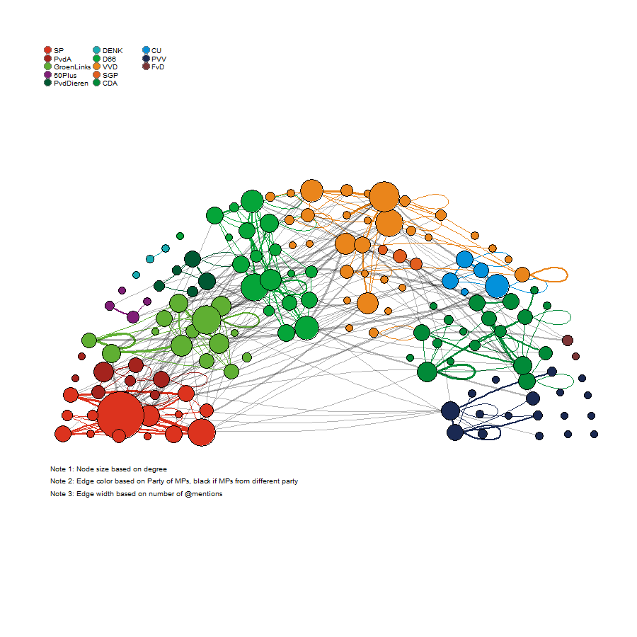

# (PART) Network Visualization  {-} 

# Network Visualization     

```{r, echo=FALSE, message=FALSE}
library(knitr)
opts_chunk$set(tidy.opts=list(width.cutoff=100),tidy=TRUE, warning = FALSE, message = FALSE,comment = "#>" , attr.source = ".numberLines", cache=TRUE, results = "hold") 
options(width = 100)
require(emo)
library(kableExtra)
```


```{r colorize, echo=FALSE}
colorize <- function(x, color) {
  if (knitr::is_latex_output()) {
    sprintf("\\textcolor{%s}{%s}", color, x)
  } else if (knitr::is_html_output()) {
    sprintf("<span style='color: %s;'>%s</span>", color,
      x)
  } else x
}
```


<style>

.button1 {
  background-color: #f44336; /* Red */ 
  border: none;
  color: white;
  padding: 15px 32px;
  text-align: center;
  text-decoration: none;
  display: inline-block;
  font-size: 16px;
  margin: 4px 2px;
  cursor: pointer;
}

.button1:hover {
  box-shadow: 0 12px 16px 0 rgba(0,0,0,0.24), 0 17px 50px 0 rgba(0,0,0,0.19);
}

.button1 {border-radius: 12px;}

.button1 {width: 100%;}
</style>


<script>
function myFunction() {

            var btn = document.getElementById("myButton");
            //to make it fancier
            if (btn.value == "Click to hide code") {
                btn.value = "Click to show code";
                btn.innerHTML = "Click to show code";
            }
            else {
                btn.value = "Click to hide code";
                btn.innerHTML = "Click to hide code";
            }
            //this is what you're looking for
            var x = document.getElementById("myDIV");
            if (x.style.display === "none") {
                x.style.display = "block";
            } else {
                x.style.display = "none";
            }
        }

</script>


Visualizations of social networks are cool. I am often impressed if I see them in papers. They seem to signal that the authors are technically savvy.  
If you know me a little bit you will also know that I think that the importance of a good description of your data cannot be downplayed: describing before (and over) explanation; simplicity (e.g. univariate or bivatiate statistics) trumps complexity. What is a better 'description' of your network data than a graphical summary of your network? What could I possibly have against network visualizations?    

Unfortunately, more often than not the story behind the (cool, dynamic, interactive) network picture is not clear. I do not see selection and influence processes. We have have to guess what the node and tie attributes are. And, importantly, typical network structures remain elusive. 

A good example of a bad network visualization is Smallworld, introduced in section \@ref(sn). After this tutorial, you will be able to make a much better visualization of Smallworld, see Assignment \@ref(asplots). 

Paradoxically, one of the reasons why oftentimes it is not worth the time to look at network visualizations is because scholars did not think it was worth the time to look at the data. 

The take home message of this chapter is that before you can make a successful network visualization you need to answer the following question: 

**What story do I want my network visualization to tell? **

The answer to this question depends on:  

  - your research question  
  - descriptive statistics of your data  
  - how preliminary network plots are able to convey your message. 

In this chapter we will take on three case studies:  

1. **Zachary's karate club**: We will first look for the story within the data. 
2. **Twittersphere**: The visualization of the three-layer twitter network in the Dutch House of Parliament should tell the story that twitter networks are segregated along party affiliations.  
3. **Co-author**: 


> Where for our analyses we heavily relay on the R package `lavaan` [@lavaan2012] and `RSiena` [@R-RSiena], for network description and visualisation we will mainly use `igraph` [@R-igraph2]. 

In this tutorial you will learn how to:  

1. Change node characteristics (including their coordinates)  
2. Change tie characteristics (depending on tie and dyad characteristics)  
3. Visualize subgroups (communities/cliques) in the network 
3. How to add a title, legend, etc. to the plot

A very good starting point on the web for network visualizations is the open access work of Katherina Ognyanova [@kateto2016]: <https://kateto.net/networks>. 

Naturally also have a look at the [manual of igraph for R](https://igraph.org/r/doc/). 

To have the list of parameters at hand when playing with `igraph`, run `?igraph.plotting`. 


---  


## Zachary's karate club

We will start with a classical example: Zachary's karate club [@zachary1977information]. We will pretend that we know close to nothing about this network beforehand. I will demonstrate you can (sometimes) discover the story behind the data by plots and descriptive statistics.  
As stated above, we will mainly rely on the `igraph` package. This means we have to make an igraph graph object before we can start doing anything. Luckily `igraph` comes with Zachary's network build-in. But don't worry, we will start from scratch later on. Let us have a first look at the data. 

```{r, message=FALSE, warning=FALSE}
require(igraph)
g <- make_graph("Zachary")
plot(g)
gmat <- as_adjacency_matrix(g, type="both", sparse=FALSE)
gmat

```

### Descriptive statistics

#### Size {-}
```{r}
#number of nodes
vcount(g)
#number of edges
ecount(g)

```

We discussed several network structure in section \@ref(structure-1). Decide for yourself at which structures you want to look at. I give three examples below. 

#### degree {-}
```{r}
degree(g)
#hist(table(degree(g)), xlab="indegree", main= "Histogram of indegree")
```

#### transitivity {-}
```{r}
#be aware that directed graphs are considered as undirected. but g is undirected. 
transitivity(g, type = c("localundirected"), isolates = c("NaN", "zero"))


```

#### betweenness {-}

```{r}
igraph::betweenness(g, directed = FALSE)
```
\
Which nodes attract your attention? 

### dyad-census
```{r}
dyad.census(g)
```

### triad-census

```{r}
igraph::triad.census(g)
#I will use sna because it shows the names of the triads as well. 
sna::triad.census(gmat)
```

Based on the above triad.census, please calculate the global transitivity of the network and check your answer with `igraph` or `sna`.  


<button class=button1 onclick="myFunction()" id="myButton" value="Click To Open Instructions">Only click button after 5 minutes!</button>

<div style="display:none;" id="myDIV">


```{r}

igraph::transitivity(g, type = "global")
sna::gtrans(gmat)

triad_g <- data.frame(sna::triad.census(gmat))

transitivity_g <- (3*triad_g$X300) / (triad_g$X201 + 3*triad_g$X300)
transitivity_g 
```

</div>
<br> 
\ 

Even if you did not read-up on Zachary's Karate club [@zachary1977information; @girvan2002community; @kadushin2012understanding] our initial plot and the above descriptive network statistics start to tell a story. There are two very central nodes (based on degree and betweenness) but their local transitivity index is relatively low (compared to other nodes). Are these two nodes connected? Well `gmat[1,34]` returns: `r gmat[1,34]`. Thus NO! 

### Network visualisation

Let's make size proportional to betweenness score:

```{r}
# changing V
V(g)$size = betweenness(g, normalized=T, directed = FALSE) * 60 + 10 #after some trial and error
plot(g, mode = "undirected")
```

It would be nice if we could place the nodes 1 and 34 further apart. 
Preferably based on some nice algoritm. After some browsing in the igraph manual, I came up with this. 
```{r}
set.seed(2345)
l <- layout_with_mds(g) #https://igraph.org/r/doc/layout_with_mds.html
plot(g, layout=l)

```

It does more or less what we want, but it would be great to place nodes 1 and 34 even further apart. 

```{r, results='hold'}
l #let us take a look at the coordinates
l[1,1] <- 4
l[34,1] <- -3.5 
plot(g, layout=l)

```
\

It now more or less looks like nodes 1 and 34 are ripping the network in two. Hey, that is a funny coincidence, let that now be exactly what the original paper was all about.  


`r colorize("CAUTION!!", "red")`:  

In the last step we manipulated our data. The coordinates of two nodes have been altered manually and are no longer determined by some 'objective' algorithm. Is this not the same as slightly changing an inconvenient correlation in a correlation matrix or as removing some outliers from our dataset? At the very minimum, make sure to tell your readers what you have done! Add a note/legend to your graph. 


```{r, results='hold'}

plot(g, layout=l, margin=c(0,0,0,0))
legend(x=-2, y=-1.5, c("Note: the position of nodes 1 and 34 have been set by Jochem Tolsma \n for visualisation purposes only and do not reflect network properties"), bty="n", cex=.8)
```

---  

## Twittersphere in the Dutch HoP


We are going to play with Twitter Networks among Dutch MPs. 


```{r, echo=FALSE}
xfun::embed_file("twitter_20190919.Rdata")
```

  
  
Load the Robject and have a look at it. Save the list elements in separate objects. We will use the same R object in the chapters on complete networks. 

```{r,  attr.source = '.numberLines', results='hold'}
load("twitter_20190919.RData") #change to your working directory
str(twitter_20190919,1)
keyf <- twitter_20190919[[1]]
mydata <- twitter_20190919[[2]]
seats <- twitter_20190919[[3]]

```
So, what do we have? 

- `keyf`: a data.frame on 147 Dutch MPs. 
- `mydata`: This an object which is ready to analyze in RSiena. It is actually a quite complicated object. For now three things are important:  
  1. The nodes in `mydata` are the same as in `keyf` and in `seats`.  
  2. It contains the twitter data at three timepoints (in `mydata$depvars`). We have three layers: 
      - fnet: who follows whom
      - atmnet: who atmentions whom
      - rtnet: who retweats whom  
  3. It also contains time invariant information on the nodes (in `mydata$cCovars`)
- `seats`: a dataset which contains the coordinates of the seats in the House of Parliament in the Netherlands. 

We are going to focus on the atmentions of politicians. This is most closely related to political discussion. Thus who is having discussions with whom on Twitter? 


Let us go fishing for some data. At this point it is not very important you understand what is going on. You will learn more about RSiena data objects in Chapter \@ref(socionets). For now, simply do as you are told! `r emo::ji("wink")`   

```{r}
fnet <- mydata$depvars$fnet
atmnet <- mydata$depvars$atmnet
rtnet <- mydata$depvars$rtnet

vrouw <- mydata$cCovars$vrouw
partij <- mydata$cCovars$partij
ethminz <- mydata$cCovars$ethminz
lft <- mydata$cCovars$lft

#if you construct an object for RSiena, covariates are mean centered by default. I would like to have the original values again. 
ethminz <- ethminz + attributes(ethminz)$mean
partij <- partij + attributes(partij)$mean
vrouw <- vrouw + attributes(vrouw)$mean
lft <- lft + attributes(lft)$mean

```

Have a look at the network data. What are we a looking at? 

```{r}
str(fnet)
```

It is just a 'sienaDependent' something `[1:147,1:147,1:3]` but with a lot of attributes which we may ignore for now. It is an array. In this array our nominations are stored in adjacency matrices.  
Let us select the friendship (more precisely, the follower relations) relations and the atmention relations. 

```{r}
fnet1 <- fnet[,,1] #friendship network wave 1
atmnet1 <- atmnet[,,1]#atmention network wave 1
#we will use wave 2 and 3 later. 
atmnet2 <- atmnet[,,2]
atmnet3 <- atmnet[,,3]

```


>You may wonder why we only have 147 nodes (of MPs) in our data. Well that is because at the time of writing three MPs did not have a twitter account or at least we could not find it. 

One final thing before we can go and play with the data. We have to replace the missing values of RSiena `10` (structural zeros) into `0` (or `NA`) as well. 

```{r}

# table(fnet1, useNA="always") #uncomment if you want
fnet1[fnet1==10] <- 0
# table(fnet1, useNA="always") #uncomment if you want

atmnet1[atmnet1==10] <- 0
atmnet2[atmnet2==10] <- 0
atmnet3[atmnet3==10] <- 0
```

### Descriptive statistics  

We describe this dataset in quite some detail in Chapter \@ref(socionetsm). But I think it is good to show an important observation here as well: 


```{r densities, echo=FALSE}

desmat <- read.csv2("20190829desmat.csv")

colnames(desmat) <- c("", "friends w1", "friends w2", "friends w3","atmentions w1","atmentions w2","atmentions w3","retweets w1","retweets w2","retweets w3") 

desmatkable <- kbl(desmat, booktabs=TRUE, digits=2, align = c("l", "c", "c","c","c","c","c","c","c","c"), caption="Intra- and inter-group densities of Twittershere within the Dutch House of Parliament") %>%
  kable_classic(full_width = F, html_font = "Cambria") %>%
  kable_styling(bootstrap_options = c("striped", "hover", "condensed", "responsive")) %>%
  column_spec(column = 1, width = "3in")  %>% 
 scroll_box(width="100%", height = "400px")
  
desmatkable

```
\

From Table \@ref(tab:densities) we learn that intra-party densities are much higher than inter-party densities. This is an indication of segregation of Twittersphere along party division lines. This is the message we want our plots to get across. 

### First plots

The first step is to make a 'graph object'. 

```{r}
G1 <- igraph::graph_from_adjacency_matrix(atmnet1, mode = "directed", weighted = NULL, diag = TRUE,  add.colnames = NA, add.rownames = NA)
```

Suppose you would like to add the data to this graph. 
```{r}
#we need to retrieve the edges. 
edges <- as_data_frame(G1, what="edges")

#the first variable of the data we can attach needs to be some id, thus reorder columns of keyf
keyf <- cbind(keyf$EGOid, keyf[,names(keyf)!="EGOid"])
#the name has been changed as well. Lets correct this
names(keyf)[1] <- "EGOid"

#rebuild the graph. 
G1 <- graph_from_data_frame(edges, directed=TRUE, vertices=keyf)

#let us examine the attributes
vertex_attr(G1)

#thus to find the names of our MPs we could now do this: 
V(G1)$Naam
```

But now let us start plotting. 

```{r}
plot(G1)
```


I cant see anything!! |:-(  
Would `simplify` help? 

```{r}
G1 <- simplify(G1) 
plot(G1)

```
\
Still way too dense. What is the density of the network??

```{r}
edge_density(G1)
```
Actually, not very high at all. 

### From directed to reciprocated ties

But let us try to plot only the reciprocated ties. 

```{r}

#define undirected network 
atmnet1_un <- atmnet1 ==1 & t(atmnet1)==1

G2 <- graph_from_adjacency_matrix(atmnet1_un, mode = "undirected", weighted = NULL, diag = TRUE,  add.colnames = NA, add.rownames = NA)

#attach data if you want
edges <- as_data_frame(G2, what="edges")
G2 <- graph_from_data_frame(edges, directed=FALSE, vertices=keyf)
plot(G2)

```
\
Mmm, It looks like MPs do like to mention themselves! Let simplify again. 

```{r}
G2 <- simplify(G2) 
plot(G2, mode="undirected")
```

### Select nodes to plot


Suppose we want to remove the isolates. 

```{r}
#first make sure we don't end up with MPS who only mention themselves
diag(atmnet1_un) <- 0

#lets find the noisolates
noisolates <- rowSums(atmnet1_un, na.rm=T)>0
#length(noisolates)
#sum(noisolates) 
#if you select, select both correct nomination network as ego characteristics
atmnet1_un_sel <- atmnet1_un[noisolates,noisolates]
#if you are going to use the dataset keyf to add characteristics to the plot later, make sure to run the correct selection as well!!!
keyf_sel<- keyf[noisolates,]

G2_sel <- graph_from_adjacency_matrix(atmnet1_un_sel, mode = "undirected", weighted = NULL, diag = TRUE,  add.colnames = NA, add.rownames = NA)
G2_sel <- simplify(G2_sel) 
plot(G2_sel, mode = "undirected")
```
\
The same logic of course applies if you would like to select on node attributes (e.g. gender, party).

```{r}
#option 1: see above. 
#only select MPs from the liberal party
selection <- keyf$Partij == "VVD"
#build new adjacency matrix
atmnet1_un_sel2 <- atmnet1_un[selection,selection]
#etc. 

#option 2. Suppose we have attached our dataset to our graph object. 
#only select MPs from the liberal party
selection <- V(G2)$Partij == "VVD"
selection_id <- which(selection) # this gives us a numeric variable
G_sel <- induced_subgraph(G2, v=selection_id)
plot(G_sel)

```


### Changing vertices


#### size {-}

You could use two different notations:  

1. `V(graph)$parameter <- ... `   
2. `plot(graph, vertex.parameter = ... )`  

```{r}

#changing V
V(G2)$size = degree(G2)*1.05 #naturally, you may use a different node-level structural characteristic here. 
plot(G2, mode = "undirected")

# this equivalent to: 
# plot(G2, vertex.size = degree(G2)*1.05)

```

#### labels and color {-}
```{r}
V(G2)$label=as.character(V(G2)$Naam2)
V(G2)$label.cex=1
V(G2)$color <- ifelse(V(G2)$Geslacht == "vrouw", "red", "green")
plot(G2, mode = "undirected")
```

### Changing edges I

You could use two different notations:  

1. `E(graph)$parameter <- ... `   
2. `plot(graph, edge.parameter = ... )`  

#### Arrow size and curvature {-}

```{r}
#changing E
E(G2)$arrow.size=.4
E(G2)$curved=.3
plot(G2, mode = "undirected")

# is equivalent  to: 
# plot(G2, mode= "undirected", edge.arrow.size = .4, edge.curved=.3)
```

### Add a legend

```{r}
#adding legend
# because I am working in Rmarkdown I need some {}
plot.igraph(G2, margin=0, mode="udirected")
legend(x=-1, y=-1, c("Female","Male"), pch=21,
       col="#777777", pt.bg=c("red", "green"), pt.cex=2, cex=.8, bty="n", ncol=1)


```

### Coordinates  

Lets put the MPs where they belong.  
Inspect coordinates. 
The colors refer to the different parties.

```{r, fig.show="hold", out.width="50%"}

plot(keyf$X, keyf$Y, xlim=c(-18,18), ylim=c(-18,18), col=keyf$Partij_col, pch=16)
```
\
In case you wonder. The empty seats are the MPs without a Twitter account. 
Lets assign these coordinates to our MPs

```{r, results="hold", fig.width=9}
#it really depends on your plotting window (size, resolution etc.) to get consistent results you need to define this beforehand. won't do that now. 


#give nodes coler of their party
V(G2)$color <- keyf$Partij_col

#change node size a bit
V(G2)$size= degree(G2)*1.05 + 6

#remove the labels
V(G2)$label=""

#less curvature
E(G2)$curved=.1

owncoords <- cbind(keyf$X, keyf$Y)
owncoords <- owncoords/8
owncoords[,1] <- (owncoords[,1] - mean(owncoords[,1]))
owncoords[,2] <- (owncoords[,2] - mean(owncoords[,2]))
plot.igraph(G2, mode="undirected", layout=owncoords, rescale=F, margin=c(0,0,0,0), xlim=c(min(owncoords[,1]),max(owncoords[,1])),  ylim=c(min(owncoords[,2]),max(owncoords[,2])))

```

### Changing edges II 

#### preperation {-}  

We can change the edges based on dyad characteristics but if we have a weighted adjacency matrix also on the weights of the edges. 
To demonstrate this I first make a weighted atmention network. I simply sum whether MPs have mentioned each other in t1, t2 and t3. 

```{r}
#construct adjacency matrix
#first define the recipricated atmentions in each wave
atmnet1_un <- atmnet1 ==1 & t(atmnet1)==1
atmnet2_un <- atmnet2 ==1 & t(atmnet2)==1
atmnet3_un <- atmnet3 ==1 & t(atmnet3)==1

atmnet_weighted <- atmnet1_un + atmnet2_un + atmnet3_un

#contstruct graph / let us keep the loops
#note that the parameter 'weighted' is set to true. 
G_w <- igraph::graph_from_adjacency_matrix(atmnet_weighted, mode = "undirected", weighted = TRUE, diag = TRUE,  add.colnames = NA, add.rownames = NA)

#attach data
edges <- as_data_frame(G_w, what="edges")
#inspect the weight.
edges$weight #not a lot of variation. 

#rebuild the graph. 
G_w <- graph_from_data_frame(edges, directed=FALSE, vertices=keyf)


#add changes as above
V(G_w)$color <- keyf$Partij_col
V(G_w)$size= degree(G_w)*1.05 + 6
V(G_w)$label=""
E(G_w)$curved=.1

#add the weights
E(G_w)$width <- E(G_w)$weight

plot.igraph(G_w, mode="undirected", layout=owncoords, rescale=F, margin=c(0,0,0,0), xlim=c(min(owncoords[,1]),max(owncoords[,1])),  ylim=c(min(owncoords[,2]),max(owncoords[,2])))


```

#### change edge based on dyad charactersitics {-}

```{r, eval=FALSE,fig.cap="Reciprocated at-mention relations between Dutch MPs (2017)"}


#let us make them the color of the nodes if it is between nodes from same party. 
#let us make them red if between parties

edges <- get.adjacency(G_w)
edges_mat <- matrix(as.numeric(edges), nrow=nrow(edges))
#edges_mat

#because we have undirected, we only need the edges once ...I know ...
edges_mat[lower.tri(edges_mat)] <- 0
#table(keyf$Geslacht)

teller <- 1
coloredges <- NA
#we will loop over egos
for (i in 1:nrow(edges)) {
  #We then loop over alters
  for (j in 1:ncol(edges)) {
    #we check if there is a tie between ego and alter
    if (edges_mat[i,j]==1) {
      #if so, we check ego and alter are from the same party
      #if so, we give the tie the color of the party
      if (keyf$Partij_col[i] == keyf$Partij_col[j]) {coloredges[teller] <- keyf$Partij_col[i]}
      #if so, we check ego and alter are from the same party
      #if not, we give the tie a transparent grey color
      if (keyf$Partij_col[i] != keyf$Partij_col[j]) {coloredges[teller] <- "#0000004B"}
      teller <- teller + 1
    }
  }
}

E(G_w)$color=coloredges

#prepare a legend
Party_names <- unique(keyf$Partij)
Party_cols <- unique(keyf$Partij_col)
#reorder
Party_names <- Party_names[c(7,3,9,10,12,11,5,4,6,2,8,1,13)]
Party_cols <- Party_cols[c(7,3,9,10,12,11,5,4,6,2,8,1,13)]

#save the plot
#png("MPplotv2.png",width = 900, height= 900)
{ 
  
plot.igraph(G_w, mode="undirected", layout=owncoords, rescale=F, margin=c(0,0,0,0), xlim=c(min(owncoords[,1]),max(owncoords[,1])),  ylim=c(min(owncoords[,2]),max(owncoords[,2])))

legend("topleft", legend=Party_names, pch=21, col="#777777", pt.bg=Party_cols, pt.cex=2, cex=.8, bty="n", ncol=3)

text(-2.2,-1.2, "Note 1: Node size based on degree", adj=0, cex=0.8)
text(-2.2,-1.3, "Note 2: Edge color based on Party of MPs, black if MPs from different party", adj=0, cex=0.8)
text(-2.2,-1.4, "Note 3: Edge width based on number of @mentions", adj=0, cex=0.8)
}  

#dev.off()
 
  
```

```{r, echo=FALSE, fig.cap="Reciprocated at-mention relations between Dutch MPs (2017)", out.width="100%"}

```

---

## Co-author networks

TO DO!

---  

## Assignment {#asplots}

1. Improve the plot of Zachary's karate club:  
    - remove the labels  
    - add the relevant names for the persons in the network  
    - add communities (either based on network characteristics or based on what happened in reality to this network)  
    - add an informative title and legend  
2. Improve the plot of Twittersphere in the Dutch House of Parliament:  
    - Perhaps change the size of nodes based on ties that cross party boundaries?  
    - Try to make a plot where information on the different layers of twitter (friendships, atmentions and retweets) are combined. Thus combine in one plot, or plot three networks next to each other. 
3. A good example of a bad network visualization is Smallworld \@ref(sn). The visualization of Smallworld should tell the story that a typical smallworld network has a relatively low density, high level of clustering and low average path length, see Chapter \@ref(socionetst). Make a good example of a good network visualization of Smallworld. Please download the igraph object of Smalworld [here](smallworld.Rdata).  
    
---  


