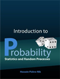

# (APPENDIX) Appendix {-} 

# Introduction to R for SNA {#tutorial}

```{r globalsettings, echo=FALSE, warning=FALSE}
library(knitr)
opts_chunk$set(tidy.opts=list(width.cutoff=100),tidy=TRUE, warning = FALSE, message = FALSE,comment = "#>", cache=TRUE)
opts_chunk$set(attr.source = ".numberLines")
options(width = 100)
source("util.r")

```


```{r, echo=FALSE, warning=FALSE, results='hide', message=FALSE}
require(xfun)
require(foreign)
require(tidyverse)
require(mice)
require(labelled)
```


## Preliminary notes

This very short R tutorial is for students who already have some experience with R who want to make the switch from stata/spss to R.

\- In this tutorial I assume you will work with RScripts (.R files) not with Rmarkdown (.Rmd files)\
- I will show you how to do things in base R and in a Tidyverse way.

## Getting up and running

-   install the latest version of R: [R](https://cran.r-project.org/)
-   install the latest version of RStudio: [RStudio](https://www.rstudio.com/)
-   open RStudio and follow a brief tour/tutorial [brief tour of Gulzar](https://web.cs.ucla.edu/~gulzar/rstudio/basic-tutorial.html)

Do you Want more information, or are you looking for a different (tidyverse) tutorial?

-   [R-bloggers](https://www.r-bloggers.com/how-to-learn-r-2/)
-   [RStudio cheatsheets](https://www.rstudio.com/resources/cheatsheets/)
-   [R for Data Science](http://r4ds.had.co.nz/)
-   [Statistical Inference via Data Science: A Modern Dive into R and the tidyverse](https://www.moderndive.com/)

Are you a Research Master Social and Cultural Science student? Or, a social science student/scientist with some statistical background in descriptive and explanatory statistics (e.g. regression analysis) who wants to make a switch from SPSS to R? Please read on.

Open RStudio. Your screen will look something like this:

```{r screenshot, echo=FALSE, fig.cap="Screenshot Rstudio", out.width = '100%'}
knitr::include_graphics("screenshot.PNG")
```

-   During the workgroup I will show you around the major subwindows and taps in RStudio.

## Working with RScript

-   Open a new R-script (via file --\> new --\> RScript (see Figure \@ref(fig:screenshot) **Arrow 1**), or simply hit *Ctrl+Shift+N*)
-   Start your script with your name and date.
-   Start with a clean workspace.
-   Start with the latest versions of R, RStudio and your packages.
-   Load the additional packages you will need later.
-   Define your workdirectory.

Thus your RScript will look something like this:

```{r, eval=FALSE}
###########################
# Title: Introducation to R for SNA
# Author: J Tolsma
# version: 30-10-2019
###########################

#start with clean workspace 
rm(list=ls())

#install.packages I will need later here
install.packages("installr") #you  first install packages
require(installr) #then you will need to load them. This package is used to simply update R
install.packages("foreign")
require(foreign) #used to read in spss data files
require(tidyverse)
#update if necessarry. Best to run this command in RGui, not in RStudio.
updateR()

#define workdirectory, note the double backslashes
setwd('C:\\SNA-4-Social-Scientists\\') #change to your own workdirectory

```

Do you see I start some lines with a `#` these lines are comments and not code/commands. This is similar as the `*` sign in SPSS.\
To run some code, you place your cursor in the line and hit *Ctrl+Enter*. You may also select the code you want to run, or copy and paste it directly in the console window (\@ref(fig:screenshot) **Arrow 2**). To see which commands you have executed, you may want to have a look at the history tab (\@ref(fig:screenshot) **Arrow 3**).

> Hint 1: In the upper right corner of the code blocks you see a *copy-and-paste* sign. You may use this to copy and paste the code of this tutorial in your own script.\
> Hint 2: You really want to learn R? Never ever copy and paste code. Type the code yourself.

## Installing additional packages

You will probably always need to load and/or install additional packages. You may want to use RStudio's functionality (\@ref(fig:screenshot) **Arrow 4**). I normally prefer to put everything in my script. See for example in the code block above, line 9 to 12.

## I don't understand the code!!

When you see `functionname()`[^tutorial-csr-1] it means we use a build-in function of R If you want to see how lines/commands/functions work, try to decipher them from the inside out. Thus if you want to dechiper `rm(list=ls())`:

[^tutorial-csr-1]: Programmers like to confuse us simple persons. They thus make up mock names to indicate that the name is irrelevant. Thus a real programmer will never use `functionname()` but will use `foo()` or `bar()` or `foobar()` .

-   `ls()`
-   `list=ls()`
-   `list`

Let's give it a go:

```{r, results}
tesvariable <- 4
ls()
list=ls()
list
ls()
rm(list)
ls()
#? :-)
rm(list=ls())
ls()

```

If you want to know more about specific functions, try to use the help function. For example try the following:

-   `?ls`
-   `?rm`

Any idea what `<-` does?

At first it will be difficult to read the R Documentation pages. Don't worry, you will get the hang of it.

How am I to remember all that code/syntax??!!

-   By using them.
-   You don't need to, you just need to remember in which script you used them before.
-   By using [existing cheat sheets]("https://www.rstudio.com/resources/cheatsheets/")
-   By making your own cheat sheets.

> You being the ideal student, you started your own cheat sheet. What should be on it by know?
>
> **Functions**:
>
> -   `install.packages()` \# to install additional packages. Only do this once or to update package.
> -   `require()` \# activate installed package
> -   `setwd()` \# set your working directory
> -   `ls()` \# list the objects in your environment
> -   `rm()` \# to remove objects
>
> **packages**:
>
> -   `installr` \# a package to easily update R (needs to be run in Rgui directly instead of RStudio )
> -   `foreign` \# to read in spss data files
> -   `tidyverse` \# a bunch of packages which allows for a completely different way of programming/scripting in R.\
>
> **operators / symbols**:
>
> -   `?` \# if placed in front of a function opens up the help pages.
> -   `<-` \# used to assign values/objects to a different object.
> -   `=` \# used to assign values/objects to arguments within a function.

## Reading in data files

We are going to work with two datasets: "Culturele Veranderingen". For more information on these datasets, see [here](https://www.scp.nl/Onderzoek/Bronnen/Beknopte_onderzoeksbeschrijvingen/Culturele_veranderingen_in_Nederland_CV).

Please download the files to your working directory.

[Cultural_Changes_2008.sav](addfiles\Cultural_Changes_2008.sav)\
[Cultural_Changes_2010.sav](addfiles\Cultural_Changes_2010.sav)  

There are different packages to read in data. Generally, I would recommend to use the `haven` package. In the past I used the `foreign` package. The advantage of using `haven::read_spss` is that more information is stored in the dataset and in the variables (variable/value labels!!). A disadvantage is that not all other functions/packages of R are capable of dealing with the data object that haven produces.

> below I will use `package_name::function_name` notation, to make explicit from which package the function belongs.

```{r readingspss, warning=FALSE, message=FALSE}
#ignore the warnings  
#?read.spss
#note that I have saved the data files in a folder called 'addfiles'. 

cv08 <- foreign::read.spss("addfiles\\Cultural_Changes_2008.sav", use.value.labels=T, to.data.frame=T)
cv10 <- foreign::read.spss("addfiles\\Cultural_Changes_2010.sav", use.value.labels=T, to.data.frame=T)

#normally I think setting use.value.labels=F is more convenient. Thus lets load the data again but now without labels 
cv08_nolab <- foreign::read.spss("addfiles\\Cultural_Changes_2008.sav", use.value.labels=F, to.data.frame=T)
cv10_nolab <- foreign::read.spss("addfiles\\Cultural_Changes_2010.sav", use.value.labels=F, to.data.frame=T)

#finally, import the data using haven
cv08_haven <- haven::read_spss("addfiles\\Cultural_Changes_2008.sav")
cv10_haven <- haven::read_spss("addfiles\\Cultural_Changes_2010.sav")

```

So you see I read in the data by using the function `read.spss()` of the package 'foreign'. Within this function I set some arguments/parameters (e.g. use.value.labels).

Now we can inspect our datasets and look for some differences:

-   Find the *Environment* tab in the upper right window (\@ref(fig:screenshot) **Arrow 5**).  
    -   Find the little arrow and decollapse.  
    -   What do we see?  
-   Double click on the three versions of the cv08 datasets.  
    -   What happens?  
    -   Go to the new windows and have a look at the data. What are the differences?  
    -   Close this window when finished.  
-   Lets use some build-in functions to get more information of our dataset.

```{r datastr}
str(cv08)
str(cv08_nolab)
str(cv08_haven)
```

The function `str()` asks for the structure of an object in your environment. You will see that the original data is stored differently in the three datasets. The different objects (cv08, cv08_nolab and cv08_haven) have a different structure. cv08 and cv08_nolab are 'data.frame' objects, the `haven::read_spss` function produces a 'tibble'.

Let us have quick look at the structure of some variables. The take home message is that information is stored differently and that different information is stored,depending on the package used to read the data. 

> To access a variable in a dataset use `datasetname$variablename`.
>
> Add to your cheat sheet under operators/symbols: `$`

```{r}
str(cv08$lftop) #a factor
str(cv08_nolab$lftop) # a numeric variable
str(cv08_haven$lftop) # a 'dbl+lbl' this stands for doubles, or real numbers, which are labeled

#next to the data itself, attributes are stored
attributes(cv08$lftop)
attributes(cv08_nolab$lftop)
attributes(cv08_haven$lftop)

#to access specific attributes
attr(cv08_haven$lftop, "labels")

summary(cv08$lftop)
summary(cv08_nolab$lftop)
summary(cv08_haven$lftop)

table(cv08_haven$lftop, useNA = "always")
```

You can also have a look at your data. Try out the following commands. 

```{r inspectdata, eval=FALSE}
names(cv08_haven)
summary(cv08_haven)
head(cv08_haven)
#fix(cv08_haven) #will produce an error
fix(cv08)
View(cv08_haven)
```

> Add to your cheat sheet under **functions**: `str(), summary(), attributes(), attr(), table(), names(), head(), fix(), View()`

## Define missings

Okay, lets start playing around with our dataset. We are going to have a look at specific variables, define missings, recode some values, etc. I will focus on the dataset created by the haven package.


### R Base

Lets use age as example. This variable is called **lftop** in CV. First have a look at this variable.

```{r datamanip, results='hold'}
str(cv08_haven$lftop)
summary(cv08_haven$lftop)
attr(cv08_haven$lftop, "labels")
table(cv08_haven$lftop, useNA="always")
```

We have category 'onbekend', which should be a missing. Let's copy the original variable in a new one, and attach it to the dataset. Thus not:\
`lftop_new <-  cv08$lftop`\
but:

```{r}
cv08$lftop_new <-  cv08$lftop
```

You probably already noticed that to assign values to a new object we use `<-`. What we now want to do is to replace those values of our new variable `cv08$lftop_new` which have the values **Onbekend**. We thus have to use **subsetting**. 

```{r}
cv08$lftop_new[cv08$lftop_new=="Onbekend"] <-  NA
```

Dont forget, if you want to understand the code work inside out.

> Update your cheat sheet! Note that `==` is a logical operator. What are the other logical operators in R?\
> Note that `[]` is used to subset elements from an object (e.g. dataframe/vector/matrix)\
> Note that `NA` is used in R to define missing values. It means Not Applicable.

So did our recode work?

```{r}
table(cv08$lftop_new, useNA="always")
levels(cv08$lftop_new)
```

But we want age as numeric variable not as a factor (categorical).

```{r}
str(cv08$lftop_new)
cv08$agen <- as.numeric(as.character(cv08$lftop_new)) #how clumsy. we first convert the factor to a string and then to a numeric variable. 
table(cv08$agen, useNA="always")
str(cv08$agen)
```

> Hint: R is case sensitive. Just try to avoid capitals in your variable names. There are people who have set up a whole list of rules how to name and label stuff. Interesting? You can have a look [here](https://style.tidyverse.org/).\
> I will use all_lower_case_underscore_seperated.\
> Add to your cheat sheet `as.character()` and `as.numeric()`.

### Tidy

Copy the variable\
We will 'mutate' the original dataset by adding a variable.

```{r}
cv08_haven <- mutate(cv08_haven, lftop_new=lftop)
```

Replace missings.\
Be aware that the value **99** is the "onbekend" category.

```{r}
cv08_haven$lftop_new <- na_if(cv08_haven$lftop_new, 99)
```

Normally you would combine these two steps into one

```{r}
cv08_haven <- mutate(cv08_haven, lftop_new=na_if(lftop, 99))
```

check

```{r}
table(cv08_haven$lftop_new, useNA="always")
```

An advantage of the tidy way is that it is more intuitive and requires less subsetting.\
A disadvantage is that you need to know more specific functions.

> Hint: In your cheat sheet, make a distinction between all the stuff that belongs to R Base and all specific functions, operators, etc. that are part of Tidyverse.\
> How do you know it is part of Tidyverse? Well, if you don't load tidyverse, the code will not work.

## Recoding variables

So, we defined a missing value for age. As a second example let us recode the variable education. This one is called **var006n** in CV08. Lets create a new variable **educ3** with three levels:\
1. primary\
2. secondary\
3. tertiary

### R Base

```{r recode}
levels(cv08$var006n)
table(cv08$var006n, useNA="always")

#lets make it a numeric var first
cv08$educn <- as.numeric(cv08$var006n)
#check
table(cv08$educn, useNA="always")

#start with an empty variable
cv08$educ3 <- NA
#fill category by category
cv08$educ3[cv08$educn==2 | cv08$educn==3] <- 1
cv08$educ3[cv08$educn>3 & cv08$educn<8] <- 2
cv08$educ3[cv08$educn>7 & cv08$educn<11] <- 3

#check
table(cv08$educ3, useNA="always")
prop.table(table(cv08$educ3, useNA="always"))

#now educ3 is a numeric variable, we want it as factor
cv08$educ3 <- as.factor(cv08$educ3)
table(cv08$educ3, useNA="always")
levels(cv08$educ3) <- c("primary", "secondary", "tertiary")
table(cv08$educ3, useNA="always")
```

> Is this really the first time we encountered the function `c()`? Well, make sure it is somewhere at the top of your cheat sheet.

### Tidy

And now the fun starts. Tidyverse includes a `dplyr::recode` function, but this function does not work on labelled variables imported via the haven package. Luckily, there is a package that extends the original function, `labelled`.

```{r}
#install.packages("labelled")
require(labelled) #to be able to use the recode function on haven labelled variables

#inspect variable
str(cv08_haven$var006n)
attr(cv08_haven$var006n, "labels")
table(cv08_haven$var006n, useNA="always")

#recode values, all missings as one value
cv08_haven <- mutate(cv08_haven, educ3=recode(var006n, '-3'=-9, '-1'=1, '1'=1, '2'= 2 , '3'= 2, '4'= 2, '5'= 2, '6'= 3, '7'= 3, '8'= 3, '10'= -9), .keep_value_labels = FALSE)

#replace missing values with NA.
cv08_haven <- mutate(cv08_haven, educ3=na_if(educ3, -9))

#make educ3 a factor
cv08_haven <- mutate(cv08_haven, educ3=factor(educ3, levels = c(1,2,3),
labels = c("primary", "secondary", "tertiary")))

#check
table(cv08_haven$educ3, useNA="always")

```

Personally, I think this is all quite complicated. But I guess this is a matter of taste.

And advantage of the Tidy way is that you could use the `%>%`, the **piping operator**. Now, your code does not read from the inside out but from left to right. For many people this is more intuitive. The output of the function on the left is transported to the (first argument of the) function on the right. Thus, in the example below, you see that in the second and third call to mutate I don't have to tell the function which dataset I am using.

```{r}
cv08_haven <- mutate(cv08_haven, educ3=recode(var006n, '-3'=-9, '-1'=1, '1'=1, '2'= 2 , '3'= 2, '4'= 2, '5'= 2, '6'= 3, '7'= 3, '8'= 3, '10'= -9), .keep_value_labels = FALSE) %>%  
  mutate(educ3=na_if(educ3, -9)) %>%
  mutate(educ3=factor(educ3, levels = c(1,2,3), labels = c("primary", "secondary", "tertiary")))
```

Perhaps an even tidier way would be:

```{r, eval=FALSE}
cv08_haven <- cv08_haven %>% 
  mutate(educ3=recode(var006n, '-3'=-9, '-1'=1, '1'=1, '2'= 2 , '3'= 2, '4'= 2, '5'= 2, '6'= 3, '7'= 3, '8'= 3, '10'= -9), .keep_value_labels = FALSE) %>%  
  mutate(educ3=na_if(educ3, -9)) %>%
  mutate(educ3=factor(educ3, levels = c(1,2,3), labels = c("primary", "secondary", "tertiary")))
```

In the example above, it still may 'feel' a little clumsy to have to make a call to the same `mutate` function three times. Well, this is indeed not necessary.

Thus, the most tidy way is:

```{r, eval=FALSE}
cv08_haven <- cv08_haven %>% 
  mutate(educ3=recode(var006n, '-3'=-9, '-1'=1, '1'=1, '2'= 2 , '3'= 2, '4'= 2, '5'= 2, '6'= 3, '7'= 3, '8'= 3, '10'= -9, .keep_value_labels = FALSE),
         educ3=na_if(educ3, -9),
         educ3=factor(educ3, levels = c(1,2,3), labels = c("primary", "secondary", "tertiary")))
```

## Means and counting specific values

### R Base

Next step. Lets calculate a mean. We will use three questions in CV on polarization. This does not make any theoretical sense of course.

Step 1: have a look at the vars
```{r, results='hold'}
summary(cv08$int055)
summary(cv08$int056)
summary(cv08$int057)
```

Step 2: make numeric
```{r, results='hold' }
cv08$int055n <- as.numeric(cv08$int055)
table(cv08$int055n, useNA="always")
cv08$int056n <- as.numeric(cv08$int056)
table(cv08$int056n, useNA="always")
cv08$int057n <- as.numeric(cv08$int057)
table(cv08$int057n, useNA="always")
```

Step 3: define missings and recode
```{r, results='hold' }
cv08$int055n[cv08$int055n<5] <- NA
cv08$int055n <- cv08$int055n  - 4
cv08$int056n[cv08$int056n<5] <- NA
cv08$int056n <- cv08$int056n  - 4
cv08$int057n[cv08$int057n<5] <- NA
cv08$int057n <- cv08$int057n  - 4
```

Step 4: calculate means. 
```{r, results='hold' }
#How does the function mean work in R?
mean(cv08$int055n) #whoops
mean(cv08$int055n, na.rm=TRUE) #works.  but not what we want. 
mean(c(cv08$int055n, cv08$int056n, cv08$int057n), na.rm = T) #works but not what we want.
```

This is not what we want. What we want is to calculate a mean for each row/respondent. This will do the trick:

```{r }
testmeans <- rowMeans(cbind(cv08$int055n, cv08$int056n, cv08$int057n), na.rm = T)
head(testmeans) #yes!
```

What we really want is a mean but only if there is a maximum of 1 NA in the three variables.

```{r}
#lets first count how many missings we have for each respondent
nmis <- rowSums(is.na(cbind(cv08$int055n, cv08$int056n, cv08$int057n)))

# ?is.na
# ?rowSums

testmeans <- ifelse(nmis<2,testmeans, NA)

#add the calculated means to our dataset
cv08$int_mean <- testmeans

#Bonus: count specific values
#so now we have this, it is easy to find how many times respondents answered 'zeer groot', that is '1'
#timesZG <- rowSums(cbind(cv08$int055n, cv08$int056n, cv08$int057n)==1, na.rm=T)
```

> You need to add a lot of very powerful functions to your cheat sheet: `mean()`, `rowMeans()`, `rowSums`, `cbind()`, `is.na()`, `ifelse().`
>
> Did you also notice that the logicals **FALSE** and **TRUE** can be summed? (FALSE equals 0 and TRUE equals 1).

### Tidy

Here it goes in one big code chunk. 
```{r, results='hold' }

#Step 1: have a look at the vars
str(cv08_haven$int055)
attr(cv08_haven$int055, "labels")
summary(cv08_haven$int055)
summary(cv08_haven$int056)
summary(cv08_haven$int057)

table(cv08_haven$int055n, useNA="always")
table(cv08_haven$int056, useNA="always")
table(cv08_haven$int057, useNA="always")

#Step 2: define missings and recode
cv08_haven <- mutate(cv08_haven, int055n=recode(int055, '-6'=-9, '-5'=-9,'-3'=-9,'-2'=-9, '1'=4, '2'= 3 , '3'= 2, '4'= 1), .keep_value_labels = FALSE) %>% 
  mutate(int055n=na_if(int055n, -9)) %>%
  mutate(int055n=labelled(int055n, c("Helemaal geen tegenstelling" = 1, "Niet zo groot" = 2, "Groot"=3, "Zeer groot"=4)))

cv08_haven <- mutate(cv08_haven, int056n=recode(int056, '-6'=-9, '-5'=-9,'-3'=-9,'-2'=-9, '1'=4, '2'= 3 , '3'= 2, '4'= 1), .keep_value_labels = FALSE) %>% 
  mutate(int056n=na_if(int056n, -9)) %>%
  mutate(int056n=labelled(int056n, c("Helemaal geen tegenstelling" = 1, "Niet zo groot" = 2, "Groot"=3, "Zeer groot"=4)))

cv08_haven <- mutate(cv08_haven, int057n=recode(int057, '-6'=-9, '-5'=-9,'-3'=-9,'-2'=-9, '1'=4, '2'= 3 , '3'= 2, '4'= 1), .keep_value_labels = FALSE) %>% 
  mutate(int057n=na_if(int057n, -9)) %>%
  mutate(int057n=labelled(int057n, c("Helemaal geen tegenstelling" = 1, "Niet zo groot" = 2, "Groot"=3, "Zeer groot"=4)))


#Step 3: calculate means. 
## option 1
cv08_haven <- cv08_haven %>% 
  rowwise() %>% 
  mutate(int_mean = mean(c(int055n, int056n, int057n), na.rm=TRUE))


## option 2
cv08_haven <- cv08_haven %>% 
  mutate(int_mean = rowMeans(cbind(int055n, int056n, int057n), na.rm=TRUE))

#what we really want is a mean but only if there is a maximum of 1 NA in the three variables

cv08_haven <- cv08_haven %>% 
  mutate(int_mean_temp = rowMeans(cbind(int055n, int056n, int057n), na.rm=TRUE),
         nmis = rowSums(is.na(cbind(int055n, int056n, int057n))), 
         int_mean = ifelse(nmis<2, int_mean_temp, NA)) %>%
  dplyr::select(-int_mean_temp, -nmis)


```

> So what are you adding to your cheat sheet? `rowwise()`, `select()`.

## Merging data files

What you need to know 1: Panel or stacked cross-sections?\
What you need to know 2: If panel, do you want data in long or wide format?

We need to follow these steps:

-   Step1: select variables
-   Step2: make consistent
-   Step3: perform the actual merging. Make sure to include necessary identifier variables.
-   Step4: check your results!!

### R Base

#### Step1: select variables

```{r merging}
#step 1: selecting the variables you want to keep.
#for this tutorial only 6 variables: id, age, sex, educ, health, region (not that R is case sensitive)
cv08_sel <- cv08[,c("we_id", "lftop", "geslacht", "var006n", "v401", "landd")]
cv10_sel <- cv10[,c("Sleutel", "var002", "var001", "Vltoplop", "V401", "Landd")]
```

> Note that to select rows, you need to set an expression before the "," [row,] and to select columns, after the "," [,col]. Thus with `dataset[i,j]` you will select row *i* and column *j*. You have learned to subset dataframes by using indici (e.g. `dataset[,1:3]`), logical expressions (e.g. `dataset[var1>1,])`, and names (e.g. `dataset[,"varname"]`).

#### Step2: make consistent

```{r , results='hide'}
#step 2: making the variables similar across individual datasets
#step 2a: making names the same
names(cv08_sel) <- names(cv10_sel) <- c("id", "age", "sex", "educ", "health", "region")

#step 2b: making levels and labels consistent
summary(cv08_sel)
summary(cv10_sel)
#they look very consistent already. but check carefully. 

#we don't want id to be a factor but numeric. Note that we don't want the factor level values as numbers but the actual labels as numbers. 

#id
cv08_sel$id <- as.numeric(as.character(cv08_sel$id))
cv10_sel$id <- as.numeric(as.character(cv10_sel$id))

#age
cv08_sel$age <- as.numeric(as.character(cv08_sel$age))
cv10_sel$age <- as.numeric(as.character(cv10_sel$age))

#sex men
levels(cv08_sel$sex)
levels(cv10_sel$sex)
table(cv08_sel$sex, useNA="always")
table(cv10_sel$sex, useNA="always")
#lets make it a numeric var first
cv08_sel$sexn <- as.numeric(cv08_sel$sex)
table(cv08_sel$sexn)
#recode into dummy
cv08_sel$men <- ifelse(cv08_sel$sexn==2, 1, 0)
cv08_sel$men <- ifelse(cv08_sel$sexn==1, NA, cv08_sel$men)
#check
table(cv08_sel$men, useNA="always")
#lets make it a numeric var first
cv10_sel$sexn <- as.numeric(cv10_sel$sex)
table(cv10_sel$sexn)
#recode into dummy
cv10_sel$men <- ifelse(cv10_sel$sexn==2, 1, 0)
#check
table(cv10_sel$men, useNA="always")

#educ educ3
levels(cv08_sel$educ)
levels(cv10_sel$educ)
table(cv08_sel$educ, useNA="always")
table(cv10_sel$educ, useNA="always")
#lets make it a numeric var first
cv08_sel$educn <- as.numeric(cv08_sel$educ)
table(cv08_sel$educn)
#recode into 3cats: 1 primair, 2 secundair, 3 is tertiair
cv08_sel$educ3 <- NA
cv08_sel$educ3[cv08_sel$educn==2 | cv08_sel$educn==3] <- 1
cv08_sel$educ3[cv08_sel$educn>3 & cv08_sel$educn<8] <- 2
cv08_sel$educ3[cv08_sel$educn>7 & cv08_sel$educn<11] <- 3
#check
table(cv08_sel$educ3, useNA="always")
prop.table(table(cv08_sel$educ3, useNA="always"))

#lets make it a numeric var first
cv10_sel$educn <- as.numeric(cv10_sel$educ)
table(cv10_sel$educn)
#recode into 3cats: 1 primair, 2 secundari, 3 is tertiair
cv10_sel$educ3 <- NA
cv10_sel$educ3[cv10_sel$educn<3] <- 1 #correct?
cv10_sel$educ3[cv10_sel$educn>2 & cv10_sel$educn<6] <- 2
cv10_sel$educ3[cv10_sel$educn==6] <- 3
#check
table(cv10_sel$educ3, useNA="always")
prop.table(table(cv10_sel$educ3, useNA="always"))

```

#### Step3: merge

```{r}
#lets add a wave variable
cv08_sel$wave <- 2008
cv10_sel$wave <- 2010

#let make a fake ID, we will use this later when we pretend CV is panel data. 
cv08_sel$id2 <- rank(cv08_sel$id)
cv10_sel$id2 <- rank(cv10_sel$id)

#simply place one dataset under the other thus row bind (rbind)
#check first if same vars in both datasets.
#perhaps clean up first. 

cv08_sel <- cv08_sel[,c("id","id2", "age", "men", "educ3", "health", "region", "wave")]
cv10_sel <- cv10_sel[,c("id", "id2", "age", "men", "educ3", "health", "region", "wave")]

summary(cv08_sel)
summary(cv10_sel)

cv_tot <- rbind(cv08_sel, cv10_sel)
```

#### Step4: check

```{r}
summary(cv_tot)
head(cv_tot)
```

Okay, lets pretend it was panel data. `cv_tot` would then be a panel dataset in long format. But oftentimes, you want a panel dataset in wide format.\
If you don't know the difference between long and wide format, check the differences between `cv_tot` and `cv_tot_panel` after step3b.

#### Step3b: merge

```{r}
#lets make a panel dataset in wide format
cv_tot_panel <- merge(cv08_sel, cv10_sel, all=TRUE, by="id2")
head(cv_tot_panel)
#rename variables. and when necessary merge again with third wave. not very efficient but it works.

#many people prefer the reshape function. (i like doing it myself but here it goes)
cv_tot_panel <- reshape(cv_tot, timevar="wave", idvar="id2", direction="wide")
head(cv_tot_panel)
```

### Tidy

#### Step1: select variables

```{r }
#step 1: selecting the variables you want to keep.
#for this tutorial only 6 variables: id, age, sex, educ, health, region (not that R is case sensitive)
cv08_sel <- cv08_haven %>%
    dplyr::select(c("we_id", "lftop", "geslacht", "var006n", "v401", "landd")) 

cv10_sel <- cv10_haven %>%
  dplyr::select(c("Sleutel", "var002", "var001", "Vltoplop", "V401", "Landd"))
```

#### Step2: make consistent

```{r , results='hide'}
#step 2: making the variables similar across individual datasets
#step 2a: making names the same
names(cv08_sel) <- names(cv10_sel) <- c("id", "age", "sex", "educ", "health", "region")

#step 2b: making levels and labels consistent
str(cv08_sel)
str(cv10_sel)

#summary(cv08_sel)
#summary(cv10_sel)

#they look very consistent already. but check carefully. 
#id is okay

#age: replace 'onbekend'
cv08_sel <- cv08_sel %>% mutate(age=na_if(age, 99))
cv10_sel <- cv10_sel %>% mutate(age=na_if(age, 99))

#sex: men
cv08_sel <- cv08_sel %>% mutate(men=recode(sex, '9'=-9, 'M'=1, 'V'=0, .keep_value_labels = FALSE),
                                men=na_if(men,-9),
                                men=labelled(men, c("man"=1, "vrouw"=0)))
cv10_sel <- cv10_sel %>% mutate(men=recode(sex, '2'=0, .keep_value_labels = FALSE),
                                men=labelled(men, c("man"=1, "vrouw"=0)))

#educ educ3
attr(cv08_sel$educ, "labels")
attr(cv10_sel$educ, "labels")

cv08_sel <- cv08_sel %>% 
  mutate(educ3=recode(educ, '-3'=-9, '-1'=1, '1'=1, '2'= 2 , '3'= 2, '4'= 2, '5'= 2, '6'= 3, '7'= 3, '8'= 3, '10'= -9, .keep_value_labels = FALSE),   
    educ3=na_if(educ3, -9),
    educ3=factor(educ3, levels = c(1,2,3), labels = c("primary", "secondary", "tertiary")))

cv10_sel <- cv10_sel %>% 
  mutate(educ3=recode(educ, '-1'=1, '1'=1, '2'= 2 , '3'= 2, '4'= 2, '5'= 3, '10'= -9, .keep_value_labels = FALSE),   
    educ3=na_if(educ3, -9),
    educ3=factor(educ3, levels = c(1,2,3), labels = c("primary", "secondary", "tertiary")))

```

#### Step3: merge

```{r}
#lets add a wave variable
cv08_sel$wave <- 2008
cv10_sel$wave <- 2010

#let make a fake ID, we will use this later when we pretend CV is panel data. 
cv08_sel$id2 <- rank(cv08_sel$id)
cv10_sel$id2 <- rank(cv10_sel$id)

#simply place one dataset under the other thus row bind (rbind)
#check first if same vars in both datasets.
#perhaps clean up first. 

cv08_sel <- cv08_sel %>%
    dplyr::select(c("id","id2", "age", "men", "educ3", "health", "region", "wave")) 

cv10_sel <- cv10_sel %>%
  dplyr::select(c("id","id2", "age", "men", "educ3", "health", "region", "wave"))

cv_tot_tidy <- cv08_sel %>% add_row(cv10_sel)
```

#### Step4: check

```{r}
summary(cv_tot_tidy)
head(cv_tot_tidy)
```

Okay, lets pretend it was panel data `cv_tot` would then be a panel dataset in long format. But oftentimes, you want a panel dataset in wide format.\
If you don't know the difference between long and wide format, check the differences between `cv_tot` and `cv_tot_panel` after step 3b.

#### Step3b: merge

```{r}
#lets make a panel dataset in wide format
cv_tot_panel_tidy <- full_join(cv08_sel, cv10_sel, by="id2", suffix=c(".2008", ".2010"))
```


## Aggregate data  

Lets suppose you want to add the mean age of each region as contextual variable to your data. 

### R Base

```{r, results='hold'}
#step 1. construct dataset with aggregate info
age_region <- aggregate(cv_tot$age, by=list(cv_tot$region), FUN=mean)
head(age_region)
```

Ai, we have missings in age. Luckily the aggregate function can deal with missings.  

```{r, results='hold'}
#step 1. construct dataset with aggregate info
age_region <- aggregate(cv_tot$age, by=list(cv_tot$region), FUN=mean, na.rm = TRUE)
head(age_region)

#lets correct variable names
names(age_region) <- c("region","age_region")
age_region

#step 2. match to dataset
cv_total <- merge(cv_tot, age_region, by="region", all.x=TRUE)
head(cv_total)
tail(cv_total)
```

```{r functions, class.source="watch-out" }
# You can also define your own functions and use these.

fmean_narm <- function(x){mean(x,na.rm=T)}

age_region_test <- aggregate(cv_tot$age, by=list(cv_tot$region), FUN=fmean_narm)
head(age_region_test)

```

### Tidy
```{r, results='hold'}
#step 1. convert the dataset to an aggregate/grouped version using the "group_by" function from the Dplyr package (part of the tidyverse), which will enable you to perform aggregate-level, or "by group," operations.
age_region <- group_by(cv_tot_tidy, region)

#step 2. use mutate to create and append the mean age by region to the original data frame (don't forget to remove NA values).
age_region <- mutate(age_region, mean = mean(age, na.rm = TRUE))

#step 3. you can link both commands using the pipe operator %>% to keep your code concise (and readable if you're writing a script).
cv_total_tidy <- cv_tot_tidy  %>%
  group_by(region) %>% 
  mutate(age_region = mean(age, na.rm = TRUE)) %>%
  ungroup() #because group_by() returns a grouped tibble (a tibble specific class with a group attribute), it's good practice to close the pipe-chain with ungroup() to avoid an errors down the line. 
```

## Missing values

### R Base

Suppose you want to estimate the following model:

```{r, model1base}
model1 <- lm(as.numeric(health) ~ men + age +  as.factor(educ3) + as.factor(region), data=cv_total)
summary(model1)
```

You see that 22 cases are deleted due to missingness but what happened with your health variable? 

```{r, results="hold"}
cv_total$health[cv_total$health=="Weigert"] <- NA
cv_total$healthn <- as.numeric(cv_total$health) - 4
table(cv_total$health, useNA = "always")
table(cv_total$healthn, useNA = "always")
```

Of course we have several options:  

* listwise deletion. Only use when very few missings  
* replace missing values with intuitive values or add missing as a separate category.  
* impute missing values. A bit complicated but the best option. 

#### Option 1: listwise deletion

```{r, listwisebase}
#step 1. define all missings
summary(cv_total)
model2 <- lm(as.numeric(healthn) ~ men + age +  as.factor(educ3) + as.factor(region), data=cv_total)
summary(model2)
```

You see 23 cases deleted due to missingness


#### Option 2: replacing missing values. 

Don't replace missings on dependent variable.  
For categorical variables add category missing.
For continues/metric variables replace missing with mean value.

```{r replacebase, results="hold"}
cv_total$men2 <- ifelse(is.na(cv_total$men), 2, cv_total$men)
summary(cv_total$men2)

cv_total$educ3b <- ifelse(is.na(cv_total$educ3), 4, cv_total$educ3)
summary(cv_total$educ3b)

cv_total$age2 <- ifelse(is.na(cv_total$age), mean(cv_total$age, na.rm=TRUE), cv_total$age)
#And lets make a dummy that indicates for whom we replaced missing values. 
cv_total$age_mis <- ifelse(is.na(cv_total$age), 1,0)
summary(cv_total$age2)
table(cv_total$age_mis)

#pay attention, now use categorical variable men2
model3 <- lm(healthn ~ as.factor(men2) + age2 + age_mis +  as.factor(educ3b) + as.factor(region), data=cv_total)
summary(model3)
```

#### Option 3: impute missing values  

We will use the R package @mice.

For theory please see:  
* [https://stefvanbuuren.name/Winnipeg](https://stefvanbuuren.name/Winnipeg)  
* [https://stefvanbuuren.name/Winnipeg/Lectures/Winnipeg.pdf](https://stefvanbuuren.name/Winnipeg/Lectures/Winnipeg.pdf)  
* For great reading see: [https://bookdown.org/mwheymans/bookmi/](https://bookdown.org/mwheymans/bookmi/)

Read the literature, lectures and have a look at all vignettes of the package mice (here). This is not basic stuff!


```{r micebase, results="hold", error=TRUE }
#lets start with the original dataset, that is without replacement of the missings
cv_total <- cv_total[,c("id", "id2", "age", "men", "educ3", "health", "region", "wave")]
#define all missings
#only for health needs to be redefined
cv_total$health[cv_total$health=="Weigert"] <- NA
cv_total$health <- as.numeric(cv_total$health) - 4

#multiple imputation
#take into account measurement level of variables
cv_total$men <- as.factor(cv_total$men)
cv_total$educ3 <- as.factor(cv_total$educ3)

#check pattern
md.pattern(cv_total)
#we do not have real patterns. thus MCAR. This is only seldom the case!!

#lets impute
names(cv_total)

#We do not want to use id id2 and wave to predict the other variables thus we need to tell mice in the predictorMatrix argument. Easiest way is to first estimate and then correct. 

imp <- mice(data=cv_total, method=c("","", "cart", "logreg",    "polr",  "cart", "" ,""  ))
attributes(imp)
pred <- imp$pred
pred[,"id"] <- 0
pred[,"id2"] <- 0
pred[,"wave"] <- 0
pred

#let us also use a seed, so we have the same data in class. 
imp <- mice(data=cv_total, method=c("","", "cart", "logreg",    "polr",  "cart", "" ,""  ), pred=pred, seed=45622)

summary(cv_total)
summary(complete(imp))

plot(imp)
#in real life: check convergence, check plausible values. see vignette 2 of mice package

#and fit model on imputed dataset
model_imp <- with(imp, lm(as.numeric(health) ~ men + age + educ3 + region))
pool_model_imp <- pool(model_imp)
summary(pool_model_imp)
```

### Tidy

Suppose you want to estimate the following model:

```{r, model1tidy}
model1 <- cv_total_tidy %>%
  mutate(healthn = as.numeric(health),
         across(c(educ3, region), as.factor)) %>%
  lm(formula = healthn ~ men + age + educ3 + region) %>%
  summary()
#the across function from the Dplyr package is similar to the apply function (if MARGIN = 2) from base R. it performs the same operation on multiple columns (or, if you have groups, for each combination of columns and groups).

#lm is not a 'pipe friendly' function because the data is provided in the second argument, while the pipe operator reads the data from the first unnamed(!) argument that follows the %>%. by naming the first argument, the pipe will take data from the second argument, which is (in this case) the correct data argument.

model1
```

Whoops, tidy also includes th "weigert" observation for the `health` variable. Let us correct. 

```{r, results="hold"}
#step 1. define all missings 
  
cv_total_tidy <- cv_total_tidy %>%
  mutate(health = na_if(health, -2),
         healthn = as.numeric(health) - 4)
```


#### Option 1: listwise deletion

```{r, listwisetidy}
model2 <- cv_total_tidy %>%
  mutate(across(c(educ3, region), as.factor)) %>%
  lm(formula = healthn ~ men + age + educ3 + region) %>%
  summary()

model2
```

#### Option 2: replacing missing values. 

Besides the `ifelse()` command, you can use `replace_na` from the Tidyr package (part of the tidyverse), which, you might have guessed from the name, enables you to replace NAs with specified values.  
However, using `replace_na` will return an error if the variable is a factor and requires conversion to numeric-type values. We'll still use `ifelse()` to create the dummy `age_mis`.

```{r replacetidy, results="hold"}
#with the first mutate argument you avoid repeating as.numeric() for each variable.
cv_total_tidy2 <- cv_total_tidy %>%
  mutate(across(everything(), as.numeric),
         men2 = replace_na(men, 2),
         educ3b = replace_na(educ3, 4),
         age2 = replace_na(age, mean(age, na.rm = TRUE)),
         age_mis = ifelse(is.na(age), 1, 0))

#note: the following two commands are equivalent:
#mutate(across(everything(), as.numeric))
#mutate_all(as.numeric)
#the next two as well: 
#mutate_at(c("men2", "educ3b", "region"), as.factor)
#mutate(across(c(men2, educ3b, region), as.factor))

#pay attention, now use categorical variable men2.
model3 <- cv_total_tidy2 %>% 
  mutate_at(c("men2", "educ3b", "region"), as.factor) %>%
  lm(formula = healthn ~ men2 + age2 + age_mis + educ3b + region) %>%
  summary()

model3
```

#### Option 3: impute missing values  

<!---something goes wrong with df. chunks work but build fails!---> 

```{r micetidy, results="hold", error=FALSE, eval=FALSE }


  pred <- cv_total_tidy  %>%
  dplyr::select(c("id", "id2", "age", "men", "educ3", "health", "region", "wave")) %>% #start with the original variables.
  mutate_all(as.numeric)  %>%
  mutate_at(c("men", "educ3"), as.factor) %>%
  mice(method = c("", "", "cart", "logreg", "polr", "cart", "", "")) %>%
  unclass() %>% #The object returned from the mice function is of class 'mids,' which dplyr's functions cannot handle. The unclass() function from base R solve this issue as it removes the class attribute and, in this case, returns a list that dplyr can handle.
  pluck("predictorMatrix") %>% #the pluck() function from the Purrr package (part of the tidyverse) is the user-friendly equivalent of `[[` in base R: `[[`("predictorMatrix"), which enables you to extract a single element from the list we just created using unclass().
  as.data.frame() %>% #Because the mutate function (and its variations) are not build for lists, we need to coerce into a data frame (or Tibble)
  mutate_at(c("id", "id2", "age"), funs(recode(1, 0))) %>% #To 'remove' the columns id id2 and wave as predictors, we recode all their 1s to 0s using mutate_at() and recode().
  as.matrix()


#impute missings (again but now on correct predictors) and fit model on imputed dataset

model_imp <- cv_total_tidy %>%
  dplyr::select(c("id","id2","age","men","educ3","health","region","wave")) %>%
  mutate_all(as.numeric)  %>%
  mutate_at(c("men", "educ3"), as.factor) %>%
  mice(method = c("", "", "cart", "logreg", "polr", "cart", "", ""), pred = pred, seed = 45622) %>%
  with(lm(as.numeric(health) ~ men + age + educ3 + region)) %>%
  pool()

summary(model_imp)
```

## Very important stuff!!

Below are some important topics you need to be familiar with if you want to enjoy R. The web is full of very good material/tutorials on these subjects, so I see no need to write them myself. However, if I have a strong opinion on something, I will let you know. 


### if else 

```{r, eval=FALSE}
if (condition) {
  # code executed when condition is TRUE
} else {
  # code executed when condition is FALSE
}
```

Useful links:  
- [r4ds](https://r4ds.had.co.nz/functions.html?q=if%20statement#conditional-execution)  
- [Advanced R](https://adv-r.hadley.nz/control-flow.html?#choices)


### loops

- Always define the object in which you are going to save the data beforehand and make sure it has the proper size. If you do not know the size beforehand, make use of a list.  
- Please use proper indentation. 
- Use comments.  
- Be aware of missing values in the input. 


Thus not... 

```{r, eval = FALSE, tidy=FALSE}
x <- c(4,5,6,2,7,897,23, NA, 7)
y <- c(7,9,6,98,1,NA,3, NA, 7)

output <- NA
for (i in seq_along(x)) {
output[i] <- x[i] + y[i] }
```

...if you want your output to be : `[1]  11  14  12 100   8 897  26  NA  14`.    

But: 

```{r}
x <- c(4,5,6,2,7,897,23, NA, 7)
y <- c(7,9,6,98,1,NA,3, NA, 7)

output <- rep(NA, length(x)) #store data here
for (i in seq_along(x)) {
  # I want to add x and y if both have valid values and otherwise just have the valid value. 
  if (!is.na(x[i]) & !is.na(y[i])) {
    output[i] <- x[i] + y[i] #both have valid values. 
  } else if (!is.na(x[i]) & is.na(y[i])) {
    output[i] <- x[i] #only x has valid value
  } else if (is.na(x[i]) & !is.na(y[i])) {
    output[i] <- y[i] #only y has valid value
  } else {
    output[i] <- NA #no valid values
  }
}
```


Useful links:  
- [r4ds](https://r4ds.had.co.nz/iteration.html?q=lapply#for-loops)  
- [Advanced R](https://adv-r.hadley.nz/control-flow.html#loops)  
(Just read the complete chapters please.)


### Lists

A very useful object in R. Please try to use them asap.  

Useful links:  
- The basics: [Quick R](https://www.statmethods.net/input/datatypes.html)  
- All you need to know (just read the complete chapter please): [r4ds](https://r4ds.had.co.nz/vectors.html?q=lists#lists)  
- Advanced (just read the complete chapter please): [Advanced R](https://adv-r.hadley.nz/vectors-chap.html#lists)


### lapply/map and do.call

Think of the desired output. Should it be a list or a vector? 

- lapply: ?lapply
- do.call: ?do.call
- [r4ds](https://r4ds.had.co.nz/iteration.html#the-map-functions)  
- [Advanced R](https://adv-r.hadley.nz/functionals.html)

### functions  

Some personal opinions:  

- start the name of your new function with an "f" and use "snake_case": `fnew_name`  
- Always use `return`: `fnew_name(arg1) {output <- arg1 + 1; return(output)}`  
- Use comments either above the line or at the same line: `fnew_name(arg1) {#what am I doing in the next line; output <- arg + 1; return(output) #what do I do in this line}`  
- return an informative error if something goes wrong: `if (length(arg1)!=length(arg2)) stop("arguments have a different length")`

Useful links:  
- The basics: [Quick R](https://www.statmethods.net/management/userfunctions.html)  
- All you need to know: [r4ds](https://r4ds.had.co.nz/functions.html?q=function#functions)  
- Advanced: [Advanced R](http://adv-r.had.co.nz/Functions.html)


---  

**Thank you for reading this tutorial!!** 

---  

## Assignment  

Time to practice. 

* Go back to your latest paper, assignment or theses in which you used a software package other than R to wrangle, describe, visualize and/or analyze the data. Translate your syntax into R. Be as consistent as possible with respect to using Base and Tidy.  
* But that is way too difficult!! Okay, okay, well try to do exactly the same as in this tutorial (without copy pasting the code chunks) but on a different dataset.  
* O, you are already a fluent R Base user? Well, translate your latest R Base script into Tidy. 
* Not challenging enough? Start working with [Rmarkdown]("https://bookdown.org/yihui/rmarkdown/") and [Git]("https://happygitwithr.com/"). Fork this repository. Make this tutorial better. Submit a pull request to me.  
* Consider the following list: `annoyinglist <- list(v1=c(2,45,6, NA), v2=c(23536), v3=NA, v4=c(2346))`  
  - calculate the mean of **all** elements saved in the annoyinglist with a loop  
  - calculate the mean of each list-element (i.e. `v1 v2 v3`) with a loop  
  - Please do the two same things but know with using lapply, map and do.call  
  - Define your own function which does the two same things and just needs as input the list. 

---  


# Interdependencies {#variance}

## Variance and covariance

Social scientists try to explain variance and covariance. It is therefore a good idea to learn by heart the formula for variance and covariance. The sample variance of a random continuous variable X, VAR(X), is as follows: 

$$VAR(X)=s_{xx}^2 = s_x^2= \frac{\Sigma^n_{i=1}(X_i-\overline{X})(X_i-\overline{X})}{n-1}= \frac{\Sigma^n_{i=1}(X_i-\overline{X})^2}{n-1}$$  
The sample standard deviation is given by:  

$$STD(X)=\sqrt{s_x^2}=s_x$$   

The sample covariance of two random continuous variables X and Y, COV(X,Y) is as follows:

$$COV(X,Y)=s_{xy}^2 = \frac{\Sigma^n_{i=1}(X_i-\overline{X})(Y_i-\overline{Y})}{n-1}$$  

The sample correlation coefficient between two random continuous variables X and Y, COR(X,Y), is a covariance on standardized variables ($z_x=X_{sd}=(X-\overline{X})/s_x$) and hence:  

$$COR(X,Y)=r_{xy} = \frac{s_{xy}^2}{s_x s_y}= \frac{\Sigma^n_i(X_i-\overline{X})(Y_i-\overline{Y})}{\sqrt{\Sigma^n_i(X_i-\overline{X})^2}\sqrt{\Sigma^n_i(Y_i-\overline{Y})^2}}$$
Just to be complete. The population equivalent of the covariance: 

$$\sigma _{xy}^2 = \frac{\Sigma^n_i(X_i - \mu_x)(Y_i-\mu_y)}{N},$$
with $\mu$ the population mean. 
And the correlation within the population is: 

$$\rho_{xy} = \frac{\sigma_{xy}^2}{\sigma_x \sigma_y}$$

### Want to learn more?! 

I strongly recommend you to read the [online book on probability](https://www.probabilitycourse.com/ "probabilitycourse") by @pishro2016!

<a href="https://www.amazon.com/Introduction-Probability-Statistics-Random-Processes/dp/0990637204/ref=sr_1_1?ie=UTF8&qid=1408880878&sr=8-1&keywords=pishro-nik#">
  
  </a>

## Intraclass correlation

### Dyadic data 

Let us suppose we have dyadic data. For example on the political opinion of two marriage partners. We want to know if these data are interdependent. 

Run the code chunck below to simulate some data. 

```{r }
require(MASS)
set.seed(9864) #We set a seed. In this we the random numbers we will generate be the same and we thus end up with the same dataset. Please not that to be absolutely sure to get the same dataset, we need to run the same R version (and packages).

#let us start with simulating the opinion of both partners.
Sigma <- matrix(c(10,4,4,5),2,2)
opinions <- mvrnorm(n = 1000, mu=c(4,5), Sigma)
opinion_W <- opinions[,1]
opinion_M <- opinions[,2]
dyad_id <- 1:1000

#and let's put everything together
data <- data.frame(dyad_id, opinion_W, opinion_M)
#add some description to the data  
attr(data, "description") <- "This is a simulated dataset to illustrate interdependencies of observations within dyads (i.e. heterosexual couples). The dataset is in wide-format: one row refers to one couple. Variables with \"_W\" refer to women,\"_M\" refer to men." 

#I don't think the variables need any further description.
```


#### Describe data

Lets have a look at our data. 

```{r, results="hold"}
require(psych)
head(data)
str(data)
summary(data)
attr(data, "description")
describe(data)

```

#### Interdependencies: correlation 

There are different (naive and less naive) ways to check for interdependence. 

For more background information see [this page](http://davidakenny.net/dyad.htm) by David A. Kenny.  
Also check out paragraph 3.3 of the book by [@snijders1999]. 


Lets us start with something that pops up in your mind immediately...a correlation. 

```{r icc_correlation}
cov(data$opinion_M, data$opinion_W) #the covariance between the two variables. Have a look at the simulation. This is indeed what we have put into the data. 
cov(scale(data$opinion_M), scale(data$opinion_W)) #the covariance between the two standardized variables. That is the correlation. 
cor.test(data$opinion_M, data$opinion_W) #See, same value. Now also with significance. 
```

This would indicate a strong and significant correlation. 
Remember that our data is in wide format. A better way is to calculate the correlation on a long dataset. This method is called the double entry method. Why is this a better way? It takes into account that the variance and mean of the opinions of men and women may be different. The endresult will more closely resemble the ICC we will encounter later. 

```{r ICC_doublyentrymethod}
var1 <- c(data$opinion_M, data$opinion_W)
var2 <- c(data$opinion_W, data$opinion_M)
cor.test(var1, var2)
```
Lower, but still significant. 

It is even possible that to now see a negative (and significant) correlation. For example try to repeat the above with a dataset we would get after running the following simulation. 

```{r , eval=FALSE}
require(MASS)
set.seed(9864) #We set a seed. In this we the random numbers we will generate be the same and we thus end up with the same dataset. Please not that to be absolutely sure to get the same dataset, we need to run the same R version (and packages).

#let us start with simulating the opinion of both partners.
Sigma <- matrix(c(10,4,4,5),2,2)
opinions <- mvrnorm(n = 1000, mu=c(20,25), Sigma)
opinion_W <- opinions[,1]
opinion_M <- opinions[,2]
dyad_id <- 1:1000

#and let's put everything together
data <- data.frame(dyad_id, opinion_W, opinion_M)
#add some description to the data  
attr(data, "description") <- "This is a simulated dataset to illustrate interdependencies of observations within dyads (i.e. heterosexual couples). The dataset is in wide-format: one row refers to one couple. Variables with \"_W\" refer to women,\"_M\" refer to men." 

#I don't think the variables need any further description.
```


#### ICC 

The intraclass correlation is the correlation between two random subjects of the same cluster. There are many mathematical definitions of the ICC. Let us start with a definition from the ANOVA tradition: 

$$ ICC = \frac{(MS_B - MS_W)}{(MS_B + MS_W)} $$
where, 

$$ MS_B = VAR(\bar{X}_{dyad}) * 2 $$  

  
and  

$$ MS_W = \sum(X_{ego} - X_{alter})^2 / (2* N_{dyads}) $$  

Let's have a go! 
```{r ICC_anova}
MSB <- var((data$opinion_M + data$opinion_W)/2)*2
MSW <- (sum((data$opinion_M - data$opinion_W)^2))/(2*length(data$opinion_W))
ICC_anova <- (MSB - MSW)/(MSB + MSW)
ICC_anova

```
Do you see that the ICC is very close to the correlation based on a dataset in long format (double entry method)? Thus in practice, the double entry method is very convenient to check for interdependencies if you are working on dyadic data. 

Most of you are probably more familiar with definitions of the ICC as provided within textbooks on multi-level analysis. Where the intraclass correlation - at least for continuous dependent variables - is defined as the between variance (i.e. the variance in dyad means) divided by the total variance (i.e. the sum of the between and within variance). There is only one problem, we need these variances present in the 'real population'. In our data we only observe the variances present in our sample. The observed between variance needs to be corrected. Below I will show you how to do that. 
  
First make a dataset in longformat.
```{r}
#first make a dataset in longformat. 
dyadmean <- (data$opinion_M + data$opinion_W)/2
data_long <- rbind(data,data)
data_long$partner_id <- rep(1:2, each=1000)
data_long$dyad_id <- rep(1:1000, times=2)
data_long$dyadmean <- c(dyadmean, dyadmean)

#lets the first dyad entry refer to the women and the second to the men
data_long$opinion <- ifelse(data_long$partner_id==1, data_long$opinion_W, data_long$opinion_M)

#also define the opinion of the partner
data_long$opinion_P <- ifelse(data_long$partner_id==2, data_long$opinion_W, data_long$opinion_M)

head(data_long)

```
\
With this dataset in longformat we can calculate the ICC. 

```{r ICC_ML , results="hold"}
#first calculate the between variance of our sample. Note that this we only need observations of the dyads once (thus N_dyads=1000)
S_B <- var(data_long$dyadmean[1:1000])
#within variance
SW <- sum((data_long$opinion - data_long$dyadmean)^2)/1000 #we divide by the number of dyads
#We now need to correct the observed between variance to reflect the population between variance. 
S_B_E <- S_B - SW/2
ICC_ML <- S_B_E / (S_B_E + SW)
ICC_ML
```
Of course exactly similar to the ICC_anova. 
But this procedure is of course quite cumbersome. It may be a lot easier to estimate an empty multi-level model which also spits out the ICC (after some tweaking). 
See below. 

```{r , results="hold"}
require(nlme)
#estimate empty model with ML
mlme <- lme(opinion ~ 1,  data=data_long, random = list(~ 1| dyad_id),)
summary(mlme)
#Standard deviations are reported instead of variances. 
#extract the variances.
VarCorr(mlme)
#the intercept variance is at the between-level.
#the residual variances are at the observation / within-level. 
#thus based on these numbers we may calculate the ICC ourselves. 
varests <- as.numeric(VarCorr(mlme)[1:2])
varests
ICC_MLb <- varests[1]/sum(varests)
ICC_MLb
```

In this course we will rely heavily on the Lavaan package. We can also calculate the ICC with Lavaan. 


```{r}
require("lavaan")
model <- '
    level: 1
        opinion ~ 1 #regression model
        opinion ~~ opinion #variance
    level: 2
        opinion ~ 1
        opinion ~~ opinion
'
fit <- lavaan(model = model, data = data_long, cluster = "dyad_id")
summary(fit)
lavInspect(fit, "icc")
```

The take home message is that the two observations for each dyad are indeed interrelated. Is this a lot? Is this significant? 

### Egonet / Socionet data  

The above procedure to calculate the ICC correlation can also be used for egonet data. 


Let us suppose we have egonet data. For example on the political opinions of you and your friends. We want to know if these data are interdependent. 

Run the code chunck below to simulate some data. 

```{r }
require(MASS)
set.seed(9864) #We set a seed. In this we the random numbers we will generate be the same and we thus end up with the same dataset. Please not that to be absolutely sure to get the same dataset, we need to run the same R version (and packages).

#let us start with simulating the opinion of ego and its alters.
Sigma <- matrix(sample(c(1,2,3), 36, replace=T),6,6)
Sigma[lower.tri(Sigma)] = t(Sigma)[lower.tri(Sigma)]
diag(Sigma) <- c(5,4,6,3,7,6)
#Sigma

opinions <- mvrnorm(n = 1000, mu=c(4,4,4,4,4,4), Sigma)
opinion_ego <- opinions[,1]
opinion_alter1 <- opinions[,2]
opinion_alter2 <- opinions[,3]
opinion_alter3 <- opinions[,4]
opinion_alter4 <- opinions[,5]
opinion_alter5 <- opinions[,6]

egonet_id <- 1:1000

#and let's put everything together
data <- data.frame(egonet_id, opinion_alter1, opinion_alter2, opinion_alter3, opinion_alter4, opinion_alter5)

#I don't think the variables need any further description.
```


#### Describe data

Lets have a look at our data. 

```{r, results="hold"}
require(psych)
head(data)
str(data)
summary(data)
attr(data, "description")
describe(data)

```

Reshape into long format. 
```{r}
require("tidyverse")

data_long <- tidyr::pivot_longer(data=data, cols=everything()[-1], names_to="alter", values_to="opinion")

head(data_long)
```

#### ICC via ML

```{r , results="hold"}
require(nlme)
#estimate empty model with ML
mlme <- lme(opinion ~ 1,  data=data_long, random = list(~ 1| egonet_id),)
summary(mlme)
#Standard deviations are reported instead of variances. 
#extract the variances.
VarCorr(mlme)
#the intercept variance is at the between-level.
#the residual variances are at the observation / within-level. 
#thus based on these numbers we may calculate the ICC ourselves. 
varests <- as.numeric(VarCorr(mlme)[1:2])
varests
ICC_MLb <- varests[1]/sum(varests)
ICC_MLb
```
#### ICC via SEM/lavaan

```{r}
require("lavaan")
model <- '
    level: 1
        opinion ~ 1 #regression model
        opinion ~~ opinion #variance
    level: 2
        opinion ~ 1
        opinion ~~ opinion
'
fit <- lavaan(model = model, data = data_long, cluster = "egonet_id")
summary(fit)
lavInspect(fit, "icc")
```


---  

# References {-}

<div id="refs"></div>

---  


