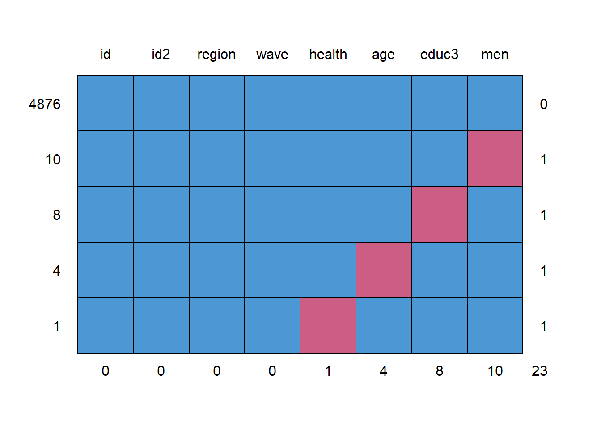
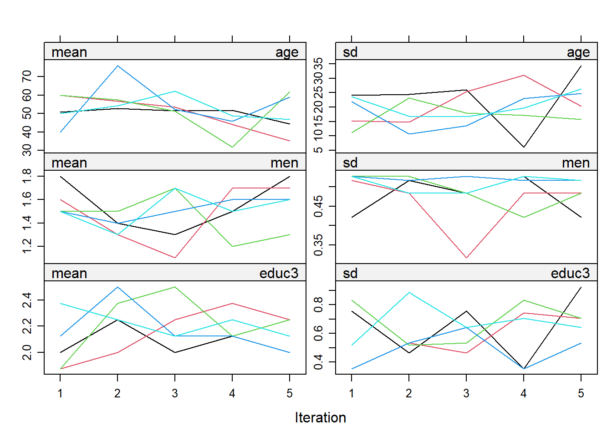
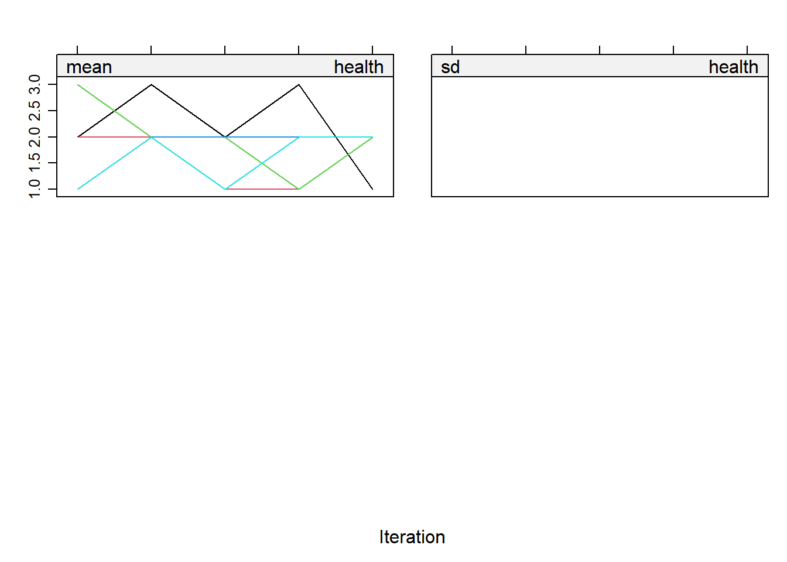

# (APPENDIX) Appendix {-} 

# Introduction to R for SNA {#tutorial}


```
## Loading required package: xfun
```

```
## 
## Attaching package: 'xfun'
```

```
## The following objects are masked from 'package:base':
## 
##     attr, isFALSE
```

```
## Loading required package: foreign
```

```
## Loading required package: tidyverse
```

```
## -- Attaching packages ----------------------------------------------------------- tidyverse 1.3.0 --
```

```
## v ggplot2 3.3.2     v purrr   0.3.4
## v tibble  3.0.4     v dplyr   1.0.2
## v tidyr   1.1.2     v stringr 1.4.0
## v readr   1.4.0     v forcats 0.5.0
```

```
## -- Conflicts -------------------------------------------------------------- tidyverse_conflicts() --
## x dplyr::filter() masks stats::filter()
## x dplyr::lag()    masks stats::lag()
```

```
## Loading required package: mice
```

```
## 
## Attaching package: 'mice'
```

```
## The following object is masked from 'package:stats':
## 
##     filter
```

```
## The following objects are masked from 'package:base':
## 
##     cbind, rbind
```

```
## Loading required package: labelled
```

Latest Version: 02-08-2021

Please email any comments to: [j.tolsma\@ru.nl](mailto:j.tolsma@ru.nl){.email}

## Preliminary notes

This very short R tutorial is for students who already have some experience with R who want to make the switch from stata/spss to R.

\- In this tutorial I assume you will work with RScripts (.R files) not with Rmarkdown (.Rmd files)\
- I will show you how to do things in base R and in a Tidyverse way.

## Getting up and running

-   install the latest version of R: [R](https://cran.r-project.org/)
-   install the latest version of RStudio: [RStudio](www.rstudio.com)
-   open RStudio and follow a brief tour/tutorial [brief tour of Gulzar](https://web.cs.ucla.edu/~gulzar/rstudio/basic-tutorial.html)

Do you Want more information, or are you looking for a different (tidyverse) tutorial?

-   [R-bloggers](https://www.r-bloggers.com/how-to-learn-r-2/)
-   [RStudio cheatsheets](https://www.rstudio.com/resources/cheatsheets/)
-   [R for Data Science](http://r4ds.had.co.nz/)
-   [Statistical Inference via Data Science: A Modern Dive into R and the tidyverse](https://www.moderndive.com/)

Are you a Research Master Social and Cultural Science student? Or, a social science student/scientists with some statistical background in descriptive and explanatory statistics (e.g. regression analysis) who wants to make a switch from SPSS to R? Please read on.

Open RStudio. Your screen will look something like this:

<div class="figure">

<p class="caption">(\#fig:screenshot)Screenshot Rstudio</p>
</div>

-   During the workgroup I will show you around the major subwindows and taps in RStudio.

## Working with RScript

-   Open a new R-script (via file --\> new --\> RScript (see Figure \@ref(fig:screenshot) **Arrow 1**), or simply hit *Ctrl+Shift+N*)
-   Start your script with your name and date.
-   Start with a clean workspace.
-   Start with the latest versions of R, RStudio and your packages.
-   Load the additional packages you will need later.
-   Define your workdirectory.

Thus your RScript will look something like this:


```{.r .numberLines}
###########################
# Title: Introducation to R for SNA
# Author: J Tolsma
# version: 30-10-2019
###########################

#start with clean workspace 
rm(list=ls())

#install.packages I will need later here
install.packages("installr") #you  first install packages
require(installr) #then you will need to load them. This package is used to simply update R
install.packages("foreign")
require(foreign) #used to read in spss data files
require(tidyverse)
#update if necessarry
updateR()

#define workdirectory, note the double backslashes
setwd('C:\\SNA-4-Social-Scientists\\') #change to your own workdirectory
```

Do you see I start some lines with a `#` these lines are comments and not code/commands. This is similar as the `*` sign in SPSS.\
To run some code, you place your cursor in the line and hit *Ctrl+Enter*. You may also select the code you want to run, or copy and paste it directly in the console window (\@ref(fig:screenshot) **Arrow 2**). To see which commands you have executed, you may want to have a look at the history tab (\@ref(fig:screenshot) **Arrow 3**).

> Hint 1: In the upper right corner of the code blocks you see a *copy-and-paste* sign. You may use this to copy and paste the code of this tutorial in your own script.\
> Hint 2: You really want to learn R? Never ever copy and paste code. Type the code yourself.

## Installing additional packages

You will probably always need to load and/or install additional packages. You may want to use RStudio's functionality (\@ref(fig:screenshot) **Arrow 4**). I normally prefer to put everything in my script. See for example in the code block above, line 9 to 12.

## I don't understand the code!!

When you see `functionname()`[^tutorial-csr-1] it means we use a build-in function of R If you want to see how lines/commands/functions work, try to decipher them from the inside out. Thus if you want to dechiper `rm(list=ls())`:

[^tutorial-csr-1]: Programmers like to confuse us simple persons. They thus make up mock names to indicate that the name is irrelevant. Thus a real programmer will never use `functionname()` but will use `foo()` or `bar()` or `foobar()` .

-   `ls()`
-   `list=ls()`
-   `list`

Let's give it a go:


```{.r .numberLines}
tesvariable <- 4
ls()
```

```
## [1] "tesvariable"
```

```{.r .numberLines}
list=ls()
list
```

```
## [1] "tesvariable"
```

```{.r .numberLines}
ls()
```

```
## [1] "list"        "tesvariable"
```

```{.r .numberLines}
rm(list)
ls()
```

```
## [1] "tesvariable"
```

```{.r .numberLines}
#? :-)
rm(list=ls())
ls()
```

```
## character(0)
```

If you want to know more about specific functions, try to use the help function. For example try the following:

-   `?ls`
-   `?rm`

Any idea what `<-` does?

At first it will be difficult to read the R Documentation pages. Don't worry, you will get the hang of it.

How am I to remember all that code/syntax??!!

-   By using them.
-   You don't need to, you just need to remember in which script you used them before.
-   By using the existing cheat sheets:
-   By making your own cheat sheets.

> You being the ideal student, you started your own cheat sheet. What should be on it by know?
>
> **Functions**:
>
> -   `install.packages()` \# to install additional packages. Only do this once or to update package.
> -   `require()` \# activate installed package
> -   `setwd()` \# set your working directory
> -   `ls()` \# list the objects in your environment
> -   `rm()` \# to remove objects
>
> **packages**:
>
> -   `installr` \# a package to easily update R (needs to be run in Rgui directly instead of RStudio )
> -   `foreign` \# to read in spss data files
> -   `tidyverse` \# a bunch of packages which allows for a completely different way of programming/scripting in R.\
>
> **operators / symbols**:
>
> -   `?` \# if placed in front of a function opens up the help pages.
> -   `<-` \# used to assign values/objects to a different object.
> -   `=` \# used to assign values/objects to arguments within a function.

## Reading in data files

We are going to work with two datasets: "Culturele Veranderingen". For more information on these datasets, see [here](https://www.scp.nl/Onderzoek/Bronnen/Beknopte_onderzoeksbeschrijvingen/Culturele_veranderingen_in_Nederland_CV).

Please download the files to your working directory.

[Cultural_Changes_2008.sav](%22addfiles\Cultural_Changes_2008.sav%22)\
[Cultural_Changes_2010.sav](%22addfiles\Cultural_Changes_2008.sav%22)  

There are different packages to read in data. Generally, I would recommend to use the `haven` package. In the past I used to `foreign` package. The advantage of using `haven::read_spss` is that more information is stored in the dataset and in the variables (variable/value labels!!). A disadvantage is that not all other functions/packages of R are capable of dealing with the dataobject that haven produces.

> below I will use `package_name::function_name` notation, to make explicit from which package the function belongs.


```{.r .numberLines}
#ignore the warnings  
#?read.spss
#note that I have saved the data files in a folder called 'addfiles'. 

cv08 <- foreign::read.spss("addfiles\\Cultural_Changes_2008.sav", use.value.labels=T, to.data.frame=T)
cv10 <- foreign::read.spss("addfiles\\Cultural_Changes_2010.sav", use.value.labels=T, to.data.frame=T)

#normally I think setting use.value.labels=F is more convenient. Thus lets load the data again but now without labels 
cv08_nolab <- foreign::read.spss("addfiles\\Cultural_Changes_2008.sav", use.value.labels=F, to.data.frame=T)
cv10_nolab <- foreign::read.spss("addfiles\\Cultural_Changes_2010.sav", use.value.labels=F, to.data.frame=T)

#finally, import the data using haven
cv08_haven <- haven::read_spss("addfiles\\Cultural_Changes_2008.sav")
cv10_haven <- haven::read_spss("addfiles\\Cultural_Changes_2010.sav")
```

So you see I read in the data by using the function `read.spss()` of the package 'foreign'. Within this function I set some arguments/parameters (e.g. use.value.labels).

Now we can inspect our datasets and look for some differences:

-   Find the *Environment* tab in the upper right window (\@ref(fig:screenshot) **Arrow 5**).

    -   Find the little arrow and decollapse.
    -   What do we see?\

-   Double click on the three versions of the cv08 datasets.

    -   What happens?
    -   Go to the new windows and have a look at the data. What are the differences?
    -   Close this window when finished.\

-   Lets use some build-in functions to get more information of our dataset.


```{.r .numberLines}
str(cv08)
```

```
## 'data.frame':	1963 obs. of  278 variables:
##  $ we_id   : Factor w/ 1963 levels "36775330","36775340",..: 1 2 3 4 5 6 7 8 9 10 ...
##  $ veilignr: num  8.11e+08 8.11e+08 8.11e+08 8.11e+08 8.11e+08 ...
##  $ lft1    : Factor w/ 78 levels "0","15","16",..: 38 26 3 17 44 36 49 21 46 28 ...
##  $ geslacht: Factor w/ 3 levels "Onbekend","Man",..: 2 3 3 2 2 3 2 3 2 2 ...
##  $ allochtn: Factor w/ 4 levels "geen allochtoon",..: 1 1 2 1 1 2 1 2 1 1 ...
##  $ lft01   : Factor w/ 82 levels "< één jaar","één jaar",..: 40 28 4 19 46 38 51 23 48 30 ...
##  $ lftop   : Factor w/ 81 levels "< één jaar","één jaar",..: 40 28 4 18 46 38 51 23 48 30 ...
##  $ gewicht : num  8423 6244 13434 8997 8423 ...
##  $ var006n : Factor w/ 11 levels "onbekend","OP < 12 jr  of volgt actueel bas.ondw.",..: 8 10 5 10 8 4 4 7 7 3 ...
##  $ v040    : Factor w/ 6 levels "Geen opgave",..: 6 5 6 5 6 6 5 5 5 5 ...
##  $ var723  : Factor w/ 62 levels "Weigert","Weet niet",..: 3 43 3 17 3 3 39 30 28 17 ...
##  $ var723a : Factor w/ 8 levels "Geen opgave",..: 2 2 2 2 2 2 2 2 2 2 ...
##  $ v202n   : Factor w/ 10 levels "-3","werkt >12 uur",..: 6 2 9 2 5 4 2 2 2 2 ...
##  $ var1061a: Factor w/ 6 levels "Geen opgave",..: 5 6 6 6 6 6 6 6 6 6 ...
##  $ var1061b: Factor w/ 31 levels "Weigert","Weet niet",..: 17 3 3 3 3 3 3 3 3 3 ...
##  $ var1062a: Factor w/ 6 levels "Geen opgave",..: 6 6 6 6 6 6 6 6 5 6 ...
##  $ var1062b: Factor w/ 31 levels "Weigert","Weet niet",..: 3 3 3 3 3 3 3 3 21 3 ...
##  $ int137n : Factor w/ 8 levels "Geen opgave",..: 2 7 2 5 2 5 6 7 7 6 ...
##  $ int138n : Factor w/ 8 levels "Geen opgave",..: 7 7 7 7 6 7 7 6 7 7 ...
##  $ int139n : Factor w/ 8 levels "Geen opgave",..: 2 7 2 2 2 7 5 5 7 2 ...
##  $ int140n : Factor w/ 8 levels "Geen opgave",..: 2 7 7 7 5 7 5 5 7 7 ...
##  $ int141n : Factor w/ 8 levels "Geen opgave",..: 5 7 5 7 5 7 5 5 7 5 ...
##  $ v401    : Factor w/ 9 levels "Geen opgave",..: 6 6 6 6 7 6 7 6 6 6 ...
##  $ var1343 : Factor w/ 7 levels "Geen opgave",..: 7 7 7 7 6 7 7 7 7 7 ...
##  $ var648  : Factor w/ 9 levels "Geen opgave",..: 7 5 7 8 7 7 7 8 7 7 ...
##  $ var149  : Factor w/ 8 levels "Geen opgave",..: 6 5 3 7 6 6 6 6 5 6 ...
##  $ var058  : Factor w/ 6 levels "Geen opgave",..: 5 5 5 5 5 6 6 5 5 5 ...
##  $ var059  : Factor w/ 6 levels "Geen opgave",..: 5 5 5 6 5 5 5 5 5 6 ...
##  $ var064  : Factor w/ 6 levels "Geen opgave",..: 5 5 6 5 6 6 6 5 6 6 ...
##  $ var365  : Factor w/ 6 levels "Geen opgave",..: 5 5 6 5 5 5 5 6 6 6 ...
##  $ var065  : Factor w/ 6 levels "Geen opgave",..: 6 5 5 6 3 5 6 6 5 5 ...
##  $ var092  : Factor w/ 9 levels "Geen opgave",..: 6 3 6 8 8 8 8 7 8 7 ...
##  $ var096  : Factor w/ 10 levels "Geen opgave",..: 7 7 6 7 7 5 6 6 5 5 ...
##  $ int054  : Factor w/ 8 levels "Geen opgave",..: 8 3 7 7 5 5 6 7 6 5 ...
##  $ int055  : Factor w/ 8 levels "Geen opgave",..: 7 7 7 6 3 5 6 7 7 6 ...
##  $ int056  : Factor w/ 8 levels "Geen opgave",..: 6 6 7 7 6 5 5 7 6 7 ...
##  $ int057  : Factor w/ 8 levels "Geen opgave",..: 6 7 6 6 5 6 7 7 6 5 ...
##  $ int058  : Factor w/ 8 levels "Geen opgave",..: 7 7 6 6 3 5 6 7 8 6 ...
##  $ int059  : Factor w/ 8 levels "Geen opgave",..: 6 7 3 7 7 5 5 6 8 6 ...
##  $ int059a : Factor w/ 8 levels "Geen opgave",..: 7 6 6 6 7 5 6 6 7 6 ...
##  $ var571  : Factor w/ 7 levels "Geen opgave",..: 6 7 7 6 6 6 6 7 6 7 ...
##  $ var572  : Factor w/ 7 levels "Geen opgave",..: 2 5 7 2 2 2 2 7 2 5 ...
##  $ var573  : Factor w/ 7 levels "Geen opgave",..: 5 6 7 6 5 5 5 5 6 6 ...
##  $ var574  : Factor w/ 7 levels "Geen opgave",..: 7 2 7 2 6 7 7 6 2 2 ...
##  $ var576  : Factor w/ 10 levels "Geen opgave",..: 9 6 7 8 9 6 9 8 8 9 ...
##  $ var153  : Factor w/ 7 levels "Geen opgave",..: 7 5 5 5 5 5 5 5 5 5 ...
##  $ var154  : Factor w/ 7 levels "Geen opgave",..: 7 6 6 6 7 6 7 6 7 7 ...
##  $ var155  : Factor w/ 7 levels "Geen opgave",..: 6 6 6 7 7 7 7 3 6 6 ...
##  $ var156  : Factor w/ 7 levels "Geen opgave",..: 7 6 6 6 6 3 7 6 6 6 ...
##  $ var157  : Factor w/ 7 levels "Geen opgave",..: 6 3 6 6 6 7 7 3 6 3 ...
##  $ var157a : Factor w/ 7 levels "Geen opgave",..: 7 3 6 6 7 7 7 6 6 6 ...
##  $ var154a : Factor w/ 7 levels "Geen opgave",..: 3 3 6 6 6 6 6 6 6 6 ...
##  $ var164  : Factor w/ 8 levels "Geen opgave",..: 6 6 6 5 5 5 5 6 5 5 ...
##  $ var165  : Factor w/ 10 levels "Geen opgave",..: 7 7 7 8 9 9 8 8 9 8 ...
##  $ var166  : Factor w/ 10 levels "Geen opgave",..: 7 7 8 7 9 9 8 7 8 8 ...
##  $ var179  : Factor w/ 6 levels "Geen opgave",..: 5 5 6 5 5 5 5 5 5 5 ...
##  $ var180  : Factor w/ 6 levels "Geen opgave",..: 5 5 5 6 5 6 6 5 5 5 ...
##  $ var184  : Factor w/ 6 levels "Geen opgave",..: 5 5 6 5 6 5 5 5 5 5 ...
##  $ var185  : Factor w/ 6 levels "Geen opgave",..: 6 5 5 5 6 5 5 5 5 5 ...
##  $ var198a : Factor w/ 6 levels "Geen opgave",..: 6 5 5 5 5 5 6 6 6 5 ...
##  $ var198  : Factor w/ 11 levels "Geen opgave",..: 2 7 9 7 5 5 2 2 2 7 ...
##  $ var201a : Factor w/ 6 levels "Geen opgave",..: 6 5 5 6 6 5 6 6 6 6 ...
##  $ var201b : Factor w/ 10 levels "Geen opgave",..: 2 6 8 2 2 5 2 2 2 2 ...
##  $ var204  : Factor w/ 9 levels "Geen opgave",..: 9 8 9 8 9 8 9 9 7 9 ...
##  $ int257  : Factor w/ 11 levels "Geen opgave",..: 11 7 7 8 10 6 7 9 7 11 ...
##  $ var211  : Factor w/ 7 levels "Geen opgave",..: 7 6 7 7 7 5 7 6 6 7 ...
##  $ var223  : Factor w/ 7 levels "Geen opgave",..: 5 6 5 7 5 5 5 7 5 5 ...
##  $ var1320 : Factor w/ 9 levels "Geen opgave",..: 5 6 6 6 6 6 6 7 5 5 ...
##  $ var1321 : Factor w/ 9 levels "Geen opgave",..: 5 8 6 6 8 6 8 8 6 6 ...
##  $ var1322 : Factor w/ 7 levels "Geen opgave",..: 7 7 6 6 7 5 5 6 5 5 ...
##  $ var1323 : Factor w/ 7 levels "Geen opgave",..: 7 7 6 7 7 6 7 7 7 7 ...
##  $ var1324 : Factor w/ 7 levels "Geen opgave",..: 7 7 6 7 7 7 7 7 7 7 ...
##  $ var1325 : Factor w/ 7 levels "Geen opgave",..: 7 7 7 7 7 6 7 7 7 6 ...
##  $ var1326 : Factor w/ 7 levels "Geen opgave",..: 7 7 7 7 7 7 7 7 7 7 ...
##  $ var1327 : Factor w/ 7 levels "Geen opgave",..: 7 7 6 7 7 6 7 7 6 7 ...
##  $ var1328 : Factor w/ 7 levels "Geen opgave",..: 7 7 7 7 7 7 7 7 7 7 ...
##  $ var229  : Factor w/ 12 levels "Geen opgave",..: 7 7 7 12 7 7 7 6 7 7 ...
##  $ int218  : Factor w/ 9 levels "Geen opgave",..: 6 6 7 7 6 8 7 7 8 7 ...
##  $ int219  : Factor w/ 9 levels "Geen opgave",..: 6 6 7 7 7 6 6 6 7 7 ...
##  $ int221  : Factor w/ 9 levels "Geen opgave",..: 9 6 9 7 7 6 7 7 6 7 ...
##  $ int222  : Factor w/ 9 levels "Geen opgave",..: 6 6 7 6 8 7 7 6 8 7 ...
##  $ int223  : Factor w/ 9 levels "Geen opgave",..: 7 7 5 6 7 6 7 6 5 8 ...
##  $ int710  : Factor w/ 9 levels "Geen opgave",..: 8 6 5 7 7 6 7 7 6 7 ...
##  $ int711  : Factor w/ 9 levels "Geen opgave",..: 8 6 7 6 7 9 7 6 5 8 ...
##  $ int712  : Factor w/ 9 levels "Geen opgave",..: 6 7 7 7 7 6 8 6 8 8 ...
##  $ int713  : Factor w/ 9 levels "Geen opgave",..: 7 7 3 7 6 8 8 6 8 7 ...
##  $ int714  : Factor w/ 9 levels "Geen opgave",..: 7 6 3 7 7 7 8 7 8 8 ...
##  $ int715  : Factor w/ 9 levels "Geen opgave",..: 7 6 9 6 6 7 9 7 7 8 ...
##  $ int716  : Factor w/ 9 levels "Geen opgave",..: 9 7 7 7 6 6 7 7 7 7 ...
##  $ var433  : Factor w/ 10 levels "Geen opgave",..: 6 6 7 7 7 5 9 6 7 6 ...
##  $ var439  : Factor w/ 10 levels "Geen opgave",..: 6 5 9 8 3 5 5 8 5 9 ...
##  $ var1329 : Factor w/ 10 levels "Geen opgave",..: 6 8 6 8 6 5 6 5 5 6 ...
##  $ var1330 : Factor w/ 10 levels "Geen opgave",..: 9 9 8 7 9 5 5 8 5 6 ...
##  $ var445  : Factor w/ 10 levels "Geen opgave",..: 8 9 6 6 8 8 9 6 7 6 ...
##  $ var446  : Factor w/ 10 levels "Geen opgave",..: 7 9 5 8 6 5 6 7 5 5 ...
##  $ var447  : Factor w/ 10 levels "Geen opgave",..: 7 9 5 8 6 5 8 7 5 5 ...
##  $ var451  : Factor w/ 10 levels "Geen opgave",..: 9 9 8 8 8 5 8 9 9 8 ...
##  $ var452  : Factor w/ 10 levels "Geen opgave",..: 6 7 6 6 6 5 8 7 5 5 ...
##  $ var1316 : Factor w/ 10 levels "Geen opgave",..: 9 9 8 8 9 5 6 6 5 9 ...
##   [list output truncated]
##  - attr(*, "variable.labels")= Named chr [1:278] "WE_ID" "veilignummer" "Leeftijd op 1-jan-2009" "Geslacht hhpersoon (GBA)" ...
##   ..- attr(*, "names")= chr [1:278] "we_id" "veilignr" "lft1" "geslacht" ...
##  - attr(*, "codepage")= int 1252
```

```{.r .numberLines}
str(cv08_nolab)
```

```
## 'data.frame':	1963 obs. of  278 variables:
##  $ we_id   : num  36775330 36775340 36775420 36775440 36775450 ...
##   ..- attr(*, "value.labels")= Named num(0) 
##   .. ..- attr(*, "names")= chr(0) 
##  $ veilignr: num  8.11e+08 8.11e+08 8.11e+08 8.11e+08 8.11e+08 ...
##  $ lft1    : num  51 39 16 30 57 49 62 34 59 41 ...
##   ..- attr(*, "value.labels")= Named chr "99"
##   .. ..- attr(*, "names")= chr "Onbekend"
##  $ geslacht: chr  "M" "V" "V" "M" ...
##   ..- attr(*, "value.labels")= Named chr [1:3] "V       " "M       " "9       "
##   .. ..- attr(*, "names")= chr [1:3] "Vrouw" "Man" "Onbekend"
##  $ allochtn: num  0 0 1 0 0 1 0 1 0 0 ...
##   ..- attr(*, "value.labels")= Named chr [1:4] "9" "2" "1" "0"
##   .. ..- attr(*, "names")= chr [1:4] "Onbekend" "onbekend" "allochtoon" "geen allochtoon"
##  $ lft01   : num  50 38 15 29 56 48 61 33 58 40 ...
##   ..- attr(*, "value.labels")= Named chr [1:5] "125" "99" "2" "1" ...
##   .. ..- attr(*, "names")= chr [1:5] "125 jaar" "Onbekend" "twee jaar" "één jaar" ...
##  $ lftop   : num  51 39 16 29 57 49 62 34 59 41 ...
##   ..- attr(*, "value.labels")= Named chr [1:5] "125" "99" "2" "1" ...
##   .. ..- attr(*, "names")= chr [1:5] "125 jaar" "Onbekend" "twee jaar" "één jaar" ...
##  $ gewicht : num  8423 6244 13434 8997 8423 ...
##  $ var006n : num  6 8 3 8 6 2 2 5 5 1 ...
##   ..- attr(*, "value.labels")= Named chr [1:11] "9999999999" "8" "7" "6" ...
##   .. ..- attr(*, "names")= chr [1:11] "Onbekend" "wo" "wo" "hbo" ...
##  $ v040    : num  2 1 2 1 2 2 1 1 1 1 ...
##   ..- attr(*, "value.labels")= Named chr [1:6] "2" "1" "-2" "-3" ...
##   .. ..- attr(*, "names")= chr [1:6] "Nee" "Ja" "Weigert" "Weet niet" ...
##  $ var723  : num  -5 45 -5 20 -5 -5 40 32 30 20 ...
##   ..- attr(*, "value.labels")= Named chr [1:4] "-2" "-3" "-5" "-6"
##   .. ..- attr(*, "names")= chr [1:4] "Weigert" "Weet niet" "N.v.t." "Geen opgave"
##  $ var723a : num  -5 -5 -5 -5 -5 -5 -5 -5 -5 -5 ...
##   ..- attr(*, "value.labels")= Named chr [1:8] "4" "3" "2" "1" ...
##   .. ..- attr(*, "names")= chr [1:8] "of om 30 uur of meer per week ?" "minder dan 30 uur," "minder dan 12 uur," "4 uur of minder per week," ...
##  $ v202n   : num  4 1 7 1 3 2 1 1 1 1 ...
##   ..- attr(*, "value.labels")= Named chr [1:9] "10" "8" "7" "6" ...
##   .. ..- attr(*, "names")= chr [1:9] "vrijwilliger" "anders" "scholier, student" "werkt <12 uur" ...
##  $ var1061a: num  1 2 2 2 2 2 2 2 2 2 ...
##   ..- attr(*, "value.labels")= Named chr [1:6] "2" "1" "-2" "-3" ...
##   .. ..- attr(*, "names")= chr [1:6] "Nee" "Ja" "Weigert" "Weet niet" ...
##  $ var1061b: num  23 -5 -5 -5 -5 -5 -5 -5 -5 -5 ...
##   ..- attr(*, "value.labels")= Named chr [1:4] "-2" "-3" "-5" "-6"
##   .. ..- attr(*, "names")= chr [1:4] "Weigert" "Weet niet" "N.v.t." "Geen opgave"
##  $ var1062a: num  2 2 2 2 2 2 2 2 1 2 ...
##   ..- attr(*, "value.labels")= Named chr [1:6] "2" "1" "-2" "-3" ...
##   .. ..- attr(*, "names")= chr [1:6] "Nee" "Ja" "Weigert" "Weet niet" ...
##  $ var1062b: num  -5 -5 -5 -5 -5 -5 -5 -5 3 -5 ...
##   ..- attr(*, "value.labels")= Named chr [1:4] "-2" "-3" "-5" "-6"
##   .. ..- attr(*, "names")= chr [1:4] "Weigert" "Weet niet" "N.v.t." "Geen opgave"
##  $ int137n : num  -5 3 -5 1 -5 1 2 3 3 2 ...
##   ..- attr(*, "value.labels")= Named chr [1:8] "4" "3" "2" "1" ...
##   .. ..- attr(*, "names")= chr [1:8] "Niet van toepassing (niet noemen)" "of net zoveel tijd als nu?" "minder tijd," "meer tijd," ...
##  $ int138n : num  3 3 3 3 2 3 3 2 3 3 ...
##   ..- attr(*, "value.labels")= Named chr [1:8] "4" "3" "2" "1" ...
##   .. ..- attr(*, "names")= chr [1:8] "Niet van toepassing (niet noemen)" "Net zoveel tijd als nu" "Minder tijd" "Meer tijd" ...
##  $ int139n : num  -5 3 -5 -5 -5 3 1 1 3 -5 ...
##   ..- attr(*, "value.labels")= Named chr [1:8] "4" "3" "2" "1" ...
##   .. ..- attr(*, "names")= chr [1:8] "Niet van toepassing (niet noemen)" "Net zoveel tijd als nu" "Minder tijd" "Meer tijd" ...
##  $ int140n : num  -5 3 3 3 1 3 1 1 3 3 ...
##   ..- attr(*, "value.labels")= Named chr [1:8] "4" "3" "2" "1" ...
##   .. ..- attr(*, "names")= chr [1:8] "Niet van toepassing (niet noemen)" "of net zoveel tijd als nu?" "minder tijd," "meer tijd," ...
##  $ int141n : num  1 3 1 3 1 3 1 1 3 1 ...
##   ..- attr(*, "value.labels")= Named chr [1:8] "4" "3" "2" "1" ...
##   .. ..- attr(*, "names")= chr [1:8] "Niet van toepassing (niet noemen)" "Net zoveel tijd als nu" "Minder tijd" "Meer tijd" ...
##  $ v401    : num  2 2 2 2 3 2 3 2 2 2 ...
##   ..- attr(*, "value.labels")= Named chr [1:9] "5" "4" "3" "2" ...
##   .. ..- attr(*, "names")= chr [1:9] "of zeer slecht?" "slecht," "gaat wel," "goed," ...
##  $ var1343 : num  3 3 3 3 2 3 3 3 3 3 ...
##   ..- attr(*, "value.labels")= Named chr [1:7] "3" "2" "1" "-2" ...
##   .. ..- attr(*, "names")= chr [1:7] "Nee" "Soms" "Ja" "Weigert" ...
##  $ var648  : num  3 1 3 4 3 3 3 4 3 3 ...
##   ..- attr(*, "value.labels")= Named chr [1:9] "5" "4" "3" "2" ...
##   .. ..- attr(*, "names")= chr [1:9] "of niet zo tevreden?" "tamelijk tevreden," "tevreden," "zeer tevreden," ...
##  $ var149  : num  2 1 -3 3 2 2 2 2 1 2 ...
##   ..- attr(*, "value.labels")= Named chr [1:8] "4" "3" "2" "1" ...
##   .. ..- attr(*, "names")= chr [1:8] "Geen mening" "Niet tevreden" "Tamelijk tevreden" "Tevreden" ...
##  $ var058  : num  1 1 1 1 1 2 2 1 1 1 ...
##   ..- attr(*, "value.labels")= Named chr [1:6] "2" "1" "-2" "-3" ...
##   .. ..- attr(*, "names")= chr [1:6] "Nee" "Ja" "Weigert" "Weet niet" ...
##  $ var059  : num  1 1 1 2 1 1 1 1 1 2 ...
##   ..- attr(*, "value.labels")= Named chr [1:6] "2" "1" "-2" "-3" ...
##   .. ..- attr(*, "names")= chr [1:6] "Nee" "Ja" "Weigert" "Weet niet" ...
##  $ var064  : num  1 1 2 1 2 2 2 1 2 2 ...
##   ..- attr(*, "value.labels")= Named chr [1:6] "2" "1" "-2" "-3" ...
##   .. ..- attr(*, "names")= chr [1:6] "Onvoldoende" "Voldoende" "Weigert" "Weet niet" ...
##  $ var365  : num  1 1 2 1 1 1 1 2 2 2 ...
##   ..- attr(*, "value.labels")= Named chr [1:6] "2" "1" "-2" "-3" ...
##   .. ..- attr(*, "names")= chr [1:6] "Nee" "Ja" "Weigert" "Weet niet" ...
##  $ var065  : num  2 1 1 2 -3 1 2 2 1 1 ...
##   ..- attr(*, "value.labels")= Named chr [1:6] "2" "1" "-2" "-3" ...
##   .. ..- attr(*, "names")= chr [1:6] "Welvaart houdt aan" "Voorziet crisis" "Weigert" "Weet niet" ...
##  $ var092  : num  2 -3 2 4 4 4 4 3 4 3 ...
##   ..- attr(*, "value.labels")= Named chr [1:9] "5" "4" "3" "2" ...
##   .. ..- attr(*, "names")= chr [1:9] "Geen mening" "of gaat achteruit?" "blijft ongeveer gelijk," "gedeeltelijk vooruit  gedeeltelijk achteruit," ...
##  $ var096  : num  3 3 2 3 3 1 2 2 1 1 ...
##   ..- attr(*, "value.labels")= Named chr [1:10] "6" "5" "4" "3" ...
##   .. ..- attr(*, "names")= chr [1:10] "Geen mening" "Veel minder" "Een beetje minder" "Laten zoals nu" ...
##  $ int054  : num  4 -3 3 3 1 1 2 3 2 1 ...
##   ..- attr(*, "value.labels")= Named chr [1:8] "4" "3" "2" "1" ...
##   .. ..- attr(*, "names")= chr [1:8] "Helemaal geen tegenstelling" "Niet zo groot" "Groot" "Zeer groot" ...
##  $ int055  : num  3 3 3 2 -3 1 2 3 3 2 ...
##   ..- attr(*, "value.labels")= Named chr [1:8] "4" "3" "2" "1" ...
##   .. ..- attr(*, "names")= chr [1:8] "Helemaal geen tegenstelling" "Niet zo groot" "Groot" "Zeer groot" ...
##  $ int056  : num  2 2 3 3 2 1 1 3 2 3 ...
##   ..- attr(*, "value.labels")= Named chr [1:8] "4" "3" "2" "1" ...
##   .. ..- attr(*, "names")= chr [1:8] "Helemaal geen tegenstelling" "Niet zo groot" "Groot" "Zeer groot" ...
##  $ int057  : num  2 3 2 2 1 2 3 3 2 1 ...
##   ..- attr(*, "value.labels")= Named chr [1:8] "4" "3" "2" "1" ...
##   .. ..- attr(*, "names")= chr [1:8] "Helemaal geen tegenstelling" "Niet zo groot" "Groot" "Zeer groot" ...
##  $ int058  : num  3 3 2 2 -3 1 2 3 4 2 ...
##   ..- attr(*, "value.labels")= Named chr [1:8] "4" "3" "2" "1" ...
##   .. ..- attr(*, "names")= chr [1:8] "Helemaal geen tegenstelling" "Niet zo groot" "Groot" "Zeer groot" ...
##  $ int059  : num  2 3 -3 3 3 1 1 2 4 2 ...
##   ..- attr(*, "value.labels")= Named chr [1:8] "4" "3" "2" "1" ...
##   .. ..- attr(*, "names")= chr [1:8] "Helemaal geen tegenstelling" "Niet zo groot" "Groot" "Zeer groot" ...
##  $ int059a : num  3 2 2 2 3 1 2 2 3 2 ...
##   ..- attr(*, "value.labels")= Named chr [1:8] "4" "3" "2" "1" ...
##   .. ..- attr(*, "names")= chr [1:8] "Helemaal geen tegenstelling" "Niet zo groot" "Groot" "Zeer groot" ...
##  $ var571  : num  2 3 3 2 2 2 2 3 2 3 ...
##   ..- attr(*, "value.labels")= Named chr [1:7] "3" "2" "1" "-2" ...
##   .. ..- attr(*, "names")= chr [1:7] "Dalen" "Gelijk blijven" "Stijgen" "Weigert" ...
##  $ var572  : num  -5 1 3 -5 -5 -5 -5 3 -5 1 ...
##   ..- attr(*, "value.labels")= Named chr [1:7] "3" "2" "1" "-2" ...
##   .. ..- attr(*, "names")= chr [1:7] "Een klein beetje" "Enigszins" "Sterk" "Weigert" ...
##  $ var573  : num  1 2 3 2 1 1 1 1 2 2 ...
##   ..- attr(*, "value.labels")= Named chr [1:7] "3" "2" "1" "-2" ...
##   .. ..- attr(*, "names")= chr [1:7] "Dalen" "Gelijk blijven" "Stijgen" "Weigert" ...
##  $ var574  : num  3 -5 3 -5 2 3 3 2 -5 -5 ...
##   ..- attr(*, "value.labels")= Named chr [1:7] "3" "2" "1" "-2" ...
##   .. ..- attr(*, "names")= chr [1:7] "Een klein beetje" "Enigszins" "Sterk" "Weigert" ...
##  $ var576  : num  5 2 3 4 5 2 5 4 4 5 ...
##   ..- attr(*, "value.labels")= Named chr [1:10] "6" "5" "4" "3" ...
##   .. ..- attr(*, "names")= chr [1:10] "Geen mening" "of sterk mee oneens?" "mee oneens," "noch mee eens, noch mee oneens," ...
##  $ var153  : num  3 1 1 1 1 1 1 1 1 1 ...
##   ..- attr(*, "value.labels")= Named chr [1:7] "3" "2" "1" "-2" ...
##   .. ..- attr(*, "names")= chr [1:7] "Geen oordeel" "Ontevreden" "Tevreden" "Weigert" ...
##  $ var154  : num  3 2 2 2 3 2 3 2 3 3 ...
##   ..- attr(*, "value.labels")= Named chr [1:7] "3" "2" "1" "-2" ...
##   .. ..- attr(*, "names")= chr [1:7] "Onvoldoende" "Voldoende" "Te goed (niet noemen)" "Weigert" ...
##  $ var155  : num  2 2 2 3 3 3 3 -3 2 2 ...
##   ..- attr(*, "value.labels")= Named chr [1:7] "3" "2" "1" "-2" ...
##   .. ..- attr(*, "names")= chr [1:7] "Onvoldoende" "Voldoende" "Te goed (niet noemen)" "Weigert" ...
##  $ var156  : num  3 2 2 2 2 -3 3 2 2 2 ...
##   ..- attr(*, "value.labels")= Named chr [1:7] "3" "2" "1" "-2" ...
##   .. ..- attr(*, "names")= chr [1:7] "Onvoldoende" "Voldoende" "Te goed (niet noemen)" "Weigert" ...
##  $ var157  : num  2 -3 2 2 2 3 3 -3 2 -3 ...
##   ..- attr(*, "value.labels")= Named chr [1:7] "3" "2" "1" "-2" ...
##   .. ..- attr(*, "names")= chr [1:7] "Onvoldoende" "Voldoende" "Te goed (niet noemen)" "Weigert" ...
##  $ var157a : num  3 -3 2 2 3 3 3 2 2 2 ...
##   ..- attr(*, "value.labels")= Named chr [1:7] "3" "2" "1" "-2" ...
##   .. ..- attr(*, "names")= chr [1:7] "Onvoldoende" "Voldoende" "Te goed (niet noemen)" "Weigert" ...
##  $ var154a : num  -3 -3 2 2 2 2 2 2 2 2 ...
##   ..- attr(*, "value.labels")= Named chr [1:7] "3" "2" "1" "-2" ...
##   .. ..- attr(*, "names")= chr [1:7] "Onvoldoende" "Voldoende" "Te goed (niet noemen)" "Weigert" ...
##  $ var164  : num  2 2 2 1 1 1 1 2 1 1 ...
##   ..- attr(*, "value.labels")= Named chr [1:8] "4" "3" "2" "1" ...
##   .. ..- attr(*, "names")= chr [1:8] "Geen mening (niet noemen)" "Te klein" "Ongeveer juist" "Te groot" ...
##  $ var165  : num  3 3 3 4 5 5 4 4 5 4 ...
##   ..- attr(*, "value.labels")= Named chr [1:10] "6" "5" "4" "3" ...
##   .. ..- attr(*, "names")= chr [1:10] "Geen oordeel (niet noemen)" "Veel kleiner" "Een beetje kleiner" "Blijven zoals nu" ...
##  $ var166  : num  3 3 4 3 5 5 4 3 4 4 ...
##   ..- attr(*, "value.labels")= Named chr [1:10] "6" "5" "4" "3" ...
##   .. ..- attr(*, "names")= chr [1:10] "Geen oordeel (niet noemen)" "Veel kleiner" "Een beetje kleiner" "Blijven zoals nu" ...
##  $ var179  : num  1 1 2 1 1 1 1 1 1 1 ...
##   ..- attr(*, "value.labels")= Named chr [1:6] "2" "1" "-2" "-3" ...
##   .. ..- attr(*, "names")= chr [1:6] "Nee" "Ja" "Weigert" "Weet niet" ...
##  $ var180  : num  1 1 1 2 1 2 2 1 1 1 ...
##   ..- attr(*, "value.labels")= Named chr [1:6] "2" "1" "-2" "-3" ...
##   .. ..- attr(*, "names")= chr [1:6] "Nee" "Ja" "Weigert" "Weet niet" ...
##  $ var184  : num  1 1 2 1 2 1 1 1 1 1 ...
##   ..- attr(*, "value.labels")= Named chr [1:6] "2" "1" "-2" "-3" ...
##   .. ..- attr(*, "names")= chr [1:6] "Nee" "Ja" "Weigert" "Weet niet" ...
##  $ var185  : num  2 1 1 1 2 1 1 1 1 1 ...
##   ..- attr(*, "value.labels")= Named chr [1:6] "2" "1" "-2" "-3" ...
##   .. ..- attr(*, "names")= chr [1:6] "Nee" "Ja" "Weigert" "Weet niet" ...
##  $ var198a : num  2 1 1 1 1 1 2 2 2 1 ...
##   ..- attr(*, "value.labels")= Named chr [1:6] "2" "1" "-2" "-3" ...
##   .. ..- attr(*, "names")= chr [1:6] "Nee" "Ja" "Weigert" "Weet niet" ...
##  $ var198  : num  -5 3 5 3 1 1 -5 -5 -5 3 ...
##   ..- attr(*, "value.labels")= Named chr [1:11] "7" "6" "5" "4" ...
##   .. ..- attr(*, "names")= chr [1:11] "Ander geloof" "Boeddhistisch" "Islamitisch" "Hindoe" ...
##  $ var201a : num  2 1 1 2 2 1 2 2 2 2 ...
##   ..- attr(*, "value.labels")= Named chr [1:6] "2" "1" "-2" "-3" ...
##   .. ..- attr(*, "names")= chr [1:6] "Nee" "Ja" "Weigert" "Weet niet" ...
##  $ var201b : num  -5 2 4 -5 -5 1 -5 -5 -5 -5 ...
##   ..- attr(*, "value.labels")= Named chr [1:10] "6" "5" "4" "3" ...
##   .. ..- attr(*, "names")= chr [1:10] "Ander kerkgenootschap of levensbeschouwelijke groepering" "Boeddhistisch" "Islamitisch" "Hindoe" ...
##  $ var204  : num  5 4 5 4 5 4 5 5 3 5 ...
##   ..- attr(*, "value.labels")= Named chr [1:9] "5" "4" "3" "2" ...
##   .. ..- attr(*, "names")= chr [1:9] "of nooit?" "minder dan eenmaal per maand," "eens per maand," "eens per 2 weken," ...
##  $ int257  : num  7 3 3 4 6 2 3 5 3 7 ...
##   ..- attr(*, "value.labels")= Named chr [1:11] "7" "6" "5" "4" ...
##   .. ..- attr(*, "names")= chr [1:11] "Buitengewoon ongelovig" "Erg ongelovig" "Enigszins ongelovig" "Noch gelovig, noch ongelovig" ...
##  $ var211  : num  3 2 3 3 3 1 3 2 2 3 ...
##   ..- attr(*, "value.labels")= Named chr [1:7] "3" "2" "1" "-2" ...
##   .. ..- attr(*, "names")= chr [1:7] "Nee" "Gedeeltelijk" "Ja" "Weigert" ...
##  $ var223  : num  1 2 1 3 1 1 1 3 1 1 ...
##   ..- attr(*, "value.labels")= Named chr [1:7] "3" "2" "1" "-2" ...
##   .. ..- attr(*, "names")= chr [1:7] "Hangt ervan af" "Moeten niet los van elkaar staan" "Moeten los van elkaar staan" "Weigert" ...
##  $ var1320 : num  1 2 2 2 2 2 2 3 1 1 ...
##   ..- attr(*, "value.labels")= Named chr [1:9] "5" "4" "3" "2" ...
##   .. ..- attr(*, "names")= chr [1:9] "of sterk mee oneens?" "enigszins mee oneens," "niet mee eens, niet mee oneens," "enigszins mee eens," ...
##  $ var1321 : num  1 4 2 2 4 2 4 4 2 2 ...
##   ..- attr(*, "value.labels")= Named chr [1:9] "5" "4" "3" "2" ...
##   .. ..- attr(*, "names")= chr [1:9] "of sterk mee oneens?" "enigszins mee oneens," "niet mee eens, niet mee oneens," "enigszins mee eens," ...
##  $ var1322 : num  3 3 2 2 3 1 1 2 1 1 ...
##   ..- attr(*, "value.labels")= Named chr [1:7] "3" "2" "1" "-2" ...
##   .. ..- attr(*, "names")= chr [1:7] "of helemaal niet voor u?" "gedeeltelijk voor u," "helemaal voor u," "Weigert" ...
##  $ var1323 : num  3 3 2 3 3 2 3 3 3 3 ...
##   ..- attr(*, "value.labels")= Named chr [1:7] "3" "2" "1" "-2" ...
##   .. ..- attr(*, "names")= chr [1:7] "of zelden of nooit?" "soms," "vaak," "Weigert" ...
##  $ var1324 : num  3 3 2 3 3 3 3 3 3 3 ...
##   ..- attr(*, "value.labels")= Named chr [1:7] "3" "2" "1" "-2" ...
##   .. ..- attr(*, "names")= chr [1:7] "Zelden of nooit?" "Soms," "Vaak" "Weigert" ...
##  $ var1325 : num  3 3 3 3 3 2 3 3 3 2 ...
##   ..- attr(*, "value.labels")= Named chr [1:7] "3" "2" "1" "-2" ...
##   .. ..- attr(*, "names")= chr [1:7] "of zelden of nooit?" "soms," "vaak," "Weigert" ...
##  $ var1326 : num  3 3 3 3 3 3 3 3 3 3 ...
##   ..- attr(*, "value.labels")= Named chr [1:7] "3" "2" "1" "-2" ...
##   .. ..- attr(*, "names")= chr [1:7] "Zelden of nooit?" "Soms," "Vaak" "Weigert" ...
##  $ var1327 : num  3 3 2 3 3 2 3 3 2 3 ...
##   ..- attr(*, "value.labels")= Named chr [1:7] "3" "2" "1" "-2" ...
##   .. ..- attr(*, "names")= chr [1:7] "of zelden of nooit?" "soms," "vaak," "Weigert" ...
##  $ var1328 : num  3 3 3 3 3 3 3 3 3 3 ...
##   ..- attr(*, "value.labels")= Named chr [1:7] "3" "2" "1" "-2" ...
##   .. ..- attr(*, "names")= chr [1:7] "Zelden of nooit?" "Soms," "Vaak" "Weigert" ...
##  $ var229  : num  3 3 3 8 3 3 3 2 3 3 ...
##   ..- attr(*, "value.labels")= Named chr [1:12] "8" "7" "6" "5" ...
##   .. ..- attr(*, "names")= chr [1:12] "Veel vrienden en kennissen" "Prettig werk" "Een sterk geloof" "Een goed huwelijksleven" ...
##  $ int218  : num  2 2 3 3 2 4 3 3 4 3 ...
##   ..- attr(*, "value.labels")= Named chr [1:9] "5" "4" "3" "2" ...
##   .. ..- attr(*, "names")= chr [1:9] "Helemaal geen vertrouwen" "Zeer weinig vertrouwen" "Enig vertrouwen" "Veel vertrouwen" ...
##  $ int219  : num  2 2 3 3 3 2 2 2 3 3 ...
##   ..- attr(*, "value.labels")= Named chr [1:9] "5" "4" "3" "2" ...
##   .. ..- attr(*, "names")= chr [1:9] "Helemaal geen vertrouwen" "Zeer weinig vertrouwen" "Enig vertrouwen" "Veel vertrouwen" ...
##  $ int221  : num  5 2 5 3 3 2 3 3 2 3 ...
##   ..- attr(*, "value.labels")= Named chr [1:9] "5" "4" "3" "2" ...
##   .. ..- attr(*, "names")= chr [1:9] "Helemaal geen vertrouwen" "Zeer weinig vertrouwen" "Enig vertrouwen" "Veel vertrouwen" ...
##  $ int222  : num  2 2 3 2 4 3 3 2 4 3 ...
##   ..- attr(*, "value.labels")= Named chr [1:9] "5" "4" "3" "2" ...
##   .. ..- attr(*, "names")= chr [1:9] "Helemaal geen vertrouwen" "Zeer weinig vertrouwen" "Enig vertrouwen" "Veel vertrouwen" ...
##  $ int223  : num  3 3 1 2 3 2 3 2 1 4 ...
##   ..- attr(*, "value.labels")= Named chr [1:9] "5" "4" "3" "2" ...
##   .. ..- attr(*, "names")= chr [1:9] "Helemaal geen vertrouwen" "Zeer weinig vertrouwen" "Enig vertrouwen" "Veel vertrouwen" ...
##  $ int710  : num  4 2 1 3 3 2 3 3 2 3 ...
##   ..- attr(*, "value.labels")= Named chr [1:9] "5" "4" "3" "2" ...
##   .. ..- attr(*, "names")= chr [1:9] "Helemaal geen vertrouwen" "Zeer weinig vertrouwen" "Enig vertrouwen" "Veel vertrouwen" ...
##  $ int711  : num  4 2 3 2 3 5 3 2 1 4 ...
##   ..- attr(*, "value.labels")= Named chr [1:9] "5" "4" "3" "2" ...
##   .. ..- attr(*, "names")= chr [1:9] "Helemaal geen vertrouwen" "Zeer weinig vertrouwen" "Enig vertrouwen" "Veel vertrouwen" ...
##  $ int712  : num  2 3 3 3 3 2 4 2 4 4 ...
##   ..- attr(*, "value.labels")= Named chr [1:9] "5" "4" "3" "2" ...
##   .. ..- attr(*, "names")= chr [1:9] "Helemaal geen vertrouwen" "Zeer weinig vertrouwen" "Enig vertrouwen" "Veel vertrouwen" ...
##  $ int713  : num  3 3 -3 3 2 4 4 2 4 3 ...
##   ..- attr(*, "value.labels")= Named chr [1:9] "5" "4" "3" "2" ...
##   .. ..- attr(*, "names")= chr [1:9] "Helemaal geen vertrouwen" "Zeer weinig vertrouwen" "Enig vertrouwen" "Veel vertrouwen" ...
##  $ int714  : num  3 2 -3 3 3 3 4 3 4 4 ...
##   ..- attr(*, "value.labels")= Named chr [1:9] "5" "4" "3" "2" ...
##   .. ..- attr(*, "names")= chr [1:9] "Helemaal geen vertrouwen" "Zeer weinig vertrouwen" "Enig vertrouwen" "Veel vertrouwen" ...
##  $ int715  : num  3 2 5 2 2 3 5 3 3 4 ...
##   ..- attr(*, "value.labels")= Named chr [1:9] "5" "4" "3" "2" ...
##   .. ..- attr(*, "names")= chr [1:9] "Helemaal geen vertrouwen" "Zeer weinig vertrouwen" "Enig vertrouwen" "Veel vertrouwen" ...
##  $ int716  : num  5 3 3 3 2 2 3 3 3 3 ...
##   ..- attr(*, "value.labels")= Named chr [1:9] "5" "4" "3" "2" ...
##   .. ..- attr(*, "names")= chr [1:9] "Helemaal geen vertrouwen" "Zeer weinig vertrouwen" "Enig vertrouwen" "Veel vertrouwen" ...
##  $ var433  : num  2 2 3 3 3 1 5 2 3 2 ...
##   ..- attr(*, "value.labels")= Named chr [1:10] "6" "5" "4" "3" ...
##   .. ..- attr(*, "names")= chr [1:10] "Geen mening" "Helemaal niet mee eens" "Eigenlijk niet mee eens" "Noch mee eens, noch mee oneens" ...
##  $ var439  : num  2 1 5 4 -3 1 1 4 1 5 ...
##   ..- attr(*, "value.labels")= Named chr [1:10] "6" "5" "4" "3" ...
##   .. ..- attr(*, "names")= chr [1:10] "Geen mening" "Helemaal niet mee eens" "Eigenlijk niet mee eens" "Noch mee eens, noch mee oneens" ...
##  $ var1329 : num  2 4 2 4 2 1 2 1 1 2 ...
##   ..- attr(*, "value.labels")= Named chr [1:10] "6" "5" "4" "3" ...
##   .. ..- attr(*, "names")= chr [1:10] "Geen mening" "Helemaal niet mee eens" "Eigenlijk niet mee eens" "Noch mee eens, noch mee oneens" ...
##  $ var1330 : num  5 5 4 3 5 1 1 4 1 2 ...
##   ..- attr(*, "value.labels")= Named chr [1:10] "6" "5" "4" "3" ...
##   .. ..- attr(*, "names")= chr [1:10] "Geen mening" "Helemaal niet mee eens" "Eigenlijk niet mee eens" "Noch mee eens, noch mee oneens" ...
##  $ var445  : num  4 5 2 2 4 4 5 2 3 2 ...
##   ..- attr(*, "value.labels")= Named chr [1:10] "6" "5" "4" "3" ...
##   .. ..- attr(*, "names")= chr [1:10] "Geen mening" "Helemaal niet mee eens" "Eigenlijk niet mee eens" "Noch mee eens, noch mee oneens" ...
##  $ var446  : num  3 5 1 4 2 1 2 3 1 1 ...
##   ..- attr(*, "value.labels")= Named chr [1:10] "6" "5" "4" "3" ...
##   .. ..- attr(*, "names")= chr [1:10] "Geen mening" "Helemaal niet mee eens" "Eigenlijk niet mee eens" "Noch mee eens, noch mee oneens" ...
##  $ var447  : num  3 5 1 4 2 1 4 3 1 1 ...
##   ..- attr(*, "value.labels")= Named chr [1:10] "6" "5" "4" "3" ...
##   .. ..- attr(*, "names")= chr [1:10] "Geen mening" "Helemaal niet mee eens" "Eigenlijk niet mee eens" "Noch mee eens, noch mee oneens" ...
##  $ var451  : num  5 5 4 4 4 1 4 5 5 4 ...
##   ..- attr(*, "value.labels")= Named chr [1:10] "6" "5" "4" "3" ...
##   .. ..- attr(*, "names")= chr [1:10] "Geen mening" "Helemaal niet mee eens" "Eigenlijk niet mee eens" "Noch mee eens, noch mee oneens" ...
##  $ var452  : num  2 3 2 2 2 1 4 3 1 1 ...
##   ..- attr(*, "value.labels")= Named chr [1:10] "6" "5" "4" "3" ...
##   .. ..- attr(*, "names")= chr [1:10] "Geen mening" "Helemaal niet mee eens" "Eigenlijk niet mee eens" "Noch mee eens, noch mee oneens" ...
##  $ var1316 : num  5 5 4 4 5 1 2 2 1 5 ...
##   ..- attr(*, "value.labels")= Named chr [1:10] "6" "5" "4" "3" ...
##   .. ..- attr(*, "names")= chr [1:10] "Geen mening" "Helemaal niet mee eens" "Eigenlijk niet mee eens" "Noch mee eens, noch mee oneens" ...
##   [list output truncated]
##  - attr(*, "variable.labels")= Named chr [1:278] "WE_ID" "veilignummer" "Leeftijd op 1-jan-2009" "Geslacht hhpersoon (GBA)" ...
##   ..- attr(*, "names")= chr [1:278] "we_id" "veilignr" "lft1" "geslacht" ...
##  - attr(*, "codepage")= int 1252
```

```{.r .numberLines}
str(cv08_haven)
```

```
## tibble[,278] [1,963 x 278] (S3: tbl_df/tbl/data.frame)
##  $ we_id   : dbl+lbl [1:1963] 36775330, 36775340, 36775420, 36775440, 36775450, 36775460, 36775480, 367...
##    ..@ label        : chr "WE_ID"
##    ..@ format.spss  : chr "F10.0"
##    ..@ display_width: int 12
##    ..@ labels       : Named num [1:2] 1e+10 1e+10
##    .. ..- attr(*, "names")= chr [1:2] "Refusal" "Don't Know"
##  $ veilignr: num [1:1963] 8.11e+08 8.11e+08 8.11e+08 8.11e+08 8.11e+08 ...
##   ..- attr(*, "label")= chr "veilignummer"
##   ..- attr(*, "format.spss")= chr "F10.0"
##   ..- attr(*, "display_width")= int 12
##  $ lft1    : dbl+lbl [1:1963] 51, 39, 16, 30, 57, 49, 62, 34, 59, 41, 25, 43, 74, 17, 23, 32, 51, 66, 6...
##    ..@ label        : chr "Leeftijd op 1-jan-2009"
##    ..@ format.spss  : chr "F8.0"
##    ..@ display_width: int 10
##    ..@ labels       : Named num 99
##    .. ..- attr(*, "names")= chr "Onbekend"
##  $ geslacht: chr+lbl [1:1963] M, V, V, M, M, V, M, V, M, M, M, V, V, M, M, V, M, M, V, M, V, M, V, M, V...
##    ..@ label        : chr "Geslacht hhpersoon (GBA)"
##    ..@ format.spss  : chr "A1"
##    ..@ display_width: int 10
##    ..@ labels       : Named chr [1:3] "9" "M" "V"
##    .. ..- attr(*, "names")= chr [1:3] "Onbekend" "Man" "Vrouw"
##  $ allochtn: dbl+lbl [1:1963] 0, 0, 1, 0, 0, 1, 0, 1, 0, 0, 0, 0, 0, 0, 1, 0, 0, 1, 0, 0, 0, 0, 0, 0, 0...
##    ..@ format.spss  : chr "F10.0"
##    ..@ display_width: int 12
##    ..@ labels       : Named num [1:4] 0 1 2 9
##    .. ..- attr(*, "names")= chr [1:4] "geen allochtoon" "allochtoon" "onbekend" "Onbekend"
##  $ lft01   : dbl+lbl [1:1963] 50, 38, 15, 29, 56, 48, 61, 33, 58, 40, 24, 42, 73, 16, 22, 31, 50, 65, 6...
##    ..@ label        : chr "Leeftijd OP op 1 jan. v.h. onderzoekjaar"
##    ..@ format.spss  : chr "F10.0"
##    ..@ display_width: int 12
##    ..@ labels       : Named num [1:5] 0 1 2 99 125
##    .. ..- attr(*, "names")= chr [1:5] "< één jaar" "één jaar" "twee jaar" "Onbekend" ...
##  $ lftop   : dbl+lbl [1:1963] 51, 39, 16, 29, 57, 49, 62, 34, 59, 41, 25, 43, 74, 17, 22, 32, 51, 66, 6...
##    ..@ label        : chr "Leeftijd OP op datum interview"
##    ..@ format.spss  : chr "F10.0"
##    ..@ display_width: int 12
##    ..@ labels       : Named num [1:5] 0 1 2 99 125
##    .. ..- attr(*, "names")= chr [1:5] "< één jaar" "één jaar" "twee jaar" "Onbekend" ...
##  $ gewicht : num [1:1963] 8423 6244 13434 8997 8423 ...
##   ..- attr(*, "label")= chr "Persoonsgewicht eindres30"
##   ..- attr(*, "format.spss")= chr "F8.2"
##   ..- attr(*, "display_width")= int 10
##  $ var006n : dbl+lbl [1:1963] 6, 8, 3, 8, 6, 2, 2, 5, 5, 1, 1, 3, 2, 1, 1, 5, 6, 3, 1, 5, 6, 2, 5, 6, 1...
##    ..@ label        : chr "Voltooid opleidingsniveau (uitgebreid) OP, 12-14 jarigen niet standaard op bas.ondw."
##    ..@ format.spss  : chr "F10.0"
##    ..@ display_width: int 12
##    ..@ labels       : Named num [1:11] -3 -1 1 2 3 4 5 6 7 8 ...
##    .. ..- attr(*, "names")= chr [1:11] "onbekend" "OP < 12 jr  of volgt actueel bas.ondw." "basisonderwijs" "vmbo" ...
##  $ v040    : dbl+lbl [1:1963] 2, 1, 2, 1, 2, 2, 1, 1, 1, 1, 1, 1, 2, 2, 1, 1, 1, 2, 2, 1, 2, 1, 2, 1, 2...
##    ..@ label        : chr "Betaald werk?"
##    ..@ format.spss  : chr "F10.0"
##    ..@ display_width: int 12
##    ..@ labels       : Named num [1:6] -6 -5 -3 -2 1 2
##    .. ..- attr(*, "names")= chr [1:6] "Geen opgave" "N.v.t." "Weet niet" "Weigert" ...
##  $ var723  : dbl+lbl [1:1963] -5, 45, -5, 20, -5, -5, 40, 32, 30, 20, 38, 30, -5, -5, 18, 20, 40, -5, -...
##    ..@ label        : chr "Uren werk per week"
##    ..@ format.spss  : chr "F10.0"
##    ..@ display_width: int 12
##    ..@ labels       : Named num [1:4] -6 -5 -3 -2
##    .. ..- attr(*, "names")= chr [1:4] "Geen opgave" "N.v.t." "Weet niet" "Weigert"
##  $ var723a : dbl+lbl [1:1963] -5, -5, -5, -5, -5, -5, -5, -5, -5, -5, -5, -5, -5, -5, -5, -5, -5, -5, -...
##    ..@ label        : chr "Categorie: uren werk per week"
##    ..@ format.spss  : chr "F10.0"
##    ..@ display_width: int 12
##    ..@ labels       : Named num [1:8] -6 -5 -3 -2 1 2 3 4
##    .. ..- attr(*, "names")= chr [1:8] "Geen opgave" "N.v.t." "Weet niet" "Weigert" ...
##  $ v202n   : dbl+lbl [1:1963] 4, 1, 7, 1, 3, 2, 1, 1, 1, 1, 1, 1, 5, 7, 1, 1, 1, 5, 2, 1, 2, 1, 5, 1, 5...
##    ..@ label        : chr "positie werkkring (nieuw)"
##    ..@ format.spss  : chr "F10.0"
##    ..@ display_width: int 12
##    ..@ labels       : Named num [1:9] 1 2 3 4 5 6 7 8 10
##    .. ..- attr(*, "names")= chr [1:9] "werkt >12 uur" "eigen huishouden" "werkloos" "arbeidsongeschikt" ...
##  $ var1061a: dbl+lbl [1:1963] 1, 2, 2, 2, 2, 2, 2, 2, 2, 2, 2, 1, 1, 2, 2, 1, 2, 2, 2, 1, 1, 2, 2, 1, 2...
##    ..@ label        : chr "(16) Verricht u vrijwilligerwerk"
##    ..@ format.spss  : chr "F10.0"
##    ..@ display_width: int 12
##    ..@ labels       : Named num [1:6] -6 -5 -3 -2 1 2
##    .. ..- attr(*, "names")= chr [1:6] "Geen opgave" "N.v.t." "Weet niet" "Weigert" ...
##  $ var1061b: dbl+lbl [1:1963] 23, -5, -5, -5, -5, -5, -5, -5, -5, -5, -5,  3,  5, -5, -5,  1, -5, -5, -...
##    ..@ label        : chr "(16) Hoeveel uur per week vrijwilligerwerk?"
##    ..@ format.spss  : chr "F10.0"
##    ..@ display_width: int 12
##    ..@ labels       : Named num [1:4] -6 -5 -3 -2
##    .. ..- attr(*, "names")= chr [1:4] "Geen opgave" "N.v.t." "Weet niet" "Weigert"
##  $ var1062a: dbl+lbl [1:1963] 2, 2, 2, 2, 2, 2, 2, 2, 1, 2, 2, 1, 1, 2, 2, 1, 2, 2, 2, 2, 1, 2, 2, 1, 2...
##    ..@ label        : chr "(17) Kosteloos hulp aan zieke of gehandicapte familieleden, kennissen of buren?"
##    ..@ format.spss  : chr "F10.0"
##    ..@ display_width: int 12
##    ..@ labels       : Named num [1:6] -6 -5 -3 -2 1 2
##    .. ..- attr(*, "names")= chr [1:6] "Geen opgave" "N.v.t." "Weet niet" "Weigert" ...
##  $ var1062b: dbl+lbl [1:1963] -5, -5, -5, -5, -5, -5, -5, -5,  3, -5, -5,  2,  5, -5, -5,  1, -5, -5, -...
##    ..@ label        : chr "(17) Hoeveel uur per week kosteloos hulp?"
##    ..@ format.spss  : chr "F10.0"
##    ..@ display_width: int 12
##    ..@ labels       : Named num [1:4] -6 -5 -3 -2
##    .. ..- attr(*, "names")= chr [1:4] "Geen opgave" "N.v.t." "Weet niet" "Weigert"
##  $ int137n : dbl+lbl [1:1963] -5,  3, -5,  1, -5,  1,  2,  3,  3,  2,  1,  3, -5, -5,  1,  2,  2,  1, -...
##    ..@ label        : chr "S003 Gewenste tijd betaald werk"
##    ..@ format.spss  : chr "F10.0"
##    ..@ display_width: int 12
##    ..@ labels       : Named num [1:8] -6 -5 -3 -2 1 2 3 4
##    .. ..- attr(*, "names")= chr [1:8] "Geen opgave" "N.v.t." "Weet niet" "Weigert" ...
##  $ int138n : dbl+lbl [1:1963]  3,  3,  3,  3,  2,  3,  3,  2,  3,  3,  3,  2,  3, -5,  3,  2,  1,  3,  ...
##    ..@ label        : chr "S003 Gewenste tijd huishoudelijk werk"
##    ..@ format.spss  : chr "F10.0"
##    ..@ display_width: int 12
##    ..@ labels       : Named num [1:8] -6 -5 -3 -2 1 2 3 4
##    .. ..- attr(*, "names")= chr [1:8] "Geen opgave" "N.v.t." "Weet niet" "Weigert" ...
##  $ int139n : dbl+lbl [1:1963] -5,  3, -5, -5, -5,  3,  1,  1,  3, -5,  3,  1,  3, -5, -5,  1,  1,  1,  ...
##    ..@ label        : chr "S003 Gewenste tijd gezin"
##    ..@ format.spss  : chr "F10.0"
##    ..@ display_width: int 12
##    ..@ labels       : Named num [1:8] -6 -5 -3 -2 1 2 3 4
##    .. ..- attr(*, "names")= chr [1:8] "Geen opgave" "N.v.t." "Weet niet" "Weigert" ...
##  $ int140n : dbl+lbl [1:1963] -5,  3,  3,  3,  1,  3,  1,  1,  3,  3,  3,  1,  3, -5,  1,  1,  3,  3,  ...
##    ..@ label        : chr "S003 Gewenste tijd vrienden"
##    ..@ format.spss  : chr "F10.0"
##    ..@ display_width: int 12
##    ..@ labels       : Named num [1:8] -6 -5 -3 -2 1 2 3 4
##    .. ..- attr(*, "names")= chr [1:8] "Geen opgave" "N.v.t." "Weet niet" "Weigert" ...
##  $ int141n : dbl+lbl [1:1963]  1,  3,  1,  3,  1,  3,  1,  1,  3,  1,  3,  3,  3,  3,  3,  1,  1, -5,  ...
##    ..@ label        : chr "S003 Gewenste tijd vrijetijds-activiteit"
##    ..@ format.spss  : chr "F10.0"
##    ..@ display_width: int 12
##    ..@ labels       : Named num [1:8] -6 -5 -3 -2 1 2 3 4
##    .. ..- attr(*, "names")= chr [1:8] "Geen opgave" "N.v.t." "Weet niet" "Weigert" ...
##  $ v401    : dbl+lbl [1:1963] 2, 2, 2, 2, 3, 2, 3, 2, 2, 2, 2, 2, 2, 2, 2, 2, 1, 3, 3, 1, 2, 3, 1, 2, 1...
##    ..@ label        : chr "Niveau gezondheid"
##    ..@ format.spss  : chr "F10.0"
##    ..@ display_width: int 12
##    ..@ labels       : Named num [1:9] -6 -5 -3 -2 1 2 3 4 5
##    .. ..- attr(*, "names")= chr [1:9] "Geen opgave" "N.v.t." "Weet niet" "Weigert" ...
##  $ var1343 : dbl+lbl [1:1963] 3, 3, 3, 3, 2, 3, 3, 3, 3, 3, 3, 3, 2, 3, 3, 3, 3, 3, 3, 3, 3, 3, 3, 3, 3...
##    ..@ label        : chr "(199) Ik voel me van andere mensen ge‹soleerd."
##    ..@ format.spss  : chr "F10.0"
##    ..@ display_width: int 12
##    ..@ labels       : Named num [1:7] -6 -5 -3 -2 1 2 3
##    .. ..- attr(*, "names")= chr [1:7] "Geen opgave" "N.v.t." "Weet niet" "Weigert" ...
##  $ var648  : dbl+lbl [1:1963] 3, 1, 3, 4, 3, 3, 3, 4, 3, 3, 1, 2, 3, 3, 3, 2, 3, 5, 3, 3, 3, 3, 2, 1, 3...
##    ..@ label        : chr "Tevredenheid leven"
##    ..@ format.spss  : chr "F10.0"
##    ..@ display_width: int 12
##    ..@ labels       : Named num [1:9] -6 -5 -3 -2 1 2 3 4 5
##    .. ..- attr(*, "names")= chr [1:9] "Geen opgave" "N.v.t." "Weet niet" "Weigert" ...
##  $ var149  : dbl+lbl [1:1963]  2,  1, -3,  3,  2,  2,  2,  2,  1,  2,  1,  2,  2, -3,  2,  1,  2,  3,  ...
##    ..@ label        : chr "Tevredenheid inkomen"
##    ..@ format.spss  : chr "F10.0"
##    ..@ display_width: int 12
##    ..@ labels       : Named num [1:8] -6 -5 -3 -2 1 2 3 4
##    .. ..- attr(*, "names")= chr [1:8] "Geen opgave" "N.v.t." "Weet niet" "Weigert" ...
##  $ var058  : dbl+lbl [1:1963]  1,  1,  1,  1,  1,  2,  2,  1,  1,  1,  1,  1,  1,  1,  1,  1,  1,  2,  ...
##    ..@ label        : chr "Welvarendheid Nederland"
##    ..@ format.spss  : chr "F10.0"
##    ..@ display_width: int 12
##    ..@ labels       : Named num [1:6] -6 -5 -3 -2 1 2
##    .. ..- attr(*, "names")= chr [1:6] "Geen opgave" "N.v.t." "Weet niet" "Weigert" ...
##  $ var059  : dbl+lbl [1:1963] 1, 1, 1, 2, 1, 1, 1, 1, 1, 2, 1, 1, 1, 1, 1, 1, 1, 1, 2, 1, 1, 1, 1, 1, 1...
##    ..@ label        : chr "Welvarendheid in eigen huishouden"
##    ..@ format.spss  : chr "F10.0"
##    ..@ display_width: int 12
##    ..@ labels       : Named num [1:6] -6 -5 -3 -2 1 2
##    .. ..- attr(*, "names")= chr [1:6] "Geen opgave" "N.v.t." "Weet niet" "Weigert" ...
##  $ var064  : dbl+lbl [1:1963]  1,  1,  2,  1,  2,  2,  2,  1,  2,  2,  2,  1,  1,  1,  2,  1,  1,  2,  ...
##    ..@ label        : chr "Inzet regering vergroten uw welvaart"
##    ..@ format.spss  : chr "F10.0"
##    ..@ display_width: int 12
##    ..@ labels       : Named num [1:6] -6 -5 -3 -2 1 2
##    .. ..- attr(*, "names")= chr [1:6] "Geen opgave" "N.v.t." "Weet niet" "Weigert" ...
##  $ var365  : dbl+lbl [1:1963]  1,  1,  2,  1,  1,  1,  1,  2,  2,  2,  1,  2,  1,  1,  1,  2,  2,  2,  ...
##    ..@ label        : chr "financieel een onbekommerde oude dag"
##    ..@ format.spss  : chr "F10.0"
##    ..@ display_width: int 12
##    ..@ labels       : Named num [1:6] -6 -5 -3 -2 1 2
##    .. ..- attr(*, "names")= chr [1:6] "Geen opgave" "N.v.t." "Weet niet" "Weigert" ...
##  $ var065  : dbl+lbl [1:1963]  2,  1,  1,  2, -3,  1,  2,  2,  1,  1,  2,  2,  1,  1,  2,  1,  1,  1,  ...
##    ..@ label        : chr "Verwachting crisis met veel werklozen"
##    ..@ format.spss  : chr "F10.0"
##    ..@ display_width: int 12
##    ..@ labels       : Named num [1:6] -6 -5 -3 -2 1 2
##    .. ..- attr(*, "names")= chr [1:6] "Geen opgave" "N.v.t." "Weet niet" "Weigert" ...
##  $ var092  : dbl+lbl [1:1963]  2, -3,  2,  4,  4,  4,  4,  3,  4,  3,  3,  4,  4,  4,  4,  4,  4,  4,  ...
##    ..@ label        : chr "Ontwikkeling opvattingen gedrag en zeden"
##    ..@ format.spss  : chr "F10.0"
##    ..@ display_width: int 12
##    ..@ labels       : Named num [1:9] -6 -5 -3 -2 1 2 3 4 5
##    .. ..- attr(*, "names")= chr [1:9] "Geen opgave" "N.v.t." "Weet niet" "Weigert" ...
##  $ var096  : dbl+lbl [1:1963] 3, 3, 2, 3, 3, 1, 2, 2, 1, 1, 2, 4, 3, 1, 2, 3, 2, 2, 1, 1, 2, 1, 3, 2, 1...
##    ..@ label        : chr "Niveau geld voor openbare voorzieningen"
##    ..@ format.spss  : chr "F10.0"
##    ..@ display_width: int 12
##    ..@ labels       : Named num [1:10] -6 -5 -3 -2 1 2 3 4 5 6
##    .. ..- attr(*, "names")= chr [1:10] "Geen opgave" "N.v.t." "Weet niet" "Weigert" ...
##  $ int054  : dbl+lbl [1:1963]  4, -3,  3,  3,  1,  1,  2,  3,  2,  1,  1,  1,  2,  2,  2,  2,  3,  1,  ...
##    ..@ label        : chr "Niveau tegenstelling arm en rijk"
##    ..@ format.spss  : chr "F10.0"
##    ..@ display_width: int 12
##    ..@ labels       : Named num [1:8] -6 -5 -3 -2 1 2 3 4
##    .. ..- attr(*, "names")= chr [1:8] "Geen opgave" "N.v.t." "Weet niet" "Weigert" ...
##  $ int055  : dbl+lbl [1:1963]  3,  3,  3,  2, -3,  1,  2,  3,  3,  2,  2,  3,  3,  3,  3,  2,  3,  2,  ...
##    ..@ label        : chr "Tegenstelling arbeidersklasse en middenklasse"
##    ..@ format.spss  : chr "F10.0"
##    ..@ display_width: int 12
##    ..@ labels       : Named num [1:8] -6 -5 -3 -2 1 2 3 4
##    .. ..- attr(*, "names")= chr [1:8] "Geen opgave" "N.v.t." "Weet niet" "Weigert" ...
##  $ int056  : dbl+lbl [1:1963]  2,  2,  3,  3,  2,  1,  1,  3,  2,  3,  2,  3,  2,  2,  2,  2,  2,  1,  ...
##    ..@ label        : chr "Tegenstelling werklozen en werkenden"
##    ..@ format.spss  : chr "F10.0"
##    ..@ display_width: int 12
##    ..@ labels       : Named num [1:8] -6 -5 -3 -2 1 2 3 4
##    .. ..- attr(*, "names")= chr [1:8] "Geen opgave" "N.v.t." "Weet niet" "Weigert" ...
##  $ int057  : dbl+lbl [1:1963]  2,  3,  2,  2,  1,  2,  3,  3,  2,  1,  1,  1,  2,  2,  2,  3,  2,  1,  ...
##    ..@ label        : chr "Tegenstelling werkgevers en werknemers"
##    ..@ format.spss  : chr "F10.0"
##    ..@ display_width: int 12
##    ..@ labels       : Named num [1:8] -6 -5 -3 -2 1 2 3 4
##    .. ..- attr(*, "names")= chr [1:8] "Geen opgave" "N.v.t." "Weet niet" "Weigert" ...
##  $ int058  : dbl+lbl [1:1963]  3,  3,  2,  2, -3,  1,  2,  3,  4,  2, -3,  1,  2,  3,  2, -3,  3, -3, -...
##    ..@ label        : chr "Tegenstelling platteland en stadsmensen"
##    ..@ format.spss  : chr "F10.0"
##    ..@ display_width: int 12
##    ..@ labels       : Named num [1:8] -6 -5 -3 -2 1 2 3 4
##    .. ..- attr(*, "names")= chr [1:8] "Geen opgave" "N.v.t." "Weet niet" "Weigert" ...
##  $ int059  : dbl+lbl [1:1963]  2,  3, -3,  3,  3,  1,  1,  2,  4,  2,  1,  1,  2,  2,  2,  2,  2,  2,  ...
##    ..@ label        : chr "Tegenstelling jongeren en ouderen"
##    ..@ format.spss  : chr "F10.0"
##    ..@ display_width: int 12
##    ..@ labels       : Named num [1:8] -6 -5 -3 -2 1 2 3 4
##    .. ..- attr(*, "names")= chr [1:8] "Geen opgave" "N.v.t." "Weet niet" "Weigert" ...
##  $ int059a : dbl+lbl [1:1963]  3,  2,  2,  2,  3,  1,  2,  2,  3,  2, -3,  1,  2,  2,  2,  2,  2, -3,  ...
##    ..@ label        : chr "Tegenstelling allochtonen en autochtonen"
##    ..@ format.spss  : chr "F10.0"
##    ..@ display_width: int 12
##    ..@ labels       : Named num [1:8] -6 -5 -3 -2 1 2 3 4
##    .. ..- attr(*, "names")= chr [1:8] "Geen opgave" "N.v.t." "Weet niet" "Weigert" ...
##  $ var571  : dbl+lbl [1:1963]  2,  3,  3,  2,  2,  2,  2,  3,  2,  3,  3,  2,  3,  3,  3,  3,  1,  3,  ...
##    ..@ label        : chr "Verwachting toekomst sociale uitkeringen"
##    ..@ format.spss  : chr "F10.0"
##    ..@ display_width: int 12
##    ..@ labels       : Named num [1:7] -6 -5 -3 -2 1 2 3
##    .. ..- attr(*, "names")= chr [1:7] "Geen opgave" "N.v.t." "Weet niet" "Weigert" ...
##  $ var572  : dbl+lbl [1:1963] -5,  1,  3, -5, -5, -5, -5,  3, -5,  1,  2, -5,  1,  2,  3,  1,  2,  2, -...
##    ..@ label        : chr "Verwachting niveau sociale uitkeringen"
##    ..@ format.spss  : chr "F10.0"
##    ..@ display_width: int 12
##    ..@ labels       : Named num [1:7] -6 -5 -3 -2 1 2 3
##    .. ..- attr(*, "names")= chr [1:7] "Geen opgave" "N.v.t." "Weet niet" "Weigert" ...
##  $ var573  : dbl+lbl [1:1963] 1, 2, 3, 2, 1, 1, 1, 1, 2, 2, 2, 1, 3, 3, 2, 2, 2, 1, 1, 1, 2, 2, 2, 2, 1...
##    ..@ label        : chr "Niveau uitkeringen in huidige economie 1"
##    ..@ format.spss  : chr "F10.0"
##    ..@ display_width: int 12
##    ..@ labels       : Named num [1:7] -6 -5 -3 -2 1 2 3
##    .. ..- attr(*, "names")= chr [1:7] "Geen opgave" "N.v.t." "Weet niet" "Weigert" ...
##  $ var574  : dbl+lbl [1:1963]  3, -5,  3, -5,  2,  3,  3,  2, -5, -5, -5,  1,  3,  2, -5, -5, -5,  3,  ...
##    ..@ label        : chr "Niveau uitkeringen in huidige economie 2"
##    ..@ format.spss  : chr "F10.0"
##    ..@ display_width: int 12
##    ..@ labels       : Named num [1:7] -6 -5 -3 -2 1 2 3
##    .. ..- attr(*, "names")= chr [1:7] "Geen opgave" "N.v.t." "Weet niet" "Weigert" ...
##  $ var576  : dbl+lbl [1:1963] 5, 2, 3, 4, 5, 2, 5, 4, 4, 5, 4, 2, 2, 2, 2, 2, 4, 4, 4, 4, 4, 2, 2, 2, 4...
##    ..@ label        : chr "Mening toekomst minder sociale zekerheid"
##    ..@ format.spss  : chr "F10.0"
##    ..@ display_width: int 12
##    ..@ labels       : Named num [1:10] -6 -5 -3 -2 1 2 3 4 5 6
##    .. ..- attr(*, "names")= chr [1:10] "Geen opgave" "N.v.t." "Weet niet" "Weigert" ...
##  $ var153  : dbl+lbl [1:1963] 3, 1, 1, 1, 1, 1, 1, 1, 1, 1, 1, 2, 1, 1, 1, 2, 1, 1, 2, 1, 3, 1, 1, 1, 2...
##    ..@ label        : chr "Tevredenheid sociale voorzieningen"
##    ..@ format.spss  : chr "F10.0"
##    ..@ display_width: int 12
##    ..@ labels       : Named num [1:7] -6 -5 -3 -2 1 2 3
##    .. ..- attr(*, "names")= chr [1:7] "Geen opgave" "N.v.t." "Weet niet" "Weigert" ...
##  $ var154  : dbl+lbl [1:1963]  3,  2,  2,  2,  3,  2,  3,  2,  3,  3, -3,  3,  2,  2, -3,  2,  3,  3,  ...
##    ..@ label        : chr "Niveau Algemene Ouderdomswet (AOW)"
##    ..@ format.spss  : chr "F10.0"
##    ..@ display_width: int 12
##    ..@ labels       : Named num [1:7] -6 -5 -3 -2 1 2 3
##    .. ..- attr(*, "names")= chr [1:7] "Geen opgave" "N.v.t." "Weet niet" "Weigert" ...
##  $ var155  : dbl+lbl [1:1963]  2,  2,  2,  3,  3,  3,  3, -3,  2,  2, -3,  3,  3,  3,  2,  3,  2,  3, -...
##    ..@ label        : chr "Oordeel Wet Werk en Bijstand"
##    ..@ format.spss  : chr "F10.0"
##    ..@ display_width: int 12
##    ..@ labels       : Named num [1:7] -6 -5 -3 -2 1 2 3
##    .. ..- attr(*, "names")= chr [1:7] "Geen opgave" "N.v.t." "Weet niet" "Weigert" ...
##  $ var156  : dbl+lbl [1:1963]  3,  2,  2,  2,  2, -3,  3,  2,  2,  2, -3,  1,  3,  2, -3,  2,  2,  3,  ...
##    ..@ label        : chr "Oordeel Werkloosheidswet (WW)."
##    ..@ format.spss  : chr "F10.0"
##    ..@ display_width: int 12
##    ..@ labels       : Named num [1:7] -6 -5 -3 -2 1 2 3
##    .. ..- attr(*, "names")= chr [1:7] "Geen opgave" "N.v.t." "Weet niet" "Weigert" ...
##  $ var157  : dbl+lbl [1:1963]  2, -3,  2,  2,  2,  3,  3, -3,  2, -3, -3,  3,  3,  3, -3, -3,  3,  3,  ...
##    ..@ label        : chr "Oordeel Algemene Nabestaandenwet (ANW)."
##    ..@ format.spss  : chr "F10.0"
##    ..@ display_width: int 12
##    ..@ labels       : Named num [1:7] -6 -5 -3 -2 1 2 3
##    .. ..- attr(*, "names")= chr [1:7] "Geen opgave" "N.v.t." "Weet niet" "Weigert" ...
##  $ var157a : dbl+lbl [1:1963]  3, -3,  2,  2,  3,  3,  3,  2,  2,  2,  3,  1,  3,  3, -3,  3,  2,  3,  ...
##    ..@ label        : chr "Oordeel Arbeidsongeschiktheidswet."
##    ..@ format.spss  : chr "F10.0"
##    ..@ display_width: int 12
##    ..@ labels       : Named num [1:7] -6 -5 -3 -2 1 2 3
##    .. ..- attr(*, "names")= chr [1:7] "Geen opgave" "N.v.t." "Weet niet" "Weigert" ...
##  $ var154a : dbl+lbl [1:1963] -3, -3,  2,  2,  2,  2,  2,  2,  2,  2,  3,  2,  3,  2, -3,  2,  2, -3, -...
##    ..@ label        : chr "Oordeel Ziektewet."
##    ..@ format.spss  : chr "F10.0"
##    ..@ display_width: int 12
##    ..@ labels       : Named num [1:7] -6 -5 -3 -2 1 2 3
##    .. ..- attr(*, "names")= chr [1:7] "Geen opgave" "N.v.t." "Weet niet" "Weigert" ...
##  $ var164  : dbl+lbl [1:1963] 2, 2, 2, 1, 1, 1, 1, 2, 1, 1, 1, 1, 1, 1, 2, 2, 1, 1, 1, 1, 1, 2, 1, 2, 1...
##    ..@ label        : chr "Mate verschil tussen inkomens in NL"
##    ..@ format.spss  : chr "F10.0"
##    ..@ display_width: int 12
##    ..@ labels       : Named num [1:8] -6 -5 -3 -2 1 2 3 4
##    .. ..- attr(*, "names")= chr [1:8] "Geen opgave" "N.v.t." "Weet niet" "Weigert" ...
##  $ var165  : dbl+lbl [1:1963] 3, 3, 3, 4, 5, 5, 4, 4, 5, 4, 4, 5, 5, 1, 4, 2, 4, 5, 1, 4, 5, 4, 4, 3, 5...
##    ..@ label        : chr "Wens vergroten verschil inkomens"
##    ..@ format.spss  : chr "F10.0"
##    ..@ display_width: int 12
##    ..@ labels       : Named num [1:10] -6 -5 -3 -2 1 2 3 4 5 6
##    .. ..- attr(*, "names")= chr [1:10] "Geen opgave" "N.v.t." "Weet niet" "Weigert" ...
##  $ var166  : dbl+lbl [1:1963]  3,  3,  4,  3,  5,  5,  4,  3,  4,  4,  3,  4,  5,  3,  3,  3,  4,  3,  ...
##    ..@ label        : chr "Wens vergroten verschil bezit"
##    ..@ format.spss  : chr "F10.0"
##    ..@ display_width: int 12
##    ..@ labels       : Named num [1:10] -6 -5 -3 -2 1 2 3 4 5 6
##    .. ..- attr(*, "names")= chr [1:10] "Geen opgave" "N.v.t." "Weet niet" "Weigert" ...
##  $ var179  : dbl+lbl [1:1963] 1, 1, 2, 1, 1, 1, 1, 1, 1, 1, 1, 2, 1, 1, 1, 1, 1, 1, 1, 1, 1, 1, 1, 1, 1...
##    ..@ label        : chr "M050 Vrij:om te demonstreren"
##    ..@ format.spss  : chr "F10.0"
##    ..@ display_width: int 12
##    ..@ labels       : Named num [1:6] -6 -5 -3 -2 1 2
##    .. ..- attr(*, "names")= chr [1:6] "Geen opgave" "N.v.t." "Weet niet" "Weigert" ...
##  $ var180  : dbl+lbl [1:1963] 1, 1, 1, 2, 1, 2, 2, 1, 1, 1, 1, 2, 2, 1, 1, 1, 1, 1, 1, 1, 2, 1, 2, 1, 2...
##    ..@ label        : chr "M051 Vrij:openlijk kritiek koningshuis"
##    ..@ format.spss  : chr "F10.0"
##    ..@ display_width: int 12
##    ..@ labels       : Named num [1:6] -6 -5 -3 -2 1 2
##    .. ..- attr(*, "names")= chr [1:6] "Geen opgave" "N.v.t." "Weet niet" "Weigert" ...
##  $ var184  : dbl+lbl [1:1963] 1, 1, 2, 1, 2, 1, 1, 1, 1, 1, 1, 2, 1, 1, 1, 2, 2, 2, 1, 1, 2, 2, 2, 1, 1...
##    ..@ label        : chr "M054 Vrij:openb schrijven wat men wil"
##    ..@ format.spss  : chr "F10.0"
##    ..@ display_width: int 12
##    ..@ labels       : Named num [1:6] -6 -5 -3 -2 1 2
##    .. ..- attr(*, "names")= chr [1:6] "Geen opgave" "N.v.t." "Weet niet" "Weigert" ...
##  $ var185  : dbl+lbl [1:1963] 2, 1, 1, 1, 2, 1, 1, 1, 1, 1, 1, 2, 1, 1, 1, 2, 1, 1, 1, 1, 2, 1, 2, 1, 1...
##    ..@ label        : chr "M054 Vrij:openb zeggen wat men wil"
##    ..@ format.spss  : chr "F10.0"
##    ..@ display_width: int 12
##    ..@ labels       : Named num [1:6] -6 -5 -3 -2 1 2
##    .. ..- attr(*, "names")= chr [1:6] "Geen opgave" "N.v.t." "Weet niet" "Weigert" ...
##  $ var198a : dbl+lbl [1:1963] 2, 1, 1, 1, 1, 1, 2, 2, 2, 1, 1, 2, 1, 1, 2, 1, 1, 1, 1, 2, 1, 2, 2, 2, 1...
##    ..@ label        : chr "Opgevoed met bepaald geloof"
##    ..@ format.spss  : chr "F10.0"
##    ..@ display_width: int 12
##    ..@ labels       : Named num [1:6] -6 -5 -3 -2 1 2
##    .. ..- attr(*, "names")= chr [1:6] "Geen opgave" "N.v.t." "Weet niet" "Weigert" ...
##  $ var198  : dbl+lbl [1:1963] -5,  3,  5,  3,  1,  1, -5, -5, -5,  3,  1, -5,  3,  2, -5,  2,  1,  2,  ...
##    ..@ label        : chr "Geloof opgevoed"
##    ..@ format.spss  : chr "F10.0"
##    ..@ display_width: int 12
##    ..@ labels       : Named num [1:11] -6 -5 -3 -2 1 2 3 4 5 6 ...
##    .. ..- attr(*, "names")= chr [1:11] "Geen opgave" "N.v.t." "Weet niet" "Weigert" ...
##  $ var201a : dbl+lbl [1:1963] 2, 1, 1, 2, 2, 1, 2, 2, 2, 2, 1, 2, 1, 1, 2, 1, 2, 2, 2, 2, 1, 2, 2, 2, 2...
##    ..@ label        : chr "Rekent zich tot kerkgenootschap"
##    ..@ format.spss  : chr "F10.0"
##    ..@ display_width: int 12
##    ..@ labels       : Named num [1:6] -6 -5 -3 -2 1 2
##    .. ..- attr(*, "names")= chr [1:6] "Geen opgave" "N.v.t." "Weet niet" "Weigert" ...
##  $ var201b : dbl+lbl [1:1963] -5,  2,  4, -5, -5,  1, -5, -5, -5, -5,  1, -5,  2,  2, -5,  6, -5, -5, -...
##    ..@ label        : chr "Welk kerkgenootschap is dat?"
##    ..@ format.spss  : chr "F10.0"
##    ..@ display_width: int 12
##    ..@ labels       : Named num [1:10] -6 -5 -3 -2 1 2 3 4 5 6
##    .. ..- attr(*, "names")= chr [1:10] "Geen opgave" "N.v.t." "Weet niet" "Weigert" ...
##  $ var204  : dbl+lbl [1:1963] 5, 4, 5, 4, 5, 4, 5, 5, 3, 5, 4, 5, 1, 1, 5, 1, 5, 5, 5, 5, 1, 5, 5, 5, 5...
##    ..@ label        : chr "Aantal bezoeken kerk afgelopen half jaar"
##    ..@ format.spss  : chr "F10.0"
##    ..@ display_width: int 12
##    ..@ labels       : Named num [1:9] -6 -5 -3 -2 1 2 3 4 5
##    .. ..- attr(*, "names")= chr [1:9] "Geen opgave" "N.v.t." "Weet niet" "Weigert" ...
##  $ int257  : dbl+lbl [1:1963] 7, 3, 3, 4, 6, 2, 3, 5, 3, 7, 4, 7, 2, 2, 3, 2, 3, 2, 4, 7, 2, 4, 6, 7, 4...
##    ..@ label        : chr "Mate gelovigheid"
##    ..@ format.spss  : chr "F10.0"
##    ..@ display_width: int 12
##    ..@ labels       : Named num [1:11] -6 -5 -3 -2 1 2 3 4 5 6 ...
##    .. ..- attr(*, "names")= chr [1:11] "Geen opgave" "N.v.t." "Weet niet" "Weigert" ...
##  $ var211  : dbl+lbl [1:1963]  3,  2,  3,  3,  3,  1,  3,  2,  2,  3, -3,  3,  1,  1,  3,  1,  1,  3,  ...
##    ..@ label        : chr "M069 Ziet bijbel als het woord van God"
##    ..@ format.spss  : chr "F10.0"
##    ..@ display_width: int 12
##    ..@ labels       : Named num [1:7] -6 -5 -3 -2 1 2 3
##    .. ..- attr(*, "names")= chr [1:7] "Geen opgave" "N.v.t." "Weet niet" "Weigert" ...
##  $ var223  : dbl+lbl [1:1963] 1, 2, 1, 3, 1, 1, 1, 3, 1, 1, 1, 1, 1, 3, 1, 2, 1, 1, 1, 1, 2, 1, 1, 1, 1...
##    ..@ label        : chr "M068 Politiek los van godsdienst"
##    ..@ format.spss  : chr "F10.0"
##    ..@ display_width: int 12
##    ..@ labels       : Named num [1:7] -6 -5 -3 -2 1 2 3
##    .. ..- attr(*, "names")= chr [1:7] "Geen opgave" "N.v.t." "Weet niet" "Weigert" ...
##  $ var1320 : dbl+lbl [1:1963]  1,  2,  2,  2,  2,  2,  2,  3,  1,  1,  2,  1,  2,  1,  2,  1,  2,  1,  ...
##    ..@ label        : chr "(54) Zin van leven innerlijke ervaring en ontwikkeling eigen vermogens."
##    ..@ format.spss  : chr "F10.0"
##    ..@ display_width: int 12
##    ..@ labels       : Named num [1:9] -6 -5 -3 -2 1 2 3 4 5
##    .. ..- attr(*, "names")= chr [1:9] "Geen opgave" "N.v.t." "Weet niet" "Weigert" ...
##  $ var1321 : dbl+lbl [1:1963] 1, 4, 2, 2, 4, 2, 4, 4, 2, 2, 2, 2, 1, 1, 1, 1, 1, 1, 4, 2, 5, 2, 2, 4, 1...
##    ..@ label        : chr "(55) Bij beslissingen afgaan op intu‹tie en gevoel."
##    ..@ format.spss  : chr "F10.0"
##    ..@ display_width: int 12
##    ..@ labels       : Named num [1:9] -6 -5 -3 -2 1 2 3 4 5
##    .. ..- attr(*, "names")= chr [1:9] "Geen opgave" "N.v.t." "Weet niet" "Weigert" ...
##  $ var1322 : dbl+lbl [1:1963]  3,  3,  2,  2,  3,  1,  1,  2,  1,  1,  2,  3,  2,  2,  3,  2,  3,  1,  ...
##    ..@ label        : chr "(56) Religie zoek ik zelf bijeen"
##    ..@ format.spss  : chr "F10.0"
##    ..@ display_width: int 12
##    ..@ labels       : Named num [1:7] -6 -5 -3 -2 1 2 3
##    .. ..- attr(*, "names")= chr [1:7] "Geen opgave" "N.v.t." "Weet niet" "Weigert" ...
##  $ var1323 : dbl+lbl [1:1963] 3, 3, 2, 3, 3, 2, 3, 3, 3, 3, 3, 3, 3, 3, 3, 1, 3, 3, 3, 3, 3, 3, 3, 3, 3...
##    ..@ label        : chr "(57) Praten of mailen over spiritualiteit"
##    ..@ format.spss  : chr "F10.0"
##    ..@ display_width: int 12
##    ..@ labels       : Named num [1:7] -6 -5 -3 -2 1 2 3
##    .. ..- attr(*, "names")= chr [1:7] "Geen opgave" "N.v.t." "Weet niet" "Weigert" ...
##  $ var1324 : dbl+lbl [1:1963] 3, 3, 2, 3, 3, 3, 3, 3, 3, 3, 3, 3, 3, 3, 3, 2, 3, 3, 3, 3, 3, 3, 3, 3, 3...
##    ..@ label        : chr "(58) Meedoen gespreksgroep over spiritueel onderwerp?"
##    ..@ format.spss  : chr "F10.0"
##    ..@ display_width: int 12
##    ..@ labels       : Named num [1:7] -6 -5 -3 -2 1 2 3
##    .. ..- attr(*, "names")= chr [1:7] "Geen opgave" "N.v.t." "Weet niet" "Weigert" ...
##  $ var1325 : dbl+lbl [1:1963] 3, 3, 3, 3, 3, 2, 3, 3, 3, 2, 3, 3, 3, 2, 2, 3, 3, 3, 3, 3, 3, 3, 3, 3, 3...
##    ..@ label        : chr "(59) Op internet kijken naar informatie over spiritualiteit"
##    ..@ format.spss  : chr "F10.0"
##    ..@ display_width: int 12
##    ..@ labels       : Named num [1:7] -6 -5 -3 -2 1 2 3
##    .. ..- attr(*, "names")= chr [1:7] "Geen opgave" "N.v.t." "Weet niet" "Weigert" ...
##  $ var1326 : dbl+lbl [1:1963] 3, 3, 3, 3, 3, 3, 3, 3, 3, 3, 3, 3, 3, 3, 3, 3, 3, 3, 3, 3, 3, 3, 3, 3, 3...
##    ..@ label        : chr "(60) Bezoek beurs etc over spirituele onderwerpen?"
##    ..@ format.spss  : chr "F10.0"
##    ..@ display_width: int 12
##    ..@ labels       : Named num [1:7] -6 -5 -3 -2 1 2 3
##    .. ..- attr(*, "names")= chr [1:7] "Geen opgave" "N.v.t." "Weet niet" "Weigert" ...
##  $ var1327 : dbl+lbl [1:1963] 3, 3, 2, 3, 3, 2, 3, 3, 2, 3, 3, 3, 3, 3, 2, 2, 3, 3, 3, 3, 3, 3, 3, 3, 3...
##    ..@ label        : chr "(61) Tijdschriften of boeken lezen over spirituele onderwerpen"
##    ..@ format.spss  : chr "F10.0"
##    ..@ display_width: int 12
##    ..@ labels       : Named num [1:7] -6 -5 -3 -2 1 2 3
##    .. ..- attr(*, "names")= chr [1:7] "Geen opgave" "N.v.t." "Weet niet" "Weigert" ...
##  $ var1328 : dbl+lbl [1:1963] 3, 3, 3, 3, 3, 3, 3, 3, 3, 3, 3, 3, 3, 3, 3, 3, 3, 3, 3, 3, 3, 3, 3, 3, 3...
##    ..@ label        : chr "(62) Deelnemen aan cursus, gericht op spiritualiteit?"
##    ..@ format.spss  : chr "F10.0"
##    ..@ display_width: int 12
##    ..@ labels       : Named num [1:7] -6 -5 -3 -2 1 2 3
##    .. ..- attr(*, "names")= chr [1:7] "Geen opgave" "N.v.t." "Weet niet" "Weigert" ...
##  $ var229  : dbl+lbl [1:1963] 3, 3, 3, 8, 3, 3, 3, 2, 3, 3, 3, 5, 3, 2, 7, 6, 2, 3, 3, 3, 6, 3, 3, 2, 8...
##    ..@ label        : chr "M064 Allerbelangrijkste in het leven"
##    ..@ format.spss  : chr "F10.0"
##    ..@ display_width: int 12
##    ..@ labels       : Named num [1:12] -6 -5 -3 -2 1 2 3 4 5 6 ...
##    .. ..- attr(*, "names")= chr [1:12] "Geen opgave" "N.v.t." "Weet niet" "Weigert" ...
##  $ int218  : dbl+lbl [1:1963] 2, 2, 3, 3, 2, 4, 3, 3, 4, 3, 3, 2, 2, 3, 4, 2, 4, 4, 5, 4, 3, 3, 3, 4, 2...
##    ..@ label        : chr "Mate vertrouwen in regering"
##    ..@ format.spss  : chr "F10.0"
##    ..@ display_width: int 12
##    ..@ labels       : Named num [1:9] -6 -5 -3 -2 1 2 3 4 5
##    .. ..- attr(*, "names")= chr [1:9] "Geen opgave" "N.v.t." "Weet niet" "Weigert" ...
##  $ int219  : dbl+lbl [1:1963]  2,  2,  3,  3,  3,  2,  2,  2,  3,  3,  3,  3,  2,  3,  3,  2,  3,  4, -...
##    ..@ label        : chr "Mate vertrouwen in bedrijfsleven"
##    ..@ format.spss  : chr "F10.0"
##    ..@ display_width: int 12
##    ..@ labels       : Named num [1:9] -6 -5 -3 -2 1 2 3 4 5
##    .. ..- attr(*, "names")= chr [1:9] "Geen opgave" "N.v.t." "Weet niet" "Weigert" ...
##  $ int221  : dbl+lbl [1:1963]  5,  2,  5,  3,  3,  2,  3,  3,  2,  3,  3,  5,  2,  2,  4,  3,  3, -3, -...
##    ..@ label        : chr "Mate vertrouwen kerken/reli organisaties"
##    ..@ format.spss  : chr "F10.0"
##    ..@ display_width: int 12
##    ..@ labels       : Named num [1:9] -6 -5 -3 -2 1 2 3 4 5
##    .. ..- attr(*, "names")= chr [1:9] "Geen opgave" "N.v.t." "Weet niet" "Weigert" ...
##  $ int222  : dbl+lbl [1:1963]  2,  2,  3,  2,  4,  3,  3,  2,  4,  3,  2,  4,  2,  2,  4,  3,  2,  4,  ...
##    ..@ label        : chr "Mate vertrouwen in rechtspraak"
##    ..@ format.spss  : chr "F10.0"
##    ..@ display_width: int 12
##    ..@ labels       : Named num [1:9] -6 -5 -3 -2 1 2 3 4 5
##    .. ..- attr(*, "names")= chr [1:9] "Geen opgave" "N.v.t." "Weet niet" "Weigert" ...
##  $ int223  : dbl+lbl [1:1963]  3,  3,  1,  2,  3,  2,  3,  2,  1,  4,  2,  1,  2,  2,  3,  3,  3,  3, -...
##    ..@ label        : chr "Mate vertrouwen in onderwijs"
##    ..@ format.spss  : chr "F10.0"
##    ..@ display_width: int 12
##    ..@ labels       : Named num [1:9] -6 -5 -3 -2 1 2 3 4 5
##    .. ..- attr(*, "names")= chr [1:9] "Geen opgave" "N.v.t." "Weet niet" "Weigert" ...
##  $ int710  : dbl+lbl [1:1963] 4, 2, 1, 3, 3, 2, 3, 3, 2, 3, 2, 1, 2, 2, 3, 3, 2, 3, 5, 2, 3, 2, 3, 2, 2...
##    ..@ label        : chr "Mate vertrouwen in gezondheidszorg"
##    ..@ format.spss  : chr "F10.0"
##    ..@ display_width: int 12
##    ..@ labels       : Named num [1:9] -6 -5 -3 -2 1 2 3 4 5
##    .. ..- attr(*, "names")= chr [1:9] "Geen opgave" "N.v.t." "Weet niet" "Weigert" ...
##  $ int711  : dbl+lbl [1:1963]  4,  2,  3,  2,  3,  5,  3,  2,  1,  4,  3,  5,  2,  2,  3,  4,  3,  4,  ...
##    ..@ label        : chr "Mate vertrouwen in kranten"
##    ..@ format.spss  : chr "F10.0"
##    ..@ display_width: int 12
##    ..@ labels       : Named num [1:9] -6 -5 -3 -2 1 2 3 4 5
##    .. ..- attr(*, "names")= chr [1:9] "Geen opgave" "N.v.t." "Weet niet" "Weigert" ...
##  $ int712  : dbl+lbl [1:1963] 2, 3, 3, 3, 3, 2, 4, 2, 4, 4, 3, 2, 2, 2, 3, 3, 3, 4, 5, 3, 3, 2, 3, 2, 2...
##    ..@ label        : chr "Mate vertrouwen in politie"
##    ..@ format.spss  : chr "F10.0"
##    ..@ display_width: int 12
##    ..@ labels       : Named num [1:9] -6 -5 -3 -2 1 2 3 4 5
##    .. ..- attr(*, "names")= chr [1:9] "Geen opgave" "N.v.t." "Weet niet" "Weigert" ...
##  $ int713  : dbl+lbl [1:1963]  3,  3, -3,  3,  2,  4,  4,  2,  4,  3,  3,  3,  2,  2,  4,  3,  3,  4,  ...
##    ..@ label        : chr "Mate vertrouwen in Tweede Kamer"
##    ..@ format.spss  : chr "F10.0"
##    ..@ display_width: int 12
##    ..@ labels       : Named num [1:9] -6 -5 -3 -2 1 2 3 4 5
##    .. ..- attr(*, "names")= chr [1:9] "Geen opgave" "N.v.t." "Weet niet" "Weigert" ...
##  $ int714  : dbl+lbl [1:1963]  3,  2, -3,  3,  3,  3,  4,  3,  4,  4,  3,  5,  2,  2,  3,  2,  3,  5,  ...
##    ..@ label        : chr "Mate vertrouwen in ambtenaren"
##    ..@ format.spss  : chr "F10.0"
##    ..@ display_width: int 12
##    ..@ labels       : Named num [1:9] -6 -5 -3 -2 1 2 3 4 5
##    .. ..- attr(*, "names")= chr [1:9] "Geen opgave" "N.v.t." "Weet niet" "Weigert" ...
##  $ int715  : dbl+lbl [1:1963]  3,  2,  5,  2,  2,  3,  5,  3,  3,  4, -3,  2,  2,  2,  3,  3,  2, -3,  ...
##    ..@ label        : chr "Mate vertrouwen in Europese Unie"
##    ..@ format.spss  : chr "F10.0"
##    ..@ display_width: int 12
##    ..@ labels       : Named num [1:9] -6 -5 -3 -2 1 2 3 4 5
##    .. ..- attr(*, "names")= chr [1:9] "Geen opgave" "N.v.t." "Weet niet" "Weigert" ...
##  $ int716  : dbl+lbl [1:1963]  5,  3,  3,  3,  2,  2,  3,  3,  3,  3,  3,  2,  2,  3,  2,  4,  3,  3,  ...
##    ..@ label        : chr "Mate vertrouwen in vakbonden"
##    ..@ format.spss  : chr "F10.0"
##    ..@ display_width: int 12
##    ..@ labels       : Named num [1:9] -6 -5 -3 -2 1 2 3 4 5
##    .. ..- attr(*, "names")= chr [1:9] "Geen opgave" "N.v.t." "Weet niet" "Weigert" ...
##  $ var433  : dbl+lbl [1:1963] 2, 2, 3, 3, 3, 1, 5, 2, 3, 2, 3, 5, 2, 4, 2, 2, 3, 5, 5, 5, 4, 3, 3, 5, 1...
##    ..@ label        : chr "Misdadiger niet straffen maar veranderen"
##    ..@ format.spss  : chr "F10.0"
##    ..@ display_width: int 12
##    ..@ labels       : Named num [1:10] -6 -5 -3 -2 1 2 3 4 5 6
##    .. ..- attr(*, "names")= chr [1:10] "Geen opgave" "N.v.t." "Weet niet" "Weigert" ...
##  $ var439  : dbl+lbl [1:1963]  2,  1,  5,  4, -3,  1,  1,  4,  1,  5,  3,  1,  2,  4,  3,  4,  2,  1,  ...
##    ..@ label        : chr "Minder regels, meer sterke leiders"
##    ..@ format.spss  : chr "F10.0"
##    ..@ display_width: int 12
##    ..@ labels       : Named num [1:10] -6 -5 -3 -2 1 2 3 4 5 6
##    .. ..- attr(*, "names")= chr [1:10] "Geen opgave" "N.v.t." "Weet niet" "Weigert" ...
##  $ var1329 : dbl+lbl [1:1963] 2, 4, 2, 4, 2, 1, 2, 1, 1, 2, 3, 1, 2, 4, 2, 2, 1, 1, 1, 3, 2, 2, 1, 5, 2...
##    ..@ label        : chr "De vrijheid van meningsuiting mag niet zover gaan dat mensen worden gekwetst in hun religieuze gevoelens."
##    ..@ format.spss  : chr "F10.0"
##    ..@ display_width: int 12
##    ..@ labels       : Named num [1:10] -6 -5 -3 -2 1 2 3 4 5 6
##    .. ..- attr(*, "names")= chr [1:10] "Geen opgave" "N.v.t." "Weet niet" "Weigert" ...
##  $ var1330 : dbl+lbl [1:1963]  5,  5,  4,  3,  5,  1,  1,  4,  1,  2,  3,  5,  2,  4,  3,  3,  2, -3,  ...
##    ..@ label        : chr "(79) Schaam me een Nederlander te zijn."
##    ..@ format.spss  : chr "F10.0"
##    ..@ display_width: int 12
##    ..@ labels       : Named num [1:10] -6 -5 -3 -2 1 2 3 4 5 6
##    .. ..- attr(*, "names")= chr [1:10] "Geen opgave" "N.v.t." "Weet niet" "Weigert" ...
##  $ var445  : dbl+lbl [1:1963] 4, 5, 2, 2, 4, 4, 5, 2, 3, 2, 5, 5, 3, 4, 2, 2, 3, 2, 5, 5, 4, 3, 4, 5, 5...
##    ..@ label        : chr "Seks misdaad niet straffen maar genezen"
##    ..@ format.spss  : chr "F10.0"
##    ..@ display_width: int 12
##    ..@ labels       : Named num [1:10] -6 -5 -3 -2 1 2 3 4 5 6
##    .. ..- attr(*, "names")= chr [1:10] "Geen opgave" "N.v.t." "Weet niet" "Weigert" ...
##  $ var446  : dbl+lbl [1:1963] 3, 5, 1, 4, 2, 1, 2, 3, 1, 1, 2, 1, 3, 4, 2, 5, 4, 1, 1, 3, 4, 2, 1, 5, 3...
##    ..@ label        : chr "Onzekerheid wat goed/verkeerd"
##    ..@ format.spss  : chr "F10.0"
##    ..@ display_width: int 12
##    ..@ labels       : Named num [1:10] -6 -5 -3 -2 1 2 3 4 5 6
##    .. ..- attr(*, "names")= chr [1:10] "Geen opgave" "N.v.t." "Weet niet" "Weigert" ...
##  $ var447  : dbl+lbl [1:1963] 3, 5, 1, 4, 2, 1, 4, 3, 1, 1, 3, 1, 2, 4, 4, 5, 4, 1, 1, 3, 4, 2, 2, 5, 2...
##    ..@ label        : chr "Steeds anders onduidelijk goed/slecht"
##    ..@ format.spss  : chr "F10.0"
##    ..@ display_width: int 12
##    ..@ labels       : Named num [1:10] -6 -5 -3 -2 1 2 3 4 5 6
##    .. ..- attr(*, "names")= chr [1:10] "Geen opgave" "N.v.t." "Weet niet" "Weigert" ...
##  $ var451  : dbl+lbl [1:1963]  5,  5,  4,  4,  4,  1,  4,  5,  5,  4,  3,  5,  2,  4,  4,  3,  5,  2,  ...
##    ..@ label        : chr "Geweld om ideaal te verwezenlijken"
##    ..@ format.spss  : chr "F10.0"
##    ..@ display_width: int 12
##    ..@ labels       : Named num [1:10] -6 -5 -3 -2 1 2 3 4 5 6
##    .. ..- attr(*, "names")= chr [1:10] "Geen opgave" "N.v.t." "Weet niet" "Weigert" ...
##  $ var452  : dbl+lbl [1:1963] 2, 3, 2, 2, 2, 1, 4, 3, 1, 1, 5, 3, 2, 2, 2, 2, 5, 1, 4, 3, 2, 3, 2, 5, 2...
##    ..@ label        : chr "Betekenis leven dmv ideaal of taak"
##    ..@ format.spss  : chr "F10.0"
##    ..@ display_width: int 12
##    ..@ labels       : Named num [1:10] -6 -5 -3 -2 1 2 3 4 5 6
##    .. ..- attr(*, "names")= chr [1:10] "Geen opgave" "N.v.t." "Weet niet" "Weigert" ...
##  $ var1316 : dbl+lbl [1:1963]  5,  5,  4,  4,  5,  1,  2,  2,  1,  5,  2,  4,  3,  2,  3,  4,  5, -3,  ...
##    ..@ label        : chr "Geld overheid om sportevenementen binnen te halen"
##    ..@ format.spss  : chr "F10.0"
##    ..@ display_width: int 12
##    ..@ labels       : Named num [1:10] -6 -5 -3 -2 1 2 3 4 5 6
##    .. ..- attr(*, "names")= chr [1:10] "Geen opgave" "N.v.t." "Weet niet" "Weigert" ...
##   [list output truncated]
```

The function `str()` asks for the structure of an object in your environment. You will see that the original data is stored differently in the three datasets. The different objects (cv08, cv08_nolab and cv08_haven) have a different structure. cv08 and cv08_nolab are 'data.frame' objects, the `haven::read_spss` function produces a 'tibble'.

Let us have quick look at the structure of some variables.

> To access a variable in a dataset use `datasetname$variablename` .
>
> Add to your cheat sheet under operators/symbols: `$`


```{.r .numberLines}
str(cv08$lftop) #a factor
```

```
##  Factor w/ 81 levels "< één jaar","één jaar",..: 40 28 4 18 46 38 51 23 48 30 ...
```

```{.r .numberLines}
str(cv08_nolab$lftop) # a numeric variable
```

```
##  num [1:1963] 51 39 16 29 57 49 62 34 59 41 ...
##  - attr(*, "value.labels")= Named chr [1:5] "125" "99" "2" "1" ...
##   ..- attr(*, "names")= chr [1:5] "125 jaar" "Onbekend" "twee jaar" "één jaar" ...
```

```{.r .numberLines}
str(cv08_haven$lftop) # a 'dbl+lbl' this stands for doubles, or real numbers, which are labeled
```

```
##  dbl+lbl [1:1963] 51, 39, 16, 29, 57, 49, 62, 34, 59, 41, 25, 43, 74, 17, 22, 32, 51, 66, 64, 2...
##  @ label        : chr "Leeftijd OP op datum interview"
##  @ format.spss  : chr "F10.0"
##  @ display_width: int 12
##  @ labels       : Named num [1:5] 0 1 2 99 125
##   ..- attr(*, "names")= chr [1:5] "< één jaar" "één jaar" "twee jaar" "Onbekend" ...
```

```{.r .numberLines}
#next to the data itself, attributes are stored
attributes(cv08$lftop)
```

```
## $levels
##  [1] "< één jaar" "één jaar"   "125 jaar"   "16"         "17"         "18"         "19"        
##  [8] "twee jaar"  "20"         "21"         "22"         "23"         "24"         "25"        
## [15] "26"         "27"         "28"         "29"         "30"         "31"         "32"        
## [22] "33"         "34"         "35"         "36"         "37"         "38"         "39"        
## [29] "40"         "41"         "42"         "43"         "44"         "45"         "46"        
## [36] "47"         "48"         "49"         "50"         "51"         "52"         "53"        
## [43] "54"         "55"         "56"         "57"         "58"         "59"         "60"        
## [50] "61"         "62"         "63"         "64"         "65"         "66"         "67"        
## [57] "68"         "69"         "70"         "71"         "72"         "73"         "74"        
## [64] "75"         "76"         "77"         "78"         "79"         "80"         "81"        
## [71] "82"         "83"         "84"         "85"         "86"         "87"         "88"        
## [78] "89"         "90"         "91"         "Onbekend"  
## 
## $class
## [1] "factor"
```

```{.r .numberLines}
attributes(cv08_nolab$lftop)
```

```
## $value.labels
##   125 jaar   Onbekend  twee jaar   één jaar < één jaar 
##      "125"       "99"        "2"        "1"        "0"
```

```{.r .numberLines}
attributes(cv08_haven$lftop)
```

```
## $label
## [1] "Leeftijd OP op datum interview"
## 
## $format.spss
## [1] "F10.0"
## 
## $display_width
## [1] 12
## 
## $class
## [1] "haven_labelled" "vctrs_vctr"     "double"        
## 
## $labels
## < één jaar   één jaar  twee jaar   Onbekend   125 jaar 
##          0          1          2         99        125
```

```{.r .numberLines}
#to access specific attributes
attr(cv08_haven$lftop, "labels")
```

```
## < één jaar   één jaar  twee jaar   Onbekend   125 jaar 
##          0          1          2         99        125
```

```{.r .numberLines}
summary(cv08$lftop)
```

```
## < één jaar   één jaar   125 jaar         16         17         18         19  twee jaar         20 
##          0          0          0         40         37         39         30          0         30 
##         21         22         23         24         25         26         27         28         29 
##         25         25         38         26         22         18         23         29         30 
##         30         31         32         33         34         35         36         37         38 
##         22         28         23         23         24         38         35         37         34 
##         39         40         41         42         43         44         45         46         47 
##         48         45         34         36         39         43         38         41         32 
##         48         49         50         51         52         53         54         55         56 
##         41         45         29         29         43         32         25         27         27 
##         57         58         59         60         61         62         63         64         65 
##         30         44         34         33         36         40         29         27         30 
##         66         67         68         69         70         71         72         73         74 
##         19         24         24         24         23         21         13         15         26 
##         75         76         77         78         79         80         81         82         83 
##         10         14         17         13         13         10          7         10         10 
##         84         85         86         87         88         89         90         91   Onbekend 
##          7          6          3          8          2          3          1          3          4
```

```{.r .numberLines}
summary(cv08_nolab$lftop)
```

```
##    Min. 1st Qu.  Median    Mean 3rd Qu.    Max. 
##   16.00   33.00   46.00   46.78   61.00   99.00
```

```{.r .numberLines}
summary(cv08_haven$lftop)
```

```
##    Min. 1st Qu.  Median    Mean 3rd Qu.    Max. 
##   16.00   33.00   46.00   46.78   61.00   99.00
```

```{.r .numberLines}
table(cv08_haven$lftop, useNA = "always")
```

```
## 
##   16   17   18   19   20   21   22   23   24   25   26   27   28   29   30   31   32   33   34   35 
##   40   37   39   30   30   25   25   38   26   22   18   23   29   30   22   28   23   23   24   38 
##   36   37   38   39   40   41   42   43   44   45   46   47   48   49   50   51   52   53   54   55 
##   35   37   34   48   45   34   36   39   43   38   41   32   41   45   29   29   43   32   25   27 
##   56   57   58   59   60   61   62   63   64   65   66   67   68   69   70   71   72   73   74   75 
##   27   30   44   34   33   36   40   29   27   30   19   24   24   24   23   21   13   15   26   10 
##   76   77   78   79   80   81   82   83   84   85   86   87   88   89   90   91   99 <NA> 
##   14   17   13   13   10    7   10   10    7    6    3    8    2    3    1    3    4    0
```


```{.r .numberLines}
names(cv08_haven)
```

```
##   [1] "we_id"    "veilignr" "lft1"     "geslacht" "allochtn" "lft01"    "lftop"    "gewicht" 
##   [9] "var006n"  "v040"     "var723"   "var723a"  "v202n"    "var1061a" "var1061b" "var1062a"
##  [17] "var1062b" "int137n"  "int138n"  "int139n"  "int140n"  "int141n"  "v401"     "var1343" 
##  [25] "var648"   "var149"   "var058"   "var059"   "var064"   "var365"   "var065"   "var092"  
##  [33] "var096"   "int054"   "int055"   "int056"   "int057"   "int058"   "int059"   "int059a" 
##  [41] "var571"   "var572"   "var573"   "var574"   "var576"   "var153"   "var154"   "var155"  
##  [49] "var156"   "var157"   "var157a"  "var154a"  "var164"   "var165"   "var166"   "var179"  
##  [57] "var180"   "var184"   "var185"   "var198a"  "var198"   "var201a"  "var201b"  "var204"  
##  [65] "int257"   "var211"   "var223"   "var1320"  "var1321"  "var1322"  "var1323"  "var1324" 
##  [73] "var1325"  "var1326"  "var1327"  "var1328"  "var229"   "int218"   "int219"   "int221"  
##  [81] "int222"   "int223"   "int710"   "int711"   "int712"   "int713"   "int714"   "int715"  
##  [89] "int716"   "var433"   "var439"   "var1329"  "var1330"  "var445"   "var446"   "var447"  
##  [97] "var451"   "var452"   "var1316"  "var1317"  "var1331"  "vw065"    "var491"   "var040"  
## [105] "var1304"  "var274"   "var275"   "var1196"  "var1197"  "var461"   "var273"   "var1262" 
## [113] "var239"   "var318"   "var319"   "var320"   "var1209"  "var1210"  "var599"   "var600"  
## [121] "var408"   "var409"   "var10401" "var10402" "var10403" "var10404" "var10405" "var10406"
## [129] "var10407" "var10408" "var10409" "var10410" "var10411" "var10412" "var10413" "var10414"
## [137] "var10415" "var10416" "var1046a" "var1046b" "var1046c" "var1046d" "var1046e" "var1046f"
## [145] "var1046g" "var1046h" "var1046i" "var1046j" "var1046k" "var1046l" "var1046m" "var1046n"
## [153] "var1046o" "var1046p" "var687"   "var688"   "var689"   "var953"   "var1265"  "var351"  
## [161] "var402"   "var595"   "var972b"  "var972d"  "var972e"  "var972f"  "var972h"  "var972i" 
## [169] "var972k"  "var1039b" "var1039c" "var1039d" "var1039e" "var1039f" "var1039g" "var1039h"
## [177] "var1039i" "var1039j" "var1039l" "var1039m" "var1145a" "var1145b" "var1145c" "var1145d"
## [185] "var1145e" "var1145f" "var1145g" "var1145h" "var1145i" "var1145j" "var1145k" "var1145l"
## [193] "var1145m" "var1145n" "var1145o" "var1145p" "var1146"  "var1163"  "var1335"  "var1336" 
## [201] "var1337"  "var347"   "var544"   "var757bm" "var1318"  "var1332"  "var1333"  "var1334" 
## [209] "var763"   "var766"   "var767"   "var1319"  "var844"   "var846"   "var847"   "var594"  
## [217] "var1017"  "var357"   "var1307"  "var1338"  "var1339"  "var1340"  "var1341"  "var1342" 
## [225] "var516"   "var683b"  "var728b"  "var729b"  "var546"   "var758"   "var759"   "var1031" 
## [233] "var1103"  "var1104"  "var1106"  "var1315a" "var1310"  "var1311"  "var1312"  "var1313" 
## [241] "var1314"  "var900k"  "var900l"  "var548"   "var5504"  "var462b"  "soorthhn" "plaatsin"
## [249] "lft2"     "lft3"     "lft4"     "lft5"     "lft6"     "lft7"     "lft8"     "lft9"    
## [257] "lft10"    "geslac_1" "geslac_2" "geslac_3" "geslac_4" "geslac_5" "geslac_6" "geslac_7"
## [265] "geslac_8" "geslac_9" "lftcatjo" "soortbew" "soi98dop" "isco_op"  "gemgrjj"  "landd"   
## [273] "stede"    "generat"  "typehh"   "plaatshh" "plhh17"   "wperiode"
```

```{.r .numberLines}
summary(cv08_haven)
```

```
##      we_id             veilignr              lft1         geslacht            allochtn     
##  Min.   :36775330   Min.   :811000004   Min.   : 0.00   Length:1963        Min.   :0.0000  
##  1st Qu.:37604540   1st Qu.:812003955   1st Qu.:33.00   Class :character   1st Qu.:0.0000  
##  Median :38724230   Median :902002867   Median :46.00   Mode  :character   Median :0.0000  
##  Mean   :38830177   Mean   :875088135   Mean   :46.56                      Mean   :0.1793  
##  3rd Qu.:40598965   3rd Qu.:904000134   3rd Qu.:60.00                      3rd Qu.:0.0000  
##  Max.   :41199300   Max.   :905010166   Max.   :99.00                      Max.   :9.0000  
##                                                                                            
##      lft01           lftop          gewicht           var006n            v040           var723     
##  Min.   :15.00   Min.   :16.00   Min.   :  955.1   Min.   :-3.000   Min.   :1.000   Min.   :-5.00  
##  1st Qu.:32.00   1st Qu.:33.00   1st Qu.: 5137.2   1st Qu.: 2.000   1st Qu.:1.000   1st Qu.:-5.00  
##  Median :46.00   Median :46.00   Median : 6473.4   Median : 5.000   Median :1.000   Median :20.00  
##  Mean   :46.37   Mean   :46.78   Mean   : 6676.3   Mean   : 3.999   Mean   :1.352   Mean   :18.69  
##  3rd Qu.:60.00   3rd Qu.:61.00   3rd Qu.: 7981.1   3rd Qu.: 6.000   3rd Qu.:2.000   3rd Qu.:38.00  
##  Max.   :99.00   Max.   :99.00   Max.   :20501.2   Max.   : 8.000   Max.   :2.000   Max.   :90.00  
##                                                                                                    
##     var723a           v202n           var1061a        var1061b          var1062a    
##  Min.   :-5.000   Min.   :-3.000   Min.   :1.000   Min.   : -5.000   Min.   :1.000  
##  1st Qu.:-5.000   1st Qu.: 1.000   1st Qu.:1.000   1st Qu.: -5.000   1st Qu.:2.000  
##  Median :-5.000   Median : 1.000   Median :2.000   Median : -5.000   Median :2.000  
##  Mean   :-4.978   Mean   : 2.695   Mean   :1.721   Mean   : -2.074   Mean   :1.773  
##  3rd Qu.:-5.000   3rd Qu.: 5.000   3rd Qu.:2.000   3rd Qu.:  1.000   3rd Qu.:2.000  
##  Max.   : 4.000   Max.   :10.000   Max.   :2.000   Max.   :168.000   Max.   :2.000  
##                                                                                     
##     var1062b          int137n           int138n          int139n           int140n      
##  Min.   : -5.000   Min.   :-5.0000   Min.   :-5.000   Min.   :-5.0000   Min.   :-5.000  
##  1st Qu.: -5.000   1st Qu.: 1.0000   1st Qu.: 2.000   1st Qu.: 1.0000   1st Qu.: 1.000  
##  Median : -5.000   Median : 2.0000   Median : 3.000   Median : 1.0000   Median : 2.000  
##  Mean   : -2.531   Mean   : 0.5797   Mean   : 2.232   Mean   : 0.9103   Mean   : 1.911  
##  3rd Qu.: -5.000   3rd Qu.: 3.0000   3rd Qu.: 3.000   3rd Qu.: 3.0000   3rd Qu.: 3.000  
##  Max.   :168.000   Max.   : 3.0000   Max.   : 3.000   Max.   : 3.0000   Max.   : 3.000  
##                                                                                         
##     int141n            v401          var1343          var648         var149           var058      
##  Min.   :-5.000   Min.   :1.000   Min.   :-3.00   Min.   :1.00   Min.   :-3.000   Min.   :-3.000  
##  1st Qu.: 1.000   1st Qu.:1.000   1st Qu.: 3.00   1st Qu.:2.00   1st Qu.: 1.000   1st Qu.: 1.000  
##  Median : 1.000   Median :2.000   Median : 3.00   Median :3.00   Median : 1.000   Median : 1.000  
##  Mean   : 1.887   Mean   :1.993   Mean   : 2.86   Mean   :2.58   Mean   : 1.442   Mean   : 1.149  
##  3rd Qu.: 3.000   3rd Qu.:2.000   3rd Qu.: 3.00   3rd Qu.:3.00   3rd Qu.: 2.000   3rd Qu.: 1.000  
##  Max.   : 3.000   Max.   :5.000   Max.   : 3.00   Max.   :5.00   Max.   : 3.000   Max.   : 2.000  
##                                                                                                   
##      var059           var064           var365            var065           var092      
##  Min.   :-3.000   Min.   :-3.000   Min.   :-3.0000   Min.   :-3.000   Min.   :-3.000  
##  1st Qu.: 1.000   1st Qu.: 1.000   1st Qu.: 1.0000   1st Qu.: 1.000   1st Qu.: 3.000  
##  Median : 1.000   Median : 1.000   Median : 1.0000   Median : 1.000   Median : 4.000  
##  Mean   : 1.083   Mean   : 1.149   Mean   : 0.9409   Mean   : 1.148   Mean   : 3.295  
##  3rd Qu.: 1.000   3rd Qu.: 2.000   3rd Qu.: 2.0000   3rd Qu.: 2.000   3rd Qu.: 4.000  
##  Max.   : 2.000   Max.   : 2.000   Max.   : 2.0000   Max.   : 2.000   Max.   : 4.000  
##                                                                                       
##      var096           int054           int055          int056           int057      
##  Min.   :-3.000   Min.   :-3.000   Min.   :-3.00   Min.   :-3.000   Min.   :-3.000  
##  1st Qu.: 1.000   1st Qu.: 2.000   1st Qu.: 2.00   1st Qu.: 2.000   1st Qu.: 2.000  
##  Median : 2.000   Median : 2.000   Median : 3.00   Median : 2.000   Median : 2.000  
##  Mean   : 2.008   Mean   : 1.948   Mean   : 2.43   Mean   : 1.888   Mean   : 1.954  
##  3rd Qu.: 3.000   3rd Qu.: 3.000   3rd Qu.: 3.00   3rd Qu.: 3.000   3rd Qu.: 3.000  
##  Max.   : 5.000   Max.   : 4.000   Max.   : 4.00   Max.   : 4.000   Max.   : 4.000  
##                                                                                     
##      int058           int059          int059a           var571           var572      
##  Min.   :-3.000   Min.   :-3.000   Min.   :-3.000   Min.   :-3.000   Min.   :-5.000  
##  1st Qu.: 2.000   1st Qu.: 2.000   1st Qu.: 2.000   1st Qu.: 2.000   1st Qu.:-5.000  
##  Median : 2.000   Median : 2.000   Median : 2.000   Median : 2.000   Median : 1.000  
##  Mean   : 2.065   Mean   : 2.141   Mean   : 1.851   Mean   : 2.326   Mean   :-0.864  
##  3rd Qu.: 3.000   3rd Qu.: 3.000   3rd Qu.: 3.000   3rd Qu.: 3.000   3rd Qu.: 2.000  
##  Max.   : 4.000   Max.   : 4.000   Max.   : 4.000   Max.   : 3.000   Max.   : 3.000  
##                                                                                      
##      var573           var574           var576           var153           var154      
##  Min.   :-3.000   Min.   :-5.000   Min.   :-3.000   Min.   :-3.000   Min.   :-3.000  
##  1st Qu.: 1.000   1st Qu.:-5.000   1st Qu.: 2.000   1st Qu.: 1.000   1st Qu.: 2.000  
##  Median : 2.000   Median :-5.000   Median : 3.000   Median : 1.000   Median : 2.000  
##  Mean   : 1.615   Mean   :-2.002   Mean   : 2.985   Mean   : 1.319   Mean   : 1.889  
##  3rd Qu.: 2.000   3rd Qu.: 2.000   3rd Qu.: 4.000   3rd Qu.: 2.000   3rd Qu.: 3.000  
##  Max.   : 3.000   Max.   : 3.000   Max.   : 5.000   Max.   : 3.000   Max.   : 3.000  
##                                                                                      
##      var155           var156           var157          var157a          var154a     
##  Min.   :-3.000   Min.   :-3.000   Min.   :-3.000   Min.   :-3.000   Min.   :-3.00  
##  1st Qu.: 2.000   1st Qu.: 2.000   1st Qu.:-3.000   1st Qu.: 2.000   1st Qu.: 2.00  
##  Median : 2.000   Median : 2.000   Median : 2.000   Median : 2.000   Median : 2.00  
##  Mean   : 1.339   Mean   : 1.415   Mean   : 0.566   Mean   : 1.506   Mean   : 1.56  
##  3rd Qu.: 3.000   3rd Qu.: 3.000   3rd Qu.: 3.000   3rd Qu.: 3.000   3rd Qu.: 2.00  
##  Max.   : 3.000   Max.   : 3.000   Max.   : 3.000   Max.   : 3.000   Max.   : 3.00  
##                                                                                     
##      var164           var165           var166           var179           var180      
##  Min.   :-3.000   Min.   :-3.000   Min.   :-3.000   Min.   :-3.000   Min.   :-3.000  
##  1st Qu.: 1.000   1st Qu.: 3.000   1st Qu.: 3.000   1st Qu.: 1.000   1st Qu.: 1.000  
##  Median : 1.000   Median : 4.000   Median : 3.000   Median : 1.000   Median : 1.000  
##  Mean   : 1.271   Mean   : 3.752   Mean   : 3.148   Mean   : 1.061   Mean   : 1.207  
##  3rd Qu.: 2.000   3rd Qu.: 5.000   3rd Qu.: 4.000   3rd Qu.: 1.000   3rd Qu.: 1.000  
##  Max.   : 3.000   Max.   : 5.000   Max.   : 5.000   Max.   : 2.000   Max.   : 2.000  
##                                                                                      
##      var184           var185          var198a          var198           var201a      
##  Min.   :-3.000   Min.   :-3.000   Min.   :1.000   Min.   :-5.0000   Min.   :-3.000  
##  1st Qu.: 1.000   1st Qu.: 1.000   1st Qu.:1.000   1st Qu.:-5.0000   1st Qu.: 1.000  
##  Median : 1.000   Median : 1.000   Median :1.000   Median : 1.0000   Median : 2.000  
##  Mean   : 1.233   Mean   : 1.232   Mean   :1.314   Mean   :-0.2165   Mean   : 1.661  
##  3rd Qu.: 2.000   3rd Qu.: 2.000   3rd Qu.:2.000   3rd Qu.: 2.0000   3rd Qu.: 2.000  
##  Max.   : 2.000   Max.   : 2.000   Max.   :2.000   Max.   : 7.0000   Max.   : 2.000  
##                                                                                      
##     var201b           var204           int257           var211           var223      
##  Min.   :-5.000   Min.   :-3.000   Min.   :-3.000   Min.   :-3.000   Min.   :-3.000  
##  1st Qu.:-5.000   1st Qu.: 4.000   1st Qu.: 3.000   1st Qu.: 1.000   1st Qu.: 1.000  
##  Median :-5.000   Median : 5.000   Median : 3.000   Median : 3.000   Median : 1.000  
##  Mean   :-2.512   Mean   : 4.118   Mean   : 3.881   Mean   : 2.235   Mean   : 1.258  
##  3rd Qu.: 1.000   3rd Qu.: 5.000   3rd Qu.: 5.000   3rd Qu.: 3.000   3rd Qu.: 1.000  
##  Max.   : 6.000   Max.   : 5.000   Max.   : 7.000   Max.   : 3.000   Max.   : 3.000  
##                                                                                      
##     var1320          var1321         var1322         var1323          var1324          var1325     
##  Min.   :-3.000   Min.   :-3.00   Min.   :-3.00   Min.   :-3.000   Min.   :-3.000   Min.   :-3.00  
##  1st Qu.: 1.000   1st Qu.: 2.00   1st Qu.: 2.00   1st Qu.: 3.000   1st Qu.: 3.000   1st Qu.: 3.00  
##  Median : 2.000   Median : 2.00   Median : 2.00   Median : 3.000   Median : 3.000   Median : 3.00  
##  Mean   : 1.658   Mean   : 2.61   Mean   : 2.13   Mean   : 2.669   Mean   : 2.821   Mean   : 2.79  
##  3rd Qu.: 2.000   3rd Qu.: 4.00   3rd Qu.: 3.00   3rd Qu.: 3.000   3rd Qu.: 3.000   3rd Qu.: 3.00  
##  Max.   : 5.000   Max.   : 5.00   Max.   : 3.00   Max.   : 3.000   Max.   : 3.000   Max.   : 3.00  
##                                                                                                    
##     var1326          var1327          var1328           var229           int218      
##  Min.   :-3.000   Min.   :-3.000   Min.   :-3.000   Min.   :-3.000   Min.   :-3.000  
##  1st Qu.: 3.000   1st Qu.: 3.000   1st Qu.: 3.000   1st Qu.: 3.000   1st Qu.: 3.000  
##  Median : 3.000   Median : 3.000   Median : 3.000   Median : 3.000   Median : 3.000  
##  Mean   : 2.924   Mean   : 2.683   Mean   : 2.909   Mean   : 3.319   Mean   : 2.967  
##  3rd Qu.: 3.000   3rd Qu.: 3.000   3rd Qu.: 3.000   3rd Qu.: 3.000   3rd Qu.: 3.000  
##  Max.   : 3.000   Max.   : 3.000   Max.   : 3.000   Max.   : 8.000   Max.   : 5.000  
##                                                                                      
##      int219           int221           int222           int223           int710      
##  Min.   :-3.000   Min.   :-3.000   Min.   :-3.000   Min.   :-3.000   Min.   :-3.000  
##  1st Qu.: 2.000   1st Qu.: 3.000   1st Qu.: 2.000   1st Qu.: 2.000   1st Qu.: 2.000  
##  Median : 3.000   Median : 3.000   Median : 3.000   Median : 3.000   Median : 3.000  
##  Mean   : 2.574   Mean   : 3.034   Mean   : 2.685   Mean   : 2.501   Mean   : 2.608  
##  3rd Qu.: 3.000   3rd Qu.: 4.000   3rd Qu.: 3.000   3rd Qu.: 3.000   3rd Qu.: 3.000  
##  Max.   : 5.000   Max.   : 5.000   Max.   : 5.000   Max.   : 5.000   Max.   : 5.000  
##                                                                                      
##      int711           int712          int713           int714           int715      
##  Min.   :-3.000   Min.   :-3.00   Min.   :-3.000   Min.   :-3.000   Min.   :-3.000  
##  1st Qu.: 3.000   1st Qu.: 2.00   1st Qu.: 3.000   1st Qu.: 3.000   1st Qu.: 2.000  
##  Median : 3.000   Median : 3.00   Median : 3.000   Median : 3.000   Median : 3.000  
##  Mean   : 2.827   Mean   : 2.76   Mean   : 2.737   Mean   : 2.829   Mean   : 2.575  
##  3rd Qu.: 4.000   3rd Qu.: 3.00   3rd Qu.: 3.000   3rd Qu.: 4.000   3rd Qu.: 4.000  
##  Max.   : 5.000   Max.   : 5.00   Max.   : 5.000   Max.   : 5.000   Max.   : 5.000  
##                                                                                     
##      int716           var433           var439          var1329          var1330      
##  Min.   :-3.000   Min.   :-3.000   Min.   :-3.000   Min.   :-3.000   Min.   :-3.000  
##  1st Qu.: 2.000   1st Qu.: 2.000   1st Qu.: 1.000   1st Qu.: 1.000   1st Qu.: 2.000  
##  Median : 3.000   Median : 4.000   Median : 2.000   Median : 2.000   Median : 3.000  
##  Mean   : 2.322   Mean   : 3.331   Mean   : 2.407   Mean   : 2.114   Mean   : 3.163  
##  3rd Qu.: 3.000   3rd Qu.: 5.000   3rd Qu.: 4.000   3rd Qu.: 3.000   3rd Qu.: 5.000  
##  Max.   : 5.000   Max.   : 5.000   Max.   : 5.000   Max.   : 5.000   Max.   : 5.000  
##                                                                                      
##      var445           var446           var447           var451           var452      
##  Min.   :-3.000   Min.   :-3.000   Min.   :-3.000   Min.   :-3.000   Min.   :-3.000  
##  1st Qu.: 3.000   1st Qu.: 2.000   1st Qu.: 2.000   1st Qu.: 3.000   1st Qu.: 2.000  
##  Median : 4.000   Median : 3.000   Median : 3.000   Median : 4.000   Median : 3.000  
##  Mean   : 3.746   Mean   : 2.706   Mean   : 3.003   Mean   : 3.779   Mean   : 2.788  
##  3rd Qu.: 5.000   3rd Qu.: 4.000   3rd Qu.: 4.000   3rd Qu.: 5.000   3rd Qu.: 4.000  
##  Max.   : 5.000   Max.   : 5.000   Max.   : 5.000   Max.   : 5.000   Max.   : 5.000  
##                                                                                      
##     var1316          var1317          var1331           vw065            var491      
##  Min.   :-3.000   Min.   :-3.000   Min.   :-3.000   Min.   :-3.000   Min.   :-3.000  
##  1st Qu.: 2.000   1st Qu.: 2.000   1st Qu.: 1.000   1st Qu.: 1.000   1st Qu.: 2.000  
##  Median : 3.000   Median : 3.000   Median : 2.000   Median : 1.000   Median : 2.000  
##  Mean   : 2.952   Mean   : 2.862   Mean   : 1.735   Mean   : 1.185   Mean   : 2.665  
##  3rd Qu.: 4.000   3rd Qu.: 4.000   3rd Qu.: 2.000   3rd Qu.: 2.000   3rd Qu.: 3.000  
##  Max.   : 5.000   Max.   : 5.000   Max.   : 4.000   Max.   : 2.000   Max.   : 5.000  
##                                                                                      
##      var040          var1304           var274           var275          var1196      
##  Min.   :-3.000   Min.   :-3.000   Min.   :-3.000   Min.   :-5.000   Min.   :-3.000  
##  1st Qu.: 1.000   1st Qu.: 2.000   1st Qu.: 1.000   1st Qu.: 1.000   1st Qu.: 1.000  
##  Median : 1.000   Median : 2.000   Median : 1.000   Median : 3.000   Median : 1.000  
##  Mean   : 1.803   Mean   : 1.964   Mean   : 1.322   Mean   : 4.462   Mean   : 1.489  
##  3rd Qu.: 2.000   3rd Qu.: 2.000   3rd Qu.: 1.000   3rd Qu.: 8.000   3rd Qu.: 2.000  
##  Max.   : 4.000   Max.   : 4.000   Max.   : 4.000   Max.   :14.000   Max.   : 3.000  
##                                                                                      
##     var1197            var461          var273          var1262           var239      
##  Min.   :-3.0000   Min.   :-3.00   Min.   :-3.000   Min.   :-3.000   Min.   :-3.000  
##  1st Qu.: 1.0000   1st Qu.: 2.00   1st Qu.: 2.000   1st Qu.: 2.000   1st Qu.: 1.000  
##  Median : 1.0000   Median : 3.00   Median : 2.000   Median : 3.000   Median : 2.000  
##  Mean   : 0.8197   Mean   : 2.33   Mean   : 2.065   Mean   : 2.863   Mean   : 1.614  
##  3rd Qu.: 1.0000   3rd Qu.: 4.00   3rd Qu.: 3.000   3rd Qu.: 4.000   3rd Qu.: 2.000  
##  Max.   : 2.0000   Max.   : 5.00   Max.   : 5.000   Max.   : 5.000   Max.   : 2.000  
##                                                                                      
##      var318           var319           var320          var1209          var1210      
##  Min.   :-3.000   Min.   :-3.000   Min.   :-3.000   Min.   :-3.000   Min.   :-3.000  
##  1st Qu.: 1.000   1st Qu.: 1.000   1st Qu.: 1.000   1st Qu.: 1.000   1st Qu.: 1.000  
##  Median : 1.000   Median : 2.000   Median : 1.000   Median : 2.000   Median : 2.000  
##  Mean   : 1.435   Mean   : 1.485   Mean   : 1.194   Mean   : 1.952   Mean   : 1.785  
##  3rd Qu.: 2.000   3rd Qu.: 2.000   3rd Qu.: 2.000   3rd Qu.: 3.000   3rd Qu.: 2.000  
##  Max.   : 2.000   Max.   : 2.000   Max.   : 2.000   Max.   : 4.000   Max.   : 4.000  
##                                                                                      
##      var599           var600           var408           var409         var10401        
##  Min.   :-3.000   Min.   :-3.000   Min.   :-3.000   Min.   :-3.000   Length:1963       
##  1st Qu.: 2.000   1st Qu.: 2.000   1st Qu.: 2.000   1st Qu.: 1.000   Class :character  
##  Median : 2.000   Median : 2.000   Median : 2.000   Median : 1.000   Mode  :character  
##  Mean   : 1.908   Mean   : 1.759   Mean   : 2.231   Mean   : 1.485                     
##  3rd Qu.: 2.000   3rd Qu.: 2.000   3rd Qu.: 3.000   3rd Qu.: 2.000                     
##  Max.   : 2.000   Max.   : 2.000   Max.   : 3.000   Max.   : 3.000                     
##                                                                                        
##    var10402           var10403           var10404           var10405           var10406        
##  Length:1963        Length:1963        Length:1963        Length:1963        Length:1963       
##  Class :character   Class :character   Class :character   Class :character   Class :character  
##  Mode  :character   Mode  :character   Mode  :character   Mode  :character   Mode  :character  
##                                                                                                
##                                                                                                
##                                                                                                
##                                                                                                
##    var10407           var10408           var10409           var10410           var10411        
##  Length:1963        Length:1963        Length:1963        Length:1963        Length:1963       
##  Class :character   Class :character   Class :character   Class :character   Class :character  
##  Mode  :character   Mode  :character   Mode  :character   Mode  :character   Mode  :character  
##                                                                                                
##                                                                                                
##                                                                                                
##                                                                                                
##    var10412           var10413           var10414           var10415           var10416        
##  Length:1963        Length:1963        Length:1963        Length:1963        Length:1963       
##  Class :character   Class :character   Class :character   Class :character   Class :character  
##  Mode  :character   Mode  :character   Mode  :character   Mode  :character   Mode  :character  
##                                                                                                
##                                                                                                
##                                                                                                
##                                                                                                
##     var1046a         var1046b         var1046c         var1046d         var1046e     
##  Min.   :-4.000   Min.   :-4.000   Min.   :-4.000   Min.   :-4.000   Min.   :-4.000  
##  1st Qu.: 3.000   1st Qu.: 7.000   1st Qu.: 5.000   1st Qu.: 2.000   1st Qu.: 5.000  
##  Median : 6.000   Median :10.000   Median : 9.000   Median : 5.000   Median : 9.000  
##  Mean   : 6.175   Mean   : 9.328   Mean   : 8.621   Mean   : 5.761   Mean   : 8.733  
##  3rd Qu.: 9.000   3rd Qu.:13.000   3rd Qu.:12.000   3rd Qu.: 9.000   3rd Qu.:13.000  
##  Max.   :16.000   Max.   :16.000   Max.   :16.000   Max.   :16.000   Max.   :16.000  
##                                                                                      
##     var1046f        var1046g         var1046h        var1046i         var1046j     
##  Min.   :-4.00   Min.   :-4.000   Min.   :-4.00   Min.   :-4.000   Min.   :-4.000  
##  1st Qu.:12.00   1st Qu.: 7.000   1st Qu.:10.00   1st Qu.: 2.000   1st Qu.: 3.000  
##  Median :15.00   Median :10.000   Median :13.00   Median : 5.000   Median : 5.000  
##  Mean   :13.17   Mean   : 9.357   Mean   :11.66   Mean   : 5.423   Mean   : 5.732  
##  3rd Qu.:16.00   3rd Qu.:13.000   3rd Qu.:15.00   3rd Qu.: 8.000   3rd Qu.: 8.000  
##  Max.   :16.00   Max.   :16.000   Max.   :16.00   Max.   :16.000   Max.   :16.000  
##                                                                                    
##     var1046k         var1046l         var1046m         var1046n         var1046o     
##  Min.   :-4.000   Min.   :-4.000   Min.   :-4.000   Min.   :-4.000   Min.   :-4.000  
##  1st Qu.: 3.000   1st Qu.: 6.000   1st Qu.: 4.000   1st Qu.: 5.000   1st Qu.: 3.000  
##  Median : 6.000   Median :10.000   Median : 6.000   Median : 8.000   Median : 5.000  
##  Mean   : 6.542   Mean   : 9.194   Mean   : 6.552   Mean   : 8.047   Mean   : 5.587  
##  3rd Qu.:10.000   3rd Qu.:13.000   3rd Qu.: 9.000   3rd Qu.:12.000   3rd Qu.: 8.000  
##  Max.   :16.000   Max.   :16.000   Max.   :16.000   Max.   :16.000   Max.   :16.000  
##                                                                                      
##     var1046p         var687           var688            var689           var953      
##  Min.   :-4.00   Min.   :-3.000   Min.   :-5.0000   Min.   :-3.000   Min.   :-3.000  
##  1st Qu.: 8.00   1st Qu.: 1.000   1st Qu.:-5.0000   1st Qu.: 1.000   1st Qu.: 3.000  
##  Median :13.00   Median : 1.000   Median : 1.0000   Median : 1.000   Median : 3.000  
##  Mean   :11.25   Mean   : 1.279   Mean   :-0.1854   Mean   : 1.175   Mean   : 2.593  
##  3rd Qu.:15.00   3rd Qu.: 2.000   3rd Qu.: 2.0000   3rd Qu.: 1.000   3rd Qu.: 3.000  
##  Max.   :16.00   Max.   : 3.000   Max.   : 3.0000   Max.   : 2.000   Max.   : 3.000  
##                                                                                      
##     var1265           var351           var402           var595          var972b      
##  Min.   :-3.000   Min.   :-3.000   Min.   :-3.000   Min.   :-3.000   Min.   :-2.000  
##  1st Qu.: 1.000   1st Qu.: 2.000   1st Qu.: 2.000   1st Qu.: 2.000   1st Qu.: 2.000  
##  Median : 2.000   Median : 4.000   Median : 3.000   Median : 2.000   Median : 3.000  
##  Mean   : 1.386   Mean   : 3.356   Mean   : 2.891   Mean   : 2.221   Mean   : 3.118  
##  3rd Qu.: 3.000   3rd Qu.: 5.000   3rd Qu.: 4.000   3rd Qu.: 3.000   3rd Qu.: 4.000  
##  Max.   : 3.000   Max.   : 5.000   Max.   : 5.000   Max.   : 5.000   Max.   : 5.000  
##                                                                                      
##     var972d          var972e          var972f          var972h          var972i      
##  Min.   :-3.000   Min.   :-3.000   Min.   :-3.000   Min.   :-3.000   Min.   :-3.000  
##  1st Qu.: 2.000   1st Qu.: 2.000   1st Qu.: 2.000   1st Qu.: 3.000   1st Qu.: 2.000  
##  Median : 2.000   Median : 2.000   Median : 3.000   Median : 3.000   Median : 2.000  
##  Mean   : 2.343   Mean   : 2.087   Mean   : 2.853   Mean   : 3.324   Mean   : 2.109  
##  3rd Qu.: 3.000   3rd Qu.: 2.000   3rd Qu.: 3.000   3rd Qu.: 4.000   3rd Qu.: 3.000  
##  Max.   : 5.000   Max.   : 5.000   Max.   : 5.000   Max.   : 5.000   Max.   : 5.000  
##                                                                                      
##     var972k          var1039b         var1039c        var1039d         var1039e     
##  Min.   :-3.000   Min.   :-3.000   Min.   :-3.00   Min.   :-3.000   Min.   :-3.000  
##  1st Qu.: 2.000   1st Qu.: 3.000   1st Qu.: 3.00   1st Qu.: 3.000   1st Qu.: 3.000  
##  Median : 2.000   Median : 4.000   Median : 3.00   Median : 3.000   Median : 3.000  
##  Mean   : 2.523   Mean   : 3.474   Mean   : 3.42   Mean   : 2.771   Mean   : 2.997  
##  3rd Qu.: 3.000   3rd Qu.: 4.000   3rd Qu.: 4.00   3rd Qu.: 3.000   3rd Qu.: 3.000  
##  Max.   : 5.000   Max.   : 5.000   Max.   : 5.00   Max.   : 5.000   Max.   : 5.000  
##                                                                                     
##     var1039f         var1039g         var1039h        var1039i         var1039j     
##  Min.   :-3.000   Min.   :-3.000   Min.   :-3.00   Min.   :-3.000   Min.   :-3.000  
##  1st Qu.: 3.000   1st Qu.: 3.000   1st Qu.: 3.00   1st Qu.: 3.000   1st Qu.: 3.000  
##  Median : 4.000   Median : 3.000   Median : 4.00   Median : 4.000   Median : 3.000  
##  Mean   : 3.828   Mean   : 3.483   Mean   : 3.24   Mean   : 3.731   Mean   : 3.266  
##  3rd Qu.: 4.000   3rd Qu.: 4.000   3rd Qu.: 4.00   3rd Qu.: 4.000   3rd Qu.: 4.000  
##  Max.   : 5.000   Max.   : 5.000   Max.   : 5.00   Max.   : 5.000   Max.   : 5.000  
##                                                                                     
##     var1039l         var1039m         var1145a         var1145b        var1145c     
##  Min.   :-3.000   Min.   :-3.000   Min.   :-3.000   Min.   :-3.00   Min.   :-3.000  
##  1st Qu.: 3.000   1st Qu.: 3.000   1st Qu.: 5.000   1st Qu.: 5.00   1st Qu.: 6.000  
##  Median : 3.000   Median : 3.000   Median : 6.000   Median : 6.00   Median : 6.000  
##  Mean   : 3.171   Mean   : 3.127   Mean   : 5.439   Mean   : 5.22   Mean   : 5.628  
##  3rd Qu.: 4.000   3rd Qu.: 4.000   3rd Qu.: 7.000   3rd Qu.: 7.00   3rd Qu.: 7.000  
##  Max.   : 5.000   Max.   : 5.000   Max.   :10.000   Max.   :10.00   Max.   :10.000  
##                                                                                     
##     var1145d         var1145e         var1145f         var1145g         var1145h     
##  Min.   :-3.000   Min.   :-3.000   Min.   :-3.000   Min.   :-3.000   Min.   :-3.000  
##  1st Qu.: 5.000   1st Qu.: 5.000   1st Qu.: 5.000   1st Qu.: 5.000   1st Qu.: 5.000  
##  Median : 6.000   Median : 6.000   Median : 6.000   Median : 6.000   Median : 6.000  
##  Mean   : 5.595   Mean   : 5.592   Mean   : 5.938   Mean   : 5.836   Mean   : 5.697  
##  3rd Qu.: 7.000   3rd Qu.: 7.000   3rd Qu.: 7.000   3rd Qu.: 7.000   3rd Qu.: 7.000  
##  Max.   :10.000   Max.   : 9.000   Max.   :10.000   Max.   :10.000   Max.   :10.000  
##                                                                                      
##     var1145i        var1145j         var1145k         var1145l         var1145m     
##  Min.   :-3.00   Min.   :-3.000   Min.   :-3.000   Min.   :-3.000   Min.   :-3.000  
##  1st Qu.: 5.00   1st Qu.: 5.000   1st Qu.: 5.000   1st Qu.: 5.000   1st Qu.: 5.000  
##  Median : 6.00   Median : 6.000   Median : 6.000   Median : 6.000   Median : 6.000  
##  Mean   : 5.77   Mean   : 5.428   Mean   : 5.004   Mean   : 5.345   Mean   : 5.311  
##  3rd Qu.: 7.00   3rd Qu.: 7.000   3rd Qu.: 7.000   3rd Qu.: 7.000   3rd Qu.: 7.000  
##  Max.   :10.00   Max.   :10.000   Max.   :10.000   Max.   :10.000   Max.   :10.000  
##                                                                                     
##     var1145n         var1145o         var1145p         var1146          var1163      
##  Min.   :-3.000   Min.   :-3.000   Min.   :-3.000   Min.   :-3.000   Min.   :-3.000  
##  1st Qu.: 5.000   1st Qu.: 5.000   1st Qu.: 5.000   1st Qu.: 2.000   1st Qu.: 2.000  
##  Median : 6.000   Median : 6.000   Median : 6.000   Median : 2.000   Median : 2.000  
##  Mean   : 5.145   Mean   : 5.347   Mean   : 4.607   Mean   : 2.174   Mean   : 2.094  
##  3rd Qu.: 7.000   3rd Qu.: 7.000   3rd Qu.: 7.000   3rd Qu.: 2.000   3rd Qu.: 3.000  
##  Max.   :10.000   Max.   :10.000   Max.   :10.000   Max.   : 4.000   Max.   : 4.000  
##                                                                                      
##     var1335          var1336          var1337           var347           var544      
##  Min.   :-3.000   Min.   :-3.000   Min.   :-3.000   Min.   :-3.000   Min.   :-3.000  
##  1st Qu.: 3.000   1st Qu.: 2.000   1st Qu.: 3.000   1st Qu.: 2.000   1st Qu.: 1.000  
##  Median : 4.000   Median : 2.000   Median : 4.000   Median : 2.000   Median : 2.000  
##  Mean   : 3.482   Mean   : 2.065   Mean   : 3.598   Mean   : 2.427   Mean   : 1.584  
##  3rd Qu.: 4.000   3rd Qu.: 2.000   3rd Qu.: 4.000   3rd Qu.: 3.000   3rd Qu.: 2.000  
##  Max.   : 5.000   Max.   : 5.000   Max.   : 5.000   Max.   : 5.000   Max.   : 3.000  
##                                                                                      
##     var757bm         var1318          var1332         var1333          var1334      
##  Min.   :-3.000   Min.   :-3.000   Min.   :-3.00   Min.   :-3.000   Min.   :-3.000  
##  1st Qu.: 1.000   1st Qu.: 1.000   1st Qu.: 1.00   1st Qu.: 3.000   1st Qu.: 2.000  
##  Median : 1.000   Median : 1.000   Median : 1.00   Median : 3.000   Median : 3.000  
##  Mean   : 1.164   Mean   : 1.857   Mean   : 1.34   Mean   : 3.221   Mean   : 2.646  
##  3rd Qu.: 2.000   3rd Qu.: 3.000   3rd Qu.: 1.00   3rd Qu.: 4.000   3rd Qu.: 3.000  
##  Max.   : 2.000   Max.   : 3.000   Max.   : 4.00   Max.   : 4.000   Max.   : 4.000  
##                                                                                     
##     var763             var766             var767             var1319           var844      
##  Length:1963        Length:1963        Length:1963        Min.   :-3.000   Min.   :-3.000  
##  Class :character   Class :character   Class :character   1st Qu.: 3.000   1st Qu.: 1.000  
##  Mode  :character   Mode  :character   Mode  :character   Median : 4.000   Median : 2.000  
##                                                           Mean   : 3.875   Mean   : 1.914  
##                                                           3rd Qu.: 5.000   3rd Qu.: 2.000  
##                                                           Max.   : 6.000   Max.   : 5.000  
##                                                                                            
##      var846           var847           var594          var1017           var357      
##  Min.   :-3.000   Min.   :-3.000   Min.   :-3.000   Min.   :-3.000   Min.   :-3.000  
##  1st Qu.: 1.000   1st Qu.: 1.000   1st Qu.: 3.000   1st Qu.: 2.000   1st Qu.: 2.000  
##  Median : 2.000   Median : 2.000   Median : 4.000   Median : 3.000   Median : 3.000  
##  Mean   : 2.141   Mean   : 1.986   Mean   : 3.312   Mean   : 2.702   Mean   : 2.841  
##  3rd Qu.: 3.000   3rd Qu.: 3.000   3rd Qu.: 4.000   3rd Qu.: 4.000   3rd Qu.: 4.000  
##  Max.   : 5.000   Max.   : 5.000   Max.   : 5.000   Max.   : 5.000   Max.   : 5.000  
##                                                                                      
##     var1307          var1338          var1339          var1340          var1341      
##  Min.   :-3.000   Min.   :-3.000   Min.   :-3.000   Min.   :-3.000   Min.   :-3.000  
##  1st Qu.: 1.000   1st Qu.: 1.000   1st Qu.: 1.000   1st Qu.: 2.000   1st Qu.: 2.000  
##  Median : 1.000   Median : 1.000   Median : 1.000   Median : 2.000   Median : 2.000  
##  Mean   : 1.085   Mean   : 1.226   Mean   : 1.133   Mean   : 2.112   Mean   : 1.756  
##  3rd Qu.: 2.000   3rd Qu.: 3.000   3rd Qu.: 2.000   3rd Qu.: 3.000   3rd Qu.: 2.000  
##  Max.   : 3.000   Max.   : 3.000   Max.   : 3.000   Max.   : 3.000   Max.   : 3.000  
##                                                                                      
##     var1342           var516          var683b          var728b          var729b     
##  Min.   :-3.000   Min.   :-3.000   Min.   :-3.000   Min.   :-3.000   Min.   :-3.00  
##  1st Qu.: 1.000   1st Qu.: 2.000   1st Qu.: 2.000   1st Qu.: 3.000   1st Qu.: 3.00  
##  Median : 1.000   Median : 2.000   Median : 3.000   Median : 3.000   Median : 3.00  
##  Mean   : 1.198   Mean   : 1.853   Mean   : 2.606   Mean   : 2.587   Mean   : 2.71  
##  3rd Qu.: 2.000   3rd Qu.: 3.000   3rd Qu.: 3.000   3rd Qu.: 3.000   3rd Qu.: 3.00  
##  Max.   : 3.000   Max.   : 3.000   Max.   : 3.000   Max.   : 3.000   Max.   : 3.00  
##                                                                                     
##      var546           var758           var759          var1031          var1103      
##  Min.   :-3.000   Min.   :-3.000   Min.   :-3.000   Min.   :-3.000   Min.   :-3.000  
##  1st Qu.: 1.000   1st Qu.: 1.000   1st Qu.: 1.000   1st Qu.: 1.000   1st Qu.: 1.000  
##  Median : 1.000   Median : 1.000   Median : 1.000   Median : 2.000   Median : 2.000  
##  Mean   : 1.618   Mean   : 1.355   Mean   : 1.177   Mean   : 1.625   Mean   : 1.709  
##  3rd Qu.: 3.000   3rd Qu.: 1.000   3rd Qu.: 1.000   3rd Qu.: 2.000   3rd Qu.: 2.000  
##  Max.   : 4.000   Max.   : 4.000   Max.   : 4.000   Max.   : 3.000   Max.   : 4.000  
##                                                                                      
##     var1104          var1106          var1315a         var1310         var1311      
##  Min.   :-3.000   Min.   :-3.000   Min.   :-3.000   Min.   :-3.00   Min.   :-3.000  
##  1st Qu.: 2.000   1st Qu.: 2.000   1st Qu.: 1.000   1st Qu.: 2.00   1st Qu.: 2.000  
##  Median : 3.000   Median : 3.000   Median : 3.000   Median : 3.00   Median : 3.000  
##  Mean   : 2.527   Mean   : 2.517   Mean   : 2.208   Mean   : 2.38   Mean   : 2.271  
##  3rd Qu.: 3.000   3rd Qu.: 3.000   3rd Qu.: 3.000   3rd Qu.: 3.00   3rd Qu.: 3.000  
##  Max.   : 4.000   Max.   : 4.000   Max.   : 4.000   Max.   : 4.00   Max.   : 4.000  
##                                                                                     
##     var1312          var1313          var1314         var900k          var900l      
##  Min.   :-3.000   Min.   :-3.000   Min.   :-3.00   Min.   :-3.000   Min.   :-5.000  
##  1st Qu.: 2.000   1st Qu.: 1.000   1st Qu.: 1.00   1st Qu.: 2.000   1st Qu.: 2.000  
##  Median : 3.000   Median : 2.000   Median : 2.00   Median : 3.000   Median : 2.000  
##  Mean   : 2.285   Mean   : 1.561   Mean   : 1.42   Mean   : 2.971   Mean   : 2.209  
##  3rd Qu.: 3.000   3rd Qu.: 2.000   3rd Qu.: 3.00   3rd Qu.: 4.000   3rd Qu.: 3.000  
##  Max.   : 4.000   Max.   : 4.000   Max.   : 4.00   Max.   : 5.000   Max.   : 3.000  
##                                                                                     
##      var548          var5504         var462b          soorthhn        plaatsin          lft2      
##  Min.   :-5.000   Min.   :-5.00   Min.   :-10105   Min.   :1.000   Min.   : 1.00   Min.   : 1.00  
##  1st Qu.: 1.000   1st Qu.:-5.00   1st Qu.: 29826   1st Qu.:3.000   1st Qu.: 2.00   1st Qu.:20.00  
##  Median : 2.000   Median :-5.00   Median : 48446   Median :4.000   Median : 4.00   Median :43.00  
##  Mean   : 1.698   Mean   :-2.97   Mean   : 54056   Mean   :3.604   Mean   : 3.94   Mean   :40.02  
##  3rd Qu.: 2.000   3rd Qu.: 1.00   3rd Qu.: 71490   3rd Qu.:5.000   3rd Qu.: 6.00   3rd Qu.:58.00  
##  Max.   : 2.000   Max.   : 2.00   Max.   :317482   Max.   :8.000   Max.   :10.00   Max.   :96.00  
##                                   NA's   :14       NA's   :6       NA's   :6       NA's   :392    
##       lft3            lft4            lft5            lft6            lft7           lft8      
##  Min.   : 1.00   Min.   : 1.00   Min.   : 1.00   Min.   : 1.00   Min.   :  11   Min.   :14.00  
##  1st Qu.:12.00   1st Qu.:11.00   1st Qu.:10.00   1st Qu.: 9.00   1st Qu.:  43   1st Qu.:14.75  
##  Median :22.50   Median :20.00   Median :17.00   Median :16.00   Median :2007   Median :20.00  
##  Mean   :28.03   Mean   :27.03   Mean   :23.59   Mean   :26.12   Mean   :1346   Mean   :26.25  
##  3rd Qu.:46.00   3rd Qu.:45.00   3rd Qu.:43.00   3rd Qu.:43.50   3rd Qu.:2007   3rd Qu.:31.50  
##  Max.   :90.00   Max.   :82.00   Max.   :77.00   Max.   :99.00   Max.   :2007   Max.   :51.00  
##  NA's   :1075    NA's   :1390    NA's   :1787    NA's   :1912    NA's   :1951   NA's   :1959   
##       lft9           lft10        geslac_1           geslac_2           geslac_3        
##  Min.   :15.00   Min.   :12     Length:1963        Length:1963        Length:1963       
##  1st Qu.:19.50   1st Qu.:12     Class :character   Class :character   Class :character  
##  Median :24.00   Median :12     Mode  :character   Mode  :character   Mode  :character  
##  Mean   :30.33   Mean   :12                                                             
##  3rd Qu.:38.00   3rd Qu.:12                                                             
##  Max.   :52.00   Max.   :12                                                             
##  NA's   :1960    NA's   :1962                                                           
##    geslac_4           geslac_5           geslac_6           geslac_7           geslac_8        
##  Length:1963        Length:1963        Length:1963        Length:1963        Length:1963       
##  Class :character   Class :character   Class :character   Class :character   Class :character  
##  Mode  :character   Mode  :character   Mode  :character   Mode  :character   Mode  :character  
##                                                                                                
##                                                                                                
##                                                                                                
##                                                                                                
##    geslac_9           lftcatjo           soortbew            soi98dop        isco_op         
##  Length:1963        Length:1963        Length:1963        Min.   :200123   Length:1963       
##  Class :character   Class :character   Class :character   1st Qu.:338110   Class :character  
##  Mode  :character   Mode  :character   Mode  :character   Median :430168   Mode  :character  
##                                                           Mean   :444655                     
##                                                           3rd Qu.:520799                     
##                                                           Max.   :999900                     
##                                                           NA's   :379                        
##     gemgrjj         landd           stede          generat          typehh         plaatshh     
##  Min.   :1.00   Min.   :1.000   Min.   :1.000   Min.   :1.000   Min.   :1.000   Min.   : 1.000  
##  1st Qu.:4.00   1st Qu.:2.000   1st Qu.:2.000   1st Qu.:4.000   1st Qu.:3.000   1st Qu.: 2.000  
##  Median :4.00   Median :3.000   Median :3.000   Median :4.000   Median :4.000   Median : 4.000  
##  Mean   :4.84   Mean   :2.805   Mean   :2.933   Mean   :3.656   Mean   :3.602   Mean   : 3.938  
##  3rd Qu.:6.00   3rd Qu.:3.000   3rd Qu.:4.000   3rd Qu.:4.000   3rd Qu.:5.000   3rd Qu.: 6.000  
##  Max.   :8.00   Max.   :4.000   Max.   :5.000   Max.   :4.000   Max.   :8.000   Max.   :10.000  
##                                                                 NA's   :6       NA's   :6       
##      plhh17     wperiode     
##  Min.   :1   Min.   :200811  
##  1st Qu.:1   1st Qu.:200812  
##  Median :1   Median :200902  
##  Mean   :1   Mean   :200875  
##  3rd Qu.:1   3rd Qu.:200904  
##  Max.   :1   Max.   :200905  
## 
```

```{.r .numberLines}
head(cv08_haven)
```

```
## # A tibble: 6 x 278
##     we_id  veilignr   lft1 geslacht   allochtn lft01 lftop gewicht var006n    v040   var723  var723a
##   <dbl+l>     <dbl> <dbl+> <chr+lbl> <dbl+lbl> <dbl> <dbl>   <dbl> <dbl+l> <dbl+l> <dbl+lb> <dbl+lb>
## 1  3.68e7 811002474     51 M [Man]   0 [geen ~    50    51   8423. 6 [hbo] 2 [Nee] -5 [N.v~ -5 [N.v~
## 2  3.68e7 811002539     39 V [Vrouw] 0 [geen ~    38    39   6244. 8 [wo]  1 [Ja]  45       -5 [N.v~
## 3  3.68e7 811002551     16 V [Vrouw] 1 [alloc~    15    16  13434. 3 [mav~ 2 [Nee] -5 [N.v~ -5 [N.v~
## 4  3.68e7 811002563     30 M [Man]   0 [geen ~    29    29   8997  8 [wo]  1 [Ja]  20       -5 [N.v~
## 5  3.68e7 811002743     57 M [Man]   0 [geen ~    56    57   8423. 6 [hbo] 2 [Nee] -5 [N.v~ -5 [N.v~
## 6  3.68e7 811002607     49 V [Vrouw] 1 [alloc~    48    49   9537. 2 [vmb~ 2 [Nee] -5 [N.v~ -5 [N.v~
## # ... with 266 more variables: v202n <dbl+lbl>, var1061a <dbl+lbl>, var1061b <dbl+lbl>,
## #   var1062a <dbl+lbl>, var1062b <dbl+lbl>, int137n <dbl+lbl>, int138n <dbl+lbl>,
## #   int139n <dbl+lbl>, int140n <dbl+lbl>, int141n <dbl+lbl>, v401 <dbl+lbl>, var1343 <dbl+lbl>,
## #   var648 <dbl+lbl>, var149 <dbl+lbl>, var058 <dbl+lbl>, var059 <dbl+lbl>, var064 <dbl+lbl>,
## #   var365 <dbl+lbl>, var065 <dbl+lbl>, var092 <dbl+lbl>, var096 <dbl+lbl>, int054 <dbl+lbl>,
## #   int055 <dbl+lbl>, int056 <dbl+lbl>, int057 <dbl+lbl>, int058 <dbl+lbl>, int059 <dbl+lbl>,
## #   int059a <dbl+lbl>, var571 <dbl+lbl>, var572 <dbl+lbl>, var573 <dbl+lbl>, var574 <dbl+lbl>,
## #   var576 <dbl+lbl>, var153 <dbl+lbl>, var154 <dbl+lbl>, var155 <dbl+lbl>, var156 <dbl+lbl>,
## #   var157 <dbl+lbl>, var157a <dbl+lbl>, var154a <dbl+lbl>, var164 <dbl+lbl>, var165 <dbl+lbl>,
## #   var166 <dbl+lbl>, var179 <dbl+lbl>, var180 <dbl+lbl>, var184 <dbl+lbl>, var185 <dbl+lbl>,
## #   var198a <dbl+lbl>, var198 <dbl+lbl>, var201a <dbl+lbl>, var201b <dbl+lbl>, var204 <dbl+lbl>,
## #   int257 <dbl+lbl>, var211 <dbl+lbl>, var223 <dbl+lbl>, var1320 <dbl+lbl>, var1321 <dbl+lbl>,
## #   var1322 <dbl+lbl>, var1323 <dbl+lbl>, var1324 <dbl+lbl>, var1325 <dbl+lbl>, var1326 <dbl+lbl>,
## #   var1327 <dbl+lbl>, var1328 <dbl+lbl>, var229 <dbl+lbl>, int218 <dbl+lbl>, int219 <dbl+lbl>,
## #   int221 <dbl+lbl>, int222 <dbl+lbl>, int223 <dbl+lbl>, int710 <dbl+lbl>, int711 <dbl+lbl>,
## #   int712 <dbl+lbl>, int713 <dbl+lbl>, int714 <dbl+lbl>, int715 <dbl+lbl>, int716 <dbl+lbl>,
## #   var433 <dbl+lbl>, var439 <dbl+lbl>, var1329 <dbl+lbl>, var1330 <dbl+lbl>, var445 <dbl+lbl>,
## #   var446 <dbl+lbl>, var447 <dbl+lbl>, var451 <dbl+lbl>, var452 <dbl+lbl>, var1316 <dbl+lbl>,
## #   var1317 <dbl+lbl>, var1331 <dbl+lbl>, vw065 <dbl+lbl>, var491 <dbl+lbl>, var040 <dbl+lbl>,
## #   var1304 <dbl+lbl>, var274 <dbl+lbl>, var275 <dbl+lbl>, var1196 <dbl+lbl>, var1197 <dbl+lbl>,
## #   var461 <dbl+lbl>, var273 <dbl+lbl>, var1262 <dbl+lbl>, ...
```

```{.r .numberLines}
#fix(cv08_haven) #will produce an error
fix(cv08)
View(cv08_haven)
```

> Add to your cheat sheet under **functions**: `str(), summary(), attributes(), attr(), table(), names(), head(), fix(), View()`

## Define missings

Okay, lets start playing around with our dataset. We are going to have a look at specific variables, define missings, recode some values, etc. I will focus on the dataset created by the haven package.


### R Base

Lets use age as example. This variable is called **lftop** in CV. First have a look at this variable.


```{.r .numberLines}
str(cv08_haven$lftop)
summary(cv08_haven$lftop)
attr(cv08_haven$lftop, "labels")
table(cv08_haven$lftop, useNA="always")
```

```
##  dbl+lbl [1:1963] 51, 39, 16, 29, 57, 49, 62, 34, 59, 41, 25, 43, 74, 17, 22, 32, 51, 66, 64, 2...
##  @ label        : chr "Leeftijd OP op datum interview"
##  @ format.spss  : chr "F10.0"
##  @ display_width: int 12
##  @ labels       : Named num [1:5] 0 1 2 99 125
##   ..- attr(*, "names")= chr [1:5] "< één jaar" "één jaar" "twee jaar" "Onbekend" ...
##    Min. 1st Qu.  Median    Mean 3rd Qu.    Max. 
##   16.00   33.00   46.00   46.78   61.00   99.00 
## < één jaar   één jaar  twee jaar   Onbekend   125 jaar 
##          0          1          2         99        125 
## 
##   16   17   18   19   20   21   22   23   24   25   26   27   28   29   30   31   32   33   34   35 
##   40   37   39   30   30   25   25   38   26   22   18   23   29   30   22   28   23   23   24   38 
##   36   37   38   39   40   41   42   43   44   45   46   47   48   49   50   51   52   53   54   55 
##   35   37   34   48   45   34   36   39   43   38   41   32   41   45   29   29   43   32   25   27 
##   56   57   58   59   60   61   62   63   64   65   66   67   68   69   70   71   72   73   74   75 
##   27   30   44   34   33   36   40   29   27   30   19   24   24   24   23   21   13   15   26   10 
##   76   77   78   79   80   81   82   83   84   85   86   87   88   89   90   91   99 <NA> 
##   14   17   13   13   10    7   10   10    7    6    3    8    2    3    1    3    4    0
```

We have category 'onbekend', which should be a missing. Let's copy the original variable in a new one, and attach it to the dataset. Thus not:\
`lftop_new <-  cv08$lftop`\
but:


```{.r .numberLines}
cv08$lftop_new <-  cv08$lftop
```

You probably already noticed that to assign values to a new object we use `<-` What we now want to do is to replace those values of our new variable `cv08$lftop_new` which have the values **Onbekend**.


```{.r .numberLines}
cv08$lftop_new[cv08$lftop_new=="Onbekend"] <-  NA
```

Dont forget, if you want to understand the code work inside out.

> Update your cheat sheet! Note that `==` is a logical operator. What are the other logical operators in R?\
> Note that `[]` is used to subset elements from an object (e.g. dataframe/vector/matrix)\
> Note that `NA` is used in R to define missing values. It means Not Applicable.

So did our recode work?


```{.r .numberLines}
table(cv08$lftop_new, useNA="always")
```

```
## 
## < één jaar   één jaar   125 jaar         16         17         18         19  twee jaar         20 
##          0          0          0         40         37         39         30          0         30 
##         21         22         23         24         25         26         27         28         29 
##         25         25         38         26         22         18         23         29         30 
##         30         31         32         33         34         35         36         37         38 
##         22         28         23         23         24         38         35         37         34 
##         39         40         41         42         43         44         45         46         47 
##         48         45         34         36         39         43         38         41         32 
##         48         49         50         51         52         53         54         55         56 
##         41         45         29         29         43         32         25         27         27 
##         57         58         59         60         61         62         63         64         65 
##         30         44         34         33         36         40         29         27         30 
##         66         67         68         69         70         71         72         73         74 
##         19         24         24         24         23         21         13         15         26 
##         75         76         77         78         79         80         81         82         83 
##         10         14         17         13         13         10          7         10         10 
##         84         85         86         87         88         89         90         91   Onbekend 
##          7          6          3          8          2          3          1          3          0 
##       <NA> 
##          4
```

```{.r .numberLines}
levels(cv08$lftop_new)
```

```
##  [1] "< één jaar" "één jaar"   "125 jaar"   "16"         "17"         "18"         "19"        
##  [8] "twee jaar"  "20"         "21"         "22"         "23"         "24"         "25"        
## [15] "26"         "27"         "28"         "29"         "30"         "31"         "32"        
## [22] "33"         "34"         "35"         "36"         "37"         "38"         "39"        
## [29] "40"         "41"         "42"         "43"         "44"         "45"         "46"        
## [36] "47"         "48"         "49"         "50"         "51"         "52"         "53"        
## [43] "54"         "55"         "56"         "57"         "58"         "59"         "60"        
## [50] "61"         "62"         "63"         "64"         "65"         "66"         "67"        
## [57] "68"         "69"         "70"         "71"         "72"         "73"         "74"        
## [64] "75"         "76"         "77"         "78"         "79"         "80"         "81"        
## [71] "82"         "83"         "84"         "85"         "86"         "87"         "88"        
## [78] "89"         "90"         "91"         "Onbekend"
```

But we want age as numeric variable not as a factor (categorical).


```{.r .numberLines}
str(cv08$lftop_new)
```

```
##  Factor w/ 81 levels "< één jaar","één jaar",..: 40 28 4 18 46 38 51 23 48 30 ...
```

```{.r .numberLines}
cv08$agen <- as.numeric(as.character(cv08$lftop_new)) #how clumsy. we first convert the factor to a string and then to a numeric variable. 
table(cv08$agen, useNA="always")
```

```
## 
##   16   17   18   19   20   21   22   23   24   25   26   27   28   29   30   31   32   33   34   35 
##   40   37   39   30   30   25   25   38   26   22   18   23   29   30   22   28   23   23   24   38 
##   36   37   38   39   40   41   42   43   44   45   46   47   48   49   50   51   52   53   54   55 
##   35   37   34   48   45   34   36   39   43   38   41   32   41   45   29   29   43   32   25   27 
##   56   57   58   59   60   61   62   63   64   65   66   67   68   69   70   71   72   73   74   75 
##   27   30   44   34   33   36   40   29   27   30   19   24   24   24   23   21   13   15   26   10 
##   76   77   78   79   80   81   82   83   84   85   86   87   88   89   90   91 <NA> 
##   14   17   13   13   10    7   10   10    7    6    3    8    2    3    1    3    4
```

```{.r .numberLines}
str(cv08$agen)
```

```
##  num [1:1963] 51 39 16 29 57 49 62 34 59 41 ...
```

> Hint: R is case sensitive. Just try to avoid capitals in your variable names. There are people who have set up a whole list of rules how to name and label stuff. Interesting? You can have a look [here](https://style.tidyverse.org/).\
> I will use all_lower_case_underscore_seperated.\
> Add to your cheat sheet `as.character()` and `as.numeric()`.

### Tidy

Copy the variable\
We will 'mutate' the original dataset by adding a variable.


```{.r .numberLines}
cv08_haven <- mutate(cv08_haven, lftop_new=lftop)
```

Replace missings\
Be aware that the value **99** is the "onbekend" category.


```{.r .numberLines}
cv08_haven$lftop_new <- na_if(cv08_haven$lftop_new, 99)
```

Normally you would combine these two steps into one


```{.r .numberLines}
cv08_haven <- mutate(cv08_haven, lftop_new=na_if(lftop, 99))
```

check


```{.r .numberLines}
table(cv08_haven$lftop_new, useNA="always")
```

```
## 
##   16   17   18   19   20   21   22   23   24   25   26   27   28   29   30   31   32   33   34   35 
##   40   37   39   30   30   25   25   38   26   22   18   23   29   30   22   28   23   23   24   38 
##   36   37   38   39   40   41   42   43   44   45   46   47   48   49   50   51   52   53   54   55 
##   35   37   34   48   45   34   36   39   43   38   41   32   41   45   29   29   43   32   25   27 
##   56   57   58   59   60   61   62   63   64   65   66   67   68   69   70   71   72   73   74   75 
##   27   30   44   34   33   36   40   29   27   30   19   24   24   24   23   21   13   15   26   10 
##   76   77   78   79   80   81   82   83   84   85   86   87   88   89   90   91 <NA> 
##   14   17   13   13   10    7   10   10    7    6    3    8    2    3    1    3    4
```

An advantage of the tidy way is that it is more intuitive and requires less subsetting.\
A disadvantage is that you need to know more specific functions.

> Hint: In your cheat sheet, make a distinction between all the stuff that belongs to R Base and all specific functions, operators, etc. that are part of Tidyverse.\
> How do you know it is part of Tidyverse? Well, if you don't load tidyverse, the code will not work.

## Recoding variables

So, we defined a missing value for age. As a second example let us recode the variable education. This one is called **var006n** in CV08. Lets create a new variable **educ3** with three levels:\
1. primary\
2. secondary\
3. tertiary

### R Base


```{.r .numberLines}
levels(cv08$var006n)
```

```
##  [1] "onbekend"                               "OP < 12 jr  of volgt actueel bas.ondw."
##  [3] "basisonderwijs"                         "vmbo"                                  
##  [5] "mavo"                                   "havo/vwo"                              
##  [7] "mbo"                                    "hbo"                                   
##  [9] "wo"                                     "wo_duplicated_8"                       
## [11] "Onbekend"
```

```{.r .numberLines}
table(cv08$var006n, useNA="always")
```

```
## 
##                               onbekend OP < 12 jr  of volgt actueel bas.ondw. 
##                                      5                                      0 
##                         basisonderwijs                                   vmbo 
##                                    380                                    287 
##                                   mavo                               havo/vwo 
##                                    137                                    106 
##                                    mbo                                    hbo 
##                                    543                                    339 
##                                     wo                        wo_duplicated_8 
##                                      0                                    166 
##                               Onbekend                                   <NA> 
##                                      0                                      0
```

```{.r .numberLines}
#lets make it a numeric var first
cv08$educn <- as.numeric(cv08$var006n)
#check
table(cv08$educn, useNA="always")
```

```
## 
##    1    3    4    5    6    7    8   10 <NA> 
##    5  380  287  137  106  543  339  166    0
```

```{.r .numberLines}
#start with an empty variable
cv08$educ3 <- NA
#fill category by category
cv08$educ3[cv08$educn==2 | cv08$educn==3] <- 1
cv08$educ3[cv08$educn>3 & cv08$educn<8] <- 2
cv08$educ3[cv08$educn>7 & cv08$educn<11] <- 3

#check
table(cv08$educ3, useNA="always")
```

```
## 
##    1    2    3 <NA> 
##  380 1073  505    5
```

```{.r .numberLines}
prop.table(table(cv08$educ3, useNA="always"))
```

```
## 
##           1           2           3        <NA> 
## 0.193581253 0.546612328 0.257259297 0.002547122
```

```{.r .numberLines}
#now educ3 is a numeric variable, we want it as factor
cv08$educ3 <- as.factor(cv08$educ3)
table(cv08$educ3, useNA="always")
```

```
## 
##    1    2    3 <NA> 
##  380 1073  505    5
```

```{.r .numberLines}
levels(cv08$educ3) <- c("primary", "secondary", "tertiary")
table(cv08$educ3, useNA="always")
```

```
## 
##   primary secondary  tertiary      <NA> 
##       380      1073       505         5
```

> Is this really the first time we encountered the function `c()`? Well, make sure it is somewhere at the top of your cheat sheet.

### Tidy

And now the fun starts. Tidyverse includes a `dplyr::recode` function, but this function does not work on labeled variables imported via the haven package. Luckily, there is a package that extends the original function, `labelled`.


```{.r .numberLines}
#install.packages("labelled")
require(labelled) #to be able to use the recode function on haven labelled variables
```

```
## Loading required package: labelled
```

```
## Warning: package 'labelled' was built under R version 4.0.5
```

```{.r .numberLines}
#inspect variable
str(cv08_haven$var006n)
```

```
##  dbl+lbl [1:1963] 6, 8, 3, 8, 6, 2, 2, 5, 5, 1, 1, 3, 2, 1, 1, 5, 6, 3, 1, 5, 6, 2, 5, 6, 1, 3,...
##  @ label        : chr "Voltooid opleidingsniveau (uitgebreid) OP, 12-14 jarigen niet standaard op bas.ondw."
##  @ format.spss  : chr "F10.0"
##  @ display_width: int 12
##  @ labels       : Named num [1:11] -3 -1 1 2 3 4 5 6 7 8 ...
##   ..- attr(*, "names")= chr [1:11] "onbekend" "OP < 12 jr  of volgt actueel bas.ondw." "basisonderwijs" "vmbo" ...
```

```{.r .numberLines}
attr(cv08_haven$var006n, "labels")
```

```
##                               onbekend OP < 12 jr  of volgt actueel bas.ondw. 
##                                 -3e+00                                 -1e+00 
##                         basisonderwijs                                   vmbo 
##                                  1e+00                                  2e+00 
##                                   mavo                               havo/vwo 
##                                  3e+00                                  4e+00 
##                                    mbo                                    hbo 
##                                  5e+00                                  6e+00 
##                                     wo                                     wo 
##                                  7e+00                                  8e+00 
##                               Onbekend 
##                                  1e+10
```

```{.r .numberLines}
table(cv08_haven$var006n, useNA="always")
```

```
## 
##   -3    1    2    3    4    5    6    8 <NA> 
##    5  380  287  137  106  543  339  166    0
```

```{.r .numberLines}
#recode values, all missings as one value
cv08_haven <- mutate(cv08_haven, educ3=recode(var006n, '-3'=-9, '-1'=1, '1'=1, '2'= 2 , '3'= 2, '4'= 2, '5'= 2, '6'= 3, '7'= 3, '8'= 3, '10'= -9), .keep_value_labels = FALSE)

#replace missing values with NA.
cv08_haven <- mutate(cv08_haven, educ3=na_if(educ3, -9))

#make educ3 a factor
cv08_haven <- mutate(cv08_haven, educ3=factor(educ3, levels = c(1,2,3),
labels = c("primary", "secondary", "tertiary")))

#check
table(cv08_haven$educ3, useNA="always")
```

```
## 
##   primary secondary  tertiary      <NA> 
##       380      1073       505         5
```

Personally, I think this is all quite complicated. But I guess this is a matter of taste.

And advantage of the Tidy way is that you could use the `%>%`, piping, operator. Now, your code does not read from the inside out but from left to right. For many people this is more intuitive. The output of the function on the left is transported to the (first argument of the) function on the right. Thus, in the example below, you see that in the second and third call to mutate I don't have to tell the function which dataset I am using.


```{.r .numberLines}
cv08_haven <- mutate(cv08_haven, educ3=recode(var006n, '-3'=-9, '-1'=1, '1'=1, '2'= 2 , '3'= 2, '4'= 2, '5'= 2, '6'= 3, '7'= 3, '8'= 3, '10'= -9), .keep_value_labels = FALSE) %>%  
  mutate(educ3=na_if(educ3, -9)) %>%
  mutate(educ3=factor(educ3, levels = c(1,2,3), labels = c("primary", "secondary", "tertiary")))
```

Perhaps an even tidier way would be:


```{.r .numberLines}
cv08_haven <- cv08_haven %>% 
  mutate(educ3=recode(var006n, '-3'=-9, '-1'=1, '1'=1, '2'= 2 , '3'= 2, '4'= 2, '5'= 2, '6'= 3, '7'= 3, '8'= 3, '10'= -9), .keep_value_labels = FALSE) %>%  
  mutate(educ3=na_if(educ3, -9)) %>%
  mutate(educ3=factor(educ3, levels = c(1,2,3), labels = c("primary", "secondary", "tertiary")))
```

In the example above, it still may 'feel' a little clumsy to have to make a call to the same `mutate` function three times. Well, this is indeed not necessary.

Thus, the most tidy way is:


```{.r .numberLines}
cv08_haven <- cv08_haven %>% 
  mutate(educ3=recode(var006n, '-3'=-9, '-1'=1, '1'=1, '2'= 2 , '3'= 2, '4'= 2, '5'= 2, '6'= 3, '7'= 3, '8'= 3, '10'= -9, .keep_value_labels = FALSE),
         educ3=na_if(educ3, -9),
         educ3=factor(educ3, levels = c(1,2,3), labels = c("primary", "secondary", "tertiary")))
```

## Means and counting specific values

### R Base

Next step. Lets calculate a mean. We will use three questions in CV on polarization. This does not make any theoretical sense of course.


```{.r .numberLines}
#Step 1: have a look at the vars
summary(cv08$int055)
```

```
##                 Geen opgave                      N.v.t.                   Weet niet 
##                           0                           0                          85 
##                     Weigert                  Zeer groot                       Groot 
##                           0                          57                         551 
##               Niet zo groot Helemaal geen tegenstelling 
##                        1213                          57
```

```{.r .numberLines}
summary(cv08$int056)
```

```
##                 Geen opgave                      N.v.t.                   Weet niet 
##                           0                           0                         118 
##                     Weigert                  Zeer groot                       Groot 
##                           0                         258                         987 
##               Niet zo groot Helemaal geen tegenstelling 
##                         571                          29
```

```{.r .numberLines}
summary(cv08$int057)
```

```
##                 Geen opgave                      N.v.t.                   Weet niet 
##                           0                           0                         145 
##                     Weigert                  Zeer groot                       Groot 
##                           0                         213                         803 
##               Niet zo groot Helemaal geen tegenstelling 
##                         756                          46
```

```{.r .numberLines}
#Step 2: make numeric
cv08$int055n <- as.numeric(cv08$int055)
table(cv08$int055n, useNA="always")
```

```
## 
##    3    5    6    7    8 <NA> 
##   85   57  551 1213   57    0
```

```{.r .numberLines}
cv08$int056n <- as.numeric(cv08$int056)
table(cv08$int056n, useNA="always")
```

```
## 
##    3    5    6    7    8 <NA> 
##  118  258  987  571   29    0
```

```{.r .numberLines}
cv08$int057n <- as.numeric(cv08$int057)
table(cv08$int057n, useNA="always")
```

```
## 
##    3    5    6    7    8 <NA> 
##  145  213  803  756   46    0
```

```{.r .numberLines}
#Step 3: define missings and recode
cv08$int055n[cv08$int055n<5] <- NA
cv08$int055n <- cv08$int055n  - 4
cv08$int056n[cv08$int056n<5] <- NA
cv08$int056n <- cv08$int056n  - 4
cv08$int057n[cv08$int057n<5] <- NA
cv08$int057n <- cv08$int057n  - 4

#Step 4: calculate means. 
#How does the function mean work in R?
mean(cv08$int055n)
```

```
## [1] NA
```

```{.r .numberLines}
mean(cv08$int055n, na.rm=TRUE)
```

```
## [1] 2.676251
```

```{.r .numberLines}
mean(c(cv08$int055n, cv08$int056n, cv08$int057n), na.rm = T)
```

```
## [1] 2.410756
```

This is not what we want. What we want is to calculate a mean for each row/respondent. This will do the trick:


```{.r .numberLines}
testmeans <- rowMeans(cbind(cv08$int055n, cv08$int056n, cv08$int057n), na.rm = T)
head(testmeans)
```

```
## [1] 2.333333 2.666667 2.666667 2.333333 1.500000 1.333333
```

What we really want is a mean but only if there is a maximum of 1 NA in the three variables.


```{.r .numberLines}
#lets first count how many missings we have for each respondent
nmis <- rowSums(is.na(cbind(cv08$int055n, cv08$int056n, cv08$int057n)))

# ?is.na
# ?rowSums

testmeans <- ifelse(nmis<2,testmeans, NA)

#add the calculated means to our dataset
cv08$int_mean <- testmeans

#Bonus: count specific values
#so now we have this, it is easy to find how many times respondents answered 'zeer groot', that is '1'
timesZG <- rowSums(cbind(cv08$int055n, cv08$int056n, cv08$int057n)==1, na.rm=T)
```

> You need to add a lot of very powerful functions to your cheat sheet: `mean()`, `rowMeans()`, `rowSums`, `cbind()`, `is.na()`, `ifelse().`
>
> Did you also notice that the logicals **FALSE** and **TRUE** can be summed? (FALSE equals 0 and TRUE equals 1).

### Tidy


```{.r .numberLines}
#Step 1: have a look at the vars
str(cv08_haven$int055)
```

```
##  dbl+lbl [1:1963]  3,  3,  3,  2, -3,  1,  2,  3,  3,  2,  2,  3,  3,  3,  3,  2,  3,  2,  3,  ...
##  @ label        : chr "Tegenstelling arbeidersklasse en middenklasse"
##  @ format.spss  : chr "F10.0"
##  @ display_width: int 12
##  @ labels       : Named num [1:8] -6 -5 -3 -2 1 2 3 4
##   ..- attr(*, "names")= chr [1:8] "Geen opgave" "N.v.t." "Weet niet" "Weigert" ...
```

```{.r .numberLines}
attr(cv08_haven$int055, "labels")
```

```
##                 Geen opgave                      N.v.t.                   Weet niet 
##                          -6                          -5                          -3 
##                     Weigert                  Zeer groot                       Groot 
##                          -2                           1                           2 
##               Niet zo groot Helemaal geen tegenstelling 
##                           3                           4
```

```{.r .numberLines}
summary(cv08_haven$int055)
```

```
##    Min. 1st Qu.  Median    Mean 3rd Qu.    Max. 
##   -3.00    2.00    3.00    2.43    3.00    4.00
```

```{.r .numberLines}
summary(cv08_haven$int056)
```

```
##    Min. 1st Qu.  Median    Mean 3rd Qu.    Max. 
##  -3.000   2.000   2.000   1.888   3.000   4.000
```

```{.r .numberLines}
summary(cv08_haven$int057)
```

```
##    Min. 1st Qu.  Median    Mean 3rd Qu.    Max. 
##  -3.000   2.000   2.000   1.954   3.000   4.000
```

```{.r .numberLines}
table(cv08_haven$int055n, useNA="always")
```

```
## Warning: Unknown or uninitialised column: `int055n`.
```

```
## 
## <NA> 
##    0
```

```{.r .numberLines}
table(cv08_haven$int056, useNA="always")
```

```
## 
##   -3    1    2    3    4 <NA> 
##  118  258  987  571   29    0
```

```{.r .numberLines}
table(cv08_haven$int057, useNA="always")
```

```
## 
##   -3    1    2    3    4 <NA> 
##  145  213  803  756   46    0
```

```{.r .numberLines}
#Step 2: define missings and recode
cv08_haven <- mutate(cv08_haven, int055n=recode(int055, '-6'=-9, '-5'=-9,'-3'=-9,'-2'=-9, '1'=4, '2'= 3 , '3'= 2, '4'= 1), .keep_value_labels = FALSE) %>% 
  mutate(int055n=na_if(int055n, -9)) %>%
  mutate(int055n=labelled(int055n, c("Helemaal geen tegenstelling" = 1, "Niet zo groot" = 2, "Groot"=3, "Zeer groot"=4)))

cv08_haven <- mutate(cv08_haven, int056n=recode(int056, '-6'=-9, '-5'=-9,'-3'=-9,'-2'=-9, '1'=4, '2'= 3 , '3'= 2, '4'= 1), .keep_value_labels = FALSE) %>% 
  mutate(int056n=na_if(int056n, -9)) %>%
  mutate(int056n=labelled(int056n, c("Helemaal geen tegenstelling" = 1, "Niet zo groot" = 2, "Groot"=3, "Zeer groot"=4)))

cv08_haven <- mutate(cv08_haven, int057n=recode(int057, '-6'=-9, '-5'=-9,'-3'=-9,'-2'=-9, '1'=4, '2'= 3 , '3'= 2, '4'= 1), .keep_value_labels = FALSE) %>% 
  mutate(int057n=na_if(int057n, -9)) %>%
  mutate(int057n=labelled(int057n, c("Helemaal geen tegenstelling" = 1, "Niet zo groot" = 2, "Groot"=3, "Zeer groot"=4)))


#Step 3: calculate means. 
## option 1
cv08_haven <- cv08_haven %>% 
  rowwise() %>% 
  mutate(int_mean = mean(c(int055n, int056n, int057n), na.rm=TRUE))


## option 2
cv08_haven <- cv08_haven %>% 
  mutate(int_mean = rowMeans(cbind(int055n, int056n, int057n), na.rm=TRUE))

#what we really want is a mean but only if there is a maximum of 1 NA in the three variables

cv08_haven <- cv08_haven %>% 
  mutate(int_mean_temp = rowMeans(cbind(int055n, int056n, int057n), na.rm=TRUE),
         nmis = rowSums(is.na(cbind(int055n, int056n, int057n))), 
         int_mean = ifelse(nmis<2, int_mean_temp, NA)) %>%
  select(-int_mean_temp, -nmis)
```

> So what are you adding to your cheat sheet? `rowwise()`, `select()`.

## Merging data files

What you need to know 1: Panel or stacked cross-sections?\
What you need to know 2: If panel, do you want data in long or wide format?

We need to follow these steps:

-   Step1: select variables
-   Step2: make consistent
-   Step3: perform the actual merging. Make sure to include necessary identifier variables.
-   Step4: check your results!!

### R Base

#### Step1: select variables


```{.r .numberLines}
#step 1: selecting the variables you want to keep.
#for this tutorial only 6 variables: id, age, sex, educ, health, region (not that R is case sensitive)
cv08_sel <- cv08[,c("we_id", "lftop", "geslacht", "var006n", "v401", "landd")]
cv10_sel <- cv10[,c("Sleutel", "var002", "var001", "Vltoplop", "V401", "Landd")]
```

> Note that to select rows, you need to set an expression before the "," [row,] and to select columns, after the "," [,col]. Thus with `dataset[i,j]` you will select row *i* and column *j*. You have learned to subset dataframes by using indici (e.g. `dataset[,1:3]`), logical expressions (e.g. `dataset[var1>1,])`, and names (e.g. `dataset[,"varname"]`).

#### Step2: make consistent


```{.r .numberLines}
#step 2: making the variables similar across individual datasets
#step 2a: making names the same
names(cv08_sel) <- names(cv10_sel) <- c("id", "age", "sex", "educ", "health", "region")

#step 2b: making levels and labels consistent
summary(cv08_sel)
summary(cv10_sel)
#they look very consistent already. but check carefully. 

#we don't want id to be a factor but numeric. Note that we don't want the factor level values as numbers but the actual labels as numbers. 

#id
cv08_sel$id <- as.numeric(as.character(cv08_sel$id))
cv10_sel$id <- as.numeric(as.character(cv10_sel$id))

#age
cv08_sel$age <- as.numeric(as.character(cv08_sel$age))
```

```
## Warning: NAs introduced by coercion
```

```{.r .numberLines}
cv10_sel$age <- as.numeric(as.character(cv10_sel$age))

#sex men
levels(cv08_sel$sex)
levels(cv10_sel$sex)
table(cv08_sel$sex, useNA="always")
table(cv10_sel$sex, useNA="always")
#lets make it a numeric var first
cv08_sel$sexn <- as.numeric(cv08_sel$sex)
table(cv08_sel$sexn)
#recode into dummy
cv08_sel$men <- ifelse(cv08_sel$sexn==2, 1, 0)
cv08_sel$men <- ifelse(cv08_sel$sexn==1, NA, cv08_sel$men)
#check
table(cv08_sel$men, useNA="always")
#lets make it a numeric var first
cv10_sel$sexn <- as.numeric(cv10_sel$sex)
table(cv10_sel$sexn)
#recode into dummy
cv10_sel$men <- ifelse(cv10_sel$sexn==2, 1, 0)
#check
table(cv10_sel$men, useNA="always")

#educ educ3
levels(cv08_sel$educ)
levels(cv10_sel$educ)
table(cv08_sel$educ, useNA="always")
table(cv10_sel$educ, useNA="always")
#lets make it a numeric var first
cv08_sel$educn <- as.numeric(cv08_sel$educ)
table(cv08_sel$educn)
#recode into 3cats: 1 primair, 2 secundair, 3 is tertiair
cv08_sel$educ3 <- NA
cv08_sel$educ3[cv08_sel$educn==2 | cv08_sel$educn==3] <- 1
cv08_sel$educ3[cv08_sel$educn>3 & cv08_sel$educn<8] <- 2
cv08_sel$educ3[cv08_sel$educn>7 & cv08_sel$educn<11] <- 3
#check
table(cv08_sel$educ3, useNA="always")
prop.table(table(cv08_sel$educ3, useNA="always"))

#lets make it a numeric var first
cv10_sel$educn <- as.numeric(cv10_sel$educ)
table(cv10_sel$educn)
#recode into 3cats: 1 primair, 2 secundari, 3 is tertiair
cv10_sel$educ3 <- NA
cv10_sel$educ3[cv10_sel$educn<3] <- 1 #correct?
cv10_sel$educ3[cv10_sel$educn>2 & cv10_sel$educn<6] <- 2
cv10_sel$educ3[cv10_sel$educn==6] <- 3
#check
table(cv10_sel$educ3, useNA="always")
prop.table(table(cv10_sel$educ3, useNA="always"))
```

#### Step3: merge


```{.r .numberLines}
#lets add a wave variable
cv08_sel$wave <- 2008
cv10_sel$wave <- 2010

#let make a fake ID, we will use this later when we pretend CV is panel data. 
cv08_sel$id2 <- rank(cv08_sel$id)
cv10_sel$id2 <- rank(cv10_sel$id)

#simply place one dataset under the other thus row bind (rbind)
#check first if same vars in both datasets.
#perhaps clean up first. 

cv08_sel <- cv08_sel[,c("id","id2", "age", "men", "educ3", "health", "region", "wave")]
cv10_sel <- cv10_sel[,c("id", "id2", "age", "men", "educ3", "health", "region", "wave")]

summary(cv08_sel)
```

```
##        id                id2              age             men           educ3      
##  Min.   :36775330   Min.   :   1.0   Min.   :16.00   Min.   :0.00   Min.   :1.000  
##  1st Qu.:37604540   1st Qu.: 491.5   1st Qu.:33.00   1st Qu.:0.00   1st Qu.:2.000  
##  Median :38724230   Median : 982.0   Median :46.00   Median :1.00   Median :2.000  
##  Mean   :38830177   Mean   : 982.0   Mean   :46.67   Mean   :0.51   Mean   :2.064  
##  3rd Qu.:40598965   3rd Qu.:1472.5   3rd Qu.:60.00   3rd Qu.:1.00   3rd Qu.:3.000  
##  Max.   :41199300   Max.   :1963.0   Max.   :91.00   Max.   :1.00   Max.   :3.000  
##                                      NA's   :4       NA's   :10     NA's   :5      
##              health                         region         wave     
##  goed,          :1060   Postcode (nog) onbekend:  0   Min.   :2008  
##  zeer goed,     : 504   Noord-Nederland        :220   1st Qu.:2008  
##  gaat wel,      : 320   Oost-Nederland         :416   Median :2008  
##  slecht,        :  67   West-Nederland         :853   Mean   :2008  
##  of zeer slecht?:  12   Zuid-Nederland         :474   3rd Qu.:2008  
##  Geen opgave    :   0                                 Max.   :2008  
##  (Other)        :   0
```

```{.r .numberLines}
summary(cv10_sel)
```

```
##        id                id2              age             men            educ3      
##  Min.   :20131231   Min.   :   1.0   Min.   :16.00   Min.   :0.000   Min.   :1.000  
##  1st Qu.:20131965   1st Qu.: 734.8   1st Qu.:34.00   1st Qu.:0.000   1st Qu.:2.000  
##  Median :20132698   Median :1468.5   Median :48.00   Median :0.000   Median :2.000  
##  Mean   :20132698   Mean   :1468.5   Mean   :48.27   Mean   :0.485   Mean   :2.106  
##  3rd Qu.:20133432   3rd Qu.:2202.2   3rd Qu.:63.00   3rd Qu.:1.000   3rd Qu.:3.000  
##  Max.   :20134166   Max.   :2936.0   Max.   :96.00   Max.   :1.000   Max.   :3.000  
##                                                                      NA's   :3      
##              health                 region          wave     
##  goed,          :1592   Noord-Nederland: 306   Min.   :2010  
##  zeer goed,     : 776   Oost-Nederland : 678   1st Qu.:2010  
##  gaat wel,      : 466   West-Nederland :1263   Median :2010  
##  slecht,        :  79   Zuid-Nederland : 689   Mean   :2010  
##  of zeer slecht?:  22                          3rd Qu.:2010  
##  Weigert        :   1                          Max.   :2010  
##  (Other)        :   0
```

```{.r .numberLines}
cv_tot <- rbind(cv08_sel, cv10_sel)
```

#### Step4: check


```{.r .numberLines}
summary(cv_tot)
```

```
##        id                id2            age             men            educ3      
##  Min.   :20131231   Min.   :   1   Min.   :16.00   Min.   :0.000   Min.   :1.000  
##  1st Qu.:20132456   1st Qu.: 613   1st Qu.:33.00   1st Qu.:0.000   1st Qu.:2.000  
##  Median :20133680   Median :1225   Median :47.00   Median :0.000   Median :2.000  
##  Mean   :27624666   Mean   :1274   Mean   :47.63   Mean   :0.495   Mean   :2.089  
##  3rd Qu.:37978375   3rd Qu.:1838   3rd Qu.:62.00   3rd Qu.:1.000   3rd Qu.:3.000  
##  Max.   :41199300   Max.   :2936   Max.   :96.00   Max.   :1.000   Max.   :3.000  
##                                    NA's   :4       NA's   :10      NA's   :8      
##              health                         region          wave     
##  goed,          :2652   Postcode (nog) onbekend:   0   Min.   :2008  
##  zeer goed,     :1280   Noord-Nederland        : 526   1st Qu.:2008  
##  gaat wel,      : 786   Oost-Nederland         :1094   Median :2010  
##  slecht,        : 146   West-Nederland         :2116   Mean   :2009  
##  of zeer slecht?:  34   Zuid-Nederland         :1163   3rd Qu.:2010  
##  Weigert        :   1                                  Max.   :2010  
##  (Other)        :   0
```

```{.r .numberLines}
head(cv_tot)
```

```
##         id id2 age men educ3    health         region wave
## 1 36775330   1  51   1     3     goed, West-Nederland 2008
## 2 36775340   2  39   0     3     goed, West-Nederland 2008
## 3 36775420   3  16   0     2     goed, West-Nederland 2008
## 4 36775440   4  29   1     3     goed, West-Nederland 2008
## 5 36775450   5  57   1     3 gaat wel, West-Nederland 2008
## 6 36775460   6  49   0     2     goed, West-Nederland 2008
```

Okay, lets pretend it was panel data. `cv_tot` would then be a panel dataset in long format. But oftentimes, you want a panel dataset in wide format.\
If you don't know the difference between long and wide format, check the differences between `cv_tot` and `cv_tot_panel` after step3b.

#### Step3b: merge


```{.r .numberLines}
#lets make a panel dataset in wide format
cv_tot_panel <- merge(cv08_sel, cv10_sel, all=TRUE, by="id2")
head(cv_tot_panel)
```

```
##   id2     id.x age.x men.x educ3.x  health.x       region.x wave.x     id.y age.y men.y educ3.y
## 1   1 36775330    51     1       3     goed, West-Nederland   2008 20131231    20     0       2
## 2   2 36775340    39     0       3     goed, West-Nederland   2008 20131232    29     0       3
## 3   3 36775420    16     0       2     goed, West-Nederland   2008 20131233    30     1       2
## 4   4 36775440    29     1       3     goed, West-Nederland   2008 20131234    64     1       2
## 5   5 36775450    57     1       3 gaat wel, West-Nederland   2008 20131235    45     1       1
## 6   6 36775460    49     0       2     goed, West-Nederland   2008 20131236    80     0       2
##     health.y       region.y wave.y
## 1      goed, West-Nederland   2010
## 2 zeer goed, West-Nederland   2010
## 3      goed, West-Nederland   2010
## 4      goed, West-Nederland   2010
## 5      goed, West-Nederland   2010
## 6      goed, West-Nederland   2010
```

```{.r .numberLines}
#rename variables. and when necessary merge again with third wave. not very efficient but it works.

#many people prefer the reshape function. (i like doing it myself but here it goes)
cv_tot_panel <- reshape(cv_tot, timevar="wave", idvar="id2", direction="wide")
head(cv_tot_panel)
```

```
##   id2  id.2008 age.2008 men.2008 educ3.2008 health.2008    region.2008  id.2010 age.2010 men.2010
## 1   1 36775330       51        1          3       goed, West-Nederland 20131231       20        0
## 2   2 36775340       39        0          3       goed, West-Nederland 20131232       29        0
## 3   3 36775420       16        0          2       goed, West-Nederland 20131233       30        1
## 4   4 36775440       29        1          3       goed, West-Nederland 20131234       64        1
## 5   5 36775450       57        1          3   gaat wel, West-Nederland 20131235       45        1
## 6   6 36775460       49        0          2       goed, West-Nederland 20131236       80        0
##   educ3.2010 health.2010    region.2010
## 1          2       goed, West-Nederland
## 2          3  zeer goed, West-Nederland
## 3          2       goed, West-Nederland
## 4          2       goed, West-Nederland
## 5          1       goed, West-Nederland
## 6          2       goed, West-Nederland
```

### Tidy

#### Step1: select variables


```{.r .numberLines}
#step 1: selecting the variables you want to keep.
#for this tutorial only 6 variables: id, age, sex, educ, health, region (not that R is case sensitive)
cv08_sel <- cv08_haven %>%
    select(c("we_id", "lftop", "geslacht", "var006n", "v401", "landd")) 

cv10_sel <- cv10_haven %>%
  select(c("Sleutel", "var002", "var001", "Vltoplop", "V401", "Landd"))
```

#### Step2: make consistent


```{.r .numberLines}
#step 2: making the variables similar across individual datasets
#step 2a: making names the same
names(cv08_sel) <- names(cv10_sel) <- c("id", "age", "sex", "educ", "health", "region")

#step 2b: making levels and labels consistent
str(cv08_sel)
str(cv10_sel)

#summary(cv08_sel)
#summary(cv10_sel)

#they look very consistent already. but check carefully. 
#id is okay

#age: replace 'onbekend'
cv08_sel <- cv08_sel %>% mutate(age=na_if(age, 99))
cv10_sel <- cv10_sel %>% mutate(age=na_if(age, 99))

#sex: men
cv08_sel <- cv08_sel %>% mutate(men=recode(sex, '9'=-9, 'M'=1, 'V'=0, .keep_value_labels = FALSE),
                                men=na_if(men,-9),
                                men=labelled(men, c("man"=1, "vrouw"=0)))
cv10_sel <- cv10_sel %>% mutate(men=recode(sex, '2'=0, .keep_value_labels = FALSE),
                                men=labelled(men, c("man"=1, "vrouw"=0)))

#educ educ3
attr(cv08_sel$educ, "labels")
attr(cv10_sel$educ, "labels")

cv08_sel <- cv08_sel %>% 
  mutate(educ3=recode(educ, '-3'=-9, '-1'=1, '1'=1, '2'= 2 , '3'= 2, '4'= 2, '5'= 2, '6'= 3, '7'= 3, '8'= 3, '10'= -9, .keep_value_labels = FALSE),   
    educ3=na_if(educ3, -9),
    educ3=factor(educ3, levels = c(1,2,3), labels = c("primary", "secondary", "tertiary")))

cv10_sel <- cv10_sel %>% 
  mutate(educ3=recode(educ, '-1'=1, '1'=1, '2'= 2 , '3'= 2, '4'= 2, '5'= 3, '10'= -9, .keep_value_labels = FALSE),   
    educ3=na_if(educ3, -9),
    educ3=factor(educ3, levels = c(1,2,3), labels = c("primary", "secondary", "tertiary")))
```

#### Step3: merge


```{.r .numberLines}
#lets add a wave variable
cv08_sel$wave <- 2008
cv10_sel$wave <- 2010

#let make a fake ID, we will use this later when we pretend CV is panel data. 
cv08_sel$id2 <- rank(cv08_sel$id)
cv10_sel$id2 <- rank(cv10_sel$id)

#simply place one dataset under the other thus row bind (rbind)
#check first if same vars in both datasets.
#perhaps clean up first. 

cv08_sel <- cv08_sel %>%
    select(c("id","id2", "age", "men", "educ3", "health", "region", "wave")) 

cv10_sel <- cv10_sel %>%
  select(c("id","id2", "age", "men", "educ3", "health", "region", "wave"))

cv_tot_tidy <- cv08_sel %>% add_row(cv10_sel)
```

#### Step4: check


```{.r .numberLines}
summary(cv_tot_tidy)
```

```
##        id                id2            age             men              educ3     
##  Min.   :20131231   Min.   :   1   Min.   :16.00   Min.   :0.000   primary  : 839  
##  1st Qu.:20132456   1st Qu.: 613   1st Qu.:33.00   1st Qu.:0.000   secondary:2777  
##  Median :20133680   Median :1225   Median :47.00   Median :1.000   tertiary :1275  
##  Mean   :27624666   Mean   :1274   Mean   :47.63   Mean   :0.513   NA's     :   8  
##  3rd Qu.:37978375   3rd Qu.:1838   3rd Qu.:62.00   3rd Qu.:1.000                   
##  Max.   :41199300   Max.   :2936   Max.   :96.00   Max.   :1.000                   
##                                    NA's   :4       NA's   :10                      
##      health           region           wave     
##  Min.   :-2.000   Min.   :1.000   Min.   :2008  
##  1st Qu.: 1.000   1st Qu.:2.000   1st Qu.:2008  
##  Median : 2.000   Median :3.000   Median :2010  
##  Mean   : 1.979   Mean   :2.799   Mean   :2009  
##  3rd Qu.: 2.000   3rd Qu.:3.000   3rd Qu.:2010  
##  Max.   : 5.000   Max.   :4.000   Max.   :2010  
## 
```

```{.r .numberLines}
head(cv_tot_tidy)
```

```
## # A tibble: 6 x 8
## # Rowwise: 
##          id   id2       age       men educ3            health region  wave
##   <dbl+lbl> <dbl> <dbl+lbl> <dbl+lbl> <fct>         <dbl+lbl>  <dbl> <dbl>
## 1  36775330     1        51 1 [man]   tertiary  2 [goed,]          3  2008
## 2  36775340     2        39 0 [vrouw] tertiary  2 [goed,]          3  2008
## 3  36775420     3        16 0 [vrouw] secondary 2 [goed,]          3  2008
## 4  36775440     4        29 1 [man]   tertiary  2 [goed,]          3  2008
## 5  36775450     5        57 1 [man]   tertiary  3 [gaat wel,]      3  2008
## 6  36775460     6        49 0 [vrouw] secondary 2 [goed,]          3  2008
```

Okay, lets pretend it was panel data `cv_tot` would then be a panel dataset in long format. But oftentimes, you want a panel dataset in wide format.\
If you don't know the difference between long and wide format, check the differences between `cv_tot` and `cv_tot_panel` after step 3b.

#### Step3b: merge


```{.r .numberLines}
#lets make a panel dataset in wide format
cv_tot_panel_tidy <- full_join(cv08_sel, cv10_sel, by="id2", suffix=c(".2008", ".2010"))
```


## Aggregate data  

Lets suppose you want to add the mean age of each region as contextual variable to your data. 

### R Base


```{.r .numberLines}
#step 1. construct dataset with aggregate info
age_region <- aggregate(cv_tot$age, by=list(cv_tot$region), FUN=mean)
head(age_region)
```

```
##           Group.1        x
## 1 Noord-Nederland 47.77567
## 2  Oost-Nederland 48.04113
## 3  West-Nederland       NA
## 4  Zuid-Nederland       NA
```

Ai, we have missings in age. Luckily the aggregate function can deal with missings.  


```{.r .numberLines}
#step 1. construct dataset with aggregate info
age_region <- aggregate(cv_tot$age, by=list(cv_tot$region), FUN=mean, na.rm = TRUE)
head(age_region)

#lets correct variable names
names(age_region) <- c("region","age_region")
age_region

#step 2. match to dataset
cv_total <- merge(cv_tot, age_region, by="region", all.x=TRUE)
head(cv_total)
tail(cv_total)
```

```
##           Group.1        x
## 1 Noord-Nederland 47.77567
## 2  Oost-Nederland 48.04113
## 3  West-Nederland 46.88416
## 4  Zuid-Nederland 48.52500
##            region age_region
## 1 Noord-Nederland   47.77567
## 2  Oost-Nederland   48.04113
## 3  West-Nederland   46.88416
## 4  Zuid-Nederland   48.52500
##            region       id  id2 age men educ3     health wave age_region
## 1 Noord-Nederland 40604110 1728  30   0     3 zeer goed, 2008   47.77567
## 2 Noord-Nederland 37975380  610  41   0     2      goed, 2008   47.77567
## 3 Noord-Nederland 40604300 1741  23   0     2      goed, 2008   47.77567
## 4 Noord-Nederland 38722490  890  49   1     2  gaat wel, 2008   47.77567
## 5 Noord-Nederland 20131654  424  60   0     1      goed, 2010   47.77567
## 6 Noord-Nederland 40604100 1727  18   1     2      goed, 2008   47.77567
##              region       id  id2 age men educ3     health wave age_region
## 4894 Zuid-Nederland 39568320 1429  78   1     2      goed, 2008     48.525
## 4895 Zuid-Nederland 20133708 2478  62   0     2      goed, 2010     48.525
## 4896 Zuid-Nederland 20134032 2802  49   1     2 zeer goed, 2010     48.525
## 4897 Zuid-Nederland 20132436 1206  52   1     1    slecht, 2010     48.525
## 4898 Zuid-Nederland 20131923  693  46   1     2      goed, 2010     48.525
## 4899 Zuid-Nederland 20134031 2801  50   1     2    slecht, 2010     48.525
```


```{.r .watch-out .numberLines}
# You can also define your own functions and use these.

fmean_narm <- function(x){mean(x,na.rm=T)}

age_region_test <- aggregate(cv_tot$age, by=list(cv_tot$region), FUN=fmean_narm)
head(age_region_test)
```

```
##           Group.1        x
## 1 Noord-Nederland 47.77567
## 2  Oost-Nederland 48.04113
## 3  West-Nederland 46.88416
## 4  Zuid-Nederland 48.52500
```

### Tidy  

** TO DO ** 

## Missing values

### R Base

Suppose you want to estimate the following model:


```{.r .numberLines}
model1 <- lm(as.numeric(health) ~ men + age +  as.factor(educ3) + as.factor(region), data=cv_total)
summary(model1)
```

```
## 
## Call:
## lm(formula = as.numeric(health) ~ men + age + as.factor(educ3) + 
##     as.factor(region), data = cv_total)
## 
## Residuals:
##     Min      1Q  Median      3Q     Max 
## -1.8504 -0.5991  0.0100  0.3289  3.2407 
## 
## Coefficients:
##                                   Estimate Std. Error t value Pr(>|t|)    
## (Intercept)                      5.6427632  0.0515902 109.377  < 2e-16 ***
## men                             -0.0155079  0.0211182  -0.734    0.463    
## age                              0.0115217  0.0005858  19.667  < 2e-16 ***
## as.factor(educ3)2               -0.1831809  0.0293149  -6.249 4.49e-10 ***
## as.factor(educ3)3               -0.3248725  0.0330650  -9.825  < 2e-16 ***
## as.factor(region)Oost-Nederland -0.0535139  0.0391705  -1.366    0.172    
## as.factor(region)West-Nederland -0.0152383  0.0360003  -0.423    0.672    
## as.factor(region)Zuid-Nederland  0.0140803  0.0388009   0.363    0.717    
## ---
## Signif. codes:  0 '***' 0.001 '**' 0.01 '*' 0.05 '.' 0.1 ' ' 1
## 
## Residual standard error: 0.7371 on 4869 degrees of freedom
##   (22 observations deleted due to missingness)
## Multiple R-squared:  0.09928,	Adjusted R-squared:  0.09799 
## F-statistic: 76.67 on 7 and 4869 DF,  p-value: < 2.2e-16
```

You see that 22 cases are deleted due to missingness but what happened with your health variable? 


```{.r .numberLines}
cv_total$health[cv_total$health=="Weigert"] <- NA
cv_total$healthn <- as.numeric(cv_total$health) - 4
table(cv_total$health, useNA = "always")
table(cv_total$healthn, useNA = "always")
```

```
## 
##     Geen opgave          N.v.t.       Weet niet         Weigert      zeer goed,           goed, 
##               0               0               0               0            1280            2652 
##       gaat wel,         slecht, of zeer slecht?            <NA> 
##             786             146              34               1 
## 
##    1    2    3    4    5 <NA> 
## 1280 2652  786  146   34    1
```

Of course we have several options:  
* listwise deletion. Only use when very few missings
* replace missing values with intuitive values or add missing as a separate category.  
* impute missing values. A bit complicated but the best option. 

#### Option 1: listwise deletion


```{.r .numberLines}
#step1 define all missings
summary(cv_total)
```

```
##                      region           id                id2            age             men       
##  Postcode (nog) onbekend:   0   Min.   :20131231   Min.   :   1   Min.   :16.00   Min.   :0.000  
##  Noord-Nederland        : 526   1st Qu.:20132456   1st Qu.: 613   1st Qu.:33.00   1st Qu.:0.000  
##  Oost-Nederland         :1094   Median :20133680   Median :1225   Median :47.00   Median :0.000  
##  West-Nederland         :2116   Mean   :27624666   Mean   :1274   Mean   :47.63   Mean   :0.495  
##  Zuid-Nederland         :1163   3rd Qu.:37978375   3rd Qu.:1838   3rd Qu.:62.00   3rd Qu.:1.000  
##                                 Max.   :41199300   Max.   :2936   Max.   :96.00   Max.   :1.000  
##                                                                   NA's   :4       NA's   :10     
##      educ3                   health          wave        age_region       healthn    
##  Min.   :1.000   goed,          :2652   Min.   :2008   Min.   :46.88   Min.   :1.00  
##  1st Qu.:2.000   zeer goed,     :1280   1st Qu.:2008   1st Qu.:46.88   1st Qu.:1.00  
##  Median :2.000   gaat wel,      : 786   Median :2010   Median :47.78   Median :2.00  
##  Mean   :2.089   slecht,        : 146   Mean   :2009   Mean   :47.63   Mean   :1.98  
##  3rd Qu.:3.000   of zeer slecht?:  34   3rd Qu.:2010   3rd Qu.:48.04   3rd Qu.:2.00  
##  Max.   :3.000   (Other)        :   0   Max.   :2010   Max.   :48.52   Max.   :5.00  
##  NA's   :8       NA's           :   1                                  NA's   :1
```

```{.r .numberLines}
model2 <- lm(as.numeric(healthn) ~ men + age +  as.factor(educ3) + as.factor(region), data=cv_total)
summary(model2)
```

```
## 
## Call:
## lm(formula = as.numeric(healthn) ~ men + age + as.factor(educ3) + 
##     as.factor(region), data = cv_total)
## 
## Residuals:
##     Min      1Q  Median      3Q     Max 
## -1.6261 -0.6001  0.0094  0.3288  3.2415 
## 
## Coefficients:
##                                   Estimate Std. Error t value Pr(>|t|)    
## (Intercept)                      1.6429046  0.0515620  31.863  < 2e-16 ***
## men                             -0.0162517  0.0211087  -0.770    0.441    
## age                              0.0115192  0.0005855  19.673  < 2e-16 ***
## as.factor(educ3)2               -0.1831872  0.0292989  -6.252 4.39e-10 ***
## as.factor(educ3)3               -0.3233545  0.0330525  -9.783  < 2e-16 ***
## as.factor(region)Oost-Nederland -0.0535499  0.0391492  -1.368    0.171    
## as.factor(region)West-Nederland -0.0153441  0.0359807  -0.426    0.670    
## as.factor(region)Zuid-Nederland  0.0157006  0.0387850   0.405    0.686    
## ---
## Signif. codes:  0 '***' 0.001 '**' 0.01 '*' 0.05 '.' 0.1 ' ' 1
## 
## Residual standard error: 0.7367 on 4868 degrees of freedom
##   (23 observations deleted due to missingness)
## Multiple R-squared:  0.09925,	Adjusted R-squared:  0.09795 
## F-statistic: 76.63 on 7 and 4868 DF,  p-value: < 2.2e-16
```

You see 23 cases deleted due to missingness


#### Option 2: replacing missing values. 

Don't replace missings on dependent variable.  
For categorical variables add category missing.
For continues/metric variables replace missing with mean value.


```{.r .numberLines}
cv_total$men2 <- ifelse(is.na(cv_total$men), 2, cv_total$men)
summary(cv_total$men2)

cv_total$educ3b <- ifelse(is.na(cv_total$educ3), 4, cv_total$educ3)
summary(cv_total$educ3b)

cv_total$age2 <- ifelse(is.na(cv_total$age), mean(cv_total$age, na.rm=TRUE), cv_total$age)
#And lets make a dummy that indicates for whom we replaced missing values. 
cv_total$age_mis <- ifelse(is.na(cv_total$age), 1,0)
summary(cv_total$age2)
table(cv_total$age_mis)

#pay attention, now use categorical variable men2
model3 <- lm(healthn ~ as.factor(men2) + age2 + age_mis +  as.factor(educ3b) + as.factor(region), data=cv_total)
summary(model3)
```

```
##    Min. 1st Qu.  Median    Mean 3rd Qu.    Max. 
##  0.0000  0.0000  0.0000  0.4981  1.0000  2.0000 
##    Min. 1st Qu.  Median    Mean 3rd Qu.    Max. 
##   1.000   2.000   2.000   2.092   3.000   4.000 
##    Min. 1st Qu.  Median    Mean 3rd Qu.    Max. 
##   16.00   33.50   47.00   47.63   62.00   96.00 
## 
##    0    1 
## 4895    4 
## 
## Call:
## lm(formula = healthn ~ as.factor(men2) + age2 + age_mis + as.factor(educ3b) + 
##     as.factor(region), data = cv_total)
## 
## Residuals:
##     Min      1Q  Median      3Q     Max 
## -1.6200 -0.6013  0.0103  0.3268  3.2422 
## 
## Coefficients:
##                                   Estimate Std. Error t value Pr(>|t|)    
## (Intercept)                      1.6430251  0.0516038  31.839  < 2e-16 ***
## as.factor(men2)1                -0.0186500  0.0211416  -0.882    0.378    
## as.factor(men2)2                -0.2534807  0.2341966  -1.082    0.279    
## age2                             0.0114647  0.0005852  19.592  < 2e-16 ***
## age_mis                          0.1067769  0.3699339   0.289    0.773    
## as.factor(educ3b)2              -0.1786212  0.0293068  -6.095 1.18e-09 ***
## as.factor(educ3b)3              -0.3193546  0.0330785  -9.654  < 2e-16 ***
## as.factor(educ3b)4              -0.4032117  0.2624656  -1.536    0.125    
## as.factor(region)Oost-Nederland -0.0548586  0.0391963  -1.400    0.162    
## as.factor(region)West-Nederland -0.0146274  0.0360252  -0.406    0.685    
## as.factor(region)Zuid-Nederland  0.0157363  0.0388302   0.405    0.685    
## ---
## Signif. codes:  0 '***' 0.001 '**' 0.01 '*' 0.05 '.' 0.1 ' ' 1
## 
## Residual standard error: 0.7384 on 4887 degrees of freedom
##   (1 observation deleted due to missingness)
## Multiple R-squared:  0.09797,	Adjusted R-squared:  0.09612 
## F-statistic: 53.08 on 10 and 4887 DF,  p-value: < 2.2e-16
```

#### Option 3: impute missing values  

We will use the R package mice (@mice).

For theory please see:  
* [https://stefvanbuuren.name/Winnipeg](https://stefvanbuuren.name/Winnipeg)  
* [https://stefvanbuuren.name/Winnipeg/Lectures/Winnipeg.pdf](https://stefvanbuuren.name/Winnipeg/Lectures/Winnipeg.pdf)  
* For great reading see: [https://bookdown.org/mwheymans/bookmi/](https://bookdown.org/mwheymans/bookmi/)

Read the literature, lectures and have a look at all vignettes of the package mice (here). This is not basic stuff!


```{.r .numberLines}
#lets start with the original dataset, that is without replacement of the missings
cv_total <- cv_total[,c("id", "id2", "age", "men", "educ3", "health", "region", "wave")]
#define all missings
#only for health needs to be redefined
cv_total$health[cv_total$health=="Weigert"] <- NA
cv_total$health <- as.numeric(cv_total$health) - 4

#multiple imputation
#take into account measurement level of variables
cv_total$men <- as.factor(cv_total$men)
cv_total$educ3 <- as.factor(cv_total$educ3)

#check pattern
md.pattern(cv_total)
```



```{.r .numberLines}
#we do not have real patterns. thus MCAR. This is only seldom the case!!

#lets impute
names(cv_total)

#We do not want to use id id2 and wave to predict the other variables thus we need to tell mice in the predictorMatrix argument. Easiest way is to first estimate and then correct. 

imp <- mice(data=cv_total, method=c("","", "cart", "logreg",    "polr",  "cart", "" ,""  ))
```

```
## Warning: Number of logged events: 100
```

```{.r .numberLines}
attributes(imp)
pred <- imp$pred
pred[,"id"] <- 0
pred[,"id2"] <- 0
pred[,"wave"] <- 0
pred

#let us also use a seed, so we have the same data in class. 
imp <- mice(data=cv_total, method=c("","", "cart", "logreg",    "polr",  "cart", "" ,""  ), pred=pred, seed=45622)
```

```
## Warning: Number of logged events: 100
```

```{.r .numberLines}
summary(cv_total)
summary(complete(imp))

plot(imp)
```



```{.r .numberLines}
#in real life: check convergence, check plausible values. see vignette 2 of mice package

#and fit model on imputed dataset
model_imp <- with(imp, lm(as.numeric(health) ~ men + age + educ3 + region))
pool_model_imp <- pool(model_imp)
summary(pool_model_imp)
```

```
##      id id2 region wave health age educ3 men   
## 4876  1   1      1    1      1   1     1   1  0
## 10    1   1      1    1      1   1     1   0  1
## 8     1   1      1    1      1   1     0   1  1
## 4     1   1      1    1      1   0     1   1  1
## 1     1   1      1    1      0   1     1   1  1
##       0   0      0    0      1   4     8  10 23
## [1] "id"     "id2"    "age"    "men"    "educ3"  "health" "region" "wave"  
## 
##  iter imp variable
##   1   1  age  men  educ3  health
##   1   2  age  men  educ3  health
##   1   3  age  men  educ3  health
##   1   4  age  men  educ3  health
##   1   5  age  men  educ3  health
##   2   1  age  men  educ3  health
##   2   2  age  men  educ3  health
##   2   3  age  men  educ3  health
##   2   4  age  men  educ3  health
##   2   5  age  men  educ3  health
##   3   1  age  men  educ3  health
##   3   2  age  men  educ3  health
##   3   3  age  men  educ3  health
##   3   4  age  men  educ3  health
##   3   5  age  men  educ3  health
##   4   1  age  men  educ3  health
##   4   2  age  men  educ3  health
##   4   3  age  men  educ3  health
##   4   4  age  men  educ3  health
##   4   5  age  men  educ3  health
##   5   1  age  men  educ3  health
##   5   2  age  men  educ3  health
##   5   3  age  men  educ3  health
##   5   4  age  men  educ3  health
##   5   5  age  men  educ3  health
## $names
##  [1] "data"            "imp"             "m"               "where"           "blocks"         
##  [6] "call"            "nmis"            "method"          "predictorMatrix" "visitSequence"  
## [11] "formulas"        "post"            "blots"           "ignore"          "seed"           
## [16] "iteration"       "lastSeedValue"   "chainMean"       "chainVar"        "loggedEvents"   
## [21] "version"         "date"           
## 
## $class
## [1] "mids"
## 
##        id id2 age men educ3 health region wave
## id      0   0   1   1     1      1      1    0
## id2     0   0   1   1     1      1      1    0
## age     0   0   0   1     1      1      1    0
## men     0   0   1   0     1      1      1    0
## educ3   0   0   1   1     0      1      1    0
## health  0   0   1   1     1      0      1    0
## region  0   0   1   1     1      1      0    0
## wave    0   0   1   1     1      1      1    0
## 
##  iter imp variable
##   1   1  age  men  educ3  health
##   1   2  age  men  educ3  health
##   1   3  age  men  educ3  health
##   1   4  age  men  educ3  health
##   1   5  age  men  educ3  health
##   2   1  age  men  educ3  health
##   2   2  age  men  educ3  health
##   2   3  age  men  educ3  health
##   2   4  age  men  educ3  health
##   2   5  age  men  educ3  health
##   3   1  age  men  educ3  health
##   3   2  age  men  educ3  health
##   3   3  age  men  educ3  health
##   3   4  age  men  educ3  health
##   3   5  age  men  educ3  health
##   4   1  age  men  educ3  health
##   4   2  age  men  educ3  health
##   4   3  age  men  educ3  health
##   4   4  age  men  educ3  health
##   4   5  age  men  educ3  health
##   5   1  age  men  educ3  health
##   5   2  age  men  educ3  health
##   5   3  age  men  educ3  health
##   5   4  age  men  educ3  health
##   5   5  age  men  educ3  health
##        id                id2            age          men        educ3          health    
##  Min.   :20131231   Min.   :   1   Min.   :16.00   0   :2469   1   : 839   Min.   :1.00  
##  1st Qu.:20132456   1st Qu.: 613   1st Qu.:33.00   1   :2420   2   :2777   1st Qu.:1.00  
##  Median :20133680   Median :1225   Median :47.00   NA's:  10   3   :1275   Median :2.00  
##  Mean   :27624666   Mean   :1274   Mean   :47.63               NA's:   8   Mean   :1.98  
##  3rd Qu.:37978375   3rd Qu.:1838   3rd Qu.:62.00                           3rd Qu.:2.00  
##  Max.   :41199300   Max.   :2936   Max.   :96.00                           Max.   :5.00  
##                                    NA's   :4                               NA's   :1     
##                      region          wave     
##  Postcode (nog) onbekend:   0   Min.   :2008  
##  Noord-Nederland        : 526   1st Qu.:2008  
##  Oost-Nederland         :1094   Median :2010  
##  West-Nederland         :2116   Mean   :2009  
##  Zuid-Nederland         :1163   3rd Qu.:2010  
##                                 Max.   :2010  
##                                               
##        id                id2            age        men      educ3        health     
##  Min.   :20131231   Min.   :   1   Min.   :16.00   0:2471   1: 842   Min.   :1.000  
##  1st Qu.:20132456   1st Qu.: 613   1st Qu.:33.00   1:2428   2:2779   1st Qu.:1.000  
##  Median :20133680   Median :1225   Median :47.00            3:1278   Median :2.000  
##  Mean   :27624666   Mean   :1274   Mean   :47.62                     Mean   :1.979  
##  3rd Qu.:37978375   3rd Qu.:1838   3rd Qu.:62.00                     3rd Qu.:2.000  
##  Max.   :41199300   Max.   :2936   Max.   :96.00                     Max.   :5.000  
##                      region          wave     
##  Postcode (nog) onbekend:   0   Min.   :2008  
##  Noord-Nederland        : 526   1st Qu.:2008  
##  Oost-Nederland         :1094   Median :2010  
##  West-Nederland         :2116   Mean   :2009  
##  Zuid-Nederland         :1163   3rd Qu.:2010  
##                                 Max.   :2010  
##                   term    estimate    std.error  statistic       df      p.value
## 1          (Intercept)  1.64227489 0.0515381739 31.8652131 4883.812 0.000000e+00
## 2                 men1 -0.01821954 0.0211574583 -0.8611405 4683.712 3.892048e-01
## 3                  age  0.01146351 0.0005846149 19.6086530 4854.560 0.000000e+00
## 4               educ32 -0.17813172 0.0292524289 -6.0894676 4881.477 1.219647e-09
## 5               educ33 -0.31977903 0.0330290911 -9.6817388 4859.881 0.000000e+00
## 6 regionOost-Nederland -0.05554060 0.0391698388 -1.4179430 4888.390 1.562711e-01
## 7 regionWest-Nederland -0.01515412 0.0360044223 -0.4208962 4888.453 6.738494e-01
## 8 regionZuid-Nederland  0.01582036 0.0387973170  0.4077694 4888.453 6.834609e-01
```

### Tidy  

** TO DO ** 

---  


**Thank you for reading this tutorial!!**

---  


  

# Covariance and Correlation {#variance}

Social scientists try to explain variance and covariance. It is therefore a good idea to learn by heart the formula for variance and covariance. The sample variance of a random continuous variable X, VAR(X), is as follows: 

$$VAR(X)=s_{xx}^2 = s_x^2= \frac{\Sigma^n_{i=1}(X_i-\overline{X})(X_i-\overline{X})}{n-1}= \frac{\Sigma^n_{i=1}(X_i-\overline{X})^2}{n-1}$$  
The sample standard deviation is given by:  

$$STD(X)=\sqrt{s_x^2}=s_x$$   

The sample covariance of two random continuous variables X and Y, COV(X,Y) is as follows:

$$COV(X,Y)=s_{xy}^2 = \frac{\Sigma^n_{i=1}(X_i-\overline{X})(Y_i-\overline{Y})}{n-1}$$  

The sample correlation coefficient between two random continuous variables X and Y, COR(X,Y), is a covariance on standardized variables ($z_x=X_{sd}=(X-\overline{X})/s_x$) and hence:  

$$COR(X,Y)=r_{xy} = \frac{s_{xy}^2}{s_x s_y}= \frac{\Sigma^n_i(X_i-\overline{X})(Y_i-\overline{Y})}{\sqrt{\Sigma^n_i(X_i-\overline{X})^2}\sqrt{\Sigma^n_i(Y_i-\overline{Y})^2}}$$
Just to be complete. The population equivalent of the covariance: 

$$\sigma _{xy}^2 = \frac{\Sigma^n_i(X_i - \mu_x)(Y_i-\mu_y)}{N},$$
with $\mu$ the population mean. 
And the correlation within the population is: 

$$\rho_{xy} = \frac{\sigma_{xy}^2}{\sigma_x \sigma_y}$$

---  

# References {-}

<div id="refs"></div>

---  


