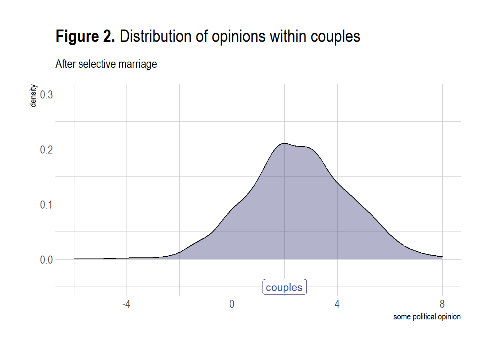
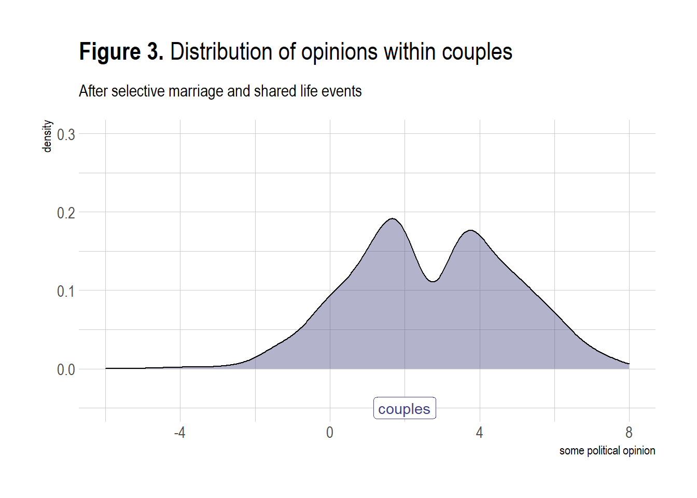
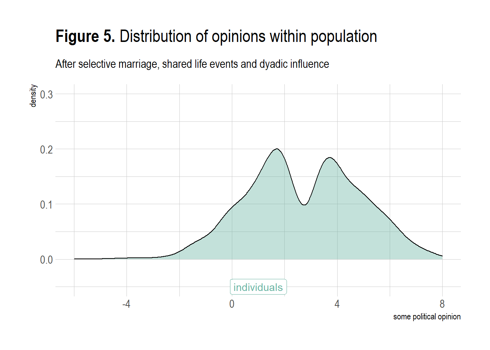

# (PART) DYADS {-} 


# Theory

<!---we need to include this somewhere as general r script---> 


The smallest possible social network is a network between two persons (or, more precisely, between two social agents). A network between two persons is also called a dyad. In the clip below I will introduce you to the the main concepts involved in a dyad. Naturally, the same concepts also play a role in larger social networks. 


<iframe src="https://player.vimeo.com/video/452233600" width="640" height="360" frameborder="0" allow="autoplay; fullscreen; picture-in-picture" allowfullscreen></iframe>

For slides, see [here](dyads.pdf).
  
>
After having watched the video you should be able to:  
>
>- give a definition of a dyad.\
- explain what is meant by time-varying and time-constant actor attributes and dyad attributes.\
- explain that relations between ego and alter can be classified  based on whether relations are directed or undirected and on the level of measurement of the relation (i.e. nominal, ordinal, interval, ratio).\
- be familiar with al the synonyms for networks, agents and relations.\
- provide examples of dyads, and the relations between ego and alter.\

## Network structures  

Dyads are the smallest possible networks. For undirected relations there are two possible dyad configurations. See Figure \@ref(fig:ud).


<div class="figure">

<p class="caption">(\#fig:ud)undirected dyad configurations</p>
</div>


There are four options for directed dayds. See Figure \@ref(fig:dd). However, two configurations (the two in the middle row) are *isomorphic*. We cannot distinguish them in the network. From now on, I won't draw all isomorphs.

<div class="figure">

<p class="caption">(\#fig:dd)undirected dyad configurations</p>
</div>

When there is a tie from *i* to *j* and vice versa, we call this a reciprocated dyad. I hope you see that the reasons for me to start or break a relation with you if you don't have relation with me, may be different from the reasons for me to start or break a relation with you if you have relation with me. 

If we consider two types of undirected relations simultaneously, we have three distinct configurations. See Figure \@ref(fig:mud).

<div class="figure">

<p class="caption">(\#fig:mud)multiplex, undirected dyad configurations</p>
</div>

Explanations for multiplex configuration are multicomplex. A first step to consider is whether there is a necessary, or likely, order in the relations. To illustrate. I first became friends with my wife and afterwards she became my wife. Although this situations hopefully holds true for most married couples, it is not logically necessary of course. A second step is to consider the valence of the relations. Are they positive or negative. It is not likely that I would name my friend a foe and vice versa but there is a thin line between love and hate. Feelings of hate and love for the same person may even coexist. Ever heard someone saying: "I can't live with him/her but I can't live without him/her either"?.

Lets have a look at the possible configuration of directed dyads with two types of relations (Figure \@ref(fig:mdd))

<div class="figure">

<p class="caption">(\#fig:mdd)multiplex, undirected dyad configurations</p>
</div>
Can you come up with an explanation for each configuration? Well you should if you study multiple type of relations between (two) social agents! But let us start with a single undirected tie: marriage. 

## Causes of dyads

An important research topic within sociology is assortative mating (or intermarriage) (see: [@kalmijn1998; @schwartz2013; @blossfeld2009]). Scholars in this field try to explain why two people in an exclusive relationship like marriage (or cohabition or best friends) are more similar to one another with respect to defining characteristics (e.g. social class, ethnicity) than two random persons. Assortative mating is a special case of **homophily**. Assortative mating is an important topic within sociology because it is, next to social mobility, an important indicator of the **openness of society**.\  

**Selection** and **influence** processes are important reasons why partners (ego and alter) within a dyad are more similar than two random persons. We may prefer to marry someone who is similar to us on key social dimensions, share our attitudes and opinions and show similar behavior. Once married we may influence each other and assimilate to one another. A third reason why we observe homophily within couples is that partners are likely to have shared and will share the **same social context**. With shared social context we mean the shared social and physical environment and shared life experiences. The environment pre-marriage may in part determine characteristics of the pool of potential marriage partners (i.e. the choice set). For example when neighborhoods and schools are segregated along ethnic and educational division lines, the potential marriage partners we meet are likely to be more similar to us than a random person in society at large. The shared social environment post-marriage may exert a similar influence on both partners, consider for example economic recession's effects on different geographic regions. This may impact the job opportunities for both partners similarly (assuming they live in the same house). An example of shared life experiences, would be having children. 

> Please note that causes and consequences of homophily are closely related. A shared social context and partner preferences may predict (or cause) homophily within dyads. But once a dyad is formed, a consequence of this relationship may be that partnes become more similar over time, as a result of a shared environment, influence and (de)selection processes. If you want to disentangle these processes, it is necessarry to have information on the degree of homophily between potential marriage partners would they be randomly assigned to one another, the degree of homophily at the beginning of the union, the degree of homophily within couples after a specific time period.  

<!---fill in the blanks--->


> **homophily**
>
> :   Homophily is the principle that a contact between similar people occurs at a
higher rate than among dissimilar people [@mcpherson2001].
You will also come across the terms:
- baseline or structural homophily: this is the degree of homophily we observe simply as a result of the composition of the total choice set, the people with whom we can, in principle, form a relationship.    
- inbreeding homophily: this is the degree of homophily we observe over and above the level of baseline homophily. This may be caused by taste homophily and differences in resources and restrictions (other than set by the total choice set).  
- taste or choice homophily: the extent of homophily induced by personal preferences.\ 

> **openness of society**
>
> :   The openness of society refers to the level of inequality of opportunities within society. The social problem of inequality consists of two sub-problems. The first refers to inequality in outcomes: the unequal distribution of resources (e.g. economic, cultural, social, knowledge, power). The second refers to inquality in opportunities, the association between specific individual or group charactersitics and the likelihood to obtain these resources. Here the opennes of society is clearly linked to the second sub-problem. Where in questions of (inter-generational) social mobility the association between social position of parents and the social position of children is assessed, within the literature on intermarriage the association between the social positions of the two spouses is assessed. Both questions or associations will tell you something about the strenght of class/social position boundaries.  


<!--- do we want to move the GTF to the intro? ---> 

### General Theoretical Framework {#GTF}

In this section, I would like to introduce a General Theoretical Framework (or micro-macro model) which can be used to explain more or less any social phenomena you are interested in. The GTF can thus also be used to explain the emergence of social networks, and thus also to explain the emergence of dyads, and thus also to explain educational intermarriage. 

<iframe src="https://player.vimeo.com/video/453716704" width="640" height="360" frameborder="0" allow="autoplay; fullscreen; picture-in-picture" allowfullscreen></iframe>

For slides, see [here](multilevel-framework.pdf).

>
After having watched the video and after heaving read this page, you should be able to:  
>
- Understand and summarize the building blocks of the multi-level framework which can be used to explain the emergence of social networks.  
  - macro-level (independent) variable(s)  
    - social conditions  
    - restrictions  
  - bridge assumptions (also called social context effects)  
  - Theory of Action  
    - preferences  
    - resources  
    - choice-set  
    - choice-input  
    - choice-output  
  - Transformation rules (also called aggregation mechanism)  
    - social interdependencies  
    - unintended/unforeseen consequences of micro-level behavior  
  - macro-level (dependent) variable
- Provide examples of all building blocks in the context of explaining the emergence of dyads 

For more background reading on the multi-level framework (aka "Coleman-boat", "Coleman-bathtub", "micro-macro models") see [@coleman1994] and [@raub2011, especially paragraph 4.4]. 

<span style='color: red;'>**The GTF is a framework, not a theory from which you can deduce hypotheses.**</span> Before we can do that, we need to fill in the blanks. That is, we need to make the social contexts (bridge assumptions) explicit. We need a Theory of Action. We need to think of the interdependencies and how they impact the aggregation mechanism.
   
So, let's get started...
  
### Social context effects  

**Characteristics of the social context** in which people are embedded (the marco- and meso-level) may impact people's preferences and resources.  
Example 1: The level of economic inequality impacts how financial resources are unequally distributed across educational groups within society.  
Hypo1: In countries with more wealth inequality, the difference between educational groups in economic resources is larger.  
Example 2: Societal norms may impact your own views and opinions and thus preferences.  
Hypo2: In countries with more equal gender norms, men's (women's) preferences for a partner with a higher education are stronger (weaker).

### The special role of restrictions

**Restrictions** or constraints also refer to macro-level characteristics but restrictions do not directly impact preferences and resources (i.e. choice input) but instead influence, or *constrain* how these preferences and resources lead to choice-output; we have a constrained choice model. Restrictions - in studies on the emergence of social networks - impact the *choice-set*, the relevant choice-options that a person has.  
If I would like to marry a grizzly bear but if there are no grizzly bears around which I can marry, I cannot act upon my preferences (commonly the example is about Eskimos but that may be considered more politically incorrect). This is called a *structural restriction*. A more realistic example would be the distribution of educational degrees within society, which depend on educational expansion and inequality of educational opportunities.  
Next, to structural restrictions we may also have *normative restrictions*, the formal and informal rules of institutions. A formal normative restriction would be a *law* that forbids me to marry a grizzly bear. An informal normative restriction would be a *social norm*, e.g. my parents who disapprove of my preference to marry a grizzly bear.  
Please note that social norms may thus impact my preferences directly (a social context effect) and indirectly (act as a restriction). 
Example1: Preferences for a partner with a similar educational level are more likely to lead to educational homogamy, if educational degrees are more evenly distributed across men and women. 


<span style='color: red;'>In the literature on resources you will see that restrictions are also commonly understood as the absence of resources. I am a stubborn scientists and DO NOT FOLLOW THIS TERMINOLOGY and neither should you.</span> 


### Theory of Action   

Persons have **preferences** for a partner with a specific educational-level. Commonly, people prefer higher-educated partners (because of instrumental motives) and people have homomphilic preferences. Preferences may differ between persons with different educational levels and between men and women.  
Persons also have **resources** (i.e. economic, cultural, cognitive, social resources) that may affect the search behavior of persons.\ 
Example1: persons with more economic resources have more options to meet different people and may thus select a partner from a larger choice-set.
Hypo1: persons with more economic resources are more likely to marry a partner that meet their preferences, i.e. a more similar partner.  

We would like to apply the GTF to explain the emergence of social networks. The networks we observe are the result of people making and breaking social relations. Consequently, a theory of action to explain decision about social relations should explain not only decisions about making new relations (i.e. **selection**) but also about decision whether or not to maintain or break existing relations (i.e. **deselection**). When we talk about selection processess, we implicitly mean both selection and deselection.\   
Concretely, if we want to explain the degree of intermarriage within society, we need to take into account both who is marrying whom *and* who is divorcing whom! Consider the following example. For some people the saying 'opposite attracts' may hold true and they may be unaware of or ignore the social norm not to intermarry. But once married the couple may face unanticipated sanctions of violating the social norm, they may be ostracized. Being faced with this unanticipated consequence of their marriage decision, the couple may subsequently decide to divorce. In this example, the social norm thus not influences the selection process (more precisely, does not moderate the impact of preferences on marriage decisions) but it does influence the deselection process.\  

>Our Theory of Action assumes a cost benefit evaluation of some sort, in line with Rational Action Theory. However, social scientists' view on human's rationality is different than the view of classical economists. Social scientists speak of restricted or bounded rationality (i.e. a weak rationality assumption); people are not always able to have or process all relevant information to make accurate and correct cost-benefit evaluations. We make questimates about the costs involved in our decision and about the likelihood that our behavior will yield the desired goal. Within sociology, actor's goals are not only economic, monatory goals. Actor's goals can be physical and social goals (i.e. health, happiness, avoidance of downwards mobility). For a nice paper on Rational Action Theory for Sociologists, see [@goldthorpe1998].     

### Transformation rules  

We now almost have all ingredients to explain (or predict) the degree of intermarriage in society. We 'only' need the aggregation mechanisms: the micro-to-macro link. We thereby need to know the macro-level (intended and unintended) consequences of individual actions. That is, we need to know how the marriage market functions.\   

Let us assume the following: 

- Someone takes the initiative. This is determined by chance. 
- The initial choice-set is formed by 5 random partners of the opposite sex (no assumptions about search behavior). Possible partners who are already married are removed from the initial choice-set. The possible partners that remain constitute the (final) choice set.  
- Persons may prefer a partner with a higher education. These preferences may differ between educational levels and between the sexes.
- Persons choose a partner from their choice set (not marrying is not an option). Possible partners with a higher education have a larger chance to be chosen. How important a partner's education is, depends on the preference of the one taking the initiative. 
- The persons who is being proposed to always accepts. 
- We observe no divorces. 
- Resources do not play any role (e.g the higher educated do not have a larger choice set)
- Educational degrees are either 'high' or 'low'. 

With the above marriage-market model we have a limited number of ingredients that impact the observed degree of educational intermarriage within society:  

- gender composition within society  
- the distribution of educational degrees in  society  
- preferences  
- the number of marriage proposals

I hope you see that marriage choices are interdependent. If I marry person A, you no longer can marry person A. 
These interdependencies make it difficult to predict the macro-level dependent variable, degree of educational homogamy.\ 

Given the market model above, can you predict who will marry whom?  

### Agent Based Modelling  

Well, I can not. You may be a mathematical wizard and able to find a closed solution by some algebra. Another option could be to to make a simplified model and try to simulate the macro-level outcome based purely on our micro-level theory of action and the rules of the marriage market. We call this Agent-Based-Modelling (see e.g. @macal2016). I programmed a simply ABM based on the above. There are some parameters in the model which you can change. 

Suppose...  

1. **%\_men=50** :  We have an equal gender distribution in society (50% men, 50% women; range: 1-99).    
2. **%\_men_EducHigh=50**: 50% of our male population is higher educated and 50% is lower educated (range: 1-99).  
3. **%\_women_EducHigh=50**: 50% of our female population is higher educated and 50% is lower educated (range: 1-99).  
4. **pref_men_EH=0**: Higher educated men do not have any preference with respect to the educational level of their partner. (range: 0-10)
4. **pref_men_EL=0**: Lower educated men do not have any preference with respect to the educational level of their partner. (range: 0-10)
4. **pref_women_EH=0**: Higher educated women do not have any preference with respect to the educational level of their partner. (range: 0-10)
4. **pref_women_EL=0**: Lower educated women do not have any preference with respect to the educational level of their partner. (range: 0-10)

Can you make a guess about the resulting degree of eductional homogamy?? Press <span style='color: red;'>Update!</span> to see if you were correct. 
Play around with (agent-based simulation) model below.  

<iframe src="https://jtolsma.shinyapps.io/marriagemarket/" style="width:100%; height: 50vw;"> </iframe>

Go to app [here](https://jtolsma.shinyapps.io/marriagemarket/)


## Consequences of dyads {#dt}

Assortative mating, or more generally mating, has consequences for both partners. Just to mention a few: relationship quality; time spend together on culture consumption; divorce rates; number of children; household income; working hours. I hope you see that these concepts all refer to the dyad-level but that you may group these concepts by how they are measured, namely at the dyad-level itself (yes/no divorce, number of children) or at the ego/alter-level and aggregated to the dyad-level (e.g. total working hours of the couple is the sum of the working hours of both individual partners, culture consumption is the consumed culture of both partners (alone and together)). But with both type of concepts, it should be clear that they are the consequence of interdependent actions of both partners (e.g. commonly both partners decide on whether to have and make children). 

Thus, once again, homophily within couples may be the result of: 

- **selection**  
- **shared context** 
- **(dyadic) influence**  

But what do we mean with 'influence'? Let's read the following quote. 

<p class= "quote"> 
People influence one another, and as the importance and immediacy of a group or individual increases, this influence becomes stronger (Latané, 1981). Forces of influence are especially strong within romantic relationships because these relationships are important, are predicated on mutual acceptance, and involve frequent exposure to the habits of one's partner." @bartel2017romantic  
</p> 

It would say this a quite naive conceptualisation of **influence**. It is implicitly assumed that partners will match their opinions/behaviors. Thus influence here is convergence. But why should partners' characteristics converge over time, why would homophily increase? And, it still does not become clear what the 'forces of influence' are. 

Let us make a distinction between:  

- positive influence: alters become more similar to each other over time  
- negative influence: alters become more distinct to each other over time  
- positive feedback influence: characteristics develop in same direction over time  
  
Now suppose these influence processes are the only reasons why alters change (i.e. the *ceteris paribus* condition). How could dyad similarity develop over time. 

<div class="figure">

<p class="caption">(\#fig:pi)Positive influence</p>
</div>

With positive influence (Figure \@ref(fig:pi)) actors will become more similar to each other over time. 

<div class="figure">

<p class="caption">(\#fig:ni)Negative influence</p>
</div>

With negative influence (Figure \@ref(fig:ni)) actors will become more distinct to each other over time. 


<div class="figure">

<p class="caption">(\#fig:pfi)Positive feedback influence</p>
</div>

With positive feedback (Figure \@ref(fig:pfi)) actors will develop in the same direction. 
Naturally, we need to be aware that other mechanisms may also explain these trends. For example, with respect the figure above \@ref(fig:pfi), a shared environment may also explain a shared trend. More concretely, when a couple gets children, both spouses may become happier over time. 

### Influence mechanisms  

There are several 'forces of positive influence mechanisms': 

- information: We may exchange new effective information and arguments with our alters.  
- persuasion (and dissuasion): we may convince, force or pressure our alters to become similar to us.  
- contagion: this can be taken quite literally, like how the flu spreads but also more metaphorically like how (health) behaviors like drinking, smoking, sporting spread (because our alters increase the opportunities for these behaviors).  
- assimilation: we may mimic our alters because of a psychological need for similarity, because we think this will be good for our identity / social status, etc.    

<span style='color: red;'>The literature is not very clear and consistent about different type of incluence processes and which influence mechanisms are at play. You will thus also see that authors use socialisation when talking about (positive) influence processes. </span> 

There are several 'forces of negative influence mechanisms': 

- information: We may exchange new counter-effective information and arguments with our alters. This would especially become relevant whey we don't like or belief the source of information and arguments.  
- persuasion (and dissuasion): we may convince, force or pressure our alters to become dissimilar to us.  
- polarisation: we may distance ourselves from our alters because of a psychological need for distinctiveness. This would especially become relevant when we are already distinct on key social dimensions.  

There are several 'forces of positive feedback influence mechanisms': 

- confirmation: information and arguments are repeated and existing opinions and behaviors of both alters reinforced.  
- competition: we may have a psychological need to be better/higher/more than our alter.  

  

The crucial difference between the positive feedback mechanisms and the positive influence mechanisms are that as a result of the former homophily between the alters does not necessarily change. Note that positive feedback could entail increasing and decreasing the opinion or behavior.    

  

<!--
**Part 2: Consequences**  

Cook, W. L., & Kenny, D. A. (2005). The actor–partner interdependence model: A model of bidirectional effects in developmental studies. *International Journal of Behavioral Development*, 29(2), 101-109.  

Popp, D., Laursen, B., Kerr, M., Stattin, H., & Burk, W. K. (2008). Modeling homophily over time with an actor-partner interdependence model. *Developmental psychology*, 44(4), 1028.  

Recommended:  


Verbakel, E., & De Graaf, P. M. (2009). Partner effects on labour market participation and job level: opposing mechanisms. *Work, Employment & Society*, 23(4), 635-654.  

Keizer, R., Schenk, N., 2012. Becoming a parent and relationship satisfaction: A longitudinal dyadic perspective. *Journal of Marriage and Family*, 74, 759-773.  

-->  


---  


# Methods  


## Causes  

<!---see!!! 
https://link.springer.com/chapter/10.1007/978-3-319-93227-9_13

https://haozhu233.github.io/kableExtra/awesome_table_in_html.html
---> 

When testing hypotheses on assortative mating many methodological approaches can be used. We may predict the **frequency of specific dyads** in our population with loglinear models and the data we use is commonly structured in a square table like the one below. Loglinear models are, in essence, nothing more than a nice, parsimonious and fancy way to calculate [odds ratio's](#OR). If we have a small, well filled table of just a few attributes, [loglinear models](#LLM) are considered to be the golden standard. 

<table class=" lightable-classic table table-striped table-hover table-condensed table-responsive" style="font-family: Cambria; width: auto !important; margin-left: auto; margin-right: auto; margin-left: auto; margin-right: auto;">
<caption>(\#tab:tabledyads)Assortative Mating (dyad frequency)</caption>
 <thead>
  <tr>
   <th style="text-align:left;font-weight: bold;">   </th>
   <th style="text-align:center;font-weight: bold;"> Wife educ-high </th>
   <th style="text-align:center;font-weight: bold;"> Wife educ-low </th>
  </tr>
 </thead>
<tbody>
  <tr>
   <td style="text-align:left;font-weight: bold;"> Husband educ-high </td>
   <td style="text-align:center;"> 350 </td>
   <td style="text-align:center;"> 150 </td>
  </tr>
  <tr>
   <td style="text-align:left;font-weight: bold;"> Husband educ-low </td>
   <td style="text-align:center;"> 200 </td>
   <td style="text-align:center;"> 400 </td>
  </tr>
</tbody>
</table>


Another approach is to take the **characteristics of the dyad** (e.g. 1 = intermarriage and 0 = no intermarriage) as the dependent variable. This dependent variable can than be explained by applying (conditional) (multinomial) [logistic regression](#LM) techniques. In this case, the data is commonly structured in long format and looks something like the table below. 

<div style="border: 1px solid #ddd; padding: 0px; overflow-y: scroll; height:400px; overflow-x: scroll; width:100%; "><table class=" lightable-classic table table-striped table-hover table-condensed table-responsive" style="font-family: Cambria; width: auto !important; margin-left: auto; margin-right: auto; margin-left: auto; margin-right: auto;">
<caption>(\#tab:tabledyads2)Assortative Mating (dyad characteristic)</caption>
 <thead>
  <tr>
   <th style="text-align:center;position: sticky; top:0; background-color: #FFFFFF;"> dyad_id </th>
   <th style="text-align:center;position: sticky; top:0; background-color: #FFFFFF;"> wife educ </th>
   <th style="text-align:center;position: sticky; top:0; background-color: #FFFFFF;"> wife age </th>
   <th style="text-align:center;position: sticky; top:0; background-color: #FFFFFF;"> husband educ </th>
   <th style="text-align:center;position: sticky; top:0; background-color: #FFFFFF;"> husband age </th>
   <th style="text-align:center;position: sticky; top:0; background-color: #FFFFFF;"> intermarriage </th>
  </tr>
 </thead>
<tbody>
  <tr>
   <td style="text-align:center;"> 1 </td>
   <td style="text-align:center;"> LOW </td>
   <td style="text-align:center;"> 30.63 </td>
   <td style="text-align:center;"> LOW </td>
   <td style="text-align:center;"> 26.91 </td>
   <td style="text-align:center;"> 0 </td>
  </tr>
  <tr>
   <td style="text-align:center;"> 2 </td>
   <td style="text-align:center;"> LOW </td>
   <td style="text-align:center;"> 24.79 </td>
   <td style="text-align:center;"> LOW </td>
   <td style="text-align:center;"> 34.61 </td>
   <td style="text-align:center;"> 0 </td>
  </tr>
  <tr>
   <td style="text-align:center;"> 3 </td>
   <td style="text-align:center;"> HIGH </td>
   <td style="text-align:center;"> 19.00 </td>
   <td style="text-align:center;"> HIGH </td>
   <td style="text-align:center;"> 25.92 </td>
   <td style="text-align:center;"> 0 </td>
  </tr>
  <tr>
   <td style="text-align:center;"> 4 </td>
   <td style="text-align:center;"> HIGH </td>
   <td style="text-align:center;"> 29.31 </td>
   <td style="text-align:center;"> LOW </td>
   <td style="text-align:center;"> 39.08 </td>
   <td style="text-align:center;"> 0 </td>
  </tr>
  <tr>
   <td style="text-align:center;"> 5 </td>
   <td style="text-align:center;"> HIGH </td>
   <td style="text-align:center;"> 25.32 </td>
   <td style="text-align:center;"> LOW </td>
   <td style="text-align:center;"> 30.11 </td>
   <td style="text-align:center;"> 0 </td>
  </tr>
  <tr>
   <td style="text-align:center;"> 6 </td>
   <td style="text-align:center;"> LOW </td>
   <td style="text-align:center;"> 23.86 </td>
   <td style="text-align:center;"> LOW </td>
   <td style="text-align:center;"> 19.01 </td>
   <td style="text-align:center;"> 0 </td>
  </tr>
  <tr>
   <td style="text-align:center;"> 7 </td>
   <td style="text-align:center;"> HIGH </td>
   <td style="text-align:center;"> 36.36 </td>
   <td style="text-align:center;"> LOW </td>
   <td style="text-align:center;"> 35.34 </td>
   <td style="text-align:center;"> 0 </td>
  </tr>
  <tr>
   <td style="text-align:center;"> 8 </td>
   <td style="text-align:center;"> LOW </td>
   <td style="text-align:center;"> 35.58 </td>
   <td style="text-align:center;"> HIGH </td>
   <td style="text-align:center;"> 22.64 </td>
   <td style="text-align:center;"> 0 </td>
  </tr>
  <tr>
   <td style="text-align:center;"> 9 </td>
   <td style="text-align:center;"> LOW </td>
   <td style="text-align:center;"> 24.24 </td>
   <td style="text-align:center;"> HIGH </td>
   <td style="text-align:center;"> 36.36 </td>
   <td style="text-align:center;"> 0 </td>
  </tr>
  <tr>
   <td style="text-align:center;"> 10 </td>
   <td style="text-align:center;"> LOW </td>
   <td style="text-align:center;"> 20.27 </td>
   <td style="text-align:center;"> HIGH </td>
   <td style="text-align:center;"> 20.79 </td>
   <td style="text-align:center;"> 0 </td>
  </tr>
  <tr>
   <td style="text-align:center;"> 11 </td>
   <td style="text-align:center;"> HIGH </td>
   <td style="text-align:center;"> 24.08 </td>
   <td style="text-align:center;"> LOW </td>
   <td style="text-align:center;"> 34.20 </td>
   <td style="text-align:center;"> 0 </td>
  </tr>
  <tr>
   <td style="text-align:center;"> 12 </td>
   <td style="text-align:center;"> HIGH </td>
   <td style="text-align:center;"> 44.44 </td>
   <td style="text-align:center;"> LOW </td>
   <td style="text-align:center;"> 23.97 </td>
   <td style="text-align:center;"> 0 </td>
  </tr>
  <tr>
   <td style="text-align:center;"> 13 </td>
   <td style="text-align:center;"> LOW </td>
   <td style="text-align:center;"> 33.40 </td>
   <td style="text-align:center;"> LOW </td>
   <td style="text-align:center;"> 25.77 </td>
   <td style="text-align:center;"> 0 </td>
  </tr>
  <tr>
   <td style="text-align:center;"> 14 </td>
   <td style="text-align:center;"> HIGH </td>
   <td style="text-align:center;"> 27.86 </td>
   <td style="text-align:center;"> HIGH </td>
   <td style="text-align:center;"> 35.55 </td>
   <td style="text-align:center;"> 0 </td>
  </tr>
  <tr>
   <td style="text-align:center;"> 15 </td>
   <td style="text-align:center;"> LOW </td>
   <td style="text-align:center;"> 21.97 </td>
   <td style="text-align:center;"> HIGH </td>
   <td style="text-align:center;"> 19.44 </td>
   <td style="text-align:center;"> 0 </td>
  </tr>
  <tr>
   <td style="text-align:center;"> 16 </td>
   <td style="text-align:center;"> HIGH </td>
   <td style="text-align:center;"> 38.16 </td>
   <td style="text-align:center;"> LOW </td>
   <td style="text-align:center;"> 18.42 </td>
   <td style="text-align:center;"> 0 </td>
  </tr>
  <tr>
   <td style="text-align:center;"> 17 </td>
   <td style="text-align:center;"> HIGH </td>
   <td style="text-align:center;"> 44.85 </td>
   <td style="text-align:center;"> HIGH </td>
   <td style="text-align:center;"> 37.86 </td>
   <td style="text-align:center;"> 0 </td>
  </tr>
  <tr>
   <td style="text-align:center;"> 18 </td>
   <td style="text-align:center;"> LOW </td>
   <td style="text-align:center;"> 30.91 </td>
   <td style="text-align:center;"> LOW </td>
   <td style="text-align:center;"> 23.21 </td>
   <td style="text-align:center;"> 0 </td>
  </tr>
  <tr>
   <td style="text-align:center;"> 19 </td>
   <td style="text-align:center;"> HIGH </td>
   <td style="text-align:center;"> 24.30 </td>
   <td style="text-align:center;"> HIGH </td>
   <td style="text-align:center;"> 31.53 </td>
   <td style="text-align:center;"> 0 </td>
  </tr>
  <tr>
   <td style="text-align:center;"> 20 </td>
   <td style="text-align:center;"> LOW </td>
   <td style="text-align:center;"> 36.19 </td>
   <td style="text-align:center;"> LOW </td>
   <td style="text-align:center;"> 21.50 </td>
   <td style="text-align:center;"> 0 </td>
  </tr>
</tbody>
</table></div>


Which methodology is preferred should depend on your hypotheses and on the data you have to your availability. 

> Please be aware that in both approaches we normally do not have information on (the frequency or characteristics of) dyads in which there is no relation between ego and alter. Thus, you may have information on characteristics of me and my wife but you do not have information on all other women (or men) I could have married but didn't. I fished my wife out of the sea but we don't know what the other fish looked like. (Luckily my wife is no scientist and won't read this clarification.)

### Odds Ratio {#OR}  

### Loglinear Model {#LLM}  

### Conditional multinomial logit model {#LM}  

## Consequences  {.tabset .tabset-fade}  

## Consequences of dyads (methods)

The method used to explain consequences of dyads depends on our Unit of Analysis. If it is the dyad itself (e.g. mean relationship quality) methods are relatively straightforward, because we may assume that the observations at the dyad-level are independent. If, on the other hand, the unit of analysis are the partners themselves that make up the dyad, we need to acknowledge that the observations between the partners of the same couple are not independent. In part exactly because partners select and influence each other and share a social context. One solution could be to simply randomly select one partner of each couple or, if partners can be clearly distinguished - for example men and women in heterosexual couples - the different partners could be analyzed separately. A disadvantage of the latter two approaches is, however, that the covariance between the partners cannot be explained anymore, although this may exactly be the focus of our research questions.  A more elegant solution, is to take the interdependencies into account and model these explicitly. This can be done within a multi-level framework and within a structural-equation modelling framework. 

When we discussed the methods to analyze causes of homogamy, we were interested in homophily within couples at one point in time and focused on selection as explanans. Now, when we discuss the consequences of dyads, we are interested in explaining trends in homophily within couples and focus on shared context and influence processes as explanans. 


------------------------------------------------------------------------


**PARTNERS AND POLITICS - When do we listen to our partner**'s political opinion? 

<html>
<body>
</iframe>
<a id='LuHtIfAxRu5Ma_5cwLSW1g' class='gie-single' href='http://www.gettyimages.nl/detail/153360657' target='_blank' style='color:#a7a7a7;text-decoration:none;font-weight:normal !important;border:none;display:inline-block;'>Embed from Getty Images</a><script>window.gie=window.gie||function(c){(gie.q=gie.q||[]).push(c)};gie(function(){gie.widgets.load({id:'LuHtIfAxRu5Ma_5cwLSW1g',sig:'1lfLuUoX5Pth1-d8wRyeRSQhCC9Ov2SK_l9qlSdR5X8=',w:'507px',h:'338px',items:'153360657',caption: true ,tld:'nl',is360: false })});</script><script src='//embed-cdn.gettyimages.com/widgets.js' charset='utf-8' async></script>
</body>
</html>

In this part of the book, we will demonstrate the Cross-Lagged Panel Model (CLPM) and how to apply it to assess whether partners influence each other opinions. 

---   

**Relevance**

Why would influence processes between couples be relevant. Well, for many reasons. But influence processes that take place within couples may explain (in part):  

1. Political polarization within society. 
2. Opinion homophily within couples. 

Political polarization between groups (e.g. couples) may be the result of: 

- **selection**  
- **common context** 
- **influence**  


Homophily within couples may be the result of: 

- **selection**  
- **common context** 
- **dyadic influence**  

Let us briefly discuss these three common causes and demonstrate how the resulting homophily within couples could contribute to polarization at the society level. 


---  

### Selection  

We will start with a fictive population of unmarried persons. Some political opinion is distributed as follows within society. 

<div class="figure">

<p class="caption">(\#fig:unnamed-chunk-2)Distribution of opinions within population</p>
</div>
But these individuals want to get married. Who do they pick. Well, we discussed the marriage market here. 
<!--- insert link to marriage market ---> 

Marriage Market: Constrained Decisions with whom to marry (or cohabit). 

Let us assume that the opinion did not yet change but that bachelors prefer, to some extent, a partner with a similar political opinion. What does the political opinion distribution look like for the mean political opinion of the couples. 



Well, the preference for a partner with similar political opinions was definitely not strong enough to substantially change the opinion distribution.[^sim]

[^sim]: naturally this will depend on how strong we simulate this preference to be. 

Please go to the common context tab. 

<!---insert link here--->

---  

### Common context  

What is a 'common context'?  

Some examples:  

- Shared life experiences:  
  - having kids  
  - poverty  
- Shared environment:
  - pollution
  - housing
  - poverty 

Suppose these life events are more likely for some couples than others. More specifically, assume that the occurrence of life events is associated with the mean political opinion of the couple (at time T). The life event consequently influences the mean political opinion of the couple (at time T+1). 



We now clearly observe polarization between couples. 
However, if we go back to the individual-level again, we do not (clearly) observe polarization between individuals. 


In order to also observe (pronounced) polarization between individuals, there needs to be some influence between partners


---  

### Dyadic Influence  

Why would partners influence each other? Well, we discussed influence here. <!---insert link---> 

- Dyadic (positive) influence:  
  - information  
  - persuasion  
  - need for similarity  




---   

## Dyadic Influence: Mechanisms

What happens within the couple? 
Or phrased otherwise, what could dyadic influence look like? 

- No change (no influence)  
- Common trend (commen context and/or dyadic influence)  
- Convergence (assimilation)   
- Mimic change after 'shocks' 


---  

## Expectations 

Now, let us try to formulate several hypotheses on influence processes taking place within couples. Naturally, these hypotheses should be derived from existing (and established) theories. But the aim here is not to teach you how to derive hypotheses but to test hypotheses on dyadic influence.  

<p class= "quote">
"People influence one another, and as the importance and immediacy of a group or individual increases, this influence becomes stronger (Latané, 1981). Forces of influence are especially strong within romantic relationships because these relationships are important, are predicated on mutual acceptance, and involve frequent exposure to the habits of one's partner." @bartel2017romantic  
</p>

Naive conceptualisation of **influence**. It is assumed that partners will match their opinions/behaviors. Thus influence here is convergence and reaction to shocks. 

**Hypothesis 1 Partner influence hypothesis**: Partners opinions will become more similar to one another over time.   
We will introduce the CLPM below. Once you are familiar with this model, you see that we can and should formulate a more precise hypothesis 1.  

**Hypo1 RI-CLPM:** When your partner's opinion is relatively high (compared to your partners average opinion over time) at time T, your own opinion will be relatively high (compared to your own average opinion over time) at time T+1. 

<!---
Hypo1 SC-RI-CLPM: Even if we control for structural time trends in political opinions, when your partner's opinion is relatively high (compared to your partners average opinion over time) at time T, your own opinion will be relatively high (compared to your own average opinion over time) at time T+1. 

Hypo1 LT-RI-CLPM: Even if we take into account that...: 
  - the general time trend of men and women will be (positively) associated (i.e. positive covariance of the random slopes);  
  - the mean opinion of your spouse will influence your general time trend (i.e. negative covariance of random intercept of men with random slop of women (and vice versa));
  ...when your partner's opinion is relatively high (compared to your partners average opinion over time) at time T, your own opinion will be relatively high (compared to your own average opinion over time) at time T+1. 
--->

**Hypothesis 2 Male dominance hypothesis**: Women are more influenced by their (male) spouse than men are influenced by their (female) spouse.** 

**Hypothesis 3 Educational dominance hypothesis:** The spouse with the lowest education is more influenced by their partner than the spouse with the highest education.** 


---  


## Data {.tabset .tabset-fade}


<a href="https://www.lissdata.nl/">
  
  </a>

We will use:  

- 11 waves (2008-2014, 2016-2020)  
- More than 3000 heterosexual couples (cohabiting and married)
- Older than 25

We have already constructed a dataset for you guys and gals to work with. 

Please download this data file to your working directory.

[partner_dataprepped.Rdata](addfiles\partner_dataprepped.Rdata)\

### Variables  


Variables of interest and value labels:

-   Education: = highest completed education in years (4-16.5)
-   sex: = 0 = male / 1 = female
-   eu_integration: 0 = eu integration has gone too far / 4 = eu integration should go further
-   immigrants: 0 = immigrants should adjust / 4 immigrants can retain their own culture.
-   euthanasia: 1 = euthanasia should be forbidden / 5 euthanasia should be permitted
-   income: 1 differences in income should increase / 5 differences in income should decrease

<p class= "quote"> **opleiding**  

> Hoogste opleiding met diploma  
> 1 basisonderwijs  
> 2 vmbo  
> 3 havo/vwo  
> 4 mbo  
> 5 hbo  
> 6 wo  
> 7 anders  
> 8 (Nog) geen onderwijs afgerond  
> 9 Volgt nog geen onderwijs  
> Hierbij hebben wij opleiding gecategoriseerd in drie groepen:  
> 1. Laag: basisonderwijs en vmbo  
> 2. Midden: havo/vwo en mbo  
> 3. Hoog: hbo en wo  
> We nemen enkel mensen van 25 jaar en ouder mee. Van hen verwachten we dat ze klaar zijn met hun onderwijscarriere. 

</p>

<p class= "quote"> 
**EU integratie** 

> De Europese integratie is te ver gegaan.  
>  
>  1 Helemaal oneens  
>  2 Oneens   
>  3 Niet eens, niet oneens  
>  4 Eens  
>  5 Helemaal eens  

</p>

<p class= "quote"> 
**Migratie/integratie**

> In Nederland vinden sommigen dat mensen met een migratie achtergrond hier moeten kunnen leven met behoud van de eigen cultuur. Anderen vinden dat zij zich geheel moeten aanpassen aan de Nederlandse cultuur. Waar zou u uzelf plaatsen op een schaal van 1 t/m 5, waarbij 1 behoud van eigen cultuur voor mensen met een migratie achtergrond betekent en 5 dat zij zich geheel moeten aanpassen?  
>  
> 1	behoud van eigen cultuur voor mensen met een migratie achtergrond  
> 2  
> 3	  
> 4	  
> 5	mensen met een migratie achtergrond moeten zich geheel aanpassen  

</p>
---  

### Descriptives

**TO DO**

---  

## Analysis 

As always, make sure to start properly. See here. <!---insert link---> 

We need to do some additional dataprep. Have a look at the dataset. It is in long format but we will need a wide format. 


I know it is a bit cumbersome, but we will make a datafile for each dependent variable separately and will use some shorter names. The data files are stored in a list called `datalist_ori`. 


```r
datalist_ori <- list()

# dep1: eu_integration

dat <- data.frame(x1 = partner_df_wide$eu_integration.m.1)
dat$x2 <- partner_df_wide$eu_integration.m.2
dat$x3 <- partner_df_wide$eu_integration.m.3
dat$x4 <- partner_df_wide$eu_integration.m.4
dat$x5 <- partner_df_wide$eu_integration.m.5
dat$x6 <- partner_df_wide$eu_integration.m.6
dat$x7 <- partner_df_wide$eu_integration.m.7
dat$x8 <- partner_df_wide$eu_integration.m.8
dat$x9 <- partner_df_wide$eu_integration.m.9
dat$x10 <- partner_df_wide$eu_integration.m.10
dat$x11 <- partner_df_wide$eu_integration.m.11

dat$y1 <- partner_df_wide$eu_integration.f.1
dat$y2 <- partner_df_wide$eu_integration.f.2
dat$y3 <- partner_df_wide$eu_integration.f.3
dat$y4 <- partner_df_wide$eu_integration.f.4
dat$y5 <- partner_df_wide$eu_integration.f.5
dat$y6 <- partner_df_wide$eu_integration.f.6
dat$y7 <- partner_df_wide$eu_integration.f.7
dat$y8 <- partner_df_wide$eu_integration.f.8
dat$y9 <- partner_df_wide$eu_integration.f.9
dat$y10 <- partner_df_wide$eu_integration.f.10
dat$y11 <- partner_df_wide$eu_integration.f.11

# treat education as a time stable. And use all available data.
dat$oplx <- rowMeans(partner_df_wide[, c("oplmet.m.1", "oplmet.m.2", "oplmet.m.3", "oplmet.m.4", "oplmet.m.5", 
    "oplmet.m.6", "oplmet.m.7", "oplmet.m.8", "oplmet.m.9", "oplmet.m.10", "oplmet.m.11")], na.rm = T)
dat$oply <- rowMeans(partner_df_wide[, c("oplmet.f.1", "oplmet.f.2", "oplmet.f.3", "oplmet.f.4", "oplmet.f.5", 
    "oplmet.f.6", "oplmet.f.7", "oplmet.f.8", "oplmet.f.9", "oplmet.f.10", "oplmet.f.11")], na.rm = T)

# calculate diff in education between men and women
dat$oplxy <- dat$oplx - dat$oply
# table(dat$oplx, dat$oply, useNA = 'always') hist(dat$oplxy)

# define three groups for multigroup analyses
dat$oplgroup <- ifelse(dat$oplxy > 1, "menhigher", NA)
dat$oplgroup <- ifelse(dat$oplxy < -1, "womenhigher", dat$oplgroup)
dat$oplgroup <- ifelse(dat$oplxy <= 1 & dat$oplxy >= -1, "equal", dat$oplgroup)
# table(dat$oplgroup, useNA = 'always')

dat_ori <- dat
datalist_ori[[1]] <- dat_ori


# dep2: immigrants

dat <- data.frame(x1 = partner_df_wide$immigrants.m.1)
dat$x2 <- partner_df_wide$immigrants.m.2
dat$x3 <- partner_df_wide$immigrants.m.3
dat$x4 <- partner_df_wide$immigrants.m.4
dat$x5 <- partner_df_wide$immigrants.m.5
dat$x6 <- partner_df_wide$immigrants.m.6
dat$x7 <- partner_df_wide$immigrants.m.7
dat$x8 <- partner_df_wide$immigrants.m.8
dat$x9 <- partner_df_wide$immigrants.m.9
dat$x10 <- partner_df_wide$immigrants.m.10
dat$x11 <- partner_df_wide$immigrants.m.11

dat$y1 <- partner_df_wide$immigrants.f.1
dat$y2 <- partner_df_wide$immigrants.f.2
dat$y3 <- partner_df_wide$immigrants.f.3
dat$y4 <- partner_df_wide$immigrants.f.4
dat$y5 <- partner_df_wide$immigrants.f.5
dat$y6 <- partner_df_wide$immigrants.f.6
dat$y7 <- partner_df_wide$immigrants.f.7
dat$y8 <- partner_df_wide$immigrants.f.8
dat$y9 <- partner_df_wide$immigrants.f.9
dat$y10 <- partner_df_wide$immigrants.f.10
dat$y11 <- partner_df_wide$immigrants.f.11

# treat education as a time stable. And use all available data.
dat$oplx <- rowMeans(partner_df_wide[, c("oplmet.m.1", "oplmet.m.2", "oplmet.m.3", "oplmet.m.4", "oplmet.m.5", 
    "oplmet.m.6", "oplmet.m.7", "oplmet.m.8", "oplmet.m.9", "oplmet.m.10", "oplmet.m.11")], na.rm = T)
dat$oply <- rowMeans(partner_df_wide[, c("oplmet.f.1", "oplmet.f.2", "oplmet.f.3", "oplmet.f.4", "oplmet.f.5", 
    "oplmet.f.6", "oplmet.f.7", "oplmet.f.8", "oplmet.f.9", "oplmet.f.10", "oplmet.f.11")], na.rm = T)

# calculate diff in education between men and women
dat$oplxy <- dat$oplx - dat$oply
# table(dat$oplx, dat$oply, useNA = 'always') hist(dat$oplxy)

# define three groups for multigroup analyses
dat$oplgroup <- ifelse(dat$oplxy > 1, "menhigher", NA)
dat$oplgroup <- ifelse(dat$oplxy < -1, "womenhigher", dat$oplgroup)
dat$oplgroup <- ifelse(dat$oplxy <= 1 & dat$oplxy >= -1, "equal", dat$oplgroup)
# table(dat$oplgroup, useNA = 'always')

dat_ori <- dat
datalist_ori[[2]] <- dat_ori

# dep3: euthanasia

dat <- data.frame(x1 = partner_df_wide$euthanasia.m.1)
dat$x2 <- partner_df_wide$euthanasia.m.2
dat$x3 <- partner_df_wide$euthanasia.m.3
dat$x4 <- partner_df_wide$euthanasia.m.4
dat$x5 <- partner_df_wide$euthanasia.m.5
dat$x6 <- partner_df_wide$euthanasia.m.6
dat$x7 <- partner_df_wide$euthanasia.m.7
dat$x8 <- partner_df_wide$euthanasia.m.8
dat$x9 <- partner_df_wide$euthanasia.m.9
dat$x10 <- partner_df_wide$euthanasia.m.10
dat$x11 <- partner_df_wide$euthanasia.m.11

dat$y1 <- partner_df_wide$euthanasia.f.1
dat$y2 <- partner_df_wide$euthanasia.f.2
dat$y3 <- partner_df_wide$euthanasia.f.3
dat$y4 <- partner_df_wide$euthanasia.f.4
dat$y5 <- partner_df_wide$euthanasia.f.5
dat$y6 <- partner_df_wide$euthanasia.f.6
dat$y7 <- partner_df_wide$euthanasia.f.7
dat$y8 <- partner_df_wide$euthanasia.f.8
dat$y9 <- partner_df_wide$euthanasia.f.9
dat$y10 <- partner_df_wide$euthanasia.f.10
dat$y11 <- partner_df_wide$euthanasia.f.11

# treat education as a time stable. And use all available data.
dat$oplx <- rowMeans(partner_df_wide[, c("oplmet.m.1", "oplmet.m.2", "oplmet.m.3", "oplmet.m.4", "oplmet.m.5", 
    "oplmet.m.6", "oplmet.m.7", "oplmet.m.8", "oplmet.m.9", "oplmet.m.10", "oplmet.m.11")], na.rm = T)
dat$oply <- rowMeans(partner_df_wide[, c("oplmet.f.1", "oplmet.f.2", "oplmet.f.3", "oplmet.f.4", "oplmet.f.5", 
    "oplmet.f.6", "oplmet.f.7", "oplmet.f.8", "oplmet.f.9", "oplmet.f.10", "oplmet.f.11")], na.rm = T)

# calculate diff in education between men and women
dat$oplxy <- dat$oplx - dat$oply
# table(dat$oplx, dat$oply, useNA = 'always') hist(dat$oplxy)

# define three groups for multigroup analyses
dat$oplgroup <- ifelse(dat$oplxy > 1, "menhigher", NA)
dat$oplgroup <- ifelse(dat$oplxy < -1, "womenhigher", dat$oplgroup)
dat$oplgroup <- ifelse(dat$oplxy <= 1 & dat$oplxy >= -1, "equal", dat$oplgroup)
# table(dat$oplgroup, useNA = 'always')

dat_ori <- dat
datalist_ori[[3]] <- dat_ori

# dep4: income_diff

dat <- data.frame(x1 = partner_df_wide$income_diff.m.1)
dat$x2 <- partner_df_wide$income_diff.m.2
dat$x3 <- partner_df_wide$income_diff.m.3
dat$x4 <- partner_df_wide$income_diff.m.4
dat$x5 <- partner_df_wide$income_diff.m.5
dat$x6 <- partner_df_wide$income_diff.m.6
dat$x7 <- partner_df_wide$income_diff.m.7
dat$x8 <- partner_df_wide$income_diff.m.8
dat$x9 <- partner_df_wide$income_diff.m.9
dat$x10 <- partner_df_wide$income_diff.m.10
dat$x11 <- partner_df_wide$income_diff.m.11

dat$y1 <- partner_df_wide$income_diff.f.1
dat$y2 <- partner_df_wide$income_diff.f.2
dat$y3 <- partner_df_wide$income_diff.f.3
dat$y4 <- partner_df_wide$income_diff.f.4
dat$y5 <- partner_df_wide$income_diff.f.5
dat$y6 <- partner_df_wide$income_diff.f.6
dat$y7 <- partner_df_wide$income_diff.f.7
dat$y8 <- partner_df_wide$income_diff.f.8
dat$y9 <- partner_df_wide$income_diff.f.9
dat$y10 <- partner_df_wide$income_diff.f.10
dat$y11 <- partner_df_wide$income_diff.f.11

# treat education as a time stable. And use all available data.
dat$oplx <- rowMeans(partner_df_wide[, c("oplmet.m.1", "oplmet.m.2", "oplmet.m.3", "oplmet.m.4", "oplmet.m.5", 
    "oplmet.m.6", "oplmet.m.7", "oplmet.m.8", "oplmet.m.9", "oplmet.m.10", "oplmet.m.11")], na.rm = T)
dat$oply <- rowMeans(partner_df_wide[, c("oplmet.f.1", "oplmet.f.2", "oplmet.f.3", "oplmet.f.4", "oplmet.f.5", 
    "oplmet.f.6", "oplmet.f.7", "oplmet.f.8", "oplmet.f.9", "oplmet.f.10", "oplmet.f.11")], na.rm = T)

# calculate diff in education between men and women
dat$oplxy <- dat$oplx - dat$oply
# table(dat$oplx, dat$oply, useNA = 'always') hist(dat$oplxy)

# define three groups for multigroup analyses
dat$oplgroup <- ifelse(dat$oplxy > 1, "menhigher", NA)
dat$oplgroup <- ifelse(dat$oplxy < -1, "womenhigher", dat$oplgroup)
dat$oplgroup <- ifelse(dat$oplxy <= 1 & dat$oplxy >= -1, "equal", dat$oplgroup)
# table(dat$oplgroup, useNA = 'always')

dat_ori <- dat
datalist_ori[[4]] <- dat_ori
```

------------------------------------------------------------------------

## Modelling strategy {.tabset .tabset-fade}

- Actor effects: stability effects  
- Partner effects: influence effects  


Controlling for education.  


<div class="figure">

<p class="caption">(\#fig:unnamed-chunk-15)RI-CLPM</p>
</div>
  

Source: [@mulder2020three](https://www.tandfonline.com/doi/full/10.1080/10705511.2020.1784738)


-   We will compare the results across four different modeling strategies:
    -   Cross-lagged Panel Model (CLPM) (11 waves)\
    -   **RI-CLPM (11 waves)**\
    -   RI-CLPM + structural time trends (11 waves)
    -   RI/RS-CLPM (11 waves)


### Robustness

-   We will test our hypotheses for four different dependent variables:

    -   eu-integration\
    -   immigration\
    -   euthanasia\
    -   income differences\

Feel free to re-estimate all models yourself. But it will be way quicker to download all results. 


[results.Rdata](addfiles\results.Rdata)\

------------------------------------------------------------------------

## Results Hypo1 {.tabset .tabset-fade}

**Hypo1 RI-CLPM: When your partner's opinion is relatively high (compared to your partners average opinion over time) at time T, your own opinion will be relatively high (compared to your own average opinion over time) at time T+1.** 


### CLPM  


```r
results <- list()

myModel <- "
  ### control for education
  x1 + x2 + x3 +x4 + x5 + x6 + x7 + x8 + x9 + x10 + x11 ~ e*oplx
  y1 + y2 + y3 +y4 + y5 + y6 + y7 + y8 + y9 + y10 + y11 ~ e*oply
  
  ### Estimate the lagged effects
  x2 ~ a*x1 + b*y1
  x3 ~ a*x2 + b*y2
  x4 ~ a*x3 + b*y3
  x5 ~ a*x4 + b*y4
  x6 ~ a*x5 + b*y5
  x7 ~ a*x6 + b*y6
  x8 ~ a*x7 + b*y7
  x9 ~ a*x8 + b*y8
  x10 ~ a*x9 + b*y9
  x11 ~ a*x10 + b*y10
  
  y2 ~ b*x1 + a*y1
  y3 ~ b*x2 + a*y2
  y4 ~ b*x3 + a*y3
  y5 ~ b*x4 + a*y4
  y6 ~ b*x5 + a*y5
  y7 ~ b*x6 + a*y6
  y8 ~ b*x7 + a*y7
  y9 ~ b*x8 + a*y8
  y10 ~ b*x9 + a*y9
  y11 ~ b*x10 + a*y10

  # Estimate the (residual) covariance between the variables
  x1 ~~ y1 # Covariance
  x2 ~~ y2
  x3 ~~ y3
  x4 ~~ y4
  x5 ~~ y5
  x6 ~~ y6
  x7 ~~ y7
  x8 ~~ y8
  x9 ~~ y9
  x10 ~~ y10
  x11 ~~ y11
  
  # Estimate the (residual) variance of the variables.
  x1 ~~ x1 # Variances
  y1 ~~ y1 
  x2 ~~ x2 # Residual variances
  y2 ~~ y2 
  x3 ~~ x3 
  y3 ~~ y3 
  x4 ~~ x4 
  y4 ~~ y4 
  x5 ~~ x5
  y5 ~~ y5
  x6 ~~ x6
  y6 ~~ y6
  x7 ~~ x7
  y7 ~~ y7 
  x8 ~~ x8 
  y8 ~~ y8 
  x9 ~~ x9 
  y9 ~~ y9 
  x10 ~~ x10
  y10 ~~ y10
  x11 ~~ x11
  y11 ~~ y11
  
  #intercepts
  x1 ~ 1
  y1 ~ 1
  x2 ~ 1
  y2 ~ 1
  x3 ~ 1
  y3 ~ 1
  x4 ~ 1
  y4 ~ 1
  x5 ~ 1
  y5 ~ 1
  x6 ~ 1
  y6 ~ 1
  x7 ~ 1
  y7 ~ 1
  x8 ~ 1
  y8 ~ 1
  x9 ~ 1
  y9 ~ 1
  x10 ~ 1
  y10 ~ 1
  x11 ~ 1
  y11 ~ 1
  
  
"

# Estimate models a bit faster:

estimate <- function(x) lavaan(myModel, data = x, missing = "fiml.x", meanstructure = T)
library(future.apply)
plan(multisession)

results_temp <- future_lapply(datalist_ori, estimate)

results[[1]] <- results_temp[[1]]
results[[2]] <- results_temp[[2]]
results[[3]] <- results_temp[[3]]
results[[4]] <- results_temp[[4]]

names(results)[1:4] <- c("fitm1h1y1", "fitm1h1y2", "fitm1h1y3", "fitm1h1y4")

save(results, file = "results.RData")
```


```r
load("addfiles/results.Rdata")

summary(results[[1]])
summary(results[[2]])
summary(results[[3]])
summary(results[[4]])
```

```
#> lavaan 0.6-7 ended normally after 31 iterations
#> 
#>   Estimator                                         ML
#>   Optimization method                           NLMINB
#>   Number of free parameters                        117
#>   Number of equality constraints                    59
#>                                                       
#>   Number of observations                          3283
#>   Number of missing patterns                      1415
#>                                                       
#> Model Test User Model:
#>                                                       
#>   Test statistic                              3353.035
#>   Degrees of freedom                               261
#>   P-value (Chi-square)                           0.000
#> 
#> Parameter Estimates:
#> 
#>   Standard errors                             Standard
#>   Information                                 Observed
#>   Observed information based on                Hessian
#> 
#> Regressions:
#>                    Estimate  Std.Err  z-value  P(>|z|)
#>   x1 ~                                                
#>     oplx       (e)    0.039    0.002   22.760    0.000
#>   x2 ~                                                
#>     oplx       (e)    0.039    0.002   22.760    0.000
#>   x3 ~                                                
#>     oplx       (e)    0.039    0.002   22.760    0.000
#>   x4 ~                                                
#>     oplx       (e)    0.039    0.002   22.760    0.000
#>   x5 ~                                                
#>     oplx       (e)    0.039    0.002   22.760    0.000
#>   x6 ~                                                
#>     oplx       (e)    0.039    0.002   22.760    0.000
#>   x7 ~                                                
#>     oplx       (e)    0.039    0.002   22.760    0.000
#>   x8 ~                                                
#>     oplx       (e)    0.039    0.002   22.760    0.000
#>   x9 ~                                                
#>     oplx       (e)    0.039    0.002   22.760    0.000
#>   x10 ~                                               
#>     oplx       (e)    0.039    0.002   22.760    0.000
#>   x11 ~                                               
#>     oplx       (e)    0.039    0.002   22.760    0.000
#>   y1 ~                                                
#>     oply       (e)    0.039    0.002   22.760    0.000
#>   y2 ~                                                
#>     oply       (e)    0.039    0.002   22.760    0.000
#>   y3 ~                                                
#>     oply       (e)    0.039    0.002   22.760    0.000
#>   y4 ~                                                
#>     oply       (e)    0.039    0.002   22.760    0.000
#>   y5 ~                                                
#>     oply       (e)    0.039    0.002   22.760    0.000
#>   y6 ~                                                
#>     oply       (e)    0.039    0.002   22.760    0.000
#>   y7 ~                                                
#>     oply       (e)    0.039    0.002   22.760    0.000
#>   y8 ~                                                
#>     oply       (e)    0.039    0.002   22.760    0.000
#>   y9 ~                                                
#>     oply       (e)    0.039    0.002   22.760    0.000
#>   y10 ~                                               
#>     oply       (e)    0.039    0.002   22.760    0.000
#>   y11 ~                                               
#>     oply       (e)    0.039    0.002   22.760    0.000
#>   x2 ~                                                
#>     x1         (a)    0.572    0.005  114.096    0.000
#>     y1         (b)    0.150    0.005   29.318    0.000
#>   x3 ~                                                
#>     x2         (a)    0.572    0.005  114.096    0.000
#>     y2         (b)    0.150    0.005   29.318    0.000
#>   x4 ~                                                
#>     x3         (a)    0.572    0.005  114.096    0.000
#>     y3         (b)    0.150    0.005   29.318    0.000
#>   x5 ~                                                
#>     x4         (a)    0.572    0.005  114.096    0.000
#>     y4         (b)    0.150    0.005   29.318    0.000
#>   x6 ~                                                
#>     x5         (a)    0.572    0.005  114.096    0.000
#>     y5         (b)    0.150    0.005   29.318    0.000
#>   x7 ~                                                
#>     x6         (a)    0.572    0.005  114.096    0.000
#>     y6         (b)    0.150    0.005   29.318    0.000
#>   x8 ~                                                
#>     x7         (a)    0.572    0.005  114.096    0.000
#>     y7         (b)    0.150    0.005   29.318    0.000
#>   x9 ~                                                
#>     x8         (a)    0.572    0.005  114.096    0.000
#>     y8         (b)    0.150    0.005   29.318    0.000
#>   x10 ~                                               
#>     x9         (a)    0.572    0.005  114.096    0.000
#>     y9         (b)    0.150    0.005   29.318    0.000
#>   x11 ~                                               
#>     x10        (a)    0.572    0.005  114.096    0.000
#>     y10        (b)    0.150    0.005   29.318    0.000
#>   y2 ~                                                
#>     x1         (b)    0.150    0.005   29.318    0.000
#>     y1         (a)    0.572    0.005  114.096    0.000
#>   y3 ~                                                
#>     x2         (b)    0.150    0.005   29.318    0.000
#>     y2         (a)    0.572    0.005  114.096    0.000
#>   y4 ~                                                
#>     x3         (b)    0.150    0.005   29.318    0.000
#>     y3         (a)    0.572    0.005  114.096    0.000
#>   y5 ~                                                
#>     x4         (b)    0.150    0.005   29.318    0.000
#>     y4         (a)    0.572    0.005  114.096    0.000
#>   y6 ~                                                
#>     x5         (b)    0.150    0.005   29.318    0.000
#>     y5         (a)    0.572    0.005  114.096    0.000
#>   y7 ~                                                
#>     x6         (b)    0.150    0.005   29.318    0.000
#>     y6         (a)    0.572    0.005  114.096    0.000
#>   y8 ~                                                
#>     x7         (b)    0.150    0.005   29.318    0.000
#>     y7         (a)    0.572    0.005  114.096    0.000
#>   y9 ~                                                
#>     x8         (b)    0.150    0.005   29.318    0.000
#>     y8         (a)    0.572    0.005  114.096    0.000
#>   y10 ~                                               
#>     x9         (b)    0.150    0.005   29.318    0.000
#>     y9         (a)    0.572    0.005  114.096    0.000
#>   y11 ~                                               
#>     x10        (b)    0.150    0.005   29.318    0.000
#>     y10        (a)    0.572    0.005  114.096    0.000
#> 
#> Covariances:
#>                    Estimate  Std.Err  z-value  P(>|z|)
#>  .x1 ~~                                               
#>    .y1                0.410    0.030   13.695    0.000
#>  .x2 ~~                                               
#>    .y2                0.121    0.021    5.706    0.000
#>  .x3 ~~                                               
#>    .y3                0.118    0.020    5.806    0.000
#>  .x4 ~~                                               
#>    .y4                0.152    0.022    7.063    0.000
#>  .x5 ~~                                               
#>    .y5                0.147    0.025    5.937    0.000
#>  .x6 ~~                                               
#>    .y6                0.110    0.020    5.561    0.000
#>  .x7 ~~                                               
#>    .y7                0.105    0.018    5.991    0.000
#>  .x8 ~~                                               
#>    .y8                0.112    0.021    5.242    0.000
#>  .x9 ~~                                               
#>    .y9                0.119    0.022    5.444    0.000
#>  .x10 ~~                                              
#>    .y10               0.078    0.023    3.335    0.001
#>  .x11 ~~                                              
#>    .y11               0.130    0.024    5.493    0.000
#> 
#> Intercepts:
#>                    Estimate  Std.Err  z-value  P(>|z|)
#>    .x1                1.133    0.034   33.382    0.000
#>    .y1                1.087    0.031   35.251    0.000
#>    .x2                0.089    0.031    2.898    0.004
#>    .y2                0.072    0.029    2.469    0.014
#>    .x3                0.016    0.031    0.509    0.611
#>    .y3                0.007    0.028    0.245    0.806
#>    .x4               -0.285    0.031   -9.066    0.000
#>    .y4               -0.326    0.029  -11.062    0.000
#>    .x5                0.107    0.032    3.285    0.001
#>    .y5               -0.082    0.030   -2.748    0.006
#>    .x6               -0.190    0.030   -6.311    0.000
#>    .y6               -0.150    0.029   -5.257    0.000
#>    .x7               -0.187    0.029   -6.370    0.000
#>    .y7               -0.185    0.028   -6.666    0.000
#>    .x8               -0.017    0.031   -0.564    0.573
#>    .y8               -0.032    0.029   -1.094    0.274
#>    .x9               -0.169    0.031   -5.452    0.000
#>    .y9               -0.112    0.030   -3.758    0.000
#>    .x10               0.041    0.032    1.282    0.200
#>    .y10               0.077    0.031    2.492    0.013
#>    .x11               0.033    0.033    0.992    0.321
#>    .y11               0.029    0.031    0.948    0.343
#> 
#> Variances:
#>                    Estimate  Std.Err  z-value  P(>|z|)
#>    .x1                1.384    0.046   30.338    0.000
#>    .y1                1.007    0.034   29.508    0.000
#>    .x2                0.824    0.031   27.005    0.000
#>    .y2                0.685    0.026   26.343    0.000
#>    .x3                0.781    0.030   26.387    0.000
#>    .y3                0.595    0.023   25.454    0.000
#>    .x4                0.814    0.032   25.716    0.000
#>    .y4                0.639    0.026   25.011    0.000
#>    .x5                0.945    0.037   25.737    0.000
#>    .y5                0.694    0.028   25.003    0.000
#>    .x6                0.709    0.027   25.842    0.000
#>    .y6                0.581    0.023   24.975    0.000
#>    .x7                0.646    0.025   25.635    0.000
#>    .y7                0.523    0.021   25.036    0.000
#>    .x8                0.754    0.030   25.271    0.000
#>    .y8                0.626    0.025   24.953    0.000
#>    .x9                0.753    0.029   25.582    0.000
#>    .y9                0.646    0.026   24.747    0.000
#>    .x10               0.766    0.032   24.282    0.000
#>    .y10               0.651    0.028   23.475    0.000
#>    .x11               0.796    0.033   24.016    0.000
#>    .y11               0.620    0.027   22.840    0.000
#> 
#> lavaan 0.6-7 ended normally after 26 iterations
#> 
#>   Estimator                                         ML
#>   Optimization method                           NLMINB
#>   Number of free parameters                        117
#>   Number of equality constraints                    59
#>                                                       
#>   Number of observations                          3283
#>   Number of missing patterns                      1230
#>                                                       
#> Model Test User Model:
#>                                                       
#>   Test statistic                              4312.762
#>   Degrees of freedom                               261
#>   P-value (Chi-square)                           0.000
#> 
#> Parameter Estimates:
#> 
#>   Standard errors                             Standard
#>   Information                                 Observed
#>   Observed information based on                Hessian
#> 
#> Regressions:
#>                    Estimate  Std.Err  z-value  P(>|z|)
#>   x1 ~                                                
#>     oplx       (e)    0.026    0.001   18.920    0.000
#>   x2 ~                                                
#>     oplx       (e)    0.026    0.001   18.920    0.000
#>   x3 ~                                                
#>     oplx       (e)    0.026    0.001   18.920    0.000
#>   x4 ~                                                
#>     oplx       (e)    0.026    0.001   18.920    0.000
#>   x5 ~                                                
#>     oplx       (e)    0.026    0.001   18.920    0.000
#>   x6 ~                                                
#>     oplx       (e)    0.026    0.001   18.920    0.000
#>   x7 ~                                                
#>     oplx       (e)    0.026    0.001   18.920    0.000
#>   x8 ~                                                
#>     oplx       (e)    0.026    0.001   18.920    0.000
#>   x9 ~                                                
#>     oplx       (e)    0.026    0.001   18.920    0.000
#>   x10 ~                                               
#>     oplx       (e)    0.026    0.001   18.920    0.000
#>   x11 ~                                               
#>     oplx       (e)    0.026    0.001   18.920    0.000
#>   y1 ~                                                
#>     oply       (e)    0.026    0.001   18.920    0.000
#>   y2 ~                                                
#>     oply       (e)    0.026    0.001   18.920    0.000
#>   y3 ~                                                
#>     oply       (e)    0.026    0.001   18.920    0.000
#>   y4 ~                                                
#>     oply       (e)    0.026    0.001   18.920    0.000
#>   y5 ~                                                
#>     oply       (e)    0.026    0.001   18.920    0.000
#>   y6 ~                                                
#>     oply       (e)    0.026    0.001   18.920    0.000
#>   y7 ~                                                
#>     oply       (e)    0.026    0.001   18.920    0.000
#>   y8 ~                                                
#>     oply       (e)    0.026    0.001   18.920    0.000
#>   y9 ~                                                
#>     oply       (e)    0.026    0.001   18.920    0.000
#>   y10 ~                                               
#>     oply       (e)    0.026    0.001   18.920    0.000
#>   y11 ~                                               
#>     oply       (e)    0.026    0.001   18.920    0.000
#>   x2 ~                                                
#>     x1         (a)    0.570    0.005  117.122    0.000
#>     y1         (b)    0.164    0.005   32.553    0.000
#>   x3 ~                                                
#>     x2         (a)    0.570    0.005  117.122    0.000
#>     y2         (b)    0.164    0.005   32.553    0.000
#>   x4 ~                                                
#>     x3         (a)    0.570    0.005  117.122    0.000
#>     y3         (b)    0.164    0.005   32.553    0.000
#>   x5 ~                                                
#>     x4         (a)    0.570    0.005  117.122    0.000
#>     y4         (b)    0.164    0.005   32.553    0.000
#>   x6 ~                                                
#>     x5         (a)    0.570    0.005  117.122    0.000
#>     y5         (b)    0.164    0.005   32.553    0.000
#>   x7 ~                                                
#>     x6         (a)    0.570    0.005  117.122    0.000
#>     y6         (b)    0.164    0.005   32.553    0.000
#>   x8 ~                                                
#>     x7         (a)    0.570    0.005  117.122    0.000
#>     y7         (b)    0.164    0.005   32.553    0.000
#>   x9 ~                                                
#>     x8         (a)    0.570    0.005  117.122    0.000
#>     y8         (b)    0.164    0.005   32.553    0.000
#>   x10 ~                                               
#>     x9         (a)    0.570    0.005  117.122    0.000
#>     y9         (b)    0.164    0.005   32.553    0.000
#>   x11 ~                                               
#>     x10        (a)    0.570    0.005  117.122    0.000
#>     y10        (b)    0.164    0.005   32.553    0.000
#>   y2 ~                                                
#>     x1         (b)    0.164    0.005   32.553    0.000
#>     y1         (a)    0.570    0.005  117.122    0.000
#>   y3 ~                                                
#>     x2         (b)    0.164    0.005   32.553    0.000
#>     y2         (a)    0.570    0.005  117.122    0.000
#>   y4 ~                                                
#>     x3         (b)    0.164    0.005   32.553    0.000
#>     y3         (a)    0.570    0.005  117.122    0.000
#>   y5 ~                                                
#>     x4         (b)    0.164    0.005   32.553    0.000
#>     y4         (a)    0.570    0.005  117.122    0.000
#>   y6 ~                                                
#>     x5         (b)    0.164    0.005   32.553    0.000
#>     y5         (a)    0.570    0.005  117.122    0.000
#>   y7 ~                                                
#>     x6         (b)    0.164    0.005   32.553    0.000
#>     y6         (a)    0.570    0.005  117.122    0.000
#>   y8 ~                                                
#>     x7         (b)    0.164    0.005   32.553    0.000
#>     y7         (a)    0.570    0.005  117.122    0.000
#>   y9 ~                                                
#>     x8         (b)    0.164    0.005   32.553    0.000
#>     y8         (a)    0.570    0.005  117.122    0.000
#>   y10 ~                                               
#>     x9         (b)    0.164    0.005   32.553    0.000
#>     y9         (a)    0.570    0.005  117.122    0.000
#>   y11 ~                                               
#>     x10        (b)    0.164    0.005   32.553    0.000
#>     y10        (a)    0.570    0.005  117.122    0.000
#> 
#> Covariances:
#>                    Estimate  Std.Err  z-value  P(>|z|)
#>  .x1 ~~                                               
#>    .y1                0.383    0.023   16.619    0.000
#>  .x2 ~~                                               
#>    .y2                0.101    0.015    6.622    0.000
#>  .x3 ~~                                               
#>    .y3                0.104    0.015    6.806    0.000
#>  .x4 ~~                                               
#>    .y4                0.071    0.014    5.067    0.000
#>  .x5 ~~                                               
#>    .y5                0.086    0.014    6.103    0.000
#>  .x6 ~~                                               
#>    .y6                0.074    0.014    5.391    0.000
#>  .x7 ~~                                               
#>    .y7                0.055    0.014    4.035    0.000
#>  .x8 ~~                                               
#>    .y8                0.075    0.015    5.121    0.000
#>  .x9 ~~                                               
#>    .y9                0.040    0.015    2.684    0.007
#>  .x10 ~~                                              
#>    .y10               0.089    0.015    5.887    0.000
#>  .x11 ~~                                              
#>    .y11               0.102    0.015    6.774    0.000
#> 
#> Intercepts:
#>                    Estimate  Std.Err  z-value  P(>|z|)
#>    .x1                0.892    0.028   32.245    0.000
#>    .y1                0.953    0.027   35.963    0.000
#>    .x2                0.026    0.025    1.038    0.299
#>    .y2                0.057    0.024    2.331    0.020
#>    .x3               -0.002    0.025   -0.089    0.929
#>    .y3                0.068    0.024    2.803    0.005
#>    .x4               -0.001    0.024   -0.058    0.953
#>    .y4                0.039    0.024    1.593    0.111
#>    .x5               -0.003    0.025   -0.140    0.888
#>    .y5                0.039    0.024    1.599    0.110
#>    .x6               -0.005    0.025   -0.192    0.848
#>    .y6                0.039    0.024    1.656    0.098
#>    .x7                0.018    0.025    0.708    0.479
#>    .y7                0.065    0.024    2.701    0.007
#>    .x8               -0.048    0.025   -1.921    0.055
#>    .y8                0.002    0.025    0.097    0.923
#>    .x9               -0.058    0.025   -2.280    0.023
#>    .y9                0.018    0.025    0.725    0.468
#>    .x10               0.103    0.026    3.933    0.000
#>    .y10               0.127    0.025    5.052    0.000
#>    .x11              -0.011    0.026   -0.420    0.675
#>    .y11               0.053    0.026    2.085    0.037
#> 
#> Variances:
#>                    Estimate  Std.Err  z-value  P(>|z|)
#>    .x1                0.945    0.031   30.290    0.000
#>    .y1                0.870    0.029   30.158    0.000
#>    .x2                0.567    0.021   27.155    0.000
#>    .y2                0.551    0.020   27.179    0.000
#>    .x3                0.548    0.021   26.526    0.000
#>    .y3                0.504    0.019   26.218    0.000
#>    .x4                0.462    0.018   25.877    0.000
#>    .y4                0.485    0.019   25.485    0.000
#>    .x5                0.478    0.019   25.817    0.000
#>    .y5                0.462    0.018   25.165    0.000
#>    .x6                0.506    0.019   26.234    0.000
#>    .y6                0.442    0.017   26.326    0.000
#>    .x7                0.489    0.019   25.936    0.000
#>    .y7                0.450    0.017   26.082    0.000
#>    .x8                0.479    0.019   25.456    0.000
#>    .y8                0.483    0.019   25.545    0.000
#>    .x9                0.502    0.019   25.775    0.000
#>    .y9                0.506    0.020   25.464    0.000
#>    .x10               0.512    0.021   24.658    0.000
#>    .y10               0.454    0.019   24.272    0.000
#>    .x11               0.492    0.020   24.435    0.000
#>    .y11               0.451    0.019   24.036    0.000
#> 
#> lavaan 0.6-7 ended normally after 74 iterations
#> 
#>   Estimator                                         ML
#>   Optimization method                           NLMINB
#>   Number of free parameters                        117
#>   Number of equality constraints                    59
#>                                                       
#>   Number of observations                          3283
#>   Number of missing patterns                      1290
#>                                                       
#> Model Test User Model:
#>                                                       
#>   Test statistic                              5151.101
#>   Degrees of freedom                               261
#>   P-value (Chi-square)                           0.000
#> 
#> Parameter Estimates:
#> 
#>   Standard errors                             Standard
#>   Information                                 Observed
#>   Observed information based on                Hessian
#> 
#> Regressions:
#>                    Estimate  Std.Err  z-value  P(>|z|)
#>   x1 ~                                                
#>     oplx       (e)    0.004    0.001    3.326    0.001
#>   x2 ~                                                
#>     oplx       (e)    0.004    0.001    3.326    0.001
#>   x3 ~                                                
#>     oplx       (e)    0.004    0.001    3.326    0.001
#>   x4 ~                                                
#>     oplx       (e)    0.004    0.001    3.326    0.001
#>   x5 ~                                                
#>     oplx       (e)    0.004    0.001    3.326    0.001
#>   x6 ~                                                
#>     oplx       (e)    0.004    0.001    3.326    0.001
#>   x7 ~                                                
#>     oplx       (e)    0.004    0.001    3.326    0.001
#>   x8 ~                                                
#>     oplx       (e)    0.004    0.001    3.326    0.001
#>   x9 ~                                                
#>     oplx       (e)    0.004    0.001    3.326    0.001
#>   x10 ~                                               
#>     oplx       (e)    0.004    0.001    3.326    0.001
#>   x11 ~                                               
#>     oplx       (e)    0.004    0.001    3.326    0.001
#>   y1 ~                                                
#>     oply       (e)    0.004    0.001    3.326    0.001
#>   y2 ~                                                
#>     oply       (e)    0.004    0.001    3.326    0.001
#>   y3 ~                                                
#>     oply       (e)    0.004    0.001    3.326    0.001
#>   y4 ~                                                
#>     oply       (e)    0.004    0.001    3.326    0.001
#>   y5 ~                                                
#>     oply       (e)    0.004    0.001    3.326    0.001
#>   y6 ~                                                
#>     oply       (e)    0.004    0.001    3.326    0.001
#>   y7 ~                                                
#>     oply       (e)    0.004    0.001    3.326    0.001
#>   y8 ~                                                
#>     oply       (e)    0.004    0.001    3.326    0.001
#>   y9 ~                                                
#>     oply       (e)    0.004    0.001    3.326    0.001
#>   y10 ~                                               
#>     oply       (e)    0.004    0.001    3.326    0.001
#>   y11 ~                                               
#>     oply       (e)    0.004    0.001    3.326    0.001
#>   x2 ~                                                
#>     x1         (a)    0.680    0.004  158.832    0.000
#>     y1         (b)    0.182    0.004   41.580    0.000
#>   x3 ~                                                
#>     x2         (a)    0.680    0.004  158.832    0.000
#>     y2         (b)    0.182    0.004   41.580    0.000
#>   x4 ~                                                
#>     x3         (a)    0.680    0.004  158.832    0.000
#>     y3         (b)    0.182    0.004   41.580    0.000
#>   x5 ~                                                
#>     x4         (a)    0.680    0.004  158.832    0.000
#>     y4         (b)    0.182    0.004   41.580    0.000
#>   x6 ~                                                
#>     x5         (a)    0.680    0.004  158.832    0.000
#>     y5         (b)    0.182    0.004   41.580    0.000
#>   x7 ~                                                
#>     x6         (a)    0.680    0.004  158.832    0.000
#>     y6         (b)    0.182    0.004   41.580    0.000
#>   x8 ~                                                
#>     x7         (a)    0.680    0.004  158.832    0.000
#>     y7         (b)    0.182    0.004   41.580    0.000
#>   x9 ~                                                
#>     x8         (a)    0.680    0.004  158.832    0.000
#>     y8         (b)    0.182    0.004   41.580    0.000
#>   x10 ~                                               
#>     x9         (a)    0.680    0.004  158.832    0.000
#>     y9         (b)    0.182    0.004   41.580    0.000
#>   x11 ~                                               
#>     x10        (a)    0.680    0.004  158.832    0.000
#>     y10        (b)    0.182    0.004   41.580    0.000
#>   y2 ~                                                
#>     x1         (b)    0.182    0.004   41.580    0.000
#>     y1         (a)    0.680    0.004  158.832    0.000
#>   y3 ~                                                
#>     x2         (b)    0.182    0.004   41.580    0.000
#>     y2         (a)    0.680    0.004  158.832    0.000
#>   y4 ~                                                
#>     x3         (b)    0.182    0.004   41.580    0.000
#>     y3         (a)    0.680    0.004  158.832    0.000
#>   y5 ~                                                
#>     x4         (b)    0.182    0.004   41.580    0.000
#>     y4         (a)    0.680    0.004  158.832    0.000
#>   y6 ~                                                
#>     x5         (b)    0.182    0.004   41.580    0.000
#>     y5         (a)    0.680    0.004  158.832    0.000
#>   y7 ~                                                
#>     x6         (b)    0.182    0.004   41.580    0.000
#>     y6         (a)    0.680    0.004  158.832    0.000
#>   y8 ~                                                
#>     x7         (b)    0.182    0.004   41.580    0.000
#>     y7         (a)    0.680    0.004  158.832    0.000
#>   y9 ~                                                
#>     x8         (b)    0.182    0.004   41.580    0.000
#>     y8         (a)    0.680    0.004  158.832    0.000
#>   y10 ~                                               
#>     x9         (b)    0.182    0.004   41.580    0.000
#>     y9         (a)    0.680    0.004  158.832    0.000
#>   y11 ~                                               
#>     x10        (b)    0.182    0.004   41.580    0.000
#>     y10        (a)    0.680    0.004  158.832    0.000
#> 
#> Covariances:
#>                    Estimate  Std.Err  z-value  P(>|z|)
#>  .x1 ~~                                               
#>    .y1                0.658    0.029   22.943    0.000
#>  .x2 ~~                                               
#>    .y2                0.081    0.012    6.912    0.000
#>  .x3 ~~                                               
#>    .y3                0.086    0.011    7.800    0.000
#>  .x4 ~~                                               
#>    .y4                0.086    0.011    7.867    0.000
#>  .x5 ~~                                               
#>    .y5                0.077    0.010    7.447    0.000
#>  .x6 ~~                                               
#>    .y6                0.066    0.009    7.440    0.000
#>  .x7 ~~                                               
#>    .y7                0.057    0.009    6.176    0.000
#>  .x8 ~~                                               
#>    .y8                0.063    0.010    6.072    0.000
#>  .x9 ~~                                               
#>    .y9                0.074    0.010    7.093    0.000
#>  .x10 ~~                                              
#>    .y10               0.096    0.013    7.554    0.000
#>  .x11 ~~                                              
#>    .y11               0.101    0.012    8.407    0.000
#> 
#> Intercepts:
#>                    Estimate  Std.Err  z-value  P(>|z|)
#>    .x1                4.256    0.026  161.422    0.000
#>    .y1                4.274    0.026  161.379    0.000
#>    .x2                0.559    0.027   20.780    0.000
#>    .y2                0.587    0.026   22.511    0.000
#>    .x3                0.537    0.026   20.488    0.000
#>    .y3                0.529    0.027   19.968    0.000
#>    .x4                0.579    0.026   22.213    0.000
#>    .y4                0.601    0.027   22.523    0.000
#>    .x5                0.567    0.026   21.500    0.000
#>    .y5                0.581    0.026   22.174    0.000
#>    .x6                0.569    0.026   21.651    0.000
#>    .y6                0.572    0.025   22.816    0.000
#>    .x7                0.587    0.026   22.663    0.000
#>    .y7                0.587    0.026   22.866    0.000
#>    .x8                0.570    0.026   21.537    0.000
#>    .y8                0.575    0.027   21.666    0.000
#>    .x9                0.509    0.027   18.825    0.000
#>    .y9                0.535    0.026   20.449    0.000
#>    .x10               0.543    0.028   19.517    0.000
#>    .y10               0.544    0.027   20.026    0.000
#>    .x11               0.597    0.028   21.710    0.000
#>    .y11               0.600    0.027   21.817    0.000
#> 
#> Variances:
#>                    Estimate  Std.Err  z-value  P(>|z|)
#>    .x1                1.060    0.034   31.095    0.000
#>    .y1                1.113    0.036   30.875    0.000
#>    .x2                0.440    0.016   26.862    0.000
#>    .y2                0.392    0.015   26.637    0.000
#>    .x3                0.359    0.014   26.181    0.000
#>    .y3                0.408    0.016   25.925    0.000
#>    .x4                0.338    0.013   26.091    0.000
#>    .y4                0.403    0.016   25.781    0.000
#>    .x5                0.339    0.013   25.647    0.000
#>    .y5                0.347    0.014   25.241    0.000
#>    .x6                0.344    0.013   26.462    0.000
#>    .y6                0.272    0.011   25.709    0.000
#>    .x7                0.308    0.012   25.948    0.000
#>    .y7                0.308    0.012   25.196    0.000
#>    .x8                0.325    0.013   25.093    0.000
#>    .y8                0.351    0.014   24.731    0.000
#>    .x9                0.367    0.015   25.327    0.000
#>    .y9                0.321    0.013   25.158    0.000
#>    .x10               0.394    0.017   23.697    0.000
#>    .y10               0.360    0.015   23.902    0.000
#>    .x11               0.362    0.015   24.067    0.000
#>    .y11               0.367    0.015   23.792    0.000
#> 
#> lavaan 0.6-7 ended normally after 48 iterations
#> 
#>   Estimator                                         ML
#>   Optimization method                           NLMINB
#>   Number of free parameters                        117
#>   Number of equality constraints                    59
#>                                                       
#>   Number of observations                          3283
#>   Number of missing patterns                      1309
#>                                                       
#> Model Test User Model:
#>                                                       
#>   Test statistic                              4211.139
#>   Degrees of freedom                               261
#>   P-value (Chi-square)                           0.000
#> 
#> Parameter Estimates:
#> 
#>   Standard errors                             Standard
#>   Information                                 Observed
#>   Observed information based on                Hessian
#> 
#> Regressions:
#>                    Estimate  Std.Err  z-value  P(>|z|)
#>   x1 ~                                                
#>     oplx       (e)   -0.017    0.001  -11.913    0.000
#>   x2 ~                                                
#>     oplx       (e)   -0.017    0.001  -11.913    0.000
#>   x3 ~                                                
#>     oplx       (e)   -0.017    0.001  -11.913    0.000
#>   x4 ~                                                
#>     oplx       (e)   -0.017    0.001  -11.913    0.000
#>   x5 ~                                                
#>     oplx       (e)   -0.017    0.001  -11.913    0.000
#>   x6 ~                                                
#>     oplx       (e)   -0.017    0.001  -11.913    0.000
#>   x7 ~                                                
#>     oplx       (e)   -0.017    0.001  -11.913    0.000
#>   x8 ~                                                
#>     oplx       (e)   -0.017    0.001  -11.913    0.000
#>   x9 ~                                                
#>     oplx       (e)   -0.017    0.001  -11.913    0.000
#>   x10 ~                                               
#>     oplx       (e)   -0.017    0.001  -11.913    0.000
#>   x11 ~                                               
#>     oplx       (e)   -0.017    0.001  -11.913    0.000
#>   y1 ~                                                
#>     oply       (e)   -0.017    0.001  -11.913    0.000
#>   y2 ~                                                
#>     oply       (e)   -0.017    0.001  -11.913    0.000
#>   y3 ~                                                
#>     oply       (e)   -0.017    0.001  -11.913    0.000
#>   y4 ~                                                
#>     oply       (e)   -0.017    0.001  -11.913    0.000
#>   y5 ~                                                
#>     oply       (e)   -0.017    0.001  -11.913    0.000
#>   y6 ~                                                
#>     oply       (e)   -0.017    0.001  -11.913    0.000
#>   y7 ~                                                
#>     oply       (e)   -0.017    0.001  -11.913    0.000
#>   y8 ~                                                
#>     oply       (e)   -0.017    0.001  -11.913    0.000
#>   y9 ~                                                
#>     oply       (e)   -0.017    0.001  -11.913    0.000
#>   y10 ~                                               
#>     oply       (e)   -0.017    0.001  -11.913    0.000
#>   y11 ~                                               
#>     oply       (e)   -0.017    0.001  -11.913    0.000
#>   x2 ~                                                
#>     x1         (a)    0.576    0.005  117.622    0.000
#>     y1         (b)    0.146    0.005   28.545    0.000
#>   x3 ~                                                
#>     x2         (a)    0.576    0.005  117.622    0.000
#>     y2         (b)    0.146    0.005   28.545    0.000
#>   x4 ~                                                
#>     x3         (a)    0.576    0.005  117.622    0.000
#>     y3         (b)    0.146    0.005   28.545    0.000
#>   x5 ~                                                
#>     x4         (a)    0.576    0.005  117.622    0.000
#>     y4         (b)    0.146    0.005   28.545    0.000
#>   x6 ~                                                
#>     x5         (a)    0.576    0.005  117.622    0.000
#>     y5         (b)    0.146    0.005   28.545    0.000
#>   x7 ~                                                
#>     x6         (a)    0.576    0.005  117.622    0.000
#>     y6         (b)    0.146    0.005   28.545    0.000
#>   x8 ~                                                
#>     x7         (a)    0.576    0.005  117.622    0.000
#>     y7         (b)    0.146    0.005   28.545    0.000
#>   x9 ~                                                
#>     x8         (a)    0.576    0.005  117.622    0.000
#>     y8         (b)    0.146    0.005   28.545    0.000
#>   x10 ~                                               
#>     x9         (a)    0.576    0.005  117.622    0.000
#>     y9         (b)    0.146    0.005   28.545    0.000
#>   x11 ~                                               
#>     x10        (a)    0.576    0.005  117.622    0.000
#>     y10        (b)    0.146    0.005   28.545    0.000
#>   y2 ~                                                
#>     x1         (b)    0.146    0.005   28.545    0.000
#>     y1         (a)    0.576    0.005  117.622    0.000
#>   y3 ~                                                
#>     x2         (b)    0.146    0.005   28.545    0.000
#>     y2         (a)    0.576    0.005  117.622    0.000
#>   y4 ~                                                
#>     x3         (b)    0.146    0.005   28.545    0.000
#>     y3         (a)    0.576    0.005  117.622    0.000
#>   y5 ~                                                
#>     x4         (b)    0.146    0.005   28.545    0.000
#>     y4         (a)    0.576    0.005  117.622    0.000
#>   y6 ~                                                
#>     x5         (b)    0.146    0.005   28.545    0.000
#>     y5         (a)    0.576    0.005  117.622    0.000
#>   y7 ~                                                
#>     x6         (b)    0.146    0.005   28.545    0.000
#>     y6         (a)    0.576    0.005  117.622    0.000
#>   y8 ~                                                
#>     x7         (b)    0.146    0.005   28.545    0.000
#>     y7         (a)    0.576    0.005  117.622    0.000
#>   y9 ~                                                
#>     x8         (b)    0.146    0.005   28.545    0.000
#>     y8         (a)    0.576    0.005  117.622    0.000
#>   y10 ~                                               
#>     x9         (b)    0.146    0.005   28.545    0.000
#>     y9         (a)    0.576    0.005  117.622    0.000
#>   y11 ~                                               
#>     x10        (b)    0.146    0.005   28.545    0.000
#>     y10        (a)    0.576    0.005  117.622    0.000
#> 
#> Covariances:
#>                    Estimate  Std.Err  z-value  P(>|z|)
#>  .x1 ~~                                               
#>    .y1                0.421    0.025   16.651    0.000
#>  .x2 ~~                                               
#>    .y2                0.140    0.016    8.804    0.000
#>  .x3 ~~                                               
#>    .y3                0.099    0.016    6.283    0.000
#>  .x4 ~~                                               
#>    .y4                0.110    0.017    6.538    0.000
#>  .x5 ~~                                               
#>    .y5                0.062    0.014    4.389    0.000
#>  .x6 ~~                                               
#>    .y6                0.132    0.016    8.277    0.000
#>  .x7 ~~                                               
#>    .y7                0.092    0.014    6.442    0.000
#>  .x8 ~~                                               
#>    .y8                0.084    0.016    5.379    0.000
#>  .x9 ~~                                               
#>    .y9                0.103    0.017    6.144    0.000
#>  .x10 ~~                                              
#>    .y10               0.094    0.017    5.492    0.000
#>  .x11 ~~                                              
#>    .y11               0.069    0.017    3.957    0.000
#> 
#> Intercepts:
#>                    Estimate  Std.Err  z-value  P(>|z|)
#>    .x1                3.856    0.029  130.976    0.000
#>    .y1                4.007    0.027  146.050    0.000
#>    .x2                1.238    0.035   35.035    0.000
#>    .y2                1.350    0.034   39.374    0.000
#>    .x3                1.210    0.035   34.432    0.000
#>    .y3                1.249    0.035   35.770    0.000
#>    .x4                1.210    0.036   34.057    0.000
#>    .y4                1.294    0.035   37.093    0.000
#>    .x5                1.328    0.035   38.257    0.000
#>    .y5                1.345    0.034   39.097    0.000
#>    .x6                1.135    0.036   31.683    0.000
#>    .y6                1.215    0.035   34.565    0.000
#>    .x7                1.227    0.035   35.149    0.000
#>    .y7                1.269    0.034   37.270    0.000
#>    .x8                1.276    0.036   35.898    0.000
#>    .y8                1.323    0.035   37.776    0.000
#>    .x9                1.262    0.036   35.163    0.000
#>    .y9                1.286    0.036   36.048    0.000
#>    .x10               1.252    0.036   34.580    0.000
#>    .y10               1.253    0.036   34.746    0.000
#>    .x11               1.303    0.037   35.598    0.000
#>    .y11               1.283    0.036   35.215    0.000
#> 
#> Variances:
#>                    Estimate  Std.Err  z-value  P(>|z|)
#>    .x1                1.095    0.036   30.386    0.000
#>    .y1                0.910    0.030   30.280    0.000
#>    .x2                0.608    0.022   27.022    0.000
#>    .y2                0.541    0.020   27.090    0.000
#>    .x3                0.541    0.021   26.339    0.000
#>    .y3                0.555    0.021   26.223    0.000
#>    .x4                0.565    0.022   25.748    0.000
#>    .y4                0.532    0.021   25.544    0.000
#>    .x5                0.468    0.018   25.316    0.000
#>    .y5                0.471    0.019   25.266    0.000
#>    .x6                0.562    0.021   26.194    0.000
#>    .y6                0.532    0.020   26.158    0.000
#>    .x7                0.502    0.019   25.972    0.000
#>    .y7                0.444    0.017   25.676    0.000
#>    .x8                0.535    0.021   25.603    0.000
#>    .y8                0.505    0.020   25.362    0.000
#>    .x9                0.552    0.021   25.758    0.000
#>    .y9                0.542    0.021   25.218    0.000
#>    .x10               0.532    0.022   24.556    0.000
#>    .y10               0.531    0.022   24.152    0.000
#>    .x11               0.543    0.022   24.310    0.000
#>    .y11               0.525    0.022   23.738    0.000
```

------------------------------------------------------------------------

### RI-CLPM


```r
RICLPM <- '
  # Create between components (random intercepts)
  RIx =~ 1*x1 + 1*x2 + 1*x3 + 1*x4 + 1*x5 + 1*x6 + 1*x7 + 1*x8 + 1*x9 + 1*x10 + 1*x11
  RIy =~ 1*y1 + 1*y2 + 1*y3 + 1*y4 + 1*y5 + 1*y6 + 1*y7 + 1*y8 + 1*y9 + 1*y10 + 1*y11  
  
  RIx ~ e*oplx
  RIy ~ e*oply
  
  # Create within-person centered variables
  wx1 =~ 1*x1
  wx2 =~ 1*x2
  wx3 =~ 1*x3 
  wx4 =~ 1*x4
  wx5 =~ 1*x5
  wx6 =~ 1*x6
  wx7 =~ 1*x7
  wx8 =~ 1*x8 
  wx9 =~ 1*x9
  wx10 =~ 1*x10
  wx11 =~ 1*x11
 
  wy1 =~ 1*y1
  wy2 =~ 1*y2
  wy3 =~ 1*y3
  wy4 =~ 1*y4
  wy5 =~ 1*y5
  wy6 =~ 1*y6
  wy7 =~ 1*y7
  wy8 =~ 1*y8
  wy9 =~ 1*y9
  wy10 =~ 1*y10
  wy11 =~ 1*y11

  # Estimate the lagged effects between the within-person centered variables.
  wx2 ~ a*wx1 + b*wy1
  wx3 ~ a*wx2 + b*wy2
  wx4 ~ a*wx3 + b*wy3
  wx5 ~ a*wx4 + b*wy4
  wx6 ~ a*wx5 + b*wy5
  wx7 ~ a*wx6 + b*wy6
  wx8 ~ a*wx7 + b*wy7
  wx9 ~ a*wx8 + b*wy8
  wx10 ~ a*wx9 + b*wy9
  wx11 ~ a*wx10 + b*wy10
  
  wy2 ~ b*wx1 + a*wy1
  wy3 ~ b*wx2 + a*wy2
  wy4 ~ b*wx3 + a*wy3
  wy5 ~ b*wx4 + a*wy4
  wy6 ~ b*wx5 + a*wy5
  wy7 ~ b*wx6 + a*wy6
  wy8 ~ b*wx7 + a*wy7
  wy9 ~ b*wx8 + a*wy8
  wy10 ~ b*wx9 + a*wy9
  wy11 ~ b*wx10 + a*wy10

  # Estimate the (residual) covariance between the within-person centered variables
  wx1 ~~ wy1 # Covariance
  wx2 ~~ wy2
  wx3 ~~ wy3
  wx4 ~~ wy4
  wx5 ~~ wy5
  wx6 ~~ wy6
  wx7 ~~ wy7
  wx8 ~~ wy8
  wx9 ~~ wy9
  wx10 ~~ wy10
  wx11 ~~ wy11
  
  # Estimate the variance and covariance of the random intercepts. 
  RIx ~~ RIx
  RIy ~~ RIy
  RIx ~~ RIy

  # Estimate the (residual) variance of the within-person centered variables.
  wx1 ~~ wx1 # Variances
  wy1 ~~ wy1 
  wx2 ~~ wx2 # Residual variances
  wy2 ~~ wy2 
  wx3 ~~ wx3 
  wy3 ~~ wy3 
  wx4 ~~ wx4 
  wy4 ~~ wy4 
  wx5 ~~ wx5
  wy5 ~~ wy5
  wx6 ~~ wx6
  wy6 ~~ wy6
  wx7 ~~ wx7
  wy7 ~~ wy7 
  wx8 ~~ wx8 
  wy8 ~~ wy8 
  wx9 ~~ wx9 
  wy9 ~~ wy9 
  wx10 ~~ wx10
  wy10 ~~ wy10
  wx11 ~~ wx11
  wy11 ~~ wy11
'

#Estimate models a bit faster:

estimate <- function(x) lavaan(RICLPM, data=x, missing = "fiml.x", meanstructure = T )
library(future.apply)
plan(multisession)

results_temp <- future_lapply(datalist_ori, estimate)

results[[5]] <- results_temp[[1]]
results[[6]] <- results_temp[[2]]
results[[7]] <- results_temp[[3]]
results[[8]] <- results_temp[[4]]

names(results)[5:8] <- c("fitm2h1y1", "fitm2h1y2","fitm2h1y3","fitm2h1y4")
```


```r
load("addfiles/results.Rdata")
summary(results[[5]])
summary(results[[6]])
summary(results[[7]])
summary(results[[8]])
```

```
#> lavaan 0.6-7 ended normally after 42 iterations
#> 
#>   Estimator                                         ML
#>   Optimization method                           NLMINB
#>   Number of free parameters                         78
#>   Number of equality constraints                    39
#>                                                       
#>   Number of observations                          3283
#>   Number of missing patterns                      1415
#>                                                       
#> Model Test User Model:
#>                                                       
#>   Test statistic                              1632.289
#>   Degrees of freedom                               280
#>   P-value (Chi-square)                           0.000
#> 
#> Parameter Estimates:
#> 
#>   Standard errors                             Standard
#>   Information                                 Observed
#>   Observed information based on                Hessian
#> 
#> Latent Variables:
#>                    Estimate  Std.Err  z-value  P(>|z|)
#>   RIx =~                                              
#>     x1                1.000                           
#>     x2                1.000                           
#>     x3                1.000                           
#>     x4                1.000                           
#>     x5                1.000                           
#>     x6                1.000                           
#>     x7                1.000                           
#>     x8                1.000                           
#>     x9                1.000                           
#>     x10               1.000                           
#>     x11               1.000                           
#>   RIy =~                                              
#>     y1                1.000                           
#>     y2                1.000                           
#>     y3                1.000                           
#>     y4                1.000                           
#>     y5                1.000                           
#>     y6                1.000                           
#>     y7                1.000                           
#>     y8                1.000                           
#>     y9                1.000                           
#>     y10               1.000                           
#>     y11               1.000                           
#>   wx1 =~                                              
#>     x1                1.000                           
#>   wx2 =~                                              
#>     x2                1.000                           
#>   wx3 =~                                              
#>     x3                1.000                           
#>   wx4 =~                                              
#>     x4                1.000                           
#>   wx5 =~                                              
#>     x5                1.000                           
#>   wx6 =~                                              
#>     x6                1.000                           
#>   wx7 =~                                              
#>     x7                1.000                           
#>   wx8 =~                                              
#>     x8                1.000                           
#>   wx9 =~                                              
#>     x9                1.000                           
#>   wx10 =~                                             
#>     x10               1.000                           
#>   wx11 =~                                             
#>     x11               1.000                           
#>   wy1 =~                                              
#>     y1                1.000                           
#>   wy2 =~                                              
#>     y2                1.000                           
#>   wy3 =~                                              
#>     y3                1.000                           
#>   wy4 =~                                              
#>     y4                1.000                           
#>   wy5 =~                                              
#>     y5                1.000                           
#>   wy6 =~                                              
#>     y6                1.000                           
#>   wy7 =~                                              
#>     y7                1.000                           
#>   wy8 =~                                              
#>     y8                1.000                           
#>   wy9 =~                                              
#>     y9                1.000                           
#>   wy10 =~                                             
#>     y10               1.000                           
#>   wy11 =~                                             
#>     y11               1.000                           
#> 
#> Regressions:
#>                    Estimate  Std.Err  z-value  P(>|z|)
#>   RIx ~                                               
#>     oplx       (e)    0.122    0.001  107.040    0.000
#>   RIy ~                                               
#>     oply       (e)    0.122    0.001  107.040    0.000
#>   wx2 ~                                               
#>     wx1        (a)    0.203    0.008   24.374    0.000
#>     wy1        (b)    0.075    0.009    8.629    0.000
#>   wx3 ~                                               
#>     wx2        (a)    0.203    0.008   24.374    0.000
#>     wy2        (b)    0.075    0.009    8.629    0.000
#>   wx4 ~                                               
#>     wx3        (a)    0.203    0.008   24.374    0.000
#>     wy3        (b)    0.075    0.009    8.629    0.000
#>   wx5 ~                                               
#>     wx4        (a)    0.203    0.008   24.374    0.000
#>     wy4        (b)    0.075    0.009    8.629    0.000
#>   wx6 ~                                               
#>     wx5        (a)    0.203    0.008   24.374    0.000
#>     wy5        (b)    0.075    0.009    8.629    0.000
#>   wx7 ~                                               
#>     wx6        (a)    0.203    0.008   24.374    0.000
#>     wy6        (b)    0.075    0.009    8.629    0.000
#>   wx8 ~                                               
#>     wx7        (a)    0.203    0.008   24.374    0.000
#>     wy7        (b)    0.075    0.009    8.629    0.000
#>   wx9 ~                                               
#>     wx8        (a)    0.203    0.008   24.374    0.000
#>     wy8        (b)    0.075    0.009    8.629    0.000
#>   wx10 ~                                              
#>     wx9        (a)    0.203    0.008   24.374    0.000
#>     wy9        (b)    0.075    0.009    8.629    0.000
#>   wx11 ~                                              
#>     wx10       (a)    0.203    0.008   24.374    0.000
#>     wy10       (b)    0.075    0.009    8.629    0.000
#>   wy2 ~                                               
#>     wx1        (b)    0.075    0.009    8.629    0.000
#>     wy1        (a)    0.203    0.008   24.374    0.000
#>   wy3 ~                                               
#>     wx2        (b)    0.075    0.009    8.629    0.000
#>     wy2        (a)    0.203    0.008   24.374    0.000
#>   wy4 ~                                               
#>     wx3        (b)    0.075    0.009    8.629    0.000
#>     wy3        (a)    0.203    0.008   24.374    0.000
#>   wy5 ~                                               
#>     wx4        (b)    0.075    0.009    8.629    0.000
#>     wy4        (a)    0.203    0.008   24.374    0.000
#>   wy6 ~                                               
#>     wx5        (b)    0.075    0.009    8.629    0.000
#>     wy5        (a)    0.203    0.008   24.374    0.000
#>   wy7 ~                                               
#>     wx6        (b)    0.075    0.009    8.629    0.000
#>     wy6        (a)    0.203    0.008   24.374    0.000
#>   wy8 ~                                               
#>     wx7        (b)    0.075    0.009    8.629    0.000
#>     wy7        (a)    0.203    0.008   24.374    0.000
#>   wy9 ~                                               
#>     wx8        (b)    0.075    0.009    8.629    0.000
#>     wy8        (a)    0.203    0.008   24.374    0.000
#>   wy10 ~                                              
#>     wx9        (b)    0.075    0.009    8.629    0.000
#>     wy9        (a)    0.203    0.008   24.374    0.000
#>   wy11 ~                                              
#>     wx10       (b)    0.075    0.009    8.629    0.000
#>     wy10       (a)    0.203    0.008   24.374    0.000
#> 
#> Covariances:
#>                    Estimate  Std.Err  z-value  P(>|z|)
#>   wx1 ~~                                              
#>     wy1               0.120    0.022    5.386    0.000
#>  .wx2 ~~                                              
#>    .wy2               0.118    0.020    5.771    0.000
#>  .wx3 ~~                                              
#>    .wy3               0.121    0.019    6.356    0.000
#>  .wx4 ~~                                              
#>    .wy4               0.115    0.019    6.072    0.000
#>  .wx5 ~~                                              
#>    .wy5               0.104    0.022    4.757    0.000
#>  .wx6 ~~                                              
#>    .wy6               0.073    0.017    4.381    0.000
#>  .wx7 ~~                                              
#>    .wy7               0.100    0.016    6.324    0.000
#>  .wx8 ~~                                              
#>    .wy8               0.083    0.018    4.541    0.000
#>  .wx9 ~~                                              
#>    .wy9               0.102    0.019    5.241    0.000
#>  .wx10 ~~                                             
#>    .wy10              0.043    0.020    2.127    0.033
#>  .wx11 ~~                                             
#>    .wy11              0.101    0.021    4.850    0.000
#>  .RIx ~~                                              
#>    .RIy               0.354    0.017   21.005    0.000
#> 
#> Intercepts:
#>                    Estimate  Std.Err  z-value  P(>|z|)
#>    .x1                0.000                           
#>    .x2                0.000                           
#>    .x3                0.000                           
#>    .x4                0.000                           
#>    .x5                0.000                           
#>    .x6                0.000                           
#>    .x7                0.000                           
#>    .x8                0.000                           
#>    .x9                0.000                           
#>    .x10               0.000                           
#>    .x11               0.000                           
#>    .y1                0.000                           
#>    .y2                0.000                           
#>    .y3                0.000                           
#>    .y4                0.000                           
#>    .y5                0.000                           
#>    .y6                0.000                           
#>    .y7                0.000                           
#>    .y8                0.000                           
#>    .y9                0.000                           
#>    .y10               0.000                           
#>    .y11               0.000                           
#>    .RIx               0.000                           
#>    .RIy               0.000                           
#>     wx1               0.000                           
#>    .wx2               0.000                           
#>    .wx3               0.000                           
#>    .wx4               0.000                           
#>    .wx5               0.000                           
#>    .wx6               0.000                           
#>    .wx7               0.000                           
#>    .wx8               0.000                           
#>    .wx9               0.000                           
#>    .wx10              0.000                           
#>    .wx11              0.000                           
#>     wy1               0.000                           
#>    .wy2               0.000                           
#>    .wy3               0.000                           
#>    .wy4               0.000                           
#>    .wy5               0.000                           
#>    .wy6               0.000                           
#>    .wy7               0.000                           
#>    .wy8               0.000                           
#>    .wy9               0.000                           
#>    .wy10              0.000                           
#>    .wy11              0.000                           
#> 
#> Variances:
#>                    Estimate  Std.Err  z-value  P(>|z|)
#>    .RIx               0.757    0.025   30.317    0.000
#>    .RIy               0.488    0.018   27.518    0.000
#>     wx1               0.717    0.031   22.848    0.000
#>     wy1               0.618    0.027   22.504    0.000
#>    .wx2               0.712    0.029   24.248    0.000
#>    .wy2               0.588    0.025   23.509    0.000
#>    .wx3               0.614    0.026   23.815    0.000
#>    .wy3               0.533    0.023   23.030    0.000
#>    .wx4               0.604    0.027   22.679    0.000
#>    .wy4               0.490    0.022   21.934    0.000
#>    .wx5               0.758    0.032   24.016    0.000
#>    .wy5               0.567    0.024   23.286    0.000
#>    .wx6               0.510    0.022   22.955    0.000
#>    .wy6               0.432    0.019   22.186    0.000
#>    .wx7               0.488    0.021   22.844    0.000
#>    .wy7               0.444    0.020   22.585    0.000
#>    .wx8               0.546    0.024   23.023    0.000
#>    .wy8               0.505    0.022   22.795    0.000
#>    .wx9               0.604    0.026   23.063    0.000
#>    .wy9               0.510    0.023   22.176    0.000
#>    .wx10              0.562    0.026   21.674    0.000
#>    .wy10              0.511    0.024   21.292    0.000
#>    .wx11              0.612    0.028   21.517    0.000
#>    .wy11              0.519    0.025   20.641    0.000
#>    .x1                0.000                           
#>    .x2                0.000                           
#>    .x3                0.000                           
#>    .x4                0.000                           
#>    .x5                0.000                           
#>    .x6                0.000                           
#>    .x7                0.000                           
#>    .x8                0.000                           
#>    .x9                0.000                           
#>    .x10               0.000                           
#>    .x11               0.000                           
#>    .y1                0.000                           
#>    .y2                0.000                           
#>    .y3                0.000                           
#>    .y4                0.000                           
#>    .y5                0.000                           
#>    .y6                0.000                           
#>    .y7                0.000                           
#>    .y8                0.000                           
#>    .y9                0.000                           
#>    .y10               0.000                           
#>    .y11               0.000                           
#> 
#> lavaan 0.6-7 ended normally after 39 iterations
#> 
#>   Estimator                                         ML
#>   Optimization method                           NLMINB
#>   Number of free parameters                         78
#>   Number of equality constraints                    39
#>                                                       
#>   Number of observations                          3283
#>   Number of missing patterns                      1230
#>                                                       
#> Model Test User Model:
#>                                                       
#>   Test statistic                               833.630
#>   Degrees of freedom                               280
#>   P-value (Chi-square)                           0.000
#> 
#> Parameter Estimates:
#> 
#>   Standard errors                             Standard
#>   Information                                 Observed
#>   Observed information based on                Hessian
#> 
#> Latent Variables:
#>                    Estimate  Std.Err  z-value  P(>|z|)
#>   RIx =~                                              
#>     x1                1.000                           
#>     x2                1.000                           
#>     x3                1.000                           
#>     x4                1.000                           
#>     x5                1.000                           
#>     x6                1.000                           
#>     x7                1.000                           
#>     x8                1.000                           
#>     x9                1.000                           
#>     x10               1.000                           
#>     x11               1.000                           
#>   RIy =~                                              
#>     y1                1.000                           
#>     y2                1.000                           
#>     y3                1.000                           
#>     y4                1.000                           
#>     y5                1.000                           
#>     y6                1.000                           
#>     y7                1.000                           
#>     y8                1.000                           
#>     y9                1.000                           
#>     y10               1.000                           
#>     y11               1.000                           
#>   wx1 =~                                              
#>     x1                1.000                           
#>   wx2 =~                                              
#>     x2                1.000                           
#>   wx3 =~                                              
#>     x3                1.000                           
#>   wx4 =~                                              
#>     x4                1.000                           
#>   wx5 =~                                              
#>     x5                1.000                           
#>   wx6 =~                                              
#>     x6                1.000                           
#>   wx7 =~                                              
#>     x7                1.000                           
#>   wx8 =~                                              
#>     x8                1.000                           
#>   wx9 =~                                              
#>     x9                1.000                           
#>   wx10 =~                                             
#>     x10               1.000                           
#>   wx11 =~                                             
#>     x11               1.000                           
#>   wy1 =~                                              
#>     y1                1.000                           
#>   wy2 =~                                              
#>     y2                1.000                           
#>   wy3 =~                                              
#>     y3                1.000                           
#>   wy4 =~                                              
#>     y4                1.000                           
#>   wy5 =~                                              
#>     y5                1.000                           
#>   wy6 =~                                              
#>     y6                1.000                           
#>   wy7 =~                                              
#>     y7                1.000                           
#>   wy8 =~                                              
#>     y8                1.000                           
#>   wy9 =~                                              
#>     y9                1.000                           
#>   wy10 =~                                             
#>     y10               1.000                           
#>   wy11 =~                                             
#>     y11               1.000                           
#> 
#> Regressions:
#>                    Estimate  Std.Err  z-value  P(>|z|)
#>   RIx ~                                               
#>     oplx       (e)    0.104    0.001  103.001    0.000
#>   RIy ~                                               
#>     oply       (e)    0.104    0.001  103.001    0.000
#>   wx2 ~                                               
#>     wx1        (a)    0.102    0.008   12.802    0.000
#>     wy1        (b)    0.030    0.008    3.548    0.000
#>   wx3 ~                                               
#>     wx2        (a)    0.102    0.008   12.802    0.000
#>     wy2        (b)    0.030    0.008    3.548    0.000
#>   wx4 ~                                               
#>     wx3        (a)    0.102    0.008   12.802    0.000
#>     wy3        (b)    0.030    0.008    3.548    0.000
#>   wx5 ~                                               
#>     wx4        (a)    0.102    0.008   12.802    0.000
#>     wy4        (b)    0.030    0.008    3.548    0.000
#>   wx6 ~                                               
#>     wx5        (a)    0.102    0.008   12.802    0.000
#>     wy5        (b)    0.030    0.008    3.548    0.000
#>   wx7 ~                                               
#>     wx6        (a)    0.102    0.008   12.802    0.000
#>     wy6        (b)    0.030    0.008    3.548    0.000
#>   wx8 ~                                               
#>     wx7        (a)    0.102    0.008   12.802    0.000
#>     wy7        (b)    0.030    0.008    3.548    0.000
#>   wx9 ~                                               
#>     wx8        (a)    0.102    0.008   12.802    0.000
#>     wy8        (b)    0.030    0.008    3.548    0.000
#>   wx10 ~                                              
#>     wx9        (a)    0.102    0.008   12.802    0.000
#>     wy9        (b)    0.030    0.008    3.548    0.000
#>   wx11 ~                                              
#>     wx10       (a)    0.102    0.008   12.802    0.000
#>     wy10       (b)    0.030    0.008    3.548    0.000
#>   wy2 ~                                               
#>     wx1        (b)    0.030    0.008    3.548    0.000
#>     wy1        (a)    0.102    0.008   12.802    0.000
#>   wy3 ~                                               
#>     wx2        (b)    0.030    0.008    3.548    0.000
#>     wy2        (a)    0.102    0.008   12.802    0.000
#>   wy4 ~                                               
#>     wx3        (b)    0.030    0.008    3.548    0.000
#>     wy3        (a)    0.102    0.008   12.802    0.000
#>   wy5 ~                                               
#>     wx4        (b)    0.030    0.008    3.548    0.000
#>     wy4        (a)    0.102    0.008   12.802    0.000
#>   wy6 ~                                               
#>     wx5        (b)    0.030    0.008    3.548    0.000
#>     wy5        (a)    0.102    0.008   12.802    0.000
#>   wy7 ~                                               
#>     wx6        (b)    0.030    0.008    3.548    0.000
#>     wy6        (a)    0.102    0.008   12.802    0.000
#>   wy8 ~                                               
#>     wx7        (b)    0.030    0.008    3.548    0.000
#>     wy7        (a)    0.102    0.008   12.802    0.000
#>   wy9 ~                                               
#>     wx8        (b)    0.030    0.008    3.548    0.000
#>     wy8        (a)    0.102    0.008   12.802    0.000
#>   wy10 ~                                              
#>     wx9        (b)    0.030    0.008    3.548    0.000
#>     wy9        (a)    0.102    0.008   12.802    0.000
#>   wy11 ~                                              
#>     wx10       (b)    0.030    0.008    3.548    0.000
#>     wy10       (a)    0.102    0.008   12.802    0.000
#> 
#> Covariances:
#>                    Estimate  Std.Err  z-value  P(>|z|)
#>   wx1 ~~                                              
#>     wy1               0.052    0.013    4.087    0.000
#>  .wx2 ~~                                              
#>    .wy2               0.047    0.013    3.720    0.000
#>  .wx3 ~~                                              
#>    .wy3               0.030    0.011    2.687    0.007
#>  .wx4 ~~                                              
#>    .wy4               0.045    0.011    4.062    0.000
#>  .wx5 ~~                                              
#>    .wy5               0.044    0.011    4.057    0.000
#>  .wx6 ~~                                              
#>    .wy6               0.026    0.011    2.404    0.016
#>  .wx7 ~~                                              
#>    .wy7               0.034    0.011    2.992    0.003
#>  .wx8 ~~                                              
#>    .wy8               0.032    0.011    2.834    0.005
#>  .wx9 ~~                                              
#>    .wy9               0.012    0.013    0.959    0.337
#>  .wx10 ~~                                             
#>    .wy10              0.048    0.013    3.688    0.000
#>  .wx11 ~~                                             
#>    .wy11              0.062    0.013    4.865    0.000
#>  .RIx ~~                                              
#>    .RIy               0.308    0.013   23.781    0.000
#> 
#> Intercepts:
#>                    Estimate  Std.Err  z-value  P(>|z|)
#>    .x1                0.000                           
#>    .x2                0.000                           
#>    .x3                0.000                           
#>    .x4                0.000                           
#>    .x5                0.000                           
#>    .x6                0.000                           
#>    .x7                0.000                           
#>    .x8                0.000                           
#>    .x9                0.000                           
#>    .x10               0.000                           
#>    .x11               0.000                           
#>    .y1                0.000                           
#>    .y2                0.000                           
#>    .y3                0.000                           
#>    .y4                0.000                           
#>    .y5                0.000                           
#>    .y6                0.000                           
#>    .y7                0.000                           
#>    .y8                0.000                           
#>    .y9                0.000                           
#>    .y10               0.000                           
#>    .y11               0.000                           
#>    .RIx               0.000                           
#>    .RIy               0.000                           
#>     wx1               0.000                           
#>    .wx2               0.000                           
#>    .wx3               0.000                           
#>    .wx4               0.000                           
#>    .wx5               0.000                           
#>    .wx6               0.000                           
#>    .wx7               0.000                           
#>    .wx8               0.000                           
#>    .wx9               0.000                           
#>    .wx10              0.000                           
#>    .wx11              0.000                           
#>     wy1               0.000                           
#>    .wy2               0.000                           
#>    .wy3               0.000                           
#>    .wy4               0.000                           
#>    .wy5               0.000                           
#>    .wy6               0.000                           
#>    .wy7               0.000                           
#>    .wy8               0.000                           
#>    .wy9               0.000                           
#>    .wy10              0.000                           
#>    .wy11              0.000                           
#> 
#> Variances:
#>                    Estimate  Std.Err  z-value  P(>|z|)
#>    .RIx               0.535    0.017   32.040    0.000
#>    .RIy               0.500    0.016   31.781    0.000
#>     wx1               0.449    0.019   23.866    0.000
#>     wy1               0.374    0.016   23.272    0.000
#>    .wx2               0.406    0.017   24.105    0.000
#>    .wy2               0.428    0.017   24.616    0.000
#>    .wx3               0.353    0.015   23.825    0.000
#>    .wy3               0.319    0.014   23.389    0.000
#>    .wx4               0.327    0.014   22.780    0.000
#>    .wy4               0.328    0.014   22.674    0.000
#>    .wx5               0.329    0.014   23.605    0.000
#>    .wy5               0.337    0.014   23.534    0.000
#>    .wx6               0.355    0.015   23.698    0.000
#>    .wy6               0.308    0.013   23.315    0.000
#>    .wx7               0.352    0.015   23.524    0.000
#>    .wy7               0.332    0.014   23.601    0.000
#>    .wx8               0.327    0.014   22.999    0.000
#>    .wy8               0.331    0.014   23.197    0.000
#>    .wx9               0.374    0.016   23.077    0.000
#>    .wy9               0.376    0.016   22.787    0.000
#>    .wx10              0.375    0.017   22.119    0.000
#>    .wy10              0.343    0.016   21.618    0.000
#>    .wx11              0.363    0.017   21.477    0.000
#>    .wy11              0.329    0.016   20.681    0.000
#>    .x1                0.000                           
#>    .x2                0.000                           
#>    .x3                0.000                           
#>    .x4                0.000                           
#>    .x5                0.000                           
#>    .x6                0.000                           
#>    .x7                0.000                           
#>    .x8                0.000                           
#>    .x9                0.000                           
#>    .x10               0.000                           
#>    .x11               0.000                           
#>    .y1                0.000                           
#>    .y2                0.000                           
#>    .y3                0.000                           
#>    .y4                0.000                           
#>    .y5                0.000                           
#>    .y6                0.000                           
#>    .y7                0.000                           
#>    .y8                0.000                           
#>    .y9                0.000                           
#>    .y10               0.000                           
#>    .y11               0.000                           
#> 
#> lavaan 0.6-7 ended normally after 57 iterations
#> 
#>   Estimator                                         ML
#>   Optimization method                           NLMINB
#>   Number of free parameters                         78
#>   Number of equality constraints                    39
#>                                                       
#>   Number of observations                          3283
#>   Number of missing patterns                      1290
#>                                                       
#> Model Test User Model:
#>                                                       
#>   Test statistic                              5881.742
#>   Degrees of freedom                               280
#>   P-value (Chi-square)                           0.000
#> 
#> Parameter Estimates:
#> 
#>   Standard errors                             Standard
#>   Information                                 Observed
#>   Observed information based on                Hessian
#> 
#> Latent Variables:
#>                    Estimate  Std.Err  z-value  P(>|z|)
#>   RIx =~                                              
#>     x1                1.000                           
#>     x2                1.000                           
#>     x3                1.000                           
#>     x4                1.000                           
#>     x5                1.000                           
#>     x6                1.000                           
#>     x7                1.000                           
#>     x8                1.000                           
#>     x9                1.000                           
#>     x10               1.000                           
#>     x11               1.000                           
#>   RIy =~                                              
#>     y1                1.000                           
#>     y2                1.000                           
#>     y3                1.000                           
#>     y4                1.000                           
#>     y5                1.000                           
#>     y6                1.000                           
#>     y7                1.000                           
#>     y8                1.000                           
#>     y9                1.000                           
#>     y10               1.000                           
#>     y11               1.000                           
#>   wx1 =~                                              
#>     x1                1.000                           
#>   wx2 =~                                              
#>     x2                1.000                           
#>   wx3 =~                                              
#>     x3                1.000                           
#>   wx4 =~                                              
#>     x4                1.000                           
#>   wx5 =~                                              
#>     x5                1.000                           
#>   wx6 =~                                              
#>     x6                1.000                           
#>   wx7 =~                                              
#>     x7                1.000                           
#>   wx8 =~                                              
#>     x8                1.000                           
#>   wx9 =~                                              
#>     x9                1.000                           
#>   wx10 =~                                             
#>     x10               1.000                           
#>   wx11 =~                                             
#>     x11               1.000                           
#>   wy1 =~                                              
#>     y1                1.000                           
#>   wy2 =~                                              
#>     y2                1.000                           
#>   wy3 =~                                              
#>     y3                1.000                           
#>   wy4 =~                                              
#>     y4                1.000                           
#>   wy5 =~                                              
#>     y5                1.000                           
#>   wy6 =~                                              
#>     y6                1.000                           
#>   wy7 =~                                              
#>     y7                1.000                           
#>   wy8 =~                                              
#>     y8                1.000                           
#>   wy9 =~                                              
#>     y9                1.000                           
#>   wy10 =~                                             
#>     y10               1.000                           
#>   wy11 =~                                             
#>     y11               1.000                           
#> 
#> Regressions:
#>                    Estimate  Std.Err  z-value  P(>|z|)
#>   RIx ~                                               
#>     oplx       (e)    0.334    0.002  181.923    0.000
#>   RIy ~                                               
#>     oply       (e)    0.334    0.002  181.923    0.000
#>   wx2 ~                                               
#>     wx1        (a)    0.116    0.008   14.473    0.000
#>     wy1        (b)    0.042    0.008    4.918    0.000
#>   wx3 ~                                               
#>     wx2        (a)    0.116    0.008   14.473    0.000
#>     wy2        (b)    0.042    0.008    4.918    0.000
#>   wx4 ~                                               
#>     wx3        (a)    0.116    0.008   14.473    0.000
#>     wy3        (b)    0.042    0.008    4.918    0.000
#>   wx5 ~                                               
#>     wx4        (a)    0.116    0.008   14.473    0.000
#>     wy4        (b)    0.042    0.008    4.918    0.000
#>   wx6 ~                                               
#>     wx5        (a)    0.116    0.008   14.473    0.000
#>     wy5        (b)    0.042    0.008    4.918    0.000
#>   wx7 ~                                               
#>     wx6        (a)    0.116    0.008   14.473    0.000
#>     wy6        (b)    0.042    0.008    4.918    0.000
#>   wx8 ~                                               
#>     wx7        (a)    0.116    0.008   14.473    0.000
#>     wy7        (b)    0.042    0.008    4.918    0.000
#>   wx9 ~                                               
#>     wx8        (a)    0.116    0.008   14.473    0.000
#>     wy8        (b)    0.042    0.008    4.918    0.000
#>   wx10 ~                                              
#>     wx9        (a)    0.116    0.008   14.473    0.000
#>     wy9        (b)    0.042    0.008    4.918    0.000
#>   wx11 ~                                              
#>     wx10       (a)    0.116    0.008   14.473    0.000
#>     wy10       (b)    0.042    0.008    4.918    0.000
#>   wy2 ~                                               
#>     wx1        (b)    0.042    0.008    4.918    0.000
#>     wy1        (a)    0.116    0.008   14.473    0.000
#>   wy3 ~                                               
#>     wx2        (b)    0.042    0.008    4.918    0.000
#>     wy2        (a)    0.116    0.008   14.473    0.000
#>   wy4 ~                                               
#>     wx3        (b)    0.042    0.008    4.918    0.000
#>     wy3        (a)    0.116    0.008   14.473    0.000
#>   wy5 ~                                               
#>     wx4        (b)    0.042    0.008    4.918    0.000
#>     wy4        (a)    0.116    0.008   14.473    0.000
#>   wy6 ~                                               
#>     wx5        (b)    0.042    0.008    4.918    0.000
#>     wy5        (a)    0.116    0.008   14.473    0.000
#>   wy7 ~                                               
#>     wx6        (b)    0.042    0.008    4.918    0.000
#>     wy6        (a)    0.116    0.008   14.473    0.000
#>   wy8 ~                                               
#>     wx7        (b)    0.042    0.008    4.918    0.000
#>     wy7        (a)    0.116    0.008   14.473    0.000
#>   wy9 ~                                               
#>     wx8        (b)    0.042    0.008    4.918    0.000
#>     wy8        (a)    0.116    0.008   14.473    0.000
#>   wy10 ~                                              
#>     wx9        (b)    0.042    0.008    4.918    0.000
#>     wy9        (a)    0.116    0.008   14.473    0.000
#>   wy11 ~                                              
#>     wx10       (b)    0.042    0.008    4.918    0.000
#>     wy10       (a)    0.116    0.008   14.473    0.000
#> 
#> Covariances:
#>                    Estimate  Std.Err  z-value  P(>|z|)
#>   wx1 ~~                                              
#>     wy1               0.067    0.011    6.180    0.000
#>  .wx2 ~~                                              
#>    .wy2               0.036    0.009    4.073    0.000
#>  .wx3 ~~                                              
#>    .wy3               0.068    0.009    7.443    0.000
#>  .wx4 ~~                                              
#>    .wy4               0.029    0.008    3.608    0.000
#>  .wx5 ~~                                              
#>    .wy5               0.040    0.008    5.196    0.000
#>  .wx6 ~~                                              
#>    .wy6               0.036    0.007    5.156    0.000
#>  .wx7 ~~                                              
#>    .wy7               0.034    0.007    4.786    0.000
#>  .wx8 ~~                                              
#>    .wy8               0.027    0.008    3.461    0.001
#>  .wx9 ~~                                              
#>    .wy9               0.034    0.008    4.181    0.000
#>  .wx10 ~~                                             
#>    .wy10              0.063    0.010    6.040    0.000
#>  .wx11 ~~                                             
#>    .wy11              0.068    0.009    7.155    0.000
#>  .RIx ~~                                              
#>    .RIy               1.081    0.039   27.517    0.000
#> 
#> Intercepts:
#>                    Estimate  Std.Err  z-value  P(>|z|)
#>    .x1                0.000                           
#>    .x2                0.000                           
#>    .x3                0.000                           
#>    .x4                0.000                           
#>    .x5                0.000                           
#>    .x6                0.000                           
#>    .x7                0.000                           
#>    .x8                0.000                           
#>    .x9                0.000                           
#>    .x10               0.000                           
#>    .x11               0.000                           
#>    .y1                0.000                           
#>    .y2                0.000                           
#>    .y3                0.000                           
#>    .y4                0.000                           
#>    .y5                0.000                           
#>    .y6                0.000                           
#>    .y7                0.000                           
#>    .y8                0.000                           
#>    .y9                0.000                           
#>    .y10               0.000                           
#>    .y11               0.000                           
#>    .RIx               0.000                           
#>    .RIy               0.000                           
#>     wx1               0.000                           
#>    .wx2               0.000                           
#>    .wx3               0.000                           
#>    .wx4               0.000                           
#>    .wx5               0.000                           
#>    .wx6               0.000                           
#>    .wx7               0.000                           
#>    .wx8               0.000                           
#>    .wx9               0.000                           
#>    .wx10              0.000                           
#>    .wx11              0.000                           
#>     wy1               0.000                           
#>    .wy2               0.000                           
#>    .wy3               0.000                           
#>    .wy4               0.000                           
#>    .wy5               0.000                           
#>    .wy6               0.000                           
#>    .wy7               0.000                           
#>    .wy8               0.000                           
#>    .wy9               0.000                           
#>    .wy10              0.000                           
#>    .wy11              0.000                           
#> 
#> Variances:
#>                    Estimate  Std.Err  z-value  P(>|z|)
#>    .RIx               1.608    0.043   37.197    0.000
#>    .RIy               1.738    0.048   36.494    0.000
#>     wx1               0.318    0.015   21.885    0.000
#>     wy1               0.333    0.015   22.559    0.000
#>    .wx2               0.295    0.013   22.916    0.000
#>    .wy2               0.245    0.011   22.343    0.000
#>    .wx3               0.264    0.011   23.389    0.000
#>    .wy3               0.306    0.013   23.763    0.000
#>    .wx4               0.219    0.010   22.181    0.000
#>    .wy4               0.246    0.011   22.427    0.000
#>    .wx5               0.249    0.011   22.940    0.000
#>    .wy5               0.206    0.009   22.655    0.000
#>    .wx6               0.219    0.010   22.441    0.000
#>    .wy6               0.182    0.008   21.994    0.000
#>    .wx7               0.210    0.009   22.603    0.000
#>    .wy7               0.204    0.009   22.442    0.000
#>    .wx8               0.218    0.010   22.064    0.000
#>    .wy8               0.229    0.010   22.744    0.000
#>    .wx9               0.248    0.011   22.330    0.000
#>    .wy9               0.210    0.010   22.063    0.000
#>    .wx10              0.280    0.013   21.647    0.000
#>    .wy10              0.266    0.012   21.498    0.000
#>    .wx11              0.257    0.012   20.889    0.000
#>    .wy11              0.243    0.012   20.488    0.000
#>    .x1                0.000                           
#>    .x2                0.000                           
#>    .x3                0.000                           
#>    .x4                0.000                           
#>    .x5                0.000                           
#>    .x6                0.000                           
#>    .x7                0.000                           
#>    .x8                0.000                           
#>    .x9                0.000                           
#>    .x10               0.000                           
#>    .x11               0.000                           
#>    .y1                0.000                           
#>    .y2                0.000                           
#>    .y3                0.000                           
#>    .y4                0.000                           
#>    .y5                0.000                           
#>    .y6                0.000                           
#>    .y7                0.000                           
#>    .y8                0.000                           
#>    .y9                0.000                           
#>    .y10               0.000                           
#>    .y11               0.000                           
#> 
#> lavaan 0.6-7 ended normally after 51 iterations
#> 
#>   Estimator                                         ML
#>   Optimization method                           NLMINB
#>   Number of free parameters                         78
#>   Number of equality constraints                    39
#>                                                       
#>   Number of observations                          3283
#>   Number of missing patterns                      1309
#>                                                       
#> Model Test User Model:
#>                                                       
#>   Test statistic                              6298.286
#>   Degrees of freedom                               280
#>   P-value (Chi-square)                           0.000
#> 
#> Parameter Estimates:
#> 
#>   Standard errors                             Standard
#>   Information                                 Observed
#>   Observed information based on                Hessian
#> 
#> Latent Variables:
#>                    Estimate  Std.Err  z-value  P(>|z|)
#>   RIx =~                                              
#>     x1                1.000                           
#>     x2                1.000                           
#>     x3                1.000                           
#>     x4                1.000                           
#>     x5                1.000                           
#>     x6                1.000                           
#>     x7                1.000                           
#>     x8                1.000                           
#>     x9                1.000                           
#>     x10               1.000                           
#>     x11               1.000                           
#>   RIy =~                                              
#>     y1                1.000                           
#>     y2                1.000                           
#>     y3                1.000                           
#>     y4                1.000                           
#>     y5                1.000                           
#>     y6                1.000                           
#>     y7                1.000                           
#>     y8                1.000                           
#>     y9                1.000                           
#>     y10               1.000                           
#>     y11               1.000                           
#>   wx1 =~                                              
#>     x1                1.000                           
#>   wx2 =~                                              
#>     x2                1.000                           
#>   wx3 =~                                              
#>     x3                1.000                           
#>   wx4 =~                                              
#>     x4                1.000                           
#>   wx5 =~                                              
#>     x5                1.000                           
#>   wx6 =~                                              
#>     x6                1.000                           
#>   wx7 =~                                              
#>     x7                1.000                           
#>   wx8 =~                                              
#>     x8                1.000                           
#>   wx9 =~                                              
#>     x9                1.000                           
#>   wx10 =~                                             
#>     x10               1.000                           
#>   wx11 =~                                             
#>     x11               1.000                           
#>   wy1 =~                                              
#>     y1                1.000                           
#>   wy2 =~                                              
#>     y2                1.000                           
#>   wy3 =~                                              
#>     y3                1.000                           
#>   wy4 =~                                              
#>     y4                1.000                           
#>   wy5 =~                                              
#>     y5                1.000                           
#>   wy6 =~                                              
#>     y6                1.000                           
#>   wy7 =~                                              
#>     y7                1.000                           
#>   wy8 =~                                              
#>     y8                1.000                           
#>   wy9 =~                                              
#>     y9                1.000                           
#>   wy10 =~                                             
#>     y10               1.000                           
#>   wy11 =~                                             
#>     y11               1.000                           
#> 
#> Regressions:
#>                    Estimate  Std.Err  z-value  P(>|z|)
#>   RIx ~                                               
#>     oplx       (e)    0.286    0.002  160.481    0.000
#>   RIy ~                                               
#>     oply       (e)    0.286    0.002  160.481    0.000
#>   wx2 ~                                               
#>     wx1        (a)    0.121    0.008   14.959    0.000
#>     wy1        (b)    0.007    0.009    0.845    0.398
#>   wx3 ~                                               
#>     wx2        (a)    0.121    0.008   14.959    0.000
#>     wy2        (b)    0.007    0.009    0.845    0.398
#>   wx4 ~                                               
#>     wx3        (a)    0.121    0.008   14.959    0.000
#>     wy3        (b)    0.007    0.009    0.845    0.398
#>   wx5 ~                                               
#>     wx4        (a)    0.121    0.008   14.959    0.000
#>     wy4        (b)    0.007    0.009    0.845    0.398
#>   wx6 ~                                               
#>     wx5        (a)    0.121    0.008   14.959    0.000
#>     wy5        (b)    0.007    0.009    0.845    0.398
#>   wx7 ~                                               
#>     wx6        (a)    0.121    0.008   14.959    0.000
#>     wy6        (b)    0.007    0.009    0.845    0.398
#>   wx8 ~                                               
#>     wx7        (a)    0.121    0.008   14.959    0.000
#>     wy7        (b)    0.007    0.009    0.845    0.398
#>   wx9 ~                                               
#>     wx8        (a)    0.121    0.008   14.959    0.000
#>     wy8        (b)    0.007    0.009    0.845    0.398
#>   wx10 ~                                              
#>     wx9        (a)    0.121    0.008   14.959    0.000
#>     wy9        (b)    0.007    0.009    0.845    0.398
#>   wx11 ~                                              
#>     wx10       (a)    0.121    0.008   14.959    0.000
#>     wy10       (b)    0.007    0.009    0.845    0.398
#>   wy2 ~                                               
#>     wx1        (b)    0.007    0.009    0.845    0.398
#>     wy1        (a)    0.121    0.008   14.959    0.000
#>   wy3 ~                                               
#>     wx2        (b)    0.007    0.009    0.845    0.398
#>     wy2        (a)    0.121    0.008   14.959    0.000
#>   wy4 ~                                               
#>     wx3        (b)    0.007    0.009    0.845    0.398
#>     wy3        (a)    0.121    0.008   14.959    0.000
#>   wy5 ~                                               
#>     wx4        (b)    0.007    0.009    0.845    0.398
#>     wy4        (a)    0.121    0.008   14.959    0.000
#>   wy6 ~                                               
#>     wx5        (b)    0.007    0.009    0.845    0.398
#>     wy5        (a)    0.121    0.008   14.959    0.000
#>   wy7 ~                                               
#>     wx6        (b)    0.007    0.009    0.845    0.398
#>     wy6        (a)    0.121    0.008   14.959    0.000
#>   wy8 ~                                               
#>     wx7        (b)    0.007    0.009    0.845    0.398
#>     wy7        (a)    0.121    0.008   14.959    0.000
#>   wy9 ~                                               
#>     wx8        (b)    0.007    0.009    0.845    0.398
#>     wy8        (a)    0.121    0.008   14.959    0.000
#>   wy10 ~                                              
#>     wx9        (b)    0.007    0.009    0.845    0.398
#>     wy9        (a)    0.121    0.008   14.959    0.000
#>   wy11 ~                                              
#>     wx10       (b)    0.007    0.009    0.845    0.398
#>     wy10       (a)    0.121    0.008   14.959    0.000
#> 
#> Covariances:
#>                    Estimate  Std.Err  z-value  P(>|z|)
#>   wx1 ~~                                              
#>     wy1               0.111    0.017    6.646    0.000
#>  .wx2 ~~                                              
#>    .wy2               0.045    0.013    3.333    0.001
#>  .wx3 ~~                                              
#>    .wy3               0.062    0.013    4.765    0.000
#>  .wx4 ~~                                              
#>    .wy4               0.034    0.013    2.656    0.008
#>  .wx5 ~~                                              
#>    .wy5               0.019    0.012    1.558    0.119
#>  .wx6 ~~                                              
#>    .wy6               0.056    0.013    4.396    0.000
#>  .wx7 ~~                                              
#>    .wy7               0.052    0.012    4.483    0.000
#>  .wx8 ~~                                              
#>    .wy8               0.042    0.013    3.257    0.001
#>  .wx9 ~~                                              
#>    .wy9               0.037    0.014    2.730    0.006
#>  .wx10 ~~                                             
#>    .wy10              0.049    0.014    3.365    0.001
#>  .wx11 ~~                                             
#>    .wy11              0.051    0.016    3.186    0.001
#>  .RIx ~~                                              
#>    .RIy               0.999    0.036   27.380    0.000
#> 
#> Intercepts:
#>                    Estimate  Std.Err  z-value  P(>|z|)
#>    .x1                0.000                           
#>    .x2                0.000                           
#>    .x3                0.000                           
#>    .x4                0.000                           
#>    .x5                0.000                           
#>    .x6                0.000                           
#>    .x7                0.000                           
#>    .x8                0.000                           
#>    .x9                0.000                           
#>    .x10               0.000                           
#>    .x11               0.000                           
#>    .y1                0.000                           
#>    .y2                0.000                           
#>    .y3                0.000                           
#>    .y4                0.000                           
#>    .y5                0.000                           
#>    .y6                0.000                           
#>    .y7                0.000                           
#>    .y8                0.000                           
#>    .y9                0.000                           
#>    .y10               0.000                           
#>    .y11               0.000                           
#>    .RIx               0.000                           
#>    .RIy               0.000                           
#>     wx1               0.000                           
#>    .wx2               0.000                           
#>    .wx3               0.000                           
#>    .wx4               0.000                           
#>    .wx5               0.000                           
#>    .wx6               0.000                           
#>    .wx7               0.000                           
#>    .wx8               0.000                           
#>    .wx9               0.000                           
#>    .wx10              0.000                           
#>    .wx11              0.000                           
#>     wy1               0.000                           
#>    .wy2               0.000                           
#>    .wy3               0.000                           
#>    .wy4               0.000                           
#>    .wy5               0.000                           
#>    .wy6               0.000                           
#>    .wy7               0.000                           
#>    .wy8               0.000                           
#>    .wy9               0.000                           
#>    .wy10              0.000                           
#>    .wy11              0.000                           
#> 
#> Variances:
#>                    Estimate  Std.Err  z-value  P(>|z|)
#>    .RIx               1.570    0.043   36.219    0.000
#>    .RIy               1.488    0.043   34.746    0.000
#>     wx1               0.513    0.023   22.698    0.000
#>     wy1               0.493    0.022   22.602    0.000
#>    .wx2               0.409    0.018   22.994    0.000
#>    .wy2               0.406    0.018   22.862    0.000
#>    .wx3               0.398    0.017   23.436    0.000
#>    .wy3               0.416    0.018   23.277    0.000
#>    .wx4               0.379    0.017   22.322    0.000
#>    .wy4               0.337    0.015   21.761    0.000
#>    .wx5               0.348    0.015   22.775    0.000
#>    .wy5               0.359    0.016   22.819    0.000
#>    .wx6               0.383    0.017   23.183    0.000
#>    .wy6               0.369    0.016   22.899    0.000
#>    .wx7               0.365    0.016   22.978    0.000
#>    .wy7               0.312    0.014   22.275    0.000
#>    .wx8               0.362    0.016   22.679    0.000
#>    .wy8               0.395    0.017   22.813    0.000
#>    .wx9               0.390    0.017   22.479    0.000
#>    .wy9               0.390    0.017   22.308    0.000
#>    .wx10              0.377    0.018   21.329    0.000
#>    .wy10              0.400    0.019   21.140    0.000
#>    .wx11              0.454    0.021   21.540    0.000
#>    .wy11              0.385    0.019   20.250    0.000
#>    .x1                0.000                           
#>    .x2                0.000                           
#>    .x3                0.000                           
#>    .x4                0.000                           
#>    .x5                0.000                           
#>    .x6                0.000                           
#>    .x7                0.000                           
#>    .x8                0.000                           
#>    .x9                0.000                           
#>    .x10               0.000                           
#>    .x11               0.000                           
#>    .y1                0.000                           
#>    .y2                0.000                           
#>    .y3                0.000                           
#>    .y4                0.000                           
#>    .y5                0.000                           
#>    .y6                0.000                           
#>    .y7                0.000                           
#>    .y8                0.000                           
#>    .y9                0.000                           
#>    .y10               0.000                           
#>    .y11               0.000
```

------------------------------------------------------------------------

### SC-RI-CLPM


```r
SCCLPM <- '
  # Create between components 
  RIx =~ 1*x1 + x2 + x3 + x4 + x5 + x6 + x7 + x8 + x9 + x10 + x11
  RIy =~ 1*y1 + y2 + y3 + y4 + y5 + y6 + y7 + y8 + y9 + y10 + y11  
  
  RIx ~ e*oplx
  RIy ~ e*oply
  
  # Create within-person centered variables
  wx1 =~ 1*x1
  wx2 =~ 1*x2
  wx3 =~ 1*x3 
  wx4 =~ 1*x4
  wx5 =~ 1*x5
  wx6 =~ 1*x6
  wx7 =~ 1*x7
  wx8 =~ 1*x8 
  wx9 =~ 1*x9
  wx10 =~ 1*x10
  wx11 =~ 1*x11
 
  wy1 =~ 1*y1
  wy2 =~ 1*y2
  wy3 =~ 1*y3
  wy4 =~ 1*y4
  wy5 =~ 1*y5
  wy6 =~ 1*y6
  wy7 =~ 1*y7
  wy8 =~ 1*y8
  wy9 =~ 1*y9
  wy10 =~ 1*y10
  wy11 =~ 1*y11

  # Estimate the lagged effects between the within-person centered variables.
  wx2 ~ a*wx1 + b*wy1
  wx3 ~ a*wx2 + b*wy2
  wx4 ~ a*wx3 + b*wy3
  wx5 ~ a*wx4 + b*wy4
  wx6 ~ a*wx5 + b*wy5
  wx7 ~ a*wx6 + b*wy6
  wx8 ~ a*wx7 + b*wy7
  wx9 ~ a*wx8 + b*wy8
  wx10 ~ a*wx9 + b*wy9
  wx11 ~ a*wx10 + b*wy10
  
  wy2 ~ b*wx1 + a*wy1
  wy3 ~ b*wx2 + a*wy2
  wy4 ~ b*wx3 + a*wy3
  wy5 ~ b*wx4 + a*wy4
  wy6 ~ b*wx5 + a*wy5
  wy7 ~ b*wx6 + a*wy6
  wy8 ~ b*wx7 + a*wy7
  wy9 ~ b*wx8 + a*wy8
  wy10 ~ b*wx9 + a*wy9
  wy11 ~ b*wx10 + a*wy10

  # Estimate the (residual) covariance between the within-person centered variables
  wx1 ~~ wy1 # Covariance
  wx2 ~~ wy2
  wx3 ~~ wy3
  wx4 ~~ wy4
  wx5 ~~ wy5
  wx6 ~~ wy6
  wx7 ~~ wy7
  wx8 ~~ wy8
  wx9 ~~ wy9
  wx10 ~~ wy10
  wx11 ~~ wy11
  
  # Estimate the variance and covariance of the random intercepts. 
  RIx ~~ RIx
  RIy ~~ RIy
  RIx ~~ RIy

  # Estimate the (residual) variance of the within-person centered variables.
  wx1 ~~ wx1 # Variances
  wy1 ~~ wy1 
  wx2 ~~ wx2 # Residual variances
  wy2 ~~ wy2 
  wx3 ~~ wx3 
  wy3 ~~ wy3 
  wx4 ~~ wx4 
  wy4 ~~ wy4 
  wx5 ~~ wx5
  wy5 ~~ wy5
  wx6 ~~ wx6
  wy6 ~~ wy6
  wx7 ~~ wx7
  wy7 ~~ wy7 
  wx8 ~~ wx8 
  wy8 ~~ wy8 
  wx9 ~~ wx9 
  wy9 ~~ wy9 
  wx10 ~~ wx10
  wy10 ~~ wy10
  wx11 ~~ wx11
  wy11 ~~ wy11
'

#Estimate models a bit faster:

estimate <- function(x) lavaan(SCCLPM, data=x, missing = "fiml.x", meanstructure = T )
library(future.apply)
plan(multisession)

results_temp <- future_lapply(datalist_ori, estimate)

results[[9]] <- results_temp[[1]]
results[[10]] <- results_temp[[2]]
results[[11]] <- results_temp[[3]]
results[[12]] <- results_temp[[4]]

names(results)[9:12] <- c("fitm3h1y1", "fitm3h1y2","fitm3h1y3","fitm3h1y4")
```


```r
load("addfiles/results.Rdata")
summary(results[[9]])
summary(results[[10]])
summary(results[[11]])
summary(results[[12]])
```

```
#> lavaan 0.6-7 ended normally after 51 iterations
#> 
#>   Estimator                                         ML
#>   Optimization method                           NLMINB
#>   Number of free parameters                         98
#>   Number of equality constraints                    39
#>                                                       
#>   Number of observations                          3283
#>   Number of missing patterns                      1415
#>                                                       
#> Model Test User Model:
#>                                                       
#>   Test statistic                              1184.580
#>   Degrees of freedom                               260
#>   P-value (Chi-square)                           0.000
#> 
#> Parameter Estimates:
#> 
#>   Standard errors                             Standard
#>   Information                                 Observed
#>   Observed information based on                Hessian
#> 
#> Latent Variables:
#>                    Estimate  Std.Err  z-value  P(>|z|)
#>   RIx =~                                              
#>     x1                1.000                           
#>     x2                1.032    0.015   70.760    0.000
#>     x3                1.046    0.015   68.405    0.000
#>     x4                0.917    0.015   59.630    0.000
#>     x5                1.028    0.017   60.851    0.000
#>     x6                0.936    0.015   61.616    0.000
#>     x7                0.876    0.014   60.474    0.000
#>     x8                0.919    0.015   60.197    0.000
#>     x9                0.871    0.016   56.165    0.000
#>     x10               0.944    0.016   58.963    0.000
#>     x11               0.996    0.017   58.689    0.000
#>   RIy =~                                              
#>     y1                1.000                           
#>     y2                1.045    0.015   69.564    0.000
#>     y3                1.059    0.016   66.061    0.000
#>     y4                0.908    0.016   57.240    0.000
#>     y5                0.919    0.016   56.258    0.000
#>     y6                0.908    0.015   58.915    0.000
#>     y7                0.863    0.015   57.729    0.000
#>     y8                0.895    0.016   56.765    0.000
#>     y9                0.899    0.016   55.775    0.000
#>     y10               0.975    0.017   58.061    0.000
#>     y11               1.022    0.018   57.752    0.000
#>   wx1 =~                                              
#>     x1                1.000                           
#>   wx2 =~                                              
#>     x2                1.000                           
#>   wx3 =~                                              
#>     x3                1.000                           
#>   wx4 =~                                              
#>     x4                1.000                           
#>   wx5 =~                                              
#>     x5                1.000                           
#>   wx6 =~                                              
#>     x6                1.000                           
#>   wx7 =~                                              
#>     x7                1.000                           
#>   wx8 =~                                              
#>     x8                1.000                           
#>   wx9 =~                                              
#>     x9                1.000                           
#>   wx10 =~                                             
#>     x10               1.000                           
#>   wx11 =~                                             
#>     x11               1.000                           
#>   wy1 =~                                              
#>     y1                1.000                           
#>   wy2 =~                                              
#>     y2                1.000                           
#>   wy3 =~                                              
#>     y3                1.000                           
#>   wy4 =~                                              
#>     y4                1.000                           
#>   wy5 =~                                              
#>     y5                1.000                           
#>   wy6 =~                                              
#>     y6                1.000                           
#>   wy7 =~                                              
#>     y7                1.000                           
#>   wy8 =~                                              
#>     y8                1.000                           
#>   wy9 =~                                              
#>     y9                1.000                           
#>   wy10 =~                                             
#>     y10               1.000                           
#>   wy11 =~                                             
#>     y11               1.000                           
#> 
#> Regressions:
#>                    Estimate  Std.Err  z-value  P(>|z|)
#>   RIx ~                                               
#>     oplx       (e)    0.127    0.002   79.687    0.000
#>   RIy ~                                               
#>     oply       (e)    0.127    0.002   79.687    0.000
#>   wx2 ~                                               
#>     wx1        (a)    0.203    0.008   24.247    0.000
#>     wy1        (b)    0.071    0.009    8.002    0.000
#>   wx3 ~                                               
#>     wx2        (a)    0.203    0.008   24.247    0.000
#>     wy2        (b)    0.071    0.009    8.002    0.000
#>   wx4 ~                                               
#>     wx3        (a)    0.203    0.008   24.247    0.000
#>     wy3        (b)    0.071    0.009    8.002    0.000
#>   wx5 ~                                               
#>     wx4        (a)    0.203    0.008   24.247    0.000
#>     wy4        (b)    0.071    0.009    8.002    0.000
#>   wx6 ~                                               
#>     wx5        (a)    0.203    0.008   24.247    0.000
#>     wy5        (b)    0.071    0.009    8.002    0.000
#>   wx7 ~                                               
#>     wx6        (a)    0.203    0.008   24.247    0.000
#>     wy6        (b)    0.071    0.009    8.002    0.000
#>   wx8 ~                                               
#>     wx7        (a)    0.203    0.008   24.247    0.000
#>     wy7        (b)    0.071    0.009    8.002    0.000
#>   wx9 ~                                               
#>     wx8        (a)    0.203    0.008   24.247    0.000
#>     wy8        (b)    0.071    0.009    8.002    0.000
#>   wx10 ~                                              
#>     wx9        (a)    0.203    0.008   24.247    0.000
#>     wy9        (b)    0.071    0.009    8.002    0.000
#>   wx11 ~                                              
#>     wx10       (a)    0.203    0.008   24.247    0.000
#>     wy10       (b)    0.071    0.009    8.002    0.000
#>   wy2 ~                                               
#>     wx1        (b)    0.071    0.009    8.002    0.000
#>     wy1        (a)    0.203    0.008   24.247    0.000
#>   wy3 ~                                               
#>     wx2        (b)    0.071    0.009    8.002    0.000
#>     wy2        (a)    0.203    0.008   24.247    0.000
#>   wy4 ~                                               
#>     wx3        (b)    0.071    0.009    8.002    0.000
#>     wy3        (a)    0.203    0.008   24.247    0.000
#>   wy5 ~                                               
#>     wx4        (b)    0.071    0.009    8.002    0.000
#>     wy4        (a)    0.203    0.008   24.247    0.000
#>   wy6 ~                                               
#>     wx5        (b)    0.071    0.009    8.002    0.000
#>     wy5        (a)    0.203    0.008   24.247    0.000
#>   wy7 ~                                               
#>     wx6        (b)    0.071    0.009    8.002    0.000
#>     wy6        (a)    0.203    0.008   24.247    0.000
#>   wy8 ~                                               
#>     wx7        (b)    0.071    0.009    8.002    0.000
#>     wy7        (a)    0.203    0.008   24.247    0.000
#>   wy9 ~                                               
#>     wx8        (b)    0.071    0.009    8.002    0.000
#>     wy8        (a)    0.203    0.008   24.247    0.000
#>   wy10 ~                                              
#>     wx9        (b)    0.071    0.009    8.002    0.000
#>     wy9        (a)    0.203    0.008   24.247    0.000
#>   wy11 ~                                              
#>     wx10       (b)    0.071    0.009    8.002    0.000
#>     wy10       (a)    0.203    0.008   24.247    0.000
#> 
#> Covariances:
#>                    Estimate  Std.Err  z-value  P(>|z|)
#>   wx1 ~~                                              
#>     wy1               0.105    0.022    4.761    0.000
#>  .wx2 ~~                                              
#>    .wy2               0.090    0.020    4.528    0.000
#>  .wx3 ~~                                              
#>    .wy3               0.088    0.018    4.821    0.000
#>  .wx4 ~~                                              
#>    .wy4               0.103    0.018    5.617    0.000
#>  .wx5 ~~                                              
#>    .wy5               0.103    0.021    4.820    0.000
#>  .wx6 ~~                                              
#>    .wy6               0.072    0.017    4.327    0.000
#>  .wx7 ~~                                              
#>    .wy7               0.087    0.015    5.705    0.000
#>  .wx8 ~~                                              
#>    .wy8               0.082    0.018    4.524    0.000
#>  .wx9 ~~                                              
#>    .wy9               0.098    0.019    5.111    0.000
#>  .wx10 ~~                                             
#>    .wy10              0.038    0.020    1.893    0.058
#>  .wx11 ~~                                             
#>    .wy11              0.088    0.020    4.313    0.000
#>  .RIx ~~                                              
#>    .RIy               0.376    0.019   19.861    0.000
#> 
#> Intercepts:
#>                    Estimate  Std.Err  z-value  P(>|z|)
#>    .x1                0.000                           
#>    .x2                0.000                           
#>    .x3                0.000                           
#>    .x4                0.000                           
#>    .x5                0.000                           
#>    .x6                0.000                           
#>    .x7                0.000                           
#>    .x8                0.000                           
#>    .x9                0.000                           
#>    .x10               0.000                           
#>    .x11               0.000                           
#>    .y1                0.000                           
#>    .y2                0.000                           
#>    .y3                0.000                           
#>    .y4                0.000                           
#>    .y5                0.000                           
#>    .y6                0.000                           
#>    .y7                0.000                           
#>    .y8                0.000                           
#>    .y9                0.000                           
#>    .y10               0.000                           
#>    .y11               0.000                           
#>    .RIx               0.000                           
#>    .RIy               0.000                           
#>     wx1               0.000                           
#>    .wx2               0.000                           
#>    .wx3               0.000                           
#>    .wx4               0.000                           
#>    .wx5               0.000                           
#>    .wx6               0.000                           
#>    .wx7               0.000                           
#>    .wx8               0.000                           
#>    .wx9               0.000                           
#>    .wx10              0.000                           
#>    .wx11              0.000                           
#>     wy1               0.000                           
#>    .wy2               0.000                           
#>    .wy3               0.000                           
#>    .wy4               0.000                           
#>    .wy5               0.000                           
#>    .wy6               0.000                           
#>    .wy7               0.000                           
#>    .wy8               0.000                           
#>    .wy9               0.000                           
#>    .wy10              0.000                           
#>    .wy11              0.000                           
#> 
#> Variances:
#>                    Estimate  Std.Err  z-value  P(>|z|)
#>    .RIx               0.806    0.031   26.229    0.000
#>    .RIy               0.520    0.021   24.305    0.000
#>     wx1               0.696    0.031   22.335    0.000
#>     wy1               0.601    0.027   21.922    0.000
#>    .wx2               0.681    0.029   23.590    0.000
#>    .wy2               0.555    0.024   22.682    0.000
#>    .wx3               0.575    0.025   22.989    0.000
#>    .wy3               0.491    0.022   22.059    0.000
#>    .wx4               0.605    0.026   23.151    0.000
#>    .wy4               0.488    0.022   22.431    0.000
#>    .wx5               0.711    0.031   23.224    0.000
#>    .wy5               0.573    0.024   23.432    0.000
#>    .wx6               0.520    0.022   23.228    0.000
#>    .wy6               0.438    0.019   22.472    0.000
#>    .wx7               0.489    0.021   23.403    0.000
#>    .wy7               0.441    0.019   23.043    0.000
#>    .wx8               0.553    0.024   23.131    0.000
#>    .wy8               0.508    0.022   23.022    0.000
#>    .wx9               0.604    0.026   23.489    0.000
#>    .wy9               0.516    0.023   22.406    0.000
#>    .wx10              0.564    0.026   21.577    0.000
#>    .wy10              0.502    0.024   20.981    0.000
#>    .wx11              0.597    0.028   21.051    0.000
#>    .wy11              0.495    0.025   20.035    0.000
#>    .x1                0.000                           
#>    .x2                0.000                           
#>    .x3                0.000                           
#>    .x4                0.000                           
#>    .x5                0.000                           
#>    .x6                0.000                           
#>    .x7                0.000                           
#>    .x8                0.000                           
#>    .x9                0.000                           
#>    .x10               0.000                           
#>    .x11               0.000                           
#>    .y1                0.000                           
#>    .y2                0.000                           
#>    .y3                0.000                           
#>    .y4                0.000                           
#>    .y5                0.000                           
#>    .y6                0.000                           
#>    .y7                0.000                           
#>    .y8                0.000                           
#>    .y9                0.000                           
#>    .y10               0.000                           
#>    .y11               0.000                           
#> 
#> lavaan 0.6-7 ended normally after 44 iterations
#> 
#>   Estimator                                         ML
#>   Optimization method                           NLMINB
#>   Number of free parameters                         98
#>   Number of equality constraints                    39
#>                                                       
#>   Number of observations                          3283
#>   Number of missing patterns                      1230
#>                                                       
#> Model Test User Model:
#>                                                       
#>   Test statistic                               745.392
#>   Degrees of freedom                               260
#>   P-value (Chi-square)                           0.000
#> 
#> Parameter Estimates:
#> 
#>   Standard errors                             Standard
#>   Information                                 Observed
#>   Observed information based on                Hessian
#> 
#> Latent Variables:
#>                    Estimate  Std.Err  z-value  P(>|z|)
#>   RIx =~                                              
#>     x1                1.000                           
#>     x2                1.000    0.014   70.278    0.000
#>     x3                1.005    0.015   69.049    0.000
#>     x4                1.008    0.015   67.174    0.000
#>     x5                1.018    0.015   68.283    0.000
#>     x6                1.003    0.015   65.205    0.000
#>     x7                1.018    0.015   66.017    0.000
#>     x8                0.977    0.015   65.373    0.000
#>     x9                0.952    0.016   61.324    0.000
#>     x10               1.015    0.016   62.772    0.000
#>     x11               0.991    0.016   61.377    0.000
#>   RIy =~                                              
#>     y1                1.000                           
#>     y2                1.040    0.015   69.260    0.000
#>     y3                1.072    0.015   71.615    0.000
#>     y4                1.071    0.016   67.625    0.000
#>     y5                1.077    0.016   68.626    0.000
#>     y6                1.069    0.016   68.829    0.000
#>     y7                1.069    0.016   67.652    0.000
#>     y8                1.032    0.016   65.732    0.000
#>     y9                1.020    0.016   61.914    0.000
#>     y10               1.054    0.017   63.867    0.000
#>     y11               1.062    0.017   63.216    0.000
#>   wx1 =~                                              
#>     x1                1.000                           
#>   wx2 =~                                              
#>     x2                1.000                           
#>   wx3 =~                                              
#>     x3                1.000                           
#>   wx4 =~                                              
#>     x4                1.000                           
#>   wx5 =~                                              
#>     x5                1.000                           
#>   wx6 =~                                              
#>     x6                1.000                           
#>   wx7 =~                                              
#>     x7                1.000                           
#>   wx8 =~                                              
#>     x8                1.000                           
#>   wx9 =~                                              
#>     x9                1.000                           
#>   wx10 =~                                             
#>     x10               1.000                           
#>   wx11 =~                                             
#>     x11               1.000                           
#>   wy1 =~                                              
#>     y1                1.000                           
#>   wy2 =~                                              
#>     y2                1.000                           
#>   wy3 =~                                              
#>     y3                1.000                           
#>   wy4 =~                                              
#>     y4                1.000                           
#>   wy5 =~                                              
#>     y5                1.000                           
#>   wy6 =~                                              
#>     y6                1.000                           
#>   wy7 =~                                              
#>     y7                1.000                           
#>   wy8 =~                                              
#>     y8                1.000                           
#>   wy9 =~                                              
#>     y9                1.000                           
#>   wy10 =~                                             
#>     y10               1.000                           
#>   wy11 =~                                             
#>     y11               1.000                           
#> 
#> Regressions:
#>                    Estimate  Std.Err  z-value  P(>|z|)
#>   RIx ~                                               
#>     oplx       (e)    0.102    0.001   80.150    0.000
#>   RIy ~                                               
#>     oply       (e)    0.102    0.001   80.150    0.000
#>   wx2 ~                                               
#>     wx1        (a)    0.101    0.008   12.700    0.000
#>     wy1        (b)    0.028    0.008    3.362    0.001
#>   wx3 ~                                               
#>     wx2        (a)    0.101    0.008   12.700    0.000
#>     wy2        (b)    0.028    0.008    3.362    0.001
#>   wx4 ~                                               
#>     wx3        (a)    0.101    0.008   12.700    0.000
#>     wy3        (b)    0.028    0.008    3.362    0.001
#>   wx5 ~                                               
#>     wx4        (a)    0.101    0.008   12.700    0.000
#>     wy4        (b)    0.028    0.008    3.362    0.001
#>   wx6 ~                                               
#>     wx5        (a)    0.101    0.008   12.700    0.000
#>     wy5        (b)    0.028    0.008    3.362    0.001
#>   wx7 ~                                               
#>     wx6        (a)    0.101    0.008   12.700    0.000
#>     wy6        (b)    0.028    0.008    3.362    0.001
#>   wx8 ~                                               
#>     wx7        (a)    0.101    0.008   12.700    0.000
#>     wy7        (b)    0.028    0.008    3.362    0.001
#>   wx9 ~                                               
#>     wx8        (a)    0.101    0.008   12.700    0.000
#>     wy8        (b)    0.028    0.008    3.362    0.001
#>   wx10 ~                                              
#>     wx9        (a)    0.101    0.008   12.700    0.000
#>     wy9        (b)    0.028    0.008    3.362    0.001
#>   wx11 ~                                              
#>     wx10       (a)    0.101    0.008   12.700    0.000
#>     wy10       (b)    0.028    0.008    3.362    0.001
#>   wy2 ~                                               
#>     wx1        (b)    0.028    0.008    3.362    0.001
#>     wy1        (a)    0.101    0.008   12.700    0.000
#>   wy3 ~                                               
#>     wx2        (b)    0.028    0.008    3.362    0.001
#>     wy2        (a)    0.101    0.008   12.700    0.000
#>   wy4 ~                                               
#>     wx3        (b)    0.028    0.008    3.362    0.001
#>     wy3        (a)    0.101    0.008   12.700    0.000
#>   wy5 ~                                               
#>     wx4        (b)    0.028    0.008    3.362    0.001
#>     wy4        (a)    0.101    0.008   12.700    0.000
#>   wy6 ~                                               
#>     wx5        (b)    0.028    0.008    3.362    0.001
#>     wy5        (a)    0.101    0.008   12.700    0.000
#>   wy7 ~                                               
#>     wx6        (b)    0.028    0.008    3.362    0.001
#>     wy6        (a)    0.101    0.008   12.700    0.000
#>   wy8 ~                                               
#>     wx7        (b)    0.028    0.008    3.362    0.001
#>     wy7        (a)    0.101    0.008   12.700    0.000
#>   wy9 ~                                               
#>     wx8        (b)    0.028    0.008    3.362    0.001
#>     wy8        (a)    0.101    0.008   12.700    0.000
#>   wy10 ~                                              
#>     wx9        (b)    0.028    0.008    3.362    0.001
#>     wy9        (a)    0.101    0.008   12.700    0.000
#>   wy11 ~                                              
#>     wx10       (b)    0.028    0.008    3.362    0.001
#>     wy10       (a)    0.101    0.008   12.700    0.000
#> 
#> Covariances:
#>                    Estimate  Std.Err  z-value  P(>|z|)
#>   wx1 ~~                                              
#>     wy1               0.050    0.013    3.930    0.000
#>  .wx2 ~~                                              
#>    .wy2               0.047    0.013    3.703    0.000
#>  .wx3 ~~                                              
#>    .wy3               0.030    0.011    2.673    0.008
#>  .wx4 ~~                                              
#>    .wy4               0.043    0.011    3.898    0.000
#>  .wx5 ~~                                              
#>    .wy5               0.043    0.011    3.948    0.000
#>  .wx6 ~~                                              
#>    .wy6               0.026    0.011    2.376    0.017
#>  .wx7 ~~                                              
#>    .wy7               0.032    0.011    2.881    0.004
#>  .wx8 ~~                                              
#>    .wy8               0.030    0.011    2.717    0.007
#>  .wx9 ~~                                              
#>    .wy9               0.010    0.013    0.761    0.447
#>  .wx10 ~~                                             
#>    .wy10              0.045    0.013    3.478    0.001
#>  .wx11 ~~                                             
#>    .wy11              0.062    0.013    4.871    0.000
#>  .RIx ~~                                              
#>    .RIy               0.297    0.013   22.520    0.000
#> 
#> Intercepts:
#>                    Estimate  Std.Err  z-value  P(>|z|)
#>    .x1                0.000                           
#>    .x2                0.000                           
#>    .x3                0.000                           
#>    .x4                0.000                           
#>    .x5                0.000                           
#>    .x6                0.000                           
#>    .x7                0.000                           
#>    .x8                0.000                           
#>    .x9                0.000                           
#>    .x10               0.000                           
#>    .x11               0.000                           
#>    .y1                0.000                           
#>    .y2                0.000                           
#>    .y3                0.000                           
#>    .y4                0.000                           
#>    .y5                0.000                           
#>    .y6                0.000                           
#>    .y7                0.000                           
#>    .y8                0.000                           
#>    .y9                0.000                           
#>    .y10               0.000                           
#>    .y11               0.000                           
#>    .RIx               0.000                           
#>    .RIy               0.000                           
#>     wx1               0.000                           
#>    .wx2               0.000                           
#>    .wx3               0.000                           
#>    .wx4               0.000                           
#>    .wx5               0.000                           
#>    .wx6               0.000                           
#>    .wx7               0.000                           
#>    .wx8               0.000                           
#>    .wx9               0.000                           
#>    .wx10              0.000                           
#>    .wx11              0.000                           
#>     wy1               0.000                           
#>    .wy2               0.000                           
#>    .wy3               0.000                           
#>    .wy4               0.000                           
#>    .wy5               0.000                           
#>    .wy6               0.000                           
#>    .wy7               0.000                           
#>    .wy8               0.000                           
#>    .wy9               0.000                           
#>    .wy10              0.000                           
#>    .wy11              0.000                           
#> 
#> Variances:
#>                    Estimate  Std.Err  z-value  P(>|z|)
#>    .RIx               0.535    0.019   27.861    0.000
#>    .RIy               0.451    0.017   27.154    0.000
#>     wx1               0.448    0.019   23.890    0.000
#>     wy1               0.387    0.017   23.322    0.000
#>    .wx2               0.407    0.017   23.992    0.000
#>    .wy2               0.428    0.017   24.549    0.000
#>    .wx3               0.352    0.015   23.687    0.000
#>    .wy3               0.315    0.014   23.088    0.000
#>    .wx4               0.326    0.014   22.627    0.000
#>    .wy4               0.325    0.014   22.443    0.000
#>    .wx5               0.327    0.014   23.360    0.000
#>    .wy5               0.333    0.014   23.306    0.000
#>    .wx6               0.355    0.015   23.631    0.000
#>    .wy6               0.306    0.013   23.113    0.000
#>    .wx7               0.349    0.015   23.310    0.000
#>    .wy7               0.330    0.014   23.423    0.000
#>    .wx8               0.328    0.014   23.096    0.000
#>    .wy8               0.333    0.014   23.284    0.000
#>    .wx9               0.374    0.016   23.256    0.000
#>    .wy9               0.377    0.016   22.894    0.000
#>    .wx10              0.370    0.017   21.778    0.000
#>    .wy10              0.343    0.016   21.456    0.000
#>    .wx11              0.365    0.017   21.452    0.000
#>    .wy11              0.326    0.016   20.501    0.000
#>    .x1                0.000                           
#>    .x2                0.000                           
#>    .x3                0.000                           
#>    .x4                0.000                           
#>    .x5                0.000                           
#>    .x6                0.000                           
#>    .x7                0.000                           
#>    .x8                0.000                           
#>    .x9                0.000                           
#>    .x10               0.000                           
#>    .x11               0.000                           
#>    .y1                0.000                           
#>    .y2                0.000                           
#>    .y3                0.000                           
#>    .y4                0.000                           
#>    .y5                0.000                           
#>    .y6                0.000                           
#>    .y7                0.000                           
#>    .y8                0.000                           
#>    .y9                0.000                           
#>    .y10               0.000                           
#>    .y11               0.000                           
#> 
#> lavaan 0.6-7 ended normally after 94 iterations
#> 
#>   Estimator                                         ML
#>   Optimization method                           NLMINB
#>   Number of free parameters                         98
#>   Number of equality constraints                    39
#>                                                       
#>   Number of observations                          3283
#>   Number of missing patterns                      1290
#>                                                       
#> Model Test User Model:
#>                                                       
#>   Test statistic                              5754.776
#>   Degrees of freedom                               260
#>   P-value (Chi-square)                           0.000
#> 
#> Parameter Estimates:
#> 
#>   Standard errors                             Standard
#>   Information                                 Observed
#>   Observed information based on                Hessian
#> 
#> Latent Variables:
#>                    Estimate  Std.Err  z-value  P(>|z|)
#>   RIx =~                                              
#>     x1                1.000                           
#>     x2                0.995    0.004  241.929    0.000
#>     x3                0.993    0.004  232.141    0.000
#>     x4                1.001    0.004  231.154    0.000
#>     x5                1.003    0.004  227.019    0.000
#>     x6                1.008    0.004  231.190    0.000
#>     x7                1.013    0.004  233.021    0.000
#>     x8                1.016    0.004  228.624    0.000
#>     x9                1.008    0.005  218.153    0.000
#>     x10               1.004    0.005  208.323    0.000
#>     x11               1.014    0.005  208.580    0.000
#>   RIy =~                                              
#>     y1                1.000                           
#>     y2                1.015    0.004  251.843    0.000
#>     y3                1.011    0.005  221.550    0.000
#>     y4                1.023    0.005  224.154    0.000
#>     y5                1.028    0.004  234.838    0.000
#>     y6                1.030    0.004  237.318    0.000
#>     y7                1.033    0.004  232.516    0.000
#>     y8                1.035    0.005  224.870    0.000
#>     y9                1.028    0.005  224.226    0.000
#>     y10               1.024    0.005  208.550    0.000
#>     y11               1.034    0.005  208.052    0.000
#>   wx1 =~                                              
#>     x1                1.000                           
#>   wx2 =~                                              
#>     x2                1.000                           
#>   wx3 =~                                              
#>     x3                1.000                           
#>   wx4 =~                                              
#>     x4                1.000                           
#>   wx5 =~                                              
#>     x5                1.000                           
#>   wx6 =~                                              
#>     x6                1.000                           
#>   wx7 =~                                              
#>     x7                1.000                           
#>   wx8 =~                                              
#>     x8                1.000                           
#>   wx9 =~                                              
#>     x9                1.000                           
#>   wx10 =~                                             
#>     x10               1.000                           
#>   wx11 =~                                             
#>     x11               1.000                           
#>   wy1 =~                                              
#>     y1                1.000                           
#>   wy2 =~                                              
#>     y2                1.000                           
#>   wy3 =~                                              
#>     y3                1.000                           
#>   wy4 =~                                              
#>     y4                1.000                           
#>   wy5 =~                                              
#>     y5                1.000                           
#>   wy6 =~                                              
#>     y6                1.000                           
#>   wy7 =~                                              
#>     y7                1.000                           
#>   wy8 =~                                              
#>     y8                1.000                           
#>   wy9 =~                                              
#>     y9                1.000                           
#>   wy10 =~                                             
#>     y10               1.000                           
#>   wy11 =~                                             
#>     y11               1.000                           
#> 
#> Regressions:
#>                    Estimate  Std.Err  z-value  P(>|z|)
#>   RIx ~                                               
#>     oplx       (e)    0.330    0.002  168.741    0.000
#>   RIy ~                                               
#>     oply       (e)    0.330    0.002  168.741    0.000
#>   wx2 ~                                               
#>     wx1        (a)    0.112    0.008   14.014    0.000
#>     wy1        (b)    0.037    0.008    4.430    0.000
#>   wx3 ~                                               
#>     wx2        (a)    0.112    0.008   14.014    0.000
#>     wy2        (b)    0.037    0.008    4.430    0.000
#>   wx4 ~                                               
#>     wx3        (a)    0.112    0.008   14.014    0.000
#>     wy3        (b)    0.037    0.008    4.430    0.000
#>   wx5 ~                                               
#>     wx4        (a)    0.112    0.008   14.014    0.000
#>     wy4        (b)    0.037    0.008    4.430    0.000
#>   wx6 ~                                               
#>     wx5        (a)    0.112    0.008   14.014    0.000
#>     wy5        (b)    0.037    0.008    4.430    0.000
#>   wx7 ~                                               
#>     wx6        (a)    0.112    0.008   14.014    0.000
#>     wy6        (b)    0.037    0.008    4.430    0.000
#>   wx8 ~                                               
#>     wx7        (a)    0.112    0.008   14.014    0.000
#>     wy7        (b)    0.037    0.008    4.430    0.000
#>   wx9 ~                                               
#>     wx8        (a)    0.112    0.008   14.014    0.000
#>     wy8        (b)    0.037    0.008    4.430    0.000
#>   wx10 ~                                              
#>     wx9        (a)    0.112    0.008   14.014    0.000
#>     wy9        (b)    0.037    0.008    4.430    0.000
#>   wx11 ~                                              
#>     wx10       (a)    0.112    0.008   14.014    0.000
#>     wy10       (b)    0.037    0.008    4.430    0.000
#>   wy2 ~                                               
#>     wx1        (b)    0.037    0.008    4.430    0.000
#>     wy1        (a)    0.112    0.008   14.014    0.000
#>   wy3 ~                                               
#>     wx2        (b)    0.037    0.008    4.430    0.000
#>     wy2        (a)    0.112    0.008   14.014    0.000
#>   wy4 ~                                               
#>     wx3        (b)    0.037    0.008    4.430    0.000
#>     wy3        (a)    0.112    0.008   14.014    0.000
#>   wy5 ~                                               
#>     wx4        (b)    0.037    0.008    4.430    0.000
#>     wy4        (a)    0.112    0.008   14.014    0.000
#>   wy6 ~                                               
#>     wx5        (b)    0.037    0.008    4.430    0.000
#>     wy5        (a)    0.112    0.008   14.014    0.000
#>   wy7 ~                                               
#>     wx6        (b)    0.037    0.008    4.430    0.000
#>     wy6        (a)    0.112    0.008   14.014    0.000
#>   wy8 ~                                               
#>     wx7        (b)    0.037    0.008    4.430    0.000
#>     wy7        (a)    0.112    0.008   14.014    0.000
#>   wy9 ~                                               
#>     wx8        (b)    0.037    0.008    4.430    0.000
#>     wy8        (a)    0.112    0.008   14.014    0.000
#>   wy10 ~                                              
#>     wx9        (b)    0.037    0.008    4.430    0.000
#>     wy9        (a)    0.112    0.008   14.014    0.000
#>   wy11 ~                                              
#>     wx10       (b)    0.037    0.008    4.430    0.000
#>     wy10       (a)    0.112    0.008   14.014    0.000
#> 
#> Covariances:
#>                    Estimate  Std.Err  z-value  P(>|z|)
#>   wx1 ~~                                              
#>     wy1               0.063    0.011    5.802    0.000
#>  .wx2 ~~                                              
#>    .wy2               0.035    0.009    3.985    0.000
#>  .wx3 ~~                                              
#>    .wy3               0.066    0.009    7.321    0.000
#>  .wx4 ~~                                              
#>    .wy4               0.029    0.008    3.610    0.000
#>  .wx5 ~~                                              
#>    .wy5               0.040    0.008    5.149    0.000
#>  .wx6 ~~                                              
#>    .wy6               0.035    0.007    5.062    0.000
#>  .wx7 ~~                                              
#>    .wy7               0.032    0.007    4.544    0.000
#>  .wx8 ~~                                              
#>    .wy8               0.024    0.008    3.085    0.002
#>  .wx9 ~~                                              
#>    .wy9               0.034    0.008    4.193    0.000
#>  .wx10 ~~                                             
#>    .wy10              0.062    0.010    6.033    0.000
#>  .wx11 ~~                                             
#>    .wy11              0.066    0.009    6.958    0.000
#>  .RIx ~~                                              
#>    .RIy               1.057    0.038   27.498    0.000
#> 
#> Intercepts:
#>                    Estimate  Std.Err  z-value  P(>|z|)
#>    .x1                0.000                           
#>    .x2                0.000                           
#>    .x3                0.000                           
#>    .x4                0.000                           
#>    .x5                0.000                           
#>    .x6                0.000                           
#>    .x7                0.000                           
#>    .x8                0.000                           
#>    .x9                0.000                           
#>    .x10               0.000                           
#>    .x11               0.000                           
#>    .y1                0.000                           
#>    .y2                0.000                           
#>    .y3                0.000                           
#>    .y4                0.000                           
#>    .y5                0.000                           
#>    .y6                0.000                           
#>    .y7                0.000                           
#>    .y8                0.000                           
#>    .y9                0.000                           
#>    .y10               0.000                           
#>    .y11               0.000                           
#>    .RIx               0.000                           
#>    .RIy               0.000                           
#>     wx1               0.000                           
#>    .wx2               0.000                           
#>    .wx3               0.000                           
#>    .wx4               0.000                           
#>    .wx5               0.000                           
#>    .wx6               0.000                           
#>    .wx7               0.000                           
#>    .wx8               0.000                           
#>    .wx9               0.000                           
#>    .wx10              0.000                           
#>    .wx11              0.000                           
#>     wy1               0.000                           
#>    .wy2               0.000                           
#>    .wy3               0.000                           
#>    .wy4               0.000                           
#>    .wy5               0.000                           
#>    .wy6               0.000                           
#>    .wy7               0.000                           
#>    .wy8               0.000                           
#>    .wy9               0.000                           
#>    .wy10              0.000                           
#>    .wy11              0.000                           
#> 
#> Variances:
#>                    Estimate  Std.Err  z-value  P(>|z|)
#>    .RIx               1.603    0.044   36.255    0.000
#>    .RIy               1.651    0.046   35.668    0.000
#>     wx1               0.316    0.014   21.886    0.000
#>     wy1               0.332    0.015   22.517    0.000
#>    .wx2               0.294    0.013   22.946    0.000
#>    .wy2               0.244    0.011   22.349    0.000
#>    .wx3               0.262    0.011   23.429    0.000
#>    .wy3               0.304    0.013   23.807    0.000
#>    .wx4               0.219    0.010   22.197    0.000
#>    .wy4               0.245    0.011   22.431    0.000
#>    .wx5               0.249    0.011   22.961    0.000
#>    .wy5               0.204    0.009   22.632    0.000
#>    .wx6               0.219    0.010   22.422    0.000
#>    .wy6               0.180    0.008   21.944    0.000
#>    .wx7               0.209    0.009   22.518    0.000
#>    .wy7               0.202    0.009   22.378    0.000
#>    .wx8               0.215    0.010   21.933    0.000
#>    .wy8               0.226    0.010   22.647    0.000
#>    .wx9               0.248    0.011   22.337    0.000
#>    .wy9               0.210    0.010   22.065    0.000
#>    .wx10              0.279    0.013   21.674    0.000
#>    .wy10              0.266    0.012   21.520    0.000
#>    .wx11              0.255    0.012   20.788    0.000
#>    .wy11              0.240    0.012   20.376    0.000
#>    .x1                0.000                           
#>    .x2                0.000                           
#>    .x3                0.000                           
#>    .x4                0.000                           
#>    .x5                0.000                           
#>    .x6                0.000                           
#>    .x7                0.000                           
#>    .x8                0.000                           
#>    .x9                0.000                           
#>    .x10               0.000                           
#>    .x11               0.000                           
#>    .y1                0.000                           
#>    .y2                0.000                           
#>    .y3                0.000                           
#>    .y4                0.000                           
#>    .y5                0.000                           
#>    .y6                0.000                           
#>    .y7                0.000                           
#>    .y8                0.000                           
#>    .y9                0.000                           
#>    .y10               0.000                           
#>    .y11               0.000                           
#> 
#> lavaan 0.6-7 ended normally after 67 iterations
#> 
#>   Estimator                                         ML
#>   Optimization method                           NLMINB
#>   Number of free parameters                         98
#>   Number of equality constraints                    39
#>                                                       
#>   Number of observations                          3283
#>   Number of missing patterns                      1309
#>                                                       
#> Model Test User Model:
#>                                                       
#>   Test statistic                              6116.744
#>   Degrees of freedom                               260
#>   P-value (Chi-square)                           0.000
#> 
#> Parameter Estimates:
#> 
#>   Standard errors                             Standard
#>   Information                                 Observed
#>   Observed information based on                Hessian
#> 
#> Latent Variables:
#>                    Estimate  Std.Err  z-value  P(>|z|)
#>   RIx =~                                              
#>     x1                1.000                           
#>     x2                0.991    0.006  172.616    0.000
#>     x3                0.989    0.006  162.821    0.000
#>     x4                0.989    0.006  157.453    0.000
#>     x5                1.016    0.006  164.159    0.000
#>     x6                0.988    0.006  157.004    0.000
#>     x7                0.992    0.006  158.043    0.000
#>     x8                1.003    0.006  157.073    0.000
#>     x9                1.012    0.007  152.846    0.000
#>     x10               1.013    0.007  151.056    0.000
#>     x11               1.024    0.007  142.513    0.000
#>   RIy =~                                              
#>     y1                1.000                           
#>     y2                1.041    0.006  175.131    0.000
#>     y3                1.031    0.006  160.421    0.000
#>     y4                1.041    0.006  162.313    0.000
#>     y5                1.056    0.006  163.112    0.000
#>     y6                1.035    0.007  158.293    0.000
#>     y7                1.030    0.006  162.578    0.000
#>     y8                1.040    0.007  154.358    0.000
#>     y9                1.039    0.007  151.676    0.000
#>     y10               1.033    0.007  147.337    0.000
#>     y11               1.036    0.007  144.519    0.000
#>   wx1 =~                                              
#>     x1                1.000                           
#>   wx2 =~                                              
#>     x2                1.000                           
#>   wx3 =~                                              
#>     x3                1.000                           
#>   wx4 =~                                              
#>     x4                1.000                           
#>   wx5 =~                                              
#>     x5                1.000                           
#>   wx6 =~                                              
#>     x6                1.000                           
#>   wx7 =~                                              
#>     x7                1.000                           
#>   wx8 =~                                              
#>     x8                1.000                           
#>   wx9 =~                                              
#>     x9                1.000                           
#>   wx10 =~                                             
#>     x10               1.000                           
#>   wx11 =~                                             
#>     x11               1.000                           
#>   wy1 =~                                              
#>     y1                1.000                           
#>   wy2 =~                                              
#>     y2                1.000                           
#>   wy3 =~                                              
#>     y3                1.000                           
#>   wy4 =~                                              
#>     y4                1.000                           
#>   wy5 =~                                              
#>     y5                1.000                           
#>   wy6 =~                                              
#>     y6                1.000                           
#>   wy7 =~                                              
#>     y7                1.000                           
#>   wy8 =~                                              
#>     y8                1.000                           
#>   wy9 =~                                              
#>     y9                1.000                           
#>   wy10 =~                                             
#>     y10               1.000                           
#>   wy11 =~                                             
#>     y11               1.000                           
#> 
#> Regressions:
#>                    Estimate  Std.Err  z-value  P(>|z|)
#>   RIx ~                                               
#>     oplx       (e)    0.281    0.002  142.213    0.000
#>   RIy ~                                               
#>     oply       (e)    0.281    0.002  142.213    0.000
#>   wx2 ~                                               
#>     wx1        (a)    0.119    0.008   14.812    0.000
#>     wy1        (b)    0.009    0.009    1.067    0.286
#>   wx3 ~                                               
#>     wx2        (a)    0.119    0.008   14.812    0.000
#>     wy2        (b)    0.009    0.009    1.067    0.286
#>   wx4 ~                                               
#>     wx3        (a)    0.119    0.008   14.812    0.000
#>     wy3        (b)    0.009    0.009    1.067    0.286
#>   wx5 ~                                               
#>     wx4        (a)    0.119    0.008   14.812    0.000
#>     wy4        (b)    0.009    0.009    1.067    0.286
#>   wx6 ~                                               
#>     wx5        (a)    0.119    0.008   14.812    0.000
#>     wy5        (b)    0.009    0.009    1.067    0.286
#>   wx7 ~                                               
#>     wx6        (a)    0.119    0.008   14.812    0.000
#>     wy6        (b)    0.009    0.009    1.067    0.286
#>   wx8 ~                                               
#>     wx7        (a)    0.119    0.008   14.812    0.000
#>     wy7        (b)    0.009    0.009    1.067    0.286
#>   wx9 ~                                               
#>     wx8        (a)    0.119    0.008   14.812    0.000
#>     wy8        (b)    0.009    0.009    1.067    0.286
#>   wx10 ~                                              
#>     wx9        (a)    0.119    0.008   14.812    0.000
#>     wy9        (b)    0.009    0.009    1.067    0.286
#>   wx11 ~                                              
#>     wx10       (a)    0.119    0.008   14.812    0.000
#>     wy10       (b)    0.009    0.009    1.067    0.286
#>   wy2 ~                                               
#>     wx1        (b)    0.009    0.009    1.067    0.286
#>     wy1        (a)    0.119    0.008   14.812    0.000
#>   wy3 ~                                               
#>     wx2        (b)    0.009    0.009    1.067    0.286
#>     wy2        (a)    0.119    0.008   14.812    0.000
#>   wy4 ~                                               
#>     wx3        (b)    0.009    0.009    1.067    0.286
#>     wy3        (a)    0.119    0.008   14.812    0.000
#>   wy5 ~                                               
#>     wx4        (b)    0.009    0.009    1.067    0.286
#>     wy4        (a)    0.119    0.008   14.812    0.000
#>   wy6 ~                                               
#>     wx5        (b)    0.009    0.009    1.067    0.286
#>     wy5        (a)    0.119    0.008   14.812    0.000
#>   wy7 ~                                               
#>     wx6        (b)    0.009    0.009    1.067    0.286
#>     wy6        (a)    0.119    0.008   14.812    0.000
#>   wy8 ~                                               
#>     wx7        (b)    0.009    0.009    1.067    0.286
#>     wy7        (a)    0.119    0.008   14.812    0.000
#>   wy9 ~                                               
#>     wx8        (b)    0.009    0.009    1.067    0.286
#>     wy8        (a)    0.119    0.008   14.812    0.000
#>   wy10 ~                                              
#>     wx9        (b)    0.009    0.009    1.067    0.286
#>     wy9        (a)    0.119    0.008   14.812    0.000
#>   wy11 ~                                              
#>     wx10       (b)    0.009    0.009    1.067    0.286
#>     wy10       (a)    0.119    0.008   14.812    0.000
#> 
#> Covariances:
#>                    Estimate  Std.Err  z-value  P(>|z|)
#>   wx1 ~~                                              
#>     wy1               0.099    0.017    5.902    0.000
#>  .wx2 ~~                                              
#>    .wy2               0.047    0.013    3.526    0.000
#>  .wx3 ~~                                              
#>    .wy3               0.063    0.013    4.792    0.000
#>  .wx4 ~~                                              
#>    .wy4               0.037    0.013    2.841    0.005
#>  .wx5 ~~                                              
#>    .wy5               0.009    0.012    0.756    0.450
#>  .wx6 ~~                                              
#>    .wy6               0.057    0.013    4.538    0.000
#>  .wx7 ~~                                              
#>    .wy7               0.053    0.012    4.517    0.000
#>  .wx8 ~~                                              
#>    .wy8               0.042    0.013    3.259    0.001
#>  .wx9 ~~                                              
#>    .wy9               0.037    0.014    2.714    0.007
#>  .wx10 ~~                                             
#>    .wy10              0.050    0.014    3.474    0.001
#>  .wx11 ~~                                             
#>    .wy11              0.048    0.016    3.034    0.002
#>  .RIx ~~                                              
#>    .RIy               0.979    0.036   27.320    0.000
#> 
#> Intercepts:
#>                    Estimate  Std.Err  z-value  P(>|z|)
#>    .x1                0.000                           
#>    .x2                0.000                           
#>    .x3                0.000                           
#>    .x4                0.000                           
#>    .x5                0.000                           
#>    .x6                0.000                           
#>    .x7                0.000                           
#>    .x8                0.000                           
#>    .x9                0.000                           
#>    .x10               0.000                           
#>    .x11               0.000                           
#>    .y1                0.000                           
#>    .y2                0.000                           
#>    .y3                0.000                           
#>    .y4                0.000                           
#>    .y5                0.000                           
#>    .y6                0.000                           
#>    .y7                0.000                           
#>    .y8                0.000                           
#>    .y9                0.000                           
#>    .y10               0.000                           
#>    .y11               0.000                           
#>    .RIx               0.000                           
#>    .RIy               0.000                           
#>     wx1               0.000                           
#>    .wx2               0.000                           
#>    .wx3               0.000                           
#>    .wx4               0.000                           
#>    .wx5               0.000                           
#>    .wx6               0.000                           
#>    .wx7               0.000                           
#>    .wx8               0.000                           
#>    .wx9               0.000                           
#>    .wx10              0.000                           
#>    .wx11              0.000                           
#>     wy1               0.000                           
#>    .wy2               0.000                           
#>    .wy3               0.000                           
#>    .wy4               0.000                           
#>    .wy5               0.000                           
#>    .wy6               0.000                           
#>    .wy7               0.000                           
#>    .wy8               0.000                           
#>    .wy9               0.000                           
#>    .wy10              0.000                           
#>    .wy11              0.000                           
#> 
#> Variances:
#>                    Estimate  Std.Err  z-value  P(>|z|)
#>    .RIx               1.575    0.045   34.743    0.000
#>    .RIy               1.372    0.041   33.292    0.000
#>     wx1               0.511    0.023   22.541    0.000
#>     wy1               0.511    0.023   22.456    0.000
#>    .wx2               0.410    0.018   23.033    0.000
#>    .wy2               0.398    0.017   22.725    0.000
#>    .wx3               0.398    0.017   23.489    0.000
#>    .wy3               0.417    0.018   23.305    0.000
#>    .wx4               0.379    0.017   22.390    0.000
#>    .wy4               0.335    0.015   21.696    0.000
#>    .wx5               0.341    0.015   22.554    0.000
#>    .wy5               0.348    0.015   22.574    0.000
#>    .wx6               0.381    0.016   23.268    0.000
#>    .wy6               0.371    0.016   22.940    0.000
#>    .wx7               0.364    0.016   23.035    0.000
#>    .wy7               0.313    0.014   22.330    0.000
#>    .wx8               0.361    0.016   22.670    0.000
#>    .wy8               0.394    0.017   22.772    0.000
#>    .wx9               0.387    0.017   22.395    0.000
#>    .wy9               0.389    0.017   22.283    0.000
#>    .wx10              0.375    0.018   21.249    0.000
#>    .wy10              0.400    0.019   21.157    0.000
#>    .wx11              0.443    0.021   21.352    0.000
#>    .wy11              0.384    0.019   20.226    0.000
#>    .x1                0.000                           
#>    .x2                0.000                           
#>    .x3                0.000                           
#>    .x4                0.000                           
#>    .x5                0.000                           
#>    .x6                0.000                           
#>    .x7                0.000                           
#>    .x8                0.000                           
#>    .x9                0.000                           
#>    .x10               0.000                           
#>    .x11               0.000                           
#>    .y1                0.000                           
#>    .y2                0.000                           
#>    .y3                0.000                           
#>    .y4                0.000                           
#>    .y5                0.000                           
#>    .y6                0.000                           
#>    .y7                0.000                           
#>    .y8                0.000                           
#>    .y9                0.000                           
#>    .y10               0.000                           
#>    .y11               0.000
```

------------------------------------------------------------------------

### LT-RI-CLPM


```r
LTRICLPM <- '
  # Create between components (random intercepts)
  RIx =~ 1*x1 + 1*x2 + 1*x3 + 1*x4 + 1*x5 + 1*x6 + 1*x7 + 1*x8 + 1*x9 + 1*x10 + 1*x11
  RIy =~ 1*y1 + 1*y2 + 1*y3 + 1*y4 + 1*y5 + 1*y6 + 1*y7 + 1*y8 + 1*y9 + 1*y10 + 1*y11
  
  RIx ~ e*oplx
  RIy ~ e*oply
  
  #Random slopes
  RIsx =~ 1*x1 + 2*x2 + 3*x3 + 4*x4 + 5*x5 + 6*x6 + 7*x7 + 8*x8 + 9*x9 + 10*x10 + 11*x11
  RIsy =~ 1*y1 + 2*y2 + 3*y3 + 4*y4 + 5*y5 + 6*y6 + 7*y7 + 8*y8 + 9*y9 + 10*y10 + 11*y11
  
  RIsx ~ f*oplx
  RIsy ~ f*oply
  
  # Create within-person centered variables
  wx1 =~ 1*x1
  wx2 =~ 1*x2
  wx3 =~ 1*x3 
  wx4 =~ 1*x4
  wx5 =~ 1*x5
  wx6 =~ 1*x6
  wx7 =~ 1*x7
  wx8 =~ 1*x8 
  wx9 =~ 1*x9
  wx10 =~ 1*x10
  wx11 =~ 1*x11
 
  wy1 =~ 1*y1
  wy2 =~ 1*y2
  wy3 =~ 1*y3
  wy4 =~ 1*y4
  wy5 =~ 1*y5
  wy6 =~ 1*y6
  wy7 =~ 1*y7
  wy8 =~ 1*y8
  wy9 =~ 1*y9
  wy10 =~ 1*y10
  wy11 =~ 1*y11

  # Estimate the lagged effects between the within-person centered variables.
  wx2 ~ a*wx1 + b*wy1
  wx3 ~ a*wx2 + b*wy2
  wx4 ~ a*wx3 + b*wy3
  wx5 ~ a*wx4 + b*wy4
  wx6 ~ a*wx5 + b*wy5
  wx7 ~ a*wx6 + b*wy6
  wx8 ~ a*wx7 + b*wy7
  wx9 ~ a*wx8 + b*wy8
  wx10 ~ a*wx9 + b*wy9
  wx11 ~ a*wx10 + b*wy10
  
  wy2 ~ b*wx1 + a*wy1
  wy3 ~ b*wx2 + a*wy2
  wy4 ~ b*wx3 + a*wy3
  wy5 ~ b*wx4 + a*wy4
  wy6 ~ b*wx5 + a*wy5
  wy7 ~ b*wx6 + a*wy6
  wy8 ~ b*wx7 + a*wy7
  wy9 ~ b*wx8 + a*wy8
  wy10 ~ b*wx9 + a*wy9
  wy11 ~ b*wx10 + a*wy10

  # Estimate the (residual) covariance between the within-person centered variables
  wx1 ~~ wy1 # Covariance
  wx2 ~~ wy2
  wx3 ~~ wy3
  wx4 ~~ wy4
  wx5 ~~ wy5
  wx6 ~~ wy6
  wx7 ~~ wy7
  wx8 ~~ wy8
  wx9 ~~ wy9
  wx10 ~~ wy10
  wx11 ~~ wy11
  
  # Estimate the variance and covariance of the random intercepts and random slopes. 
  RIx ~~ RIx
  RIy ~~ RIy
  RIx ~~ RIy #covariance intercepts: interpretation SELECTION
  RIsx ~~ RIsx
  RIsy ~~ RIsy
  RIsx ~~ RIsy #covariance slopes: interpretation COMMON CONTEXT
  RIx ~~ RIsx #covariance intercept/slope: interpretation regression to the mean
  RIy ~~ RIsy
  RIx ~~ RIsy #cross-covariance: interpretation  INFLUENCE? 
  RIy ~~ RIsx

  # Estimate the (residual) variance of the within-person centered variables.
  wx1 ~~ wx1 # Variances
  wy1 ~~ wy1 
  wx2 ~~ wx2 # Residual variances
  wy2 ~~ wy2 
  wx3 ~~ wx3 
  wy3 ~~ wy3 
  wx4 ~~ wx4 
  wy4 ~~ wy4 
  wx5 ~~ wx5
  wy5 ~~ wy5
  wx6 ~~ wx6
  wy6 ~~ wy6
  wx7 ~~ wx7
  wy7 ~~ wy7 
  wx8 ~~ wx8 
  wy8 ~~ wy8 
  wx9 ~~ wx9 
  wy9 ~~ wy9 
  wx10 ~~ wx10
  wy10 ~~ wy10
  wx11 ~~ wx11
  wy11 ~~ wy11
'


#Estimate models a bit faster:

estimate <- function(x) lavaan(LTRICLPM, data=x, missing = "fiml.x", meanstructure = T )
library(future.apply)
plan(multisession)

results_temp <- future_lapply(datalist_ori, estimate)

results[[13]] <- results_temp[[1]]
results[[14]] <- results_temp[[2]]
results[[15]] <- results_temp[[3]]
results[[16]] <- results_temp[[4]]

names(results)[9:12] <- c("fitm4h1y1", "fitm4h1y2","fitm4h1y3","fitm4h1y4")

save(results, file="results.RData")
```


```r
load("addfiles/results.Rdata")

summary(results[[13]])
summary(results[[14]])
summary(results[[15]])
summary(results[[16]])
```

```
#> lavaan 0.6-7 ended normally after 86 iterations
#> 
#>   Estimator                                         ML
#>   Optimization method                           NLMINB
#>   Number of free parameters                         87
#>   Number of equality constraints                    40
#>                                                       
#>   Number of observations                          3283
#>   Number of missing patterns                      1415
#>                                                       
#> Model Test User Model:
#>                                                       
#>   Test statistic                              1387.507
#>   Degrees of freedom                               272
#>   P-value (Chi-square)                           0.000
#> 
#> Parameter Estimates:
#> 
#>   Standard errors                             Standard
#>   Information                                 Observed
#>   Observed information based on                Hessian
#> 
#> Latent Variables:
#>                    Estimate  Std.Err  z-value  P(>|z|)
#>   RIx =~                                              
#>     x1                1.000                           
#>     x2                1.000                           
#>     x3                1.000                           
#>     x4                1.000                           
#>     x5                1.000                           
#>     x6                1.000                           
#>     x7                1.000                           
#>     x8                1.000                           
#>     x9                1.000                           
#>     x10               1.000                           
#>     x11               1.000                           
#>   RIy =~                                              
#>     y1                1.000                           
#>     y2                1.000                           
#>     y3                1.000                           
#>     y4                1.000                           
#>     y5                1.000                           
#>     y6                1.000                           
#>     y7                1.000                           
#>     y8                1.000                           
#>     y9                1.000                           
#>     y10               1.000                           
#>     y11               1.000                           
#>   RIsx =~                                             
#>     x1                1.000                           
#>     x2                2.000                           
#>     x3                3.000                           
#>     x4                4.000                           
#>     x5                5.000                           
#>     x6                6.000                           
#>     x7                7.000                           
#>     x8                8.000                           
#>     x9                9.000                           
#>     x10              10.000                           
#>     x11              11.000                           
#>   RIsy =~                                             
#>     y1                1.000                           
#>     y2                2.000                           
#>     y3                3.000                           
#>     y4                4.000                           
#>     y5                5.000                           
#>     y6                6.000                           
#>     y7                7.000                           
#>     y8                8.000                           
#>     y9                9.000                           
#>     y10              10.000                           
#>     y11              11.000                           
#>   wx1 =~                                              
#>     x1                1.000                           
#>   wx2 =~                                              
#>     x2                1.000                           
#>   wx3 =~                                              
#>     x3                1.000                           
#>   wx4 =~                                              
#>     x4                1.000                           
#>   wx5 =~                                              
#>     x5                1.000                           
#>   wx6 =~                                              
#>     x6                1.000                           
#>   wx7 =~                                              
#>     x7                1.000                           
#>   wx8 =~                                              
#>     x8                1.000                           
#>   wx9 =~                                              
#>     x9                1.000                           
#>   wx10 =~                                             
#>     x10               1.000                           
#>   wx11 =~                                             
#>     x11               1.000                           
#>   wy1 =~                                              
#>     y1                1.000                           
#>   wy2 =~                                              
#>     y2                1.000                           
#>   wy3 =~                                              
#>     y3                1.000                           
#>   wy4 =~                                              
#>     y4                1.000                           
#>   wy5 =~                                              
#>     y5                1.000                           
#>   wy6 =~                                              
#>     y6                1.000                           
#>   wy7 =~                                              
#>     y7                1.000                           
#>   wy8 =~                                              
#>     y8                1.000                           
#>   wy9 =~                                              
#>     y9                1.000                           
#>   wy10 =~                                             
#>     y10               1.000                           
#>   wy11 =~                                             
#>     y11               1.000                           
#> 
#> Regressions:
#>                    Estimate  Std.Err  z-value  P(>|z|)
#>   RIx ~                                               
#>     oplx       (e)    0.132    0.001   91.424    0.000
#>   RIy ~                                               
#>     oply       (e)    0.132    0.001   91.424    0.000
#>   RIsx ~                                              
#>     oplx       (f)   -0.002    0.000   -9.935    0.000
#>   RIsy ~                                              
#>     oply       (f)   -0.002    0.000   -9.935    0.000
#>   wx2 ~                                               
#>     wx1        (a)    0.145    0.010   14.885    0.000
#>     wy1        (b)    0.058    0.010    5.674    0.000
#>   wx3 ~                                               
#>     wx2        (a)    0.145    0.010   14.885    0.000
#>     wy2        (b)    0.058    0.010    5.674    0.000
#>   wx4 ~                                               
#>     wx3        (a)    0.145    0.010   14.885    0.000
#>     wy3        (b)    0.058    0.010    5.674    0.000
#>   wx5 ~                                               
#>     wx4        (a)    0.145    0.010   14.885    0.000
#>     wy4        (b)    0.058    0.010    5.674    0.000
#>   wx6 ~                                               
#>     wx5        (a)    0.145    0.010   14.885    0.000
#>     wy5        (b)    0.058    0.010    5.674    0.000
#>   wx7 ~                                               
#>     wx6        (a)    0.145    0.010   14.885    0.000
#>     wy6        (b)    0.058    0.010    5.674    0.000
#>   wx8 ~                                               
#>     wx7        (a)    0.145    0.010   14.885    0.000
#>     wy7        (b)    0.058    0.010    5.674    0.000
#>   wx9 ~                                               
#>     wx8        (a)    0.145    0.010   14.885    0.000
#>     wy8        (b)    0.058    0.010    5.674    0.000
#>   wx10 ~                                              
#>     wx9        (a)    0.145    0.010   14.885    0.000
#>     wy9        (b)    0.058    0.010    5.674    0.000
#>   wx11 ~                                              
#>     wx10       (a)    0.145    0.010   14.885    0.000
#>     wy10       (b)    0.058    0.010    5.674    0.000
#>   wy2 ~                                               
#>     wx1        (b)    0.058    0.010    5.674    0.000
#>     wy1        (a)    0.145    0.010   14.885    0.000
#>   wy3 ~                                               
#>     wx2        (b)    0.058    0.010    5.674    0.000
#>     wy2        (a)    0.145    0.010   14.885    0.000
#>   wy4 ~                                               
#>     wx3        (b)    0.058    0.010    5.674    0.000
#>     wy3        (a)    0.145    0.010   14.885    0.000
#>   wy5 ~                                               
#>     wx4        (b)    0.058    0.010    5.674    0.000
#>     wy4        (a)    0.145    0.010   14.885    0.000
#>   wy6 ~                                               
#>     wx5        (b)    0.058    0.010    5.674    0.000
#>     wy5        (a)    0.145    0.010   14.885    0.000
#>   wy7 ~                                               
#>     wx6        (b)    0.058    0.010    5.674    0.000
#>     wy6        (a)    0.145    0.010   14.885    0.000
#>   wy8 ~                                               
#>     wx7        (b)    0.058    0.010    5.674    0.000
#>     wy7        (a)    0.145    0.010   14.885    0.000
#>   wy9 ~                                               
#>     wx8        (b)    0.058    0.010    5.674    0.000
#>     wy8        (a)    0.145    0.010   14.885    0.000
#>   wy10 ~                                              
#>     wx9        (b)    0.058    0.010    5.674    0.000
#>     wy9        (a)    0.145    0.010   14.885    0.000
#>   wy11 ~                                              
#>     wx10       (b)    0.058    0.010    5.674    0.000
#>     wy10       (a)    0.145    0.010   14.885    0.000
#> 
#> Covariances:
#>                    Estimate  Std.Err  z-value  P(>|z|)
#>   wx1 ~~                                              
#>     wy1               0.093    0.023    4.098    0.000
#>  .wx2 ~~                                              
#>    .wy2               0.090    0.020    4.521    0.000
#>  .wx3 ~~                                              
#>    .wy3               0.110    0.019    5.912    0.000
#>  .wx4 ~~                                              
#>    .wy4               0.111    0.019    5.894    0.000
#>  .wx5 ~~                                              
#>    .wy5               0.095    0.021    4.460    0.000
#>  .wx6 ~~                                              
#>    .wy6               0.065    0.016    4.046    0.000
#>  .wx7 ~~                                              
#>    .wy7               0.083    0.015    5.458    0.000
#>  .wx8 ~~                                              
#>    .wy8               0.072    0.018    4.054    0.000
#>  .wx9 ~~                                              
#>    .wy9               0.080    0.019    4.260    0.000
#>  .wx10 ~~                                             
#>    .wy10              0.047    0.021    2.275    0.023
#>  .wx11 ~~                                             
#>    .wy11              0.110    0.022    4.958    0.000
#>  .RIx ~~                                              
#>    .RIy               0.294    0.027   10.860    0.000
#>  .RIsx ~~                                             
#>    .RIsy              0.001    0.000    2.509    0.012
#>  .RIx ~~                                              
#>    .RIsx             -0.014    0.004   -3.372    0.001
#>  .RIy ~~                                              
#>    .RIsy             -0.005    0.003   -1.453    0.146
#>  .RIx ~~                                              
#>    .RIsy              0.003    0.003    0.762    0.446
#>  .RIy ~~                                              
#>    .RIsx              0.003    0.003    0.931    0.352
#> 
#> Intercepts:
#>                    Estimate  Std.Err  z-value  P(>|z|)
#>    .x1                0.000                           
#>    .x2                0.000                           
#>    .x3                0.000                           
#>    .x4                0.000                           
#>    .x5                0.000                           
#>    .x6                0.000                           
#>    .x7                0.000                           
#>    .x8                0.000                           
#>    .x9                0.000                           
#>    .x10               0.000                           
#>    .x11               0.000                           
#>    .y1                0.000                           
#>    .y2                0.000                           
#>    .y3                0.000                           
#>    .y4                0.000                           
#>    .y5                0.000                           
#>    .y6                0.000                           
#>    .y7                0.000                           
#>    .y8                0.000                           
#>    .y9                0.000                           
#>    .y10               0.000                           
#>    .y11               0.000                           
#>    .RIx               0.000                           
#>    .RIy               0.000                           
#>    .RIsx              0.000                           
#>    .RIsy              0.000                           
#>     wx1               0.000                           
#>    .wx2               0.000                           
#>    .wx3               0.000                           
#>    .wx4               0.000                           
#>    .wx5               0.000                           
#>    .wx6               0.000                           
#>    .wx7               0.000                           
#>    .wx8               0.000                           
#>    .wx9               0.000                           
#>    .wx10              0.000                           
#>    .wx11              0.000                           
#>     wy1               0.000                           
#>    .wy2               0.000                           
#>    .wy3               0.000                           
#>    .wy4               0.000                           
#>    .wy5               0.000                           
#>    .wy6               0.000                           
#>    .wy7               0.000                           
#>    .wy8               0.000                           
#>    .wy9               0.000                           
#>    .wy10              0.000                           
#>    .wy11              0.000                           
#> 
#> Variances:
#>                    Estimate  Std.Err  z-value  P(>|z|)
#>    .RIx               0.775    0.040   19.367    0.000
#>    .RIy               0.483    0.031   15.779    0.000
#>    .RIsx              0.005    0.001    7.510    0.000
#>    .RIsy              0.002    0.000    4.589    0.000
#>     wx1               0.613    0.031   19.513    0.000
#>     wy1               0.566    0.028   20.232    0.000
#>    .wx2               0.648    0.028   22.850    0.000
#>    .wy2               0.545    0.024   22.400    0.000
#>    .wx3               0.577    0.025   23.074    0.000
#>    .wy3               0.509    0.023   22.501    0.000
#>    .wx4               0.588    0.026   22.408    0.000
#>    .wy4               0.481    0.022   21.760    0.000
#>    .wx5               0.730    0.031   23.908    0.000
#>    .wy5               0.557    0.024   23.263    0.000
#>    .wx6               0.498    0.022   22.911    0.000
#>    .wy6               0.417    0.019   22.078    0.000
#>    .wx7               0.460    0.021   22.404    0.000
#>    .wy7               0.427    0.019   22.272    0.000
#>    .wx8               0.516    0.023   22.410    0.000
#>    .wy8               0.485    0.022   22.333    0.000
#>    .wx9               0.551    0.025   21.848    0.000
#>    .wy9               0.474    0.022   21.162    0.000
#>    .wx10              0.516    0.026   19.884    0.000
#>    .wy10              0.491    0.025   19.977    0.000
#>    .wx11              0.563    0.029   19.152    0.000
#>    .wy11              0.504    0.027   18.572    0.000
#>    .x1                0.000                           
#>    .x2                0.000                           
#>    .x3                0.000                           
#>    .x4                0.000                           
#>    .x5                0.000                           
#>    .x6                0.000                           
#>    .x7                0.000                           
#>    .x8                0.000                           
#>    .x9                0.000                           
#>    .x10               0.000                           
#>    .x11               0.000                           
#>    .y1                0.000                           
#>    .y2                0.000                           
#>    .y3                0.000                           
#>    .y4                0.000                           
#>    .y5                0.000                           
#>    .y6                0.000                           
#>    .y7                0.000                           
#>    .y8                0.000                           
#>    .y9                0.000                           
#>    .y10               0.000                           
#>    .y11               0.000                           
#> 
#> lavaan 0.6-7 ended normally after 122 iterations
#> 
#>   Estimator                                         ML
#>   Optimization method                           NLMINB
#>   Number of free parameters                         87
#>   Number of equality constraints                    40
#>                                                       
#>   Number of observations                          3283
#>   Number of missing patterns                      1230
#>                                                       
#> Model Test User Model:
#>                                                       
#>   Test statistic                               753.109
#>   Degrees of freedom                               272
#>   P-value (Chi-square)                           0.000
#> 
#> Parameter Estimates:
#> 
#>   Standard errors                             Standard
#>   Information                                 Observed
#>   Observed information based on                Hessian
#> 
#> Latent Variables:
#>                    Estimate  Std.Err  z-value  P(>|z|)
#>   RIx =~                                              
#>     x1                1.000                           
#>     x2                1.000                           
#>     x3                1.000                           
#>     x4                1.000                           
#>     x5                1.000                           
#>     x6                1.000                           
#>     x7                1.000                           
#>     x8                1.000                           
#>     x9                1.000                           
#>     x10               1.000                           
#>     x11               1.000                           
#>   RIy =~                                              
#>     y1                1.000                           
#>     y2                1.000                           
#>     y3                1.000                           
#>     y4                1.000                           
#>     y5                1.000                           
#>     y6                1.000                           
#>     y7                1.000                           
#>     y8                1.000                           
#>     y9                1.000                           
#>     y10               1.000                           
#>     y11               1.000                           
#>   RIsx =~                                             
#>     x1                1.000                           
#>     x2                2.000                           
#>     x3                3.000                           
#>     x4                4.000                           
#>     x5                5.000                           
#>     x6                6.000                           
#>     x7                7.000                           
#>     x8                8.000                           
#>     x9                9.000                           
#>     x10              10.000                           
#>     x11              11.000                           
#>   RIsy =~                                             
#>     y1                1.000                           
#>     y2                2.000                           
#>     y3                3.000                           
#>     y4                4.000                           
#>     y5                5.000                           
#>     y6                6.000                           
#>     y7                7.000                           
#>     y8                8.000                           
#>     y9                9.000                           
#>     y10              10.000                           
#>     y11              11.000                           
#>   wx1 =~                                              
#>     x1                1.000                           
#>   wx2 =~                                              
#>     x2                1.000                           
#>   wx3 =~                                              
#>     x3                1.000                           
#>   wx4 =~                                              
#>     x4                1.000                           
#>   wx5 =~                                              
#>     x5                1.000                           
#>   wx6 =~                                              
#>     x6                1.000                           
#>   wx7 =~                                              
#>     x7                1.000                           
#>   wx8 =~                                              
#>     x8                1.000                           
#>   wx9 =~                                              
#>     x9                1.000                           
#>   wx10 =~                                             
#>     x10               1.000                           
#>   wx11 =~                                             
#>     x11               1.000                           
#>   wy1 =~                                              
#>     y1                1.000                           
#>   wy2 =~                                              
#>     y2                1.000                           
#>   wy3 =~                                              
#>     y3                1.000                           
#>   wy4 =~                                              
#>     y4                1.000                           
#>   wy5 =~                                              
#>     y5                1.000                           
#>   wy6 =~                                              
#>     y6                1.000                           
#>   wy7 =~                                              
#>     y7                1.000                           
#>   wy8 =~                                              
#>     y8                1.000                           
#>   wy9 =~                                              
#>     y9                1.000                           
#>   wy10 =~                                             
#>     y10               1.000                           
#>   wy11 =~                                             
#>     y11               1.000                           
#> 
#> Regressions:
#>                    Estimate  Std.Err  z-value  P(>|z|)
#>   RIx ~                                               
#>     oplx       (e)    0.103    0.001   80.062    0.000
#>   RIy ~                                               
#>     oply       (e)    0.103    0.001   80.062    0.000
#>   RIsx ~                                              
#>     oplx       (f)    0.000    0.000    1.452    0.146
#>   RIsy ~                                              
#>     oply       (f)    0.000    0.000    1.452    0.146
#>   wx2 ~                                               
#>     wx1        (a)    0.066    0.009    7.261    0.000
#>     wy1        (b)    0.015    0.009    1.542    0.123
#>   wx3 ~                                               
#>     wx2        (a)    0.066    0.009    7.261    0.000
#>     wy2        (b)    0.015    0.009    1.542    0.123
#>   wx4 ~                                               
#>     wx3        (a)    0.066    0.009    7.261    0.000
#>     wy3        (b)    0.015    0.009    1.542    0.123
#>   wx5 ~                                               
#>     wx4        (a)    0.066    0.009    7.261    0.000
#>     wy4        (b)    0.015    0.009    1.542    0.123
#>   wx6 ~                                               
#>     wx5        (a)    0.066    0.009    7.261    0.000
#>     wy5        (b)    0.015    0.009    1.542    0.123
#>   wx7 ~                                               
#>     wx6        (a)    0.066    0.009    7.261    0.000
#>     wy6        (b)    0.015    0.009    1.542    0.123
#>   wx8 ~                                               
#>     wx7        (a)    0.066    0.009    7.261    0.000
#>     wy7        (b)    0.015    0.009    1.542    0.123
#>   wx9 ~                                               
#>     wx8        (a)    0.066    0.009    7.261    0.000
#>     wy8        (b)    0.015    0.009    1.542    0.123
#>   wx10 ~                                              
#>     wx9        (a)    0.066    0.009    7.261    0.000
#>     wy9        (b)    0.015    0.009    1.542    0.123
#>   wx11 ~                                              
#>     wx10       (a)    0.066    0.009    7.261    0.000
#>     wy10       (b)    0.015    0.009    1.542    0.123
#>   wy2 ~                                               
#>     wx1        (b)    0.015    0.009    1.542    0.123
#>     wy1        (a)    0.066    0.009    7.261    0.000
#>   wy3 ~                                               
#>     wx2        (b)    0.015    0.009    1.542    0.123
#>     wy2        (a)    0.066    0.009    7.261    0.000
#>   wy4 ~                                               
#>     wx3        (b)    0.015    0.009    1.542    0.123
#>     wy3        (a)    0.066    0.009    7.261    0.000
#>   wy5 ~                                               
#>     wx4        (b)    0.015    0.009    1.542    0.123
#>     wy4        (a)    0.066    0.009    7.261    0.000
#>   wy6 ~                                               
#>     wx5        (b)    0.015    0.009    1.542    0.123
#>     wy5        (a)    0.066    0.009    7.261    0.000
#>   wy7 ~                                               
#>     wx6        (b)    0.015    0.009    1.542    0.123
#>     wy6        (a)    0.066    0.009    7.261    0.000
#>   wy8 ~                                               
#>     wx7        (b)    0.015    0.009    1.542    0.123
#>     wy7        (a)    0.066    0.009    7.261    0.000
#>   wy9 ~                                               
#>     wx8        (b)    0.015    0.009    1.542    0.123
#>     wy8        (a)    0.066    0.009    7.261    0.000
#>   wy10 ~                                              
#>     wx9        (b)    0.015    0.009    1.542    0.123
#>     wy9        (a)    0.066    0.009    7.261    0.000
#>   wy11 ~                                              
#>     wx10       (b)    0.015    0.009    1.542    0.123
#>     wy10       (a)    0.066    0.009    7.261    0.000
#> 
#> Covariances:
#>                    Estimate  Std.Err  z-value  P(>|z|)
#>   wx1 ~~                                              
#>     wy1               0.030    0.013    2.313    0.021
#>  .wx2 ~~                                              
#>    .wy2               0.041    0.013    3.195    0.001
#>  .wx3 ~~                                              
#>    .wy3               0.020    0.011    1.832    0.067
#>  .wx4 ~~                                              
#>    .wy4               0.039    0.011    3.589    0.000
#>  .wx5 ~~                                              
#>    .wy5               0.041    0.011    3.808    0.000
#>  .wx6 ~~                                              
#>    .wy6               0.024    0.011    2.233    0.026
#>  .wx7 ~~                                              
#>    .wy7               0.032    0.011    2.814    0.005
#>  .wx8 ~~                                              
#>    .wy8               0.027    0.011    2.402    0.016
#>  .wx9 ~~                                              
#>    .wy9               0.009    0.013    0.744    0.457
#>  .wx10 ~~                                             
#>    .wy10              0.038    0.013    2.986    0.003
#>  .wx11 ~~                                             
#>    .wy11              0.052    0.013    3.997    0.000
#>  .RIx ~~                                              
#>    .RIy               0.379    0.021   18.233    0.000
#>  .RIsx ~~                                             
#>    .RIsy              0.001    0.000    3.498    0.000
#>  .RIx ~~                                              
#>    .RIsx             -0.011    0.002   -4.796    0.000
#>  .RIy ~~                                              
#>    .RIsy             -0.014    0.002   -6.106    0.000
#>  .RIx ~~                                              
#>    .RIsy             -0.010    0.002   -4.812    0.000
#>  .RIy ~~                                              
#>    .RIsx             -0.006    0.002   -3.087    0.002
#> 
#> Intercepts:
#>                    Estimate  Std.Err  z-value  P(>|z|)
#>    .x1                0.000                           
#>    .x2                0.000                           
#>    .x3                0.000                           
#>    .x4                0.000                           
#>    .x5                0.000                           
#>    .x6                0.000                           
#>    .x7                0.000                           
#>    .x8                0.000                           
#>    .x9                0.000                           
#>    .x10               0.000                           
#>    .x11               0.000                           
#>    .y1                0.000                           
#>    .y2                0.000                           
#>    .y3                0.000                           
#>    .y4                0.000                           
#>    .y5                0.000                           
#>    .y6                0.000                           
#>    .y7                0.000                           
#>    .y8                0.000                           
#>    .y9                0.000                           
#>    .y10               0.000                           
#>    .y11               0.000                           
#>    .RIx               0.000                           
#>    .RIy               0.000                           
#>    .RIsx              0.000                           
#>    .RIsy              0.000                           
#>     wx1               0.000                           
#>    .wx2               0.000                           
#>    .wx3               0.000                           
#>    .wx4               0.000                           
#>    .wx5               0.000                           
#>    .wx6               0.000                           
#>    .wx7               0.000                           
#>    .wx8               0.000                           
#>    .wx9               0.000                           
#>    .wx10              0.000                           
#>    .wx11              0.000                           
#>     wy1               0.000                           
#>    .wy2               0.000                           
#>    .wy3               0.000                           
#>    .wy4               0.000                           
#>    .wy5               0.000                           
#>    .wy6               0.000                           
#>    .wy7               0.000                           
#>    .wy8               0.000                           
#>    .wy9               0.000                           
#>    .wy10              0.000                           
#>    .wy11              0.000                           
#> 
#> Variances:
#>                    Estimate  Std.Err  z-value  P(>|z|)
#>    .RIx               0.619    0.027   23.131    0.000
#>    .RIy               0.613    0.026   23.241    0.000
#>    .RIsx              0.001    0.000    5.094    0.000
#>    .RIsy              0.002    0.000    5.690    0.000
#>     wx1               0.410    0.019   21.642    0.000
#>     wy1               0.332    0.016   20.354    0.000
#>    .wx2               0.389    0.017   22.962    0.000
#>    .wy2               0.410    0.017   23.591    0.000
#>    .wx3               0.338    0.015   23.049    0.000
#>    .wy3               0.304    0.013   22.542    0.000
#>    .wx4               0.317    0.014   22.420    0.000
#>    .wy4               0.318    0.014   22.330    0.000
#>    .wx5               0.325    0.014   23.514    0.000
#>    .wy5               0.332    0.014   23.431    0.000
#>    .wx6               0.350    0.015   23.649    0.000
#>    .wy6               0.304    0.013   23.244    0.000
#>    .wx7               0.348    0.015   23.436    0.000
#>    .wy7               0.327    0.014   23.469    0.000
#>    .wx8               0.318    0.014   22.681    0.000
#>    .wy8               0.322    0.014   22.854    0.000
#>    .wx9               0.365    0.016   22.530    0.000
#>    .wy9               0.364    0.016   22.194    0.000
#>    .wx10              0.352    0.017   20.833    0.000
#>    .wy10              0.322    0.016   20.438    0.000
#>    .wx11              0.342    0.017   19.837    0.000
#>    .wy11              0.304    0.016   18.850    0.000
#>    .x1                0.000                           
#>    .x2                0.000                           
#>    .x3                0.000                           
#>    .x4                0.000                           
#>    .x5                0.000                           
#>    .x6                0.000                           
#>    .x7                0.000                           
#>    .x8                0.000                           
#>    .x9                0.000                           
#>    .x10               0.000                           
#>    .x11               0.000                           
#>    .y1                0.000                           
#>    .y2                0.000                           
#>    .y3                0.000                           
#>    .y4                0.000                           
#>    .y5                0.000                           
#>    .y6                0.000                           
#>    .y7                0.000                           
#>    .y8                0.000                           
#>    .y9                0.000                           
#>    .y10               0.000                           
#>    .y11               0.000                           
#> 
#> lavaan 0.6-7 ended normally after 107 iterations
#> 
#>   Estimator                                         ML
#>   Optimization method                           NLMINB
#>   Number of free parameters                         87
#>   Number of equality constraints                    40
#>                                                       
#>   Number of observations                          3283
#>   Number of missing patterns                      1290
#>                                                       
#> Model Test User Model:
#>                                                       
#>   Test statistic                              5704.541
#>   Degrees of freedom                               272
#>   P-value (Chi-square)                           0.000
#> 
#> Parameter Estimates:
#> 
#>   Standard errors                             Standard
#>   Information                                 Observed
#>   Observed information based on                Hessian
#> 
#> Latent Variables:
#>                    Estimate  Std.Err  z-value  P(>|z|)
#>   RIx =~                                              
#>     x1                1.000                           
#>     x2                1.000                           
#>     x3                1.000                           
#>     x4                1.000                           
#>     x5                1.000                           
#>     x6                1.000                           
#>     x7                1.000                           
#>     x8                1.000                           
#>     x9                1.000                           
#>     x10               1.000                           
#>     x11               1.000                           
#>   RIy =~                                              
#>     y1                1.000                           
#>     y2                1.000                           
#>     y3                1.000                           
#>     y4                1.000                           
#>     y5                1.000                           
#>     y6                1.000                           
#>     y7                1.000                           
#>     y8                1.000                           
#>     y9                1.000                           
#>     y10               1.000                           
#>     y11               1.000                           
#>   RIsx =~                                             
#>     x1                1.000                           
#>     x2                2.000                           
#>     x3                3.000                           
#>     x4                4.000                           
#>     x5                5.000                           
#>     x6                6.000                           
#>     x7                7.000                           
#>     x8                8.000                           
#>     x9                9.000                           
#>     x10              10.000                           
#>     x11              11.000                           
#>   RIsy =~                                             
#>     y1                1.000                           
#>     y2                2.000                           
#>     y3                3.000                           
#>     y4                4.000                           
#>     y5                5.000                           
#>     y6                6.000                           
#>     y7                7.000                           
#>     y8                8.000                           
#>     y9                9.000                           
#>     y10              10.000                           
#>     y11              11.000                           
#>   wx1 =~                                              
#>     x1                1.000                           
#>   wx2 =~                                              
#>     x2                1.000                           
#>   wx3 =~                                              
#>     x3                1.000                           
#>   wx4 =~                                              
#>     x4                1.000                           
#>   wx5 =~                                              
#>     x5                1.000                           
#>   wx6 =~                                              
#>     x6                1.000                           
#>   wx7 =~                                              
#>     x7                1.000                           
#>   wx8 =~                                              
#>     x8                1.000                           
#>   wx9 =~                                              
#>     x9                1.000                           
#>   wx10 =~                                             
#>     x10               1.000                           
#>   wx11 =~                                             
#>     x11               1.000                           
#>   wy1 =~                                              
#>     y1                1.000                           
#>   wy2 =~                                              
#>     y2                1.000                           
#>   wy3 =~                                              
#>     y3                1.000                           
#>   wy4 =~                                              
#>     y4                1.000                           
#>   wy5 =~                                              
#>     y5                1.000                           
#>   wy6 =~                                              
#>     y6                1.000                           
#>   wy7 =~                                              
#>     y7                1.000                           
#>   wy8 =~                                              
#>     y8                1.000                           
#>   wy9 =~                                              
#>     y9                1.000                           
#>   wy10 =~                                             
#>     y10               1.000                           
#>   wy11 =~                                             
#>     y11               1.000                           
#> 
#> Regressions:
#>                    Estimate  Std.Err  z-value  P(>|z|)
#>   RIx ~                                               
#>     oplx       (e)    0.330    0.002  166.688    0.000
#>   RIy ~                                               
#>     oply       (e)    0.330    0.002  166.688    0.000
#>   RIsx ~                                              
#>     oplx       (f)    0.001    0.000    6.280    0.000
#>   RIsy ~                                              
#>     oply       (f)    0.001    0.000    6.280    0.000
#>   wx2 ~                                               
#>     wx1        (a)    0.060    0.009    6.641    0.000
#>     wy1        (b)    0.033    0.009    3.485    0.000
#>   wx3 ~                                               
#>     wx2        (a)    0.060    0.009    6.641    0.000
#>     wy2        (b)    0.033    0.009    3.485    0.000
#>   wx4 ~                                               
#>     wx3        (a)    0.060    0.009    6.641    0.000
#>     wy3        (b)    0.033    0.009    3.485    0.000
#>   wx5 ~                                               
#>     wx4        (a)    0.060    0.009    6.641    0.000
#>     wy4        (b)    0.033    0.009    3.485    0.000
#>   wx6 ~                                               
#>     wx5        (a)    0.060    0.009    6.641    0.000
#>     wy5        (b)    0.033    0.009    3.485    0.000
#>   wx7 ~                                               
#>     wx6        (a)    0.060    0.009    6.641    0.000
#>     wy6        (b)    0.033    0.009    3.485    0.000
#>   wx8 ~                                               
#>     wx7        (a)    0.060    0.009    6.641    0.000
#>     wy7        (b)    0.033    0.009    3.485    0.000
#>   wx9 ~                                               
#>     wx8        (a)    0.060    0.009    6.641    0.000
#>     wy8        (b)    0.033    0.009    3.485    0.000
#>   wx10 ~                                              
#>     wx9        (a)    0.060    0.009    6.641    0.000
#>     wy9        (b)    0.033    0.009    3.485    0.000
#>   wx11 ~                                              
#>     wx10       (a)    0.060    0.009    6.641    0.000
#>     wy10       (b)    0.033    0.009    3.485    0.000
#>   wy2 ~                                               
#>     wx1        (b)    0.033    0.009    3.485    0.000
#>     wy1        (a)    0.060    0.009    6.641    0.000
#>   wy3 ~                                               
#>     wx2        (b)    0.033    0.009    3.485    0.000
#>     wy2        (a)    0.060    0.009    6.641    0.000
#>   wy4 ~                                               
#>     wx3        (b)    0.033    0.009    3.485    0.000
#>     wy3        (a)    0.060    0.009    6.641    0.000
#>   wy5 ~                                               
#>     wx4        (b)    0.033    0.009    3.485    0.000
#>     wy4        (a)    0.060    0.009    6.641    0.000
#>   wy6 ~                                               
#>     wx5        (b)    0.033    0.009    3.485    0.000
#>     wy5        (a)    0.060    0.009    6.641    0.000
#>   wy7 ~                                               
#>     wx6        (b)    0.033    0.009    3.485    0.000
#>     wy6        (a)    0.060    0.009    6.641    0.000
#>   wy8 ~                                               
#>     wx7        (b)    0.033    0.009    3.485    0.000
#>     wy7        (a)    0.060    0.009    6.641    0.000
#>   wy9 ~                                               
#>     wx8        (b)    0.033    0.009    3.485    0.000
#>     wy8        (a)    0.060    0.009    6.641    0.000
#>   wy10 ~                                              
#>     wx9        (b)    0.033    0.009    3.485    0.000
#>     wy9        (a)    0.060    0.009    6.641    0.000
#>   wy11 ~                                              
#>     wx10       (b)    0.033    0.009    3.485    0.000
#>     wy10       (a)    0.060    0.009    6.641    0.000
#> 
#> Covariances:
#>                    Estimate  Std.Err  z-value  P(>|z|)
#>   wx1 ~~                                              
#>     wy1               0.054    0.011    5.038    0.000
#>  .wx2 ~~                                              
#>    .wy2               0.029    0.009    3.278    0.001
#>  .wx3 ~~                                              
#>    .wy3               0.062    0.009    7.003    0.000
#>  .wx4 ~~                                              
#>    .wy4               0.028    0.008    3.525    0.000
#>  .wx5 ~~                                              
#>    .wy5               0.038    0.008    5.017    0.000
#>  .wx6 ~~                                              
#>    .wy6               0.035    0.007    5.156    0.000
#>  .wx7 ~~                                              
#>    .wy7               0.031    0.007    4.500    0.000
#>  .wx8 ~~                                              
#>    .wy8               0.024    0.008    3.157    0.002
#>  .wx9 ~~                                              
#>    .wy9               0.031    0.008    3.942    0.000
#>  .wx10 ~~                                             
#>    .wy10              0.060    0.010    5.887    0.000
#>  .wx11 ~~                                             
#>    .wy11              0.055    0.009    5.812    0.000
#>  .RIx ~~                                              
#>    .RIy               1.116    0.045   24.683    0.000
#>  .RIsx ~~                                             
#>    .RIsy              0.000    0.000    2.880    0.004
#>  .RIx ~~                                              
#>    .RIsx             -0.007    0.003   -2.606    0.009
#>  .RIy ~~                                              
#>    .RIsy             -0.011    0.003   -3.935    0.000
#>  .RIx ~~                                              
#>    .RIsy             -0.006    0.003   -2.150    0.032
#>  .RIy ~~                                              
#>    .RIsx             -0.003    0.003   -0.893    0.372
#> 
#> Intercepts:
#>                    Estimate  Std.Err  z-value  P(>|z|)
#>    .x1                0.000                           
#>    .x2                0.000                           
#>    .x3                0.000                           
#>    .x4                0.000                           
#>    .x5                0.000                           
#>    .x6                0.000                           
#>    .x7                0.000                           
#>    .x8                0.000                           
#>    .x9                0.000                           
#>    .x10               0.000                           
#>    .x11               0.000                           
#>    .y1                0.000                           
#>    .y2                0.000                           
#>    .y3                0.000                           
#>    .y4                0.000                           
#>    .y5                0.000                           
#>    .y6                0.000                           
#>    .y7                0.000                           
#>    .y8                0.000                           
#>    .y9                0.000                           
#>    .y10               0.000                           
#>    .y11               0.000                           
#>    .RIx               0.000                           
#>    .RIy               0.000                           
#>    .RIsx              0.000                           
#>    .RIsy              0.000                           
#>     wx1               0.000                           
#>    .wx2               0.000                           
#>    .wx3               0.000                           
#>    .wx4               0.000                           
#>    .wx5               0.000                           
#>    .wx6               0.000                           
#>    .wx7               0.000                           
#>    .wx8               0.000                           
#>    .wx9               0.000                           
#>    .wx10              0.000                           
#>    .wx11              0.000                           
#>     wy1               0.000                           
#>    .wy2               0.000                           
#>    .wy3               0.000                           
#>    .wy4               0.000                           
#>    .wy5               0.000                           
#>    .wy6               0.000                           
#>    .wy7               0.000                           
#>    .wy8               0.000                           
#>    .wy9               0.000                           
#>    .wy10              0.000                           
#>    .wy11              0.000                           
#> 
#> Variances:
#>                    Estimate  Std.Err  z-value  P(>|z|)
#>    .RIx               1.647    0.051   32.469    0.000
#>    .RIy               1.823    0.056   32.345    0.000
#>    .RIsx              0.002    0.000    6.807    0.000
#>    .RIsy              0.002    0.000    7.292    0.000
#>     wx1               0.285    0.014   19.984    0.000
#>     wy1               0.294    0.014   20.516    0.000
#>    .wx2               0.272    0.013   21.496    0.000
#>    .wy2               0.224    0.011   20.538    0.000
#>    .wx3               0.247    0.011   22.437    0.000
#>    .wy3               0.290    0.013   23.006    0.000
#>    .wx4               0.212    0.010   21.773    0.000
#>    .wy4               0.237    0.011   22.066    0.000
#>    .wx5               0.242    0.011   22.814    0.000
#>    .wy5               0.196    0.009   22.359    0.000
#>    .wx6               0.214    0.010   22.380    0.000
#>    .wy6               0.179    0.008   21.978    0.000
#>    .wx7               0.205    0.009   22.465    0.000
#>    .wy7               0.198    0.009   22.261    0.000
#>    .wx8               0.211    0.010   21.711    0.000
#>    .wy8               0.217    0.010   22.304    0.000
#>    .wx9               0.233    0.011   21.420    0.000
#>    .wy9               0.197    0.009   21.021    0.000
#>    .wx10              0.263    0.013   20.555    0.000
#>    .wy10              0.250    0.012   20.312    0.000
#>    .wx11              0.225    0.012   18.348    0.000
#>    .wy11              0.209    0.012   17.768    0.000
#>    .x1                0.000                           
#>    .x2                0.000                           
#>    .x3                0.000                           
#>    .x4                0.000                           
#>    .x5                0.000                           
#>    .x6                0.000                           
#>    .x7                0.000                           
#>    .x8                0.000                           
#>    .x9                0.000                           
#>    .x10               0.000                           
#>    .x11               0.000                           
#>    .y1                0.000                           
#>    .y2                0.000                           
#>    .y3                0.000                           
#>    .y4                0.000                           
#>    .y5                0.000                           
#>    .y6                0.000                           
#>    .y7                0.000                           
#>    .y8                0.000                           
#>    .y9                0.000                           
#>    .y10               0.000                           
#>    .y11               0.000                           
#> 
#> lavaan 0.6-7 ended normally after 83 iterations
#> 
#>   Estimator                                         ML
#>   Optimization method                           NLMINB
#>   Number of free parameters                         87
#>   Number of equality constraints                    40
#>                                                       
#>   Number of observations                          3283
#>   Number of missing patterns                      1309
#>                                                       
#> Model Test User Model:
#>                                                       
#>   Test statistic                              6137.986
#>   Degrees of freedom                               272
#>   P-value (Chi-square)                           0.000
#> 
#> Parameter Estimates:
#> 
#>   Standard errors                             Standard
#>   Information                                 Observed
#>   Observed information based on                Hessian
#> 
#> Latent Variables:
#>                    Estimate  Std.Err  z-value  P(>|z|)
#>   RIx =~                                              
#>     x1                1.000                           
#>     x2                1.000                           
#>     x3                1.000                           
#>     x4                1.000                           
#>     x5                1.000                           
#>     x6                1.000                           
#>     x7                1.000                           
#>     x8                1.000                           
#>     x9                1.000                           
#>     x10               1.000                           
#>     x11               1.000                           
#>   RIy =~                                              
#>     y1                1.000                           
#>     y2                1.000                           
#>     y3                1.000                           
#>     y4                1.000                           
#>     y5                1.000                           
#>     y6                1.000                           
#>     y7                1.000                           
#>     y8                1.000                           
#>     y9                1.000                           
#>     y10               1.000                           
#>     y11               1.000                           
#>   RIsx =~                                             
#>     x1                1.000                           
#>     x2                2.000                           
#>     x3                3.000                           
#>     x4                4.000                           
#>     x5                5.000                           
#>     x6                6.000                           
#>     x7                7.000                           
#>     x8                8.000                           
#>     x9                9.000                           
#>     x10              10.000                           
#>     x11              11.000                           
#>   RIsy =~                                             
#>     y1                1.000                           
#>     y2                2.000                           
#>     y3                3.000                           
#>     y4                4.000                           
#>     y5                5.000                           
#>     y6                6.000                           
#>     y7                7.000                           
#>     y8                8.000                           
#>     y9                9.000                           
#>     y10              10.000                           
#>     y11              11.000                           
#>   wx1 =~                                              
#>     x1                1.000                           
#>   wx2 =~                                              
#>     x2                1.000                           
#>   wx3 =~                                              
#>     x3                1.000                           
#>   wx4 =~                                              
#>     x4                1.000                           
#>   wx5 =~                                              
#>     x5                1.000                           
#>   wx6 =~                                              
#>     x6                1.000                           
#>   wx7 =~                                              
#>     x7                1.000                           
#>   wx8 =~                                              
#>     x8                1.000                           
#>   wx9 =~                                              
#>     x9                1.000                           
#>   wx10 =~                                             
#>     x10               1.000                           
#>   wx11 =~                                             
#>     x11               1.000                           
#>   wy1 =~                                              
#>     y1                1.000                           
#>   wy2 =~                                              
#>     y2                1.000                           
#>   wy3 =~                                              
#>     y3                1.000                           
#>   wy4 =~                                              
#>     y4                1.000                           
#>   wy5 =~                                              
#>     y5                1.000                           
#>   wy6 =~                                              
#>     y6                1.000                           
#>   wy7 =~                                              
#>     y7                1.000                           
#>   wy8 =~                                              
#>     y8                1.000                           
#>   wy9 =~                                              
#>     y9                1.000                           
#>   wy10 =~                                             
#>     y10               1.000                           
#>   wy11 =~                                             
#>     y11               1.000                           
#> 
#> Regressions:
#>                    Estimate  Std.Err  z-value  P(>|z|)
#>   RIx ~                                               
#>     oplx       (e)    0.282    0.002  139.133    0.000
#>   RIy ~                                               
#>     oply       (e)    0.282    0.002  139.133    0.000
#>   RIsx ~                                              
#>     oplx       (f)    0.001    0.000    4.139    0.000
#>   RIsy ~                                              
#>     oply       (f)    0.001    0.000    4.139    0.000
#>   wx2 ~                                               
#>     wx1        (a)    0.066    0.009    7.091    0.000
#>     wy1        (b)    0.009    0.010    0.933    0.351
#>   wx3 ~                                               
#>     wx2        (a)    0.066    0.009    7.091    0.000
#>     wy2        (b)    0.009    0.010    0.933    0.351
#>   wx4 ~                                               
#>     wx3        (a)    0.066    0.009    7.091    0.000
#>     wy3        (b)    0.009    0.010    0.933    0.351
#>   wx5 ~                                               
#>     wx4        (a)    0.066    0.009    7.091    0.000
#>     wy4        (b)    0.009    0.010    0.933    0.351
#>   wx6 ~                                               
#>     wx5        (a)    0.066    0.009    7.091    0.000
#>     wy5        (b)    0.009    0.010    0.933    0.351
#>   wx7 ~                                               
#>     wx6        (a)    0.066    0.009    7.091    0.000
#>     wy6        (b)    0.009    0.010    0.933    0.351
#>   wx8 ~                                               
#>     wx7        (a)    0.066    0.009    7.091    0.000
#>     wy7        (b)    0.009    0.010    0.933    0.351
#>   wx9 ~                                               
#>     wx8        (a)    0.066    0.009    7.091    0.000
#>     wy8        (b)    0.009    0.010    0.933    0.351
#>   wx10 ~                                              
#>     wx9        (a)    0.066    0.009    7.091    0.000
#>     wy9        (b)    0.009    0.010    0.933    0.351
#>   wx11 ~                                              
#>     wx10       (a)    0.066    0.009    7.091    0.000
#>     wy10       (b)    0.009    0.010    0.933    0.351
#>   wy2 ~                                               
#>     wx1        (b)    0.009    0.010    0.933    0.351
#>     wy1        (a)    0.066    0.009    7.091    0.000
#>   wy3 ~                                               
#>     wx2        (b)    0.009    0.010    0.933    0.351
#>     wy2        (a)    0.066    0.009    7.091    0.000
#>   wy4 ~                                               
#>     wx3        (b)    0.009    0.010    0.933    0.351
#>     wy3        (a)    0.066    0.009    7.091    0.000
#>   wy5 ~                                               
#>     wx4        (b)    0.009    0.010    0.933    0.351
#>     wy4        (a)    0.066    0.009    7.091    0.000
#>   wy6 ~                                               
#>     wx5        (b)    0.009    0.010    0.933    0.351
#>     wy5        (a)    0.066    0.009    7.091    0.000
#>   wy7 ~                                               
#>     wx6        (b)    0.009    0.010    0.933    0.351
#>     wy6        (a)    0.066    0.009    7.091    0.000
#>   wy8 ~                                               
#>     wx7        (b)    0.009    0.010    0.933    0.351
#>     wy7        (a)    0.066    0.009    7.091    0.000
#>   wy9 ~                                               
#>     wx8        (b)    0.009    0.010    0.933    0.351
#>     wy8        (a)    0.066    0.009    7.091    0.000
#>   wy10 ~                                              
#>     wx9        (b)    0.009    0.010    0.933    0.351
#>     wy9        (a)    0.066    0.009    7.091    0.000
#>   wy11 ~                                              
#>     wx10       (b)    0.009    0.010    0.933    0.351
#>     wy10       (a)    0.066    0.009    7.091    0.000
#> 
#> Covariances:
#>                    Estimate  Std.Err  z-value  P(>|z|)
#>   wx1 ~~                                              
#>     wy1               0.105    0.016    6.436    0.000
#>  .wx2 ~~                                              
#>    .wy2               0.046    0.013    3.430    0.001
#>  .wx3 ~~                                              
#>    .wy3               0.058    0.013    4.500    0.000
#>  .wx4 ~~                                              
#>    .wy4               0.032    0.013    2.539    0.011
#>  .wx5 ~~                                              
#>    .wy5               0.020    0.012    1.665    0.096
#>  .wx6 ~~                                              
#>    .wy6               0.054    0.012    4.325    0.000
#>  .wx7 ~~                                              
#>    .wy7               0.052    0.012    4.510    0.000
#>  .wx8 ~~                                              
#>    .wy8               0.040    0.013    3.189    0.001
#>  .wx9 ~~                                              
#>    .wy9               0.036    0.013    2.678    0.007
#>  .wx10 ~~                                             
#>    .wy10              0.041    0.014    2.892    0.004
#>  .wx11 ~~                                             
#>    .wy11              0.047    0.016    2.978    0.003
#>  .RIx ~~                                              
#>    .RIy               1.042    0.046   22.479    0.000
#>  .RIsx ~~                                             
#>    .RIsy              0.000    0.000    0.823    0.410
#>  .RIx ~~                                              
#>    .RIsx             -0.019    0.004   -5.360    0.000
#>  .RIy ~~                                              
#>    .RIsy             -0.021    0.004   -5.550    0.000
#>  .RIx ~~                                              
#>    .RIsy             -0.008    0.003   -2.453    0.014
#>  .RIy ~~                                              
#>    .RIsx              0.001    0.003    0.233    0.816
#> 
#> Intercepts:
#>                    Estimate  Std.Err  z-value  P(>|z|)
#>    .x1                0.000                           
#>    .x2                0.000                           
#>    .x3                0.000                           
#>    .x4                0.000                           
#>    .x5                0.000                           
#>    .x6                0.000                           
#>    .x7                0.000                           
#>    .x8                0.000                           
#>    .x9                0.000                           
#>    .x10               0.000                           
#>    .x11               0.000                           
#>    .y1                0.000                           
#>    .y2                0.000                           
#>    .y3                0.000                           
#>    .y4                0.000                           
#>    .y5                0.000                           
#>    .y6                0.000                           
#>    .y7                0.000                           
#>    .y8                0.000                           
#>    .y9                0.000                           
#>    .y10               0.000                           
#>    .y11               0.000                           
#>    .RIx               0.000                           
#>    .RIy               0.000                           
#>    .RIsx              0.000                           
#>    .RIsy              0.000                           
#>     wx1               0.000                           
#>    .wx2               0.000                           
#>    .wx3               0.000                           
#>    .wx4               0.000                           
#>    .wx5               0.000                           
#>    .wx6               0.000                           
#>    .wx7               0.000                           
#>    .wx8               0.000                           
#>    .wx9               0.000                           
#>    .wx10              0.000                           
#>    .wx11              0.000                           
#>     wy1               0.000                           
#>    .wy2               0.000                           
#>    .wy3               0.000                           
#>    .wy4               0.000                           
#>    .wy5               0.000                           
#>    .wy6               0.000                           
#>    .wy7               0.000                           
#>    .wy8               0.000                           
#>    .wy9               0.000                           
#>    .wy10              0.000                           
#>    .wy11              0.000                           
#> 
#> Variances:
#>                    Estimate  Std.Err  z-value  P(>|z|)
#>    .RIx               1.718    0.057   30.394    0.000
#>    .RIy               1.656    0.057   28.874    0.000
#>    .RIsx              0.002    0.000    7.151    0.000
#>    .RIsy              0.002    0.000    6.694    0.000
#>     wx1               0.448    0.022   20.478    0.000
#>     wy1               0.432    0.021   20.173    0.000
#>    .wx2               0.378    0.018   21.405    0.000
#>    .wy2               0.382    0.018   21.484    0.000
#>    .wx3               0.377    0.017   22.562    0.000
#>    .wy3               0.396    0.018   22.493    0.000
#>    .wx4               0.358    0.016   21.777    0.000
#>    .wy4               0.323    0.015   21.294    0.000
#>    .wx5               0.344    0.015   22.653    0.000
#>    .wy5               0.354    0.016   22.753    0.000
#>    .wx6               0.372    0.016   23.082    0.000
#>    .wy6               0.358    0.016   22.781    0.000
#>    .wx7               0.364    0.016   22.894    0.000
#>    .wy7               0.306    0.014   22.140    0.000
#>    .wx8               0.346    0.016   22.265    0.000
#>    .wy8               0.379    0.017   22.438    0.000
#>    .wx9               0.369    0.017   21.651    0.000
#>    .wy9               0.369    0.017   21.490    0.000
#>    .wx10              0.341    0.017   19.631    0.000
#>    .wy10              0.372    0.019   19.741    0.000
#>    .wx11              0.405    0.021   19.525    0.000
#>    .wy11              0.349    0.019   18.242    0.000
#>    .x1                0.000                           
#>    .x2                0.000                           
#>    .x3                0.000                           
#>    .x4                0.000                           
#>    .x5                0.000                           
#>    .x6                0.000                           
#>    .x7                0.000                           
#>    .x8                0.000                           
#>    .x9                0.000                           
#>    .x10               0.000                           
#>    .x11               0.000                           
#>    .y1                0.000                           
#>    .y2                0.000                           
#>    .y3                0.000                           
#>    .y4                0.000                           
#>    .y5                0.000                           
#>    .y6                0.000                           
#>    .y7                0.000                           
#>    .y8                0.000                           
#>    .y9                0.000                           
#>    .y10               0.000                           
#>    .y11               0.000
```

------------------------------------------------------------------------

### Summary results hypo1


```r
load("addfiles/results.Rdata")

library(knitr)  #for kable/kables
library(kableExtra)


# retrieving data to show model 1
a <- parameterEstimates(results[[1]])[parameterEstimates(results[[1]])$label == "a", ][1, c(5, 6, 8)]
b <- parameterEstimates(results[[1]])[parameterEstimates(results[[1]])$label == "b", ][1, c(5, 6, 8)]
m1h1y1 <- rbind(a, b)


a <- parameterEstimates(results[[2]])[parameterEstimates(results[[2]])$label == "a", ][1, c(5, 6, 8)]
b <- parameterEstimates(results[[2]])[parameterEstimates(results[[2]])$label == "b", ][1, c(5, 6, 8)]
m1h1y2 <- rbind(a, b)

a <- parameterEstimates(results[[3]])[parameterEstimates(results[[3]])$label == "a", ][1, c(5, 6, 8)]
b <- parameterEstimates(results[[3]])[parameterEstimates(results[[3]])$label == "b", ][1, c(5, 6, 8)]
m1h1y3 <- rbind(a, b)

a <- parameterEstimates(results[[4]])[parameterEstimates(results[[4]])$label == "a", ][1, c(5, 6, 8)]
b <- parameterEstimates(results[[4]])[parameterEstimates(results[[4]])$label == "b", ][1, c(5, 6, 8)]
m1h1y4 <- rbind(a, b)

# model 2
a <- parameterEstimates(results[[5]])[parameterEstimates(results[[5]])$label == "a", ][1, c(5, 6, 8)]
b <- parameterEstimates(results[[5]])[parameterEstimates(results[[5]])$label == "b", ][1, c(5, 6, 8)]
m2h1y1 <- rbind(a, b)

a <- parameterEstimates(results[[6]])[parameterEstimates(results[[6]])$label == "a", ][1, c(5, 6, 8)]
b <- parameterEstimates(results[[6]])[parameterEstimates(results[[6]])$label == "b", ][1, c(5, 6, 8)]
m2h1y2 <- rbind(a, b)

a <- parameterEstimates(results[[7]])[parameterEstimates(results[[7]])$label == "a", ][1, c(5, 6, 8)]
b <- parameterEstimates(results[[7]])[parameterEstimates(results[[7]])$label == "b", ][1, c(5, 6, 8)]
m2h1y3 <- rbind(a, b)

a <- parameterEstimates(results[[8]])[parameterEstimates(results[[8]])$label == "a", ][1, c(5, 6, 8)]
b <- parameterEstimates(results[[8]])[parameterEstimates(results[[8]])$label == "b", ][1, c(5, 6, 8)]
m2h1y4 <- rbind(a, b)
# model 3
a <- parameterEstimates(results[[9]])[parameterEstimates(results[[9]])$label == "a", ][1, c(5, 6, 8)]
b <- parameterEstimates(results[[9]])[parameterEstimates(results[[9]])$label == "b", ][1, c(5, 6, 8)]
m3h1y1 <- rbind(a, b)

a <- parameterEstimates(results[[10]])[parameterEstimates(results[[10]])$label == "a", ][1, c(5, 6, 8)]
b <- parameterEstimates(results[[10]])[parameterEstimates(results[[10]])$label == "b", ][1, c(5, 6, 8)]
m3h1y2 <- rbind(a, b)

a <- parameterEstimates(results[[11]])[parameterEstimates(results[[11]])$label == "a", ][1, c(5, 6, 8)]
b <- parameterEstimates(results[[11]])[parameterEstimates(results[[11]])$label == "b", ][1, c(5, 6, 8)]
m3h1y3 <- rbind(a, b)

a <- parameterEstimates(results[[12]])[parameterEstimates(results[[12]])$label == "a", ][1, c(5, 6, 8)]
b <- parameterEstimates(results[[12]])[parameterEstimates(results[[12]])$label == "b", ][1, c(5, 6, 8)]
m3h1y4 <- rbind(a, b)

# model 4
a <- parameterEstimates(results[[13]])[parameterEstimates(results[[13]])$label == "a", ][1, c(5, 6, 8)]
b <- parameterEstimates(results[[13]])[parameterEstimates(results[[13]])$label == "b", ][1, c(5, 6, 8)]
m4h1y1 <- rbind(a, b)

a <- parameterEstimates(results[[14]])[parameterEstimates(results[[14]])$label == "a", ][1, c(5, 6, 8)]
b <- parameterEstimates(results[[14]])[parameterEstimates(results[[14]])$label == "b", ][1, c(5, 6, 8)]
m4h1y2 <- rbind(a, b)

a <- parameterEstimates(results[[15]])[parameterEstimates(results[[15]])$label == "a", ][1, c(5, 6, 8)]
b <- parameterEstimates(results[[15]])[parameterEstimates(results[[15]])$label == "b", ][1, c(5, 6, 8)]
m4h1y3 <- rbind(a, b)

a <- parameterEstimates(results[[16]])[parameterEstimates(results[[16]])$label == "a", ][1, c(5, 6, 8)]
b <- parameterEstimates(results[[16]])[parameterEstimates(results[[16]])$label == "b", ][1, c(5, 6, 8)]
m4h1y4 <- rbind(a, b)


# combine put deps under each other
m1deps <- rbind(m1h1y1, m1h1y2, m1h1y3, m1h1y4)
m2deps <- rbind(m2h1y1, m2h1y2, m2h1y3, m2h1y4)
m3deps <- rbind(m3h1y1, m3h1y2, m3h1y3, m3h1y4)
m4deps <- rbind(m4h1y1, m4h1y2, m4h1y3, m4h1y4)


# put methods next to each other
h1 <- cbind(m1deps, m2deps, m3deps, m4deps)

row.names(h1) <- NULL

paths <- rep(c("stability", "partner-effect"), 2)
h1 <- cbind(paths, h1)


hypo1 <- kbl(h1, booktabs = TRUE, digits = 2, caption = "Results Hypo1", align = "lcccccccccccc") %>% 
    add_header_above(c(" ", CLPM = 3, `RI-CLPM` = 3, `SC-RI-CLPM` = 3, `LT-RI-CLPM` = 3)) %>% pack_rows(index = c(`eu-integration` = 2, 
    immigrants = 2, euthanasia = 2, income_diff = 2)) %>% kable_classic(full_width = F, html_font = "Cambria") %>% 
    kable_styling(bootstrap_options = c("striped", "hover", "condensed", "responsive")) %>% column_spec(5:7, 
    color = "white", background = "green")

hypo1
```

<table class=" lightable-classic table table-striped table-hover table-condensed table-responsive" style="font-family: Cambria; width: auto !important; margin-left: auto; margin-right: auto; margin-left: auto; margin-right: auto;">
<caption>(\#tab:unnamed-chunk-24)Results Hypo1</caption>
 <thead>
<tr>
<th style="empty-cells: hide;border-bottom:hidden;" colspan="1"></th>
<th style="border-bottom:hidden;padding-bottom:0; padding-left:3px;padding-right:3px;text-align: center; " colspan="3"><div style="border-bottom: 1px solid #ddd; padding-bottom: 5px; ">CLPM</div></th>
<th style="border-bottom:hidden;padding-bottom:0; padding-left:3px;padding-right:3px;text-align: center; " colspan="3"><div style="border-bottom: 1px solid #ddd; padding-bottom: 5px; ">RI-CLPM</div></th>
<th style="border-bottom:hidden;padding-bottom:0; padding-left:3px;padding-right:3px;text-align: center; " colspan="3"><div style="border-bottom: 1px solid #ddd; padding-bottom: 5px; ">SC-RI-CLPM</div></th>
<th style="border-bottom:hidden;padding-bottom:0; padding-left:3px;padding-right:3px;text-align: center; " colspan="3"><div style="border-bottom: 1px solid #ddd; padding-bottom: 5px; ">LT-RI-CLPM</div></th>
</tr>
  <tr>
   <th style="text-align:left;"> paths </th>
   <th style="text-align:center;"> est </th>
   <th style="text-align:center;"> se </th>
   <th style="text-align:center;"> pvalue </th>
   <th style="text-align:center;"> est </th>
   <th style="text-align:center;"> se </th>
   <th style="text-align:center;"> pvalue </th>
   <th style="text-align:center;"> est </th>
   <th style="text-align:center;"> se </th>
   <th style="text-align:center;"> pvalue </th>
   <th style="text-align:center;"> est </th>
   <th style="text-align:center;"> se </th>
   <th style="text-align:center;"> pvalue </th>
  </tr>
 </thead>
<tbody>
  <tr grouplength="2"><td colspan="13" style="border-bottom: 1px solid;"><strong>eu-integration</strong></td></tr>
<tr>
   <td style="text-align:left;padding-left: 2em;" indentlevel="1"> stability </td>
   <td style="text-align:center;"> 0.57 </td>
   <td style="text-align:center;"> 0.01 </td>
   <td style="text-align:center;"> 0 </td>
   <td style="text-align:center;color: white !important;background-color: green !important;"> 0.20 </td>
   <td style="text-align:center;color: white !important;background-color: green !important;"> 0.01 </td>
   <td style="text-align:center;color: white !important;background-color: green !important;"> 0.0 </td>
   <td style="text-align:center;"> 0.20 </td>
   <td style="text-align:center;"> 0.01 </td>
   <td style="text-align:center;"> 0.00 </td>
   <td style="text-align:center;"> 0.14 </td>
   <td style="text-align:center;"> 0.01 </td>
   <td style="text-align:center;"> 0.00 </td>
  </tr>
  <tr>
   <td style="text-align:left;padding-left: 2em;" indentlevel="1"> partner-effect </td>
   <td style="text-align:center;"> 0.15 </td>
   <td style="text-align:center;"> 0.01 </td>
   <td style="text-align:center;"> 0 </td>
   <td style="text-align:center;color: white !important;background-color: green !important;"> 0.08 </td>
   <td style="text-align:center;color: white !important;background-color: green !important;"> 0.01 </td>
   <td style="text-align:center;color: white !important;background-color: green !important;"> 0.0 </td>
   <td style="text-align:center;"> 0.07 </td>
   <td style="text-align:center;"> 0.01 </td>
   <td style="text-align:center;"> 0.00 </td>
   <td style="text-align:center;"> 0.06 </td>
   <td style="text-align:center;"> 0.01 </td>
   <td style="text-align:center;"> 0.00 </td>
  </tr>
  <tr grouplength="2"><td colspan="13" style="border-bottom: 1px solid;"><strong>immigrants</strong></td></tr>
<tr>
   <td style="text-align:left;padding-left: 2em;" indentlevel="1"> stability </td>
   <td style="text-align:center;"> 0.57 </td>
   <td style="text-align:center;"> 0.00 </td>
   <td style="text-align:center;"> 0 </td>
   <td style="text-align:center;color: white !important;background-color: green !important;"> 0.10 </td>
   <td style="text-align:center;color: white !important;background-color: green !important;"> 0.01 </td>
   <td style="text-align:center;color: white !important;background-color: green !important;"> 0.0 </td>
   <td style="text-align:center;"> 0.10 </td>
   <td style="text-align:center;"> 0.01 </td>
   <td style="text-align:center;"> 0.00 </td>
   <td style="text-align:center;"> 0.07 </td>
   <td style="text-align:center;"> 0.01 </td>
   <td style="text-align:center;"> 0.00 </td>
  </tr>
  <tr>
   <td style="text-align:left;padding-left: 2em;" indentlevel="1"> partner-effect </td>
   <td style="text-align:center;"> 0.16 </td>
   <td style="text-align:center;"> 0.01 </td>
   <td style="text-align:center;"> 0 </td>
   <td style="text-align:center;color: white !important;background-color: green !important;"> 0.03 </td>
   <td style="text-align:center;color: white !important;background-color: green !important;"> 0.01 </td>
   <td style="text-align:center;color: white !important;background-color: green !important;"> 0.0 </td>
   <td style="text-align:center;"> 0.03 </td>
   <td style="text-align:center;"> 0.01 </td>
   <td style="text-align:center;"> 0.00 </td>
   <td style="text-align:center;"> 0.01 </td>
   <td style="text-align:center;"> 0.01 </td>
   <td style="text-align:center;"> 0.12 </td>
  </tr>
  <tr grouplength="2"><td colspan="13" style="border-bottom: 1px solid;"><strong>euthanasia</strong></td></tr>
<tr>
   <td style="text-align:left;padding-left: 2em;" indentlevel="1"> stability </td>
   <td style="text-align:center;"> 0.68 </td>
   <td style="text-align:center;"> 0.00 </td>
   <td style="text-align:center;"> 0 </td>
   <td style="text-align:center;color: white !important;background-color: green !important;"> 0.12 </td>
   <td style="text-align:center;color: white !important;background-color: green !important;"> 0.01 </td>
   <td style="text-align:center;color: white !important;background-color: green !important;"> 0.0 </td>
   <td style="text-align:center;"> 0.11 </td>
   <td style="text-align:center;"> 0.01 </td>
   <td style="text-align:center;"> 0.00 </td>
   <td style="text-align:center;"> 0.06 </td>
   <td style="text-align:center;"> 0.01 </td>
   <td style="text-align:center;"> 0.00 </td>
  </tr>
  <tr>
   <td style="text-align:left;padding-left: 2em;" indentlevel="1"> partner-effect </td>
   <td style="text-align:center;"> 0.18 </td>
   <td style="text-align:center;"> 0.00 </td>
   <td style="text-align:center;"> 0 </td>
   <td style="text-align:center;color: white !important;background-color: green !important;"> 0.04 </td>
   <td style="text-align:center;color: white !important;background-color: green !important;"> 0.01 </td>
   <td style="text-align:center;color: white !important;background-color: green !important;"> 0.0 </td>
   <td style="text-align:center;"> 0.04 </td>
   <td style="text-align:center;"> 0.01 </td>
   <td style="text-align:center;"> 0.00 </td>
   <td style="text-align:center;"> 0.03 </td>
   <td style="text-align:center;"> 0.01 </td>
   <td style="text-align:center;"> 0.00 </td>
  </tr>
  <tr grouplength="2"><td colspan="13" style="border-bottom: 1px solid;"><strong>income_diff</strong></td></tr>
<tr>
   <td style="text-align:left;padding-left: 2em;" indentlevel="1"> stability </td>
   <td style="text-align:center;"> 0.58 </td>
   <td style="text-align:center;"> 0.00 </td>
   <td style="text-align:center;"> 0 </td>
   <td style="text-align:center;color: white !important;background-color: green !important;"> 0.12 </td>
   <td style="text-align:center;color: white !important;background-color: green !important;"> 0.01 </td>
   <td style="text-align:center;color: white !important;background-color: green !important;"> 0.0 </td>
   <td style="text-align:center;"> 0.12 </td>
   <td style="text-align:center;"> 0.01 </td>
   <td style="text-align:center;"> 0.00 </td>
   <td style="text-align:center;"> 0.07 </td>
   <td style="text-align:center;"> 0.01 </td>
   <td style="text-align:center;"> 0.00 </td>
  </tr>
  <tr>
   <td style="text-align:left;padding-left: 2em;" indentlevel="1"> partner-effect </td>
   <td style="text-align:center;"> 0.15 </td>
   <td style="text-align:center;"> 0.01 </td>
   <td style="text-align:center;"> 0 </td>
   <td style="text-align:center;color: white !important;background-color: green !important;"> 0.01 </td>
   <td style="text-align:center;color: white !important;background-color: green !important;"> 0.01 </td>
   <td style="text-align:center;color: white !important;background-color: green !important;"> 0.4 </td>
   <td style="text-align:center;"> 0.01 </td>
   <td style="text-align:center;"> 0.01 </td>
   <td style="text-align:center;"> 0.29 </td>
   <td style="text-align:center;"> 0.01 </td>
   <td style="text-align:center;"> 0.01 </td>
   <td style="text-align:center;"> 0.35 </td>
  </tr>
</tbody>
</table>

------------------------------------------------------------------------


### Conclusion hypo1

------------------------------------------------------------------------

## Results Hypo2 {.tabset .tabset-fade}

**Hypo2 RI-CLPM: Women are more influenced by their (male) spouse than men are influenced by their (female) spouse.** 

### CLPM


```r
myModel <- "
  ### control for education
  x1 + x2 + x3 +x4 + x5 + x6 + x7 + x8 + x9 + x10 + x11 ~ ex*oplx
  y1 + y2 + y3 +y4 + y5 + y6 + y7 + y8 + y9 + y10 + y11 ~ ey*oply
  
  ### Estimate the lagged effects
  x2 ~ ax*x1 + bx*y1
  x3 ~ ax*x2 + bx*y2
  x4 ~ ax*x3 + bx*y3
  x5 ~ ax*x4 + bx*y4
  x6 ~ ax*x5 + bx*y5
  x7 ~ ax*x6 + bx*y6
  x8 ~ ax*x7 + bx*y7
  x9 ~ ax*x8 + bx*y8
  x10 ~ ax*x9 + bx*y9
  x11 ~ ax*x10 + bx*y10
  
  y2 ~ by*x1 + ay*y1
  y3 ~ by*x2 + ay*y2
  y4 ~ by*x3 + ay*y3
  y5 ~ by*x4 + ay*y4
  y6 ~ by*x5 + ay*y5
  y7 ~ by*x6 + ay*y6
  y8 ~ by*x7 + ay*y7
  y9 ~ by*x8 + ay*y8
  y10 ~ by*x9 + ay*y9
  y11 ~ by*x10 + ay*y10

  # Estimate the (residual) covariance between the variables
  x1 ~~ y1 # Covariance
  x2 ~~ y2
  x3 ~~ y3
  x4 ~~ y4
  x5 ~~ y5
  x6 ~~ y6
  x7 ~~ y7
  x8 ~~ y8
  x9 ~~ y9
  x10 ~~ y10
  x11 ~~ y11
  
  # Estimate the (residual) variance of the variables.
  x1 ~~ x1 # Variances
  y1 ~~ y1 
  x2 ~~ x2 # Residual variances
  y2 ~~ y2 
  x3 ~~ x3 
  y3 ~~ y3 
  x4 ~~ x4 
  y4 ~~ y4 
  x5 ~~ x5
  y5 ~~ y5
  x6 ~~ x6
  y6 ~~ y6
  x7 ~~ x7
  y7 ~~ y7 
  x8 ~~ x8 
  y8 ~~ y8 
  x9 ~~ x9 
  y9 ~~ y9 
  x10 ~~ x10
  y10 ~~ y10
  x11 ~~ x11
  y11 ~~ y11
  
  #intercepts
  x1 ~ 1
  y1 ~ 1
  x2 ~ 1
  y2 ~ 1
  x3 ~ 1
  y3 ~ 1
  x4 ~ 1
  y4 ~ 1
  x5 ~ 1
  y5 ~ 1
  x6 ~ 1
  y6 ~ 1
  x7 ~ 1
  y7 ~ 1
  x8 ~ 1
  y8 ~ 1
  x9 ~ 1
  y9 ~ 1
  x10 ~ 1
  y10 ~ 1
  x11 ~ 1
  y11 ~ 1
  
  dif1 := ax - ay
  dif2 := bx - by
  dif3 := ex - ey
  
  
"


# Estimate models a bit faster:

estimate <- function(x) lavaan(myModel, data = x, missing = "fiml.x", meanstructure = T)
library(future.apply)
plan(multisession)

results_temp <- future_lapply(datalist_ori, estimate)
summary(results_temp[[1]])
results[[17]] <- results_temp[[1]]
results[[18]] <- results_temp[[2]]
results[[19]] <- results_temp[[3]]
results[[20]] <- results_temp[[4]]

names(results)[17:20] <- c("fitm1h2y1", "fitm1h2y2", "fitm1h2y3", "fitm1h2y4")
```


```r
load("addfiles/results.Rdata")
summary(results[[17]])
summary(results[[18]])
summary(results[[19]])
summary(results[[20]])
```

```
#> lavaan 0.6-7 ended normally after 39 iterations
#> 
#>   Estimator                                         ML
#>   Optimization method                           NLMINB
#>   Number of free parameters                        117
#>   Number of equality constraints                    56
#>                                                       
#>   Number of observations                          3283
#>   Number of missing patterns                      1415
#>                                                       
#> Model Test User Model:
#>                                                       
#>   Test statistic                              3233.567
#>   Degrees of freedom                               258
#>   P-value (Chi-square)                           0.000
#> 
#> Parameter Estimates:
#> 
#>   Standard errors                             Standard
#>   Information                                 Observed
#>   Observed information based on                Hessian
#> 
#> Regressions:
#>                    Estimate  Std.Err  z-value  P(>|z|)
#>   x1 ~                                                
#>     oplx      (ex)    0.043    0.002   17.477    0.000
#>   x2 ~                                                
#>     oplx      (ex)    0.043    0.002   17.477    0.000
#>   x3 ~                                                
#>     oplx      (ex)    0.043    0.002   17.477    0.000
#>   x4 ~                                                
#>     oplx      (ex)    0.043    0.002   17.477    0.000
#>   x5 ~                                                
#>     oplx      (ex)    0.043    0.002   17.477    0.000
#>   x6 ~                                                
#>     oplx      (ex)    0.043    0.002   17.477    0.000
#>   x7 ~                                                
#>     oplx      (ex)    0.043    0.002   17.477    0.000
#>   x8 ~                                                
#>     oplx      (ex)    0.043    0.002   17.477    0.000
#>   x9 ~                                                
#>     oplx      (ex)    0.043    0.002   17.477    0.000
#>   x10 ~                                               
#>     oplx      (ex)    0.043    0.002   17.477    0.000
#>   x11 ~                                               
#>     oplx      (ex)    0.043    0.002   17.477    0.000
#>   y1 ~                                                
#>     oply      (ey)    0.036    0.002   15.163    0.000
#>   y2 ~                                                
#>     oply      (ey)    0.036    0.002   15.163    0.000
#>   y3 ~                                                
#>     oply      (ey)    0.036    0.002   15.163    0.000
#>   y4 ~                                                
#>     oply      (ey)    0.036    0.002   15.163    0.000
#>   y5 ~                                                
#>     oply      (ey)    0.036    0.002   15.163    0.000
#>   y6 ~                                                
#>     oply      (ey)    0.036    0.002   15.163    0.000
#>   y7 ~                                                
#>     oply      (ey)    0.036    0.002   15.163    0.000
#>   y8 ~                                                
#>     oply      (ey)    0.036    0.002   15.163    0.000
#>   y9 ~                                                
#>     oply      (ey)    0.036    0.002   15.163    0.000
#>   y10 ~                                               
#>     oply      (ey)    0.036    0.002   15.163    0.000
#>   y11 ~                                               
#>     oply      (ey)    0.036    0.002   15.163    0.000
#>   x2 ~                                                
#>     x1        (ax)    0.605    0.007   86.610    0.000
#>     y1        (bx)    0.163    0.009   18.854    0.000
#>   x3 ~                                                
#>     x2        (ax)    0.605    0.007   86.610    0.000
#>     y2        (bx)    0.163    0.009   18.854    0.000
#>   x4 ~                                                
#>     x3        (ax)    0.605    0.007   86.610    0.000
#>     y3        (bx)    0.163    0.009   18.854    0.000
#>   x5 ~                                                
#>     x4        (ax)    0.605    0.007   86.610    0.000
#>     y4        (bx)    0.163    0.009   18.854    0.000
#>   x6 ~                                                
#>     x5        (ax)    0.605    0.007   86.610    0.000
#>     y5        (bx)    0.163    0.009   18.854    0.000
#>   x7 ~                                                
#>     x6        (ax)    0.605    0.007   86.610    0.000
#>     y6        (bx)    0.163    0.009   18.854    0.000
#>   x8 ~                                                
#>     x7        (ax)    0.605    0.007   86.610    0.000
#>     y7        (bx)    0.163    0.009   18.854    0.000
#>   x9 ~                                                
#>     x8        (ax)    0.605    0.007   86.610    0.000
#>     y8        (bx)    0.163    0.009   18.854    0.000
#>   x10 ~                                               
#>     x9        (ax)    0.605    0.007   86.610    0.000
#>     y9        (bx)    0.163    0.009   18.854    0.000
#>   x11 ~                                               
#>     x10       (ax)    0.605    0.007   86.610    0.000
#>     y10       (bx)    0.163    0.009   18.854    0.000
#>   y2 ~                                                
#>     x1        (by)    0.151    0.007   23.192    0.000
#>     y1        (ay)    0.525    0.008   67.181    0.000
#>   y3 ~                                                
#>     x2        (by)    0.151    0.007   23.192    0.000
#>     y2        (ay)    0.525    0.008   67.181    0.000
#>   y4 ~                                                
#>     x3        (by)    0.151    0.007   23.192    0.000
#>     y3        (ay)    0.525    0.008   67.181    0.000
#>   y5 ~                                                
#>     x4        (by)    0.151    0.007   23.192    0.000
#>     y4        (ay)    0.525    0.008   67.181    0.000
#>   y6 ~                                                
#>     x5        (by)    0.151    0.007   23.192    0.000
#>     y5        (ay)    0.525    0.008   67.181    0.000
#>   y7 ~                                                
#>     x6        (by)    0.151    0.007   23.192    0.000
#>     y6        (ay)    0.525    0.008   67.181    0.000
#>   y8 ~                                                
#>     x7        (by)    0.151    0.007   23.192    0.000
#>     y7        (ay)    0.525    0.008   67.181    0.000
#>   y9 ~                                                
#>     x8        (by)    0.151    0.007   23.192    0.000
#>     y8        (ay)    0.525    0.008   67.181    0.000
#>   y10 ~                                               
#>     x9        (by)    0.151    0.007   23.192    0.000
#>     y9        (ay)    0.525    0.008   67.181    0.000
#>   y11 ~                                               
#>     x10       (by)    0.151    0.007   23.192    0.000
#>     y10       (ay)    0.525    0.008   67.181    0.000
#> 
#> Covariances:
#>                    Estimate  Std.Err  z-value  P(>|z|)
#>  .x1 ~~                                               
#>    .y1                0.410    0.030   13.668    0.000
#>  .x2 ~~                                               
#>    .y2                0.123    0.021    5.822    0.000
#>  .x3 ~~                                               
#>    .y3                0.119    0.020    5.841    0.000
#>  .x4 ~~                                               
#>    .y4                0.154    0.022    7.146    0.000
#>  .x5 ~~                                               
#>    .y5                0.146    0.025    5.956    0.000
#>  .x6 ~~                                               
#>    .y6                0.112    0.020    5.655    0.000
#>  .x7 ~~                                               
#>    .y7                0.104    0.018    5.963    0.000
#>  .x8 ~~                                               
#>    .y8                0.114    0.021    5.336    0.000
#>  .x9 ~~                                               
#>    .y9                0.119    0.022    5.476    0.000
#>  .x10 ~~                                              
#>    .y10               0.081    0.023    3.487    0.000
#>  .x11 ~~                                              
#>    .y11               0.131    0.024    5.568    0.000
#> 
#> Intercepts:
#>                    Estimate  Std.Err  z-value  P(>|z|)
#>    .x1                1.087    0.040   27.297    0.000
#>    .y1                1.125    0.036   31.131    0.000
#>    .x2               -0.030    0.037   -0.818    0.413
#>    .y2                0.179    0.034    5.266    0.000
#>    .x3               -0.107    0.037   -2.916    0.004
#>    .y3                0.118    0.034    3.499    0.000
#>    .x4               -0.408    0.038  -10.870    0.000
#>    .y4               -0.216    0.034   -6.268    0.000
#>    .x5               -0.001    0.038   -0.039    0.969
#>    .y5                0.015    0.035    0.418    0.676
#>    .x6               -0.304    0.036   -8.390    0.000
#>    .y6               -0.054    0.034   -1.600    0.110
#>    .x7               -0.295    0.036   -8.238    0.000
#>    .y7               -0.089    0.033   -2.666    0.008
#>    .x8               -0.124    0.037   -3.329    0.001
#>    .y8                0.062    0.035    1.785    0.074
#>    .x9               -0.278    0.037   -7.464    0.000
#>    .y9               -0.013    0.035   -0.376    0.707
#>    .x10              -0.067    0.038   -1.745    0.081
#>    .y10               0.177    0.036    4.925    0.000
#>    .x11              -0.083    0.039   -2.115    0.034
#>    .y11               0.137    0.036    3.769    0.000
#> 
#> Variances:
#>                    Estimate  Std.Err  z-value  P(>|z|)
#>    .x1                1.375    0.045   30.425    0.000
#>    .y1                1.013    0.034   29.369    0.000
#>    .x2                0.825    0.030   27.054    0.000
#>    .y2                0.679    0.026   26.286    0.000
#>    .x3                0.775    0.029   26.359    0.000
#>    .y3                0.599    0.024   25.470    0.000
#>    .x4                0.809    0.031   25.775    0.000
#>    .y4                0.642    0.026   24.959    0.000
#>    .x5                0.922    0.036   25.674    0.000
#>    .y5                0.703    0.028   25.034    0.000
#>    .x6                0.703    0.027   25.881    0.000
#>    .y6                0.584    0.023   24.937    0.000
#>    .x7                0.637    0.025   25.650    0.000
#>    .y7                0.532    0.021   24.981    0.000
#>    .x8                0.741    0.029   25.230    0.000
#>    .y8                0.628    0.025   24.978    0.000
#>    .x9                0.744    0.029   25.613    0.000
#>    .y9                0.648    0.026   24.738    0.000
#>    .x10               0.757    0.031   24.217    0.000
#>    .y10               0.651    0.028   23.538    0.000
#>    .x11               0.787    0.033   23.979    0.000
#>    .y11               0.625    0.027   22.882    0.000
#> 
#> Defined Parameters:
#>                    Estimate  Std.Err  z-value  P(>|z|)
#>     dif1              0.080    0.011    7.385    0.000
#>     dif2              0.012    0.011    1.097    0.273
#>     dif3              0.007    0.003    2.106    0.035
#> 
#> lavaan 0.6-7 ended normally after 38 iterations
#> 
#>   Estimator                                         ML
#>   Optimization method                           NLMINB
#>   Number of free parameters                        117
#>   Number of equality constraints                    56
#>                                                       
#>   Number of observations                          3283
#>   Number of missing patterns                      1230
#>                                                       
#> Model Test User Model:
#>                                                       
#>   Test statistic                              4304.782
#>   Degrees of freedom                               258
#>   P-value (Chi-square)                           0.000
#> 
#> Parameter Estimates:
#> 
#>   Standard errors                             Standard
#>   Information                                 Observed
#>   Observed information based on                Hessian
#> 
#> Regressions:
#>                    Estimate  Std.Err  z-value  P(>|z|)
#>   x1 ~                                                
#>     oplx      (ex)    0.024    0.002   12.493    0.000
#>   x2 ~                                                
#>     oplx      (ex)    0.024    0.002   12.493    0.000
#>   x3 ~                                                
#>     oplx      (ex)    0.024    0.002   12.493    0.000
#>   x4 ~                                                
#>     oplx      (ex)    0.024    0.002   12.493    0.000
#>   x5 ~                                                
#>     oplx      (ex)    0.024    0.002   12.493    0.000
#>   x6 ~                                                
#>     oplx      (ex)    0.024    0.002   12.493    0.000
#>   x7 ~                                                
#>     oplx      (ex)    0.024    0.002   12.493    0.000
#>   x8 ~                                                
#>     oplx      (ex)    0.024    0.002   12.493    0.000
#>   x9 ~                                                
#>     oplx      (ex)    0.024    0.002   12.493    0.000
#>   x10 ~                                               
#>     oplx      (ex)    0.024    0.002   12.493    0.000
#>   x11 ~                                               
#>     oplx      (ex)    0.024    0.002   12.493    0.000
#>   y1 ~                                                
#>     oply      (ey)    0.029    0.002   14.613    0.000
#>   y2 ~                                                
#>     oply      (ey)    0.029    0.002   14.613    0.000
#>   y3 ~                                                
#>     oply      (ey)    0.029    0.002   14.613    0.000
#>   y4 ~                                                
#>     oply      (ey)    0.029    0.002   14.613    0.000
#>   y5 ~                                                
#>     oply      (ey)    0.029    0.002   14.613    0.000
#>   y6 ~                                                
#>     oply      (ey)    0.029    0.002   14.613    0.000
#>   y7 ~                                                
#>     oply      (ey)    0.029    0.002   14.613    0.000
#>   y8 ~                                                
#>     oply      (ey)    0.029    0.002   14.613    0.000
#>   y9 ~                                                
#>     oply      (ey)    0.029    0.002   14.613    0.000
#>   y10 ~                                               
#>     oply      (ey)    0.029    0.002   14.613    0.000
#>   y11 ~                                               
#>     oply      (ey)    0.029    0.002   14.613    0.000
#>   x2 ~                                                
#>     x1        (ax)    0.569    0.007   79.995    0.000
#>     y1        (bx)    0.176    0.007   23.736    0.000
#>   x3 ~                                                
#>     x2        (ax)    0.569    0.007   79.995    0.000
#>     y2        (bx)    0.176    0.007   23.736    0.000
#>   x4 ~                                                
#>     x3        (ax)    0.569    0.007   79.995    0.000
#>     y3        (bx)    0.176    0.007   23.736    0.000
#>   x5 ~                                                
#>     x4        (ax)    0.569    0.007   79.995    0.000
#>     y4        (bx)    0.176    0.007   23.736    0.000
#>   x6 ~                                                
#>     x5        (ax)    0.569    0.007   79.995    0.000
#>     y5        (bx)    0.176    0.007   23.736    0.000
#>   x7 ~                                                
#>     x6        (ax)    0.569    0.007   79.995    0.000
#>     y6        (bx)    0.176    0.007   23.736    0.000
#>   x8 ~                                                
#>     x7        (ax)    0.569    0.007   79.995    0.000
#>     y7        (bx)    0.176    0.007   23.736    0.000
#>   x9 ~                                                
#>     x8        (ax)    0.569    0.007   79.995    0.000
#>     y8        (bx)    0.176    0.007   23.736    0.000
#>   x10 ~                                               
#>     x9        (ax)    0.569    0.007   79.995    0.000
#>     y9        (bx)    0.176    0.007   23.736    0.000
#>   x11 ~                                               
#>     x10       (ax)    0.569    0.007   79.995    0.000
#>     y10       (bx)    0.176    0.007   23.736    0.000
#>   y2 ~                                                
#>     x1        (by)    0.152    0.007   21.425    0.000
#>     y1        (ay)    0.572    0.007   79.358    0.000
#>   y3 ~                                                
#>     x2        (by)    0.152    0.007   21.425    0.000
#>     y2        (ay)    0.572    0.007   79.358    0.000
#>   y4 ~                                                
#>     x3        (by)    0.152    0.007   21.425    0.000
#>     y3        (ay)    0.572    0.007   79.358    0.000
#>   y5 ~                                                
#>     x4        (by)    0.152    0.007   21.425    0.000
#>     y4        (ay)    0.572    0.007   79.358    0.000
#>   y6 ~                                                
#>     x5        (by)    0.152    0.007   21.425    0.000
#>     y5        (ay)    0.572    0.007   79.358    0.000
#>   y7 ~                                                
#>     x6        (by)    0.152    0.007   21.425    0.000
#>     y6        (ay)    0.572    0.007   79.358    0.000
#>   y8 ~                                                
#>     x7        (by)    0.152    0.007   21.425    0.000
#>     y7        (ay)    0.572    0.007   79.358    0.000
#>   y9 ~                                                
#>     x8        (by)    0.152    0.007   21.425    0.000
#>     y8        (ay)    0.572    0.007   79.358    0.000
#>   y10 ~                                               
#>     x9        (by)    0.152    0.007   21.425    0.000
#>     y9        (ay)    0.572    0.007   79.358    0.000
#>   y11 ~                                               
#>     x10       (by)    0.152    0.007   21.425    0.000
#>     y10       (ay)    0.572    0.007   79.358    0.000
#> 
#> Covariances:
#>                    Estimate  Std.Err  z-value  P(>|z|)
#>  .x1 ~~                                               
#>    .y1                0.383    0.023   16.611    0.000
#>  .x2 ~~                                               
#>    .y2                0.101    0.015    6.608    0.000
#>  .x3 ~~                                               
#>    .y3                0.104    0.015    6.808    0.000
#>  .x4 ~~                                               
#>    .y4                0.071    0.014    5.063    0.000
#>  .x5 ~~                                               
#>    .y5                0.086    0.014    6.086    0.000
#>  .x6 ~~                                               
#>    .y6                0.073    0.014    5.334    0.000
#>  .x7 ~~                                               
#>    .y7                0.055    0.014    4.040    0.000
#>  .x8 ~~                                               
#>    .y8                0.075    0.015    5.110    0.000
#>  .x9 ~~                                               
#>    .y9                0.041    0.015    2.712    0.007
#>  .x10 ~~                                              
#>    .y10               0.089    0.015    5.882    0.000
#>  .x11 ~~                                              
#>    .y11               0.101    0.015    6.750    0.000
#> 
#> Intercepts:
#>                    Estimate  Std.Err  z-value  P(>|z|)
#>    .x1                0.917    0.032   28.541    0.000
#>    .y1                0.927    0.031   30.028    0.000
#>    .x2                0.038    0.030    1.266    0.206
#>    .y2                0.043    0.029    1.499    0.134
#>    .x3                0.009    0.030    0.313    0.754
#>    .y3                0.054    0.029    1.898    0.058
#>    .x4                0.010    0.029    0.330    0.741
#>    .y4                0.025    0.029    0.873    0.382
#>    .x5                0.008    0.030    0.266    0.790
#>    .y5                0.025    0.029    0.871    0.384
#>    .x6                0.007    0.030    0.222    0.825
#>    .y6                0.025    0.028    0.893    0.372
#>    .x7                0.029    0.030    0.976    0.329
#>    .y7                0.050    0.028    1.765    0.078
#>    .x8               -0.036    0.030   -1.210    0.226
#>    .y8               -0.012    0.029   -0.406    0.685
#>    .x9               -0.046    0.030   -1.500    0.134
#>    .y9                0.004    0.030    0.124    0.902
#>    .x10               0.115    0.031    3.711    0.000
#>    .y10               0.112    0.030    3.768    0.000
#>    .x11               0.001    0.031    0.017    0.986
#>    .y11               0.039    0.030    1.313    0.189
#> 
#> Variances:
#>                    Estimate  Std.Err  z-value  P(>|z|)
#>    .x1                0.946    0.031   30.278    0.000
#>    .y1                0.869    0.029   30.124    0.000
#>    .x2                0.567    0.021   27.152    0.000
#>    .y2                0.551    0.020   27.172    0.000
#>    .x3                0.548    0.021   26.509    0.000
#>    .y3                0.504    0.019   26.222    0.000
#>    .x4                0.460    0.018   25.860    0.000
#>    .y4                0.485    0.019   25.470    0.000
#>    .x5                0.477    0.019   25.760    0.000
#>    .y5                0.463    0.018   25.114    0.000
#>    .x6                0.505    0.019   26.222    0.000
#>    .y6                0.442    0.017   26.327    0.000
#>    .x7                0.488    0.019   25.910    0.000
#>    .y7                0.451    0.017   26.076    0.000
#>    .x8                0.479    0.019   25.427    0.000
#>    .y8                0.484    0.019   25.571    0.000
#>    .x9                0.501    0.019   25.754    0.000
#>    .y9                0.506    0.020   25.472    0.000
#>    .x10               0.511    0.021   24.631    0.000
#>    .y10               0.454    0.019   24.284    0.000
#>    .x11               0.492    0.020   24.422    0.000
#>    .y11               0.451    0.019   24.049    0.000
#> 
#> Defined Parameters:
#>                    Estimate  Std.Err  z-value  P(>|z|)
#>     dif1             -0.003    0.010   -0.301    0.763
#>     dif2              0.024    0.010    2.265    0.024
#>     dif3             -0.004    0.003   -1.575    0.115
#> 
#> lavaan 0.6-7 ended normally after 68 iterations
#> 
#>   Estimator                                         ML
#>   Optimization method                           NLMINB
#>   Number of free parameters                        117
#>   Number of equality constraints                    56
#>                                                       
#>   Number of observations                          3283
#>   Number of missing patterns                      1290
#>                                                       
#> Model Test User Model:
#>                                                       
#>   Test statistic                              5137.978
#>   Degrees of freedom                               258
#>   P-value (Chi-square)                           0.000
#> 
#> Parameter Estimates:
#> 
#>   Standard errors                             Standard
#>   Information                                 Observed
#>   Observed information based on                Hessian
#> 
#> Regressions:
#>                    Estimate  Std.Err  z-value  P(>|z|)
#>   x1 ~                                                
#>     oplx      (ex)    0.004    0.002    2.542    0.011
#>   x2 ~                                                
#>     oplx      (ex)    0.004    0.002    2.542    0.011
#>   x3 ~                                                
#>     oplx      (ex)    0.004    0.002    2.542    0.011
#>   x4 ~                                                
#>     oplx      (ex)    0.004    0.002    2.542    0.011
#>   x5 ~                                                
#>     oplx      (ex)    0.004    0.002    2.542    0.011
#>   x6 ~                                                
#>     oplx      (ex)    0.004    0.002    2.542    0.011
#>   x7 ~                                                
#>     oplx      (ex)    0.004    0.002    2.542    0.011
#>   x8 ~                                                
#>     oplx      (ex)    0.004    0.002    2.542    0.011
#>   x9 ~                                                
#>     oplx      (ex)    0.004    0.002    2.542    0.011
#>   x10 ~                                               
#>     oplx      (ex)    0.004    0.002    2.542    0.011
#>   x11 ~                                               
#>     oplx      (ex)    0.004    0.002    2.542    0.011
#>   y1 ~                                                
#>     oply      (ey)    0.004    0.002    2.244    0.025
#>   y2 ~                                                
#>     oply      (ey)    0.004    0.002    2.244    0.025
#>   y3 ~                                                
#>     oply      (ey)    0.004    0.002    2.244    0.025
#>   y4 ~                                                
#>     oply      (ey)    0.004    0.002    2.244    0.025
#>   y5 ~                                                
#>     oply      (ey)    0.004    0.002    2.244    0.025
#>   y6 ~                                                
#>     oply      (ey)    0.004    0.002    2.244    0.025
#>   y7 ~                                                
#>     oply      (ey)    0.004    0.002    2.244    0.025
#>   y8 ~                                                
#>     oply      (ey)    0.004    0.002    2.244    0.025
#>   y9 ~                                                
#>     oply      (ey)    0.004    0.002    2.244    0.025
#>   y10 ~                                               
#>     oply      (ey)    0.004    0.002    2.244    0.025
#>   y11 ~                                               
#>     oply      (ey)    0.004    0.002    2.244    0.025
#>   x2 ~                                                
#>     x1        (ax)    0.663    0.007  101.002    0.000
#>     y1        (bx)    0.192    0.007   29.543    0.000
#>   x3 ~                                                
#>     x2        (ax)    0.663    0.007  101.002    0.000
#>     y2        (bx)    0.192    0.007   29.543    0.000
#>   x4 ~                                                
#>     x3        (ax)    0.663    0.007  101.002    0.000
#>     y3        (bx)    0.192    0.007   29.543    0.000
#>   x5 ~                                                
#>     x4        (ax)    0.663    0.007  101.002    0.000
#>     y4        (bx)    0.192    0.007   29.543    0.000
#>   x6 ~                                                
#>     x5        (ax)    0.663    0.007  101.002    0.000
#>     y5        (bx)    0.192    0.007   29.543    0.000
#>   x7 ~                                                
#>     x6        (ax)    0.663    0.007  101.002    0.000
#>     y6        (bx)    0.192    0.007   29.543    0.000
#>   x8 ~                                                
#>     x7        (ax)    0.663    0.007  101.002    0.000
#>     y7        (bx)    0.192    0.007   29.543    0.000
#>   x9 ~                                                
#>     x8        (ax)    0.663    0.007  101.002    0.000
#>     y8        (bx)    0.192    0.007   29.543    0.000
#>   x10 ~                                               
#>     x9        (ax)    0.663    0.007  101.002    0.000
#>     y9        (bx)    0.192    0.007   29.543    0.000
#>   x11 ~                                               
#>     x10       (ax)    0.663    0.007  101.002    0.000
#>     y10       (bx)    0.192    0.007   29.543    0.000
#>   y2 ~                                                
#>     x1        (by)    0.172    0.007   25.776    0.000
#>     y1        (ay)    0.697    0.006  109.007    0.000
#>   y3 ~                                                
#>     x2        (by)    0.172    0.007   25.776    0.000
#>     y2        (ay)    0.697    0.006  109.007    0.000
#>   y4 ~                                                
#>     x3        (by)    0.172    0.007   25.776    0.000
#>     y3        (ay)    0.697    0.006  109.007    0.000
#>   y5 ~                                                
#>     x4        (by)    0.172    0.007   25.776    0.000
#>     y4        (ay)    0.697    0.006  109.007    0.000
#>   y6 ~                                                
#>     x5        (by)    0.172    0.007   25.776    0.000
#>     y5        (ay)    0.697    0.006  109.007    0.000
#>   y7 ~                                                
#>     x6        (by)    0.172    0.007   25.776    0.000
#>     y6        (ay)    0.697    0.006  109.007    0.000
#>   y8 ~                                                
#>     x7        (by)    0.172    0.007   25.776    0.000
#>     y7        (ay)    0.697    0.006  109.007    0.000
#>   y9 ~                                                
#>     x8        (by)    0.172    0.007   25.776    0.000
#>     y8        (ay)    0.697    0.006  109.007    0.000
#>   y10 ~                                               
#>     x9        (by)    0.172    0.007   25.776    0.000
#>     y9        (ay)    0.697    0.006  109.007    0.000
#>   y11 ~                                               
#>     x10       (by)    0.172    0.007   25.776    0.000
#>     y10       (ay)    0.697    0.006  109.007    0.000
#> 
#> Covariances:
#>                    Estimate  Std.Err  z-value  P(>|z|)
#>  .x1 ~~                                               
#>    .y1                0.659    0.029   22.944    0.000
#>  .x2 ~~                                               
#>    .y2                0.081    0.012    6.888    0.000
#>  .x3 ~~                                               
#>    .y3                0.086    0.011    7.794    0.000
#>  .x4 ~~                                               
#>    .y4                0.086    0.011    7.827    0.000
#>  .x5 ~~                                               
#>    .y5                0.078    0.010    7.479    0.000
#>  .x6 ~~                                               
#>    .y6                0.066    0.009    7.415    0.000
#>  .x7 ~~                                               
#>    .y7                0.056    0.009    6.178    0.000
#>  .x8 ~~                                               
#>    .y8                0.062    0.010    6.021    0.000
#>  .x9 ~~                                               
#>    .y9                0.075    0.011    7.104    0.000
#>  .x10 ~~                                              
#>    .y10               0.096    0.013    7.549    0.000
#>  .x11 ~~                                              
#>    .y11               0.101    0.012    8.429    0.000
#> 
#> Intercepts:
#>                    Estimate  Std.Err  z-value  P(>|z|)
#>    .x1                4.254    0.029  144.503    0.000
#>    .y1                4.277    0.029  145.918    0.000
#>    .x2                0.588    0.033   17.686    0.000
#>    .y2                0.563    0.032   17.659    0.000
#>    .x3                0.566    0.033   17.314    0.000
#>    .y3                0.505    0.032   15.659    0.000
#>    .x4                0.608    0.033   18.669    0.000
#>    .y4                0.576    0.032   17.810    0.000
#>    .x5                0.596    0.033   18.115    0.000
#>    .y5                0.556    0.032   17.357    0.000
#>    .x6                0.599    0.033   18.210    0.000
#>    .y6                0.547    0.031   17.557    0.000
#>    .x7                0.617    0.033   18.895    0.000
#>    .y7                0.562    0.032   17.722    0.000
#>    .x8                0.600    0.033   18.089    0.000
#>    .y8                0.551    0.033   16.924    0.000
#>    .x9                0.539    0.034   16.020    0.000
#>    .y9                0.510    0.032   15.819    0.000
#>    .x10               0.572    0.034   16.738    0.000
#>    .y10               0.519    0.033   15.711    0.000
#>    .x11               0.627    0.034   18.473    0.000
#>    .y11               0.575    0.033   17.293    0.000
#> 
#> Variances:
#>                    Estimate  Std.Err  z-value  P(>|z|)
#>    .x1                1.062    0.034   31.012    0.000
#>    .y1                1.112    0.036   30.945    0.000
#>    .x2                0.440    0.016   26.796    0.000
#>    .y2                0.392    0.015   26.698    0.000
#>    .x3                0.361    0.014   26.107    0.000
#>    .y3                0.406    0.016   25.958    0.000
#>    .x4                0.339    0.013   26.022    0.000
#>    .y4                0.402    0.016   25.847    0.000
#>    .x5                0.340    0.013   25.598    0.000
#>    .y5                0.346    0.014   25.297    0.000
#>    .x6                0.344    0.013   26.425    0.000
#>    .y6                0.271    0.011   25.766    0.000
#>    .x7                0.308    0.012   25.913    0.000
#>    .y7                0.306    0.012   25.227    0.000
#>    .x8                0.325    0.013   25.062    0.000
#>    .y8                0.349    0.014   24.754    0.000
#>    .x9                0.369    0.015   25.268    0.000
#>    .y9                0.320    0.013   25.193    0.000
#>    .x10               0.395    0.017   23.634    0.000
#>    .y10               0.358    0.015   23.933    0.000
#>    .x11               0.362    0.015   24.042    0.000
#>    .y11               0.367    0.015   23.806    0.000
#> 
#> Defined Parameters:
#>                    Estimate  Std.Err  z-value  P(>|z|)
#>     dif1             -0.034    0.010   -3.489    0.000
#>     dif2              0.020    0.010    2.051    0.040
#>     dif3              0.000    0.002    0.218    0.827
#> 
#> lavaan 0.6-7 ended normally after 54 iterations
#> 
#>   Estimator                                         ML
#>   Optimization method                           NLMINB
#>   Number of free parameters                        117
#>   Number of equality constraints                    56
#>                                                       
#>   Number of observations                          3283
#>   Number of missing patterns                      1309
#>                                                       
#> Model Test User Model:
#>                                                       
#>   Test statistic                              4146.492
#>   Degrees of freedom                               258
#>   P-value (Chi-square)                           0.000
#> 
#> Parameter Estimates:
#> 
#>   Standard errors                             Standard
#>   Information                                 Observed
#>   Observed information based on                Hessian
#> 
#> Regressions:
#>                    Estimate  Std.Err  z-value  P(>|z|)
#>   x1 ~                                                
#>     oplx      (ex)   -0.020    0.002  -10.112    0.000
#>   x2 ~                                                
#>     oplx      (ex)   -0.020    0.002  -10.112    0.000
#>   x3 ~                                                
#>     oplx      (ex)   -0.020    0.002  -10.112    0.000
#>   x4 ~                                                
#>     oplx      (ex)   -0.020    0.002  -10.112    0.000
#>   x5 ~                                                
#>     oplx      (ex)   -0.020    0.002  -10.112    0.000
#>   x6 ~                                                
#>     oplx      (ex)   -0.020    0.002  -10.112    0.000
#>   x7 ~                                                
#>     oplx      (ex)   -0.020    0.002  -10.112    0.000
#>   x8 ~                                                
#>     oplx      (ex)   -0.020    0.002  -10.112    0.000
#>   x9 ~                                                
#>     oplx      (ex)   -0.020    0.002  -10.112    0.000
#>   x10 ~                                               
#>     oplx      (ex)   -0.020    0.002  -10.112    0.000
#>   x11 ~                                               
#>     oplx      (ex)   -0.020    0.002  -10.112    0.000
#>   y1 ~                                                
#>     oply      (ey)   -0.014    0.002   -6.762    0.000
#>   y2 ~                                                
#>     oply      (ey)   -0.014    0.002   -6.762    0.000
#>   y3 ~                                                
#>     oply      (ey)   -0.014    0.002   -6.762    0.000
#>   y4 ~                                                
#>     oply      (ey)   -0.014    0.002   -6.762    0.000
#>   y5 ~                                                
#>     oply      (ey)   -0.014    0.002   -6.762    0.000
#>   y6 ~                                                
#>     oply      (ey)   -0.014    0.002   -6.762    0.000
#>   y7 ~                                                
#>     oply      (ey)   -0.014    0.002   -6.762    0.000
#>   y8 ~                                                
#>     oply      (ey)   -0.014    0.002   -6.762    0.000
#>   y9 ~                                                
#>     oply      (ey)   -0.014    0.002   -6.762    0.000
#>   y10 ~                                               
#>     oply      (ey)   -0.014    0.002   -6.762    0.000
#>   y11 ~                                               
#>     oply      (ey)   -0.014    0.002   -6.762    0.000
#>   x2 ~                                                
#>     x1        (ax)    0.606    0.007   87.759    0.000
#>     y1        (bx)    0.143    0.008   18.295    0.000
#>   x3 ~                                                
#>     x2        (ax)    0.606    0.007   87.759    0.000
#>     y2        (bx)    0.143    0.008   18.295    0.000
#>   x4 ~                                                
#>     x3        (ax)    0.606    0.007   87.759    0.000
#>     y3        (bx)    0.143    0.008   18.295    0.000
#>   x5 ~                                                
#>     x4        (ax)    0.606    0.007   87.759    0.000
#>     y4        (bx)    0.143    0.008   18.295    0.000
#>   x6 ~                                                
#>     x5        (ax)    0.606    0.007   87.759    0.000
#>     y5        (bx)    0.143    0.008   18.295    0.000
#>   x7 ~                                                
#>     x6        (ax)    0.606    0.007   87.759    0.000
#>     y6        (bx)    0.143    0.008   18.295    0.000
#>   x8 ~                                                
#>     x7        (ax)    0.606    0.007   87.759    0.000
#>     y7        (bx)    0.143    0.008   18.295    0.000
#>   x9 ~                                                
#>     x8        (ax)    0.606    0.007   87.759    0.000
#>     y8        (bx)    0.143    0.008   18.295    0.000
#>   x10 ~                                               
#>     x9        (ax)    0.606    0.007   87.759    0.000
#>     y9        (bx)    0.143    0.008   18.295    0.000
#>   x11 ~                                               
#>     x10       (ax)    0.606    0.007   87.759    0.000
#>     y10       (bx)    0.143    0.008   18.295    0.000
#>   y2 ~                                                
#>     x1        (by)    0.152    0.007   21.574    0.000
#>     y1        (ay)    0.539    0.008   71.026    0.000
#>   y3 ~                                                
#>     x2        (by)    0.152    0.007   21.574    0.000
#>     y2        (ay)    0.539    0.008   71.026    0.000
#>   y4 ~                                                
#>     x3        (by)    0.152    0.007   21.574    0.000
#>     y3        (ay)    0.539    0.008   71.026    0.000
#>   y5 ~                                                
#>     x4        (by)    0.152    0.007   21.574    0.000
#>     y4        (ay)    0.539    0.008   71.026    0.000
#>   y6 ~                                                
#>     x5        (by)    0.152    0.007   21.574    0.000
#>     y5        (ay)    0.539    0.008   71.026    0.000
#>   y7 ~                                                
#>     x6        (by)    0.152    0.007   21.574    0.000
#>     y6        (ay)    0.539    0.008   71.026    0.000
#>   y8 ~                                                
#>     x7        (by)    0.152    0.007   21.574    0.000
#>     y7        (ay)    0.539    0.008   71.026    0.000
#>   y9 ~                                                
#>     x8        (by)    0.152    0.007   21.574    0.000
#>     y8        (ay)    0.539    0.008   71.026    0.000
#>   y10 ~                                               
#>     x9        (by)    0.152    0.007   21.574    0.000
#>     y9        (ay)    0.539    0.008   71.026    0.000
#>   y11 ~                                               
#>     x10       (by)    0.152    0.007   21.574    0.000
#>     y10       (ay)    0.539    0.008   71.026    0.000
#> 
#> Covariances:
#>                    Estimate  Std.Err  z-value  P(>|z|)
#>  .x1 ~~                                               
#>    .y1                0.421    0.025   16.634    0.000
#>  .x2 ~~                                               
#>    .y2                0.140    0.016    8.814    0.000
#>  .x3 ~~                                               
#>    .y3                0.099    0.016    6.276    0.000
#>  .x4 ~~                                               
#>    .y4                0.111    0.017    6.581    0.000
#>  .x5 ~~                                               
#>    .y5                0.064    0.014    4.462    0.000
#>  .x6 ~~                                               
#>    .y6                0.133    0.016    8.390    0.000
#>  .x7 ~~                                               
#>    .y7                0.091    0.014    6.399    0.000
#>  .x8 ~~                                               
#>    .y8                0.085    0.016    5.396    0.000
#>  .x9 ~~                                               
#>    .y9                0.102    0.017    6.129    0.000
#>  .x10 ~~                                              
#>    .y10               0.093    0.017    5.451    0.000
#>  .x11 ~~                                              
#>    .y11               0.071    0.017    4.076    0.000
#> 
#> Intercepts:
#>                    Estimate  Std.Err  z-value  P(>|z|)
#>    .x1                3.891    0.034  115.721    0.000
#>    .y1                3.968    0.032  123.603    0.000
#>    .x2                1.174    0.045   26.127    0.000
#>    .y2                1.431    0.043   33.089    0.000
#>    .x3                1.144    0.045   25.458    0.000
#>    .y3                1.332    0.044   30.327    0.000
#>    .x4                1.145    0.045   25.352    0.000
#>    .y4                1.375    0.044   31.356    0.000
#>    .x5                1.262    0.045   28.302    0.000
#>    .y5                1.425    0.043   32.801    0.000
#>    .x6                1.065    0.046   23.342    0.000
#>    .y6                1.296    0.044   29.325    0.000
#>    .x7                1.163    0.045   26.035    0.000
#>    .y7                1.349    0.043   31.216    0.000
#>    .x8                1.211    0.045   26.754    0.000
#>    .y8                1.402    0.044   31.804    0.000
#>    .x9                1.196    0.046   26.224    0.000
#>    .y9                1.366    0.045   30.539    0.000
#>    .x10               1.185    0.046   25.819    0.000
#>    .y10               1.332    0.045   29.538    0.000
#>    .x11               1.237    0.046   26.737    0.000
#>    .y11               1.361    0.045   30.067    0.000
#> 
#> Variances:
#>                    Estimate  Std.Err  z-value  P(>|z|)
#>    .x1                1.090    0.036   30.464    0.000
#>    .y1                0.914    0.030   30.174    0.000
#>    .x2                0.606    0.022   27.077    0.000
#>    .y2                0.539    0.020   27.048    0.000
#>    .x3                0.536    0.020   26.341    0.000
#>    .y3                0.559    0.021   26.210    0.000
#>    .x4                0.560    0.022   25.830    0.000
#>    .y4                0.534    0.021   25.457    0.000
#>    .x5                0.463    0.018   25.301    0.000
#>    .y5                0.479    0.019   25.243    0.000
#>    .x6                0.555    0.021   26.217    0.000
#>    .y6                0.534    0.020   26.107    0.000
#>    .x7                0.495    0.019   26.004    0.000
#>    .y7                0.447    0.017   25.646    0.000
#>    .x8                0.532    0.021   25.615    0.000
#>    .y8                0.508    0.020   25.372    0.000
#>    .x9                0.548    0.021   25.808    0.000
#>    .y9                0.542    0.022   25.161    0.000
#>    .x10               0.529    0.022   24.542    0.000
#>    .y10               0.533    0.022   24.184    0.000
#>    .x11               0.543    0.022   24.296    0.000
#>    .y11               0.522    0.022   23.746    0.000
#> 
#> Defined Parameters:
#>                    Estimate  Std.Err  z-value  P(>|z|)
#>     dif1              0.067    0.011    6.294    0.000
#>     dif2             -0.009    0.011   -0.803    0.422
#>     dif3             -0.006    0.003   -2.275    0.023
```

------------------------------------------------------------------------

### RI-CLPM


```r
RICLPM <- '
  # Create between components (random intercepts)
  RIx =~ 1*x1 + 1*x2 + 1*x3 + 1*x4 + 1*x5 + 1*x6 + 1*x7 + 1*x8 + 1*x9 + 1*x10 + 1*x11
  RIy =~ 1*y1 + 1*y2 + 1*y3 + 1*y4 + 1*y5 + 1*y6 + 1*y7 + 1*y8 + 1*y9 + 1*y10 + 1*y11  
  
  RIx ~ ex*oplx
  RIy ~ ey*oply
  
  # Create within-person centered variables
  wx1 =~ 1*x1
  wx2 =~ 1*x2
  wx3 =~ 1*x3 
  wx4 =~ 1*x4
  wx5 =~ 1*x5
  wx6 =~ 1*x6
  wx7 =~ 1*x7
  wx8 =~ 1*x8 
  wx9 =~ 1*x9
  wx10 =~ 1*x10
  wx11 =~ 1*x11
 
  wy1 =~ 1*y1
  wy2 =~ 1*y2
  wy3 =~ 1*y3
  wy4 =~ 1*y4
  wy5 =~ 1*y5
  wy6 =~ 1*y6
  wy7 =~ 1*y7
  wy8 =~ 1*y8
  wy9 =~ 1*y9
  wy10 =~ 1*y10
  wy11 =~ 1*y11

  # Estimate the lagged effects between the within-person centered variables.
  x2 ~ ax*x1 + bx*y1
  x3 ~ ax*x2 + bx*y2
  x4 ~ ax*x3 + bx*y3
  x5 ~ ax*x4 + bx*y4
  x6 ~ ax*x5 + bx*y5
  x7 ~ ax*x6 + bx*y6
  x8 ~ ax*x7 + bx*y7
  x9 ~ ax*x8 + bx*y8
  x10 ~ ax*x9 + bx*y9
  x11 ~ ax*x10 + bx*y10
  
  y2 ~ by*x1 + ay*y1
  y3 ~ by*x2 + ay*y2
  y4 ~ by*x3 + ay*y3
  y5 ~ by*x4 + ay*y4
  y6 ~ by*x5 + ay*y5
  y7 ~ by*x6 + ay*y6
  y8 ~ by*x7 + ay*y7
  y9 ~ by*x8 + ay*y8
  y10 ~ by*x9 + ay*y9
  y11 ~ by*x10 + ay*y10

  dif1 := ax - ay
  dif2 := bx - by
  dif3 := ex - ey

  # Estimate the (residual) covariance between the within-person centered variables
  wx1 ~~ wy1 # Covariance
  wx2 ~~ wy2
  wx3 ~~ wy3
  wx4 ~~ wy4
  wx5 ~~ wy5
  wx6 ~~ wy6
  wx7 ~~ wy7
  wx8 ~~ wy8
  wx9 ~~ wy9
  wx10 ~~ wy10
  wx11 ~~ wy11
  
  # Estimate the variance and covariance of the random intercepts. 
  RIx ~~ RIx
  RIy ~~ RIy
  RIx ~~ RIy

  # Estimate the (residual) variance of the within-person centered variables.
  wx1 ~~ wx1 # Variances
  wy1 ~~ wy1 
  wx2 ~~ wx2 # Residual variances
  wy2 ~~ wy2 
  wx3 ~~ wx3 
  wy3 ~~ wy3 
  wx4 ~~ wx4 
  wy4 ~~ wy4 
  wx5 ~~ wx5
  wy5 ~~ wy5
  wx6 ~~ wx6
  wy6 ~~ wy6
  wx7 ~~ wx7
  wy7 ~~ wy7 
  wx8 ~~ wx8 
  wy8 ~~ wy8 
  wx9 ~~ wx9 
  wy9 ~~ wy9 
  wx10 ~~ wx10
  wy10 ~~ wy10
  wx11 ~~ wx11
  wy11 ~~ wy11
'


#Estimate models a bit faster:

estimate <- function(x) lavaan(RICLPM, data=x, missing = "fiml.x", meanstructure = T )
library(future.apply)
plan(multisession)

results_temp <- future_lapply(datalist_ori, estimate)
summary(results_temp[[4]])

results[[21]] <- results_temp[[1]]
results[[22]] <- results_temp[[2]]
results[[23]] <- results_temp[[3]]
results[[24]] <- results_temp[[4]]

names(results)[21:24] <- c("fitm2h2y1", "fitm2h2y2","fitm2h2y3","fitm2h2y4")

save(results, file="results.RData")
```


```r
load("addfiles/results.Rdata")
summary(results[[21]])
summary(results[[22]])
summary(results[[23]])
summary(results[[24]])
```

```
#> lavaan 0.6-7 ended normally after 32 iterations
#> 
#>   Estimator                                         ML
#>   Optimization method                           NLMINB
#>   Number of free parameters                         78
#>   Number of equality constraints                    36
#>                                                       
#>   Number of observations                          3283
#>   Number of missing patterns                      1415
#>                                                       
#> Model Test User Model:
#>                                                       
#>   Test statistic                              1997.479
#>   Degrees of freedom                               277
#>   P-value (Chi-square)                           0.000
#> 
#> Parameter Estimates:
#> 
#>   Standard errors                             Standard
#>   Information                                 Observed
#>   Observed information based on                Hessian
#> 
#> Latent Variables:
#>                    Estimate  Std.Err  z-value  P(>|z|)
#>   RIx =~                                              
#>     x1                1.000                           
#>     x2                1.000                           
#>     x3                1.000                           
#>     x4                1.000                           
#>     x5                1.000                           
#>     x6                1.000                           
#>     x7                1.000                           
#>     x8                1.000                           
#>     x9                1.000                           
#>     x10               1.000                           
#>     x11               1.000                           
#>   RIy =~                                              
#>     y1                1.000                           
#>     y2                1.000                           
#>     y3                1.000                           
#>     y4                1.000                           
#>     y5                1.000                           
#>     y6                1.000                           
#>     y7                1.000                           
#>     y8                1.000                           
#>     y9                1.000                           
#>     y10               1.000                           
#>     y11               1.000                           
#>   wx1 =~                                              
#>     x1                1.000                           
#>   wx2 =~                                              
#>     x2                1.000                           
#>   wx3 =~                                              
#>     x3                1.000                           
#>   wx4 =~                                              
#>     x4                1.000                           
#>   wx5 =~                                              
#>     x5                1.000                           
#>   wx6 =~                                              
#>     x6                1.000                           
#>   wx7 =~                                              
#>     x7                1.000                           
#>   wx8 =~                                              
#>     x8                1.000                           
#>   wx9 =~                                              
#>     x9                1.000                           
#>   wx10 =~                                             
#>     x10               1.000                           
#>   wx11 =~                                             
#>     x11               1.000                           
#>   wy1 =~                                              
#>     y1                1.000                           
#>   wy2 =~                                              
#>     y2                1.000                           
#>   wy3 =~                                              
#>     y3                1.000                           
#>   wy4 =~                                              
#>     y4                1.000                           
#>   wy5 =~                                              
#>     y5                1.000                           
#>   wy6 =~                                              
#>     y6                1.000                           
#>   wy7 =~                                              
#>     y7                1.000                           
#>   wy8 =~                                              
#>     y8                1.000                           
#>   wy9 =~                                              
#>     y9                1.000                           
#>   wy10 =~                                             
#>     y10               1.000                           
#>   wy11 =~                                             
#>     y11               1.000                           
#> 
#> Regressions:
#>                    Estimate  Std.Err  z-value  P(>|z|)
#>   RIx ~                                               
#>     oplx      (ex)    0.107    0.002   62.193    0.000
#>   RIy ~                                               
#>     oply      (ey)    0.108    0.002   66.277    0.000
#>   x2 ~                                                
#>     x1        (ax)    0.131    0.010   13.320    0.000
#>     y1        (bx)    0.004    0.011    0.423    0.672
#>   x3 ~                                                
#>     x2        (ax)    0.131    0.010   13.320    0.000
#>     y2        (bx)    0.004    0.011    0.423    0.672
#>   x4 ~                                                
#>     x3        (ax)    0.131    0.010   13.320    0.000
#>     y3        (bx)    0.004    0.011    0.423    0.672
#>   x5 ~                                                
#>     x4        (ax)    0.131    0.010   13.320    0.000
#>     y4        (bx)    0.004    0.011    0.423    0.672
#>   x6 ~                                                
#>     x5        (ax)    0.131    0.010   13.320    0.000
#>     y5        (bx)    0.004    0.011    0.423    0.672
#>   x7 ~                                                
#>     x6        (ax)    0.131    0.010   13.320    0.000
#>     y6        (bx)    0.004    0.011    0.423    0.672
#>   x8 ~                                                
#>     x7        (ax)    0.131    0.010   13.320    0.000
#>     y7        (bx)    0.004    0.011    0.423    0.672
#>   x9 ~                                                
#>     x8        (ax)    0.131    0.010   13.320    0.000
#>     y8        (bx)    0.004    0.011    0.423    0.672
#>   x10 ~                                               
#>     x9        (ax)    0.131    0.010   13.320    0.000
#>     y9        (bx)    0.004    0.011    0.423    0.672
#>   x11 ~                                               
#>     x10       (ax)    0.131    0.010   13.320    0.000
#>     y10       (bx)    0.004    0.011    0.423    0.672
#>   y2 ~                                                
#>     x1        (by)    0.029    0.009    3.263    0.001
#>     y1        (ay)    0.100    0.010    9.719    0.000
#>   y3 ~                                                
#>     x2        (by)    0.029    0.009    3.263    0.001
#>     y2        (ay)    0.100    0.010    9.719    0.000
#>   y4 ~                                                
#>     x3        (by)    0.029    0.009    3.263    0.001
#>     y3        (ay)    0.100    0.010    9.719    0.000
#>   y5 ~                                                
#>     x4        (by)    0.029    0.009    3.263    0.001
#>     y4        (ay)    0.100    0.010    9.719    0.000
#>   y6 ~                                                
#>     x5        (by)    0.029    0.009    3.263    0.001
#>     y5        (ay)    0.100    0.010    9.719    0.000
#>   y7 ~                                                
#>     x6        (by)    0.029    0.009    3.263    0.001
#>     y6        (ay)    0.100    0.010    9.719    0.000
#>   y8 ~                                                
#>     x7        (by)    0.029    0.009    3.263    0.001
#>     y7        (ay)    0.100    0.010    9.719    0.000
#>   y9 ~                                                
#>     x8        (by)    0.029    0.009    3.263    0.001
#>     y8        (ay)    0.100    0.010    9.719    0.000
#>   y10 ~                                               
#>     x9        (by)    0.029    0.009    3.263    0.001
#>     y9        (ay)    0.100    0.010    9.719    0.000
#>   y11 ~                                               
#>     x10       (by)    0.029    0.009    3.263    0.001
#>     y10       (ay)    0.100    0.010    9.719    0.000
#> 
#> Covariances:
#>                    Estimate  Std.Err  z-value  P(>|z|)
#>   wx1 ~~                                              
#>     wy1               0.208    0.026    8.085    0.000
#>   wx2 ~~                                              
#>     wy2               0.109    0.020    5.432    0.000
#>   wx3 ~~                                              
#>     wy3               0.136    0.019    7.010    0.000
#>   wx4 ~~                                              
#>     wy4               0.092    0.018    5.055    0.000
#>   wx5 ~~                                              
#>     wy5               0.087    0.021    4.158    0.000
#>   wx6 ~~                                              
#>     wy6               0.057    0.016    3.567    0.000
#>   wx7 ~~                                              
#>     wy7               0.094    0.016    5.990    0.000
#>   wx8 ~~                                              
#>     wy8               0.074    0.018    4.163    0.000
#>   wx9 ~~                                              
#>     wy9               0.096    0.019    5.030    0.000
#>   wx10 ~~                                             
#>     wy10              0.032    0.020    1.629    0.103
#>   wx11 ~~                                             
#>     wy11              0.101    0.021    4.810    0.000
#>  .RIx ~~                                              
#>    .RIy               0.285    0.016   18.369    0.000
#> 
#> Intercepts:
#>                    Estimate  Std.Err  z-value  P(>|z|)
#>    .x1                0.000                           
#>    .x2                0.000                           
#>    .x3                0.000                           
#>    .x4                0.000                           
#>    .x5                0.000                           
#>    .x6                0.000                           
#>    .x7                0.000                           
#>    .x8                0.000                           
#>    .x9                0.000                           
#>    .x10               0.000                           
#>    .x11               0.000                           
#>    .y1                0.000                           
#>    .y2                0.000                           
#>    .y3                0.000                           
#>    .y4                0.000                           
#>    .y5                0.000                           
#>    .y6                0.000                           
#>    .y7                0.000                           
#>    .y8                0.000                           
#>    .y9                0.000                           
#>    .y10               0.000                           
#>    .y11               0.000                           
#>    .RIx               0.000                           
#>    .RIy               0.000                           
#>     wx1               0.000                           
#>     wx2               0.000                           
#>     wx3               0.000                           
#>     wx4               0.000                           
#>     wx5               0.000                           
#>     wx6               0.000                           
#>     wx7               0.000                           
#>     wx8               0.000                           
#>     wx9               0.000                           
#>     wx10              0.000                           
#>     wx11              0.000                           
#>     wy1               0.000                           
#>     wy2               0.000                           
#>     wy3               0.000                           
#>     wy4               0.000                           
#>     wy5               0.000                           
#>     wy6               0.000                           
#>     wy7               0.000                           
#>     wy8               0.000                           
#>     wy9               0.000                           
#>     wy10              0.000                           
#>     wy11              0.000                           
#> 
#> Variances:
#>                    Estimate  Std.Err  z-value  P(>|z|)
#>    .RIx               0.610    0.024   25.889    0.000
#>    .RIy               0.411    0.017   23.879    0.000
#>     wx1               0.831    0.036   23.057    0.000
#>     wy1               0.706    0.031   22.464    0.000
#>     wx2               0.702    0.029   23.981    0.000
#>     wy2               0.567    0.024   23.148    0.000
#>     wx3               0.623    0.026   23.779    0.000
#>     wy3               0.542    0.024   22.994    0.000
#>     wx4               0.577    0.026   22.451    0.000
#>     wy4               0.463    0.021   21.622    0.000
#>     wx5               0.732    0.030   24.014    0.000
#>     wy5               0.546    0.024   23.234    0.000
#>     wx6               0.494    0.022   22.803    0.000
#>     wy6               0.410    0.019   21.986    0.000
#>     wx7               0.476    0.021   22.625    0.000
#>     wy7               0.438    0.020   22.399    0.000
#>     wx8               0.529    0.023   22.915    0.000
#>     wy8               0.490    0.022   22.687    0.000
#>     wx9               0.600    0.026   22.936    0.000
#>     wy9               0.493    0.022   21.983    0.000
#>     wx10              0.545    0.025   21.594    0.000
#>     wy10              0.490    0.023   21.146    0.000
#>     wx11              0.604    0.028   21.355    0.000
#>     wy11              0.523    0.026   20.465    0.000
#>    .x1                0.000                           
#>    .x2                0.000                           
#>    .x3                0.000                           
#>    .x4                0.000                           
#>    .x5                0.000                           
#>    .x6                0.000                           
#>    .x7                0.000                           
#>    .x8                0.000                           
#>    .x9                0.000                           
#>    .x10               0.000                           
#>    .x11               0.000                           
#>    .y1                0.000                           
#>    .y2                0.000                           
#>    .y3                0.000                           
#>    .y4                0.000                           
#>    .y5                0.000                           
#>    .y6                0.000                           
#>    .y7                0.000                           
#>    .y8                0.000                           
#>    .y9                0.000                           
#>    .y10               0.000                           
#>    .y11               0.000                           
#> 
#> Defined Parameters:
#>                    Estimate  Std.Err  z-value  P(>|z|)
#>     dif1              0.031    0.014    2.157    0.031
#>     dif2             -0.025    0.013   -1.817    0.069
#>     dif3             -0.000    0.002   -0.137    0.891
#> 
#> lavaan 0.6-7 ended normally after 41 iterations
#> 
#>   Estimator                                         ML
#>   Optimization method                           NLMINB
#>   Number of free parameters                         78
#>   Number of equality constraints                    36
#>                                                       
#>   Number of observations                          3283
#>   Number of missing patterns                      1230
#>                                                       
#> Model Test User Model:
#>                                                       
#>   Test statistic                               802.295
#>   Degrees of freedom                               277
#>   P-value (Chi-square)                           0.000
#> 
#> Parameter Estimates:
#> 
#>   Standard errors                             Standard
#>   Information                                 Observed
#>   Observed information based on                Hessian
#> 
#> Latent Variables:
#>                    Estimate  Std.Err  z-value  P(>|z|)
#>   RIx =~                                              
#>     x1                1.000                           
#>     x2                1.000                           
#>     x3                1.000                           
#>     x4                1.000                           
#>     x5                1.000                           
#>     x6                1.000                           
#>     x7                1.000                           
#>     x8                1.000                           
#>     x9                1.000                           
#>     x10               1.000                           
#>     x11               1.000                           
#>   RIy =~                                              
#>     y1                1.000                           
#>     y2                1.000                           
#>     y3                1.000                           
#>     y4                1.000                           
#>     y5                1.000                           
#>     y6                1.000                           
#>     y7                1.000                           
#>     y8                1.000                           
#>     y9                1.000                           
#>     y10               1.000                           
#>     y11               1.000                           
#>   wx1 =~                                              
#>     x1                1.000                           
#>   wx2 =~                                              
#>     x2                1.000                           
#>   wx3 =~                                              
#>     x3                1.000                           
#>   wx4 =~                                              
#>     x4                1.000                           
#>   wx5 =~                                              
#>     x5                1.000                           
#>   wx6 =~                                              
#>     x6                1.000                           
#>   wx7 =~                                              
#>     x7                1.000                           
#>   wx8 =~                                              
#>     x8                1.000                           
#>   wx9 =~                                              
#>     x9                1.000                           
#>   wx10 =~                                             
#>     x10               1.000                           
#>   wx11 =~                                             
#>     x11               1.000                           
#>   wy1 =~                                              
#>     y1                1.000                           
#>   wy2 =~                                              
#>     y2                1.000                           
#>   wy3 =~                                              
#>     y3                1.000                           
#>   wy4 =~                                              
#>     y4                1.000                           
#>   wy5 =~                                              
#>     y5                1.000                           
#>   wy6 =~                                              
#>     y6                1.000                           
#>   wy7 =~                                              
#>     y7                1.000                           
#>   wy8 =~                                              
#>     y8                1.000                           
#>   wy9 =~                                              
#>     y9                1.000                           
#>   wy10 =~                                             
#>     y10               1.000                           
#>   wy11 =~                                             
#>     y11               1.000                           
#> 
#> Regressions:
#>                    Estimate  Std.Err  z-value  P(>|z|)
#>   RIx ~                                               
#>     oplx      (ex)    0.092    0.001   67.348    0.000
#>   RIy ~                                               
#>     oply      (ey)    0.102    0.001   74.487    0.000
#>   x2 ~                                                
#>     x1        (ax)    0.064    0.009    7.024    0.000
#>     y1        (bx)    0.027    0.009    2.946    0.003
#>   x3 ~                                                
#>     x2        (ax)    0.064    0.009    7.024    0.000
#>     y2        (bx)    0.027    0.009    2.946    0.003
#>   x4 ~                                                
#>     x3        (ax)    0.064    0.009    7.024    0.000
#>     y3        (bx)    0.027    0.009    2.946    0.003
#>   x5 ~                                                
#>     x4        (ax)    0.064    0.009    7.024    0.000
#>     y4        (bx)    0.027    0.009    2.946    0.003
#>   x6 ~                                                
#>     x5        (ax)    0.064    0.009    7.024    0.000
#>     y5        (bx)    0.027    0.009    2.946    0.003
#>   x7 ~                                                
#>     x6        (ax)    0.064    0.009    7.024    0.000
#>     y6        (bx)    0.027    0.009    2.946    0.003
#>   x8 ~                                                
#>     x7        (ax)    0.064    0.009    7.024    0.000
#>     y7        (bx)    0.027    0.009    2.946    0.003
#>   x9 ~                                                
#>     x8        (ax)    0.064    0.009    7.024    0.000
#>     y8        (bx)    0.027    0.009    2.946    0.003
#>   x10 ~                                               
#>     x9        (ax)    0.064    0.009    7.024    0.000
#>     y9        (bx)    0.027    0.009    2.946    0.003
#>   x11 ~                                               
#>     x10       (ax)    0.064    0.009    7.024    0.000
#>     y10       (bx)    0.027    0.009    2.946    0.003
#>   y2 ~                                                
#>     x1        (by)    0.010    0.009    1.125    0.261
#>     y1        (ay)    0.065    0.009    7.188    0.000
#>   y3 ~                                                
#>     x2        (by)    0.010    0.009    1.125    0.261
#>     y2        (ay)    0.065    0.009    7.188    0.000
#>   y4 ~                                                
#>     x3        (by)    0.010    0.009    1.125    0.261
#>     y3        (ay)    0.065    0.009    7.188    0.000
#>   y5 ~                                                
#>     x4        (by)    0.010    0.009    1.125    0.261
#>     y4        (ay)    0.065    0.009    7.188    0.000
#>   y6 ~                                                
#>     x5        (by)    0.010    0.009    1.125    0.261
#>     y5        (ay)    0.065    0.009    7.188    0.000
#>   y7 ~                                                
#>     x6        (by)    0.010    0.009    1.125    0.261
#>     y6        (ay)    0.065    0.009    7.188    0.000
#>   y8 ~                                                
#>     x7        (by)    0.010    0.009    1.125    0.261
#>     y7        (ay)    0.065    0.009    7.188    0.000
#>   y9 ~                                                
#>     x8        (by)    0.010    0.009    1.125    0.261
#>     y8        (ay)    0.065    0.009    7.188    0.000
#>   y10 ~                                               
#>     x9        (by)    0.010    0.009    1.125    0.261
#>     y9        (ay)    0.065    0.009    7.188    0.000
#>   y11 ~                                               
#>     x10       (by)    0.010    0.009    1.125    0.261
#>     y10       (ay)    0.065    0.009    7.188    0.000
#> 
#> Covariances:
#>                    Estimate  Std.Err  z-value  P(>|z|)
#>   wx1 ~~                                              
#>     wy1               0.063    0.013    4.778    0.000
#>   wx2 ~~                                              
#>     wy2               0.045    0.013    3.552    0.000
#>   wx3 ~~                                              
#>     wy3               0.027    0.011    2.439    0.015
#>   wx4 ~~                                              
#>     wy4               0.043    0.011    3.995    0.000
#>   wx5 ~~                                              
#>     wy5               0.043    0.011    3.939    0.000
#>   wx6 ~~                                              
#>     wy6               0.023    0.011    2.175    0.030
#>   wx7 ~~                                              
#>     wy7               0.032    0.011    2.881    0.004
#>   wx8 ~~                                              
#>     wy8               0.029    0.011    2.593    0.010
#>   wx9 ~~                                              
#>     wy9               0.012    0.013    0.971    0.331
#>   wx10 ~~                                             
#>     wy10              0.043    0.013    3.403    0.001
#>   wx11 ~~                                             
#>     wy11              0.063    0.013    4.896    0.000
#>  .RIx ~~                                              
#>    .RIy               0.266    0.013   21.096    0.000
#> 
#> Intercepts:
#>                    Estimate  Std.Err  z-value  P(>|z|)
#>    .x1                0.000                           
#>    .x2                0.000                           
#>    .x3                0.000                           
#>    .x4                0.000                           
#>    .x5                0.000                           
#>    .x6                0.000                           
#>    .x7                0.000                           
#>    .x8                0.000                           
#>    .x9                0.000                           
#>    .x10               0.000                           
#>    .x11               0.000                           
#>    .y1                0.000                           
#>    .y2                0.000                           
#>    .y3                0.000                           
#>    .y4                0.000                           
#>    .y5                0.000                           
#>    .y6                0.000                           
#>    .y7                0.000                           
#>    .y8                0.000                           
#>    .y9                0.000                           
#>    .y10               0.000                           
#>    .y11               0.000                           
#>    .RIx               0.000                           
#>    .RIy               0.000                           
#>     wx1               0.000                           
#>     wx2               0.000                           
#>     wx3               0.000                           
#>     wx4               0.000                           
#>     wx5               0.000                           
#>     wx6               0.000                           
#>     wx7               0.000                           
#>     wx8               0.000                           
#>     wx9               0.000                           
#>     wx10              0.000                           
#>     wx11              0.000                           
#>     wy1               0.000                           
#>     wy2               0.000                           
#>     wy3               0.000                           
#>     wy4               0.000                           
#>     wy5               0.000                           
#>     wy6               0.000                           
#>     wy7               0.000                           
#>     wy8               0.000                           
#>     wy9               0.000                           
#>     wy10              0.000                           
#>     wy11              0.000                           
#> 
#> Variances:
#>                    Estimate  Std.Err  z-value  P(>|z|)
#>    .RIx               0.467    0.017   27.763    0.000
#>    .RIy               0.442    0.016   28.012    0.000
#>     wx1               0.462    0.019   24.034    0.000
#>     wy1               0.389    0.017   23.503    0.000
#>     wx2               0.402    0.017   23.994    0.000
#>     wy2               0.424    0.017   24.485    0.000
#>     wx3               0.346    0.015   23.757    0.000
#>     wy3               0.313    0.013   23.292    0.000
#>     wx4               0.323    0.014   22.711    0.000
#>     wy4               0.322    0.014   22.565    0.000
#>     wx5               0.326    0.014   23.605    0.000
#>     wy5               0.332    0.014   23.560    0.000
#>     wx6               0.348    0.015   23.638    0.000
#>     wy6               0.304    0.013   23.253    0.000
#>     wx7               0.349    0.015   23.491    0.000
#>     wy7               0.328    0.014   23.564    0.000
#>     wx8               0.322    0.014   22.979    0.000
#>     wy8               0.327    0.014   23.170    0.000
#>     wx9               0.370    0.016   23.022    0.000
#>     wy9               0.373    0.016   22.741    0.000
#>     wx10              0.369    0.017   22.106    0.000
#>     wy10              0.338    0.016   21.599    0.000
#>     wx11              0.365    0.017   21.431    0.000
#>     wy11              0.328    0.016   20.622    0.000
#>    .x1                0.000                           
#>    .x2                0.000                           
#>    .x3                0.000                           
#>    .x4                0.000                           
#>    .x5                0.000                           
#>    .x6                0.000                           
#>    .x7                0.000                           
#>    .x8                0.000                           
#>    .x9                0.000                           
#>    .x10               0.000                           
#>    .x11               0.000                           
#>    .y1                0.000                           
#>    .y2                0.000                           
#>    .y3                0.000                           
#>    .y4                0.000                           
#>    .y5                0.000                           
#>    .y6                0.000                           
#>    .y7                0.000                           
#>    .y8                0.000                           
#>    .y9                0.000                           
#>    .y10               0.000                           
#>    .y11               0.000                           
#> 
#> Defined Parameters:
#>                    Estimate  Std.Err  z-value  P(>|z|)
#>     dif1             -0.001    0.013   -0.050    0.960
#>     dif2              0.017    0.012    1.376    0.169
#>     dif3             -0.010    0.002   -6.291    0.000
#> 
#> lavaan 0.6-7 ended normally after 65 iterations
#> 
#>   Estimator                                         ML
#>   Optimization method                           NLMINB
#>   Number of free parameters                         78
#>   Number of equality constraints                    36
#>                                                       
#>   Number of observations                          3283
#>   Number of missing patterns                      1290
#>                                                       
#> Model Test User Model:
#>                                                       
#>   Test statistic                              5819.488
#>   Degrees of freedom                               277
#>   P-value (Chi-square)                           0.000
#> 
#> Parameter Estimates:
#> 
#>   Standard errors                             Standard
#>   Information                                 Observed
#>   Observed information based on                Hessian
#> 
#> Latent Variables:
#>                    Estimate  Std.Err  z-value  P(>|z|)
#>   RIx =~                                              
#>     x1                1.000                           
#>     x2                1.000                           
#>     x3                1.000                           
#>     x4                1.000                           
#>     x5                1.000                           
#>     x6                1.000                           
#>     x7                1.000                           
#>     x8                1.000                           
#>     x9                1.000                           
#>     x10               1.000                           
#>     x11               1.000                           
#>   RIy =~                                              
#>     y1                1.000                           
#>     y2                1.000                           
#>     y3                1.000                           
#>     y4                1.000                           
#>     y5                1.000                           
#>     y6                1.000                           
#>     y7                1.000                           
#>     y8                1.000                           
#>     y9                1.000                           
#>     y10               1.000                           
#>     y11               1.000                           
#>   wx1 =~                                              
#>     x1                1.000                           
#>   wx2 =~                                              
#>     x2                1.000                           
#>   wx3 =~                                              
#>     x3                1.000                           
#>   wx4 =~                                              
#>     x4                1.000                           
#>   wx5 =~                                              
#>     x5                1.000                           
#>   wx6 =~                                              
#>     x6                1.000                           
#>   wx7 =~                                              
#>     x7                1.000                           
#>   wx8 =~                                              
#>     x8                1.000                           
#>   wx9 =~                                              
#>     x9                1.000                           
#>   wx10 =~                                             
#>     x10               1.000                           
#>   wx11 =~                                             
#>     x11               1.000                           
#>   wy1 =~                                              
#>     y1                1.000                           
#>   wy2 =~                                              
#>     y2                1.000                           
#>   wy3 =~                                              
#>     y3                1.000                           
#>   wy4 =~                                              
#>     y4                1.000                           
#>   wy5 =~                                              
#>     y5                1.000                           
#>   wy6 =~                                              
#>     y6                1.000                           
#>   wy7 =~                                              
#>     y7                1.000                           
#>   wy8 =~                                              
#>     y8                1.000                           
#>   wy9 =~                                              
#>     y9                1.000                           
#>   wy10 =~                                             
#>     y10               1.000                           
#>   wy11 =~                                             
#>     y11               1.000                           
#> 
#> Regressions:
#>                    Estimate  Std.Err  z-value  P(>|z|)
#>   RIx ~                                               
#>     oplx      (ex)    0.321    0.002  150.244    0.000
#>   RIy ~                                               
#>     oply      (ey)    0.334    0.002  148.908    0.000
#>   x2 ~                                                
#>     x1        (ax)   -0.029    0.008   -3.764    0.000
#>     y1        (bx)    0.062    0.008    7.961    0.000
#>   x3 ~                                                
#>     x2        (ax)   -0.029    0.008   -3.764    0.000
#>     y2        (bx)    0.062    0.008    7.961    0.000
#>   x4 ~                                                
#>     x3        (ax)   -0.029    0.008   -3.764    0.000
#>     y3        (bx)    0.062    0.008    7.961    0.000
#>   x5 ~                                                
#>     x4        (ax)   -0.029    0.008   -3.764    0.000
#>     y4        (bx)    0.062    0.008    7.961    0.000
#>   x6 ~                                                
#>     x5        (ax)   -0.029    0.008   -3.764    0.000
#>     y5        (bx)    0.062    0.008    7.961    0.000
#>   x7 ~                                                
#>     x6        (ax)   -0.029    0.008   -3.764    0.000
#>     y6        (bx)    0.062    0.008    7.961    0.000
#>   x8 ~                                                
#>     x7        (ax)   -0.029    0.008   -3.764    0.000
#>     y7        (bx)    0.062    0.008    7.961    0.000
#>   x9 ~                                                
#>     x8        (ax)   -0.029    0.008   -3.764    0.000
#>     y8        (bx)    0.062    0.008    7.961    0.000
#>   x10 ~                                               
#>     x9        (ax)   -0.029    0.008   -3.764    0.000
#>     y9        (bx)    0.062    0.008    7.961    0.000
#>   x11 ~                                               
#>     x10       (ax)   -0.029    0.008   -3.764    0.000
#>     y10       (bx)    0.062    0.008    7.961    0.000
#>   y2 ~                                                
#>     x1        (by)    0.058    0.008    7.698    0.000
#>     y1        (ay)   -0.023    0.008   -3.037    0.002
#>   y3 ~                                                
#>     x2        (by)    0.058    0.008    7.698    0.000
#>     y2        (ay)   -0.023    0.008   -3.037    0.002
#>   y4 ~                                                
#>     x3        (by)    0.058    0.008    7.698    0.000
#>     y3        (ay)   -0.023    0.008   -3.037    0.002
#>   y5 ~                                                
#>     x4        (by)    0.058    0.008    7.698    0.000
#>     y4        (ay)   -0.023    0.008   -3.037    0.002
#>   y6 ~                                                
#>     x5        (by)    0.058    0.008    7.698    0.000
#>     y5        (ay)   -0.023    0.008   -3.037    0.002
#>   y7 ~                                                
#>     x6        (by)    0.058    0.008    7.698    0.000
#>     y6        (ay)   -0.023    0.008   -3.037    0.002
#>   y8 ~                                                
#>     x7        (by)    0.058    0.008    7.698    0.000
#>     y7        (ay)   -0.023    0.008   -3.037    0.002
#>   y9 ~                                                
#>     x8        (by)    0.058    0.008    7.698    0.000
#>     y8        (ay)   -0.023    0.008   -3.037    0.002
#>   y10 ~                                               
#>     x9        (by)    0.058    0.008    7.698    0.000
#>     y9        (ay)   -0.023    0.008   -3.037    0.002
#>   y11 ~                                               
#>     x10       (by)    0.058    0.008    7.698    0.000
#>     y10       (ay)   -0.023    0.008   -3.037    0.002
#> 
#> Covariances:
#>                    Estimate  Std.Err  z-value  P(>|z|)
#>   wx1 ~~                                              
#>     wy1               0.076    0.011    7.020    0.000
#>   wx2 ~~                                              
#>     wy2               0.040    0.009    4.729    0.000
#>   wx3 ~~                                              
#>     wy3               0.071    0.009    7.893    0.000
#>   wx4 ~~                                              
#>     wy4               0.031    0.008    3.893    0.000
#>   wx5 ~~                                              
#>     wy5               0.038    0.007    5.179    0.000
#>   wx6 ~~                                              
#>     wy6               0.036    0.007    5.318    0.000
#>   wx7 ~~                                              
#>     wy7               0.033    0.007    4.761    0.000
#>   wx8 ~~                                              
#>     wy8               0.024    0.007    3.179    0.001
#>   wx9 ~~                                              
#>     wy9               0.033    0.008    4.099    0.000
#>   wx10 ~~                                             
#>     wy10              0.061    0.010    6.083    0.000
#>   wx11 ~~                                             
#>     wy11              0.067    0.010    7.022    0.000
#>  .RIx ~~                                              
#>    .RIy               0.998    0.037   26.915    0.000
#> 
#> Intercepts:
#>                    Estimate  Std.Err  z-value  P(>|z|)
#>    .x1                0.000                           
#>    .x2                0.000                           
#>    .x3                0.000                           
#>    .x4                0.000                           
#>    .x5                0.000                           
#>    .x6                0.000                           
#>    .x7                0.000                           
#>    .x8                0.000                           
#>    .x9                0.000                           
#>    .x10               0.000                           
#>    .x11               0.000                           
#>    .y1                0.000                           
#>    .y2                0.000                           
#>    .y3                0.000                           
#>    .y4                0.000                           
#>    .y5                0.000                           
#>    .y6                0.000                           
#>    .y7                0.000                           
#>    .y8                0.000                           
#>    .y9                0.000                           
#>    .y10               0.000                           
#>    .y11               0.000                           
#>    .RIx               0.000                           
#>    .RIy               0.000                           
#>     wx1               0.000                           
#>     wx2               0.000                           
#>     wx3               0.000                           
#>     wx4               0.000                           
#>     wx5               0.000                           
#>     wx6               0.000                           
#>     wx7               0.000                           
#>     wx8               0.000                           
#>     wx9               0.000                           
#>     wx10              0.000                           
#>     wx11              0.000                           
#>     wy1               0.000                           
#>     wy2               0.000                           
#>     wy3               0.000                           
#>     wy4               0.000                           
#>     wy5               0.000                           
#>     wy6               0.000                           
#>     wy7               0.000                           
#>     wy8               0.000                           
#>     wy9               0.000                           
#>     wy10              0.000                           
#>     wy11              0.000                           
#> 
#> Variances:
#>                    Estimate  Std.Err  z-value  P(>|z|)
#>    .RIx               1.565    0.043   36.053    0.000
#>    .RIy               1.627    0.045   36.277    0.000
#>     wx1               0.321    0.015   22.134    0.000
#>     wy1               0.327    0.014   22.765    0.000
#>     wx2               0.281    0.012   22.970    0.000
#>     wy2               0.237    0.011   22.474    0.000
#>     wx3               0.264    0.011   23.577    0.000
#>     wy3               0.302    0.013   23.913    0.000
#>     wx4               0.216    0.010   22.195    0.000
#>     wy4               0.238    0.011   22.435    0.000
#>     wx5               0.241    0.010   23.106    0.000
#>     wy5               0.194    0.009   22.701    0.000
#>     wx6               0.208    0.009   22.382    0.000
#>     wy6               0.177    0.008   21.961    0.000
#>     wx7               0.203    0.009   22.572    0.000
#>     wy7               0.198    0.009   22.483    0.000
#>     wx8               0.210    0.009   22.162    0.000
#>     wy8               0.219    0.010   22.772    0.000
#>     wx9               0.241    0.011   22.239    0.000
#>     wy9               0.209    0.009   22.067    0.000
#>     wx10              0.269    0.012   21.724    0.000
#>     wy10              0.260    0.012   21.617    0.000
#>     wx11              0.262    0.013   20.850    0.000
#>     wy11              0.243    0.012   20.395    0.000
#>    .x1                0.000                           
#>    .x2                0.000                           
#>    .x3                0.000                           
#>    .x4                0.000                           
#>    .x5                0.000                           
#>    .x6                0.000                           
#>    .x7                0.000                           
#>    .x8                0.000                           
#>    .x9                0.000                           
#>    .x10               0.000                           
#>    .x11               0.000                           
#>    .y1                0.000                           
#>    .y2                0.000                           
#>    .y3                0.000                           
#>    .y4                0.000                           
#>    .y5                0.000                           
#>    .y6                0.000                           
#>    .y7                0.000                           
#>    .y8                0.000                           
#>    .y9                0.000                           
#>    .y10               0.000                           
#>    .y11               0.000                           
#> 
#> Defined Parameters:
#>                    Estimate  Std.Err  z-value  P(>|z|)
#>     dif1             -0.006    0.012   -0.528    0.597
#>     dif2              0.004    0.012    0.300    0.764
#>     dif3             -0.013    0.002   -6.125    0.000
#> 
#> lavaan 0.6-7 ended normally after 45 iterations
#> 
#>   Estimator                                         ML
#>   Optimization method                           NLMINB
#>   Number of free parameters                         78
#>   Number of equality constraints                    36
#>                                                       
#>   Number of observations                          3283
#>   Number of missing patterns                      1309
#>                                                       
#> Model Test User Model:
#>                                                       
#>   Test statistic                              6172.967
#>   Degrees of freedom                               277
#>   P-value (Chi-square)                           0.000
#> 
#> Parameter Estimates:
#> 
#>   Standard errors                             Standard
#>   Information                                 Observed
#>   Observed information based on                Hessian
#> 
#> Latent Variables:
#>                    Estimate  Std.Err  z-value  P(>|z|)
#>   RIx =~                                              
#>     x1                1.000                           
#>     x2                1.000                           
#>     x3                1.000                           
#>     x4                1.000                           
#>     x5                1.000                           
#>     x6                1.000                           
#>     x7                1.000                           
#>     x8                1.000                           
#>     x9                1.000                           
#>     x10               1.000                           
#>     x11               1.000                           
#>   RIy =~                                              
#>     y1                1.000                           
#>     y2                1.000                           
#>     y3                1.000                           
#>     y4                1.000                           
#>     y5                1.000                           
#>     y6                1.000                           
#>     y7                1.000                           
#>     y8                1.000                           
#>     y9                1.000                           
#>     y10               1.000                           
#>     y11               1.000                           
#>   wx1 =~                                              
#>     x1                1.000                           
#>   wx2 =~                                              
#>     x2                1.000                           
#>   wx3 =~                                              
#>     x3                1.000                           
#>   wx4 =~                                              
#>     x4                1.000                           
#>   wx5 =~                                              
#>     x5                1.000                           
#>   wx6 =~                                              
#>     x6                1.000                           
#>   wx7 =~                                              
#>     x7                1.000                           
#>   wx8 =~                                              
#>     x8                1.000                           
#>   wx9 =~                                              
#>     x9                1.000                           
#>   wx10 =~                                             
#>     x10               1.000                           
#>   wx11 =~                                             
#>     x11               1.000                           
#>   wy1 =~                                              
#>     y1                1.000                           
#>   wy2 =~                                              
#>     y2                1.000                           
#>   wy3 =~                                              
#>     y3                1.000                           
#>   wy4 =~                                              
#>     y4                1.000                           
#>   wy5 =~                                              
#>     y5                1.000                           
#>   wy6 =~                                              
#>     y6                1.000                           
#>   wy7 =~                                              
#>     y7                1.000                           
#>   wy8 =~                                              
#>     y8                1.000                           
#>   wy9 =~                                              
#>     y9                1.000                           
#>   wy10 =~                                             
#>     y10               1.000                           
#>   wy11 =~                                             
#>     y11               1.000                           
#> 
#> Regressions:
#>                    Estimate  Std.Err  z-value  P(>|z|)
#>   RIx ~                                               
#>     oplx      (ex)    0.263    0.002  119.615    0.000
#>   RIy ~                                               
#>     oply      (ey)    0.286    0.002  129.685    0.000
#>   x2 ~                                                
#>     x1        (ax)    0.016    0.008    2.021    0.043
#>     y1        (bx)    0.040    0.008    5.117    0.000
#>   x3 ~                                                
#>     x2        (ax)    0.016    0.008    2.021    0.043
#>     y2        (bx)    0.040    0.008    5.117    0.000
#>   x4 ~                                                
#>     x3        (ax)    0.016    0.008    2.021    0.043
#>     y3        (bx)    0.040    0.008    5.117    0.000
#>   x5 ~                                                
#>     x4        (ax)    0.016    0.008    2.021    0.043
#>     y4        (bx)    0.040    0.008    5.117    0.000
#>   x6 ~                                                
#>     x5        (ax)    0.016    0.008    2.021    0.043
#>     y5        (bx)    0.040    0.008    5.117    0.000
#>   x7 ~                                                
#>     x6        (ax)    0.016    0.008    2.021    0.043
#>     y6        (bx)    0.040    0.008    5.117    0.000
#>   x8 ~                                                
#>     x7        (ax)    0.016    0.008    2.021    0.043
#>     y7        (bx)    0.040    0.008    5.117    0.000
#>   x9 ~                                                
#>     x8        (ax)    0.016    0.008    2.021    0.043
#>     y8        (bx)    0.040    0.008    5.117    0.000
#>   x10 ~                                               
#>     x9        (ax)    0.016    0.008    2.021    0.043
#>     y9        (bx)    0.040    0.008    5.117    0.000
#>   x11 ~                                               
#>     x10       (ax)    0.016    0.008    2.021    0.043
#>     y10       (bx)    0.040    0.008    5.117    0.000
#>   y2 ~                                                
#>     x1        (by)    0.049    0.008    6.169    0.000
#>     y1        (ay)   -0.003    0.008   -0.404    0.686
#>   y3 ~                                                
#>     x2        (by)    0.049    0.008    6.169    0.000
#>     y2        (ay)   -0.003    0.008   -0.404    0.686
#>   y4 ~                                                
#>     x3        (by)    0.049    0.008    6.169    0.000
#>     y3        (ay)   -0.003    0.008   -0.404    0.686
#>   y5 ~                                                
#>     x4        (by)    0.049    0.008    6.169    0.000
#>     y4        (ay)   -0.003    0.008   -0.404    0.686
#>   y6 ~                                                
#>     x5        (by)    0.049    0.008    6.169    0.000
#>     y5        (ay)   -0.003    0.008   -0.404    0.686
#>   y7 ~                                                
#>     x6        (by)    0.049    0.008    6.169    0.000
#>     y6        (ay)   -0.003    0.008   -0.404    0.686
#>   y8 ~                                                
#>     x7        (by)    0.049    0.008    6.169    0.000
#>     y7        (ay)   -0.003    0.008   -0.404    0.686
#>   y9 ~                                                
#>     x8        (by)    0.049    0.008    6.169    0.000
#>     y8        (ay)   -0.003    0.008   -0.404    0.686
#>   y10 ~                                               
#>     x9        (by)    0.049    0.008    6.169    0.000
#>     y9        (ay)   -0.003    0.008   -0.404    0.686
#>   y11 ~                                               
#>     x10       (by)    0.049    0.008    6.169    0.000
#>     y10       (ay)   -0.003    0.008   -0.404    0.686
#> 
#> Covariances:
#>                    Estimate  Std.Err  z-value  P(>|z|)
#>   wx1 ~~                                              
#>     wy1               0.133    0.017    7.847    0.000
#>   wx2 ~~                                              
#>     wy2               0.041    0.013    3.141    0.002
#>   wx3 ~~                                              
#>     wy3               0.064    0.013    5.012    0.000
#>   wx4 ~~                                              
#>     wy4               0.035    0.012    2.818    0.005
#>   wx5 ~~                                              
#>     wy5               0.018    0.012    1.514    0.130
#>   wx6 ~~                                              
#>     wy6               0.058    0.012    4.811    0.000
#>   wx7 ~~                                              
#>     wy7               0.052    0.012    4.514    0.000
#>   wx8 ~~                                              
#>     wy8               0.044    0.013    3.515    0.000
#>   wx9 ~~                                              
#>     wy9               0.035    0.013    2.638    0.008
#>   wx10 ~~                                             
#>     wy10              0.048    0.014    3.412    0.001
#>   wx11 ~~                                             
#>     wy11              0.053    0.016    3.301    0.001
#>  .RIx ~~                                              
#>    .RIy               0.910    0.034   26.466    0.000
#> 
#> Intercepts:
#>                    Estimate  Std.Err  z-value  P(>|z|)
#>    .x1                0.000                           
#>    .x2                0.000                           
#>    .x3                0.000                           
#>    .x4                0.000                           
#>    .x5                0.000                           
#>    .x6                0.000                           
#>    .x7                0.000                           
#>    .x8                0.000                           
#>    .x9                0.000                           
#>    .x10               0.000                           
#>    .x11               0.000                           
#>    .y1                0.000                           
#>    .y2                0.000                           
#>    .y3                0.000                           
#>    .y4                0.000                           
#>    .y5                0.000                           
#>    .y6                0.000                           
#>    .y7                0.000                           
#>    .y8                0.000                           
#>    .y9                0.000                           
#>    .y10               0.000                           
#>    .y11               0.000                           
#>    .RIx               0.000                           
#>    .RIy               0.000                           
#>     wx1               0.000                           
#>     wx2               0.000                           
#>     wx3               0.000                           
#>     wx4               0.000                           
#>     wx5               0.000                           
#>     wx6               0.000                           
#>     wx7               0.000                           
#>     wx8               0.000                           
#>     wx9               0.000                           
#>     wx10              0.000                           
#>     wx11              0.000                           
#>     wy1               0.000                           
#>     wy2               0.000                           
#>     wy3               0.000                           
#>     wy4               0.000                           
#>     wy5               0.000                           
#>     wy6               0.000                           
#>     wy7               0.000                           
#>     wy8               0.000                           
#>     wy9               0.000                           
#>     wy10              0.000                           
#>     wy11              0.000                           
#> 
#> Variances:
#>                    Estimate  Std.Err  z-value  P(>|z|)
#>    .RIx               1.475    0.043   34.155    0.000
#>    .RIy               1.355    0.040   34.092    0.000
#>     wx1               0.515    0.023   22.469    0.000
#>     wy1               0.499    0.022   22.710    0.000
#>     wx2               0.398    0.017   22.953    0.000
#>     wy2               0.394    0.017   22.918    0.000
#>     wx3               0.392    0.017   23.514    0.000
#>     wy3               0.408    0.017   23.379    0.000
#>     wx4               0.369    0.017   22.294    0.000
#>     wy4               0.320    0.015   21.716    0.000
#>     wx5               0.342    0.015   22.862    0.000
#>     wy5               0.349    0.015   22.930    0.000
#>     wx6               0.366    0.016   23.094    0.000
#>     wy6               0.351    0.015   22.843    0.000
#>     wx7               0.364    0.016   22.956    0.000
#>     wy7               0.305    0.014   22.303    0.000
#>     wx8               0.349    0.015   22.667    0.000
#>     wy8               0.383    0.017   22.891    0.000
#>     wx9               0.380    0.017   22.382    0.000
#>     wy9               0.383    0.017   22.293    0.000
#>     wx10              0.371    0.017   21.401    0.000
#>     wy10              0.388    0.018   21.242    0.000
#>     wx11              0.462    0.021   21.518    0.000
#>     wy11              0.383    0.019   20.177    0.000
#>    .x1                0.000                           
#>    .x2                0.000                           
#>    .x3                0.000                           
#>    .x4                0.000                           
#>    .x5                0.000                           
#>    .x6                0.000                           
#>    .x7                0.000                           
#>    .x8                0.000                           
#>    .x9                0.000                           
#>    .x10               0.000                           
#>    .x11               0.000                           
#>    .y1                0.000                           
#>    .y2                0.000                           
#>    .y3                0.000                           
#>    .y4                0.000                           
#>    .y5                0.000                           
#>    .y6                0.000                           
#>    .y7                0.000                           
#>    .y8                0.000                           
#>    .y9                0.000                           
#>    .y10               0.000                           
#>    .y11               0.000                           
#> 
#> Defined Parameters:
#>                    Estimate  Std.Err  z-value  P(>|z|)
#>     dif1              0.019    0.012    1.649    0.099
#>     dif2             -0.009    0.012   -0.781    0.435
#>     dif3             -0.024    0.002  -10.618    0.000
```

------------------------------------------------------------------------

### SC-RI-CLPM


```r
SCCLPM <- '
  # Create between components (random intercepts)
  RIx =~ 1*x1 + x2 + x3 + x4 + x5 + x6 + x7 + x8 + x9 + x10 + x11
  RIy =~ 1*y1 + y2 + y3 + y4 + y5 + y6 + y7 + y8 + y9 + y10 + y11  
  
  RIx ~ ex*oplx
  RIy ~ ey*oply
  
  # Create within-person centered variables
  wx1 =~ 1*x1
  wx2 =~ 1*x2
  wx3 =~ 1*x3 
  wx4 =~ 1*x4
  wx5 =~ 1*x5
  wx6 =~ 1*x6
  wx7 =~ 1*x7
  wx8 =~ 1*x8 
  wx9 =~ 1*x9
  wx10 =~ 1*x10
  wx11 =~ 1*x11
 
  wy1 =~ 1*y1
  wy2 =~ 1*y2
  wy3 =~ 1*y3
  wy4 =~ 1*y4
  wy5 =~ 1*y5
  wy6 =~ 1*y6
  wy7 =~ 1*y7
  wy8 =~ 1*y8
  wy9 =~ 1*y9
  wy10 =~ 1*y10
  wy11 =~ 1*y11

  # Estimate the lagged effects between the within-person centered variables.
  x2 ~ ax*x1 + bx*y1
  x3 ~ ax*x2 + bx*y2
  x4 ~ ax*x3 + bx*y3
  x5 ~ ax*x4 + bx*y4
  x6 ~ ax*x5 + bx*y5
  x7 ~ ax*x6 + bx*y6
  x8 ~ ax*x7 + bx*y7
  x9 ~ ax*x8 + bx*y8
  x10 ~ ax*x9 + bx*y9
  x11 ~ ax*x10 + bx*y10
  
  y2 ~ by*x1 + ay*y1
  y3 ~ by*x2 + ay*y2
  y4 ~ by*x3 + ay*y3
  y5 ~ by*x4 + ay*y4
  y6 ~ by*x5 + ay*y5
  y7 ~ by*x6 + ay*y6
  y8 ~ by*x7 + ay*y7
  y9 ~ by*x8 + ay*y8
  y10 ~ by*x9 + ay*y9
  y11 ~ by*x10 + ay*y10

  dif1 := ax - ay
  dif2 := bx - by
  dif3 := ex - ey

  # Estimate the (residual) covariance between the within-person centered variables
  wx1 ~~ wy1 # Covariance
  wx2 ~~ wy2
  wx3 ~~ wy3
  wx4 ~~ wy4
  wx5 ~~ wy5
  wx6 ~~ wy6
  wx7 ~~ wy7
  wx8 ~~ wy8
  wx9 ~~ wy9
  wx10 ~~ wy10
  wx11 ~~ wy11
  
  # Estimate the variance and covariance of the random intercepts. 
  RIx ~~ RIx
  RIy ~~ RIy
  RIx ~~ RIy

  # Estimate the (residual) variance of the within-person centered variables.
  wx1 ~~ wx1 # Variances
  wy1 ~~ wy1 
  wx2 ~~ wx2 # Residual variances
  wy2 ~~ wy2 
  wx3 ~~ wx3 
  wy3 ~~ wy3 
  wx4 ~~ wx4 
  wy4 ~~ wy4 
  wx5 ~~ wx5
  wy5 ~~ wy5
  wx6 ~~ wx6
  wy6 ~~ wy6
  wx7 ~~ wx7
  wy7 ~~ wy7 
  wx8 ~~ wx8 
  wy8 ~~ wy8 
  wx9 ~~ wx9 
  wy9 ~~ wy9 
  wx10 ~~ wx10
  wy10 ~~ wy10
  wx11 ~~ wx11
  wy11 ~~ wy11
'


#Estimate models a bit faster:

estimate <- function(x) lavaan(SCCLPM, data=x, missing = "fiml.x", meanstructure = T )
library(future.apply)
plan(multisession)

results_temp <- future_lapply(datalist_ori, estimate)
summary(results_temp[[4]])

results[[25]] <- results_temp[[1]]
results[[26]] <- results_temp[[2]]
results[[27]] <- results_temp[[3]]
results[[28]] <- results_temp[[4]]

names(results)[25:28] <- c("fitm3h2y1", "fitm3h2y2","fitm3h2y3","fitm3h2y4")

save(results, file="results.RData")
```


```r
load("addfiles/results.Rdata")
summary(results[[25]])
summary(results[[26]])
summary(results[[27]])
summary(results[[28]])
```

```
#> lavaan 0.6-7 ended normally after 51 iterations
#> 
#>   Estimator                                         ML
#>   Optimization method                           NLMINB
#>   Number of free parameters                         98
#>   Number of equality constraints                    36
#>                                                       
#>   Number of observations                          3283
#>   Number of missing patterns                      1415
#>                                                       
#> Model Test User Model:
#>                                                       
#>   Test statistic                              1144.862
#>   Degrees of freedom                               257
#>   P-value (Chi-square)                           0.000
#> 
#> Parameter Estimates:
#> 
#>   Standard errors                             Standard
#>   Information                                 Observed
#>   Observed information based on                Hessian
#> 
#> Latent Variables:
#>                    Estimate  Std.Err  z-value  P(>|z|)
#>   RIx =~                                              
#>     x1                1.000                           
#>     x2                0.763    0.021   36.188    0.000
#>     x3                0.767    0.021   37.058    0.000
#>     x4                0.637    0.021   30.424    0.000
#>     x5                0.782    0.021   37.498    0.000
#>     x6                0.666    0.020   33.092    0.000
#>     x7                0.626    0.019   33.115    0.000
#>     x8                0.685    0.019   35.811    0.000
#>     x9                0.626    0.020   32.096    0.000
#>     x10               0.709    0.020   35.892    0.000
#>     x11               0.741    0.021   35.665    0.000
#>   RIy =~                                              
#>     y1                1.000                           
#>     y2                0.775    0.022   35.802    0.000
#>     y3                0.776    0.021   36.197    0.000
#>     y4                0.625    0.022   28.846    0.000
#>     y5                0.672    0.021   32.760    0.000
#>     y6                0.652    0.020   32.553    0.000
#>     y7                0.617    0.019   31.933    0.000
#>     y8                0.661    0.019   34.008    0.000
#>     y9                0.657    0.020   32.846    0.000
#>     y10               0.735    0.020   36.116    0.000
#>     y11               0.762    0.022   35.406    0.000
#>   wx1 =~                                              
#>     x1                1.000                           
#>   wx2 =~                                              
#>     x2                1.000                           
#>   wx3 =~                                              
#>     x3                1.000                           
#>   wx4 =~                                              
#>     x4                1.000                           
#>   wx5 =~                                              
#>     x5                1.000                           
#>   wx6 =~                                              
#>     x6                1.000                           
#>   wx7 =~                                              
#>     x7                1.000                           
#>   wx8 =~                                              
#>     x8                1.000                           
#>   wx9 =~                                              
#>     x9                1.000                           
#>   wx10 =~                                             
#>     x10               1.000                           
#>   wx11 =~                                             
#>     x11               1.000                           
#>   wy1 =~                                              
#>     y1                1.000                           
#>   wy2 =~                                              
#>     y2                1.000                           
#>   wy3 =~                                              
#>     y3                1.000                           
#>   wy4 =~                                              
#>     y4                1.000                           
#>   wy5 =~                                              
#>     y5                1.000                           
#>   wy6 =~                                              
#>     y6                1.000                           
#>   wy7 =~                                              
#>     y7                1.000                           
#>   wy8 =~                                              
#>     y8                1.000                           
#>   wy9 =~                                              
#>     y9                1.000                           
#>   wy10 =~                                             
#>     y10               1.000                           
#>   wy11 =~                                             
#>     y11               1.000                           
#> 
#> Regressions:
#>                    Estimate  Std.Err  z-value  P(>|z|)
#>   RIx ~                                               
#>     oplx      (ex)    0.126    0.002   61.856    0.000
#>   RIy ~                                               
#>     oply      (ey)    0.128    0.002   65.198    0.000
#>   x2 ~                                                
#>     x1        (ax)    0.218    0.012   18.700    0.000
#>     y1        (bx)    0.064    0.011    5.987    0.000
#>   x3 ~                                                
#>     x2        (ax)    0.218    0.012   18.700    0.000
#>     y2        (bx)    0.064    0.011    5.987    0.000
#>   x4 ~                                                
#>     x3        (ax)    0.218    0.012   18.700    0.000
#>     y3        (bx)    0.064    0.011    5.987    0.000
#>   x5 ~                                                
#>     x4        (ax)    0.218    0.012   18.700    0.000
#>     y4        (bx)    0.064    0.011    5.987    0.000
#>   x6 ~                                                
#>     x5        (ax)    0.218    0.012   18.700    0.000
#>     y5        (bx)    0.064    0.011    5.987    0.000
#>   x7 ~                                                
#>     x6        (ax)    0.218    0.012   18.700    0.000
#>     y6        (bx)    0.064    0.011    5.987    0.000
#>   x8 ~                                                
#>     x7        (ax)    0.218    0.012   18.700    0.000
#>     y7        (bx)    0.064    0.011    5.987    0.000
#>   x9 ~                                                
#>     x8        (ax)    0.218    0.012   18.700    0.000
#>     y8        (bx)    0.064    0.011    5.987    0.000
#>   x10 ~                                               
#>     x9        (ax)    0.218    0.012   18.700    0.000
#>     y9        (bx)    0.064    0.011    5.987    0.000
#>   x11 ~                                               
#>     x10       (ax)    0.218    0.012   18.700    0.000
#>     y10       (bx)    0.064    0.011    5.987    0.000
#>   y2 ~                                                
#>     x1        (by)    0.078    0.009    8.823    0.000
#>     y1        (ay)    0.190    0.012   15.440    0.000
#>   y3 ~                                                
#>     x2        (by)    0.078    0.009    8.823    0.000
#>     y2        (ay)    0.190    0.012   15.440    0.000
#>   y4 ~                                                
#>     x3        (by)    0.078    0.009    8.823    0.000
#>     y3        (ay)    0.190    0.012   15.440    0.000
#>   y5 ~                                                
#>     x4        (by)    0.078    0.009    8.823    0.000
#>     y4        (ay)    0.190    0.012   15.440    0.000
#>   y6 ~                                                
#>     x5        (by)    0.078    0.009    8.823    0.000
#>     y5        (ay)    0.190    0.012   15.440    0.000
#>   y7 ~                                                
#>     x6        (by)    0.078    0.009    8.823    0.000
#>     y6        (ay)    0.190    0.012   15.440    0.000
#>   y8 ~                                                
#>     x7        (by)    0.078    0.009    8.823    0.000
#>     y7        (ay)    0.190    0.012   15.440    0.000
#>   y9 ~                                                
#>     x8        (by)    0.078    0.009    8.823    0.000
#>     y8        (ay)    0.190    0.012   15.440    0.000
#>   y10 ~                                               
#>     x9        (by)    0.078    0.009    8.823    0.000
#>     y9        (ay)    0.190    0.012   15.440    0.000
#>   y11 ~                                               
#>     x10       (by)    0.078    0.009    8.823    0.000
#>     y10       (ay)    0.190    0.012   15.440    0.000
#> 
#> Covariances:
#>                    Estimate  Std.Err  z-value  P(>|z|)
#>   wx1 ~~                                              
#>     wy1               0.124    0.022    5.562    0.000
#>   wx2 ~~                                              
#>     wy2               0.088    0.020    4.470    0.000
#>   wx3 ~~                                              
#>     wy3               0.088    0.018    4.835    0.000
#>   wx4 ~~                                              
#>     wy4               0.099    0.018    5.406    0.000
#>   wx5 ~~                                              
#>     wy5               0.103    0.021    4.818    0.000
#>   wx6 ~~                                              
#>     wy6               0.069    0.017    4.166    0.000
#>   wx7 ~~                                              
#>     wy7               0.086    0.015    5.582    0.000
#>   wx8 ~~                                              
#>     wy8               0.080    0.018    4.432    0.000
#>   wx9 ~~                                              
#>     wy9               0.096    0.019    5.013    0.000
#>   wx10 ~~                                             
#>     wy10              0.038    0.020    1.888    0.059
#>   wx11 ~~                                             
#>     wy11              0.086    0.021    4.206    0.000
#>  .RIx ~~                                              
#>    .RIy               0.327    0.020   16.012    0.000
#> 
#> Intercepts:
#>                    Estimate  Std.Err  z-value  P(>|z|)
#>    .x1                0.000                           
#>    .x2                0.000                           
#>    .x3                0.000                           
#>    .x4                0.000                           
#>    .x5                0.000                           
#>    .x6                0.000                           
#>    .x7                0.000                           
#>    .x8                0.000                           
#>    .x9                0.000                           
#>    .x10               0.000                           
#>    .x11               0.000                           
#>    .y1                0.000                           
#>    .y2                0.000                           
#>    .y3                0.000                           
#>    .y4                0.000                           
#>    .y5                0.000                           
#>    .y6                0.000                           
#>    .y7                0.000                           
#>    .y8                0.000                           
#>    .y9                0.000                           
#>    .y10               0.000                           
#>    .y11               0.000                           
#>    .RIx               0.000                           
#>    .RIy               0.000                           
#>     wx1               0.000                           
#>     wx2               0.000                           
#>     wx3               0.000                           
#>     wx4               0.000                           
#>     wx5               0.000                           
#>     wx6               0.000                           
#>     wx7               0.000                           
#>     wx8               0.000                           
#>     wx9               0.000                           
#>     wx10              0.000                           
#>     wx11              0.000                           
#>     wy1               0.000                           
#>     wy2               0.000                           
#>     wy3               0.000                           
#>     wy4               0.000                           
#>     wy5               0.000                           
#>     wy6               0.000                           
#>     wy7               0.000                           
#>     wy8               0.000                           
#>     wy9               0.000                           
#>     wy10              0.000                           
#>     wy11              0.000                           
#> 
#> Variances:
#>                    Estimate  Std.Err  z-value  P(>|z|)
#>    .RIx               0.834    0.034   24.576    0.000
#>    .RIy               0.547    0.024   22.904    0.000
#>     wx1               0.689    0.032   21.686    0.000
#>     wy1               0.587    0.028   21.267    0.000
#>     wx2               0.684    0.029   23.634    0.000
#>     wy2               0.553    0.024   22.641    0.000
#>     wx3               0.577    0.025   23.050    0.000
#>     wy3               0.491    0.022   22.141    0.000
#>     wx4               0.613    0.027   23.124    0.000
#>     wy4               0.491    0.022   22.394    0.000
#>     wx5               0.714    0.031   23.172    0.000
#>     wy5               0.572    0.024   23.422    0.000
#>     wx6               0.525    0.023   23.217    0.000
#>     wy6               0.439    0.020   22.490    0.000
#>     wx7               0.493    0.021   23.425    0.000
#>     wy7               0.442    0.019   23.077    0.000
#>     wx8               0.555    0.024   23.101    0.000
#>     wy8               0.507    0.022   22.998    0.000
#>     wx9               0.610    0.026   23.509    0.000
#>     wy9               0.516    0.023   22.383    0.000
#>     wx10              0.567    0.026   21.556    0.000
#>     wy10              0.500    0.024   20.918    0.000
#>     wx11              0.599    0.028   21.091    0.000
#>     wy11              0.496    0.025   20.045    0.000
#>    .x1                0.000                           
#>    .x2                0.000                           
#>    .x3                0.000                           
#>    .x4                0.000                           
#>    .x5                0.000                           
#>    .x6                0.000                           
#>    .x7                0.000                           
#>    .x8                0.000                           
#>    .x9                0.000                           
#>    .x10               0.000                           
#>    .x11               0.000                           
#>    .y1                0.000                           
#>    .y2                0.000                           
#>    .y3                0.000                           
#>    .y4                0.000                           
#>    .y5                0.000                           
#>    .y6                0.000                           
#>    .y7                0.000                           
#>    .y8                0.000                           
#>    .y9                0.000                           
#>    .y10               0.000                           
#>    .y11               0.000                           
#> 
#> Defined Parameters:
#>                    Estimate  Std.Err  z-value  P(>|z|)
#>     dif1              0.028    0.017    1.649    0.099
#>     dif2             -0.014    0.013   -1.063    0.288
#>     dif3             -0.002    0.002   -0.695    0.487
#> 
#> lavaan 0.6-7 ended normally after 50 iterations
#> 
#>   Estimator                                         ML
#>   Optimization method                           NLMINB
#>   Number of free parameters                         98
#>   Number of equality constraints                    36
#>                                                       
#>   Number of observations                          3283
#>   Number of missing patterns                      1230
#>                                                       
#> Model Test User Model:
#>                                                       
#>   Test statistic                               689.156
#>   Degrees of freedom                               257
#>   P-value (Chi-square)                           0.000
#> 
#> Parameter Estimates:
#> 
#>   Standard errors                             Standard
#>   Information                                 Observed
#>   Observed information based on                Hessian
#> 
#> Latent Variables:
#>                    Estimate  Std.Err  z-value  P(>|z|)
#>   RIx =~                                              
#>     x1                1.000                           
#>     x2                0.883    0.021   41.305    0.000
#>     x3                0.889    0.021   41.388    0.000
#>     x4                0.890    0.022   40.779    0.000
#>     x5                0.900    0.022   41.363    0.000
#>     x6                0.883    0.022   39.901    0.000
#>     x7                0.902    0.022   40.899    0.000
#>     x8                0.858    0.022   39.387    0.000
#>     x9                0.839    0.022   38.446    0.000
#>     x10               0.906    0.022   40.350    0.000
#>     x11               0.873    0.023   38.683    0.000
#>   RIy =~                                              
#>     y1                1.000                           
#>     y2                0.875    0.021   42.424    0.000
#>     y3                0.902    0.020   44.815    0.000
#>     y4                0.897    0.021   42.970    0.000
#>     y5                0.902    0.021   43.112    0.000
#>     y6                0.894    0.021   43.056    0.000
#>     y7                0.895    0.021   43.037    0.000
#>     y8                0.858    0.021   41.292    0.000
#>     y9                0.852    0.021   40.471    0.000
#>     y10               0.886    0.021   42.419    0.000
#>     y11               0.889    0.021   41.479    0.000
#>   wx1 =~                                              
#>     x1                1.000                           
#>   wx2 =~                                              
#>     x2                1.000                           
#>   wx3 =~                                              
#>     x3                1.000                           
#>   wx4 =~                                              
#>     x4                1.000                           
#>   wx5 =~                                              
#>     x5                1.000                           
#>   wx6 =~                                              
#>     x6                1.000                           
#>   wx7 =~                                              
#>     x7                1.000                           
#>   wx8 =~                                              
#>     x8                1.000                           
#>   wx9 =~                                              
#>     x9                1.000                           
#>   wx10 =~                                             
#>     x10               1.000                           
#>   wx11 =~                                             
#>     x11               1.000                           
#>   wy1 =~                                              
#>     y1                1.000                           
#>   wy2 =~                                              
#>     y2                1.000                           
#>   wy3 =~                                              
#>     y3                1.000                           
#>   wy4 =~                                              
#>     y4                1.000                           
#>   wy5 =~                                              
#>     y5                1.000                           
#>   wy6 =~                                              
#>     y6                1.000                           
#>   wy7 =~                                              
#>     y7                1.000                           
#>   wy8 =~                                              
#>     y8                1.000                           
#>   wy9 =~                                              
#>     y9                1.000                           
#>   wy10 =~                                             
#>     y10               1.000                           
#>   wy11 =~                                             
#>     y11               1.000                           
#> 
#> Regressions:
#>                    Estimate  Std.Err  z-value  P(>|z|)
#>   RIx ~                                               
#>     oplx      (ex)    0.096    0.002   61.519    0.000
#>   RIy ~                                               
#>     oply      (ey)    0.106    0.002   68.404    0.000
#>   x2 ~                                                
#>     x1        (ax)    0.100    0.011    8.975    0.000
#>     y1        (bx)    0.053    0.010    5.351    0.000
#>   x3 ~                                                
#>     x2        (ax)    0.100    0.011    8.975    0.000
#>     y2        (bx)    0.053    0.010    5.351    0.000
#>   x4 ~                                                
#>     x3        (ax)    0.100    0.011    8.975    0.000
#>     y3        (bx)    0.053    0.010    5.351    0.000
#>   x5 ~                                                
#>     x4        (ax)    0.100    0.011    8.975    0.000
#>     y4        (bx)    0.053    0.010    5.351    0.000
#>   x6 ~                                                
#>     x5        (ax)    0.100    0.011    8.975    0.000
#>     y5        (bx)    0.053    0.010    5.351    0.000
#>   x7 ~                                                
#>     x6        (ax)    0.100    0.011    8.975    0.000
#>     y6        (bx)    0.053    0.010    5.351    0.000
#>   x8 ~                                                
#>     x7        (ax)    0.100    0.011    8.975    0.000
#>     y7        (bx)    0.053    0.010    5.351    0.000
#>   x9 ~                                                
#>     x8        (ax)    0.100    0.011    8.975    0.000
#>     y8        (bx)    0.053    0.010    5.351    0.000
#>   x10 ~                                               
#>     x9        (ax)    0.100    0.011    8.975    0.000
#>     y9        (bx)    0.053    0.010    5.351    0.000
#>   x11 ~                                               
#>     x10       (ax)    0.100    0.011    8.975    0.000
#>     y10       (bx)    0.053    0.010    5.351    0.000
#>   y2 ~                                                
#>     x1        (by)    0.036    0.009    3.775    0.000
#>     y1        (ay)    0.104    0.011    9.128    0.000
#>   y3 ~                                                
#>     x2        (by)    0.036    0.009    3.775    0.000
#>     y2        (ay)    0.104    0.011    9.128    0.000
#>   y4 ~                                                
#>     x3        (by)    0.036    0.009    3.775    0.000
#>     y3        (ay)    0.104    0.011    9.128    0.000
#>   y5 ~                                                
#>     x4        (by)    0.036    0.009    3.775    0.000
#>     y4        (ay)    0.104    0.011    9.128    0.000
#>   y6 ~                                                
#>     x5        (by)    0.036    0.009    3.775    0.000
#>     y5        (ay)    0.104    0.011    9.128    0.000
#>   y7 ~                                                
#>     x6        (by)    0.036    0.009    3.775    0.000
#>     y6        (ay)    0.104    0.011    9.128    0.000
#>   y8 ~                                                
#>     x7        (by)    0.036    0.009    3.775    0.000
#>     y7        (ay)    0.104    0.011    9.128    0.000
#>   y9 ~                                                
#>     x8        (by)    0.036    0.009    3.775    0.000
#>     y8        (ay)    0.104    0.011    9.128    0.000
#>   y10 ~                                               
#>     x9        (by)    0.036    0.009    3.775    0.000
#>     y9        (ay)    0.104    0.011    9.128    0.000
#>   y11 ~                                               
#>     x10       (by)    0.036    0.009    3.775    0.000
#>     y10       (ay)    0.104    0.011    9.128    0.000
#> 
#> Covariances:
#>                    Estimate  Std.Err  z-value  P(>|z|)
#>   wx1 ~~                                              
#>     wy1               0.059    0.013    4.582    0.000
#>   wx2 ~~                                              
#>     wy2               0.048    0.013    3.756    0.000
#>   wx3 ~~                                              
#>     wy3               0.031    0.011    2.813    0.005
#>   wx4 ~~                                              
#>     wy4               0.044    0.011    4.011    0.000
#>   wx5 ~~                                              
#>     wy5               0.044    0.011    4.004    0.000
#>   wx6 ~~                                              
#>     wy6               0.027    0.011    2.507    0.012
#>   wx7 ~~                                              
#>     wy7               0.033    0.011    2.939    0.003
#>   wx8 ~~                                              
#>     wy8               0.032    0.011    2.895    0.004
#>   wx9 ~~                                              
#>     wy9               0.011    0.013    0.864    0.388
#>   wx10 ~~                                             
#>     wy10              0.047    0.013    3.656    0.000
#>   wx11 ~~                                             
#>     wy11              0.062    0.013    4.858    0.000
#>  .RIx ~~                                              
#>    .RIy               0.276    0.014   20.076    0.000
#> 
#> Intercepts:
#>                    Estimate  Std.Err  z-value  P(>|z|)
#>    .x1                0.000                           
#>    .x2                0.000                           
#>    .x3                0.000                           
#>    .x4                0.000                           
#>    .x5                0.000                           
#>    .x6                0.000                           
#>    .x7                0.000                           
#>    .x8                0.000                           
#>    .x9                0.000                           
#>    .x10               0.000                           
#>    .x11               0.000                           
#>    .y1                0.000                           
#>    .y2                0.000                           
#>    .y3                0.000                           
#>    .y4                0.000                           
#>    .y5                0.000                           
#>    .y6                0.000                           
#>    .y7                0.000                           
#>    .y8                0.000                           
#>    .y9                0.000                           
#>    .y10               0.000                           
#>    .y11               0.000                           
#>    .RIx               0.000                           
#>    .RIy               0.000                           
#>     wx1               0.000                           
#>     wx2               0.000                           
#>     wx3               0.000                           
#>     wx4               0.000                           
#>     wx5               0.000                           
#>     wx6               0.000                           
#>     wx7               0.000                           
#>     wx8               0.000                           
#>     wx9               0.000                           
#>     wx10              0.000                           
#>     wx11              0.000                           
#>     wy1               0.000                           
#>     wy2               0.000                           
#>     wy3               0.000                           
#>     wy4               0.000                           
#>     wy5               0.000                           
#>     wy6               0.000                           
#>     wy7               0.000                           
#>     wy8               0.000                           
#>     wy9               0.000                           
#>     wy10              0.000                           
#>     wy11              0.000                           
#> 
#> Variances:
#>                    Estimate  Std.Err  z-value  P(>|z|)
#>    .RIx               0.517    0.020   25.624    0.000
#>    .RIy               0.482    0.018   26.510    0.000
#>     wx1               0.449    0.019   23.603    0.000
#>     wy1               0.377    0.016   23.042    0.000
#>     wx2               0.407    0.017   23.965    0.000
#>     wy2               0.429    0.017   24.601    0.000
#>     wx3               0.354    0.015   23.575    0.000
#>     wy3               0.317    0.014   23.087    0.000
#>     wx4               0.325    0.014   22.599    0.000
#>     wy4               0.327    0.015   22.411    0.000
#>     wx5               0.327    0.014   23.315    0.000
#>     wy5               0.335    0.014   23.309    0.000
#>     wx6               0.355    0.015   23.545    0.000
#>     wy6               0.308    0.013   23.106    0.000
#>     wx7               0.349    0.015   23.275    0.000
#>     wy7               0.331    0.014   23.418    0.000
#>     wx8               0.329    0.014   23.031    0.000
#>     wy8               0.334    0.014   23.240    0.000
#>     wx9               0.373    0.016   23.223    0.000
#>     wy9               0.378    0.017   22.877    0.000
#>     wx10              0.370    0.017   21.705    0.000
#>     wy10              0.344    0.016   21.448    0.000
#>     wx11              0.366    0.017   21.458    0.000
#>     wy11              0.326    0.016   20.542    0.000
#>    .x1                0.000                           
#>    .x2                0.000                           
#>    .x3                0.000                           
#>    .x4                0.000                           
#>    .x5                0.000                           
#>    .x6                0.000                           
#>    .x7                0.000                           
#>    .x8                0.000                           
#>    .x9                0.000                           
#>    .x10               0.000                           
#>    .x11               0.000                           
#>    .y1                0.000                           
#>    .y2                0.000                           
#>    .y3                0.000                           
#>    .y4                0.000                           
#>    .y5                0.000                           
#>    .y6                0.000                           
#>    .y7                0.000                           
#>    .y8                0.000                           
#>    .y9                0.000                           
#>    .y10               0.000                           
#>    .y11               0.000                           
#> 
#> Defined Parameters:
#>                    Estimate  Std.Err  z-value  P(>|z|)
#>     dif1             -0.004    0.016   -0.256    0.798
#>     dif2              0.017    0.013    1.310    0.190
#>     dif3             -0.010    0.002   -5.415    0.000
#> 
#> lavaan 0.6-7 ended normally after 103 iterations
#> 
#>   Estimator                                         ML
#>   Optimization method                           NLMINB
#>   Number of free parameters                         98
#>   Number of equality constraints                    36
#>                                                       
#>   Number of observations                          3283
#>   Number of missing patterns                      1290
#>                                                       
#> Model Test User Model:
#>                                                       
#>   Test statistic                              5022.772
#>   Degrees of freedom                               257
#>   P-value (Chi-square)                           0.000
#> 
#> Parameter Estimates:
#> 
#>   Standard errors                             Standard
#>   Information                                 Observed
#>   Observed information based on                Hessian
#> 
#> Latent Variables:
#>                    Estimate  Std.Err  z-value  P(>|z|)
#>   RIx =~                                              
#>     x1                1.000                           
#>     x2                0.686    0.015   45.498    0.000
#>     x3                0.683    0.015   45.363    0.000
#>     x4                0.692    0.015   45.982    0.000
#>     x5                0.691    0.015   45.416    0.000
#>     x6                0.695    0.015   45.675    0.000
#>     x7                0.700    0.015   45.845    0.000
#>     x8                0.701    0.015   45.549    0.000
#>     x9                0.692    0.015   44.722    0.000
#>     x10               0.691    0.015   44.768    0.000
#>     x11               0.702    0.015   45.625    0.000
#>   RIy =~                                              
#>     y1                1.000                           
#>     y2                0.718    0.014   49.717    0.000
#>     y3                0.712    0.015   48.836    0.000
#>     y4                0.724    0.015   49.767    0.000
#>     y5                0.726    0.015   49.612    0.000
#>     y6                0.726    0.015   49.526    0.000
#>     y7                0.729    0.015   49.555    0.000
#>     y8                0.729    0.015   49.069    0.000
#>     y9                0.722    0.015   48.614    0.000
#>     y10               0.720    0.015   48.332    0.000
#>     y11               0.730    0.015   49.132    0.000
#>   wx1 =~                                              
#>     x1                1.000                           
#>   wx2 =~                                              
#>     x2                1.000                           
#>   wx3 =~                                              
#>     x3                1.000                           
#>   wx4 =~                                              
#>     x4                1.000                           
#>   wx5 =~                                              
#>     x5                1.000                           
#>   wx6 =~                                              
#>     x6                1.000                           
#>   wx7 =~                                              
#>     x7                1.000                           
#>   wx8 =~                                              
#>     x8                1.000                           
#>   wx9 =~                                              
#>     x9                1.000                           
#>   wx10 =~                                             
#>     x10               1.000                           
#>   wx11 =~                                             
#>     x11               1.000                           
#>   wy1 =~                                              
#>     y1                1.000                           
#>   wy2 =~                                              
#>     y2                1.000                           
#>   wy3 =~                                              
#>     y3                1.000                           
#>   wy4 =~                                              
#>     y4                1.000                           
#>   wy5 =~                                              
#>     y5                1.000                           
#>   wy6 =~                                              
#>     y6                1.000                           
#>   wy7 =~                                              
#>     y7                1.000                           
#>   wy8 =~                                              
#>     y8                1.000                           
#>   wy9 =~                                              
#>     y9                1.000                           
#>   wy10 =~                                             
#>     y10               1.000                           
#>   wy11 =~                                             
#>     y11               1.000                           
#> 
#> Regressions:
#>                    Estimate  Std.Err  z-value  P(>|z|)
#>   RIx ~                                               
#>     oplx      (ex)    0.328    0.002  150.866    0.000
#>   RIy ~                                               
#>     oply      (ey)    0.341    0.002  149.368    0.000
#>   x2 ~                                                
#>     x1        (ax)    0.149    0.012   12.205    0.000
#>     y1        (bx)    0.170    0.009   19.343    0.000
#>   x3 ~                                                
#>     x2        (ax)    0.149    0.012   12.205    0.000
#>     y2        (bx)    0.170    0.009   19.343    0.000
#>   x4 ~                                                
#>     x3        (ax)    0.149    0.012   12.205    0.000
#>     y3        (bx)    0.170    0.009   19.343    0.000
#>   x5 ~                                                
#>     x4        (ax)    0.149    0.012   12.205    0.000
#>     y4        (bx)    0.170    0.009   19.343    0.000
#>   x6 ~                                                
#>     x5        (ax)    0.149    0.012   12.205    0.000
#>     y5        (bx)    0.170    0.009   19.343    0.000
#>   x7 ~                                                
#>     x6        (ax)    0.149    0.012   12.205    0.000
#>     y6        (bx)    0.170    0.009   19.343    0.000
#>   x8 ~                                                
#>     x7        (ax)    0.149    0.012   12.205    0.000
#>     y7        (bx)    0.170    0.009   19.343    0.000
#>   x9 ~                                                
#>     x8        (ax)    0.149    0.012   12.205    0.000
#>     y8        (bx)    0.170    0.009   19.343    0.000
#>   x10 ~                                               
#>     x9        (ax)    0.149    0.012   12.205    0.000
#>     y9        (bx)    0.170    0.009   19.343    0.000
#>   x11 ~                                               
#>     x10       (ax)    0.149    0.012   12.205    0.000
#>     y10       (bx)    0.170    0.009   19.343    0.000
#>   y2 ~                                                
#>     x1        (by)    0.156    0.009   17.816    0.000
#>     y1        (ay)    0.137    0.012   11.742    0.000
#>   y3 ~                                                
#>     x2        (by)    0.156    0.009   17.816    0.000
#>     y2        (ay)    0.137    0.012   11.742    0.000
#>   y4 ~                                                
#>     x3        (by)    0.156    0.009   17.816    0.000
#>     y3        (ay)    0.137    0.012   11.742    0.000
#>   y5 ~                                                
#>     x4        (by)    0.156    0.009   17.816    0.000
#>     y4        (ay)    0.137    0.012   11.742    0.000
#>   y6 ~                                                
#>     x5        (by)    0.156    0.009   17.816    0.000
#>     y5        (ay)    0.137    0.012   11.742    0.000
#>   y7 ~                                                
#>     x6        (by)    0.156    0.009   17.816    0.000
#>     y6        (ay)    0.137    0.012   11.742    0.000
#>   y8 ~                                                
#>     x7        (by)    0.156    0.009   17.816    0.000
#>     y7        (ay)    0.137    0.012   11.742    0.000
#>   y9 ~                                                
#>     x8        (by)    0.156    0.009   17.816    0.000
#>     y8        (ay)    0.137    0.012   11.742    0.000
#>   y10 ~                                               
#>     x9        (by)    0.156    0.009   17.816    0.000
#>     y9        (ay)    0.137    0.012   11.742    0.000
#>   y11 ~                                               
#>     x10       (by)    0.156    0.009   17.816    0.000
#>     y10       (ay)    0.137    0.012   11.742    0.000
#> 
#> Covariances:
#>                    Estimate  Std.Err  z-value  P(>|z|)
#>   wx1 ~~                                              
#>     wy1               0.065    0.012    5.508    0.000
#>   wx2 ~~                                              
#>     wy2               0.052    0.009    5.578    0.000
#>   wx3 ~~                                              
#>     wy3               0.071    0.009    7.727    0.000
#>   wx4 ~~                                              
#>     wy4               0.041    0.008    5.019    0.000
#>   wx5 ~~                                              
#>     wy5               0.050    0.008    6.279    0.000
#>   wx6 ~~                                              
#>     wy6               0.047    0.007    6.644    0.000
#>   wx7 ~~                                              
#>     wy7               0.042    0.007    5.804    0.000
#>   wx8 ~~                                              
#>     wy8               0.037    0.008    4.603    0.000
#>   wx9 ~~                                              
#>     wy9               0.041    0.008    5.043    0.000
#>   wx10 ~~                                             
#>     wy10              0.072    0.010    6.895    0.000
#>   wx11 ~~                                             
#>     wy11              0.067    0.009    7.105    0.000
#>  .RIx ~~                                              
#>    .RIy               0.934    0.038   24.664    0.000
#> 
#> Intercepts:
#>                    Estimate  Std.Err  z-value  P(>|z|)
#>    .x1                0.000                           
#>    .x2                0.000                           
#>    .x3                0.000                           
#>    .x4                0.000                           
#>    .x5                0.000                           
#>    .x6                0.000                           
#>    .x7                0.000                           
#>    .x8                0.000                           
#>    .x9                0.000                           
#>    .x10               0.000                           
#>    .x11               0.000                           
#>    .y1                0.000                           
#>    .y2                0.000                           
#>    .y3                0.000                           
#>    .y4                0.000                           
#>    .y5                0.000                           
#>    .y6                0.000                           
#>    .y7                0.000                           
#>    .y8                0.000                           
#>    .y9                0.000                           
#>    .y10               0.000                           
#>    .y11               0.000                           
#>    .RIx               0.000                           
#>    .RIy               0.000                           
#>     wx1               0.000                           
#>     wx2               0.000                           
#>     wx3               0.000                           
#>     wx4               0.000                           
#>     wx5               0.000                           
#>     wx6               0.000                           
#>     wx7               0.000                           
#>     wx8               0.000                           
#>     wx9               0.000                           
#>     wx10              0.000                           
#>     wx11              0.000                           
#>     wy1               0.000                           
#>     wy2               0.000                           
#>     wy3               0.000                           
#>     wy4               0.000                           
#>     wy5               0.000                           
#>     wy6               0.000                           
#>     wy7               0.000                           
#>     wy8               0.000                           
#>     wy9               0.000                           
#>     wy10              0.000                           
#>     wy11              0.000                           
#> 
#> Variances:
#>                    Estimate  Std.Err  z-value  P(>|z|)
#>    .RIx               1.626    0.046   35.382    0.000
#>    .RIy               1.690    0.047   35.742    0.000
#>     wx1               0.325    0.016   20.142    0.000
#>     wy1               0.337    0.016   21.188    0.000
#>     wx2               0.307    0.013   22.959    0.000
#>     wy2               0.256    0.011   22.443    0.000
#>     wx3               0.268    0.011   23.451    0.000
#>     wy3               0.308    0.013   23.721    0.000
#>     wx4               0.224    0.010   22.193    0.000
#>     wy4               0.254    0.011   22.403    0.000
#>     wx5               0.256    0.011   22.825    0.000
#>     wy5               0.213    0.009   22.451    0.000
#>     wx6               0.227    0.010   22.418    0.000
#>     wy6               0.185    0.008   21.951    0.000
#>     wx7               0.215    0.010   22.461    0.000
#>     wy7               0.209    0.009   22.363    0.000
#>     wx8               0.225    0.010   21.896    0.000
#>     wy8               0.234    0.010   22.539    0.000
#>     wx9               0.256    0.011   22.348    0.000
#>     wy9               0.215    0.010   22.082    0.000
#>     wx10              0.289    0.013   21.592    0.000
#>     wy10              0.269    0.013   21.477    0.000
#>     wx11              0.256    0.012   20.810    0.000
#>     wy11              0.245    0.012   20.453    0.000
#>    .x1                0.000                           
#>    .x2                0.000                           
#>    .x3                0.000                           
#>    .x4                0.000                           
#>    .x5                0.000                           
#>    .x6                0.000                           
#>    .x7                0.000                           
#>    .x8                0.000                           
#>    .x9                0.000                           
#>    .x10               0.000                           
#>    .x11               0.000                           
#>    .y1                0.000                           
#>    .y2                0.000                           
#>    .y3                0.000                           
#>    .y4                0.000                           
#>    .y5                0.000                           
#>    .y6                0.000                           
#>    .y7                0.000                           
#>    .y8                0.000                           
#>    .y9                0.000                           
#>    .y10               0.000                           
#>    .y11               0.000                           
#> 
#> Defined Parameters:
#>                    Estimate  Std.Err  z-value  P(>|z|)
#>     dif1              0.012    0.017    0.718    0.473
#>     dif2              0.014    0.013    1.094    0.274
#>     dif3             -0.013    0.002   -5.771    0.000
#> 
#> lavaan 0.6-7 ended normally after 69 iterations
#> 
#>   Estimator                                         ML
#>   Optimization method                           NLMINB
#>   Number of free parameters                         98
#>   Number of equality constraints                    36
#>                                                       
#>   Number of observations                          3283
#>   Number of missing patterns                      1309
#>                                                       
#> Model Test User Model:
#>                                                       
#>   Test statistic                              5574.731
#>   Degrees of freedom                               257
#>   P-value (Chi-square)                           0.000
#> 
#> Parameter Estimates:
#> 
#>   Standard errors                             Standard
#>   Information                                 Observed
#>   Observed information based on                Hessian
#> 
#> Latent Variables:
#>                    Estimate  Std.Err  z-value  P(>|z|)
#>   RIx =~                                              
#>     x1                1.000                           
#>     x2                0.706    0.016   43.047    0.000
#>     x3                0.703    0.017   42.527    0.000
#>     x4                0.705    0.017   42.711    0.000
#>     x5                0.733    0.016   44.506    0.000
#>     x6                0.697    0.017   41.287    0.000
#>     x7                0.710    0.016   43.026    0.000
#>     x8                0.721    0.017   43.497    0.000
#>     x9                0.726    0.017   43.078    0.000
#>     x10               0.725    0.017   42.690    0.000
#>     x11               0.738    0.017   43.165    0.000
#>   RIy =~                                              
#>     y1                1.000                           
#>     y2                0.781    0.016   49.839    0.000
#>     y3                0.765    0.016   48.052    0.000
#>     y4                0.776    0.016   48.942    0.000
#>     y5                0.788    0.016   49.499    0.000
#>     y6                0.761    0.016   46.910    0.000
#>     y7                0.763    0.016   48.250    0.000
#>     y8                0.773    0.016   48.345    0.000
#>     y9                0.769    0.016   47.589    0.000
#>     y10               0.762    0.016   46.777    0.000
#>     y11               0.765    0.016   47.086    0.000
#>   wx1 =~                                              
#>     x1                1.000                           
#>   wx2 =~                                              
#>     x2                1.000                           
#>   wx3 =~                                              
#>     x3                1.000                           
#>   wx4 =~                                              
#>     x4                1.000                           
#>   wx5 =~                                              
#>     x5                1.000                           
#>   wx6 =~                                              
#>     x6                1.000                           
#>   wx7 =~                                              
#>     x7                1.000                           
#>   wx8 =~                                              
#>     x8                1.000                           
#>   wx9 =~                                              
#>     x9                1.000                           
#>   wx10 =~                                             
#>     x10               1.000                           
#>   wx11 =~                                             
#>     x11               1.000                           
#>   wy1 =~                                              
#>     y1                1.000                           
#>   wy2 =~                                              
#>     y2                1.000                           
#>   wy3 =~                                              
#>     y3                1.000                           
#>   wy4 =~                                              
#>     y4                1.000                           
#>   wy5 =~                                              
#>     y5                1.000                           
#>   wy6 =~                                              
#>     y6                1.000                           
#>   wy7 =~                                              
#>     y7                1.000                           
#>   wy8 =~                                              
#>     y8                1.000                           
#>   wy9 =~                                              
#>     y9                1.000                           
#>   wy10 =~                                             
#>     y10               1.000                           
#>   wy11 =~                                             
#>     y11               1.000                           
#> 
#> Regressions:
#>                    Estimate  Std.Err  z-value  P(>|z|)
#>   RIx ~                                               
#>     oplx      (ex)    0.271    0.002  119.594    0.000
#>   RIy ~                                               
#>     oply      (ey)    0.296    0.002  130.188    0.000
#>   x2 ~                                                
#>     x1        (ax)    0.161    0.012   13.435    0.000
#>     y1        (bx)    0.142    0.009   15.367    0.000
#>   x3 ~                                                
#>     x2        (ax)    0.161    0.012   13.435    0.000
#>     y2        (bx)    0.142    0.009   15.367    0.000
#>   x4 ~                                                
#>     x3        (ax)    0.161    0.012   13.435    0.000
#>     y3        (bx)    0.142    0.009   15.367    0.000
#>   x5 ~                                                
#>     x4        (ax)    0.161    0.012   13.435    0.000
#>     y4        (bx)    0.142    0.009   15.367    0.000
#>   x6 ~                                                
#>     x5        (ax)    0.161    0.012   13.435    0.000
#>     y5        (bx)    0.142    0.009   15.367    0.000
#>   x7 ~                                                
#>     x6        (ax)    0.161    0.012   13.435    0.000
#>     y6        (bx)    0.142    0.009   15.367    0.000
#>   x8 ~                                                
#>     x7        (ax)    0.161    0.012   13.435    0.000
#>     y7        (bx)    0.142    0.009   15.367    0.000
#>   x9 ~                                                
#>     x8        (ax)    0.161    0.012   13.435    0.000
#>     y8        (bx)    0.142    0.009   15.367    0.000
#>   x10 ~                                               
#>     x9        (ax)    0.161    0.012   13.435    0.000
#>     y9        (bx)    0.142    0.009   15.367    0.000
#>   x11 ~                                               
#>     x10       (ax)    0.161    0.012   13.435    0.000
#>     y10       (bx)    0.142    0.009   15.367    0.000
#>   y2 ~                                                
#>     x1        (by)    0.127    0.009   13.616    0.000
#>     y1        (ay)    0.120    0.012   10.183    0.000
#>   y3 ~                                                
#>     x2        (by)    0.127    0.009   13.616    0.000
#>     y2        (ay)    0.120    0.012   10.183    0.000
#>   y4 ~                                                
#>     x3        (by)    0.127    0.009   13.616    0.000
#>     y3        (ay)    0.120    0.012   10.183    0.000
#>   y5 ~                                                
#>     x4        (by)    0.127    0.009   13.616    0.000
#>     y4        (ay)    0.120    0.012   10.183    0.000
#>   y6 ~                                                
#>     x5        (by)    0.127    0.009   13.616    0.000
#>     y5        (ay)    0.120    0.012   10.183    0.000
#>   y7 ~                                                
#>     x6        (by)    0.127    0.009   13.616    0.000
#>     y6        (ay)    0.120    0.012   10.183    0.000
#>   y8 ~                                                
#>     x7        (by)    0.127    0.009   13.616    0.000
#>     y7        (ay)    0.120    0.012   10.183    0.000
#>   y9 ~                                                
#>     x8        (by)    0.127    0.009   13.616    0.000
#>     y8        (ay)    0.120    0.012   10.183    0.000
#>   y10 ~                                               
#>     x9        (by)    0.127    0.009   13.616    0.000
#>     y9        (ay)    0.120    0.012   10.183    0.000
#>   y11 ~                                               
#>     x10       (by)    0.127    0.009   13.616    0.000
#>     y10       (ay)    0.120    0.012   10.183    0.000
#> 
#> Covariances:
#>                    Estimate  Std.Err  z-value  P(>|z|)
#>   wx1 ~~                                              
#>     wy1               0.131    0.018    7.457    0.000
#>   wx2 ~~                                              
#>     wy2               0.070    0.014    5.062    0.000
#>   wx3 ~~                                              
#>     wy3               0.070    0.013    5.276    0.000
#>   wx4 ~~                                              
#>     wy4               0.060    0.013    4.499    0.000
#>   wx5 ~~                                              
#>     wy5               0.017    0.012    1.424    0.154
#>   wx6 ~~                                              
#>     wy6               0.087    0.013    6.756    0.000
#>   wx7 ~~                                              
#>     wy7               0.059    0.012    5.030    0.000
#>   wx8 ~~                                              
#>     wy8               0.057    0.013    4.372    0.000
#>   wx9 ~~                                              
#>     wy9               0.050    0.014    3.650    0.000
#>   wx10 ~~                                             
#>     wy10              0.067    0.015    4.543    0.000
#>   wx11 ~~                                             
#>     wy11              0.046    0.016    2.927    0.003
#>  .RIx ~~                                              
#>    .RIy               0.869    0.036   24.206    0.000
#> 
#> Intercepts:
#>                    Estimate  Std.Err  z-value  P(>|z|)
#>    .x1                0.000                           
#>    .x2                0.000                           
#>    .x3                0.000                           
#>    .x4                0.000                           
#>    .x5                0.000                           
#>    .x6                0.000                           
#>    .x7                0.000                           
#>    .x8                0.000                           
#>    .x9                0.000                           
#>    .x10               0.000                           
#>    .x11               0.000                           
#>    .y1                0.000                           
#>    .y2                0.000                           
#>    .y3                0.000                           
#>    .y4                0.000                           
#>    .y5                0.000                           
#>    .y6                0.000                           
#>    .y7                0.000                           
#>    .y8                0.000                           
#>    .y9                0.000                           
#>    .y10               0.000                           
#>    .y11               0.000                           
#>    .RIx               0.000                           
#>    .RIy               0.000                           
#>     wx1               0.000                           
#>     wx2               0.000                           
#>     wx3               0.000                           
#>     wx4               0.000                           
#>     wx5               0.000                           
#>     wx6               0.000                           
#>     wx7               0.000                           
#>     wx8               0.000                           
#>     wx9               0.000                           
#>     wx10              0.000                           
#>     wx11              0.000                           
#>     wy1               0.000                           
#>     wy2               0.000                           
#>     wy3               0.000                           
#>     wy4               0.000                           
#>     wy5               0.000                           
#>     wy6               0.000                           
#>     wy7               0.000                           
#>     wy8               0.000                           
#>     wy9               0.000                           
#>     wy10              0.000                           
#>     wy11              0.000                           
#> 
#> Variances:
#>                    Estimate  Std.Err  z-value  P(>|z|)
#>    .RIx               1.589    0.048   33.316    0.000
#>    .RIy               1.404    0.042   33.553    0.000
#>     wx1               0.504    0.024   21.037    0.000
#>     wy1               0.497    0.023   21.768    0.000
#>     wx2               0.434    0.019   23.110    0.000
#>     wy2               0.410    0.018   22.933    0.000
#>     wx3               0.405    0.017   23.521    0.000
#>     wy3               0.423    0.018   23.368    0.000
#>     wx4               0.397    0.018   22.445    0.000
#>     wy4               0.348    0.016   21.687    0.000
#>     wx5               0.341    0.015   22.330    0.000
#>     wy5               0.353    0.016   22.553    0.000
#>     wx6               0.397    0.017   23.271    0.000
#>     wy6               0.383    0.017   22.925    0.000
#>     wx7               0.374    0.016   23.056    0.000
#>     wy7               0.317    0.014   22.339    0.000
#>     wx8               0.374    0.017   22.579    0.000
#>     wy8               0.396    0.017   22.750    0.000
#>     wx9               0.397    0.018   22.364    0.000
#>     wy9               0.398    0.018   22.288    0.000
#>     wx10              0.392    0.019   21.191    0.000
#>     wy10              0.404    0.019   21.155    0.000
#>     wx11              0.439    0.021   21.345    0.000
#>     wy11              0.384    0.019   20.288    0.000
#>    .x1                0.000                           
#>    .x2                0.000                           
#>    .x3                0.000                           
#>    .x4                0.000                           
#>    .x5                0.000                           
#>    .x6                0.000                           
#>    .x7                0.000                           
#>    .x8                0.000                           
#>    .x9                0.000                           
#>    .x10               0.000                           
#>    .x11               0.000                           
#>    .y1                0.000                           
#>    .y2                0.000                           
#>    .y3                0.000                           
#>    .y4                0.000                           
#>    .y5                0.000                           
#>    .y6                0.000                           
#>    .y7                0.000                           
#>    .y8                0.000                           
#>    .y9                0.000                           
#>    .y10               0.000                           
#>    .y11               0.000                           
#> 
#> Defined Parameters:
#>                    Estimate  Std.Err  z-value  P(>|z|)
#>     dif1              0.041    0.017    2.442    0.015
#>     dif2              0.015    0.014    1.103    0.270
#>     dif3             -0.025    0.002  -10.223    0.000
```

------------------------------------------------------------------------

### LT-RI-CLPM


```r
LTRICLPM <- '
  # Create between components (random intercepts)
  RIx =~ 1*x1 + 1*x2 + 1*x3 + 1*x4 + 1*x5 + 1*x6 + 1*x7 + 1*x8 + 1*x9 + 1*x10 + 1*x11
  RIy =~ 1*y1 + 1*y2 + 1*y3 + 1*y4 + 1*y5 + 1*y6 + 1*y7 + 1*y8 + 1*y9 + 1*y10 + 1*y11
  
  RIx ~ ex*oplx
  RIy ~ ey*oply
  
  #Random slopes
  RIsx =~ 1*x1 + 2*x2 + 3*x3 + 4*x4 + 5*x5 + 6*x6 + 7*x7 + 8*x8 + 9*x9 + 10*x10 + 11*x11
  RIsy =~ 1*y1 + 2*y2 + 3*y3 + 4*y4 + 5*y5 + 6*y6 + 7*y7 + 8*y8 + 9*y9 + 10*y10 + 11*y11
  
  RIsx ~ fx*oplx
  RIsy ~ fy*oply
  
  # Create within-person centered variables
  wx1 =~ 1*x1
  wx2 =~ 1*x2
  wx3 =~ 1*x3 
  wx4 =~ 1*x4
  wx5 =~ 1*x5
  wx6 =~ 1*x6
  wx7 =~ 1*x7
  wx8 =~ 1*x8 
  wx9 =~ 1*x9
  wx10 =~ 1*x10
  wx11 =~ 1*x11
 
  wy1 =~ 1*y1
  wy2 =~ 1*y2
  wy3 =~ 1*y3
  wy4 =~ 1*y4
  wy5 =~ 1*y5
  wy6 =~ 1*y6
  wy7 =~ 1*y7
  wy8 =~ 1*y8
  wy9 =~ 1*y9
  wy10 =~ 1*y10
  wy11 =~ 1*y11

 # Estimate the lagged effects between the within-person centered variables.
  x2 ~ ax*x1 + bx*y1
  x3 ~ ax*x2 + bx*y2
  x4 ~ ax*x3 + bx*y3
  x5 ~ ax*x4 + bx*y4
  x6 ~ ax*x5 + bx*y5
  x7 ~ ax*x6 + bx*y6
  x8 ~ ax*x7 + bx*y7
  x9 ~ ax*x8 + bx*y8
  x10 ~ ax*x9 + bx*y9
  x11 ~ ax*x10 + bx*y10
  
  y2 ~ by*x1 + ay*y1
  y3 ~ by*x2 + ay*y2
  y4 ~ by*x3 + ay*y3
  y5 ~ by*x4 + ay*y4
  y6 ~ by*x5 + ay*y5
  y7 ~ by*x6 + ay*y6
  y8 ~ by*x7 + ay*y7
  y9 ~ by*x8 + ay*y8
  y10 ~ by*x9 + ay*y9
  y11 ~ by*x10 + ay*y10

  dif1 := ax - ay
  dif2 := bx - by
  dif3 := ex - ey
  dif4 := fx - fy

  # Estimate the (residual) covariance between the within-person centered variables
  wx1 ~~ wy1 # Covariance
  wx2 ~~ wy2
  wx3 ~~ wy3
  wx4 ~~ wy4
  wx5 ~~ wy5
  wx6 ~~ wy6
  wx7 ~~ wy7
  wx8 ~~ wy8
  wx9 ~~ wy9
  wx10 ~~ wy10
  wx11 ~~ wy11
  
  # Estimate the variance and covariance of the random intercepts and random slopes. 
  RIx ~~ RIx
  RIy ~~ RIy
  RIx ~~ RIy #covariance intercepts: interpretation SELECTION
  RIsx ~~ RIsx
  RIsy ~~ RIsy
  RIsx ~~ RIsy #covariance slopes: interpretation COMMON CONTEXT
  RIx ~~ RIsx #covariance intercept/slope: interpretation regression to the mean
  RIy ~~ RIsy
  RIx ~~ RIsy #cross-covariance: interpretation  INFLUENCE? 
  RIy ~~ RIsx

  # Estimate the (residual) variance of the within-person centered variables.
  wx1 ~~ wx1 # Variances
  wy1 ~~ wy1 
  wx2 ~~ wx2 # Residual variances
  wy2 ~~ wy2 
  wx3 ~~ wx3 
  wy3 ~~ wy3 
  wx4 ~~ wx4 
  wy4 ~~ wy4 
  wx5 ~~ wx5
  wy5 ~~ wy5
  wx6 ~~ wx6
  wy6 ~~ wy6
  wx7 ~~ wx7
  wy7 ~~ wy7 
  wx8 ~~ wx8 
  wy8 ~~ wy8 
  wx9 ~~ wx9 
  wy9 ~~ wy9 
  wx10 ~~ wx10
  wy10 ~~ wy10
  wx11 ~~ wx11
  wy11 ~~ wy11
'
#Estimate models a bit faster:

estimate <- function(x) lavaan(LTRICLPM, data=x, missing = "fiml.x", meanstructure = T )
library(future.apply)
plan(multisession)

results_temp <- future_lapply(datalist_ori, estimate)
summary(results_temp[[4]])

results[[29]] <- results_temp[[1]]
results[[30]] <- results_temp[[2]]
results[[31]] <- results_temp[[3]]
results[[32]] <- results_temp[[4]]

names(results)[29:32] <- c("fitm4h2y1", "fitm4h2y2","fitm4h2y3","fitm4h2y4")

save(results, file="results.RData")
```


```r
load("addfiles/results.Rdata")
summary(results[[29]])
summary(results[[30]])
summary(results[[31]])
summary(results[[32]])
```

```
#> lavaan 0.6-7 ended normally after 105 iterations
#> 
#>   Estimator                                         ML
#>   Optimization method                           NLMINB
#>   Number of free parameters                         87
#>   Number of equality constraints                    36
#>                                                       
#>   Number of observations                          3283
#>   Number of missing patterns                      1415
#>                                                       
#> Model Test User Model:
#>                                                       
#>   Test statistic                              1478.192
#>   Degrees of freedom                               268
#>   P-value (Chi-square)                           0.000
#> 
#> Parameter Estimates:
#> 
#>   Standard errors                             Standard
#>   Information                                 Observed
#>   Observed information based on                Hessian
#> 
#> Latent Variables:
#>                    Estimate  Std.Err  z-value  P(>|z|)
#>   RIx =~                                              
#>     x1                1.000                           
#>     x2                1.000                           
#>     x3                1.000                           
#>     x4                1.000                           
#>     x5                1.000                           
#>     x6                1.000                           
#>     x7                1.000                           
#>     x8                1.000                           
#>     x9                1.000                           
#>     x10               1.000                           
#>     x11               1.000                           
#>   RIy =~                                              
#>     y1                1.000                           
#>     y2                1.000                           
#>     y3                1.000                           
#>     y4                1.000                           
#>     y5                1.000                           
#>     y6                1.000                           
#>     y7                1.000                           
#>     y8                1.000                           
#>     y9                1.000                           
#>     y10               1.000                           
#>     y11               1.000                           
#>   RIsx =~                                             
#>     x1                1.000                           
#>     x2                2.000                           
#>     x3                3.000                           
#>     x4                4.000                           
#>     x5                5.000                           
#>     x6                6.000                           
#>     x7                7.000                           
#>     x8                8.000                           
#>     x9                9.000                           
#>     x10              10.000                           
#>     x11              11.000                           
#>   RIsy =~                                             
#>     y1                1.000                           
#>     y2                2.000                           
#>     y3                3.000                           
#>     y4                4.000                           
#>     y5                5.000                           
#>     y6                6.000                           
#>     y7                7.000                           
#>     y8                8.000                           
#>     y9                9.000                           
#>     y10              10.000                           
#>     y11              11.000                           
#>   wx1 =~                                              
#>     x1                1.000                           
#>   wx2 =~                                              
#>     x2                1.000                           
#>   wx3 =~                                              
#>     x3                1.000                           
#>   wx4 =~                                              
#>     x4                1.000                           
#>   wx5 =~                                              
#>     x5                1.000                           
#>   wx6 =~                                              
#>     x6                1.000                           
#>   wx7 =~                                              
#>     x7                1.000                           
#>   wx8 =~                                              
#>     x8                1.000                           
#>   wx9 =~                                              
#>     x9                1.000                           
#>   wx10 =~                                             
#>     x10               1.000                           
#>   wx11 =~                                             
#>     x11               1.000                           
#>   wy1 =~                                              
#>     y1                1.000                           
#>   wy2 =~                                              
#>     y2                1.000                           
#>   wy3 =~                                              
#>     y3                1.000                           
#>   wy4 =~                                              
#>     y4                1.000                           
#>   wy5 =~                                              
#>     y5                1.000                           
#>   wy6 =~                                              
#>     y6                1.000                           
#>   wy7 =~                                              
#>     y7                1.000                           
#>   wy8 =~                                              
#>     y8                1.000                           
#>   wy9 =~                                              
#>     y9                1.000                           
#>   wy10 =~                                             
#>     y10               1.000                           
#>   wy11 =~                                             
#>     y11               1.000                           
#> 
#> Regressions:
#>                    Estimate  Std.Err  z-value  P(>|z|)
#>   RIx ~                                               
#>     oplx      (ex)    0.126    0.002   63.991    0.000
#>   RIy ~                                               
#>     oply      (ey)    0.123    0.002   65.556    0.000
#>   RIsx ~                                              
#>     oplx      (fx)   -0.003    0.000  -11.534    0.000
#>   RIsy ~                                              
#>     oply      (fy)   -0.002    0.000   -9.901    0.000
#>   x2 ~                                                
#>     x1        (ax)    0.076    0.011    7.263    0.000
#>     y1        (bx)    0.024    0.011    2.168    0.030
#>   x3 ~                                                
#>     x2        (ax)    0.076    0.011    7.263    0.000
#>     y2        (bx)    0.024    0.011    2.168    0.030
#>   x4 ~                                                
#>     x3        (ax)    0.076    0.011    7.263    0.000
#>     y3        (bx)    0.024    0.011    2.168    0.030
#>   x5 ~                                                
#>     x4        (ax)    0.076    0.011    7.263    0.000
#>     y4        (bx)    0.024    0.011    2.168    0.030
#>   x6 ~                                                
#>     x5        (ax)    0.076    0.011    7.263    0.000
#>     y5        (bx)    0.024    0.011    2.168    0.030
#>   x7 ~                                                
#>     x6        (ax)    0.076    0.011    7.263    0.000
#>     y6        (bx)    0.024    0.011    2.168    0.030
#>   x8 ~                                                
#>     x7        (ax)    0.076    0.011    7.263    0.000
#>     y7        (bx)    0.024    0.011    2.168    0.030
#>   x9 ~                                                
#>     x8        (ax)    0.076    0.011    7.263    0.000
#>     y8        (bx)    0.024    0.011    2.168    0.030
#>   x10 ~                                               
#>     x9        (ax)    0.076    0.011    7.263    0.000
#>     y9        (bx)    0.024    0.011    2.168    0.030
#>   x11 ~                                               
#>     x10       (ax)    0.076    0.011    7.263    0.000
#>     y10       (bx)    0.024    0.011    2.168    0.030
#>   y2 ~                                                
#>     x1        (by)    0.027    0.009    2.926    0.003
#>     y1        (ay)    0.072    0.011    6.631    0.000
#>   y3 ~                                                
#>     x2        (by)    0.027    0.009    2.926    0.003
#>     y2        (ay)    0.072    0.011    6.631    0.000
#>   y4 ~                                                
#>     x3        (by)    0.027    0.009    2.926    0.003
#>     y3        (ay)    0.072    0.011    6.631    0.000
#>   y5 ~                                                
#>     x4        (by)    0.027    0.009    2.926    0.003
#>     y4        (ay)    0.072    0.011    6.631    0.000
#>   y6 ~                                                
#>     x5        (by)    0.027    0.009    2.926    0.003
#>     y5        (ay)    0.072    0.011    6.631    0.000
#>   y7 ~                                                
#>     x6        (by)    0.027    0.009    2.926    0.003
#>     y6        (ay)    0.072    0.011    6.631    0.000
#>   y8 ~                                                
#>     x7        (by)    0.027    0.009    2.926    0.003
#>     y7        (ay)    0.072    0.011    6.631    0.000
#>   y9 ~                                                
#>     x8        (by)    0.027    0.009    2.926    0.003
#>     y8        (ay)    0.072    0.011    6.631    0.000
#>   y10 ~                                               
#>     x9        (by)    0.027    0.009    2.926    0.003
#>     y9        (ay)    0.072    0.011    6.631    0.000
#>   y11 ~                                               
#>     x10       (by)    0.027    0.009    2.926    0.003
#>     y10       (ay)    0.072    0.011    6.631    0.000
#> 
#> Covariances:
#>                    Estimate  Std.Err  z-value  P(>|z|)
#>   wx1 ~~                                              
#>     wy1               0.114    0.023    5.062    0.000
#>   wx2 ~~                                              
#>     wy2               0.052    0.019    2.801    0.005
#>   wx3 ~~                                              
#>     wy3               0.092    0.018    5.091    0.000
#>   wx4 ~~                                              
#>     wy4               0.100    0.018    5.440    0.000
#>   wx5 ~~                                              
#>     wy5               0.081    0.021    3.936    0.000
#>   wx6 ~~                                              
#>     wy6               0.061    0.016    3.837    0.000
#>   wx7 ~~                                              
#>     wy7               0.079    0.015    5.258    0.000
#>   wx8 ~~                                              
#>     wy8               0.064    0.017    3.698    0.000
#>   wx9 ~~                                              
#>     wy9               0.068    0.018    3.746    0.000
#>   wx10 ~~                                             
#>     wy10              0.036    0.020    1.799    0.072
#>   wx11 ~~                                             
#>     wy11              0.119    0.023    5.245    0.000
#>  .RIx ~~                                              
#>    .RIy               0.282    0.025   11.367    0.000
#>  .RIsx ~~                                             
#>    .RIsy              0.002    0.000    4.159    0.000
#>  .RIx ~~                                              
#>    .RIsx             -0.022    0.004   -5.929    0.000
#>  .RIy ~~                                              
#>    .RIsy             -0.013    0.003   -4.447    0.000
#>  .RIx ~~                                              
#>    .RIsy             -0.003    0.003   -1.121    0.262
#>  .RIy ~~                                              
#>    .RIsx             -0.003    0.003   -1.109    0.267
#> 
#> Intercepts:
#>                    Estimate  Std.Err  z-value  P(>|z|)
#>    .x1                0.000                           
#>    .x2                0.000                           
#>    .x3                0.000                           
#>    .x4                0.000                           
#>    .x5                0.000                           
#>    .x6                0.000                           
#>    .x7                0.000                           
#>    .x8                0.000                           
#>    .x9                0.000                           
#>    .x10               0.000                           
#>    .x11               0.000                           
#>    .y1                0.000                           
#>    .y2                0.000                           
#>    .y3                0.000                           
#>    .y4                0.000                           
#>    .y5                0.000                           
#>    .y6                0.000                           
#>    .y7                0.000                           
#>    .y8                0.000                           
#>    .y9                0.000                           
#>    .y10               0.000                           
#>    .y11               0.000                           
#>    .RIx               0.000                           
#>    .RIy               0.000                           
#>    .RIsx              0.000                           
#>    .RIsy              0.000                           
#>     wx1               0.000                           
#>     wx2               0.000                           
#>     wx3               0.000                           
#>     wx4               0.000                           
#>     wx5               0.000                           
#>     wx6               0.000                           
#>     wx7               0.000                           
#>     wx8               0.000                           
#>     wx9               0.000                           
#>     wx10              0.000                           
#>     wx11              0.000                           
#>     wy1               0.000                           
#>     wy2               0.000                           
#>     wy3               0.000                           
#>     wy4               0.000                           
#>     wy5               0.000                           
#>     wy6               0.000                           
#>     wy7               0.000                           
#>     wy8               0.000                           
#>     wy9               0.000                           
#>     wy10              0.000                           
#>     wy11              0.000                           
#> 
#> Variances:
#>                    Estimate  Std.Err  z-value  P(>|z|)
#>    .RIx               0.746    0.039   19.316    0.000
#>    .RIy               0.482    0.029   16.560    0.000
#>    .RIsx              0.005    0.001    9.142    0.000
#>    .RIsy              0.003    0.000    6.925    0.000
#>     wx1               0.634    0.031   20.236    0.000
#>     wy1               0.584    0.028   20.528    0.000
#>     wx2               0.591    0.027   21.858    0.000
#>     wy2               0.495    0.023   21.300    0.000
#>     wx3               0.546    0.024   22.466    0.000
#>     wy3               0.485    0.022   21.877    0.000
#>     wx4               0.572    0.026   22.085    0.000
#>     wy4               0.466    0.022   21.369    0.000
#>     wx5               0.697    0.029   23.839    0.000
#>     wy5               0.543    0.023   23.169    0.000
#>     wx6               0.492    0.022   22.859    0.000
#>     wy6               0.407    0.019   21.982    0.000
#>     wx7               0.448    0.020   22.275    0.000
#>     wy7               0.423    0.019   22.154    0.000
#>     wx8               0.498    0.022   22.311    0.000
#>     wy8               0.472    0.021   22.196    0.000
#>     wx9               0.531    0.025   21.539    0.000
#>     wy9               0.453    0.022   20.814    0.000
#>     wx10              0.490    0.025   19.383    0.000
#>     wy10              0.467    0.024   19.368    0.000
#>     wx11              0.570    0.030   18.710    0.000
#>     wy11              0.503    0.028   18.049    0.000
#>    .x1                0.000                           
#>    .x2                0.000                           
#>    .x3                0.000                           
#>    .x4                0.000                           
#>    .x5                0.000                           
#>    .x6                0.000                           
#>    .x7                0.000                           
#>    .x8                0.000                           
#>    .x9                0.000                           
#>    .x10               0.000                           
#>    .x11               0.000                           
#>    .y1                0.000                           
#>    .y2                0.000                           
#>    .y3                0.000                           
#>    .y4                0.000                           
#>    .y5                0.000                           
#>    .y6                0.000                           
#>    .y7                0.000                           
#>    .y8                0.000                           
#>    .y9                0.000                           
#>    .y10               0.000                           
#>    .y11               0.000                           
#> 
#> Defined Parameters:
#>                    Estimate  Std.Err  z-value  P(>|z|)
#>     dif1              0.004    0.015    0.270    0.787
#>     dif2             -0.004    0.014   -0.267    0.789
#>     dif3              0.003    0.002    1.494    0.135
#>     dif4             -0.001    0.000   -1.904    0.057
#> 
#> lavaan 0.6-7 ended normally after 103 iterations
#> 
#>   Estimator                                         ML
#>   Optimization method                           NLMINB
#>   Number of free parameters                         87
#>   Number of equality constraints                    36
#>                                                       
#>   Number of observations                          3283
#>   Number of missing patterns                      1230
#>                                                       
#> Model Test User Model:
#>                                                       
#>   Test statistic                               671.759
#>   Degrees of freedom                               268
#>   P-value (Chi-square)                           0.000
#> 
#> Parameter Estimates:
#> 
#>   Standard errors                             Standard
#>   Information                                 Observed
#>   Observed information based on                Hessian
#> 
#> Latent Variables:
#>                    Estimate  Std.Err  z-value  P(>|z|)
#>   RIx =~                                              
#>     x1                1.000                           
#>     x2                1.000                           
#>     x3                1.000                           
#>     x4                1.000                           
#>     x5                1.000                           
#>     x6                1.000                           
#>     x7                1.000                           
#>     x8                1.000                           
#>     x9                1.000                           
#>     x10               1.000                           
#>     x11               1.000                           
#>   RIy =~                                              
#>     y1                1.000                           
#>     y2                1.000                           
#>     y3                1.000                           
#>     y4                1.000                           
#>     y5                1.000                           
#>     y6                1.000                           
#>     y7                1.000                           
#>     y8                1.000                           
#>     y9                1.000                           
#>     y10               1.000                           
#>     y11               1.000                           
#>   RIsx =~                                             
#>     x1                1.000                           
#>     x2                2.000                           
#>     x3                3.000                           
#>     x4                4.000                           
#>     x5                5.000                           
#>     x6                6.000                           
#>     x7                7.000                           
#>     x8                8.000                           
#>     x9                9.000                           
#>     x10              10.000                           
#>     x11              11.000                           
#>   RIsy =~                                             
#>     y1                1.000                           
#>     y2                2.000                           
#>     y3                3.000                           
#>     y4                4.000                           
#>     y5                5.000                           
#>     y6                6.000                           
#>     y7                7.000                           
#>     y8                8.000                           
#>     y9                9.000                           
#>     y10              10.000                           
#>     y11              11.000                           
#>   wx1 =~                                              
#>     x1                1.000                           
#>   wx2 =~                                              
#>     x2                1.000                           
#>   wx3 =~                                              
#>     x3                1.000                           
#>   wx4 =~                                              
#>     x4                1.000                           
#>   wx5 =~                                              
#>     x5                1.000                           
#>   wx6 =~                                              
#>     x6                1.000                           
#>   wx7 =~                                              
#>     x7                1.000                           
#>   wx8 =~                                              
#>     x8                1.000                           
#>   wx9 =~                                              
#>     x9                1.000                           
#>   wx10 =~                                             
#>     x10               1.000                           
#>   wx11 =~                                             
#>     x11               1.000                           
#>   wy1 =~                                              
#>     y1                1.000                           
#>   wy2 =~                                              
#>     y2                1.000                           
#>   wy3 =~                                              
#>     y3                1.000                           
#>   wy4 =~                                              
#>     y4                1.000                           
#>   wy5 =~                                              
#>     y5                1.000                           
#>   wy6 =~                                              
#>     y6                1.000                           
#>   wy7 =~                                              
#>     y7                1.000                           
#>   wy8 =~                                              
#>     y8                1.000                           
#>   wy9 =~                                              
#>     y9                1.000                           
#>   wy10 =~                                             
#>     y10               1.000                           
#>   wy11 =~                                             
#>     y11               1.000                           
#> 
#> Regressions:
#>                    Estimate  Std.Err  z-value  P(>|z|)
#>   RIx ~                                               
#>     oplx      (ex)    0.094    0.002   60.054    0.000
#>   RIy ~                                               
#>     oply      (ey)    0.104    0.002   65.067    0.000
#>   RIsx ~                                              
#>     oplx      (fx)   -0.000    0.000   -1.214    0.225
#>   RIsy ~                                              
#>     oply      (fy)   -0.000    0.000   -0.749    0.454
#>   x2 ~                                                
#>     x1        (ax)    0.045    0.010    4.475    0.000
#>     y1        (bx)    0.030    0.010    3.179    0.001
#>   x3 ~                                                
#>     x2        (ax)    0.045    0.010    4.475    0.000
#>     y2        (bx)    0.030    0.010    3.179    0.001
#>   x4 ~                                                
#>     x3        (ax)    0.045    0.010    4.475    0.000
#>     y3        (bx)    0.030    0.010    3.179    0.001
#>   x5 ~                                                
#>     x4        (ax)    0.045    0.010    4.475    0.000
#>     y4        (bx)    0.030    0.010    3.179    0.001
#>   x6 ~                                                
#>     x5        (ax)    0.045    0.010    4.475    0.000
#>     y5        (bx)    0.030    0.010    3.179    0.001
#>   x7 ~                                                
#>     x6        (ax)    0.045    0.010    4.475    0.000
#>     y6        (bx)    0.030    0.010    3.179    0.001
#>   x8 ~                                                
#>     x7        (ax)    0.045    0.010    4.475    0.000
#>     y7        (bx)    0.030    0.010    3.179    0.001
#>   x9 ~                                                
#>     x8        (ax)    0.045    0.010    4.475    0.000
#>     y8        (bx)    0.030    0.010    3.179    0.001
#>   x10 ~                                               
#>     x9        (ax)    0.045    0.010    4.475    0.000
#>     y9        (bx)    0.030    0.010    3.179    0.001
#>   x11 ~                                               
#>     x10       (ax)    0.045    0.010    4.475    0.000
#>     y10       (bx)    0.030    0.010    3.179    0.001
#>   y2 ~                                                
#>     x1        (by)    0.016    0.009    1.735    0.083
#>     y1        (ay)    0.045    0.010    4.525    0.000
#>   y3 ~                                                
#>     x2        (by)    0.016    0.009    1.735    0.083
#>     y2        (ay)    0.045    0.010    4.525    0.000
#>   y4 ~                                                
#>     x3        (by)    0.016    0.009    1.735    0.083
#>     y3        (ay)    0.045    0.010    4.525    0.000
#>   y5 ~                                                
#>     x4        (by)    0.016    0.009    1.735    0.083
#>     y4        (ay)    0.045    0.010    4.525    0.000
#>   y6 ~                                                
#>     x5        (by)    0.016    0.009    1.735    0.083
#>     y5        (ay)    0.045    0.010    4.525    0.000
#>   y7 ~                                                
#>     x6        (by)    0.016    0.009    1.735    0.083
#>     y6        (ay)    0.045    0.010    4.525    0.000
#>   y8 ~                                                
#>     x7        (by)    0.016    0.009    1.735    0.083
#>     y7        (ay)    0.045    0.010    4.525    0.000
#>   y9 ~                                                
#>     x8        (by)    0.016    0.009    1.735    0.083
#>     y8        (ay)    0.045    0.010    4.525    0.000
#>   y10 ~                                               
#>     x9        (by)    0.016    0.009    1.735    0.083
#>     y9        (ay)    0.045    0.010    4.525    0.000
#>   y11 ~                                               
#>     x10       (by)    0.016    0.009    1.735    0.083
#>     y10       (ay)    0.045    0.010    4.525    0.000
#> 
#> Covariances:
#>                    Estimate  Std.Err  z-value  P(>|z|)
#>   wx1 ~~                                              
#>     wy1               0.039    0.013    3.029    0.002
#>   wx2 ~~                                              
#>     wy2               0.041    0.013    3.218    0.001
#>   wx3 ~~                                              
#>     wy3               0.020    0.011    1.816    0.069
#>   wx4 ~~                                              
#>     wy4               0.038    0.011    3.536    0.000
#>   wx5 ~~                                              
#>     wy5               0.040    0.011    3.770    0.000
#>   wx6 ~~                                              
#>     wy6               0.024    0.011    2.267    0.023
#>   wx7 ~~                                              
#>     wy7               0.032    0.011    2.846    0.004
#>   wx8 ~~                                              
#>     wy8               0.026    0.011    2.409    0.016
#>   wx9 ~~                                              
#>     wy9               0.010    0.013    0.829    0.407
#>   wx10 ~~                                             
#>     wy10              0.041    0.013    3.203    0.001
#>   wx11 ~~                                             
#>     wy11              0.054    0.013    4.179    0.000
#>  .RIx ~~                                              
#>    .RIy               0.345    0.020   17.055    0.000
#>  .RIsx ~~                                             
#>    .RIsy              0.001    0.000    3.214    0.001
#>  .RIx ~~                                              
#>    .RIsx             -0.013    0.002   -5.989    0.000
#>  .RIy ~~                                              
#>    .RIsy             -0.016    0.002   -7.090    0.000
#>  .RIx ~~                                              
#>    .RIsy             -0.010    0.002   -5.070    0.000
#>  .RIy ~~                                              
#>    .RIsx             -0.007    0.002   -3.652    0.000
#> 
#> Intercepts:
#>                    Estimate  Std.Err  z-value  P(>|z|)
#>    .x1                0.000                           
#>    .x2                0.000                           
#>    .x3                0.000                           
#>    .x4                0.000                           
#>    .x5                0.000                           
#>    .x6                0.000                           
#>    .x7                0.000                           
#>    .x8                0.000                           
#>    .x9                0.000                           
#>    .x10               0.000                           
#>    .x11               0.000                           
#>    .y1                0.000                           
#>    .y2                0.000                           
#>    .y3                0.000                           
#>    .y4                0.000                           
#>    .y5                0.000                           
#>    .y6                0.000                           
#>    .y7                0.000                           
#>    .y8                0.000                           
#>    .y9                0.000                           
#>    .y10               0.000                           
#>    .y11               0.000                           
#>    .RIx               0.000                           
#>    .RIy               0.000                           
#>    .RIsx              0.000                           
#>    .RIsy              0.000                           
#>     wx1               0.000                           
#>     wx2               0.000                           
#>     wx3               0.000                           
#>     wx4               0.000                           
#>     wx5               0.000                           
#>     wx6               0.000                           
#>     wx7               0.000                           
#>     wx8               0.000                           
#>     wx9               0.000                           
#>     wx10              0.000                           
#>     wx11              0.000                           
#>     wy1               0.000                           
#>     wy2               0.000                           
#>     wy3               0.000                           
#>     wy4               0.000                           
#>     wy5               0.000                           
#>     wy6               0.000                           
#>     wy7               0.000                           
#>     wy8               0.000                           
#>     wy9               0.000                           
#>     wy10              0.000                           
#>     wy11              0.000                           
#> 
#> Variances:
#>                    Estimate  Std.Err  z-value  P(>|z|)
#>    .RIx               0.579    0.027   21.592    0.000
#>    .RIy               0.577    0.026   21.949    0.000
#>    .RIsx              0.001    0.000    5.600    0.000
#>    .RIsy              0.002    0.000    6.184    0.000
#>     wx1               0.416    0.019   21.689    0.000
#>     wy1               0.339    0.017   20.520    0.000
#>     wx2               0.383    0.017   22.667    0.000
#>     wy2               0.404    0.017   23.284    0.000
#>     wx3               0.332    0.015   22.866    0.000
#>     wy3               0.298    0.013   22.324    0.000
#>     wx4               0.312    0.014   22.295    0.000
#>     wy4               0.313    0.014   22.208    0.000
#>     wx5               0.322    0.014   23.460    0.000
#>     wy5               0.328    0.014   23.418    0.000
#>     wx6               0.347    0.015   23.609    0.000
#>     wy6               0.301    0.013   23.213    0.000
#>     wx7               0.347    0.015   23.416    0.000
#>     wy7               0.324    0.014   23.455    0.000
#>     wx8               0.315    0.014   22.654    0.000
#>     wy8               0.320    0.014   22.812    0.000
#>     wx9               0.360    0.016   22.425    0.000
#>     wy9               0.361    0.016   22.117    0.000
#>     wx10              0.348    0.017   20.643    0.000
#>     wy10              0.318    0.016   20.315    0.000
#>     wx11              0.340    0.017   19.702    0.000
#>     wy11              0.300    0.016   18.672    0.000
#>    .x1                0.000                           
#>    .x2                0.000                           
#>    .x3                0.000                           
#>    .x4                0.000                           
#>    .x5                0.000                           
#>    .x6                0.000                           
#>    .x7                0.000                           
#>    .x8                0.000                           
#>    .x9                0.000                           
#>    .x10               0.000                           
#>    .x11               0.000                           
#>    .y1                0.000                           
#>    .y2                0.000                           
#>    .y3                0.000                           
#>    .y4                0.000                           
#>    .y5                0.000                           
#>    .y6                0.000                           
#>    .y7                0.000                           
#>    .y8                0.000                           
#>    .y9                0.000                           
#>    .y10               0.000                           
#>    .y11               0.000                           
#> 
#> Defined Parameters:
#>                    Estimate  Std.Err  z-value  P(>|z|)
#>     dif1              0.000    0.014    0.026    0.980
#>     dif2              0.014    0.013    1.153    0.249
#>     dif3             -0.009    0.002   -5.209    0.000
#>     dif4             -0.000    0.000   -0.337    0.736
#> 
#> lavaan 0.6-7 ended normally after 123 iterations
#> 
#>   Estimator                                         ML
#>   Optimization method                           NLMINB
#>   Number of free parameters                         87
#>   Number of equality constraints                    36
#>                                                       
#>   Number of observations                          3283
#>   Number of missing patterns                      1290
#>                                                       
#> Model Test User Model:
#>                                                       
#>   Test statistic                              5437.473
#>   Degrees of freedom                               268
#>   P-value (Chi-square)                           0.000
#> 
#> Parameter Estimates:
#> 
#>   Standard errors                             Standard
#>   Information                                 Observed
#>   Observed information based on                Hessian
#> 
#> Latent Variables:
#>                    Estimate  Std.Err  z-value  P(>|z|)
#>   RIx =~                                              
#>     x1                1.000                           
#>     x2                1.000                           
#>     x3                1.000                           
#>     x4                1.000                           
#>     x5                1.000                           
#>     x6                1.000                           
#>     x7                1.000                           
#>     x8                1.000                           
#>     x9                1.000                           
#>     x10               1.000                           
#>     x11               1.000                           
#>   RIy =~                                              
#>     y1                1.000                           
#>     y2                1.000                           
#>     y3                1.000                           
#>     y4                1.000                           
#>     y5                1.000                           
#>     y6                1.000                           
#>     y7                1.000                           
#>     y8                1.000                           
#>     y9                1.000                           
#>     y10               1.000                           
#>     y11               1.000                           
#>   RIsx =~                                             
#>     x1                1.000                           
#>     x2                2.000                           
#>     x3                3.000                           
#>     x4                4.000                           
#>     x5                5.000                           
#>     x6                6.000                           
#>     x7                7.000                           
#>     x8                8.000                           
#>     x9                9.000                           
#>     x10              10.000                           
#>     x11              11.000                           
#>   RIsy =~                                             
#>     y1                1.000                           
#>     y2                2.000                           
#>     y3                3.000                           
#>     y4                4.000                           
#>     y5                5.000                           
#>     y6                6.000                           
#>     y7                7.000                           
#>     y8                8.000                           
#>     y9                9.000                           
#>     y10              10.000                           
#>     y11              11.000                           
#>   wx1 =~                                              
#>     x1                1.000                           
#>   wx2 =~                                              
#>     x2                1.000                           
#>   wx3 =~                                              
#>     x3                1.000                           
#>   wx4 =~                                              
#>     x4                1.000                           
#>   wx5 =~                                              
#>     x5                1.000                           
#>   wx6 =~                                              
#>     x6                1.000                           
#>   wx7 =~                                              
#>     x7                1.000                           
#>   wx8 =~                                              
#>     x8                1.000                           
#>   wx9 =~                                              
#>     x9                1.000                           
#>   wx10 =~                                             
#>     x10               1.000                           
#>   wx11 =~                                             
#>     x11               1.000                           
#>   wy1 =~                                              
#>     y1                1.000                           
#>   wy2 =~                                              
#>     y2                1.000                           
#>   wy3 =~                                              
#>     y3                1.000                           
#>   wy4 =~                                              
#>     y4                1.000                           
#>   wy5 =~                                              
#>     y5                1.000                           
#>   wy6 =~                                              
#>     y6                1.000                           
#>   wy7 =~                                              
#>     y7                1.000                           
#>   wy8 =~                                              
#>     y8                1.000                           
#>   wy9 =~                                              
#>     y9                1.000                           
#>   wy10 =~                                             
#>     y10               1.000                           
#>   wy11 =~                                             
#>     y11               1.000                           
#> 
#> Regressions:
#>                    Estimate  Std.Err  z-value  P(>|z|)
#>   RIx ~                                               
#>     oplx      (ex)    0.322    0.002  144.287    0.000
#>   RIy ~                                               
#>     oply      (ey)    0.335    0.002  141.169    0.000
#>   RIsx ~                                              
#>     oplx      (fx)    0.000    0.000    2.606    0.009
#>   RIsy ~                                              
#>     oply      (fy)    0.000    0.000    2.659    0.008
#>   x2 ~                                                
#>     x1        (ax)   -0.060    0.008   -7.469    0.000
#>     y1        (bx)    0.080    0.008   10.062    0.000
#>   x3 ~                                                
#>     x2        (ax)   -0.060    0.008   -7.469    0.000
#>     y2        (bx)    0.080    0.008   10.062    0.000
#>   x4 ~                                                
#>     x3        (ax)   -0.060    0.008   -7.469    0.000
#>     y3        (bx)    0.080    0.008   10.062    0.000
#>   x5 ~                                                
#>     x4        (ax)   -0.060    0.008   -7.469    0.000
#>     y4        (bx)    0.080    0.008   10.062    0.000
#>   x6 ~                                                
#>     x5        (ax)   -0.060    0.008   -7.469    0.000
#>     y5        (bx)    0.080    0.008   10.062    0.000
#>   x7 ~                                                
#>     x6        (ax)   -0.060    0.008   -7.469    0.000
#>     y6        (bx)    0.080    0.008   10.062    0.000
#>   x8 ~                                                
#>     x7        (ax)   -0.060    0.008   -7.469    0.000
#>     y7        (bx)    0.080    0.008   10.062    0.000
#>   x9 ~                                                
#>     x8        (ax)   -0.060    0.008   -7.469    0.000
#>     y8        (bx)    0.080    0.008   10.062    0.000
#>   x10 ~                                               
#>     x9        (ax)   -0.060    0.008   -7.469    0.000
#>     y9        (bx)    0.080    0.008   10.062    0.000
#>   x11 ~                                               
#>     x10       (ax)   -0.060    0.008   -7.469    0.000
#>     y10       (bx)    0.080    0.008   10.062    0.000
#>   y2 ~                                                
#>     x1        (by)    0.079    0.008   10.245    0.000
#>     y1        (ay)   -0.055    0.008   -7.091    0.000
#>   y3 ~                                                
#>     x2        (by)    0.079    0.008   10.245    0.000
#>     y2        (ay)   -0.055    0.008   -7.091    0.000
#>   y4 ~                                                
#>     x3        (by)    0.079    0.008   10.245    0.000
#>     y3        (ay)   -0.055    0.008   -7.091    0.000
#>   y5 ~                                                
#>     x4        (by)    0.079    0.008   10.245    0.000
#>     y4        (ay)   -0.055    0.008   -7.091    0.000
#>   y6 ~                                                
#>     x5        (by)    0.079    0.008   10.245    0.000
#>     y5        (ay)   -0.055    0.008   -7.091    0.000
#>   y7 ~                                                
#>     x6        (by)    0.079    0.008   10.245    0.000
#>     y6        (ay)   -0.055    0.008   -7.091    0.000
#>   y8 ~                                                
#>     x7        (by)    0.079    0.008   10.245    0.000
#>     y7        (ay)   -0.055    0.008   -7.091    0.000
#>   y9 ~                                                
#>     x8        (by)    0.079    0.008   10.245    0.000
#>     y8        (ay)   -0.055    0.008   -7.091    0.000
#>   y10 ~                                               
#>     x9        (by)    0.079    0.008   10.245    0.000
#>     y9        (ay)   -0.055    0.008   -7.091    0.000
#>   y11 ~                                               
#>     x10       (by)    0.079    0.008   10.245    0.000
#>     y10       (ay)   -0.055    0.008   -7.091    0.000
#> 
#> Covariances:
#>                    Estimate  Std.Err  z-value  P(>|z|)
#>   wx1 ~~                                              
#>     wy1               0.065    0.010    6.202    0.000
#>   wx2 ~~                                              
#>     wy2               0.034    0.008    4.100    0.000
#>   wx3 ~~                                              
#>     wy3               0.065    0.009    7.512    0.000
#>   wx4 ~~                                              
#>     wy4               0.030    0.008    3.877    0.000
#>   wx5 ~~                                              
#>     wy5               0.038    0.007    5.206    0.000
#>   wx6 ~~                                              
#>     wy6               0.037    0.007    5.555    0.000
#>   wx7 ~~                                              
#>     wy7               0.032    0.007    4.668    0.000
#>   wx8 ~~                                              
#>     wy8               0.024    0.007    3.368    0.001
#>   wx9 ~~                                              
#>     wy9               0.033    0.008    4.281    0.000
#>   wx10 ~~                                             
#>     wy10              0.063    0.010    6.512    0.000
#>   wx11 ~~                                             
#>     wy11              0.055    0.009    5.930    0.000
#>  .RIx ~~                                              
#>    .RIy               1.047    0.044   23.905    0.000
#>  .RIsx ~~                                             
#>    .RIsy              0.000    0.000    1.325    0.185
#>  .RIx ~~                                              
#>    .RIsx             -0.012    0.003   -4.256    0.000
#>  .RIy ~~                                              
#>    .RIsy             -0.017    0.003   -5.846    0.000
#>  .RIx ~~                                              
#>    .RIsy             -0.006    0.003   -2.163    0.031
#>  .RIy ~~                                              
#>    .RIsx             -0.002    0.003   -0.755    0.450
#> 
#> Intercepts:
#>                    Estimate  Std.Err  z-value  P(>|z|)
#>    .x1                0.000                           
#>    .x2                0.000                           
#>    .x3                0.000                           
#>    .x4                0.000                           
#>    .x5                0.000                           
#>    .x6                0.000                           
#>    .x7                0.000                           
#>    .x8                0.000                           
#>    .x9                0.000                           
#>    .x10               0.000                           
#>    .x11               0.000                           
#>    .y1                0.000                           
#>    .y2                0.000                           
#>    .y3                0.000                           
#>    .y4                0.000                           
#>    .y5                0.000                           
#>    .y6                0.000                           
#>    .y7                0.000                           
#>    .y8                0.000                           
#>    .y9                0.000                           
#>    .y10               0.000                           
#>    .y11               0.000                           
#>    .RIx               0.000                           
#>    .RIy               0.000                           
#>    .RIsx              0.000                           
#>    .RIsy              0.000                           
#>     wx1               0.000                           
#>     wx2               0.000                           
#>     wx3               0.000                           
#>     wx4               0.000                           
#>     wx5               0.000                           
#>     wx6               0.000                           
#>     wx7               0.000                           
#>     wx8               0.000                           
#>     wx9               0.000                           
#>     wx10              0.000                           
#>     wx11              0.000                           
#>     wy1               0.000                           
#>     wy2               0.000                           
#>     wy3               0.000                           
#>     wy4               0.000                           
#>     wy5               0.000                           
#>     wy6               0.000                           
#>     wy7               0.000                           
#>     wy8               0.000                           
#>     wy9               0.000                           
#>     wy10              0.000                           
#>     wy11              0.000                           
#> 
#> Variances:
#>                    Estimate  Std.Err  z-value  P(>|z|)
#>    .RIx               1.665    0.052   31.990    0.000
#>    .RIy               1.780    0.055   32.356    0.000
#>    .RIsx              0.002    0.000    9.412    0.000
#>    .RIsy              0.002    0.000   10.107    0.000
#>     wx1               0.281    0.014   19.895    0.000
#>     wy1               0.283    0.014   20.425    0.000
#>     wx2               0.249    0.012   20.973    0.000
#>     wy2               0.205    0.010   20.001    0.000
#>     wx3               0.239    0.011   22.202    0.000
#>     wy3               0.282    0.012   22.850    0.000
#>     wx4               0.206    0.010   21.568    0.000
#>     wy4               0.229    0.010   21.933    0.000
#>     wx5               0.235    0.010   22.805    0.000
#>     wy5               0.186    0.008   22.334    0.000
#>     wx6               0.206    0.009   22.323    0.000
#>     wy6               0.176    0.008   21.927    0.000
#>     wx7               0.200    0.009   22.423    0.000
#>     wy7               0.194    0.009   22.241    0.000
#>     wx8               0.204    0.009   21.698    0.000
#>     wy8               0.208    0.009   22.250    0.000
#>     wx9               0.222    0.011   21.147    0.000
#>     wy9               0.190    0.009   20.769    0.000
#>     wx10              0.243    0.012   20.177    0.000
#>     wy10              0.235    0.012   19.995    0.000
#>     wx11              0.218    0.012   17.891    0.000
#>     wy11              0.197    0.012   17.115    0.000
#>    .x1                0.000                           
#>    .x2                0.000                           
#>    .x3                0.000                           
#>    .x4                0.000                           
#>    .x5                0.000                           
#>    .x6                0.000                           
#>    .x7                0.000                           
#>    .x8                0.000                           
#>    .x9                0.000                           
#>    .x10               0.000                           
#>    .x11               0.000                           
#>    .y1                0.000                           
#>    .y2                0.000                           
#>    .y3                0.000                           
#>    .y4                0.000                           
#>    .y5                0.000                           
#>    .y6                0.000                           
#>    .y7                0.000                           
#>    .y8                0.000                           
#>    .y9                0.000                           
#>    .y10               0.000                           
#>    .y11               0.000                           
#> 
#> Defined Parameters:
#>                    Estimate  Std.Err  z-value  P(>|z|)
#>     dif1             -0.005    0.012   -0.381    0.703
#>     dif2              0.000    0.012    0.034    0.973
#>     dif3             -0.013    0.002   -5.475    0.000
#>     dif4             -0.000    0.000   -0.120    0.905
#> 
#> lavaan 0.6-7 ended normally after 96 iterations
#> 
#>   Estimator                                         ML
#>   Optimization method                           NLMINB
#>   Number of free parameters                         87
#>   Number of equality constraints                    36
#>                                                       
#>   Number of observations                          3283
#>   Number of missing patterns                      1309
#>                                                       
#> Model Test User Model:
#>                                                       
#>   Test statistic                              5808.751
#>   Degrees of freedom                               268
#>   P-value (Chi-square)                           0.000
#> 
#> Parameter Estimates:
#> 
#>   Standard errors                             Standard
#>   Information                                 Observed
#>   Observed information based on                Hessian
#> 
#> Latent Variables:
#>                    Estimate  Std.Err  z-value  P(>|z|)
#>   RIx =~                                              
#>     x1                1.000                           
#>     x2                1.000                           
#>     x3                1.000                           
#>     x4                1.000                           
#>     x5                1.000                           
#>     x6                1.000                           
#>     x7                1.000                           
#>     x8                1.000                           
#>     x9                1.000                           
#>     x10               1.000                           
#>     x11               1.000                           
#>   RIy =~                                              
#>     y1                1.000                           
#>     y2                1.000                           
#>     y3                1.000                           
#>     y4                1.000                           
#>     y5                1.000                           
#>     y6                1.000                           
#>     y7                1.000                           
#>     y8                1.000                           
#>     y9                1.000                           
#>     y10               1.000                           
#>     y11               1.000                           
#>   RIsx =~                                             
#>     x1                1.000                           
#>     x2                2.000                           
#>     x3                3.000                           
#>     x4                4.000                           
#>     x5                5.000                           
#>     x6                6.000                           
#>     x7                7.000                           
#>     x8                8.000                           
#>     x9                9.000                           
#>     x10              10.000                           
#>     x11              11.000                           
#>   RIsy =~                                             
#>     y1                1.000                           
#>     y2                2.000                           
#>     y3                3.000                           
#>     y4                4.000                           
#>     y5                5.000                           
#>     y6                6.000                           
#>     y7                7.000                           
#>     y8                8.000                           
#>     y9                9.000                           
#>     y10              10.000                           
#>     y11              11.000                           
#>   wx1 =~                                              
#>     x1                1.000                           
#>   wx2 =~                                              
#>     x2                1.000                           
#>   wx3 =~                                              
#>     x3                1.000                           
#>   wx4 =~                                              
#>     x4                1.000                           
#>   wx5 =~                                              
#>     x5                1.000                           
#>   wx6 =~                                              
#>     x6                1.000                           
#>   wx7 =~                                              
#>     x7                1.000                           
#>   wx8 =~                                              
#>     x8                1.000                           
#>   wx9 =~                                              
#>     x9                1.000                           
#>   wx10 =~                                             
#>     x10               1.000                           
#>   wx11 =~                                             
#>     x11               1.000                           
#>   wy1 =~                                              
#>     y1                1.000                           
#>   wy2 =~                                              
#>     y2                1.000                           
#>   wy3 =~                                              
#>     y3                1.000                           
#>   wy4 =~                                              
#>     y4                1.000                           
#>   wy5 =~                                              
#>     y5                1.000                           
#>   wy6 =~                                              
#>     y6                1.000                           
#>   wy7 =~                                              
#>     y7                1.000                           
#>   wy8 =~                                              
#>     y8                1.000                           
#>   wy9 =~                                              
#>     y9                1.000                           
#>   wy10 =~                                             
#>     y10               1.000                           
#>   wy11 =~                                             
#>     y11               1.000                           
#> 
#> Regressions:
#>                    Estimate  Std.Err  z-value  P(>|z|)
#>   RIx ~                                               
#>     oplx      (ex)    0.263    0.002  110.425    0.000
#>   RIy ~                                               
#>     oply      (ey)    0.290    0.002  122.043    0.000
#>   RIsx ~                                              
#>     oplx      (fx)    0.001    0.000    4.283    0.000
#>   RIsy ~                                              
#>     oply      (fy)   -0.001    0.000   -2.612    0.009
#>   x2 ~                                                
#>     x1        (ax)   -0.024    0.008   -2.870    0.004
#>     y1        (bx)    0.059    0.008    7.391    0.000
#>   x3 ~                                                
#>     x2        (ax)   -0.024    0.008   -2.870    0.004
#>     y2        (bx)    0.059    0.008    7.391    0.000
#>   x4 ~                                                
#>     x3        (ax)   -0.024    0.008   -2.870    0.004
#>     y3        (bx)    0.059    0.008    7.391    0.000
#>   x5 ~                                                
#>     x4        (ax)   -0.024    0.008   -2.870    0.004
#>     y4        (bx)    0.059    0.008    7.391    0.000
#>   x6 ~                                                
#>     x5        (ax)   -0.024    0.008   -2.870    0.004
#>     y5        (bx)    0.059    0.008    7.391    0.000
#>   x7 ~                                                
#>     x6        (ax)   -0.024    0.008   -2.870    0.004
#>     y6        (bx)    0.059    0.008    7.391    0.000
#>   x8 ~                                                
#>     x7        (ax)   -0.024    0.008   -2.870    0.004
#>     y7        (bx)    0.059    0.008    7.391    0.000
#>   x9 ~                                                
#>     x8        (ax)   -0.024    0.008   -2.870    0.004
#>     y8        (bx)    0.059    0.008    7.391    0.000
#>   x10 ~                                               
#>     x9        (ax)   -0.024    0.008   -2.870    0.004
#>     y9        (bx)    0.059    0.008    7.391    0.000
#>   x11 ~                                               
#>     x10       (ax)   -0.024    0.008   -2.870    0.004
#>     y10       (bx)    0.059    0.008    7.391    0.000
#>   y2 ~                                                
#>     x1        (by)    0.081    0.008    9.788    0.000
#>     y1        (ay)   -0.034    0.008   -4.213    0.000
#>   y3 ~                                                
#>     x2        (by)    0.081    0.008    9.788    0.000
#>     y2        (ay)   -0.034    0.008   -4.213    0.000
#>   y4 ~                                                
#>     x3        (by)    0.081    0.008    9.788    0.000
#>     y3        (ay)   -0.034    0.008   -4.213    0.000
#>   y5 ~                                                
#>     x4        (by)    0.081    0.008    9.788    0.000
#>     y4        (ay)   -0.034    0.008   -4.213    0.000
#>   y6 ~                                                
#>     x5        (by)    0.081    0.008    9.788    0.000
#>     y5        (ay)   -0.034    0.008   -4.213    0.000
#>   y7 ~                                                
#>     x6        (by)    0.081    0.008    9.788    0.000
#>     y6        (ay)   -0.034    0.008   -4.213    0.000
#>   y8 ~                                                
#>     x7        (by)    0.081    0.008    9.788    0.000
#>     y7        (ay)   -0.034    0.008   -4.213    0.000
#>   y9 ~                                                
#>     x8        (by)    0.081    0.008    9.788    0.000
#>     y8        (ay)   -0.034    0.008   -4.213    0.000
#>   y10 ~                                               
#>     x9        (by)    0.081    0.008    9.788    0.000
#>     y9        (ay)   -0.034    0.008   -4.213    0.000
#>   y11 ~                                               
#>     x10       (by)    0.081    0.008    9.788    0.000
#>     y10       (ay)   -0.034    0.008   -4.213    0.000
#> 
#> Covariances:
#>                    Estimate  Std.Err  z-value  P(>|z|)
#>   wx1 ~~                                              
#>     wy1               0.131    0.016    8.063    0.000
#>   wx2 ~~                                              
#>     wy2               0.052    0.013    4.095    0.000
#>   wx3 ~~                                              
#>     wy3               0.061    0.013    4.836    0.000
#>   wx4 ~~                                              
#>     wy4               0.035    0.012    2.899    0.004
#>   wx5 ~~                                              
#>     wy5               0.019    0.012    1.592    0.111
#>   wx6 ~~                                              
#>     wy6               0.060    0.012    5.030    0.000
#>   wx7 ~~                                              
#>     wy7               0.051    0.011    4.469    0.000
#>   wx8 ~~                                              
#>     wy8               0.046    0.012    3.816    0.000
#>   wx9 ~~                                              
#>     wy9               0.041    0.013    3.183    0.001
#>   wx10 ~~                                             
#>     wy10              0.052    0.014    3.843    0.000
#>   wx11 ~~                                             
#>     wy11              0.054    0.016    3.406    0.001
#>  .RIx ~~                                              
#>    .RIy               0.966    0.044   21.726    0.000
#>  .RIsx ~~                                             
#>    .RIsy             -0.000    0.000   -1.221    0.222
#>  .RIx ~~                                              
#>    .RIsx             -0.026    0.004   -7.036    0.000
#>  .RIy ~~                                              
#>    .RIsy             -0.026    0.004   -7.098    0.000
#>  .RIx ~~                                              
#>    .RIsy             -0.006    0.003   -1.819    0.069
#>  .RIy ~~                                              
#>    .RIsx             -0.002    0.003   -0.509    0.611
#> 
#> Intercepts:
#>                    Estimate  Std.Err  z-value  P(>|z|)
#>    .x1                0.000                           
#>    .x2                0.000                           
#>    .x3                0.000                           
#>    .x4                0.000                           
#>    .x5                0.000                           
#>    .x6                0.000                           
#>    .x7                0.000                           
#>    .x8                0.000                           
#>    .x9                0.000                           
#>    .x10               0.000                           
#>    .x11               0.000                           
#>    .y1                0.000                           
#>    .y2                0.000                           
#>    .y3                0.000                           
#>    .y4                0.000                           
#>    .y5                0.000                           
#>    .y6                0.000                           
#>    .y7                0.000                           
#>    .y8                0.000                           
#>    .y9                0.000                           
#>    .y10               0.000                           
#>    .y11               0.000                           
#>    .RIx               0.000                           
#>    .RIy               0.000                           
#>    .RIsx              0.000                           
#>    .RIsy              0.000                           
#>     wx1               0.000                           
#>     wx2               0.000                           
#>     wx3               0.000                           
#>     wx4               0.000                           
#>     wx5               0.000                           
#>     wx6               0.000                           
#>     wx7               0.000                           
#>     wx8               0.000                           
#>     wx9               0.000                           
#>     wx10              0.000                           
#>     wx11              0.000                           
#>     wy1               0.000                           
#>     wy2               0.000                           
#>     wy3               0.000                           
#>     wy4               0.000                           
#>     wy5               0.000                           
#>     wy6               0.000                           
#>     wy7               0.000                           
#>     wy8               0.000                           
#>     wy9               0.000                           
#>     wy10              0.000                           
#>     wy11              0.000                           
#> 
#> Variances:
#>                    Estimate  Std.Err  z-value  P(>|z|)
#>    .RIx               1.724    0.058   29.671    0.000
#>    .RIy               1.534    0.053   28.805    0.000
#>    .RIsx              0.003    0.000    9.076    0.000
#>    .RIsy              0.003    0.000    9.228    0.000
#>     wx1               0.443    0.022   20.212    0.000
#>     wy1               0.422    0.021   20.054    0.000
#>     wx2               0.356    0.017   21.061    0.000
#>     wy2               0.355    0.017   21.063    0.000
#>     wx3               0.365    0.016   22.428    0.000
#>     wy3               0.386    0.017   22.367    0.000
#>     wx4               0.348    0.016   21.685    0.000
#>     wy4               0.311    0.015   21.201    0.000
#>     wx5               0.339    0.015   22.638    0.000
#>     wy5               0.345    0.015   22.758    0.000
#>     wx6               0.360    0.016   23.032    0.000
#>     wy6               0.348    0.015   22.762    0.000
#>     wx7               0.365    0.016   22.850    0.000
#>     wy7               0.301    0.014   22.120    0.000
#>     wx8               0.333    0.015   22.202    0.000
#>     wy8               0.366    0.016   22.401    0.000
#>     wx9               0.356    0.017   21.419    0.000
#>     wy9               0.357    0.017   21.258    0.000
#>     wx10              0.322    0.017   19.326    0.000
#>     wy10              0.345    0.018   19.361    0.000
#>     wx11              0.401    0.021   19.206    0.000
#>     wy11              0.337    0.019   17.681    0.000
#>    .x1                0.000                           
#>    .x2                0.000                           
#>    .x3                0.000                           
#>    .x4                0.000                           
#>    .x5                0.000                           
#>    .x6                0.000                           
#>    .x7                0.000                           
#>    .x8                0.000                           
#>    .x9                0.000                           
#>    .x10               0.000                           
#>    .x11               0.000                           
#>    .y1                0.000                           
#>    .y2                0.000                           
#>    .y3                0.000                           
#>    .y4                0.000                           
#>    .y5                0.000                           
#>    .y6                0.000                           
#>    .y7                0.000                           
#>    .y8                0.000                           
#>    .y9                0.000                           
#>    .y10               0.000                           
#>    .y11               0.000                           
#> 
#> Defined Parameters:
#>                    Estimate  Std.Err  z-value  P(>|z|)
#>     dif1              0.010    0.012    0.816    0.415
#>     dif2             -0.022    0.012   -1.787    0.074
#>     dif3             -0.027    0.002  -10.782    0.000
#>     dif4              0.001    0.000    5.018    0.000
```

------------------------------------------------------------------------

### Summary results Hypo2


```r
load("addfiles/results.Rdata")


library(knitr)  #for kable/kables
library(kableExtra)


# retrieving data to show model 1
ax <- parameterEstimates(results[[17]])[parameterEstimates(results[[17]])$label == "ax", ][1, c(5, 6, 
    8)]
bx <- parameterEstimates(results[[17]])[parameterEstimates(results[[17]])$label == "bx", ][1, c(5, 6, 
    8)]
ay <- parameterEstimates(results[[17]])[parameterEstimates(results[[17]])$label == "ay", ][1, c(5, 6, 
    8)]
by <- parameterEstimates(results[[17]])[parameterEstimates(results[[17]])$label == "by", ][1, c(5, 6, 
    8)]
m1h2y1 <- rbind(ax, ay, bx, by)

ax <- parameterEstimates(results[[18]])[parameterEstimates(results[[18]])$label == "ax", ][1, c(5, 6, 
    8)]
bx <- parameterEstimates(results[[18]])[parameterEstimates(results[[18]])$label == "bx", ][1, c(5, 6, 
    8)]
ay <- parameterEstimates(results[[18]])[parameterEstimates(results[[18]])$label == "ay", ][1, c(5, 6, 
    8)]
by <- parameterEstimates(results[[18]])[parameterEstimates(results[[18]])$label == "by", ][1, c(5, 6, 
    8)]
m1h2y2 <- rbind(ax, ay, bx, by)

ax <- parameterEstimates(results[[19]])[parameterEstimates(results[[19]])$label == "ax", ][1, c(5, 6, 
    8)]
bx <- parameterEstimates(results[[19]])[parameterEstimates(results[[19]])$label == "bx", ][1, c(5, 6, 
    8)]
ay <- parameterEstimates(results[[19]])[parameterEstimates(results[[19]])$label == "ay", ][1, c(5, 6, 
    8)]
by <- parameterEstimates(results[[19]])[parameterEstimates(results[[19]])$label == "by", ][1, c(5, 6, 
    8)]
m1h2y3 <- rbind(ax, ay, bx, by)

ax <- parameterEstimates(results[[20]])[parameterEstimates(results[[20]])$label == "ax", ][1, c(5, 6, 
    8)]
bx <- parameterEstimates(results[[20]])[parameterEstimates(results[[20]])$label == "bx", ][1, c(5, 6, 
    8)]
ay <- parameterEstimates(results[[20]])[parameterEstimates(results[[20]])$label == "ay", ][1, c(5, 6, 
    8)]
by <- parameterEstimates(results[[20]])[parameterEstimates(results[[20]])$label == "by", ][1, c(5, 6, 
    8)]
m1h2y4 <- rbind(ax, ay, bx, by)

# model 2
ax <- parameterEstimates(results[[21]])[parameterEstimates(results[[21]])$label == "ax", ][1, c(5, 6, 
    8)]
bx <- parameterEstimates(results[[21]])[parameterEstimates(results[[21]])$label == "bx", ][1, c(5, 6, 
    8)]
ay <- parameterEstimates(results[[21]])[parameterEstimates(results[[21]])$label == "ay", ][1, c(5, 6, 
    8)]
by <- parameterEstimates(results[[21]])[parameterEstimates(results[[21]])$label == "by", ][1, c(5, 6, 
    8)]
m2h2y1 <- rbind(ax, ay, bx, by)

ax <- parameterEstimates(results[[22]])[parameterEstimates(results[[22]])$label == "ax", ][1, c(5, 6, 
    8)]
bx <- parameterEstimates(results[[22]])[parameterEstimates(results[[22]])$label == "bx", ][1, c(5, 6, 
    8)]
ay <- parameterEstimates(results[[22]])[parameterEstimates(results[[22]])$label == "ay", ][1, c(5, 6, 
    8)]
by <- parameterEstimates(results[[22]])[parameterEstimates(results[[22]])$label == "by", ][1, c(5, 6, 
    8)]
m2h2y2 <- rbind(ax, ay, bx, by)

ax <- parameterEstimates(results[[23]])[parameterEstimates(results[[23]])$label == "ax", ][1, c(5, 6, 
    8)]
bx <- parameterEstimates(results[[23]])[parameterEstimates(results[[23]])$label == "bx", ][1, c(5, 6, 
    8)]
ay <- parameterEstimates(results[[23]])[parameterEstimates(results[[23]])$label == "ay", ][1, c(5, 6, 
    8)]
by <- parameterEstimates(results[[23]])[parameterEstimates(results[[23]])$label == "by", ][1, c(5, 6, 
    8)]
m2h2y3 <- rbind(ax, ay, bx, by)

ax <- parameterEstimates(results[[24]])[parameterEstimates(results[[24]])$label == "ax", ][1, c(5, 6, 
    8)]
bx <- parameterEstimates(results[[24]])[parameterEstimates(results[[24]])$label == "bx", ][1, c(5, 6, 
    8)]
ay <- parameterEstimates(results[[24]])[parameterEstimates(results[[24]])$label == "ay", ][1, c(5, 6, 
    8)]
by <- parameterEstimates(results[[24]])[parameterEstimates(results[[24]])$label == "by", ][1, c(5, 6, 
    8)]
m2h2y4 <- rbind(ax, ay, bx, by)

# model 3
ax <- parameterEstimates(results[[25]])[parameterEstimates(results[[25]])$label == "ax", ][1, c(5, 6, 
    8)]
bx <- parameterEstimates(results[[25]])[parameterEstimates(results[[25]])$label == "bx", ][1, c(5, 6, 
    8)]
ay <- parameterEstimates(results[[25]])[parameterEstimates(results[[25]])$label == "ay", ][1, c(5, 6, 
    8)]
by <- parameterEstimates(results[[25]])[parameterEstimates(results[[25]])$label == "by", ][1, c(5, 6, 
    8)]
m3h2y1 <- rbind(ax, ay, bx, by)

ax <- parameterEstimates(results[[26]])[parameterEstimates(results[[26]])$label == "ax", ][1, c(5, 6, 
    8)]
bx <- parameterEstimates(results[[26]])[parameterEstimates(results[[26]])$label == "bx", ][1, c(5, 6, 
    8)]
ay <- parameterEstimates(results[[26]])[parameterEstimates(results[[26]])$label == "ay", ][1, c(5, 6, 
    8)]
by <- parameterEstimates(results[[26]])[parameterEstimates(results[[26]])$label == "by", ][1, c(5, 6, 
    8)]
m3h2y2 <- rbind(ax, ay, bx, by)

ax <- parameterEstimates(results[[27]])[parameterEstimates(results[[27]])$label == "ax", ][1, c(5, 6, 
    8)]
bx <- parameterEstimates(results[[27]])[parameterEstimates(results[[27]])$label == "bx", ][1, c(5, 6, 
    8)]
ay <- parameterEstimates(results[[27]])[parameterEstimates(results[[27]])$label == "ay", ][1, c(5, 6, 
    8)]
by <- parameterEstimates(results[[27]])[parameterEstimates(results[[27]])$label == "by", ][1, c(5, 6, 
    8)]
m3h2y3 <- rbind(ax, ay, bx, by)

ax <- parameterEstimates(results[[28]])[parameterEstimates(results[[28]])$label == "ax", ][1, c(5, 6, 
    8)]
bx <- parameterEstimates(results[[28]])[parameterEstimates(results[[28]])$label == "bx", ][1, c(5, 6, 
    8)]
ay <- parameterEstimates(results[[28]])[parameterEstimates(results[[28]])$label == "ay", ][1, c(5, 6, 
    8)]
by <- parameterEstimates(results[[28]])[parameterEstimates(results[[28]])$label == "by", ][1, c(5, 6, 
    8)]
m3h2y4 <- rbind(ax, ay, bx, by)

# model 4
ax <- parameterEstimates(results[[29]])[parameterEstimates(results[[29]])$label == "ax", ][1, c(5, 6, 
    8)]
bx <- parameterEstimates(results[[29]])[parameterEstimates(results[[29]])$label == "bx", ][1, c(5, 6, 
    8)]
ay <- parameterEstimates(results[[29]])[parameterEstimates(results[[29]])$label == "ay", ][1, c(5, 6, 
    8)]
by <- parameterEstimates(results[[29]])[parameterEstimates(results[[29]])$label == "by", ][1, c(5, 6, 
    8)]
m4h2y1 <- rbind(ax, ay, bx, by)

ax <- parameterEstimates(results[[30]])[parameterEstimates(results[[30]])$label == "ax", ][1, c(5, 6, 
    8)]
bx <- parameterEstimates(results[[30]])[parameterEstimates(results[[30]])$label == "bx", ][1, c(5, 6, 
    8)]
ay <- parameterEstimates(results[[30]])[parameterEstimates(results[[30]])$label == "ay", ][1, c(5, 6, 
    8)]
by <- parameterEstimates(results[[30]])[parameterEstimates(results[[30]])$label == "by", ][1, c(5, 6, 
    8)]
m4h2y2 <- rbind(ax, ay, bx, by)

ax <- parameterEstimates(results[[31]])[parameterEstimates(results[[31]])$label == "ax", ][1, c(5, 6, 
    8)]
bx <- parameterEstimates(results[[31]])[parameterEstimates(results[[31]])$label == "bx", ][1, c(5, 6, 
    8)]
ay <- parameterEstimates(results[[31]])[parameterEstimates(results[[31]])$label == "ay", ][1, c(5, 6, 
    8)]
by <- parameterEstimates(results[[31]])[parameterEstimates(results[[31]])$label == "by", ][1, c(5, 6, 
    8)]
m4h2y3 <- rbind(ax, ay, bx, by)

ax <- parameterEstimates(results[[32]])[parameterEstimates(results[[32]])$label == "ax", ][1, c(5, 6, 
    8)]
bx <- parameterEstimates(results[[32]])[parameterEstimates(results[[32]])$label == "bx", ][1, c(5, 6, 
    8)]
ay <- parameterEstimates(results[[32]])[parameterEstimates(results[[32]])$label == "ay", ][1, c(5, 6, 
    8)]
by <- parameterEstimates(results[[32]])[parameterEstimates(results[[32]])$label == "by", ][1, c(5, 6, 
    8)]
m4h2y4 <- rbind(ax, ay, bx, by)

# combine put deps under each other
m1deps <- rbind(m1h2y1, m1h2y2, m1h2y3, m1h2y4)
m2deps <- rbind(m2h2y1, m2h2y2, m2h2y3, m2h2y4)
m3deps <- rbind(m3h2y1, m3h2y2, m3h2y3, m3h2y4)
m4deps <- rbind(m4h2y1, m4h2y2, m4h2y3, m4h2y4)

# put methods next to each other
h2 <- cbind(m1deps, m2deps, m3deps, m4deps)
row.names(h2) <- NULL

paths <- rep(c("Men:stability", "Women:stability", "Men:partner-effect", "Women:partner-effect"), 2)
h2 <- cbind(paths, h2)


hypo2 <- kbl(h2, booktabs = TRUE, digits = 2, caption = "Results Hypo2", align = "lcccccccccccc") %>% 
    add_header_above(c(" ", CLPM = 3, `RI-CLPM` = 3, `SC-RI-CLPM` = 3, `LT-RI-CLPM` = 3)) %>% pack_rows(index = c(`eu-integration` = 4, 
    immigrants = 4, euthanasia = 4, income_diff = 4)) %>% kable_classic(full_width = F, html_font = "Cambria") %>% 
    kable_styling(bootstrap_options = c("striped", "hover", "condensed", "responsive")) %>% column_spec(5:7, 
    color = "white", background = "green")

hypo2
```

<table class=" lightable-classic table table-striped table-hover table-condensed table-responsive" style="font-family: Cambria; width: auto !important; margin-left: auto; margin-right: auto; margin-left: auto; margin-right: auto;">
<caption>(\#tab:unnamed-chunk-33)Results Hypo2</caption>
 <thead>
<tr>
<th style="empty-cells: hide;border-bottom:hidden;" colspan="1"></th>
<th style="border-bottom:hidden;padding-bottom:0; padding-left:3px;padding-right:3px;text-align: center; " colspan="3"><div style="border-bottom: 1px solid #ddd; padding-bottom: 5px; ">CLPM</div></th>
<th style="border-bottom:hidden;padding-bottom:0; padding-left:3px;padding-right:3px;text-align: center; " colspan="3"><div style="border-bottom: 1px solid #ddd; padding-bottom: 5px; ">RI-CLPM</div></th>
<th style="border-bottom:hidden;padding-bottom:0; padding-left:3px;padding-right:3px;text-align: center; " colspan="3"><div style="border-bottom: 1px solid #ddd; padding-bottom: 5px; ">SC-RI-CLPM</div></th>
<th style="border-bottom:hidden;padding-bottom:0; padding-left:3px;padding-right:3px;text-align: center; " colspan="3"><div style="border-bottom: 1px solid #ddd; padding-bottom: 5px; ">LT-RI-CLPM</div></th>
</tr>
  <tr>
   <th style="text-align:left;"> paths </th>
   <th style="text-align:center;"> est </th>
   <th style="text-align:center;"> se </th>
   <th style="text-align:center;"> pvalue </th>
   <th style="text-align:center;"> est </th>
   <th style="text-align:center;"> se </th>
   <th style="text-align:center;"> pvalue </th>
   <th style="text-align:center;"> est </th>
   <th style="text-align:center;"> se </th>
   <th style="text-align:center;"> pvalue </th>
   <th style="text-align:center;"> est </th>
   <th style="text-align:center;"> se </th>
   <th style="text-align:center;"> pvalue </th>
  </tr>
 </thead>
<tbody>
  <tr grouplength="4"><td colspan="13" style="border-bottom: 1px solid;"><strong>eu-integration</strong></td></tr>
<tr>
   <td style="text-align:left;padding-left: 2em;" indentlevel="1"> Men:stability </td>
   <td style="text-align:center;"> 0.60 </td>
   <td style="text-align:center;"> 0.01 </td>
   <td style="text-align:center;"> 0 </td>
   <td style="text-align:center;color: white !important;background-color: green !important;"> 0.13 </td>
   <td style="text-align:center;color: white !important;background-color: green !important;"> 0.01 </td>
   <td style="text-align:center;color: white !important;background-color: green !important;"> 0.00 </td>
   <td style="text-align:center;"> 0.22 </td>
   <td style="text-align:center;"> 0.01 </td>
   <td style="text-align:center;"> 0 </td>
   <td style="text-align:center;"> 0.08 </td>
   <td style="text-align:center;"> 0.01 </td>
   <td style="text-align:center;"> 0.00 </td>
  </tr>
  <tr>
   <td style="text-align:left;padding-left: 2em;" indentlevel="1"> Women:stability </td>
   <td style="text-align:center;"> 0.52 </td>
   <td style="text-align:center;"> 0.01 </td>
   <td style="text-align:center;"> 0 </td>
   <td style="text-align:center;color: white !important;background-color: green !important;"> 0.10 </td>
   <td style="text-align:center;color: white !important;background-color: green !important;"> 0.01 </td>
   <td style="text-align:center;color: white !important;background-color: green !important;"> 0.00 </td>
   <td style="text-align:center;"> 0.19 </td>
   <td style="text-align:center;"> 0.01 </td>
   <td style="text-align:center;"> 0 </td>
   <td style="text-align:center;"> 0.07 </td>
   <td style="text-align:center;"> 0.01 </td>
   <td style="text-align:center;"> 0.00 </td>
  </tr>
  <tr>
   <td style="text-align:left;padding-left: 2em;" indentlevel="1"> Men:partner-effect </td>
   <td style="text-align:center;"> 0.16 </td>
   <td style="text-align:center;"> 0.01 </td>
   <td style="text-align:center;"> 0 </td>
   <td style="text-align:center;color: white !important;background-color: green !important;"> 0.00 </td>
   <td style="text-align:center;color: white !important;background-color: green !important;"> 0.01 </td>
   <td style="text-align:center;color: white !important;background-color: green !important;"> 0.67 </td>
   <td style="text-align:center;"> 0.06 </td>
   <td style="text-align:center;"> 0.01 </td>
   <td style="text-align:center;"> 0 </td>
   <td style="text-align:center;"> 0.02 </td>
   <td style="text-align:center;"> 0.01 </td>
   <td style="text-align:center;"> 0.03 </td>
  </tr>
  <tr>
   <td style="text-align:left;padding-left: 2em;" indentlevel="1"> Women:partner-effect </td>
   <td style="text-align:center;"> 0.15 </td>
   <td style="text-align:center;"> 0.01 </td>
   <td style="text-align:center;"> 0 </td>
   <td style="text-align:center;color: white !important;background-color: green !important;"> 0.03 </td>
   <td style="text-align:center;color: white !important;background-color: green !important;"> 0.01 </td>
   <td style="text-align:center;color: white !important;background-color: green !important;"> 0.00 </td>
   <td style="text-align:center;"> 0.08 </td>
   <td style="text-align:center;"> 0.01 </td>
   <td style="text-align:center;"> 0 </td>
   <td style="text-align:center;"> 0.03 </td>
   <td style="text-align:center;"> 0.01 </td>
   <td style="text-align:center;"> 0.00 </td>
  </tr>
  <tr grouplength="4"><td colspan="13" style="border-bottom: 1px solid;"><strong>immigrants</strong></td></tr>
<tr>
   <td style="text-align:left;padding-left: 2em;" indentlevel="1"> Men:stability </td>
   <td style="text-align:center;"> 0.57 </td>
   <td style="text-align:center;"> 0.01 </td>
   <td style="text-align:center;"> 0 </td>
   <td style="text-align:center;color: white !important;background-color: green !important;"> 0.06 </td>
   <td style="text-align:center;color: white !important;background-color: green !important;"> 0.01 </td>
   <td style="text-align:center;color: white !important;background-color: green !important;"> 0.00 </td>
   <td style="text-align:center;"> 0.10 </td>
   <td style="text-align:center;"> 0.01 </td>
   <td style="text-align:center;"> 0 </td>
   <td style="text-align:center;"> 0.05 </td>
   <td style="text-align:center;"> 0.01 </td>
   <td style="text-align:center;"> 0.00 </td>
  </tr>
  <tr>
   <td style="text-align:left;padding-left: 2em;" indentlevel="1"> Women:stability </td>
   <td style="text-align:center;"> 0.57 </td>
   <td style="text-align:center;"> 0.01 </td>
   <td style="text-align:center;"> 0 </td>
   <td style="text-align:center;color: white !important;background-color: green !important;"> 0.06 </td>
   <td style="text-align:center;color: white !important;background-color: green !important;"> 0.01 </td>
   <td style="text-align:center;color: white !important;background-color: green !important;"> 0.00 </td>
   <td style="text-align:center;"> 0.10 </td>
   <td style="text-align:center;"> 0.01 </td>
   <td style="text-align:center;"> 0 </td>
   <td style="text-align:center;"> 0.04 </td>
   <td style="text-align:center;"> 0.01 </td>
   <td style="text-align:center;"> 0.00 </td>
  </tr>
  <tr>
   <td style="text-align:left;padding-left: 2em;" indentlevel="1"> Men:partner-effect </td>
   <td style="text-align:center;"> 0.18 </td>
   <td style="text-align:center;"> 0.01 </td>
   <td style="text-align:center;"> 0 </td>
   <td style="text-align:center;color: white !important;background-color: green !important;"> 0.03 </td>
   <td style="text-align:center;color: white !important;background-color: green !important;"> 0.01 </td>
   <td style="text-align:center;color: white !important;background-color: green !important;"> 0.00 </td>
   <td style="text-align:center;"> 0.05 </td>
   <td style="text-align:center;"> 0.01 </td>
   <td style="text-align:center;"> 0 </td>
   <td style="text-align:center;"> 0.03 </td>
   <td style="text-align:center;"> 0.01 </td>
   <td style="text-align:center;"> 0.00 </td>
  </tr>
  <tr>
   <td style="text-align:left;padding-left: 2em;" indentlevel="1"> Women:partner-effect </td>
   <td style="text-align:center;"> 0.15 </td>
   <td style="text-align:center;"> 0.01 </td>
   <td style="text-align:center;"> 0 </td>
   <td style="text-align:center;color: white !important;background-color: green !important;"> 0.01 </td>
   <td style="text-align:center;color: white !important;background-color: green !important;"> 0.01 </td>
   <td style="text-align:center;color: white !important;background-color: green !important;"> 0.26 </td>
   <td style="text-align:center;"> 0.04 </td>
   <td style="text-align:center;"> 0.01 </td>
   <td style="text-align:center;"> 0 </td>
   <td style="text-align:center;"> 0.02 </td>
   <td style="text-align:center;"> 0.01 </td>
   <td style="text-align:center;"> 0.08 </td>
  </tr>
  <tr grouplength="4"><td colspan="13" style="border-bottom: 1px solid;"><strong>euthanasia</strong></td></tr>
<tr>
   <td style="text-align:left;padding-left: 2em;" indentlevel="1"> Men:stability </td>
   <td style="text-align:center;"> 0.66 </td>
   <td style="text-align:center;"> 0.01 </td>
   <td style="text-align:center;"> 0 </td>
   <td style="text-align:center;color: white !important;background-color: green !important;"> -0.03 </td>
   <td style="text-align:center;color: white !important;background-color: green !important;"> 0.01 </td>
   <td style="text-align:center;color: white !important;background-color: green !important;"> 0.00 </td>
   <td style="text-align:center;"> 0.15 </td>
   <td style="text-align:center;"> 0.01 </td>
   <td style="text-align:center;"> 0 </td>
   <td style="text-align:center;"> -0.06 </td>
   <td style="text-align:center;"> 0.01 </td>
   <td style="text-align:center;"> 0.00 </td>
  </tr>
  <tr>
   <td style="text-align:left;padding-left: 2em;" indentlevel="1"> Women:stability </td>
   <td style="text-align:center;"> 0.70 </td>
   <td style="text-align:center;"> 0.01 </td>
   <td style="text-align:center;"> 0 </td>
   <td style="text-align:center;color: white !important;background-color: green !important;"> -0.02 </td>
   <td style="text-align:center;color: white !important;background-color: green !important;"> 0.01 </td>
   <td style="text-align:center;color: white !important;background-color: green !important;"> 0.00 </td>
   <td style="text-align:center;"> 0.14 </td>
   <td style="text-align:center;"> 0.01 </td>
   <td style="text-align:center;"> 0 </td>
   <td style="text-align:center;"> -0.06 </td>
   <td style="text-align:center;"> 0.01 </td>
   <td style="text-align:center;"> 0.00 </td>
  </tr>
  <tr>
   <td style="text-align:left;padding-left: 2em;" indentlevel="1"> Men:partner-effect </td>
   <td style="text-align:center;"> 0.19 </td>
   <td style="text-align:center;"> 0.01 </td>
   <td style="text-align:center;"> 0 </td>
   <td style="text-align:center;color: white !important;background-color: green !important;"> 0.06 </td>
   <td style="text-align:center;color: white !important;background-color: green !important;"> 0.01 </td>
   <td style="text-align:center;color: white !important;background-color: green !important;"> 0.00 </td>
   <td style="text-align:center;"> 0.17 </td>
   <td style="text-align:center;"> 0.01 </td>
   <td style="text-align:center;"> 0 </td>
   <td style="text-align:center;"> 0.08 </td>
   <td style="text-align:center;"> 0.01 </td>
   <td style="text-align:center;"> 0.00 </td>
  </tr>
  <tr>
   <td style="text-align:left;padding-left: 2em;" indentlevel="1"> Women:partner-effect </td>
   <td style="text-align:center;"> 0.17 </td>
   <td style="text-align:center;"> 0.01 </td>
   <td style="text-align:center;"> 0 </td>
   <td style="text-align:center;color: white !important;background-color: green !important;"> 0.06 </td>
   <td style="text-align:center;color: white !important;background-color: green !important;"> 0.01 </td>
   <td style="text-align:center;color: white !important;background-color: green !important;"> 0.00 </td>
   <td style="text-align:center;"> 0.16 </td>
   <td style="text-align:center;"> 0.01 </td>
   <td style="text-align:center;"> 0 </td>
   <td style="text-align:center;"> 0.08 </td>
   <td style="text-align:center;"> 0.01 </td>
   <td style="text-align:center;"> 0.00 </td>
  </tr>
  <tr grouplength="4"><td colspan="13" style="border-bottom: 1px solid;"><strong>income_diff</strong></td></tr>
<tr>
   <td style="text-align:left;padding-left: 2em;" indentlevel="1"> Men:stability </td>
   <td style="text-align:center;"> 0.61 </td>
   <td style="text-align:center;"> 0.01 </td>
   <td style="text-align:center;"> 0 </td>
   <td style="text-align:center;color: white !important;background-color: green !important;"> 0.02 </td>
   <td style="text-align:center;color: white !important;background-color: green !important;"> 0.01 </td>
   <td style="text-align:center;color: white !important;background-color: green !important;"> 0.04 </td>
   <td style="text-align:center;"> 0.16 </td>
   <td style="text-align:center;"> 0.01 </td>
   <td style="text-align:center;"> 0 </td>
   <td style="text-align:center;"> -0.02 </td>
   <td style="text-align:center;"> 0.01 </td>
   <td style="text-align:center;"> 0.00 </td>
  </tr>
  <tr>
   <td style="text-align:left;padding-left: 2em;" indentlevel="1"> Women:stability </td>
   <td style="text-align:center;"> 0.54 </td>
   <td style="text-align:center;"> 0.01 </td>
   <td style="text-align:center;"> 0 </td>
   <td style="text-align:center;color: white !important;background-color: green !important;"> 0.00 </td>
   <td style="text-align:center;color: white !important;background-color: green !important;"> 0.01 </td>
   <td style="text-align:center;color: white !important;background-color: green !important;"> 0.69 </td>
   <td style="text-align:center;"> 0.12 </td>
   <td style="text-align:center;"> 0.01 </td>
   <td style="text-align:center;"> 0 </td>
   <td style="text-align:center;"> -0.03 </td>
   <td style="text-align:center;"> 0.01 </td>
   <td style="text-align:center;"> 0.00 </td>
  </tr>
  <tr>
   <td style="text-align:left;padding-left: 2em;" indentlevel="1"> Men:partner-effect </td>
   <td style="text-align:center;"> 0.14 </td>
   <td style="text-align:center;"> 0.01 </td>
   <td style="text-align:center;"> 0 </td>
   <td style="text-align:center;color: white !important;background-color: green !important;"> 0.04 </td>
   <td style="text-align:center;color: white !important;background-color: green !important;"> 0.01 </td>
   <td style="text-align:center;color: white !important;background-color: green !important;"> 0.00 </td>
   <td style="text-align:center;"> 0.14 </td>
   <td style="text-align:center;"> 0.01 </td>
   <td style="text-align:center;"> 0 </td>
   <td style="text-align:center;"> 0.06 </td>
   <td style="text-align:center;"> 0.01 </td>
   <td style="text-align:center;"> 0.00 </td>
  </tr>
  <tr>
   <td style="text-align:left;padding-left: 2em;" indentlevel="1"> Women:partner-effect </td>
   <td style="text-align:center;"> 0.15 </td>
   <td style="text-align:center;"> 0.01 </td>
   <td style="text-align:center;"> 0 </td>
   <td style="text-align:center;color: white !important;background-color: green !important;"> 0.05 </td>
   <td style="text-align:center;color: white !important;background-color: green !important;"> 0.01 </td>
   <td style="text-align:center;color: white !important;background-color: green !important;"> 0.00 </td>
   <td style="text-align:center;"> 0.13 </td>
   <td style="text-align:center;"> 0.01 </td>
   <td style="text-align:center;"> 0 </td>
   <td style="text-align:center;"> 0.08 </td>
   <td style="text-align:center;"> 0.01 </td>
   <td style="text-align:center;"> 0.00 </td>
  </tr>
</tbody>
</table>

------------------------------------------------------------------------

### Conclusion Hypo2

------------------------------------------------------------------------


---  

# Data  

## Sampling  

## Ethical considerations  

## Measurement  

---  


