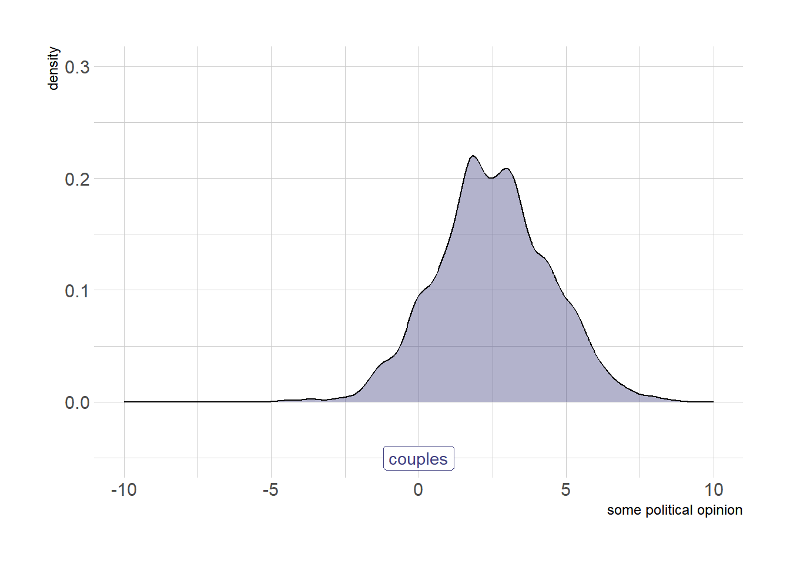
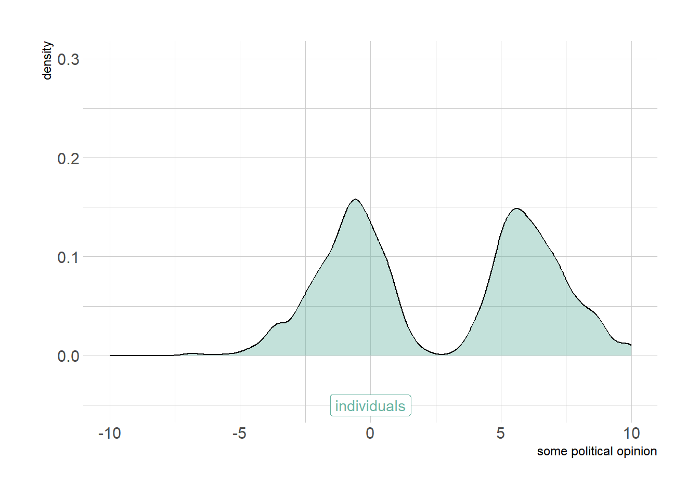
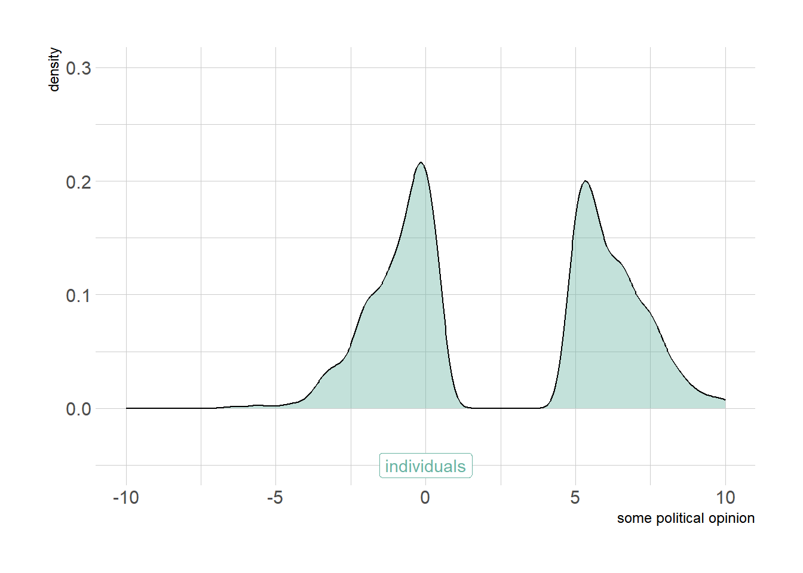

# (PART) DYADS {-} 

# Theory

<!---we need to include this somewhere as general r script---> 


The smallest possible social network is a network between two persons (or, more precisely, between two social agents). A network between two persons is also called a dyad. In the clip below I will introduce you to the the main concepts involved in a dyad. Naturally, the same concepts also play a role in larger social networks. 


<iframe src="https://player.vimeo.com/video/452233600" width="640" height="360" frameborder="0" allow="autoplay; fullscreen; picture-in-picture" allowfullscreen></iframe>

For slides, see [here](dyads.pdf).
  
>
After having watched the video you should be able to:  
>
>- give a definition of a dyad.\
- explain what is meant by time-varying and time-constant actor attributes and dyad attributes.\
- explain that relations between ego and alter can be classified  based on whether relations are directed or undirected and on the level of measurement of the relation (i.e. nominal, ordinal, interval, ratio).\
- be familiar with al the synonyms for networks, agents and relations.\
- provide examples of dyads, and the relations between ego and alter.\

## Network structures (DYAD) {#reciprocity}  

Dyads are the smallest possible networks. For undirected relations there are two possible dyad configurations. See Figure \@ref(fig:ud).


<div class="figure">

<p class="caption">(\#fig:ud)undirected dyad configurations</p>
</div>


There are four options for directed dyads. See Figure \@ref(fig:dd). However, two configurations (the two in the middle row) are *isomorphic*. We cannot distinguish them in the network. From now on, I won't draw all isomorphs.

<div class="figure">

<p class="caption">(\#fig:dd)undirected dyad configurations</p>
</div>

When there is a tie from *i* to *j* and vice versa, we call this a reciprocated dyad. I hope you see that the reasons for me to start or break a relation with you (e.g. a helping relation) if you don't have a relation with me, may be different from the reasons for me to start or break a relation with you if you already have a relation with me. 

If we consider two types of undirected relations simultaneously, we have three distinct configurations. See Figure \@ref(fig:mud).

<div class="figure">

<p class="caption">(\#fig:mud)multiplex, undirected dyad configurations</p>
</div>

Explanations for multiplex configuration are multicomplex. A first step to consider is whether there is a necessary, or likely, order in the relations. To illustrate. I first became friends with my wife and afterwards she became my wife. Although this situations hopefully holds true for most married couples, it is not logically necessary of course. A second step is to consider the valence of the relations. Are they positive or negative. It is not likely that I would name my friend a foe and vice versa but there is a thin line between love and hate. Feelings of hate and love for the same person may even coexist. Ever heard someone saying: "I can't live with him/her but I can't live without him/her either"?.

Lets have a look at the possible configuration of directed dyads with two types of relations (Figure \@ref(fig:mdd))

<div class="figure">

<p class="caption">(\#fig:mdd)multiplex, undirected dyad configurations</p>
</div>
Can you come up with an explanation for each configuration? Well you should if you study multiple type of relations between (two) social agents! But let us start with a single undirected tie: marriage. 

## Causes of dyads {#mm}

An important research topic within sociology is assortative mating (or intermarriage) [see: @kalmijn1998; @schwartz2013; @blossfeld2009]. Scholars in this field try to explain two things:  

1. At the meso-level (i.e. the couple): why two people in an exclusive relationship like marriage (or cohabition or best friends) are more similar to one another with respect to defining characteristics (e.g. social class, ethnicity) than two random persons.  
2. At the macro-level (i.e. society): why societies differ in the degree of assortative mating.  
\  

Assortative mating is a special case of **homophily**. Assortative mating is an important topic within sociology because it is, next to social mobility, an important indicator of the **openness of society**.\  

**Selection** and **influence** processes are important reasons why partners (ego and alter) within a dyad are more similar than two random persons. We may prefer to marry someone who is similar to us on key social dimensions, share our attitudes and opinions and show similar behavior. Once married we may influence each other and assimilate to one another. A third reason why we observe homophily within couples is that partners are likely to have shared and will share the **same social context**. With shared social context we mean the shared social and physical environment and shared life experiences. The environment pre-marriage may in part determine characteristics of the pool of potential marriage partners (i.e. the choice set). For example when neighborhoods and schools are segregated along ethnic and educational division lines, the potential marriage partners we meet are likely to be more similar to us than a random person in society at large. The shared social environment post-marriage may exert a similar influence on both partners, consider for example economic recession's effects on different geographic regions. This may impact the job opportunities for both partners similarly (assuming they live in the same house). An example of shared life experiences, would be having children. 

> Please note that causes and consequences of homophily are closely related. A shared social context and partner preferences may predict (or cause) homophily within dyads. But once a dyad is formed, a consequence of this relationship may be that partnes become more similar over time, as a result of a shared environment, influence and (de)selection processes. If you want to disentangle these processes, it is necessarry to have information on the degree of homophily between potential marriage partners would they be randomly assigned to one another, the degree of homophily at the beginning of the union, the degree of homophily within couples after a specific time period.  

<!---fill in the blanks--->


> **homophily**
>
> :   Homophily is the principle that a contact between similar people occurs at a
higher rate than among dissimilar people [@mcpherson2001].  
> You will also come across the terms:  
- baseline or structural homophily: this is the degree of homophily we observe simply as a result of the composition of the total choice set, the people with whom we can, in principle, form a relationship.  
- inbreeding homophily: this is the degree of homophily we observe over and above the level of baseline homophily. This may be caused by taste homophily and differences in resources and restrictions (other than set by the total choice set).  
- taste or choice homophily: the extent of homophily induced by personal preferences.\ 

> **openness of society**
>
> :   The openness of society refers to the level of inequality of opportunities within society. The social problem of inequality consists of two sub-problems. The first refers to inequality in outcomes: the unequal distribution of resources (e.g. economic, cultural, social, knowledge, power). The second refers to inquality in opportunities, the association between specific individual or group charactersitics and the likelihood to obtain these resources. Here the opennes of society is clearly linked to the second sub-problem. Where in questions of (inter-generational) social mobility the association between social position of parents and the social position of children is assessed, within the literature on intermarriage the association between the social positions of the two spouses is assessed. Both questions or associations will tell you something about the strenght of class/social position boundaries.  


<!--- do we want to move the GTF to the intro? ---> 

### General Theoretical Framework {#GTF}

In this section, I would like to introduce a General Theoretical Framework (or micro-macro model) which can be used to explain more or less any social phenomena you are interested in. The GTF can thus also be used to explain the emergence of social networks, and thus also to explain the emergence of dyads, and thus also to explain educational intermarriage. 

<iframe src="https://player.vimeo.com/video/453716704" width="640" height="360" frameborder="0" allow="autoplay; fullscreen; picture-in-picture" allowfullscreen></iframe>

For slides, see [here](multilevel-framework.pdf).

>
After having watched the video and after heaving read this page, you should be able to:  
>
- Understand and summarize the building blocks of the multi-level framework which can be used to explain the emergence of social networks.  
  - macro-level (independent) variable(s)  
    - social conditions  
    - restrictions  
  - bridge assumptions (also called social context effects)  
  - Theory of Action  
    - preferences  
    - resources  
    - choice-set  
    - choice-input  
    - choice-output  
  - Transformation rules (also called aggregation mechanism)  
    - social interdependencies  
    - unintended/unforeseen consequences of micro-level behavior  
  - macro-level (dependent) variable
- Provide examples of all building blocks in the context of explaining the emergence of dyads 

For more background reading on the multi-level framework (aka "Coleman-boat", "Coleman-bathtub", "micro-macro models") [see: @coleman1994; @raub2011, especially paragraph 4.4]. 

<span style='color: red;'>**The GTF is a framework, not a theory from which you can deduce hypotheses.**</span> Before we can do that, we need to fill in the blanks. That is, we need to make the social contexts (bridge assumptions) explicit. We need a Theory of Action. We need to think of the interdependencies and how they impact the aggregation mechanism.
   
So, let's get started...
  
### Social context effects  

**Characteristics of the social context** in which people are embedded (the marco- and meso-level) may impact people's preferences and resources.  
Example 1: The level of economic inequality impacts how financial resources are unequally distributed across educational groups within society.  
Hypo1: In countries with more wealth inequality, the difference between educational groups in economic resources is larger.  
Example 2: Societal norms may impact your own views and opinions and thus preferences.  
Hypo2: In countries with more equal gender norms, men's (women's) preferences for a partner with a higher education are stronger (weaker).

### The special role of restrictions

**Restrictions** or constraints also refer to macro-level characteristics but restrictions do not directly impact preferences and resources (i.e. choice input) but instead influence, or *constrain* how these preferences and resources lead to choice-output; we have a constrained choice model. Restrictions - in studies on the emergence of social networks - impact the *choice-set*, the relevant choice-options that a person has.  
If I would like to marry a grizzly bear but if there are no grizzly bears around which I can marry, I cannot act upon my preferences (commonly the example is about Eskimos but that may be considered more politically incorrect). This is called a *structural restriction*. A more realistic example would be the distribution of educational degrees within society, which depend on educational expansion and inequality of educational opportunities.  
Next, to structural restrictions we may also have *normative restrictions*, the formal and informal rules of institutions. A formal normative restriction would be a *law* that forbids me to marry a grizzly bear. An informal normative restriction would be a *social norm*, e.g. my parents who disapprove of my preference to marry a grizzly bear.  
Please note that social norms may thus impact my preferences directly (a social context effect) and indirectly (act as a restriction).  
Example1: Preferences for a partner with a similar educational level are more likely to lead to educational homogamy, if educational degrees are more evenly distributed across men and women. 


<span style='color: red;'>In the literature on resources you will see that restrictions are also commonly understood as the absence of resources. I am a stubborn scientists and DO NOT FOLLOW THIS TERMINOLOGY and neither should you.</span> 


### Theory of Action   

Persons have **preferences** for a partner with a specific educational-level. Commonly, people prefer higher-educated partners (because of instrumental motives) and people have homomphilic preferences. Preferences may differ between persons with different educational levels and between men and women.  
Persons also have **resources** (i.e. economic, cultural, cognitive, social resources) that may affect the search behavior of persons.   
Example1: persons with more economic resources have more options to meet different people and may thus select a partner from a larger choice-set.  
Hypo1: persons with more economic resources are more likely to marry a partner that meet their preferences, i.e. a more similar partner.  

We would like to apply the GTF to explain the emergence of social networks. The networks we observe are the result of people making and breaking social relations. Consequently, a theory of action to explain decision about social relations should explain not only decisions about making new relations (i.e. **selection**) but also about decision whether or not to maintain or break existing relations (i.e. **deselection**). When we talk about selection processess, we implicitly mean both selection and deselection.\   
Concretely, if we want to explain the degree of intermarriage within society, we need to take into account both who is marrying whom *and* who is divorcing whom! Consider the following example. For some people the saying 'opposite attracts' may hold true and they may be unaware of or ignore the social norm not to intermarry. But once married the couple may face unanticipated sanctions of violating the social norm, they may be ostracized. Being faced with this unanticipated consequence of their marriage decision, the couple may subsequently decide to divorce. In this example, the social norm thus not influences the selection process (more precisely, does not moderate the impact of preferences on marriage decisions) but it does influence the deselection process.\  

>Our Theory of Action assumes a cost benefit evaluation of some sort, in line with Rational Action Theory. However, social scientists' view on human's rationality is different than the view of classical economists. Social scientists speak of restricted or bounded rationality (i.e. a weak rationality assumption); people are not always able to have or process all relevant information to make accurate and correct cost-benefit evaluations. We make questimates about the costs involved in our decision and about the likelihood that our behavior will yield the desired goal. Within sociology, actor's goals are not only economic, monatory goals. Actor's goals can be physical and social goals (i.e. health, happiness, avoidance of downwards mobility). For a nice paper on Rational Action Theory for Sociologists, see @goldthorpe1998.     

### Transformation rules  

We now almost have all ingredients to explain (or predict) the degree of intermarriage in society. We 'only' need the aggregation mechanisms: the micro-to-macro link. We thereby need to know the macro-level (intended and unintended) consequences of individual actions. That is, we need to know how the marriage market functions.\   

Let us assume the following: 

- Someone takes the initiative. This is determined by chance. 
- The initial choice-set is formed by 5 random partners of the opposite sex (no assumptions about search behavior). Possible partners who are already married are removed from the initial choice-set. The possible partners that remain constitute the (final) choice set.  
- Persons may prefer a partner with a higher education. These preferences may differ between educational levels and between the sexes.
- Persons choose a partner from their choice set (not marrying is not an option). Possible partners with a higher education have a larger chance to be chosen. How important a partner's education is, depends on the preference of the one taking the initiative. 
- The persons who is being proposed to always accepts. 
- We observe no divorces. 
- Resources do not play any role (e.g the higher educated do not have a larger choice set)
- Educational degrees are either 'high' or 'low'. 

With the above marriage-market model we have a limited number of ingredients that impact the observed degree of educational intermarriage within society:  

- gender composition within society  
- the distribution of educational degrees in  society  
- preferences  
- the number of marriage proposals

I hope you see that marriage choices are interdependent. If I marry person A, you no longer can marry person A. 
These interdependencies make it difficult to predict the macro-level dependent variable, degree of educational homogamy.\ 

Given the market model above, can you predict who will marry whom?  

### Agent Based Modelling  

Well, I can not. You may be a mathematical wizard and able to find a closed solution by some algebra. Another option could be to to make a simplified model and try to simulate the macro-level outcome based purely on our micro-level theory of action and the rules of the marriage market. We call this Agent-Based-Modelling [see e.g. @macal2016]. I programmed a simply ABM based on the above. There are some parameters in the model which you can change. 

Suppose...  

1. **%\_men=50** :  We have an equal gender distribution in society (50% men, 50% women; range: 1-99).    
2. **%\_men_EducHigh=50**: 50% of our male population is higher educated and 50% is lower educated (range: 1-99).  
3. **%\_women_EducHigh=50**: 50% of our female population is higher educated and 50% is lower educated (range: 1-99).  
4. **pref_men_EH=0**: Higher educated men do not have any preference with respect to the educational level of their partner. (range: 0-10)
4. **pref_men_EL=0**: Lower educated men do not have any preference with respect to the educational level of their partner. (range: 0-10)
4. **pref_women_EH=0**: Higher educated women do not have any preference with respect to the educational level of their partner. (range: 0-10)
4. **pref_women_EL=0**: Lower educated women do not have any preference with respect to the educational level of their partner. (range: 0-10)

Can you make a guess about the resulting degree of eductional homogamy?? Press <span style='color: red;'>Update!</span> to see if you were correct. 
Play around with the (agent-based simulation) model below.  

<iframe src="https://jtolsma.shinyapps.io/marriagemarket/" style="width:100%; height: 50vw;"> </iframe>

Go to app [here](https://jtolsma.shinyapps.io/marriagemarket/)


## Consequences of dyads {#dt}

Assortative mating, or more generally mating, has consequences at different levels. At the individual- or spouse-level, it may impact, for example, political opinions, happiness and working hours, and not necessarily in a similar way for both spouses. At the meso- or dyad-level we may think of time spend together on culture consumption, divorce rates, number of children, household income, total working hours. I hope you see that these dyad-characteristics may be grouped by how they are measured, namely at the dyad-level itself (yes/no divorce, number of children) or at the ego/alter-level and aggregated to the dyad-level (e.g. total working hours of the couple is the sum of the working hours of both individual partners, culture consumption is the consumed culture of both partners (alone and together)). But with both type of dyad-level outcomes, it should be clear that they are the consequence of interdependent actions of both partners (e.g. commonly both partners decide on whether to have and make children). At the macro- or society-level, we can think of the degree of assortative mating in society. But assortative mating may also have other macro-level consequences, such as inequality, segregation and polarization.  

### Homophily  

Let us focus on how assortative mating may impact homophily, or more precisely similarity between spouses. Thus how time-varying characteristics of the spouses (e.g. political opinions or behaviors) become more or less similar over time as a result of the marriage. 

Just a quick recap, homophily within couples may be the result of: 

- **selection**  
- **shared context** 
- **(dyadic) influence**  

Hopefully it is clear that it is now time to focus on the role of influence. But what do we mean with 'influence'? Let's read the following quote. 

<p class= "quote"> 
People influence one another, and as the importance and immediacy of a group or individual increases, this influence becomes stronger (Latané, 1981). Forces of influence are especially strong within romantic relationships because these relationships are important, are predicated on mutual acceptance, and involve frequent exposure to the habits of one's partner." [@bartel2017romantic]  
</p> 

I would say this a quite naive conceptualisation of **influence**. It is implicitly assumed that partners will match their opinions/behaviors. Thus influence here is convergence. But why should partners' characteristics converge over time, why would homophily (i.e. similarity) increase? And, it still does not become clear what the 'forces of influence' are. 

Let us make a distinction between:  

- positive influence: alters become more similar to each other over time  
- negative influence: alters become more distinct to each other over time  
- positive feedback influence: characteristics develop in same direction over time  
  
Now suppose these influence processes are the only reasons why alters change (i.e. the *ceteris paribus* condition). How could dyad similarity develop over time? 

<div class="figure">

<p class="caption">(\#fig:pi)Positive influence</p>
</div>

With positive influence (Figure \@ref(fig:pi)) actors will become more similar to each other over time. 

<div class="figure">

<p class="caption">(\#fig:ni)Negative influence</p>
</div>

With negative influence (Figure \@ref(fig:ni)) actors will become more distinct to each other over time. 


<div class="figure">

<p class="caption">(\#fig:pfi)Positive feedback influence</p>
</div>

With positive feedback (Figure \@ref(fig:pfi)) actors will develop in the same direction. 
Naturally, we need to be aware that other mechanisms may also explain these trends. For example, with respect the figure above \@ref(fig:pfi), a shared environment may also explain a shared trend. More concretely, when a couple gets children, both spouses may become happier over time. 

Finally, you could think of a situation in which one of the spouses changes, for some (exogenous) reason or another, his/her opinion. The other spouse is influenced by this opinion-change and moves in the same direction. See Figure \@ref(fig:shocks). 

<div class="figure">

<p class="caption">(\#fig:shocks)Opinion development over time: parallel trend with shocks.</p>
</div>
How should we label this type of influence? The 'limited positive feedback mechanism'?  

### Influence mechanisms  {#influence}

There are several 'forces of positive influence mechanisms': 

- Information: we may exchange new effective information and arguments with our alters.  
- Persuasion (and dissuasion): we may convince, force or pressure our alters to become similar to us.  
- Contagion: this can be taken quite literally, like how the flu spreads but also more metaphorically like how (health) behaviors like drinking, smoking, sporting spread (because our alters increase the opportunities for these behaviors).  
- Assimilation: we may mimic our alters because of a psychological need for similarity, because we think this will be good for our identity / social status, etc.    

<span style='color: red;'>The literature is not very clear and consistent about different type of incluence processes and which influence mechanisms are at play. You will thus also see that authors use socialisation when talking about (positive) influence processes. </span> 

There are several 'forces of negative influence mechanisms': 

- Information: We may exchange new counter-effective information and arguments with our alters. This would especially become relevant whey we don't like or belief the source of information and arguments.  
- Persuasion (and dissuasion): we may convince, force or pressure our alters to become dissimilar to us.  
- Polarisation: we may distance ourselves from our alters because of a psychological need for distinctiveness. This would especially become relevant when we are already distinct on key social dimensions.  

There are several 'forces of positive feedback influence mechanisms': 

- Confirmation: information and arguments are repeated and existing opinions and behaviors of both alters reinforced.  
- Competition: we may have a psychological need to be better/higher/more than our alter.  

<!--- introduce echo chambers here??---> 
The crucial difference between the positive feedback mechanisms and the positive influence mechanisms are that as a result of the former homophily between the alters does not necessarily change. Note that positive feedback could entail increasing and decreasing the opinion or behavior.    

You could also think of influence as being either **active** or **passive**. Thus, is ego trying to actively convince alter or 'passively' leading by example? The alter could then either **accept** or **reject** the influence push of ego. We do not always listen to our partner. 


<html>
<body>
</iframe>
<a id='LuHtIfAxRu5Ma_5cwLSW1g' class='gie-single' href='http://www.gettyimages.nl/detail/153360657' target='_blank' style='color:#a7a7a7;text-decoration:none;font-weight:normal !important;border:none;display:inline-block;'>Embed from Getty Images</a><script>window.gie=window.gie||function(c){(gie.q=gie.q||[]).push(c)};gie(function(){gie.widgets.load({id:'LuHtIfAxRu5Ma_5cwLSW1g',sig:'1lfLuUoX5Pth1-d8wRyeRSQhCC9Ov2SK_l9qlSdR5X8=',w:'507px',h:'338px',items:'153360657',caption: true ,tld:'nl',is360: false })});</script><script src='//embed-cdn.gettyimages.com/widgets.js' charset='utf-8' async></script>
</body>
</html>


### Polarization  

Influence processes that take place within couples may not only explain (in part) homophily or similarity within couples but as a consequence of this also polarization within society.  

Let us define polarization. 

> **Polarization** 
>
> :   Polarization is a social problem and a society is said to be polarized when (sizeable) (and clearly distinguishable) opinion groups in society hold (ever more) opposing, extreme opinions (or attitudes and behavior).

We thus observe polarization in society when (sizeable) (and clearly distinguishable) opinion groups hold (ever more) opposing, extreme (political) opinions. A nice paper in which the many 'senses of polarization' are discussed in more detailed is @Bramson2017.  
  
Polarization in society will be larger when:  

- similarity within each group increases (higher levels of within group homogeneity);  
- dissimilarity between groups increases (higher levels of between group heterogeneity);  
- when the relative sizes of opposing groups in society increases;  
- when group sizes of the (most) opposing groups are more a like;  
- when the opinion group identity becomes a more important part of one's social identity;  
- when ingroup love and/or outgroup hate increases. 

Opinion group membership may overlap with memberships of groups based on other key social dimensions (e.g. sex, ethnicity, educational level, etc.). When this is the case, we could speak of **alignment**. A result of alignment is that opinion groups become more clearly distinguishable in society. Subsequently, the stronger the alignment the more likely it is that opinion group identity becomes salient and that ingroup love and outgroup hate increases.  

Let us take as example political polarization and start with a situation in which some political opinion (ranging from -10 to 10) is distributed as follows within society.  

<!--- need to improve use opinion from 1 completely disagree to 10 completely agree. thus limited set of ordered categories ---> 


<div class="figure">

<p class="caption">(\#fig:unnamed-chunk-2)Distribution of opinions within population</p>
</div>

Is this society polarized?  There are many operationalizations of polarization [for pointers see: @esteban1994; @R-agrmt]. Since we are focusing on the consequences of homophily (or similarity) within couples in this chapter and because you are already familiar with variance (discussed in Appendix \@ref(variance)), we will define polarization as the variance in the distribution of the pairwise opinion differences ($d_{ij}$) across all possible dyads ($N(N-1)$) [@flache2011]: 

$$P=\frac{1}{N(N-1)} \Sigma_{ij \in N,i \neq j} (d_{ij} - \bar{d_{ij}} )^2 $$

or, 

$$ P=VAR(d_{ij})$$

Polarization scores will lie within the range [0, 1), where $P=0$
corresponds with full consensus in the population and the maximum when $P$ approaches 1 will be observed in a population that is divided equally between the extreme opinions.  
Let us calculate the degree of polarization. First we need to define a function which does that for us.^[Please note that you can either input a theoretical maximum dissimilarity score or that this score is based on the observed range of the opinion in question (default)] 


```r
fpol <- function(opinions, maxdif = NULL) {
    N <- length(opinions)
    egos <- matrix(opinions, nrow = N, ncol = N, byrow = TRUE)
    alters <- t(egos)
    difference <- if (is.null(maxdif)) {
        abs(egos - alters)/(range(opinions)[2] - range(opinions)[1])
    } else {
        abs(egos - alters)/maxdif
    }
    diag(difference) <- NA
    pol <- var(as.numeric(difference), na.rm = T)
    return(pol)
}
```

It turns out the polarization score of the above society is `fpol(opinions, 20)` 0.0080761. 

But these individuals want to get married. Who do they pick? Well, we discussed the marriage market here \@ref(mm). 


Let us assume that the opinion did not yet change but that bachelors prefer, to some extent, a partner with a similar political opinion. What does the political opinion distribution look like for the mean political opinion of the couples. 


<div class="figure">

<p class="caption">(\#fig:unnamed-chunk-5)Distribution of opinions within couples after selective marriage</p>
</div>

Well, the preference for a partner with similar political opinions was definitely not strong enough to substantially change the opinion distribution.[^sim] The level of polarization (between couples) is: 0.0066944 

[^sim]: Naturally, this will depend on how strong we simulate this preference to be. 

What happens with these couples? They share a common context. What is a 'common context'?  

Some examples:  

- Shared life experiences:  
  - having kids  
  - poverty  
- Shared environment:
  - pollution
  - housing
  - poverty 

Suppose these life events are more likely for some couples than others. More specifically, assume that the occurrence of life events is associated with the mean political opinion of the couple (at time T). The life event consequently influences the mean political opinion of the couple (at time T+1). 


<div class="figure">

<p class="caption">(\#fig:unnamed-chunk-7)Distribution of opinions within couples after selective marriage and shared life events</p>
</div>

We now clearly observe emerging polarization between couples. But this is not yet reflected in our measure of polarization: 0.0268526. Probably because the opposing opinions are not close to the extremes (set at -10 and 10). Take home message: don't always 'trust' your numbers but really 'look' at your data as well.   
Note that if we go back to the individual-level again, emerging polarization is also apparent but less clearly so. 


Here the level of polarization is: 0.0267069.

<div class="figure">

<p class="caption">(\#fig:unnamed-chunk-9)Distribution of opinions within population after selective marriage and shared life events</p>
</div>

Polarization between individuals will further increase when partners (positively) influence each other. 

Why would partners influence each other? Well, we discussed influence here \@ref(influence). So what happens after positive influence? 


<div class="figure">

<p class="caption">(\#fig:unnamed-chunk-11)Distribution of opinions within population after selective marriage, shared life events and positive influence</p>
</div>


We already observe clear 'opinion groups'. The level of polarization is now: 0.0268493. These groups may start to further move apart due to two mechanisms: (1) shared context at the dyad-level; (2) by positive feedback influence.


<div class="figure">

<p class="caption">(\#fig:unnamed-chunk-13)Distribution of opinions within population after selective marriage, shared life events, positive influence and feedback influence</p>
</div>
Now, the society is clearly starting to polarize. Yes! Suprisingly, although the score on our polarization measure is starting to increase (to: 0.0944597), the degree of polarization is still far off from 1. 


Suppose instead that the theoretical range of the opinion would have been $[-5,10]$. Then our polarization score would have been a massive: 0.1655218. 

And on that bombshell, thanks for reading!! 

---  

## Assignment  

1. Formulate a hypothesis on how cultural modernisation (e.g. more equal gender norms) may have affected assortative mating. Please focus on the impact of cultural modernisation on ‘preferences’. Motivate your answer.  
2. Formulate a hypothesis on how continuing educational expansion (which has been more pronounced for women than for men) may have affected patterns of homogamy. Please focus on the impact of educational expansion on ‘the structure of search’. Motivate your answer.  
3. This question is about intermarriage.  
  A. Why would people prefer to marry someone who is similar?  
  B. Why would people prefer to marry someone who is dissimilar?  
  C. To what extent do you expect these reasons – mentioned in 3A and 3B to hold with respect to online relations (e.g. ‘friend’ relations on Facebook or ‘follower’ relations on Twitter)? Thus, with online relations I do not mean ‘romantic’ relations but simply forming a tie (e.g. befriending someone on Facebook; \@-mention someone on twitter; etc.). Please motivate your answer.  
4. What does @kalmijn1998 mean with the by-product hypothesis?  
5. What does @schwartz2013 mean with the economic inequality hypothesis and what role do returns to schooling play in this idea/hypothesis?  
6. Please give at least two reasons why increased assortative mating could increase economic inequality. See also @gonalons2017. 
7. Read @verbakel2009 and answer the following questions:  
  A. What social problem(s) do the authors address?  
  B. How do the authors deal with interdependencies?  
  C. What macro-micro and micro-macro links are discussed? 
8. Have a look at all the papers citing the paper of @verbakel2009. How did the social-network perspective in the field addressing the same (or similar) social problems evolve?  

---  


