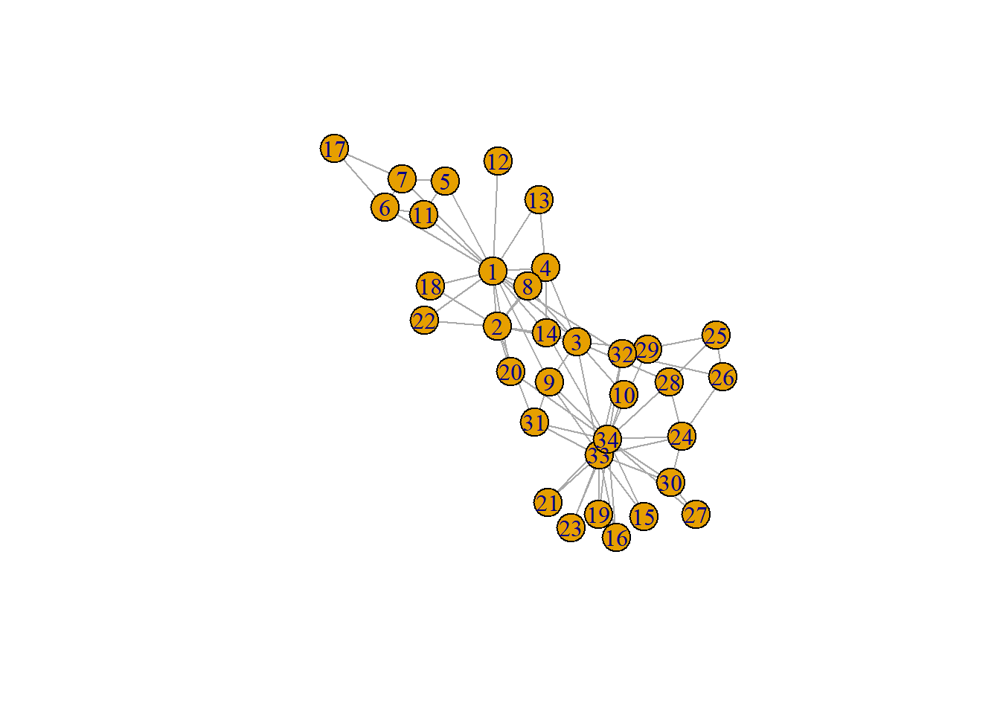
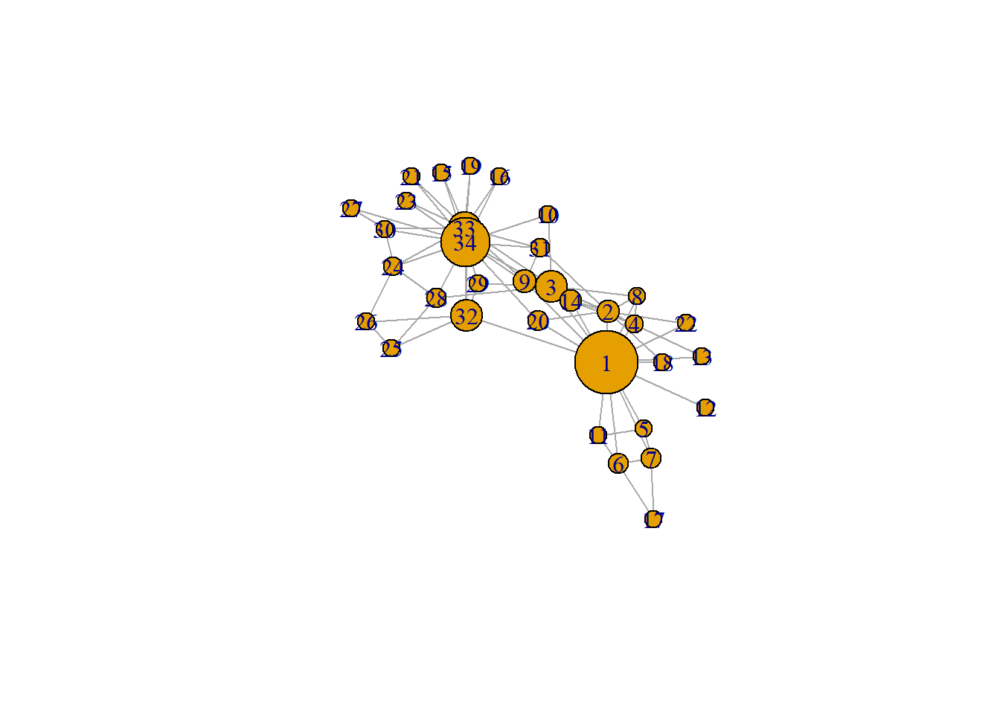
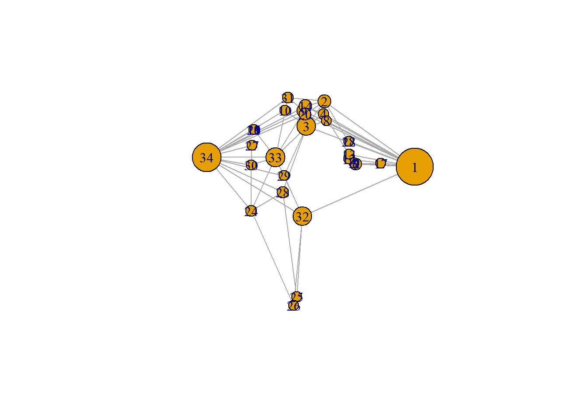

# (PART) Network Visualization  {-} 

# Network Visualization     


```r
library(knitr)
opts_chunk$set(tidy.opts=list(width.cutoff=100),tidy=TRUE, warning = FALSE, message = FALSE,comment = "#>" , attr.source = ".numberLines") 
options(width = 100)
```


<style>

.button1 {
  background-color: #f44336; /* Red */ 
  border: none;
  color: white;
  padding: 15px 32px;
  text-align: center;
  text-decoration: none;
  display: inline-block;
  font-size: 16px;
  margin: 4px 2px;
  cursor: pointer;
}

.button1:hover {
  box-shadow: 0 12px 16px 0 rgba(0,0,0,0.24), 0 17px 50px 0 rgba(0,0,0,0.19);
}

.button1 {border-radius: 12px;}

.button1 {width: 100%;}
</style>


<script>
function myFunction() {

            var btn = document.getElementById("myButton");
            //to make it fancier
            if (btn.value == "Click to hide code") {
                btn.value = "Click to show code";
                btn.innerHTML = "Click to show code";
            }
            else {
                btn.value = "Click to hide code";
                btn.innerHTML = "Click to hide code";
            }
            //this is what you're looking for
            var x = document.getElementById("myDIV");
            if (x.style.display === "none") {
                x.style.display = "block";
            } else {
                x.style.display = "none";
            }
        }

</script>


Visualizations of social networks are cool. I am often impressed if I see them in papers. They seem to signal that the authors are technically savvy.  
If you know me a little bit you will also know that I think that the importance of a good description of your data cannot be downplayed: describing before (and over) explanation; simplicity (e.g. univariate or bivatiate statistics) trumps complexity. What is a better 'description' of your network data than a graphical summary of your network? What could I possibly have against network visualizations?    

Unfortunately, more often than not the story behind the (cool, dynamic, interactive) network picture is not clear. I do not see selection and influence processes. We have have to guess what the node and tie attributes are. And, importantly, typical network structures remain elusive. 

A good example of a bad network visualization is Smallworld, introduced in section @\ref(sn). 

<iframe src="smallworld.html" width="500" height="500" style="border: none;"></iframe>

Paradoxically, one of the reasons why oftentimes it is not worth the time to look at network visualisations is because scholars did not think it was worth the time to look at the data. 

The take home message of this chapter is that before you can make a successful network visualization you need to answer the following question: 

* **What story do I want my network visualization to tell? **

The answer to this question depends on:  
- your research question  
- descriptive statistics of your data  
- how preliminary network plots are able to convey your message. 

In this chapter we will take on three case studies:  
1. Smallworld: Should tell the story that a typical smallworld network has a relatively low density, high level of clustering and low average path length.  
2. Twittersphere in the Dutch House of Parliament: should tell the story that twitter networks are segregated along party affiliation.  
3. Co-author networks among sociology staff of Radboud University Nijmegen: 

But before we take on these case studies, we will start with a classical example: Zachary's karate club [@zachary1977information;, also discussed in @kadushin2012understanding].

> Where for our analyses we heavily relay on the R package @lavaan2012 and @R-RSiena, for network description and visualisation we will mainly use @R-igraph 
---  

## Zachary's karate club

As stated above, we will mainly rely on the `igraph` package. This means we have to make an igraph graph object before we can start doing anything. Luckily `igraph` comes with Zachary's network build-in. But don't worry, we will start from scratch later on. Let us have a first look at the data. 


```{.r .numberLines}
require(igraph)
g <- make_graph("Zachary")
plot(g)
```



```{.r .numberLines}
gmat <- as_adjacency_matrix(g, type = "both", sparse = FALSE)
```

### Descriptive statistics

#### Size

```{.r .numberLines}
# number of nodes
vcount(g)
```

```
#> [1] 34
```

```{.r .numberLines}
# number of edges
ecount(g)
```

```
#> [1] 78
```

#### node-level

We discussed several network structure in section \@ref(structure-1). Decide for yourself at which structures you want to look at. I give three examples below. 

#### degree {-}

```{.r .numberLines}
degree(g)
```

```
#>  [1] 16  9 10  6  3  4  4  4  5  2  3  1  2  5  2  2  2  2  2  3  2  2  2  5  3  3  2  4  3  4  4  6
#> [33] 12 17
```

```{.r .numberLines}
# hist(table(degree(g)), xlab='indegree', main= 'Histogram of indegree')
```

#### transitivity {-}

```{.r .numberLines}
# be aware that directed graphs are considered as undirected. but g is undirected.
transitivity(g, type = c("localundirected"), isolates = c("NaN", "zero"))
```

```
#>  [1] 0.1500000 0.3333333 0.2444444 0.6666667 0.6666667 0.5000000 0.5000000 1.0000000 0.5000000
#> [10] 0.0000000 0.6666667       NaN 1.0000000 0.6000000 1.0000000 1.0000000 1.0000000 1.0000000
#> [19] 1.0000000 0.3333333 1.0000000 1.0000000 1.0000000 0.4000000 0.3333333 0.3333333 1.0000000
#> [28] 0.1666667 0.3333333 0.6666667 0.5000000 0.2000000 0.1969697 0.1102941
```

#### betweenness {-}


```{.r .numberLines}
igraph::betweenness(g, directed = FALSE)
```

```
#>  [1] 231.0714286  28.4785714  75.8507937   6.2880952   0.3333333  15.8333333  15.8333333   0.0000000
#>  [9]  29.5293651   0.4476190   0.3333333   0.0000000   0.0000000  24.2158730   0.0000000   0.0000000
#> [17]   0.0000000   0.0000000   0.0000000  17.1468254   0.0000000   0.0000000   0.0000000   9.3000000
#> [25]   1.1666667   2.0277778   0.0000000  11.7920635   0.9476190   1.5428571   7.6095238  73.0095238
#> [33]  76.6904762 160.5515873
```

### dyad-census

```{.r .numberLines}
dyad.census(g)
```

```
#> $mut
#> [1] 78
#> 
#> $asym
#> [1] 0
#> 
#> $null
#> [1] 483
```

### triad-census


```{.r .numberLines}
igraph::triad.census(g)
```

```
#>  [1] 3971    0 1575    0    0    0    0    0    0    0  393    0    0    0    0   45
```

```{.r .numberLines}
sna::triad.census(gmat)
```

```
#>       003 012  102 021D 021U 021C 111D 111U 030T 030C 201 120D 120U 120C 210 300
#> [1,] 3971   0 1575    0    0    0    0    0    0    0 393    0    0    0   0  45
```

Based on the above triad.census, please calculate the global transitivity of the network and check your answer with `igraph` or `sna`.  


<button class=button1 onclick="myFunction()" id="myButton" value="Click To Open Instructions">Only click button after 5 minutes!</button>

<div style="display:none;" id="myDIV">


```{.r .numberLines}
igraph::transitivity(g, type = "global")
```

```
#> [1] 0.2556818
```

```{.r .numberLines}
sna::gtrans(gmat)
```

```
#> [1] 0.2556818
```

```{.r .numberLines}
triad_g <- data.frame(sna::triad.census(gmat))

transitivity_g <- (3 * triad_g$X300)/(triad_g$X201 + 3 * triad_g$X300)
transitivity_g
```

```
#> [1] 0.2556818
```

</div>

Even if you did not read-up on Zachary's Karate club [@zachary1977information; @girvan2002community] our initial plot and the above descriptive network statistics start to tell a story. There are two very central nodes (based on degree and betweenness) but their local transitivity index is relatively low (compared to other nodes). Are these two nodes connected? Well `gmat[1,34]` returns: 0. Thus NO! 

### Network visualisation

Let's make size proportional to betweenness score:


```{.r .numberLines}
plot(g)
```



```{.r .numberLines}
# let's make size proportional to betweenness score: changing V
V(g)$size = betweenness(g, normalized = T, directed = FALSE) * 60 + 10  #after some trial and error
plot(g, mode = "undirected")
```


It would be nice if we could place the nodes 1 and 34 further apart. 
Preferably based on some nice algoritm. After some browsing in the igraph manual, I came up with this. 

```{.r .numberLines}
set.seed(2345)
l <- layout_with_mds(g)  #https://igraph.org/r/doc/layout_with_mds.html
plot(g, layout = l)
```


It does more or less what we want, but it would be great to place nodes 1 and 34 even further apart. 


```{.r .numberLines}
l
l[1, 1] <- 4
l[34, 1] <- -3.5
plot(g, layout = l)
```



```
#>               [,1]         [,2]
#>  [1,]  1.070931935 -0.172458113
#>  [2,]  0.732844464  0.754023309
#>  [3,]  0.100582299  0.397693607
#>  [4,]  0.708246655  0.570205545
#>  [5,]  1.816293170 -0.120778206
#>  [6,]  1.881329566 -0.135518854
#>  [7,]  1.881329566 -0.135518854
#>  [8,]  0.812606714  0.472619437
#>  [9,] -0.003769996  0.615513628
#> [10,] -0.685680315  0.621065149
#> [11,]  1.816293170 -0.120778206
#> [12,]  1.621247830 -0.065820692
#> [13,]  1.637845123  0.001789972
#> [14,]  0.067317230  0.681421148
#> [15,] -1.796316404  0.351417630
#> [16,] -1.796316404  0.351417630
#> [17,]  2.775260452 -0.124317652
#> [18,]  1.616210024  0.182510197
#> [19,] -1.796316404  0.351417630
#> [20,]  0.048362858  0.566654982
#> [21,] -1.796316404  0.351417630
#> [22,]  1.616210024  0.182510197
#> [23,] -1.796316404  0.351417630
#> [24,] -1.891240567 -0.799574907
#> [25,] -0.258345165 -2.006346563
#> [26,] -0.360530857 -2.131642875
#> [27,] -1.865177401  0.128596564
#> [28,] -0.760226022 -0.529392331
#> [29,] -0.710979936 -0.299960128
#> [30,] -1.898426916 -0.149398746
#> [31,] -0.568691923  0.804189411
#> [32,] -0.048136037 -0.870967614
#> [33,] -1.023681000 -0.035802363
#> [34,] -1.146442924 -0.037605192
```
\

It now more or less looks like nodes 1 and 34 are ripping the network in two. Hey, that is a funny coincidence, let that now be exactly what the original paper was all about.  


---  

## Smallworld  

### Descriptive statistics  

### Network visualisation

---  

## Twittersphere in the Dutch HoP

have a look [here](https://www.jochemtolsma.nl/courses/plotting-social-networks/)

